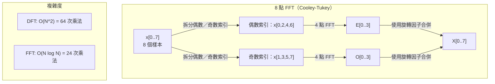
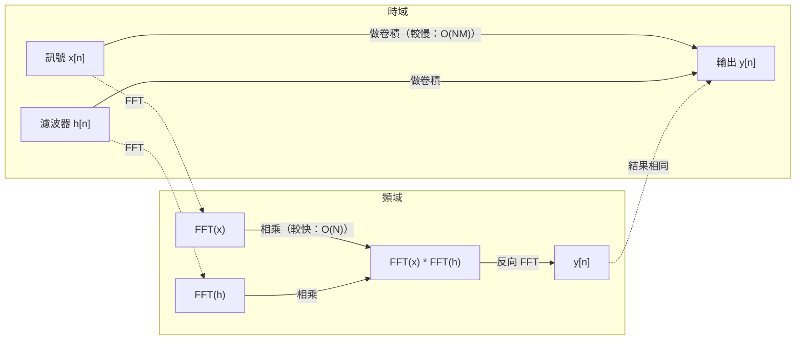

# 傅立葉轉換

> 每個訊號都能表示成多個正弦波的總和。傅立葉轉換會告訴你其中有哪些正弦波。

**Type:** Build
**Language:** Python
**Prerequisites:** Phase 1, Lessons 01-04, 19 (complex numbers)
**Time:** ~90 minutes

## 學習目標

- 從零實作 DFT，並與 O(N log N) 的 Cooley-Tukey FFT 比對驗證
- 解讀頻率係數：從訊號中取出振幅、相位與功率頻譜
- 應用卷積定理，透過 FFT 頻域相乘來計算卷積
- 說明傅立葉頻率分解與 Transformer 位置編碼及 CNN 卷積層的關聯

## 問題

音訊錄音是隨時間記錄的一連串氣壓測量值；股價是按天排列的一連串數值；影像則是由空間中的像素亮度組成的網格。這些資料都位於時域（或空間域），也就是依某個索引觀察數值如何變化。

但在時域中，許多模式並不明顯。這段音訊是純音還是和弦？股價是否有每週循環？影像是否有重複紋理？這些問題都與頻率成分有關，而時域會把它們藏起來。

傅立葉轉換會把資料從時域轉換到頻域，將訊號分解成不同頻率的正弦波。每個正弦波都有振幅（強度）和相位（起始位置），傅立葉轉換會同時告訴你這兩者。

頻域思維在機器學習中隨處可見，因此這個概念很重要。卷積神經網路會執行卷積，而卷積在頻域中等同於相乘；Transformer 的位置編碼會用頻率分解來表示位置；音訊模型（語音辨識、音樂生成）會處理聲音的頻率表示，也就是頻譜圖；時間序列模型則會尋找週期模式。理解傅立葉轉換，就能掌握處理這些問題所需的語彙。

## 核心概念

### DFT 的定義

給定 N 個樣本 x[0], x[1], ..., x[N-1]，離散傅立葉轉換（DFT）會產生 N 個頻率係數 X[0], X[1], ..., X[N-1]：

```text
X[k] = sum_{n=0}^{N-1} x[n] * e^(-2*pi*i*k*n/N)

for k = 0, 1, ..., N-1
```

每個 X[k] 都是複數。它的大小 |X[k]| 表示頻率 k 的振幅；相位角 angle(X[k]) 則表示該頻率的相位偏移。

關鍵觀念是：`e^(-2*pi*i*k*n/N)` 是以頻率 k 旋轉的相量。DFT 會計算訊號與 N 個等間距頻率各自的相關性。如果訊號含有頻率 k 的能量，相關值就會很大；若沒有，相關值就會接近零。

### 各係數代表的意義

**X[0]：DC 分量。** 這是所有樣本的總和，與平均值成正比，代表訊號中固定不變的（零頻率）偏移量。

```text
X[0] = sum_{n=0}^{N-1} x[n] * e^0 = sum of all samples
```

**X[k]，其中 1 <= k <= N/2：正頻率。** X[k] 代表每 N 個樣本中出現 k 個週期的頻率。k 越大，頻率越高（振盪越快）。

**X[N/2]：奈奎斯特頻率。** 這是 N 個樣本所能表示的最高頻率。高於此頻率就會發生混疊：高頻看起來像低頻。

**X[k]，其中 N/2 < k < N：負頻率。** 對實數訊號而言，X[N-k] = conj(X[k])。負頻率是正頻率的鏡像，因此有用的資訊只在前 N/2 + 1 個係數中。

### 反向 DFT

反向 DFT 會從頻率係數還原原始訊號：

```text
x[n] = (1/N) * sum_{k=0}^{N-1} X[k] * e^(2*pi*i*k*n/N)

for n = 0, 1, ..., N-1
```

與正向 DFT 相比，只有兩處不同：指數中的正負號改為正號（而非負號），並且要乘上 1/N 正規化因子。

反向 DFT 可以完美還原訊號，不會遺失任何資訊。你可以在時域與頻域之間來回轉換而不產生誤差。DFT 是一種基底轉換，也就是用不同的座標系統重新表示相同資訊。

### FFT：加快計算速度

依照上述定義直接計算 DFT，時間複雜度是 O(N²)：N 個輸出係數各自都要對 N 個輸入樣本求和。若 N = 1 百萬，就需要 10¹² 次運算。

快速傅立葉轉換（FFT）能以 O(N log N) 的複雜度計算出相同結果。若 N = 1 百萬，大約只需 2,000 萬次運算，而不是 1 兆次。這讓頻率分析變得實用。

最常見的 FFT 是 Cooley-Tukey 演算法，採用分治法：

1. 將訊號拆成偶數索引與奇數索引的樣本。
2. 遞迴計算兩半各自的 DFT。
3. 使用「旋轉因子」e^(-2*pi*i*k/N) 合併兩個半長度的 DFT。

```text
X[k] = E[k] + e^(-2*pi*i*k/N) * O[k]          for k = 0, ..., N/2 - 1
X[k + N/2] = E[k] - e^(-2*pi*i*k/N) * O[k]    for k = 0, ..., N/2 - 1

where E = DFT of even-indexed samples
      O = DFT of odd-indexed samples
```

由於對稱性，每一層遞迴只需 O(N) 的工作量，而遞迴共有 log₂(N) 層，因此總複雜度為 O(N log N)。



FFT 要求訊號長度是 2 的冪次方。實務上會在訊號末端補零，使長度達到下一個 2 的冪次方。

### 頻譜分析

**功率頻譜**是 |X[k]|²，也就是每個頻率係數的模長平方。它呈現各頻率上的能量大小。

**相位頻譜**是 angle(X[k])，也就是每個頻率的相位偏移。多數分析工作只關心功率頻譜，會忽略相位。

```text
頻率 k 的功率：P[k] = |X[k]|^2 = X[k].real^2 + X[k].imag^2
頻率 k 的相位：phi[k] = atan2(X[k].imag, X[k].real)
```

### 頻率解析度

DFT 的頻率解析度取決於樣本數 N 和取樣率 fs。

```text
頻率格點 k：           f_k = k * fs / N
頻率解析度：            delta_f = fs / N
最高頻率：              f_max = fs / 2  (Nyquist)
```

若要分辨彼此接近的兩個頻率，就需要更多樣本；若要擷取更高頻率，則需要更高的取樣率。

### 卷積定理

這是訊號處理中最重要的結果之一，也與 CNN 直接相關。

**時域中的卷積，等同於頻域中的逐點相乘。**

```text
x * h = IFFT(FFT(x) . FFT(h))

其中 * 代表卷積，. 代表逐元素相乘
```

這個結果的重要性如下：

- 直接對長度為 N 和 M 的兩個訊號做卷積，需要 O(N*M) 次運算。
- 使用 FFT 做卷積的複雜度是 O(N log N)：先轉換兩個訊號、相乘，再轉換回來。
- 對大型核心而言，FFT 卷積會快上許多。
- 具有大型感受野的卷積層正是這種運算的應用。

注意：DFT 計算的是循環卷積（訊號會環繞回開頭）。若要計算線性卷積（不環繞），請先將兩個訊號補零至長度 N + M - 1。



### 加窗

DFT 假設訊號具有週期性，也就是把 N 個樣本視為無限重複訊號的一個週期。如果訊號的起點與終點數值不同，邊界就會出現不連續，並呈現為多餘的高頻成分。這種現象稱為頻譜洩漏。

加窗會在計算 DFT 前，讓訊號兩端逐漸衰減至零，以減少頻譜洩漏。

常見的窗函數：

| 窗函數 | 形狀 | 主瓣寬度 | 側瓣高度 | 用途 |
|--------|------|----------|----------|------|
| 矩形窗 | 平坦（不加窗） | 最窄 | 最高（-13 dB） | 訊號在 N 個樣本內恰好為週期時使用 |
| Hann 窗 | 升餘弦 | 中等 | 低（-31 dB） | 通用頻譜分析 |
| Hamming 窗 | 修正餘弦 | 中等 | 較低（-42 dB） | 音訊處理、語音分析 |
| Blackman 窗 | 三項餘弦 | 寬 | 極低（-58 dB） | 必須抑制側瓣時使用 |

```text
Hann window:    w[n] = 0.5 * (1 - cos(2*pi*n / (N-1)))
Hamming window: w[n] = 0.54 - 0.46 * cos(2*pi*n / (N-1))
```

在計算 DFT 前，將窗函數與訊號逐元素相乘即可套用窗函數：`X = DFT(x * w)`。

### DFT 的性質

| 性質 | 時域 | 頻域 |
|------|------|------|
| 線性 | a*x + b*y | a*X + b*Y |
| 時間位移 | x[n - k] | X[f] * e^(-2*pi*i*f*k/N) |
| 頻率位移 | x[n] * e^(2*pi*i*f0*n/N) | X[f - f0] |
| 卷積 | x * h | X * H（逐點相乘） |
| 相乘 | x * h（逐點相乘） | X * H（循環卷積，並乘上 1/N） |
| Parseval 定理 | sum \|x[n]\|^2 | (1/N) * sum \|X[k]\|^2 |
| 共軛對稱（實數輸入） | x[n] 為實數 | X[k] = conj(X[N-k]) |

Parseval 定理指出，兩個域中的總能量相同；經過轉換後，能量仍會守恆。

### 與位置編碼的關聯

原始 Transformer 使用正弦位置編碼：

```text
PE(pos, 2i)   = sin(pos / 10000^(2i/d_model))
PE(pos, 2i+1) = cos(pos / 10000^(2i/d_model))
```

每一組維度 (2i, 2i+1) 都會以不同頻率振盪。頻率從高（維度 0、1）到低（最後幾個維度）呈幾何級數分布。這會讓每個位置在所有頻帶中都有獨特的模式，類似傅立葉係數能唯一識別訊號。

這種編碼具備以下關鍵性質：

- **唯一性：** 任意兩個位置的編碼都不相同。
- **數值有界：** sin 和 cos 的值永遠介於 [-1, 1]。
- **相對位置：** 位置 p+k 的編碼可表示為位置 p 編碼的線性函數。模型可以學會依相對位置來進行注意力運算。

### 與 CNN 的關聯

卷積層會將學得的濾波器（核心）滑過訊號或影像，數學上這就是卷積運算。

根據卷積定理，這等同於：
1. 對輸入執行 FFT
2. 對核心執行 FFT
3. 在頻域中相乘
4. 對結果執行 IFFT

標準 CNN 實作會直接計算卷積（對小型 3x3 核心而言較快）。但面對大型核心或全域卷積時，採用 FFT 的方法會快得多。有些架構（例如 FNet）會完全以 FFT 取代注意力，並以 O(N log N) 而非 O(N²) 的複雜度達到相近的準確率。

### 頻譜圖與短時傅立葉轉換

一次 FFT 能提供整段訊號的頻率成分，卻無法告訴你這些頻率在何時出現。啁啾訊號（頻率隨時間增加的訊號）和和弦（所有頻率同時出現）可能具有相同的振幅頻譜。

短時傅立葉轉換（STFT）會對訊號中互相重疊的區段分別計算 FFT，以解決這個問題。產生的頻譜圖是二維表示法，橫軸為時間、縱軸為頻率。各位置的強度代表該時間點、該頻率上的能量。

```text
STFT 步驟：
1. 選擇窗長（例如 1024 個樣本）
2. 選擇 hop size（例如 256 個樣本，重疊 75%）
3. 對每個視窗位置：
   a. 擷取加窗後的區段
   b. 套用 Hann 或 Hamming 窗
   c. 計算 FFT
   d. 將振幅頻譜存為頻譜圖中的一欄
```

頻譜圖是音訊機器學習模型的標準輸入表示法。語音辨識模型（Whisper、DeepSpeech）會處理梅爾頻譜圖，也就是將頻率映射到梅爾音階的頻譜圖；梅爾音階更符合人類對音高的感知。

### 混疊

如果訊號含有高於 fs/2（奈奎斯特頻率）的成分，以 fs 的取樣率取樣時就會產生混疊。以 100 Hz 取樣率取樣時，90 Hz 訊號看起來會和 10 Hz 訊號完全相同；單靠樣本無法分辨兩者。

```text
範例：
  真實訊號：90 Hz 正弦波
  取樣率：100 Hz
  觀測到的頻率：100 - 90 = 10 Hz

  以 100 Hz 取樣率取得的 90 Hz 訊號樣本
  與 10 Hz 訊號的樣本完全相同。
  無論使用什麼數學方法，都無法還原原始的 90 Hz 訊號。
```

因此，類比數位轉換器會在取樣前使用抗混疊濾波器，移除高於奈奎斯特頻率的成分。在機器學習中，若特徵圖未經適當的低通濾波就降採樣，也會出現混疊；有些架構會透過抗混疊池化層處理這個問題。

### 補零不會提高解析度

常見的誤解是：在 FFT 前對訊號補零會提高頻率解析度。事實並非如此。補零只會在既有的頻率格點之間插值，讓頻譜看起來更平滑，卻無法顯示原始樣本中不存在的頻率細節。

真正的頻率解析度只取決於觀測時間 T = N / fs。若要分辨相差 delta_f 的兩個頻率，至少需要取得 T = 1 / delta_f 秒的資料。補再多零也無法改變這項基本限制。

```figure
fourier-synthesis
```

## Build It：從零實作

### 步驟 1：從零實作 DFT

O(N²) 的 DFT 可直接依照定義實作。

```python
import math

class Complex:
    ...

def dft(x):
    N = len(x)
    result = []
    for k in range(N):
        total = Complex(0, 0)
        for n in range(N):
            angle = -2 * math.pi * k * n / N
            w = Complex(math.cos(angle), math.sin(angle))
            xn = x[n] if isinstance(x[n], Complex) else Complex(x[n])
            total = total + xn * w
        result.append(total)
    return result
```

### 步驟 2：反向 DFT

結構相同，但指數改用正號，並除以 N。

```python
def idft(X):
    N = len(X)
    result = []
    for n in range(N):
        total = Complex(0, 0)
        for k in range(N):
            angle = 2 * math.pi * k * n / N
            w = Complex(math.cos(angle), math.sin(angle))
            total = total + X[k] * w
        result.append(Complex(total.real / N, total.imag / N))
    return result
```

### 步驟 3：FFT（Cooley-Tukey）

遞迴 FFT 要求輸入長度是 2 的冪次方。先拆成偶數與奇數索引，再遞迴計算，最後用旋轉因子合併。

```python
def fft(x):
    N = len(x)
    if N <= 1:
        return [x[0] if isinstance(x[0], Complex) else Complex(x[0])]
    if N % 2 != 0:
        return dft(x)

    even = fft([x[i] for i in range(0, N, 2)])
    odd = fft([x[i] for i in range(1, N, 2)])

    result = [Complex(0)] * N
    for k in range(N // 2):
        angle = -2 * math.pi * k / N
        twiddle = Complex(math.cos(angle), math.sin(angle))
        t = twiddle * odd[k]
        result[k] = even[k] + t
        result[k + N // 2] = even[k] - t
    return result
```

### 步驟 4：頻譜分析輔助函式

```python
def power_spectrum(X):
    return [xk.real ** 2 + xk.imag ** 2 for xk in X]

def convolve_fft(x, h):
    N = len(x) + len(h) - 1
    padded_N = 1
    while padded_N < N:
        padded_N *= 2

    x_padded = x + [0.0] * (padded_N - len(x))
    h_padded = h + [0.0] * (padded_N - len(h))

    X = fft(x_padded)
    H = fft(h_padded)

    Y = [xk * hk for xk, hk in zip(X, H)]

    y = idft(Y)
    return [y[n].real for n in range(N)]
```

## Use It：實際應用

若要用於實際工作，請使用由高度最佳化 C 函式庫支援的 NumPy FFT。

```python
import numpy as np

signal = np.sin(2 * np.pi * 5 * np.arange(256) / 256)
spectrum = np.fft.fft(signal)
freqs = np.fft.fftfreq(256, d=1/256)

power = np.abs(spectrum) ** 2

positive_freqs = freqs[:len(freqs)//2]
positive_power = power[:len(power)//2]
```

加窗與進階頻譜分析可使用：

```python
from scipy.signal import windows, stft

window = windows.hann(256)
windowed = signal * window
spectrum = np.fft.fft(windowed)
```

卷積可使用：

```python
from scipy.signal import fftconvolve

result = fftconvolve(signal, kernel, mode='full')
```

頻譜圖可使用：

```python
from scipy.signal import stft

frequencies, times, Zxx = stft(signal, fs=sample_rate, nperseg=256)
spectrogram = np.abs(Zxx) ** 2
```

頻譜圖矩陣的形狀為 (n_frequencies, n_time_frames)。每一欄是某個時間窗內的功率頻譜，這就是音訊機器學習模型會使用的輸入。

## Ship It：交付成果

執行 `code/fourier.py`，產生 `outputs/prompt-spectral-analyzer.md`。

## Exercises：練習

1. **辨識純音。** 建立一個頻率未知（介於 1 到 50 Hz）的單一正弦波訊號，以 128 Hz 取樣率取樣 1 秒。使用你的 DFT 找出頻率，並驗證答案是否正確。接著加入標準差為 0.5 的高斯雜訊，再重做一次。雜訊會如何影響頻譜？

2. **驗證 FFT 與 DFT。** 產生一個長度為 64 的隨機訊號，分別計算 DFT（O(N²)）和 FFT，並確認所有係數的差異都在 1e-10 以內。接著測量兩個函式處理長度為 256、512、1024 和 2048 的訊號所需時間，並繪出 DFT 時間與 FFT 時間的比值。

3. **以範例驗證卷積定理。** 建立訊號 x = [1, 2, 3, 4, 0, 0, 0, 0] 和濾波器 h = [1, 1, 1, 0, 0, 0, 0, 0]。使用巢狀迴圈直接計算它們的循環卷積，再透過 FFT 計算（轉換、相乘、反向轉換），並確認兩者結果相同。接著適當補零，計算線性卷積。

4. **觀察加窗效果。** 建立由 10 Hz 和 12 Hz（頻率非常接近）兩個正弦波組成的訊號，以 128 Hz 取樣率取樣 1 秒。分別使用不加窗、Hann 窗和 Hamming 窗計算功率頻譜。哪一種窗最容易分辨兩個峰值？為什麼？

5. **分析位置編碼。** 產生 d_model = 128、max_pos = 512 的正弦位置編碼。對每一組位置 (p1, p2)，計算兩者編碼的內積。說明內積只取決於 |p1 - p2|，而不取決於位置本身。距離增加時，內積會如何變化？

## 關鍵詞

| 術語 | 說明 |
|------|------|
| DFT（離散傅立葉轉換） | 將 N 個時域樣本轉換成 N 個頻域係數。每個係數都是訊號與該頻率複數正弦波的相關性 |
| FFT（快速傅立葉轉換） | 以 O(N log N) 複雜度計算 DFT 的演算法。Cooley-Tukey 演算法會遞迴拆分偶數與奇數索引 |
| 反向 DFT | 從頻率係數還原時域訊號。公式與 DFT 相同，但指數符號相反，並乘上 1/N |
| 頻率格點 | DFT 輸出中的索引 k 代表頻率 k*fs/N Hz；每個格點對應一個離散頻率 |
| DC 分量 | X[0]，零頻率係數，與訊號平均值成正比 |
| 奈奎斯特頻率 | fs/2，是取樣率 fs 下可表示的最高頻率。高於此值的頻率會發生混疊 |
| 功率頻譜 | \|X[k]\|^2，也就是每個頻率係數的模長平方，呈現各頻率上的能量分布 |
| 相位頻譜 | angle(X[k])，各頻率成分的相位偏移；分析時常會忽略 |
| 頻譜洩漏 | 將非週期訊號視為週期訊號所造成的多餘頻率成分，可透過加窗減少 |
| 窗函數 | 在 DFT 前套用的漸變函數（Hann、Hamming、Blackman），可減少頻譜洩漏 |
| 旋轉因子 | FFT 蝶形運算中用來合併子 DFT 的複指數 e^(-2*pi*i*k/N) |
| 卷積定理 | 時域卷積等同於頻域逐點相乘，是訊號處理和 CNN 的重要基礎 |
| 循環卷積 | 訊號會環繞回開頭的卷積，也是 DFT 自然計算的卷積形式 |
| 線性卷積 | 不會環繞的標準卷積，可在 DFT 前補零來計算 |
| Parseval 定理 | 傅立葉轉換會保留總能量：sum \|x[n]\|^2 = (1/N) sum \|X[k]\|^2 |
| 混疊 | 取樣率不足時，高於奈奎斯特頻率的成分會呈現為較低頻率 |

## 延伸閱讀

- [Cooley 與 Tukey：用於複數傅立葉級數計算的演算法（1965）](https://www.ams.org/journals/mcom/1965-19-090/S0025-5718-1965-0178586-1/)：開創 FFT 的原始論文
- [3Blue1Brown：傅立葉轉換是什麼？](https://www.youtube.com/watch?v=spUNpyF58BY)：傅立葉轉換的視覺化入門
- [Lee-Thorp 等人：FNet：用傅立葉轉換混合詞元（2021）](https://arxiv.org/abs/2105.03824)：在 Transformer 中以 FFT 取代自我注意力
- [Smith：科學家與工程師的數位訊號處理指南](http://www.dspguide.com/)：免費線上教材，深入介紹 FFT、加窗與頻譜分析
- [Vaswani 等人：Attention Is All You Need（2017）](https://arxiv.org/abs/1706.03762)：說明源自傅立葉頻率分解的正弦位置編碼
- [Radford 等人：Whisper（2022）](https://arxiv.org/abs/2212.04356)：使用梅爾頻譜圖作為輸入表示法的語音辨識
