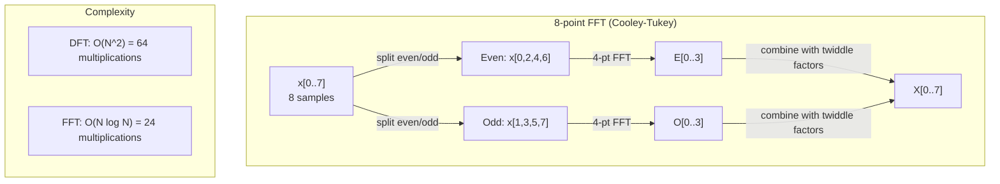
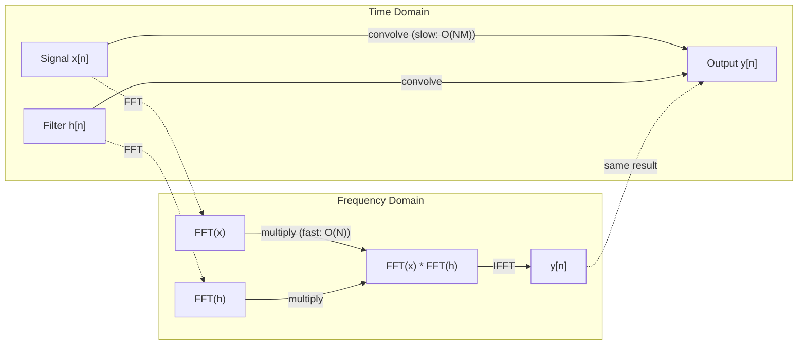

# 傅立葉轉換

> 每個訊號（signal）都是正弦波（sine waves）的總和。傅立葉轉換（Fourier transform）會告訴你其中有哪些正弦波。

**Type:** Build
**Language:** Python
**Prerequisites:** Phase 1, Lessons 01-04, 19 (complex numbers)
**Time:** ~90 minutes

## Learning Objectives｜學習目標

- 從頭實作離散傅立葉轉換（Discrete Fourier Transform，DFT），並與複雜度為 O(N log N) 的 Cooley-Tukey 快速傅立葉轉換（Fast Fourier Transform，FFT）比對驗證
- 解讀頻率係數（frequency coefficients）：從訊號擷取振幅（amplitude）、相位（phase）與功率頻譜（power spectrum）
- 套用卷積定理（convolution theorem），透過 FFT 乘法進行卷積（convolution）
- 連結傅立葉頻率分解（Fourier frequency decomposition）與 transformer 位置編碼（positional encoding），以及 CNN 卷積層（convolutional layer）

## The Problem｜問題

音訊錄音是一串隨時間變化的氣壓量測值。股價是一串按日排列的數值。影像則是空間中像素強度構成的網格。這些資料都可視為時域（time domain）或空間域（space domain）的資料；你看到的是依某個索引變化的數值。

但許多模式在時域中看不出來。這段音訊是純音還是和弦（chord）？股價有每週週期嗎？影像中是否有重複紋理？這些問題都與頻率成分有關，而時域會把這些資訊藏起來。

傅立葉轉換會將資料從時域轉換到頻域（frequency domain），把訊號分解成不同頻率的正弦波。每個正弦波都有振幅（amplitude，代表強度）和相位（phase，代表它從哪裡開始）。傅立葉轉換會同時告訴你這兩者。

這對 ML 很重要，因為頻域思維無所不在。卷積神經網路（convolutional neural networks，CNN）會執行卷積，而卷積在頻域中等同於乘法。Transformer 的位置編碼會使用頻率分解來表示位置。音訊模型（語音辨識、音樂生成）會以頻譜圖（spectrogram）——聲音的頻率表示法——以頻譜圖作為輸入表示。時間序列（time series）模型會尋找週期模式。理解傅立葉轉換，就能掌握處理這些問題所需的詞彙。

## The Concept｜核心概念

### 離散傅立葉轉換的定義

給定 N 個樣本 x[0], x[1], ..., x[N-1]，離散傅立葉轉換（Discrete Fourier Transform，DFT）會產生 N 個頻率係數 X[0], X[1], ..., X[N-1]：

```
X[k] = sum_{n=0}^{N-1} x[n] * e^(-2*pi*i*k*n/N)

for k = 0, 1, ..., N-1
```

每個 X[k] 都是複數。它的模（magnitude）|X[k]| 代表頻率 k 的振幅；相位角（phase angle）angle(X[k]) 則代表該頻率的相位偏移。

關鍵在於：`e^(-2*pi*i*k*n/N)` 是頻率為 k 的旋轉相量（phasor）。DFT 會計算訊號與 N 個等距頻率之間的相關性（correlation）。如果訊號在頻率 k 含有能量，相關值就會很大；否則會接近零。

### 各係數的意義

**X[0]：直流分量（DC component）。** 這是所有樣本的總和，與平均值成正比。它代表訊號的常數（零頻率）偏移。

```
X[0] = sum_{n=0}^{N-1} x[n] * e^0 = sum of all samples
```

**X[k]，其中 1 <= k <= N/2：正頻率。** X[k] 代表每 N 個樣本中完成 k 個週期的頻率。k 越大，頻率越高（振盪越快）。

**X[N/2]：奈奎斯特頻率（Nyquist frequency）。** 使用 N 個樣本能表示的最高頻率。超過此頻率就會產生混疊（aliasing）——高頻看起來會像低頻。

**X[k]，其中 N/2 < k < N：負頻率。** 對實值訊號而言（real-valued signals），X[N-k] = conj(X[k])，形成共軛對稱（conjugate symmetry）。負頻率與正頻率互為對稱。因此，有用的資訊只在前 N/2 + 1 個係數中。

### 反離散傅立葉轉換

反離散傅立葉轉換（inverse discrete Fourier transform，IDFT）會從頻率係數重建原始訊號：

```
x[n] = (1/N) * sum_{k=0}^{N-1} X[k] * e^(2*pi*i*k*n/N)

for n = 0, 1, ..., N-1
```

它與正向 DFT 只有兩處不同：指數中的負號改為正號，並多了 1/N 正規化因子。

IDFT 能完美重建原始資料，不會遺失資訊。你可以在時域和頻域之間來回轉換，不會產生誤差。DFT 是基底變換（change of basis）——它只是用另一種座標系統（coordinate system）重新表示相同的資訊。

### FFT：加快計算

依照上述定義直接計算 DFT，複雜度為 O(N^2)：N 個輸出係數各自都要對 N 個輸入樣本加總。當 N = 100 萬時，就需要 10^12 次運算。

快速傅立葉轉換（FFT）能以 O(N log N) 的複雜度計算相同結果。N = 100 萬時，只需約 2,000 萬次運算，而不是 1 兆次。這讓頻率分析變得可行。

最常見的 Cooley-Tukey 演算法（Cooley-Tukey algorithm）採用分治法：

1. 將訊號拆成偶數索引與奇數索引的樣本。
2. 遞迴計算兩半各自的 DFT。
3. 使用旋轉因子（twiddle factors）e^(-2*pi*i*k/N) 合併兩個較小的 DFT。

```
X[k] = E[k] + e^(-2*pi*i*k/N) * O[k]          for k = 0, ..., N/2 - 1
X[k + N/2] = E[k] - e^(-2*pi*i*k/N) * O[k]    for k = 0, ..., N/2 - 1

where E = DFT of even-indexed samples
      O = DFT of odd-indexed samples
```

由於對稱性，每層遞迴只需要 O(N) 次運算，而總共有 log2(N) 層。因此總複雜度為 O(N log N)。



FFT 要求訊號長度是 2 的次方。實務上會在訊號尾端補零（zero-padding），將長度補到下一個 2 的次方。

### 頻譜分析

**功率頻譜（power spectrum）**是 |X[k]|^2，也就是各頻率係數模的平方。它呈現各頻率的能量。

**相位頻譜（phase spectrum）**是 angle(X[k])，也就是各頻率的相位偏移。多數分析任務只需關心功率頻譜，不必理會相位。

```
Power at frequency k:  P[k] = |X[k]|^2 = X[k].real^2 + X[k].imag^2
Phase at frequency k:  phi[k] = atan2(X[k].imag, X[k].real)
```

### 頻率解析度

DFT 的頻率解析度（frequency resolution）取決於樣本數 N 和取樣率（sampling rate）fs。

```
Frequency of bin k:      f_k = k * fs / N
Frequency resolution:    delta_f = fs / N
Maximum frequency:       f_max = fs / 2  (Nyquist)
```

若要分辨彼此接近的兩個頻率，就需要更多樣本；若要捕捉更高頻率，則需要更高的取樣率。

### 卷積定理

這是訊號處理（signal processing）中最重要的結果之一，也與 CNN 直接相關。

**時域中的卷積（convolution），等於頻域中的逐點乘法（pointwise multiplication）。**

```
x * h = IFFT(FFT(x) . FFT(h))

where * is convolution and . is element-wise multiplication
```

重要性如下：

- 直接對長度為 N 和 M 的兩個訊號做卷積，需要 O(N*M) 次運算。
- 透過 FFT 卷積需要 O(N log N)：先轉換兩個訊號、相乘，再轉換回來。
- 對大型卷積核（convolution kernel），FFT 卷積快得多。
- 大型感受野（receptive fields）的卷積層正是這樣運作。

注意：DFT 計算的是循環卷積（circular convolution），也就是訊號會繞回開頭。若要計算線性卷積（linear convolution，不繞回），應先將兩個訊號補零至長度 N + M - 1。



### 加窗

DFT 將訊號視為週期訊號——它會將 N 個樣本視為無限重複訊號的一個週期。如果訊號起點與終點的數值不同，邊界就會出現不連續，並產生虛假的高頻成分。這稱為頻譜洩漏（spectral leakage）。

加窗（windowing）會在計算 DFT 前，讓訊號兩端逐漸衰減至零，以降低頻譜洩漏。

常見窗函數（window function）：

| 窗函數 | 形狀 | 主瓣（main lobe）寬度 | 旁瓣（side lobe）位準 | 使用情境 |
|--------|-------|----------------|-----------------|----------|
| 矩形窗（rectangular window） | 平坦（不加窗） | 最窄 | 最高（-13 dB） | 訊號在 N 個樣本中恰好呈週期性時 |
| Hann 窗 | 升餘弦曲線 | 中等 | 低（-31 dB） | 通用頻譜分析 |
| Hamming 窗 | 改良餘弦曲線 | 中等 | 較低（-42 dB） | 音訊處理、語音分析 |
| Blackman 窗 | 三重餘弦曲線 | 寬 | 非常低（-58 dB） | 必須強力抑制旁瓣時 |

```
Hann window:    w[n] = 0.5 * (1 - cos(2*pi*n / (N-1)))
Hamming window: w[n] = 0.54 - 0.46 * cos(2*pi*n / (N-1))
```

執行 DFT 前，將訊號與窗函數逐元素相乘：`X = DFT(x * w)`。

### DFT 的性質

| 性質 | 時域 | 頻域 |
|----------|-------------|-----------------|
| 線性（linearity） | a*x + b*y | a*X + b*Y |
| 時間位移（time shift） | x[n - k] | X[f] * e^(-2*pi*i*f*k/N) |
| 頻率偏移（frequency shift） | x[n] * e^(2*pi*i*f0*n/N) | X[f - f0] |
| 卷積（convolution） | x * h | X * H（逐點） |
| 乘法 | x * h（逐點） | X * H（循環卷積，並乘上 1/N） |
| 帕塞瓦爾定理（Parseval's theorem） | sum \|x[n]\|^2 | (1/N) * sum \|X[k]\|^2 |
| 共軛對稱（conjugate symmetry）（實值輸入） | x[n] real | X[k] = conj(X[N-k]) |

帕塞瓦爾定理指出，兩個領域的總能量相同。能量會在轉換過程中守恆（energy conservation）。

### 連結到位置編碼

原始 Transformer 使用正弦位置編碼（sinusoidal positional encoding）：

```
PE(pos, 2i)   = sin(pos / 10000^(2i/d_model))
PE(pos, 2i+1) = cos(pos / 10000^(2i/d_model))
```

每一對維度 (2i, 2i+1) 都以不同頻率振盪。這些頻率從高（維度 0、1）到低（最後幾個維度）按幾何級數分布。這會讓每個位置在所有頻帶（frequency bands）上都有獨特的模式，就像傅立葉係數能唯一識別訊號一樣。

這種編碼帶來幾個重要性質：

- **唯一性：** 不會有兩個位置得到相同的編碼。
- **數值有界：** sin 和 cos 的值永遠介於 [-1, 1]。
- **相對位置：** 位置 p+k 的編碼可表示為位置 p 編碼的線性函數。模型因此能學會關注相對位置。

### 連結到 CNN

卷積層會將學得的卷積核（convolution kernel）在訊號或影像輸入上滑動，執行卷積運算。

根據卷積定理，這等價於：
1. 對輸入執行 FFT。
2. 對卷積核執行 FFT。
3. 在頻域中相乘。
4. 對結果執行反快速傅立葉轉換（inverse fast Fourier transform，IFFT）。

標準 CNN 實作會使用直接卷積（對小型 3x3 卷積核較快）。但對大型卷積核或全域卷積，FFT 方法會快得多。有些架構（例如 FNet）完全以 FFT 取代注意力機制（attention），在 O(N log N) 而非 O(N^2) 的複雜度下達到具競爭力的準確率。

### 頻譜圖與短時傅立葉轉換

單次 FFT 能呈現整段訊號的頻率成分，卻無法告訴你這些頻率何時出現。啁啾訊號（chirp；頻率隨時間增加的訊號）與和弦（所有頻率同時出現），可能有相同的振幅頻譜（magnitude spectrum）。

短時傅立葉轉換（Short-Time Fourier Transform，STFT）會對訊號中彼此重疊的視窗（windows）逐一計算 FFT。結果稱為頻譜圖（spectrogram）：這是一種二維表示法，一軸是時間，另一軸是頻率。每個位置的強度代表該時刻、該頻率的能量。

```
STFT procedure:
1. Choose a window size (e.g., 1024 samples)
2. Choose a hop size (e.g., 256 samples -- 75% overlap)
3. For each window position:
   a. Extract the windowed segment
   b. Apply a Hann/Hamming window
   c. Compute FFT
   d. Store the magnitude spectrum as one column of the spectrogram
```

頻譜圖是音訊 ML 模型常用的標準輸入表示法。語音辨識模型（Whisper、DeepSpeech）會使用梅爾頻譜圖（mel-spectrogram）——將頻率映射到梅爾刻度（mel scale）的頻譜圖，更貼近人類的音高感知（pitch perception）。

### 混疊

如果訊號包含高於 fs/2（奈奎斯特頻率）的成分，以 fs 的取樣率取樣就會產生混疊副本。以 100 Hz 取樣率取樣的 90 Hz 訊號，取樣結果會與 10 Hz 訊號完全相同。光靠這些樣本，無法分辨兩者。

```
Example:
  True signal: 90 Hz sine wave
  Sampling rate: 100 Hz
  Apparent frequency: 100 - 90 = 10 Hz

  The samples from the 90 Hz signal at 100 Hz sampling rate
  are identical to the samples from a 10 Hz signal.
  No amount of math can recover the original 90 Hz.
```

因此，類比數位轉換裝置（analog-to-digital converters）會在取樣前使用抗混疊濾波器（anti-aliasing filter），移除高於奈奎斯特頻率的成分。在 ML 中，若未先使用適當的低通濾波器（low-pass filter）就對特徵圖（feature maps）降採樣（downsampling），也會出現混疊；有些架構會透過抗混疊池化（anti-aliased pooling）處理這個問題。

### 補零不會提高解析度

常見的誤解是：在 FFT 前對訊號補零（zero-padding）能提高頻率解析度。其實不會。補零只會在既有頻率槽（frequency bins）之間插值，讓頻譜看起來更平滑，卻無法揭露原始樣本中不存在的頻率細節。

真正的頻率解析度只取決於觀測時間（observation time）T = N / fs。若要分辨相差 delta_f 的兩個頻率，至少需要 T = 1 / delta_f 秒的資料。再多補零也無法改變這個基本限制。

```figure
fourier-synthesis
```

## Build It｜動手實作

### 步驟 1：從頭實作 DFT

O(N^2) 的 DFT 直接來自定義式。

```python
import math

class Complex:
    ...

def dft(x):
    N = len(x)
    result = []
    for k in range(N):
        total = Complex(0, 0)
        for n in range(N):
            angle = -2 * math.pi * k * n / N
            w = Complex(math.cos(angle), math.sin(angle))
            xn = x[n] if isinstance(x[n], Complex) else Complex(x[n])
            total = total + xn * w
        result.append(total)
    return result
```

### 步驟 2：反離散傅立葉轉換

結構相同，但指數改為正號，並除以 N。

```python
def idft(X):
    N = len(X)
    result = []
    for n in range(N):
        total = Complex(0, 0)
        for k in range(N):
            angle = 2 * math.pi * k * n / N
            w = Complex(math.cos(angle), math.sin(angle))
            total = total + X[k] * w
        result.append(Complex(total.real / N, total.imag / N))
    return result
```

### 步驟 3：FFT（Cooley-Tukey）

遞迴 FFT 要求輸入長度是 2 的次方。將樣本拆成偶數索引與奇數索引，遞迴計算，再用旋轉因子合併。

```python
def fft(x):
    N = len(x)
    if N <= 1:
        return [x[0] if isinstance(x[0], Complex) else Complex(x[0])]
    if N % 2 != 0:
        return dft(x)

    even = fft([x[i] for i in range(0, N, 2)])
    odd = fft([x[i] for i in range(1, N, 2)])

    result = [Complex(0)] * N
    for k in range(N // 2):
        angle = -2 * math.pi * k / N
        twiddle = Complex(math.cos(angle), math.sin(angle))
        t = twiddle * odd[k]
        result[k] = even[k] + t
        result[k + N // 2] = even[k] - t
    return result
```

### 步驟 4：頻譜分析輔助函式

```python
def power_spectrum(X):
    return [xk.real ** 2 + xk.imag ** 2 for xk in X]

def convolve_fft(x, h):
    N = len(x) + len(h) - 1
    padded_N = 1
    while padded_N < N:
        padded_N *= 2

    x_padded = x + [0.0] * (padded_N - len(x))
    h_padded = h + [0.0] * (padded_N - len(h))

    X = fft(x_padded)
    H = fft(h_padded)

    Y = [xk * hk for xk, hk in zip(X, H)]

    y = idft(Y)
    return [y[n].real for n in range(N)]
```

## Use It｜實際應用

實際工作中，使用由高度最佳化 C 函式庫支援的 numpy FFT。

```python
import numpy as np

signal = np.sin(2 * np.pi * 5 * np.arange(256) / 256)
spectrum = np.fft.fft(signal)
freqs = np.fft.fftfreq(256, d=1/256)

power = np.abs(spectrum) ** 2

positive_freqs = freqs[:len(freqs)//2]
positive_power = power[:len(power)//2]
```

若要加窗或做更進階的頻譜分析：

```python
from scipy.signal import windows, stft

window = windows.hann(256)
windowed = signal * window
spectrum = np.fft.fft(windowed)
```

若要計算卷積：

```python
from scipy.signal import fftconvolve

result = fftconvolve(signal, kernel, mode='full')
```

若要產生頻譜圖：

```python
from scipy.signal import stft

frequencies, times, Zxx = stft(signal, fs=sample_rate, nperseg=256)
spectrogram = np.abs(Zxx) ** 2
```

頻譜圖矩陣的形狀為 (n_frequencies, n_time_frames)。每一欄都是一個時間視窗的功率頻譜。這就是音訊 ML 模型會接收的輸入。

## Ship It｜交付成果

執行 `code/fourier.py`，產生 `outputs/prompt-spectral-analyzer.md`。

## Exercises｜練習

1. **辨識純音（pure tone）。** 建立一個頻率未知（介於 1 至 50 Hz）的單一正弦波訊號，以 128 Hz 取樣率取樣 1 秒。使用 DFT 找出頻率，並驗證結果。接著加入標準差為 0.5 的高斯雜訊（Gaussian noise），再做一次。雜訊如何影響頻譜？

2. **驗證 FFT 與 DFT。** 產生長度為 64 的隨機訊號。分別計算 DFT（O(N^2)）和 FFT，驗證所有係數的差異都小於 1e-10。接著對長度為 256、512、1024、2048 的訊號計時，並繪製 DFT 時間除以 FFT 時間的比值。

3. **用例子驗證卷積定理。** 建立訊號 x = [1, 2, 3, 4, 0, 0, 0, 0] 和濾波器 h = [1, 1, 1, 0, 0, 0, 0, 0]。先用巢狀迴圈直接計算循環卷積，再透過 FFT 計算（轉換、相乘、反轉換），並驗證結果一致。接著適當補零，計算線性卷積。

4. **加窗的影響。** 建立一個由 10 Hz 和 12 Hz 兩個非常接近的正弦波相加而成的訊號，以 128 Hz 取樣 1 秒。分別使用不加窗、Hann 窗和 Hamming 窗計算功率頻譜。哪一種窗最容易讓你分辨兩個峰值？為什麼？

5. **分析位置編碼。** 產生 d_model = 128、max_pos = 512 的正弦位置編碼。對每一組位置 (p1, p2)，計算其編碼向量的內積。證明內積只取決於 |p1 - p2|，而非位置的絕對值。距離增加時，內積會如何變化？

## Key Terms｜關鍵術語

| 術語 | 定義 |
|------|---------------|
| DFT（Discrete Fourier Transform） | 將 N 個時域樣本轉換成 N 個頻域係數。每個係數都是訊號與該頻率複數正弦訊號（complex sinusoid）的相關值。 |
| FFT（Fast Fourier Transform） | 以 O(N log N) 計算 DFT 的演算法。Cooley-Tukey 演算法會遞迴拆分偶數與奇數索引。 |
| 反離散傅立葉轉換（Inverse DFT） | 從頻率係數重建時域訊號。公式與 DFT 相同，但指數符號相反，並乘上 1/N。 |
| 頻率槽（frequency bin） | DFT 輸出中的每個索引 k 都代表頻率 k*fs/N Hz；「槽」是離散的頻率位置。 |
| 直流分量（DC component） | X[0]，零頻率係數，與訊號平均值成正比。 |
| 奈奎斯特頻率（Nyquist frequency） | fs/2，也就是取樣率 fs 可表示的最高頻率。高於此頻率的成分會混疊。 |
| 功率頻譜（power spectrum） | 各頻率係數模的平方 \|X[k]\|^2，呈現頻率間的能量分布。 |
| 相位頻譜（phase spectrum） | angle(X[k])，即各頻率成分的相位偏移；分析時常會忽略。 |
| 頻譜洩漏（spectral leakage） | 把非週期訊號當作週期訊號處理而產生的虛假頻率成分；可用加窗降低。 |
| 窗函數（window function） | 在 DFT 前套用於訊號、使兩端逐漸衰減以降低頻譜洩漏的函數（Hann、Hamming、Blackman）。 |
| 旋轉因子（twiddle factor） | FFT 蝶形運算（butterfly computation）中用來合併子 DFT 的複指數函數 e^(-2*pi*i*k/N)。 |
| 卷積定理（convolution theorem） | 時域卷積等於頻域逐點乘法，是訊號處理和 CNN 的基礎。 |
| 循環卷積（circular convolution） | 訊號會繞回開頭的卷積；這是 DFT 自然計算的形式。 |
| 線性卷積（linear convolution） | 不會繞回的標準卷積；可在 DFT 前補零來計算。 |
| 帕塞瓦爾定理（Parseval's theorem） | 傅立葉轉換前後的總能量守恆。sum \|x[n]\|^2 = (1/N) sum \|X[k]\|^2。 |
| 混疊（aliasing） | 取樣率不足時，高於奈奎斯特頻率的成分會以較低頻率出現。 |

## Further Reading｜延伸閱讀

- [Cooley & Tukey: An Algorithm for the Machine Calculation of Complex Fourier Series (1965)](https://www.ams.org/journals/mcom/1965-19-090/S0025-5718-1965-0178586-1/) - 改變計算領域的原始 FFT 論文
- [3Blue1Brown: But what is the Fourier Transform?](https://www.youtube.com/watch?v=spUNpyF58BY) - 最佳的傅立葉轉換視覺化入門
- [Lee-Thorp et al.: FNet: Mixing Tokens with Fourier Transforms (2021)](https://arxiv.org/abs/2105.03824) - 在 transformer 中以 FFT 取代自注意力
- [Smith: The Scientist and Engineer's Guide to Digital Signal Processing](http://www.dspguide.com/) - 免費線上教材，深入介紹 FFT、加窗與頻譜分析
- [Vaswani et al.: Attention Is All You Need (2017)](https://arxiv.org/abs/1706.03762) - 從傅立葉頻率分解推導正弦位置編碼
- [Radford et al.: Whisper (2022)](https://arxiv.org/abs/2212.04356) - 使用梅爾頻譜圖作為輸入表示法的語音辨識
