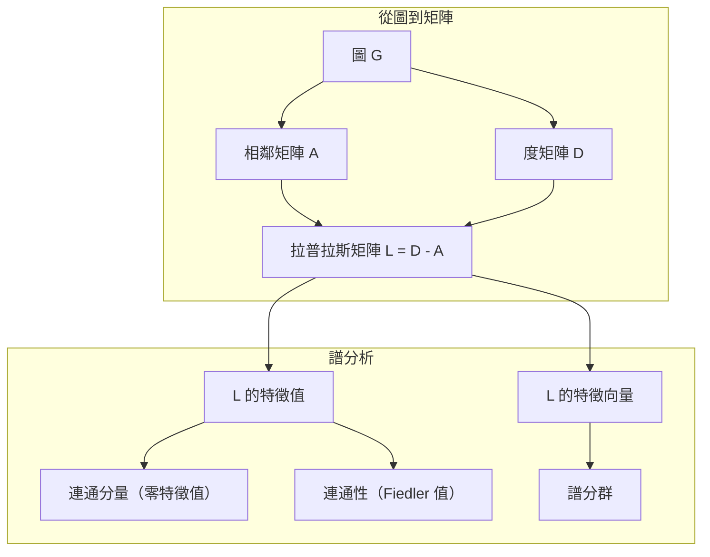
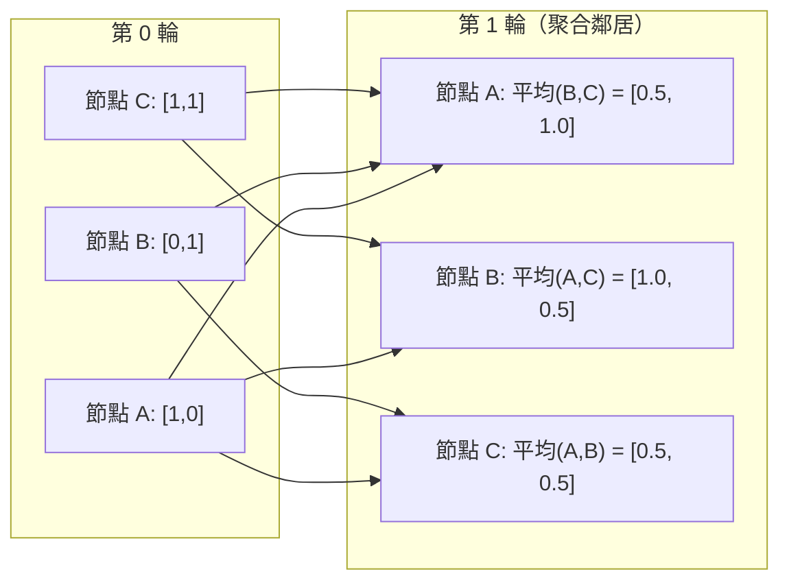

# 機器學習中的圖論

> 圖（graph）是表示關係的資料結構。只要資料中存在連結，就需要圖論（graph theory）。

**Type:** Build
**Language:** Python
**Prerequisites:** Phase 1, Lessons 01-03 (linear algebra, matrices)
**Time:** ~90 minutes

## Learning Objectives｜學習目標

- 建立圖類別，支援相鄰矩陣（adjacency matrix）與相鄰串列（adjacency list）表示法，並實作廣度優先搜尋（breadth-first search，BFS）和深度優先搜尋（depth-first search，DFS）走訪
- 計算圖拉普拉斯矩陣（graph Laplacian），並利用其特徵值（eigenvalues）偵測連通分量（connected components）、為節點（nodes）分群
- 將一輪圖神經網路（Graph Neural Network，GNN）風格的訊息傳遞（message passing）實作為正規化相鄰矩陣（normalized adjacency matrix）乘法
- 使用 Fiedler 向量（Fiedler vector）套用譜分群（spectral clustering），將圖分割（graph partitioning）成數個群集

## The Problem｜問題

社群網路（social network）、分子、知識庫（knowledge base）、引用網路、道路地圖——這些都是圖。傳統 ML 把資料視為平面表格：每一列彼此獨立，每個特徵（feature）各佔一欄。但當連結結構本身很重要時，表格就不夠用了。

以社群網路為例。你想預測用戶會買哪種產品。用戶自己的購買紀錄固然重要，但朋友的購買紀錄更重要；這些連結本身帶有訊號。

再看一個分子：你想預測它是否會與某種蛋白質結合。原子很重要，但原子彼此如何鍵結更關鍵。結構本身就是資料。

圖神經網路（GNN）是深度學習（deep learning）中成長最快的領域。它應用於藥物探索、社群推薦、詐欺偵測和知識圖譜（knowledge graph）推理。所有 GNN 都建立在同一個基礎上：基本圖論。

你需要掌握四件事：
1. 將圖表示成矩陣（才能對它們做乘法）
2. 用走訪演算法探索圖的結構
3. 拉普拉斯矩陣——譜圖論（spectral graph theory）中最重要的矩陣
4. 訊息傳遞——讓 GNN 能運作的操作

## The Concept｜核心概念

### 圖：頂點與邊

圖 G = (V, E) 由頂點（vertex，也稱 node）V 和邊（edge）E 組成。每條邊連接兩個節點。

**有向圖與無向圖。** 在無向圖（undirected graph）中，邊 (u, v) 表示 u 連到 v，而且 v 也連到 u。在有向圖（directed graph，又稱 digraph）中，邊 (u, v) 表示 u 指向 v，但反向不一定成立。

**加權圖與無權圖。** 在無權圖（unweighted graph）中，每條邊要嘛存在、要嘛不存在。在加權圖（weighted graph）中，每條邊都有數值權重，例如距離、成本或強度。

| 圖類型 | 範例 |
|-----------|---------|
| 無向、無權圖（undirected, unweighted graph） | Facebook 朋友關係網路 |
| 有向、無權圖（directed, unweighted graph） | Twitter 追蹤網路 |
| 無向、加權圖（undirected, weighted graph） | 道路地圖（距離） |
| 有向、加權圖（directed, weighted graph） | 網頁連結（PageRank 分數） |

### 相鄰矩陣

相鄰矩陣（adjacency matrix）A 是圖的核心表示法。若圖有 n 個節點：

```
A[i][j] = 1    if there is an edge from node i to node j
A[i][j] = 0    otherwise
```

對無向圖而言，A 是對稱矩陣（symmetric matrix）：A[i][j] = A[j][i]。對加權圖而言，A[i][j] = 邊 (i, j) 的權重。

**範例——三角形：**

```
Nodes: 0, 1, 2
Edges: (0,1), (1,2), (0,2)

A = [[0, 1, 1],
     [1, 0, 1],
     [1, 1, 0]]
```

相鄰矩陣是每個 GNN 的輸入。對 A 做矩陣運算，就等於對圖做相應的運算。

### 度數

節點的度數（degree）是與它相連的邊數。在有向圖中，還要區分入度（in-degree，指向該節點的邊）和出度（out-degree，從該節點指出的邊）。

度矩陣（degree matrix）D 是對角矩陣（diagonal matrix）：

```
D[i][i] = degree of node i
D[i][j] = 0    for i != j
```

以三角形為例：D = diag(2, 2, 2)，因為每個節點都連到另外兩個節點。

度數能反映節點的重要性。度數高的節點是樞紐節點（hub node）。網路的度分布（degree distribution）會揭示其結構。社群網路的度分布（degree distribution）常符合冪律（power law）：少數樞紐節點（hub nodes）連結很多節點，多數葉節點（leaf nodes）連結很少。隨機圖（random graph）的度數則呈卜瓦松分布（Poisson distribution）。

### BFS 與 DFS

廣度優先搜尋（BFS）和深度優先搜尋（DFS）是兩種基本的圖形走訪（graph traversal）演算法，兩者都不可或缺。

**廣度優先搜尋（BFS）：** 先探索所有鄰居節點（neighbor），再探索這些鄰居的鄰居。它使用佇列（queue，先進先出；FIFO）。

```
BFS from node 0:
  Visit 0
  Queue: [1, 2]        (neighbors of 0)
  Visit 1
  Queue: [2, 3]        (add neighbors of 1)
  Visit 2
  Queue: [3]           (neighbors of 2 already visited)
  Visit 3
  Queue: []            (done)
```

BFS 能在無權圖中找到最短路徑（shortest path）。從起點到任一節點的距離，等於 BFS 首次發現該節點時所在的層級。因此，社群網路會用 BFS 計算跳數距離（hop-count distance）。

**深度優先搜尋（DFS）：** 先沿一條路徑盡可能深入，無路可走時再回溯。它使用堆疊（stack，後進先出；LIFO）或遞迴。

```
DFS from node 0:
  Visit 0
  Stack: [1, 2]        (neighbors of 0)
  Visit 2               (pop from stack)
  Stack: [1, 3]         (add neighbors of 2)
  Visit 3               (pop from stack)
  Stack: [1]
  Visit 1               (pop from stack)
  Stack: []             (done)
```

DFS 適合用來：
- 找出連通分量（connected components；從尚未走訪的節點開始執行 DFS）
- 環路偵測（cycle detection），依據 DFS 樹中的回邊（back edge）
- 拓撲排序（topological sort；依 DFS 完成順序反向排列）

| 演算法 | 資料結構 | 可找出 | 使用情境 |
|-----------|---------------|----------|----------|
| BFS | 佇列 | 最短路徑 | 社群網路距離、知識圖譜走訪 |
| DFS | 堆疊 | 連通分量、環路 | 連通性、拓撲排序 |

### 圖拉普拉斯矩陣

L = D - A。這是譜圖論中最重要的矩陣。

以三角形為例：

```
D = [[2, 0, 0],    A = [[0, 1, 1],    L = [[2, -1, -1],
     [0, 2, 0],         [1, 0, 1],         [-1, 2, -1],
     [0, 0, 2]]         [1, 1, 0]]         [-1, -1,  2]]
```

拉普拉斯矩陣有幾個重要性質：

1. **L 是半正定（positive semidefinite）。** 所有特徵值都 >= 0。

2. **零特徵值的數量等於連通分量（connected component）的數量。** 連通圖（connected graph）恰好有一個零特徵值；若圖有 3 個連通分量，就會有 3 個零特徵值。

3. **最小的非零特徵值（Fiedler 值，Fiedler value）衡量連通性（connectivity）。** Fiedler 值越大，圖的連結越緊密；越小則表示圖有薄弱處，也就是瓶頸（bottleneck）。

4. **Fiedler 值對應的特徵向量（eigenvector；Fiedler 向量，Fiedler vector）能揭示最佳分割方式。** 數值為正的節點分到一組，數值為負的節點分到另一組。這就是譜分群。



### 譜性質

相鄰矩陣和拉普拉斯矩陣的特徵值，能在不走訪圖的情況下揭示其結構性質。

**譜分群**的流程如下：
1. 計算拉普拉斯矩陣 L
2. 找出 L 的 k 個最小特徵向量（eigenvectors；若圖連通，略過第一個全 1 向量（all-ones vector））
3. 把這些特徵向量當作每個節點的新座標
4. 在這些座標上執行 k-means

為什麼這樣有效？L 的特徵向量編碼了圖上最「平滑」的函數。連結緊密的節點會有相似的特徵向量值；被瓶頸隔開的節點則會有不同的值。這些特徵向量自然會把不同群集分開。

**與隨機漫步的關係。** 正規化拉普拉斯矩陣（normalized Laplacian）和圖上的隨機漫步（random walk）有關。隨機漫步的平穩分布（stationary distribution）與節點度數成正比。混合時間（mixing time），也就是漫步收斂的速度，取決於譜隙（spectral gap）。

### 訊息傳遞

這是圖神經網路（GNN）的核心操作。每個節點會從鄰居節點收集訊息、將訊息聚合（aggregate）後，再更新自己的狀態。

```
h_v^(k+1) = UPDATE(h_v^(k), AGGREGATE({h_u^(k) : u in neighbors(v)}))
```

最簡單的形式是 AGGREGATE = mean、UPDATE = 線性變換（linear transform）+ 活化函數（activation function）：

```
h_v^(k+1) = sigma(W * mean({h_u^(k) : u in neighbors(v)}))
```

這其實是矩陣乘法。令 H 為所有節點特徵（node features）構成的矩陣，A 為相鄰矩陣：

```
H^(k+1) = sigma(A_norm * H^(k) * W)
```

其中 A_norm 是正規化相鄰矩陣（normalized adjacency matrix），每一列的總和都是 1。

一輪訊息傳遞會讓每個節點「看到」直接相連的鄰居。兩輪會讓它看到鄰居的鄰居。經過 K 輪後，每個節點都能取得 K 跳鄰域（K-hop neighborhood）的資訊。



### 概念與 ML 應用

| 概念 | ML 應用 |
|---------|---------------|
| 相鄰矩陣（adjacency matrix） | GNN 輸入表示法 |
| 拉普拉斯矩陣（Laplacian） | 譜分群、社群偵測（community detection） |
| BFS／DFS | 知識圖譜走訪、尋找路徑 |
| 度分布（degree distribution） | 節點重要性、特徵工程（feature engineering） |
| 訊息傳遞（message passing） | GNN 層（圖卷積網路（Graph Convolutional Network，GCN）、圖注意力網路（Graph Attention Network，GAT）、GraphSAGE） |
| L 的特徵值 | 社群偵測（community detection）、圖分割（graph partitioning） |
| 譜分群（spectral clustering） | 非監督式（unsupervised）節點分群 |
| PageRank | 節點重要性、網頁搜尋 |

```figure
graph-degree-distribution
```

## Build It｜動手實作

### 步驟 1：從頭實作 Graph 類別

```python
class Graph:
    def __init__(self, n_nodes, directed=False):
        self.n = n_nodes
        self.directed = directed
        self.adj = {i: {} for i in range(n_nodes)}

    def add_edge(self, u, v, weight=1.0):
        self.adj[u][v] = weight
        if not self.directed:
            self.adj[v][u] = weight

    def neighbors(self, node):
        return list(self.adj[node].keys())

    def degree(self, node):
        return len(self.adj[node])

    def adjacency_matrix(self):
        import numpy as np
        A = np.zeros((self.n, self.n))
        for u in range(self.n):
            for v, w in self.adj[u].items():
                A[u][v] = w
        return A

    def degree_matrix(self):
        import numpy as np
        D = np.zeros((self.n, self.n))
        for i in range(self.n):
            D[i][i] = self.degree(i)
        return D

    def laplacian(self):
        return self.degree_matrix() - self.adjacency_matrix()
```

相鄰串列（`self.adj`）能有效率地儲存鄰居。轉換成相鄰矩陣時會用到 NumPy，因為所有譜運算都需要矩陣。

### 步驟 2：BFS 與 DFS

```python
from collections import deque

def bfs(graph, start):
    visited = set()
    order = []
    distances = {}
    queue = deque([(start, 0)])
    visited.add(start)
    while queue:
        node, dist = queue.popleft()
        order.append(node)
        distances[node] = dist
        for neighbor in graph.neighbors(node):
            if neighbor not in visited:
                visited.add(neighbor)
                queue.append((neighbor, dist + 1))
    return order, distances


def dfs(graph, start):
    visited = set()
    order = []
    stack = [start]
    while stack:
        node = stack.pop()
        if node in visited:
            continue
        visited.add(node)
        order.append(node)
        for neighbor in reversed(graph.neighbors(node)):
            if neighbor not in visited:
                stack.append(neighbor)
    return order
```

BFS 使用 deque（雙端佇列），以 O(1) 時間執行 popleft。DFS 使用 list 作為堆疊。兩者都只走訪每個節點一次，時間複雜度為 O(V + E)。

### 步驟 3：連通分量與拉普拉斯矩陣特徵值

```python
def connected_components(graph):
    visited = set()
    components = []
    for node in range(graph.n):
        if node not in visited:
            order, _ = bfs(graph, node)
            visited.update(order)
            components.append(order)
    return components


def laplacian_eigenvalues(graph):
    import numpy as np
    L = graph.laplacian()
    eigenvalues = np.linalg.eigvalsh(L)
    return eigenvalues
```

函式 `eigvalsh` 適用於對稱矩陣；無向圖的拉普拉斯矩陣一定是對稱矩陣。它會依遞增順序回傳特徵值。計算零特徵值的數量，就能找出連通分量的數量。

### 步驟 4：譜分群

```python
def spectral_clustering(graph, k=2):
    import numpy as np
    L = graph.laplacian()
    eigenvalues, eigenvectors = np.linalg.eigh(L)
    features = eigenvectors[:, 1:k+1]

    labels = np.zeros(graph.n, dtype=int)
    for i in range(graph.n):
        if features[i, 0] >= 0:
            labels[i] = 0
        else:
            labels[i] = 1
    return labels
```

當 k=2 時，Fiedler 向量的正負號可將圖分成兩個群集。若 k>2，則要在前 k 個特徵向量（排除平凡的全 1 向量）上執行 k-means。

### 步驟 5：訊息傳遞

```python
def message_passing(graph, features, weight_matrix):
    import numpy as np
    A = graph.adjacency_matrix()
    row_sums = A.sum(axis=1, keepdims=True)
    row_sums[row_sums == 0] = 1
    A_norm = A / row_sums
    aggregated = A_norm @ features
    output = aggregated @ weight_matrix
    return output
```

這就是一輪 GNN 訊息傳遞。每個節點的新特徵是鄰居特徵的加權平均，再經過權重矩陣（weight matrix）轉換。堆疊多輪後，就能把資訊傳得更遠。

## Use It｜實際應用

使用 NetworkX 和 NumPy，相同的操作都能以一行完成：

```python
import networkx as nx
import numpy as np

G = nx.karate_club_graph()

A = nx.adjacency_matrix(G).toarray()
L = nx.laplacian_matrix(G).toarray()

eigenvalues = np.linalg.eigvalsh(L.astype(float))
print(f"Smallest eigenvalues: {eigenvalues[:5]}")
print(f"Connected components: {nx.number_connected_components(G)}")

communities = nx.community.greedy_modularity_communities(G)
print(f"Communities found: {len(communities)}")

pr = nx.pagerank(G)
top_nodes = sorted(pr.items(), key=lambda x: x[1], reverse=True)[:5]
print(f"Top 5 PageRank nodes: {top_nodes}")
```

NetworkX 能透過最佳化的 C 後端處理任何規模的圖，適合用於正式環境。自己從頭實作，則能幫助你理解它的運作方式。

### NumPy 譜分析

```python
import numpy as np

A = np.array([
    [0, 1, 1, 0, 0],
    [1, 0, 1, 0, 0],
    [1, 1, 0, 1, 0],
    [0, 0, 1, 0, 1],
    [0, 0, 0, 1, 0]
])

D = np.diag(A.sum(axis=1))
L = D - A

eigenvalues, eigenvectors = np.linalg.eigh(L)
print(f"Eigenvalues: {np.round(eigenvalues, 4)}")
print(f"Fiedler value: {eigenvalues[1]:.4f}")
print(f"Fiedler vector: {np.round(eigenvectors[:, 1], 4)}")

fiedler = eigenvectors[:, 1]
group_a = np.where(fiedler >= 0)[0]
group_b = np.where(fiedler < 0)[0]
print(f"Cluster A: {group_a}")
print(f"Cluster B: {group_b}")
```

Fiedler 向量負責完成主要工作：正值會落在一個群集，負值會落在另一個群集。不需要反覆最佳化，只要做一次特徵分解（eigendecomposition）。

## Ship It｜交付成果

本課會產出：
- `outputs/skill-graph-analysis.md`——分析圖結構資料的技能參考文件

## 關聯

| 概念 | 出現位置 |
|---------|------------------|
| 相鄰矩陣 | GCN、GAT、GraphSAGE 的輸入 |
| 拉普拉斯矩陣 | 譜分群、ChebNet 濾波器 |
| BFS | 知識圖譜走訪、最短路徑查詢 |
| 訊息傳遞 | 每個 GNN 層、神經訊息傳遞 |
| 譜隙 | 圖連通性、隨機漫步的混合時間 |
| 度分布（degree distribution） | 冪律網路、節點特徵工程 |
| 連通分量 | 前處理（preprocessing）、處理不連通的圖 |
| PageRank | 節點重要性排序、注意力（attention）初始化 |

GNN 特別值得一提。GCN（Kipf & Welling，2017）的圖卷積（graph convolution）操作會在相鄰矩陣 A 上加入自環（self-loop），形成 A_hat = A + I：

```text
H^(l+1) = sigma(D_hat^(-1/2) * A_hat * D_hat^(-1/2) * H^(l) * W^(l))
```

其中 A_hat = A + I（相鄰矩陣加上自環），D_hat 是 A_hat 的度矩陣。自環能確保聚合時，每個節點也納入自己的特徵。這正是採用對稱正規化（symmetric normalization）的訊息傳遞。D_hat^(-1/2) * A_hat * D_hat^(-1/2) 是正規化相鄰矩陣。拉普拉斯矩陣也會出現，因為這種正規化與 L_sym = I - D^(-1/2) * A * D^(-1/2) 有關。理解拉普拉斯矩陣，就能理解 GCN 為何有效。

## Exercises｜練習

1. **從頭實作 PageRank。** 從均勻分數開始。每一步計算：score(v) = (1-d)/n + d * sum(score(u)/out_degree(u))，對所有指向 v 的 u 加總。使用 d=0.85。反覆計算直到收斂（變化量 < 1e-6），並在小型網頁圖上測試。

2. **用譜分群找出社群。** 建立兩個明顯分離的群集（例如兩個完全子圖（clique），只用一條邊連接）。執行譜分群，確認能找出正確分群。增加跨群集邊之後會發生什麼事？

3. **實作 Dijkstra 演算法**，用來找出加權圖中的最短路徑。再用相同的圖（邊權重皆相同）以 BFS 求解，並比較結果。

4. **建立兩層訊息傳遞網路。** 使用不同的權重矩陣執行兩輪訊息傳遞。說明為何兩輪之後，每個節點都能取得其 2 跳鄰域的資訊。

5. **分析真實圖資料。** 使用 Karate Club 圖（34 個節點、78 條邊），計算度分布（degree distribution）、拉普拉斯矩陣特徵值和譜分群結果，再與已知的真實分群標籤（ground truth）比較。

## Key Terms｜關鍵術語

| 術語 | 常見說法 | 實際意義 |
|------|----------------|----------------------|
| 圖（Graph） | 「節點和邊」 | 編碼成對關係的數學結構 G=(V,E) |
| 相鄰矩陣（adjacency matrix） | 「連結表」 | n x n 矩陣；若節點 i 和 j 相連，A[i][j] = 1 |
| 度數（degree） | 「節點有多連通」 | 與節點相連的邊數 |
| 拉普拉斯矩陣（Laplacian） | 「D 減 A」 | L = D - A；其特徵值能揭示圖結構 |
| Fiedler 值（Fiedler value） | 「代數連通度」 | L 的最小非零特徵值，衡量圖的連通程度 |
| BFS | 「逐層搜尋」 | 先走訪所有鄰居再深入，能找出最短路徑 |
| DFS | 「先往深處走」 | 沿一條路徑走到底，再回溯探索 |
| 訊息傳遞（message passing） | 「節點和鄰居交換資訊」 | 每個節點聚合鄰居資訊，是 GNN 的核心 |
| 譜分群（spectral clustering） | 「依特徵向量分群」 | 使用拉普拉斯矩陣的特徵向量劃分圖 |
| 連通分量（connected component） | 「彼此連通的一塊」 | 極大子圖；其中任兩個節點都能互相到達 |

## Further Reading｜延伸閱讀

- **Kipf & Welling（2017）**——「Semi-Supervised Classification with Graph Convolutional Networks」。開啟現代 GNN 研究的論文，說明譜圖卷積如何簡化為訊息傳遞。
- **Spielman（2012）**——「Spectral Graph Theory」課程講義。深入介紹拉普拉斯矩陣、譜隙和圖分割（graph partitioning）的經典教材。
- **Hamilton（2020）**——「Graph Representation Learning」。從基礎到應用介紹 GNN 的專書。
- **Bronstein et al.（2021）**——「Geometric Deep Learning: Grids, Groups, Graphs, Geodesics, and Gauges」。提出統一框架的論文。
- **Veličković et al.（2018）**——「Graph Attention Networks」。將注意力機制加入訊息傳遞的研究。
