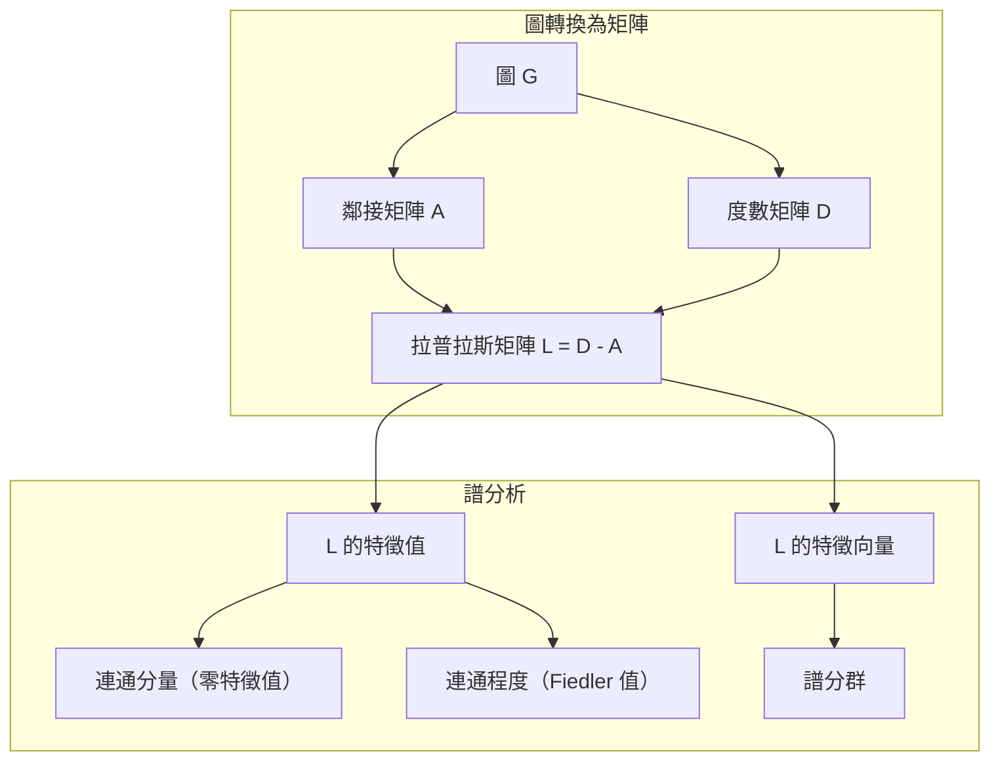
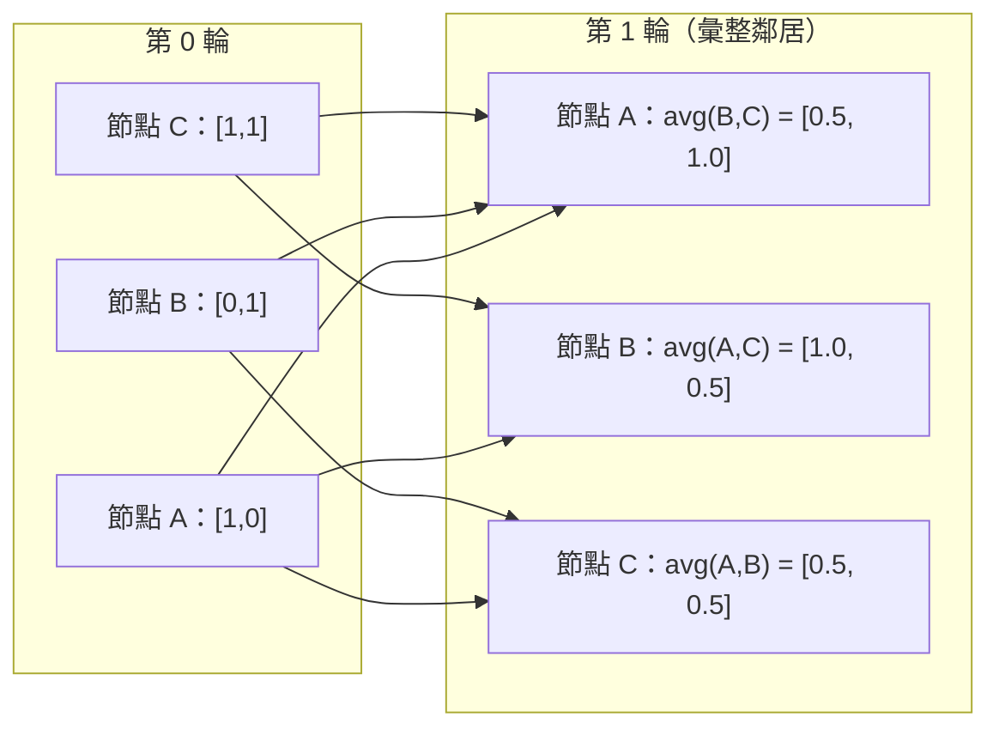

# 機器學習圖論

> 圖是描述關係的資料結構。只要資料之間有連結，就需要圖論。

**Type:** Build
**Language:** Python
**Prerequisites:** Phase 1, Lessons 01-03 (linear algebra, matrices)
**Time:** ~90 minutes

## 學習目標

- 建立圖類別，支援鄰接矩陣與鄰接串列表示法，並實作 BFS 和 DFS 遍歷
- 計算圖拉普拉斯矩陣，並利用其特徵值找出連通分量及將節點分群
- 以正規化鄰接矩陣乘法實作一輪 GNN 風格的訊息傳遞
- 使用 Fiedler 向量進行譜分群，將圖切分成不同群集

## 問題

社群網路、分子、知識庫、引用網路、道路地圖，全都是圖。傳統機器學習會把資料視為平坦的表格：每一列彼此獨立，每一個特徵各佔一欄。但當連結結構很重要時，表格就派不上用場。

以社群網路為例。你想預測使用者會買哪項產品；使用者自己的購買紀錄固然重要，但朋友的購買紀錄可能更重要，因為連結本身也帶有訊號。

再以分子為例。你想預測某個分子是否會與蛋白質結合。原子固然重要，但真正關鍵的是原子彼此如何鍵結。結構本身就是資料。

圖神經網路（GNN）是深度學習中成長最快的領域之一，應用在藥物探索、社群推薦、詐欺偵測和知識圖譜推理。所有 GNN 都建立在相同基礎上：基本圖論。

你需要掌握四件事：
1. 將圖表示為矩陣的方法（才能進行矩陣乘法）
2. 探索圖結構的遍歷演算法
3. 拉普拉斯矩陣——譜圖論中最重要的矩陣
4. 讓 GNN 得以運作的訊息傳遞運算

## 核心概念

### 圖：節點與邊

圖 G = (V, E) 由頂點（節點）集合 V 和邊集合 E 組成。每一條邊都連接兩個節點。

**有向圖與無向圖。** 在無向圖中，邊 (u, v) 表示 u 與 v 彼此連接。在有向圖（digraph）中，邊 (u, v) 表示由 u 指向 v，但不一定也有反向連結。

**加權圖與無權重圖。** 在無權重圖中，每條邊只有存在或不存在兩種狀態；在加權圖中，每條邊都有數值權重，例如距離、成本或強度。

| 圖的類型 | 範例 |
|----------|------|
| 無向、無權重 | Facebook 好友網路 |
| 有向、無權重 | Twitter 追蹤網路 |
| 無向、加權 | 道路地圖（距離） |
| 有向、加權 | 網頁連結（PageRank 分數） |

### 鄰接矩陣

鄰接矩陣 A 是圖的核心表示法。對於有 n 個節點的圖：

```text
A[i][j] = 1    若節點 i 指向節點 j 有一條邊
A[i][j] = 0    否則
```

對無向圖而言，A 是對稱矩陣：A[i][j] = A[j][i]。對加權圖而言，A[i][j] 則是邊 (i, j) 的權重。

**範例——三角形：**

```text
節點：0、1、2
邊：(0,1)、(1,2)、(0,2)

A = [[0, 1, 1],
     [1, 0, 1],
     [1, 1, 0]]
```

每個 GNN 都會以鄰接矩陣作為輸入。對 A 進行矩陣運算，就對應到圖上的運算。

### 度數

節點的度數是與該節點相連的邊數。有向圖則分為入度（指向該節點的邊）和出度（由該節點指出的邊）。

度數矩陣 D 是對角矩陣：

```text
D[i][i] = 節點 i 的度數
D[i][j] = 0    若 i != j
```

以三角形為例：D = diag(2, 2, 2)，因為每個節點都連接其他兩個節點。

度數能反映節點的重要性。高度數節點通常是樞紐。網路的度數分布能揭示其結構：社群網路通常符合冪次律（少數樞紐連著大量葉節點），隨機圖的度數則呈卜瓦松分布。

### BFS 與 DFS

這是兩種基本的圖遍歷演算法，兩者都需要掌握。

**廣度優先搜尋（BFS）：** 先探索所有鄰居，再探索鄰居的鄰居。使用佇列（FIFO）。

```text
從節點 0 開始做 BFS：
  拜訪 0
  佇列：[1, 2]        （節點 0 的鄰居）
  拜訪 1
  佇列：[2, 3]        （加入節點 1 的鄰居）
  拜訪 2
  佇列：[3]           （節點 2 的鄰居已拜訪）
  拜訪 3
  佇列：[]            （完成）
```

BFS 能在無權重圖中找出最短路徑。起點到任一節點的距離，等於 BFS 首次找到該節點時的層數。因此，社群網路常用 BFS 計算兩人之間相隔幾個連結。

**深度優先搜尋（DFS）：** 盡可能沿著路徑往深處探索，直到回溯為止。使用堆疊（LIFO）或遞迴。

```text
從節點 0 開始做 DFS：
  拜訪 0
  堆疊：[1, 2]        （節點 0 的鄰居）
  拜訪 2               （從堆疊取出）
  堆疊：[1, 3]         （加入節點 2 的鄰居）
  拜訪 3               （從堆疊取出）
  堆疊：[1]
  拜訪 1               （從堆疊取出）
  堆疊：[]             （完成）
```

DFS 適用於：
- 找出連通分量（從尚未拜訪的節點啟動 DFS）
- 偵測環（DFS 樹中的回邊）
- 拓撲排序（依 DFS 完成順序反向排列）

| 演算法 | 資料結構 | 可找出 | 用途 |
|--------|----------|--------|------|
| BFS | 佇列 | 最短路徑 | 社群網路距離、知識圖譜遍歷 |
| DFS | 堆疊 | 連通分量、環 | 連通性分析、拓撲排序 |

### 圖拉普拉斯矩陣

L = D - A。這是譜圖論中最重要的矩陣。

三角形的矩陣如下：

```text
D = [[2, 0, 0],    A = [[0, 1, 1],    L = [[2, -1, -1],
     [0, 2, 0],         [1, 0, 1],         [-1, 2, -1],
     [0, 0, 2]]         [1, 1, 0]]         [-1, -1,  2]]
```

拉普拉斯矩陣具有幾個重要性質：

1. **L 是半正定矩陣。** 所有特徵值都 >= 0。

2. **零特徵值的個數等於連通分量的數量。** 連通圖恰好有一個零特徵值；若圖分成 3 個互不連通的分量，就有三個零特徵值。

3. **最小的非零特徵值（Fiedler 值）衡量連通程度。** Fiedler 值越大，代表圖的連通性越好；越小則表示圖中有薄弱處，也就是瓶頸。

4. **Fiedler 值所對應的特徵向量（Fiedler 向量）能指出最佳切分方式。** 正值節點分到一組，負值節點分到另一組。這就是譜分群。



### 譜性質

鄰接矩陣和拉普拉斯矩陣的特徵值，能在不遍歷圖的情況下揭示其結構性質。

**譜分群**的步驟如下：
1. 計算拉普拉斯矩陣 L
2. 找出 L 最小的 k 個特徵向量（連通圖要略過第一個全為 1 的特徵向量）
3. 將這些特徵向量當作各節點的新座標
4. 對這些座標執行 k-means

為什麼這樣有效？L 的特徵向量能表示圖上最「平滑」的函數。連結緊密的節點會有相似的特徵向量值；被瓶頸隔開的節點則會有不同的值，因此特徵向量能自然地分開群集。

**與隨機漫步的關聯。** 正規化拉普拉斯矩陣與圖上的隨機漫步有關。隨機漫步的穩態分布與節點度數成正比。混合時間（漫步收斂的速度）則取決於譜間隙。

### 訊息傳遞

這是圖神經網路的核心運算。每個節點會從鄰居收集訊息、彙整訊息，再更新自己的狀態。

```text
h_v^(k+1) = UPDATE(h_v^(k), AGGREGATE({h_u^(k) : u in 節點 v 的鄰居}))
```

最簡單的形式是 AGGREGATE = mean，UPDATE = 線性轉換 + 啟用函式：

```text
h_v^(k+1) = sigma(W * mean({h_u^(k) : u in 節點 v 的鄰居}))
```

這其實是矩陣乘法的另一種寫法。若 H 是所有節點特徵組成的矩陣，而 A 是鄰接矩陣：

```text
H^(k+1) = sigma(A_norm * H^(k) * W)
```

其中 A_norm 是正規化鄰接矩陣（每一列的總和為 1）。

一輪訊息傳遞會讓每個節點取得直接鄰居的資訊；兩輪會讓節點取得鄰居的鄰居資訊；經過 K 輪後，每個節點都能取得 K 跳鄰域的資訊。



### 概念與機器學習應用

| 概念 | 機器學習應用 |
|------|--------------|
| 鄰接矩陣 | GNN 輸入表示法 |
| 圖拉普拉斯矩陣 | 譜分群、社群偵測 |
| BFS/DFS | 知識圖譜遍歷、路徑搜尋 |
| 度數分布 | 節點重要性、特徵工程 |
| 訊息傳遞 | GNN 層（GCN、GAT、GraphSAGE） |
| L 的特徵值 | 社群偵測、圖分割 |
| 譜分群 | 非監督式節點分群 |
| PageRank | 節點重要性、網頁搜尋 |

```figure
graph-degree-distribution
```

## Build It：從零實作

### 步驟 1：從零建立 Graph 類別

```python
class Graph:
    def __init__(self, n_nodes, directed=False):
        self.n = n_nodes
        self.directed = directed
        self.adj = {i: {} for i in range(n_nodes)}

    def add_edge(self, u, v, weight=1.0):
        self.adj[u][v] = weight
        if not self.directed:
            self.adj[v][u] = weight

    def neighbors(self, node):
        return list(self.adj[node].keys())

    def degree(self, node):
        return len(self.adj[node])

    def adjacency_matrix(self):
        import numpy as np
        A = np.zeros((self.n, self.n))
        for u in range(self.n):
            for v, w in self.adj[u].items():
                A[u][v] = w
        return A

    def degree_matrix(self):
        import numpy as np
        D = np.zeros((self.n, self.n))
        for i in range(self.n):
            D[i][i] = self.degree(i)
        return D

    def laplacian(self):
        return self.degree_matrix() - self.adjacency_matrix()
```

鄰接串列（`self.adj`）能有效率地儲存鄰居。轉換成鄰接矩陣時會使用 numpy，因為譜分析的運算都需要矩陣。

### 步驟 2：BFS 與 DFS

```python
from collections import deque

def bfs(graph, start):
    visited = set()
    order = []
    distances = {}
    queue = deque([(start, 0)])
    visited.add(start)
    while queue:
        node, dist = queue.popleft()
        order.append(node)
        distances[node] = dist
        for neighbor in graph.neighbors(node):
            if neighbor not in visited:
                visited.add(neighbor)
                queue.append((neighbor, dist + 1))
    return order, distances


def dfs(graph, start):
    visited = set()
    order = []
    stack = [start]
    while stack:
        node = stack.pop()
        if node in visited:
            continue
        visited.add(node)
        order.append(node)
        for neighbor in reversed(graph.neighbors(node)):
            if neighbor not in visited:
                stack.append(neighbor)
    return order
```

BFS 使用 deque（雙端佇列），讓 popleft 的時間複雜度為 O(1)；DFS 使用串列作為堆疊。兩者都會恰好拜訪每個節點一次，時間複雜度為 O(V + E)。

### 步驟 3：連通分量與拉普拉斯矩陣特徵值

```python
def connected_components(graph):
    visited = set()
    components = []
    for node in range(graph.n):
        if node not in visited:
            order, _ = bfs(graph, node)
            visited.update(order)
            components.append(order)
    return components


def laplacian_eigenvalues(graph):
    import numpy as np
    L = graph.laplacian()
    eigenvalues = np.linalg.eigvalsh(L)
    return eigenvalues
```

`eigvalsh` 適用於對稱矩陣，而無向圖的拉普拉斯矩陣一定是對稱矩陣。它會依遞增順序回傳特徵值。計算零特徵值的個數，就能找出連通分量的數量。

### 步驟 4：譜分群

```python
def spectral_clustering(graph, k=2):
    import numpy as np
    L = graph.laplacian()
    eigenvalues, eigenvectors = np.linalg.eigh(L)
    features = eigenvectors[:, 1:k+1]

    labels = np.zeros(graph.n, dtype=int)
    for i in range(graph.n):
        if features[i, 0] >= 0:
            labels[i] = 0
        else:
            labels[i] = 1
    return labels
```

k=2 時，依 Fiedler 向量的正負號就能把圖分成兩個群集。k>2 時，則可對前 k 個特徵向量（排除平凡的全 1 特徵向量）執行 k-means。

### 步驟 5：訊息傳遞

```python
def message_passing(graph, features, weight_matrix):
    import numpy as np
    A = graph.adjacency_matrix()
    row_sums = A.sum(axis=1, keepdims=True)
    row_sums[row_sums == 0] = 1
    A_norm = A / row_sums
    aggregated = A_norm @ features
    output = aggregated @ weight_matrix
    return output
```

這是一輪 GNN 訊息傳遞。每個節點的新特徵是鄰居特徵的加權平均，再經過權重矩陣轉換。堆疊多輪運算，就能將資訊傳得更遠。

## Use It：實際應用

使用 networkx 和 numpy，相同的運算只要一行程式碼：

```python
import networkx as nx
import numpy as np

G = nx.karate_club_graph()

A = nx.adjacency_matrix(G).toarray()
L = nx.laplacian_matrix(G).toarray()

eigenvalues = np.linalg.eigvalsh(L.astype(float))
print(f"Smallest eigenvalues: {eigenvalues[:5]}")
print(f"Connected components: {nx.number_connected_components(G)}")

communities = nx.community.greedy_modularity_communities(G)
print(f"Communities found: {len(communities)}")

pr = nx.pagerank(G)
top_nodes = sorted(pr.items(), key=lambda x: x[1], reverse=True)[:5]
print(f"Top 5 PageRank nodes: {top_nodes}")
```

networkx 透過最佳化的 C 後端處理各種規模的圖，適合用於正式環境。從零實作的版本則能幫助你理解背後的運作方式。

### 使用 numpy 做譜分析

```python
import numpy as np

A = np.array([
    [0, 1, 1, 0, 0],
    [1, 0, 1, 0, 0],
    [1, 1, 0, 1, 0],
    [0, 0, 1, 0, 1],
    [0, 0, 0, 1, 0]
])

D = np.diag(A.sum(axis=1))
L = D - A

eigenvalues, eigenvectors = np.linalg.eigh(L)
print(f"Eigenvalues: {np.round(eigenvalues, 4)}")
print(f"Fiedler value: {eigenvalues[1]:.4f}")
print(f"Fiedler vector: {np.round(eigenvectors[:, 1], 4)}")

fiedler = eigenvectors[:, 1]
group_a = np.where(fiedler >= 0)[0]
group_b = np.where(fiedler < 0)[0]
print(f"Cluster A: {group_a}")
print(f"Cluster B: {group_b}")
```

Fiedler 向量負責完成主要切分工作：一組是正值，另一組是負值。不需要反覆最佳化，只要做一次特徵分解即可。

## Ship It：交付成果

本課程會產生：
- `outputs/skill-graph-analysis.md`——用於分析圖結構資料的 skill 參考文件

## 關聯概念

| 概念 | 應用場景 |
|------|----------|
| 鄰接矩陣 | GCN、GAT、GraphSAGE 的輸入 |
| 拉普拉斯矩陣 | 譜分群、ChebNet 濾波器 |
| BFS | 知識圖譜遍歷、最短路徑查詢 |
| 訊息傳遞 | 所有 GNN 層、神經訊息傳遞 |
| 譜間隙 | 圖連通性、隨機漫步混合時間 |
| 度數分布 | 冪次律網路、節點特徵工程 |
| 連通分量 | 前處理、處理不連通圖 |
| PageRank | 節點重要性排序、注意力初始化 |

GNN 值得特別介紹。GCN（Kipf 與 Welling，2017）的圖卷積運算會在鄰接矩陣加入自連結，得到 A_hat = A + I：

```text
H^(l+1) = sigma(D_hat^(-1/2) * A_hat * D_hat^(-1/2) * H^(l) * W^(l))
```

其中 A_hat = A + I（鄰接矩陣加上自連結），D_hat 是 A_hat 的度數矩陣。自連結可確保彙整時也包含節點本身的特徵。這正是使用對稱正規化的訊息傳遞。D_hat^(-1/2) * A_hat * D_hat^(-1/2) 是正規化鄰接矩陣。拉普拉斯矩陣也會出現在這裡，因為這種正規化與 L_sym = I - D^(-1/2) * A * D^(-1/2) 有關。理解拉普拉斯矩陣，就能理解 GCN 為何有效。

## Exercises：練習

1. **從零實作 PageRank。** 先使用均勻分數。每一步計算：score(v) = (1-d)/n + d * sum(score(u)/out_degree(u))，加總所有指向 v 的 u。設定 d=0.85，重複執行直到收斂（變化量 < 1e-6），並在小型網頁圖上測試。

2. **使用譜分群找出社群。** 建立兩個明確分開的群集（例如用單一邊連接的兩個完全圖）。執行譜分群並確認切分正確。增加群集間的連結後，結果會如何改變？

3. **實作 Dijkstra 演算法**，找出加權圖中的最短路徑，再與同一張圖（所有邊權重相同）上的 BFS 結果比較。

4. **建立兩層訊息傳遞網路。** 使用不同的權重矩陣執行兩輪訊息傳遞，並展示每個節點在兩輪後都取得了 2 跳鄰域的資訊。

5. **分析真實世界的圖。** 使用 Karate Club 圖（34 個節點、78 條邊），計算度數分布、拉普拉斯矩陣特徵值和譜分群結果，再與已知的真實分群比較。

## 關鍵詞

| 術語 | 一般說法 | 實際意義 |
|------|----------|----------|
| 圖 |「節點與邊」| 用 G=(V,E) 表示、編碼成對關係的數學結構 |
| 鄰接矩陣 |「連結表」| n x n 矩陣；若節點 i 和 j 相連，則 A[i][j] = 1 |
| 度數 |「節點有多常連到其他節點」| 與節點相連的邊數 |
| 拉普拉斯矩陣 |「D 減 A」| L = D - A；其特徵值能揭示圖的結構 |
| Fiedler 值 |「代數連通度」| L 最小的非零特徵值，用來衡量圖的連通程度 |
| BFS |「逐層搜尋」| 先拜訪所有鄰居再深入，可找出最短路徑的遍歷方式 |
| DFS |「先往深處走」| 沿著一條路徑走到底再回溯的遍歷方式 |
| 訊息傳遞 |「節點彼此傳遞資訊」| 各節點彙整鄰居資訊，是 GNN 的核心運作方式 |
| 譜分群 |「依特徵向量分群」| 使用拉普拉斯矩陣的特徵向量來切分圖 |
| 連通分量 |「一塊彼此相通的部分」| 極大的子圖，其中任意兩個節點都能互相到達 |

## 延伸閱讀

- **Kipf 與 Welling（2017）**——〈Semi-Supervised Classification with Graph Convolutional Networks〉：開啟現代 GNN 發展的論文，說明譜圖卷積如何簡化為訊息傳遞。
- **Spielman（2012）**——〈Spectral Graph Theory〉講義：介紹拉普拉斯矩陣、譜間隙和圖分割的權威入門資料。
- **Hamilton（2020）**——《Graph Representation Learning》：從基礎到應用介紹 GNN 的專書。
- **Bronstein 等人（2021）**——〈Geometric Deep Learning: Grids, Groups, Graphs, Geodesics, and Gauges〉：整合不同領域的統一架構論文。
- **Veličković 等人（2018）**——〈Graph Attention Networks〉：以注意力機制擴展訊息傳遞。
