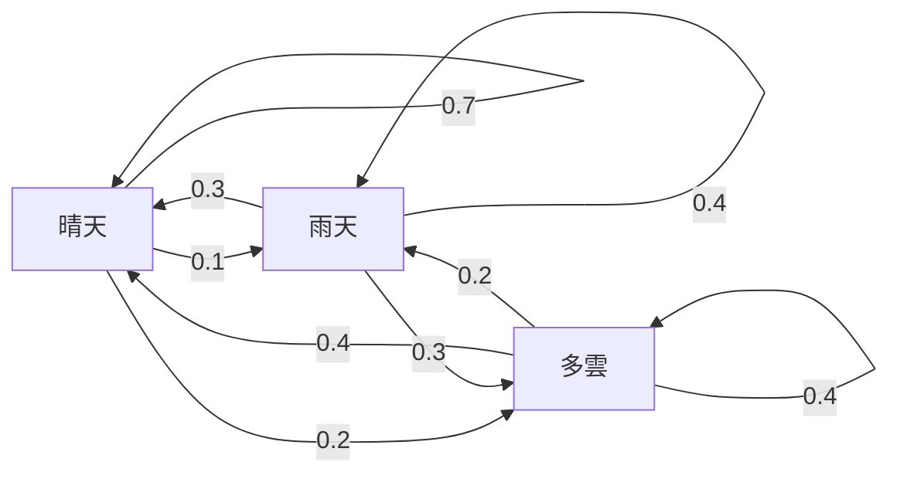
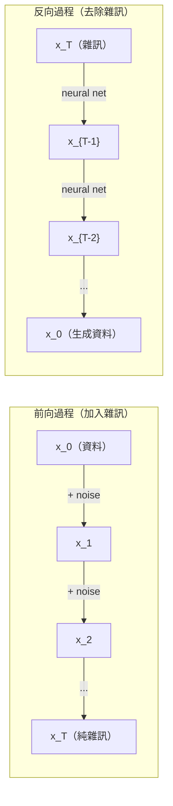

# 隨機過程

> 隨機性也有結構。隨機漫步（random walk）、馬可夫鏈（Markov chain）與擴散模型（diffusion model）背後的數學。

**Type:** Learn
**Language:** Python
**Prerequisites:** Phase 1, Lessons 06-07 (probability, Bayes)
**Time:** ~75 minutes

## Learning Objectives｜學習目標

- 模擬一維與二維隨機漫步，驗證位移（displacement）如何依 sqrt(n) 縮放
- 建立馬可夫鏈模擬器，透過特徵分解（eigendecomposition）計算平穩分布（stationary distribution）
- 實作 Metropolis-Hastings MCMC（馬可夫鏈蒙地卡羅，Markov chain Monte Carlo），並運用 Langevin 動力學（Langevin dynamics）從目標分布（target distribution）抽樣
- 連結擴散模型的前向過程（forward process）與布朗運動（Brownian motion），並說明反向過程（reverse process）如何生成資料

## The Problem｜問題

許多 AI 系統都涉及隨時間演變的隨機性。這不是靜態的隨機性，而是有結構、按序發生的隨機性；每一步都取決於先前發生的事。

語言模型（language model）一次生成一個 token，每個 token 都取決於先前的上下文。模型輸出機率分布（probability distribution）、從中取樣，然後繼續生成。這就是隨機過程（stochastic process）。

擴散模型會逐步對影像加入雜訊，直到影像完全變成雜訊；接著反轉這個過程，逐步去除雜訊，直到生成一張新影像。前向過程是馬可夫鏈；反向過程則是由模型學得、反向運作的馬可夫鏈。

強化學習（reinforcement learning，RL）的 agent 會在環境中採取動作。每個動作都會以某種機率帶來新的狀態（state）。agent 遵循隨機策略（random policy），處於隨機環境中。整個系統就是馬可夫決策過程（Markov decision process）。

馬可夫鏈蒙地卡羅（MCMC）抽樣是貝氏推論（Bayesian inference）的基礎。它會建構一條馬可夫鏈，讓你想抽樣的後驗分布（posterior distribution）成為這條鏈的平穩分布。

以上都建立在四個基礎概念上：
1. 隨機漫步——最簡單的隨機過程
2. 馬可夫鏈——具有轉移矩陣（transition matrix）的結構化隨機性
3. Langevin 動力學——加入雜訊的梯度下降法（gradient descent）
4. Metropolis-Hastings——從任意分布抽樣

## The Concept｜核心概念

### 隨機漫步

從位置 0 開始。每一步擲一枚公平硬幣：正面就向右移動（+1），反面就向左移動（-1）。

走 n 步後，位置就是 n 個隨機 +1 或 -1 數值的總和。期望位置為 0（這是無偏漫步）。但距離原點（origin）的期望值會隨 sqrt(n) 增長。

這很違反直覺。漫步是公平的——沒有往任一方向漂移。但隨著時間經過，它會離起點越來越遠。走 n 步後的標準差（standard deviation）是 sqrt(n)。

```
Step 0:  Position = 0
Step 1:  Position = +1 or -1
Step 2:  Position = +2, 0, or -2
...
Step 100: Expected distance from origin ~ 10 (sqrt(100))
Step 10000: Expected distance from origin ~ 100 (sqrt(10000))
```

**二維隨機漫步：** 每一步以相同機率往上、下、左或右移動。距離原點（origin）同樣依 sqrt(n) 縮放。路徑呈現類似分形（fractal）的樣態。

**為什麼是 sqrt(n)？** 每一步都是機率相同的 +1 或 -1。走 n 步後，位置為 S_n = X_1 + X_2 + ... + X_n，其中每個 X_i 都是 +1 或 -1。每一步的變異數（variance）為 1，而且各步彼此獨立，所以 Var(S_n) = n。標準差 = sqrt(n)。根據中央極限定理（central limit theorem，CLT），S_n / sqrt(n) 會收斂至標準常態分布（standard normal distribution）。

這種 sqrt(n) 縮放在 ML 中到處可見。隨機梯度下降法（stochastic gradient descent，SGD）的雜訊會依 1/sqrt(batch_size) 縮放。embedding 維度（embedding dimension）會依 sqrt(d) 縮放。平方根是獨立隨機加總的標誌。

**與布朗運動的關係。** 令隨機漫步的步長為 1/sqrt(n)，每單位時間走 n 步。當 n 趨近無限大時，漫步會收斂至布朗運動 B(t)——一種連續時間過程，其中 B(t) 服從平均值（mean）為 0、變異數為 t 的常態分布（normal distribution）。

布朗運動是擴散的數學基礎。它能描述流體中粒子的隨機抖動、股價的波動，以及——最重要的——擴散模型中的雜訊過程。

**賭徒破產問題（gambler's ruin）。** 一名隨機漫步者從位置 k 開始，並在 0 和 N 設有吸收邊界（absorbing barriers）。先到達 N 而非 0 的機率是多少？對公平漫步而言：P(reach N) = k/N。答案出奇地簡單優雅。這與鞅（martingale）理論有關：公平隨機漫步就是鞅（未來期望值 = 目前值）。

### 馬可夫鏈

馬可夫鏈（Markov chain）是依固定機率在各狀態之間轉移的系統。它的關鍵性質是：下一個狀態只取決於目前狀態，而不取決於過去歷史。

```
P(X_{t+1} = j | X_t = i, X_{t-1} = ...) = P(X_{t+1} = j | X_t = i)
```

這就是馬可夫性質（Markov property）。有了它，就能用轉移矩陣（transition matrix） P 描述整個動態過程：

```
P[i][j] = probability of going from state i to state j
```

P 的每一列總和都是 1（系統一定會轉移到某個狀態）。

**範例——天氣：**

```
States: Sunny (0), Rainy (1), Cloudy (2)

P = [[0.7, 0.1, 0.2],    (if sunny: 70% sunny, 10% rainy, 20% cloudy)
     [0.3, 0.4, 0.3],    (if rainy: 30% sunny, 40% rainy, 30% cloudy)
     [0.4, 0.2, 0.4]]    (if cloudy: 40% sunny, 20% rainy, 40% cloudy)
```

從任何狀態開始，經過許多次轉移後，狀態分布會收斂至平穩分布 pi，其中 pi * P = pi。這是 P 的特徵值為 1 時對應的左特徵向量（left eigenvector）。

對這條天氣鏈而言，平穩分布是 [0.55, 0.18, 0.27]——長期而言，不論從哪個狀態開始，晴天的時間都佔 55%。



**計算平穩分布。** 有兩種方法：

1. **冪次法（power method）：** 用 P 反覆乘上任意初始分布。迭代足夠多次後，結果就會收斂。
2. **特徵值法（eigenvalue method）：** 找出 P 的特徵值為 1 時對應的左特徵向量。這等同於找 P^T 的特徵值為 1 時對應的特徵向量。

這兩種方法都要求馬可夫鏈符合收斂條件。

**收斂條件。** 馬可夫鏈若符合以下兩個條件，就會收斂至唯一的平穩分布：
- **不可約（irreducible）：** 每個狀態都能從其他任何狀態到達
- **非週期（aperiodic）：** 馬可夫鏈不會以固定週期循環

你在 ML 中遇到的大多數馬可夫鏈都符合這兩個條件。

**吸收狀態（absorbing state）。** 如果進入某個狀態後就永遠不會離開（P[i][i] = 1），這個狀態就是吸收狀態。吸收馬可夫鏈可用來建模具有終止狀態的過程——例如遊戲結束、顧客流失，或 token 序列遇到文字結束 token。

**混合時間（mixing time）。** 馬可夫鏈要走多少步才會「接近」平穩分布？正式來說，就是總變差距離（total variation distance）低於某個閾值所需的步數。混合速度快，所需步數就少。P 的譜隙（spectral gap，即 1 減去第二大特徵值）會控制混合時間。譜隙越大，混合越快。

### 與語言模型的連結

語言模型中的 token 生成近似馬可夫過程（Markov process）。給定目前的上下文，模型會輸出下一個 token 的分布。溫度（temperature）會控制分布的尖銳程度：

```
P(token_i) = exp(logit_i / temperature) / sum(exp(logit_j / temperature))
```

- Temperature = 1.0：標準分布
- Temperature < 1.0：分布更尖銳（更確定）
- Temperature > 1.0：分布更平坦（更隨機）
- Temperature -> 0：argmax（貪婪選擇）

top-k 取樣（top-k sampling）會截取機率最高的 k 個 token。top-p 核取樣（top-p／nucleus sampling）則截取累積機率超過 p 的最小 token 集合。兩者都會改變馬可夫鏈的轉移機率（transition probability）。

### 布朗運動

布朗運動是隨機漫步在連續時間下的極限。位置 B(t) 有三個性質：
1. B(0) = 0
2. B(t) - B(s) 服從平均值（mean）為 0、變異數為 t - s 的常態分布（t > s）
3. 不重疊時間區間上的增量彼此獨立（independent increments）

布朗運動連續，但處處不可微——它在每一個尺度上都會抖動。它在平面上的分形維度（fractal dimension）為 2。

在離散模擬中，可以用下式近似布朗運動：

```
B(t + dt) = B(t) + sqrt(dt) * z,    where z ~ N(0, 1)
```

sqrt(dt) 縮放很重要，這是將中央極限定理應用於隨機漫步的結果。

### Langevin 動力學

梯度下降法會找出函數的最小值。Langevin 動力學則會找出機率分布，使機率與 exp(-U(x)/T) 成正比；其中 U 是能量函數（energy function），T 是溫度（temperature）。

```
x_{t+1} = x_t - dt * gradient(U(x_t)) + sqrt(2 * T * dt) * z_t
```

粒子受到兩種力：
1. **梯度力（gradient force）**（-dt * gradient(U)）：將粒子推向低能量處（類似梯度下降法）
2. **隨機力（random force）**（sqrt(2*T*dt) * z）：推動粒子朝隨機方向移動，藉此探索（exploration）

當溫度 T = 0 時，這就是純粹的梯度下降法。溫度很高時，它就近似隨機漫步。在適當的溫度下，粒子會探索整個能量地形（energy landscape），並在低能量區域停留較久。

**與擴散模型的連結。** 擴散模型的前向過程為：

```
x_t = sqrt(alpha_t) * x_{t-1} + sqrt(1 - alpha_t) * noise
```

這是一條逐步將資料與雜訊混合的馬可夫鏈。經過足夠多步後，x_T 就會變成純高斯雜訊（Gaussian noise）。

從雜訊回到資料的反向過程同樣是一條馬可夫鏈，但其轉移機率是由神經網路（neural network）學得。網路會學習預測每一步加入的雜訊，再將它扣除。



### 馬可夫鏈蒙地卡羅（MCMC）

有時候你需要從機率分布 p(x) 抽樣。你可以計算它（最多差一個常數），但無法直接從中抽樣。貝氏後驗分布是典型例子——你知道概似（likelihood）乘上先驗分布（prior distribution），但無法求出正規化常數（normalizing constant）。

**Metropolis-Hastings** 會建構一條平穩分布為 p(x) 的馬可夫鏈：

1. 從某個位置 x 開始
2. 從提議分布（proposal distribution）Q(x'|x) 提出一個新位置 x'
3. 計算接受比率（acceptance ratio）：a = p(x') * Q(x|x') / (p(x) * Q(x'|x))
4. 接受 x' 的機率（acceptance probability）為 min(1, a)；否則留在 x
5. 重複以上步驟

若 Q 對稱（例如高斯提議分布（Gaussian proposal）Q(x'|x) = Q(x|x') = N(x, sigma^2)），比率會簡化成 a = p(x') / p(x)。你只需要機率的比值——正規化常數會相消。

在寬鬆條件下，這條鏈保證會收斂至 p(x)。但如果提議步長太小（就像隨機漫步）或太大（拒絕率很高），收斂可能會很慢。調整提議尺度（proposal scale）是 MCMC 的技巧所在。

**為什麼有效？** 接受比率確保細緻平衡（detailed balance）：位於 x 並移動到 x' 的機率，等於位於 x' 並移動到 x 的機率。細緻平衡表示 p(x) 是這條鏈的平穩分布。因此，經過足夠多步後，樣本就會來自 p(x)。

**實務考量：**
- **暖身期（burn-in）：** 捨棄最初 N 個樣本。馬可夫鏈需要時間，才能從起始點抵達平穩分布。
- **抽稀（thinning）：** 每隔 k 個樣本保留一個，以降低自相關（autocorrelation）。
- **多條鏈：** 從不同起點執行多條鏈。若它們收斂至相同分布，就能作為收斂的證據。
- **接受率（acceptance rate）：** 對 d 維高斯提議分布（Gaussian proposal），最佳接受率約為 23%（Roberts & Rosenthal，2001）。接受率太高表示鏈幾乎不移動；太低表示幾乎每次都拒絕。

### AI 中的隨機過程

| 過程 | AI 應用 |
|---------|---------------|
| 隨機漫步（random walk） | 強化學習（RL）中的探索（exploration）、Node2Vec embeddings |
| 馬可夫鏈（Markov chain） | 文字生成、MCMC 抽樣 |
| 布朗運動（Brownian motion） | 擴散模型的前向過程 |
| Langevin 動力學（Langevin dynamics） | 基於分數的生成模型（score-based generative model）、隨機梯度 Langevin 動力學（stochastic gradient Langevin dynamics，SGLD） |
| 馬可夫決策過程（Markov decision process） | 強化學習 |
| Metropolis-Hastings | 貝氏推論、後驗分布抽樣 |

```figure
random-walk-diffusion
```

## Build It｜動手實作

### 步驟 1：隨機漫步模擬器

```python
import numpy as np

def random_walk_1d(n_steps, seed=None):
    rng = np.random.RandomState(seed)
    steps = rng.choice([-1, 1], size=n_steps)
    positions = np.concatenate([[0], np.cumsum(steps)])
    return positions


def random_walk_2d(n_steps, seed=None):
    rng = np.random.RandomState(seed)
    directions = rng.choice(4, size=n_steps)
    dx = np.zeros(n_steps)
    dy = np.zeros(n_steps)
    dx[directions == 0] = 1   # right
    dx[directions == 1] = -1  # left
    dy[directions == 2] = 1   # up
    dy[directions == 3] = -1  # down
    x = np.concatenate([[0], np.cumsum(dx)])
    y = np.concatenate([[0], np.cumsum(dy)])
    return x, y
```

一維漫步會儲存累積和。每一步都是 +1 或 -1。走 n 步後，位置就是這些步伐的總和。變異數會隨 n 線性增長，因此標準差會依 sqrt(n) 增長。

### 步驟 2：馬可夫鏈

```python
class MarkovChain:
    def __init__(self, transition_matrix, state_names=None):
        self.P = np.array(transition_matrix, dtype=float)
        self.n_states = len(self.P)
        self.state_names = state_names or [str(i) for i in range(self.n_states)]

    def step(self, current_state, rng=None):
        if rng is None:
            rng = np.random.RandomState()
        probs = self.P[current_state]
        return rng.choice(self.n_states, p=probs)

    def simulate(self, start_state, n_steps, seed=None):
        rng = np.random.RandomState(seed)
        states = [start_state]
        current = start_state
        for _ in range(n_steps):
            current = self.step(current, rng)
            states.append(current)
        return states

    def stationary_distribution(self):
        eigenvalues, eigenvectors = np.linalg.eig(self.P.T)
        idx = np.argmin(np.abs(eigenvalues - 1.0))
        stationary = np.real(eigenvectors[:, idx])
        stationary = stationary / stationary.sum()
        return np.abs(stationary)
```

平穩分布是 P 的特徵值為 1 時對應的左特徵向量。計算 P^T 的特徵向量，就能求出它（轉置會把左特徵向量轉成右特徵向量（right eigenvector））。

### 步驟 3：Langevin 動力學

```python
def langevin_dynamics(grad_U, x0, dt, temperature, n_steps, seed=None):
    rng = np.random.RandomState(seed)
    x = np.array(x0, dtype=float)
    trajectory = [x.copy()]
    for _ in range(n_steps):
        noise = rng.randn(*x.shape)
        x = x - dt * grad_U(x) + np.sqrt(2 * temperature * dt) * noise
        trajectory.append(x.copy())
    return np.array(trajectory)
```

梯度會把 x 推向低能量處，雜訊則避免它卡住。在平衡狀態下，樣本分布會與 exp(-U(x)/temperature) 成正比。

### 步驟 4：Metropolis-Hastings

```python
def metropolis_hastings(target_log_prob, proposal_std, x0, n_samples, seed=None):
    rng = np.random.RandomState(seed)
    x = np.array(x0, dtype=float)
    samples = [x.copy()]
    accepted = 0
    for _ in range(n_samples - 1):
        x_proposed = x + rng.randn(*x.shape) * proposal_std
        log_ratio = target_log_prob(x_proposed) - target_log_prob(x)
        if np.log(rng.rand()) < log_ratio:
            x = x_proposed
            accepted += 1
        samples.append(x.copy())
    acceptance_rate = accepted / (n_samples - 1)
    return np.array(samples), acceptance_rate
```

演算法會提出一個新點，檢查它的機率是否較高（或依機率比接受），然後重複。為了達到良好的混合效果，接受率應約為 23%–50%。

## Use It｜實際應用

實務上，我們會使用成熟的函式庫來執行這些演算法。但理解其運作方式，有助於除錯和調整參數。

```python
import numpy as np

rng = np.random.RandomState(42)
walk = np.cumsum(rng.choice([-1, 1], size=10000))
print(f"Final position: {walk[-1]}")
print(f"Expected distance: {np.sqrt(10000):.1f}")
print(f"Actual distance: {abs(walk[-1])}")
```

### 使用 NumPy 計算轉移矩陣（transition matrix）

```python
import numpy as np

P = np.array([[0.7, 0.1, 0.2],
              [0.3, 0.4, 0.3],
              [0.4, 0.2, 0.4]])

distribution = np.array([1.0, 0.0, 0.0])
for _ in range(100):
    distribution = distribution @ P

print(f"Stationary distribution: {np.round(distribution, 4)}")
```

反覆用 P 乘上初始分布。經過足夠多次迭代後，無論初始狀態為何，分布都會收斂至平穩分布。這就是用來尋找主左特徵向量的冪次法。

### 與實際框架的連結

- **PyTorch 擴散：** Hugging Face `diffusers` 中的 `DDPMScheduler` 會實作前向與反向馬可夫鏈
- **NumPyro／PyMC：** 使用 MCMC（NUTS 取樣器改良了 Metropolis-Hastings）執行貝氏推論
- **Gymnasium（RL）：** 環境的 step 函式定義一個馬可夫決策過程

### 驗證馬可夫鏈收斂性

```python
import numpy as np

P = np.array([[0.9, 0.1], [0.3, 0.7]])

eigenvalues = np.linalg.eigvals(P)
spectral_gap = 1 - sorted(np.abs(eigenvalues))[-2]
print(f"Eigenvalues: {eigenvalues}")
print(f"Spectral gap: {spectral_gap:.4f}")
print(f"Approximate mixing time: {1/spectral_gap:.1f} steps")
```

譜隙會告訴你這條鏈忘記初始狀態的速度。譜隙為 0.2，代表大約需要 5 步混合；譜隙為 0.01，則大約需要 100 步。執行長時間模擬前，一定要先檢查譜隙——混合緩慢的鏈會浪費運算資源。

## Ship It｜交付成果

本課會產出：
- `outputs/prompt-stochastic-process-advisor.md`——協助判斷特定問題適用哪種隨機過程框架的 prompt

## 關聯

| 概念 | 出現位置 |
|---------|------------------|
| 隨機漫步 | Node2Vec graph embeddings、強化學習中的探索 |
| 馬可夫鏈 | LLM token 生成、MCMC 抽樣 |
| 布朗運動 | DDPM（Denoising Diffusion Probabilistic Model，去噪擴散機率模型）的前向擴散過程、以隨機微分方程（stochastic differential equation，SDE）為基礎的模型 |
| Langevin 動力學 | 基於分數的生成模型、隨機梯度 Langevin 動力學（SGLD） |
| 平穩分布 | MCMC 收斂目標、PageRank |
| Metropolis-Hastings | 貝氏後驗抽樣、模擬退火法（simulated annealing） |
| 溫度 | LLM 抽樣、強化學習中的 Boltzmann 探索、模擬退火法 |
| 混合時間 | MCMC 收斂速度、譜隙分析 |
| 吸收狀態 | 序列結束 token、強化學習中的終止狀態 |
| 細緻平衡 | MCMC 抽樣器的正確性保證 |

擴散模型特別值得關注。DDPM（Ho et al.，2020）定義了前向馬可夫鏈：

```
q(x_t | x_{t-1}) = N(x_t; sqrt(1-beta_t) * x_{t-1}, beta_t * I)
```

其中 beta_t 是雜訊排程（noise schedule）。經過 T 步後，x_T 約為 N(0, I)。反向過程由神經網路參數化，網路會預測雜訊：

```
p_theta(x_{t-1} | x_t) = N(x_{t-1}; mu_theta(x_t, t), sigma_t^2 * I)
```

生成過程的每一步，都是一條已學得的馬可夫鏈中的一步。理解馬可夫鏈，就能理解擴散模型如何、以及為何能生成資料。

SGLD（Stochastic Gradient Langevin Dynamics，隨機梯度 Langevin 動力學）結合小批次梯度下降法與 Langevin 雜訊。你不必計算完整梯度，而是使用隨機估計值並加入經校準的雜訊。隨著學習率遞減，SGLD 會從最佳化逐漸轉為抽樣——順帶取得近似的貝氏後驗樣本。這是從神經網路取得不確定性估計最簡單的方法之一。

這些連結背後的關鍵洞見是：隨機過程不只是理論工具，也是現代 AI 系統內部的計算機制。調整 LLM 的溫度，就是在調整馬可夫鏈；訓練擴散模型，就是在學習反轉類似布朗運動的過程；執行貝氏推論，就是在建構一條會收斂至後驗分布的鏈。

## Exercises｜練習

1. **模擬 1000 條各走 10000 步的隨機漫步。** 繪製最終位置的分布，確認它近似常態分布，平均值（mean）為 0、標準差 sqrt(10000) = 100。

2. **用馬可夫鏈建立文字生成器。** 在小型語料上訓練：針對每個詞，計算轉移至下一個詞的次數。建立轉移矩陣（transition matrix），再從鏈中取樣生成新句子。

3. **以 Metropolis-Hastings 實作模擬退火法。** 從高溫開始（幾乎全都接受），再逐漸降溫（只接受更好的結果）。用它找出具有多個局部最小值之函數的最小值。

4. **比較不同溫度下的 Langevin 動力學。** 從雙井位能（double-well potential）U(x) = (x^2 - 1)^2 抽樣。低溫時，樣本會集中在其中一個井；高溫時，樣本會分散在兩個井中。找出鏈能在兩個井之間混合的臨界溫度。

5. **實作前向擴散過程。** 從一維訊號（例如正弦波）開始，依線性雜訊排程逐步加雜訊，共 100 步，觀察訊號如何劣化成純雜訊。接著實作簡單的去雜訊器來反轉這個過程（即使是只扣除估計雜訊的簡易版本也可以）。

## Key Terms｜關鍵術語

| 術語 | 常見說法 | 實際意義 |
|------|----------------|----------------------|
| 隨機漫步（random walk） | 「擲硬幣移動」 | 位置在每一步都會因隨機增量而改變的過程 |
| 馬可夫性質（Markov property） | 「沒有記憶」 | 未來只取決於目前狀態，而不取決於過去歷史 |
| 轉移矩陣（transition matrix） | 「機率表」 | P[i][j] = 從狀態 i 移動到狀態 j 的機率 |
| 平穩分布（stationary distribution） | 「長期平均」 | 滿足 pi*P = pi 的分布；也就是鏈的平衡分布 |
| 布朗運動（Brownian motion） | 「隨機抖動」 | 隨機漫步在連續時間下的極限，B(t) ~ N(0, t) |
| Langevin 動力學（Langevin dynamics） | 「加上雜訊的梯度下降法」 | 結合確定性梯度與隨機擾動的更新規則 |
| MCMC | 「朝目標漫步」 | 建構平穩分布等於目標分布的馬可夫鏈 |
| Metropolis-Hastings | 「提出並接受／拒絕」 | 使用接受比率確保收斂的 MCMC 演算法 |
| 溫度（temperature） | 「隨機性旋鈕」 | 控制探索與利用（exploitation）之間取捨的參數 |
| 擴散過程（diffusion process） | 「加入雜訊，再去除雜訊」 | 前向過程逐步加入雜訊；反向過程逐步移除雜訊，藉此生成資料 |

## Further Reading｜延伸閱讀

- **Ho、Jain、Abbeel（2020）**——「Denoising Diffusion Probabilistic Models」。開啟擴散模型革命的 DDPM 論文，清楚推導前向與反向馬可夫鏈。
- **Song & Ermon（2019）**——「Generative Modeling by Estimating Gradients of the Data Distribution」。基於分數的生成模型使用 Langevin 動力學進行抽樣。
- **Roberts & Rosenthal（2004）**——「General state space Markov chains and MCMC algorithms」。探討 MCMC 在何時、為何有效的理論。
- **Norris（1997）**——「Markov Chains」。標準教科書，涵蓋收斂、平穩分布與首達時間。
- **Welling & Teh（2011）**——「Bayesian Learning via Stochastic Gradient Langevin Dynamics」。結合 SGD 與 Langevin 動力學，實現可擴展的貝氏推論。
