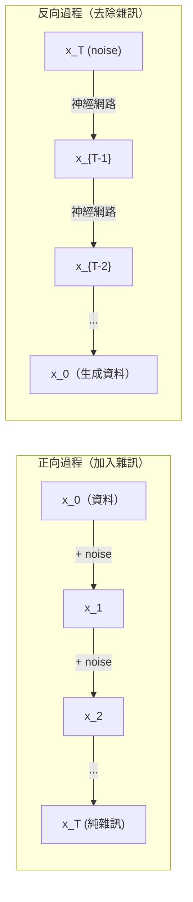

# 隨機過程

> 帶有結構的隨機性。隨機漫步、馬可夫鏈和擴散模型背後的數學。

**Type:** Learn
**Language:** Python
**Prerequisites:** Phase 1, Lessons 06-07 (probability, Bayes)
**Time:** ~75 minutes

## 學習目標

- 模擬一維和二維隨機漫步，並驗證位移會按 sqrt(n) 的尺度增長
- 建立馬可夫鏈模擬器，並透過特徵分解計算其穩態分布
- 實作 Metropolis-Hastings MCMC 與 Langevin 動力學，從目標分布取樣
- 說明正向擴散過程與布朗運動的關聯，並解釋反向過程如何生成資料

## 問題

許多 AI 系統都涉及隨時間演變的隨機性。這不是靜態的隨機，而是具有結構、依序發生的隨機性，每一步都取決於先前發生的事。

語言模型會一次生成一個詞元。每個詞元都取決於先前的上下文。模型會輸出機率分布，從中取樣，再繼續生成。這就是一種隨機過程。

擴散模型會逐步對影像加入雜訊，直到影像變成純雜訊；接著再反向執行，逐步去除雜訊，直到生成新影像。正向過程是馬可夫鏈，反向過程則是由模型學得、反向執行的馬可夫鏈。

強化學習代理程式會在環境中採取行動。每個行動都會以某種機率導向新的狀態。代理程式依照隨機策略，在隨機環境中運作；整個系統就是馬可夫決策過程。

MCMC 取樣是貝葉斯推論的基礎，它會建立一條穩態分布等於目標後驗分布的馬可夫鏈，藉此從後驗分布取樣。

以上應用都建立在四個基礎概念上：
1. 隨機漫步——最簡單的隨機過程
2. 馬可夫鏈——由轉移矩陣描述的結構化隨機性
3. Langevin 動力學——帶有雜訊的梯度下降
4. Metropolis-Hastings——從任意分布取樣的方法

## 核心概念

### 隨機漫步

從位置 0 開始。每一步都擲一次公平硬幣：正面就向右移動 (+1)，反面就向左移動 (-1)。

走 n 步後，所在位置就是 n 個隨機 +1 或 -1 數值的總和。期望位置是 0（因為漫步沒有偏向），但距離原點的期望值會隨 sqrt(n) 增長。

這個結果有點反直覺。漫步很公平，沒有任何方向的漂移；但隨著時間經過，它會離起點越來越遠。走 n 步後的標準差是 sqrt(n)。

```text
步驟 0：位置 = 0
步驟 1：位置 = +1 或 -1
步驟 2：位置 = +2、0 或 -2
...
步驟 100：距離原點的期望值約為 10 (sqrt(100))
步驟 10000：距離原點的期望值約為 100 (sqrt(10000))
```

**二維情況：** 漫步者以相同機率向上、向下、向左或向右移動。到原點距離同樣按 sqrt(n) 的尺度增長，路徑則會呈現類似碎形的形狀。

**為什麼是 sqrt(n)？** 每一步以相同機率移動 +1 或 -1。走 n 步後，位置為 S_n = X_1 + X_2 + ... + X_n，其中每個 X_i 都是 +/-1。每一步的變異數為 1，且各步彼此獨立，因此 Var(S_n) = n，標準差就是 sqrt(n)。根據中央極限定理，S_n / sqrt(n) 會收斂至標準常態分布。

sqrt(n) 這種尺度在機器學習中隨處可見。SGD 雜訊會按 1/sqrt(batch_size) 的尺度變化；嵌入維度則會按 sqrt(d) 的尺度變化。平方根是獨立隨機值相加後的特徵。

**與布朗運動的關聯。** 讓隨機漫步的每一步長度為 1/sqrt(n)，並在單位時間內走 n 步。當 n 趨近無限大時，漫步會收斂至布朗運動 B(t)——一種連續時間過程，其中 B(t) 服從平均數為 0、變異數為 t 的常態分布。

布朗運動是擴散模型的數學基礎，可用來描述流體中粒子的隨機抖動、股價波動，以及擴散模型中的雜訊過程。

**賭徒破產問題。** 一個從位置 k 開始的隨機漫步者，兩端設有吸收邊界 0 和 N。先到達 N、而非 0 的機率是多少？若是公平漫步：P(reach N) = k/N。結果簡單又優雅，也連結到鞅理論：公平隨機漫步是鞅（未來值的期望等於目前值）。

### 馬可夫鏈

馬可夫鏈是一種依照固定機率在狀態間轉移的系統。它的關鍵性質是：下一個狀態只取決於目前狀態，與先前的歷史無關。

```text
P(X_{t+1} = j | X_t = i, X_{t-1} = ...) = P(X_{t+1} = j | X_t = i)
```

這就是馬可夫性質。只要有轉移矩陣 P，就能描述系統的完整動態：

```text
P[i][j] = 從狀態 i 轉移到狀態 j 的機率
```

P 的每一列總和都是 1（系統一定會轉移到某個狀態）。

**範例——天氣：**

```text
狀態：晴天 (0)、雨天 (1)、陰天 (2)

P = [[0.7, 0.1, 0.2],    （若為晴天：70% 晴天、10% 雨天、20% 陰天）
     [0.3, 0.4, 0.3],    （若為雨天：30% 晴天、40% 雨天、30% 陰天）
     [0.4, 0.2, 0.4]]    （若為陰天：40% 晴天、20% 雨天、40% 陰天）
```

從任意狀態開始，經過多次轉移後，狀態分布會收斂到穩態分布 pi，其中 pi * P = pi。這是 P 的特徵值為 1 時所對應的左特徵向量。

對這個天氣馬可夫鏈而言，穩態分布是 [0.55, 0.18, 0.27]。長期來看，不論起始狀態為何，55% 的時間都會是晴天。


**計算穩態分布。** 有兩種方法：

1. **冪次法：** 使用 P 反覆乘上任意初始分布。迭代次數足夠多時就會收斂。
2. **特徵值法：** 找出 P 的特徵值為 1 時所對應的左特徵向量，也就是 P^T 的特徵值為 1 時所對應的特徵向量。

兩種方法都要求馬可夫鏈符合收斂條件。

**收斂條件。** 馬可夫鏈若符合以下條件，就會收斂至唯一的穩態分布：
- **不可約：** 任一狀態都能從其他所有狀態抵達。
- **非週期：** 鏈不會以固定週期循環。

機器學習中常見的多數馬可夫鏈都符合這兩個條件。

**吸收狀態。** 若進入某個狀態後就永遠不會離開（P[i][i] = 1），該狀態就是吸收狀態。吸收型馬可夫鏈可用來描述具有終止狀態的過程，例如遊戲結束、顧客流失，或詞元序列遇到文本結尾詞元。

**混合時間。** 馬可夫鏈要走幾步才會「接近」穩態分布？形式上，這是總變異距離降到指定門檻以下所需的步數。快速混合代表只需少數步。P 的譜間隙（1 減去第二大的特徵值）會控制混合時間；譜間隙越大，收斂越快。

### 與語言模型的關聯

語言模型生成詞元的過程近似馬可夫過程。給定目前上下文後，模型會輸出下一個詞元的機率分布。溫度會控制分布的尖銳程度：

```text
P(token_i) = exp(logit_i / temperature) / sum(exp(logit_j / temperature))
```

- 溫度 = 1.0：標準分布
- 溫度 < 1.0：分布較尖銳（結果較確定）
- 溫度 > 1.0：分布較平坦（隨機性較高）
- 溫度 -> 0：argmax（貪婪解碼）

Top-k 取樣會保留機率最高的 k 個詞元。Top-p（核心）取樣則保留累積機率超過 p 的最小詞元集合。兩種方法都會改變馬可夫轉移機率。

### 布朗運動

布朗運動是隨機漫步在連續時間下的極限。位置 B(t) 具有三項性質：
1. B(0) = 0
2. 若 t > s，B(t) - B(s) 服從平均數為 0、變異數為 t - s 的常態分布
3. 不重疊時間區間中的增量彼此獨立

布朗運動是連續的，卻處處不可微——無論縮放到多小的尺度，路徑都在抖動。在平面上的路徑具有 2 的碎形維度。

在離散模擬中，可用以下方式近似布朗運動：

```text
B(t + dt) = B(t) + sqrt(dt) * z，其中 z ~ N(0, 1)
```

sqrt(dt) 的尺度很重要，它來自將中央極限定理應用於隨機漫步。

### Langevin 動力學

梯度下降會找出函式的最小值。Langevin 動力學則會找出與 exp(-U(x)/T) 成正比的機率分布，其中 U(x) 是能量函式，T 是溫度。

```text
x_{t+1} = x_t - dt * gradient(U(x_t)) + sqrt(2 * T * dt) * z_t
```

粒子會受到兩種力量影響：
1. **梯度力**（-dt * gradient(U)）：推動粒子往低能量處移動（類似梯度下降）
2. **隨機力**（sqrt(2*T*dt) * z）：將粒子推向隨機方向（探索）

當溫度 T = 0 時，這就是純粹的梯度下降；溫度很高時，則接近隨機漫步。溫度適當時，粒子會探索能量地形，並在低能量區域停留較久。

**與擴散模型的關聯。** 擴散模型的正向過程如下：

```text
x_t = sqrt(alpha_t) * x_{t-1} + sqrt(1 - alpha_t) * noise
```

這是一條逐漸將資料與雜訊混合的馬可夫鏈。經過足夠多步後，x_T 就會成為純高斯雜訊。

反向過程會從雜訊還原資料，也是馬可夫鏈；但它的轉移機率是由神經網路學得。網路會預測每一步加入的雜訊，再把它扣除。



### MCMC：馬可夫鏈蒙地卡羅

有時你需要從機率分布 p(x) 取樣：雖然可以計算它（差一個常數因子），卻無法直接從中取樣。貝葉斯後驗分布就是典型例子——你知道概似函式乘上先驗分布，但正規化常數難以計算。

**Metropolis-Hastings** 會建立一條穩態分布為 p(x) 的馬可夫鏈：

1. 從某個位置 x 開始。
2. 依提議分布 Q(x'|x) 提出新的位置 x'。
3. 計算接受率：a = p(x') * Q(x|x') / (p(x) * Q(x'|x))。
4. 以 min(1, a) 的機率接受 x'，否則留在 x。
5. 重複執行。

若 Q 是對稱分布（例如 Q(x'|x) = Q(x|x') = N(x, sigma^2)），接受率可簡化為 a = p(x') / p(x)。只需要比較機率的比值，因為正規化常數會互相抵銷。

在一些基本條件下，這條鏈保證會收斂至 p(x)。但若提議幅度太小（像隨機漫步）或太大（導致大量拒絕），收斂速度就會很慢。調整提議分布是 MCMC 的一門技巧。

**為什麼有效？** 接受率確保符合細緻平衡：位於 x 並移動至 x' 的機率，等於位於 x' 並移動至 x 的機率。細緻平衡代表 p(x) 是這條鏈的穩態分布。因此經過足夠多步後，樣本就會來自 p(x)。

**實務考量：**
- **暖身期（burn-in）：** 捨棄前 N 個樣本。鏈需要時間從起始位置進入穩態分布。
- **稀疏取樣（thinning）：** 每隔 k 個樣本才保留一個，以降低自相關。
- **多條鏈：** 從不同起始位置執行多條鏈。若它們收斂到相同分布，就能作為收斂的證據。
- **接受率：** 對 d 維高斯提議分布而言，最佳接受率約為 23%（Roberts 與 Rosenthal，2001）。過高表示鏈幾乎沒有移動；過低則表示幾乎所有提議都被拒絕。

### AI 中的隨機過程

| 隨機過程 | AI 應用 |
|----------|---------|
| 隨機漫步 | 強化學習探索、Node2Vec 嵌入 |
| 馬可夫鏈 | 文字生成、MCMC 取樣 |
| 布朗運動 | 擴散模型（正向過程） |
| Langevin 動力學 | 基於分數的生成模型、SGLD |
| 馬可夫決策過程 | 強化學習 |
| Metropolis-Hastings | 貝葉斯推論、後驗取樣 |

```figure
random-walk-diffusion
```

## Build It：從零實作

### 步驟 1：隨機漫步模擬器

```python
import numpy as np

def random_walk_1d(n_steps, seed=None):
    rng = np.random.RandomState(seed)
    steps = rng.choice([-1, 1], size=n_steps)
    positions = np.concatenate([[0], np.cumsum(steps)])
    return positions


def random_walk_2d(n_steps, seed=None):
    rng = np.random.RandomState(seed)
    directions = rng.choice(4, size=n_steps)
    dx = np.zeros(n_steps)
    dy = np.zeros(n_steps)
    dx[directions == 0] = 1   # right
    dx[directions == 1] = -1  # left
    dy[directions == 2] = 1   # up
    dy[directions == 3] = -1  # down
    x = np.concatenate([[0], np.cumsum(dx)])
    y = np.concatenate([[0], np.cumsum(dy)])
    return x, y
```

一維漫步會儲存累積總和。每一步為 +1 或 -1，走 n 步後的位置就是總和。變異數會隨 n 線性增加，因此標準差會按 sqrt(n) 增長。

### 步驟 2：馬可夫鏈

```python
class MarkovChain:
    def __init__(self, transition_matrix, state_names=None):
        self.P = np.array(transition_matrix, dtype=float)
        self.n_states = len(self.P)
        self.state_names = state_names or [str(i) for i in range(self.n_states)]

    def step(self, current_state, rng=None):
        if rng is None:
            rng = np.random.RandomState()
        probs = self.P[current_state]
        return rng.choice(self.n_states, p=probs)

    def simulate(self, start_state, n_steps, seed=None):
        rng = np.random.RandomState(seed)
        states = [start_state]
        current = start_state
        for _ in range(n_steps):
            current = self.step(current, rng)
            states.append(current)
        return states

    def stationary_distribution(self):
        eigenvalues, eigenvectors = np.linalg.eig(self.P.T)
        idx = np.argmin(np.abs(eigenvalues - 1.0))
        stationary = np.real(eigenvectors[:, idx])
        stationary = stationary / stationary.sum()
        return np.abs(stationary)
```

穩態分布是 P 的特徵值為 1 時所對應的左特徵向量。我們計算 P^T 的特徵向量來找出它，因為轉置矩陣會把左特徵向量轉成右特徵向量。

### 步驟 3：Langevin 動力學

```python
def langevin_dynamics(grad_U, x0, dt, temperature, n_steps, seed=None):
    rng = np.random.RandomState(seed)
    x = np.array(x0, dtype=float)
    trajectory = [x.copy()]
    for _ in range(n_steps):
        noise = rng.randn(*x.shape)
        x = x - dt * grad_U(x) + np.sqrt(2 * temperature * dt) * noise
        trajectory.append(x.copy())
    return np.array(trajectory)
```

梯度會將 x 推向低能量區域，雜訊則可避免它卡在局部。達到平衡時，樣本分布會與 exp(-U(x)/temperature) 成正比。

### 步驟 4：Metropolis-Hastings

```python
def metropolis_hastings(target_log_prob, proposal_std, x0, n_samples, seed=None):
    rng = np.random.RandomState(seed)
    x = np.array(x0, dtype=float)
    samples = [x.copy()]
    accepted = 0
    for _ in range(n_samples - 1):
        x_proposed = x + rng.randn(*x.shape) * proposal_std
        log_ratio = target_log_prob(x_proposed) - target_log_prob(x)
        if np.log(rng.rand()) < log_ratio:
            x = x_proposed
            accepted += 1
        samples.append(x.copy())
    acceptance_rate = accepted / (n_samples - 1)
    return np.array(samples), acceptance_rate
```

演算法會提出新位置、檢查新位置的機率是否更高（否則依機率比值決定是否接受），再重複執行。若要有良好的混合效果，接受率應維持在約 23% 到 50%。

## Use It：實際應用

實務上會使用成熟函式庫提供的演算法，但理解其運作方式仍有助於除錯和調整參數。

```python
import numpy as np

rng = np.random.RandomState(42)
walk = np.cumsum(rng.choice([-1, 1], size=10000))
print(f"Final position: {walk[-1]}")
print(f"Expected distance: {np.sqrt(10000):.1f}")
print(f"Actual distance: {abs(walk[-1])}")
```

### 使用 numpy 處理轉移矩陣

```python
import numpy as np

P = np.array([[0.7, 0.1, 0.2],
              [0.3, 0.4, 0.3],
              [0.4, 0.2, 0.4]])

distribution = np.array([1.0, 0.0, 0.0])
for _ in range(100):
    distribution = distribution @ P

print(f"Stationary distribution: {np.round(distribution, 4)}")
```

將初始分布反覆乘上 P。經過足夠多次迭代後，結果會收斂至穩態分布，不受起始位置影響。這就是用來找出主導左特徵向量的冪次法。

### 與實際框架的關聯

- **PyTorch 擴散模型：** Hugging Face `diffusers` 中的 `DDPMScheduler` 會實作正向與反向馬可夫鏈。
- **NumPyro / PyMC：** 使用 MCMC（例如改良 Metropolis-Hastings 的 NUTS 取樣器）進行貝葉斯推論。
- **Gymnasium（強化學習）：** 環境的 step 函式定義了馬可夫決策過程。

### 驗證馬可夫鏈收斂

```python
import numpy as np

P = np.array([[0.9, 0.1], [0.3, 0.7]])

eigenvalues = np.linalg.eigvals(P)
spectral_gap = 1 - sorted(np.abs(eigenvalues))[-2]
print(f"Eigenvalues: {eigenvalues}")
print(f"Spectral gap: {spectral_gap:.4f}")
print(f"Approximate mixing time: {1/spectral_gap:.1f} steps")
```

譜間隙能表示鏈忘記初始狀態的速度。譜間隙為 0.2 時，大約需要 5 步混合；譜間隙為 0.01 時，大約需要 100 步。執行長時間模擬前，請先檢查這項數值——混合速度慢的鏈會浪費運算資源。

## Ship It：交付成果

本課程會產生：
- `outputs/prompt-stochastic-process-advisor.md`——協助判斷特定問題適用哪一種隨機過程架構的提示詞

## 關聯概念

| 概念 | 應用場景 |
|------|----------|
| 隨機漫步 | Node2Vec 圖嵌入、強化學習探索 |
| 馬可夫鏈 | LLM 詞元生成、MCMC 取樣 |
| 布朗運動 | DDPM 正向擴散過程、以 SDE 為基礎的模型 |
| Langevin 動力學 | 基於分數的生成模型、隨機梯度 Langevin 動力學（SGLD） |
| 穩態分布 | MCMC 收斂目標、PageRank |
| Metropolis-Hastings | 貝葉斯後驗取樣、模擬退火 |
| 溫度 | LLM 取樣、強化學習中的 Boltzmann 探索、模擬退火 |
| 混合時間 | MCMC 收斂速度、譜間隙分析 |
| 吸收狀態 | 序列結尾詞元、強化學習終止狀態 |
| 細緻平衡 | MCMC 取樣器的正確性保證 |

擴散模型值得特別介紹。DDPM（Ho 等人，2020）定義了正向馬可夫鏈：

```text
q(x_t | x_{t-1}) = N(x_t; sqrt(1-beta_t) * x_{t-1}, beta_t * I)
```

其中 beta_t 是雜訊排程。經過 T 步後，x_T 近似服從 N(0, I)。反向過程則由預測雜訊的神經網路參數化：

```text
p_theta(x_{t-1} | x_t) = N(x_{t-1}; mu_theta(x_t, t), sigma_t^2 * I)
```

生成過程中的每一步，都是一條已學得馬可夫鏈中的一步。理解馬可夫鏈，就能理解擴散模型如何以及為何能生成資料。

SGLD（隨機梯度 Langevin 動力學）會把小批次梯度下降與 Langevin 雜訊結合。它不計算完整梯度，而是使用隨機估計值，並加入經過校準的雜訊。隨著學習率逐漸下降，SGLD 會從最佳化轉為取樣，直接取得近似的貝葉斯後驗樣本。這是取得神經網路不確定性估計最簡單的方法之一。

這些關聯都指向同一個關鍵觀念：隨機過程不只是理論工具，也是現代 AI 系統內部的計算機制。調整 LLM 的溫度，就是在調整馬可夫鏈；訓練擴散模型，就是學習反轉類似布朗運動的過程；執行貝葉斯推論，則是在建立一條會收斂到後驗分布的鏈。

## Exercises：練習

1. **模擬 1000 條、每條 10000 步的隨機漫步。** 繪製最終位置的分布，並確認它大致符合平均數為 0、標準差為 sqrt(10000) = 100 的高斯分布。

2. **使用馬可夫鏈建立文字生成器。** 使用小型語料訓練：對每個詞統計下一個詞的轉移次數，建立轉移矩陣，再從鏈中取樣來生成新句子。

3. **使用 Metropolis-Hastings 實作模擬退火。** 從高溫開始（幾乎接受所有提議），再逐漸降溫（只接受改善結果的提議）。用它尋找具有多個局部最小值之函式的最小值。

4. **比較不同溫度下的 Langevin 動力學。** 從雙井位能 U(x) = (x^2 - 1)^2 取樣。低溫時，樣本會集中在其中一個井；高溫時，樣本會分散到兩個井中。找出鏈能在兩井間混合的臨界溫度。

5. **實作正向擴散過程。** 從一維訊號（例如正弦波）開始，依線性雜訊排程逐步加入雜訊，共 100 步，觀察訊號如何退化成純雜訊。接著實作簡單的去雜訊器，反向執行這個過程（即使只是扣除估計的雜訊也可以）。

## 關鍵詞

| 術語 | 一般說法 | 實際意義 |
|------|----------|----------|
| 隨機漫步 |「擲硬幣決定方向」| 每一步的位置都會因隨機增量而改變的過程 |
| 馬可夫性質 |「沒有記憶」| 未來只取決於目前狀態，與過去歷史無關 |
| 轉移矩陣 |「機率表」| P[i][j] 是從狀態 i 轉移到狀態 j 的機率 |
| 穩態分布 |「長期平均」| pi*P = pi 的分布，是馬可夫鏈的平衡狀態 |
| 布朗運動 |「隨機抖動」| 隨機漫步的連續時間極限，B(t) ~ N(0, t) |
| Langevin 動力學 |「帶有雜訊的梯度下降」| 將確定性梯度與隨機擾動結合的更新規則 |
| MCMC |「朝目標漫步」| 建立一條穩態分布為目標分布的馬可夫鏈 |
| Metropolis-Hastings |「提出後接受或拒絕」| 使用接受率確保收斂的 MCMC 演算法 |
| 溫度 |「隨機性旋鈕」| 控制探索與利用之間取捨的參數 |
| 擴散過程 |「加入雜訊，再去除雜訊」| 正向逐步加入雜訊，反向逐步移除雜訊，藉此生成資料 |

## 延伸閱讀

- **Ho、Jain、Abbeel（2020）**——〈Denoising Diffusion Probabilistic Models〉：引發擴散模型發展的 DDPM 論文，清楚推導正向與反向馬可夫鏈。
- **Song 與 Ermon（2019）**——〈Generative Modeling by Estimating Gradients of the Data Distribution〉：使用 Langevin 動力學取樣的基於分數生成方法。
- **Roberts 與 Rosenthal（2004）**——〈General state space Markov chains and MCMC algorithms〉：說明 MCMC 在何種情況下有效及其原因的理論。
- **Norris（1997）**——《Markov Chains》：馬可夫鏈標準教科書，涵蓋收斂、穩態分布和到達時間。
- **Welling 與 Teh（2011）**——〈Bayesian Learning via Stochastic Gradient Langevin Dynamics〉：結合 SGD 與 Langevin 動力學，以支援可擴展的貝葉斯推論。
