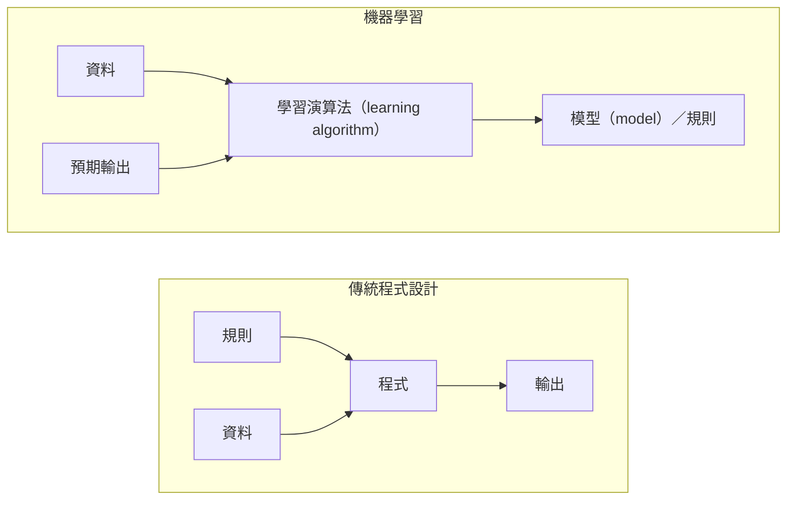
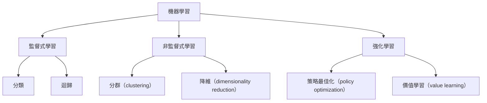
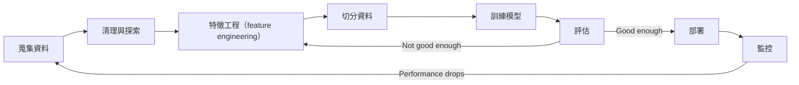
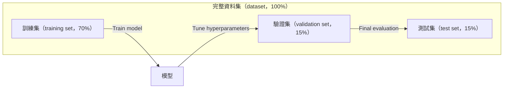
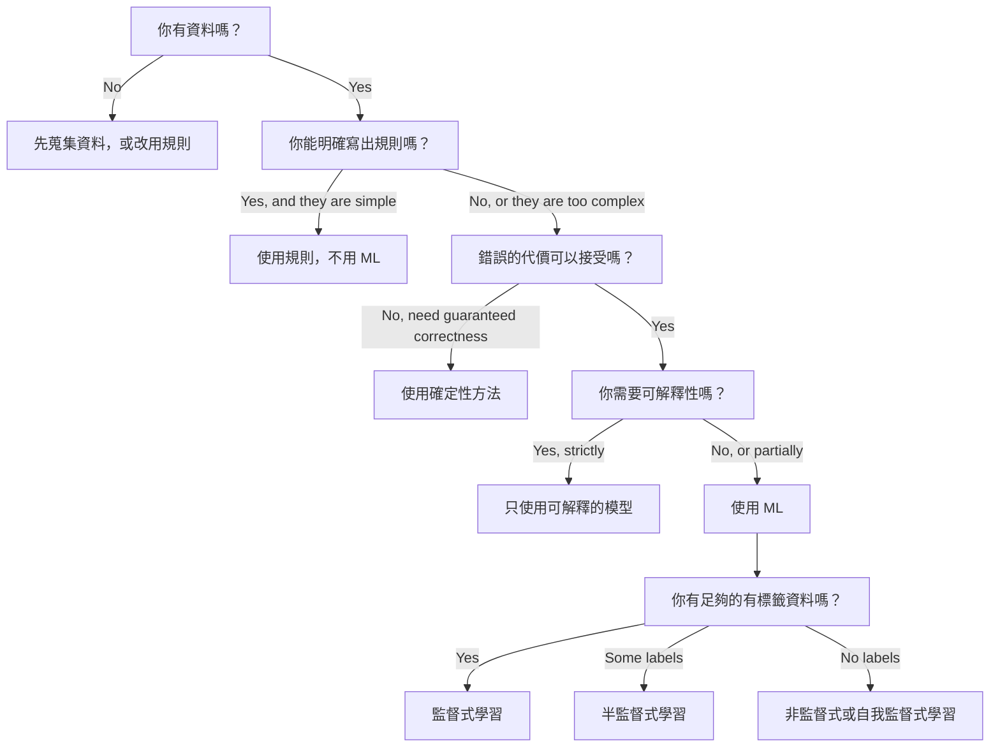

# 什麼是機器學習（machine learning）

> 機器學習教電腦從資料（data）中找出模式，而不是手動撰寫規則。

**Type:** Learn
**Languages:** Python
**Prerequisites:** Phase 1 (Math Foundations)
**Time:** ~45 minutes

## Learning Objectives｜學習目標

- 說明監督式學習（supervised learning）、非監督式學習（unsupervised learning）和強化學習（reinforcement learning）的差異，並判斷某個問題適用哪一種類型
- 從頭實作最近質心分類器（nearest centroid classifier），並與隨機基準模型（random baseline）比較評估結果
- 分辨分類（classification）與迴歸（regression）任務，並為各任務選擇合適的損失函數（loss function）
- 評估某個商業問題是否適合用 ML，或以確定性規則（deterministic rule）解決更合適

## The Problem｜問題

你想要打造一個垃圾郵件篩選器（spam filter）。傳統作法是坐下來寫上百條規則：「如果電子郵件包含『FREE MONEY』，就標記為垃圾郵件；如果驚嘆號超過 3 個，也標記為垃圾郵件。」你花了好幾個星期寫規則，接著垃圾郵件寄件者改變措辭，規則就失效。你再補上更多規則，這個循環沒完沒了。

機器學習則反轉了這個作法。你不再自己寫規則，而是提供成千上萬封帶有標籤（label）的電子郵件（「垃圾郵件」或「不是垃圾郵件」），讓電腦自行找出規則。電腦能發現你想不到的模式。當垃圾郵件寄件者改變手法時，你可以用新資料重新訓練（retrain）模型，而不必重寫程式碼（code）。

這種從「撰寫規則」轉變為「從資料中學習」的方式，就是機器學習的核心。推薦引擎（recommendation engine）、語音助理（voice assistant）、自動駕駛車（self-driving car）和語言模型（language model）都以這種方式運作。

## The Concept｜核心概念

### 從資料學習，而非依賴規則

傳統程式設計和機器學習以相反的方向解決問題。



傳統程式設計：你撰寫規則，程式再將規則套用到資料，產生輸出。

機器學習：你提供資料和預期輸出，演算法會找出規則。

訓練（training）產生的「模型」就是規則，只是以數字（權重（weights）、參數（parameters））表示。它會從看過的範例中泛化（generalization），進而對從未看過的資料做出預測（prediction）。

### 機器學習的三種類型



**監督式學習**：你有輸入－輸出配對（input-output pair），模型會學習將輸入映射到輸出。
- 「這裡有 10,000 張標記為貓或狗的照片，請學會分辨牠們。」
- 「這裡有房屋特徵（features）和價格，請學會預測價格。」

**非監督式學習**：你只有輸入，沒有標籤；模型會自行找出其中的結構。
- 「這裡有 10,000 筆顧客購買紀錄，請找出自然形成的群組。」
- 「這裡有 1,000 維的資料點（data points）。請將它們降到 2 維，同時保留資料結構。」

**強化學習**：agent 在環境中採取動作，並得到獎勵（reward）或懲罰（penalty）。它會學習一套策略（policy），讓總獎勵最大化。
- 「玩這個遊戲，贏了得 +1 分，輸了 -1 分，自己想出一套策略。」
- 「控制這隻機械手臂，成功拿起物體得 +1 分，每浪費 1 秒，獎勵就是 -0.01 分。」

實務上，你要建置的大多數系統都會用到監督式學習。非監督式學習常用於前處理（preprocessing）和資料探索（data exploration）；強化學習則用於遊戲 AI、機器人，以及語言模型的 RLHF。

### 超越三大類型

上面三種類型的分類很清楚，但真實世界的 ML 往往沒有那麼明確。

**半監督式學習（semi-supervised learning）**會使用少量有標籤資料（labeled data）和大量無標籤資料（unlabeled data）。例如，你可能有 100 張標記過的醫學影像，以及 100,000 張未標記的影像。常見技術包括：

- **標籤傳播（label propagation）：**建立連結相似資料點的圖，讓標籤沿著圖從已標記的節點傳到尚未標記的鄰近節點。
- **偽標籤法（pseudo-labeling）：**先用有標籤資料訓練模型，再用它預測無標籤資料的標籤，最後用全部資料重新訓練。模型會逐步建立自己的訓練集。
- **一致性正則化（consistency regularization）：**要求模型對原始輸入及其輕微擾動版本給出相同預測，即使沒有標籤也能使用。

**自我監督式學習（self-supervised learning）**會從資料本身產生監督訊號，不需要人工標籤。模型會利用資料的結構，為自己建立預測任務。

- **遮罩語言模型（masked language modeling，BERT）：**隱藏句子中 15% 的詞，訓練模型預測缺少的詞；「標籤」來自原始文字。
- **對比式學習（contrastive learning，SimCLR）：**為同一張圖片產生兩個增強版本，訓練模型辨識它們來自同一張圖片，同時和其他圖片的增強版本區分。
- **next-token prediction（GPT）：**根據前面所有詞預測下一個詞。每份文字文件都能成為訓練樣本（training example）。

這些並不是和三大類型完全不同的新類別，而是結合監督式與非監督式概念的策略。嚴格來說，自我監督式學習仍屬於監督式學習（模型會做預測），但標籤是自動產生的，而不是由人工標註。

### 分類與迴歸

這是監督式學習的兩種主要任務。

| 面向 | 分類 | 迴歸 |
|--------|---------------|------------|
| 輸出 | 離散類別 | 連續數值 |
| 例子 | 「這封電子郵件是不是垃圾郵件？」 | 「房價會是多少？」 |
| 輸出範圍 | {cat, dog, bird} | 任意實數 |
| 損失函數 | 交叉熵（cross-entropy）、準確率（accuracy） | 均方誤差（mean squared error）、MAE |
| 決策方式 | 找出不同類別（class）的邊界 | 找出最符合資料的曲線 |

分類回答「是哪一類？」；迴歸回答「數值是多少？」

有些問題可以用兩種方式表示。預測股票會漲還是跌是分類；預測確切股價則是迴歸。

### 機器學習工作流程

不論使用哪種演算法，每個機器學習專案（project）都遵循同一條管線（pipeline）。



**蒐集資料**：收集原始資料。資料量幾乎總是越多越好，但資料品質比數量更重要。

**清理與探索**：處理缺失值、移除重複資料、視覺化分布，並找出異常值。這個步驟常占整個專案時間的 60–80%。

**特徵工程（feature engineering）**：將原始資料轉換成模型可以使用的特徵。例如，把日期轉成星期幾、將數值欄位正規化（normalization）、把類別變數編碼。好的特徵比花俏的演算法更重要。

**切分資料**：將資料分成訓練集（training set）、驗證集（validation set）和測試集（test set）。模型在訓練集上訓練；你用驗證集調整超參數（hyperparameters），再用測試集回報最終效能。

**訓練模型**：將訓練資料（training data）輸入演算法，讓演算法調整內部參數，以最小化損失函數。

**評估**：在驗證集或測試集上衡量模型效能。如果結果不理想，就回頭嘗試其他特徵、演算法或超參數。

**部署**：將模型放進正式環境，讓它預測新資料。

**監控**：持續追蹤模型效能。資料分布（data distribution）會改變，這稱為資料漂移（data drift），模型表現也可能逐漸下降；效能變差時，就要重新訓練。

### 訓練集、驗證集與測試集切分

初學者最常弄錯的就是這個概念。你必須用模型在訓練期間從未看過的資料評估它，否則你量到的只是記憶，而不是學習。



| 資料切分 | 用途 | 使用時機 | 常見比例 |
|-------|------|---------|--------|
| 訓練集 | 讓模型從資料中學習 | 訓練期間 | 60–80% |
| 驗證集 | 調整超參數、比較模型 | 每次訓練後 | 10–20% |
| 測試集 | 不偏不倚地估計最終效能 | 最後，只使用一次 | 10–20% |

測試集不可侵犯，只能查看一次。如果你不斷根據測試結果調整模型，等於也在用測試集訓練，最後回報的數字就失去意義。

資料集較小時，可以使用 k-fold 交叉驗證（cross-validation）：將資料切成 k 份，每次用其中 k−1 份訓練、剩下 1 份驗證，輪流執行並平均結果。

### 過度擬合（overfitting）與欠擬合（underfitting）


**欠擬合**：模型太簡單，無法掌握資料中的模式。例如用直線去擬合起伏不定的關係曲線。訓練誤差和測試誤差都很高。

**過度擬合**：模型太複雜，連訓練資料中的雜訊也記住了。曲線通過每個訓練資料點，卻無法處理新資料。訓練誤差很低，測試誤差很高。

**擬合良好**：模型掌握了真正的模式，卻沒有把雜訊也記下來。訓練誤差和測試誤差都在合理範圍內。

過度擬合的徵兆：
- 訓練準確率遠高於驗證準確率
- 模型在訓練資料上表現很好，但在新資料上表現不佳
- 增加訓練資料後，模型表現有所改善（原本只是把資料記下來，沒有學會真正的模式）

改善過度擬合的方法：
- 蒐集更多訓練資料
- 降低模型複雜度（減少參數或使用較簡單的架構）
- 使用正則化（regularization），對過大的權重加上懲罰項（penalty term）
- 使用 dropout，訓練時隨機將部分神經元（neuron）輸出設為 0
- 提前停止（early stopping）：驗證誤差開始上升時停止訓練

改善欠擬合的方法：
- 使用更複雜的模型
- 增加更多特徵
- 降低正則化強度
- 延長訓練時間

### 偏差－變異取捨（bias-variance tradeoff）

這是理解過度擬合與欠擬合背後的數學架構。

**偏差（bias）**：模型假設錯誤造成的誤差。當真實關係是非線性時，線性模型的偏差就會很高；偏差過高會造成欠擬合。

**變異（variance）**：模型對訓練資料微小波動的敏感度所造成的誤差。若模型的變異很高，換一批訓練資料後，模型預測可能差很多；變異過高會造成過度擬合。

| 模型複雜度 | 偏差 | 變異 | 結果 |
|-----------------|------|----------|--------|
| 太低（用線性模型處理曲線資料） | 高 | 低 | 欠擬合 |
| 恰到好處 | 中 | 中 | 泛化良好 |
| 太高（用 20 次多項式擬合 10 個資料點） | 低 | 高 | 過度擬合 |

Total error = Bias^2 + Variance + Irreducible noise

你無法降低不可約雜訊（irreducible noise），因為它來自資料本身的隨機性。你要找到 bias^2 + variance 最小的平衡點。

### No Free Lunch 定理

沒有任何一種演算法能在每個問題上都表現最好。一種演算法若在某類問題上表現良好，在另一類問題上就可能表現不佳。因此，資料科學家會嘗試多種演算法並比較結果。

實際選擇時，要考慮：
- 你有多少資料
- 有多少特徵
- 關係是線性還是非線性
- 是否需要可解釋性（explainability）
- 可負擔多少運算資源

### 何時不該使用機器學習

機器學習很強大，但不一定適合所有問題。使用模型之前，先想想自己是否真的需要它。

**以下情況不適合使用機器學習：**

- **規則簡單且明確。**計算稅額、排序演算法、單位換算等。如果用幾個 if 條件就能寫出邏輯，加入模型只會增加複雜度，沒有實際好處。
- **沒有資料或資料太少。**機器學習需要範例才能學習。只有 10 筆資料時，無法訓練出有意義的模型；先蒐集資料。
- **錯誤可能造成災難性後果，而且必須保證正確。**例如計算藥物劑量、控制核反應爐或密碼學驗證（cryptographic verification）。機器學習模型只能給出機率性的結果，有時仍會出錯；如果不能接受這種風險，就使用確定性方法（deterministic method）。
- **查表或啟發式方法（heuristic）已能解決問題。**如果簡單的閾值（threshold）或查表就能涵蓋 99% 的情況，加入機器學習只會提高維護成本，不會帶來明顯改善。
- **無法解釋決策，但任務要求必須可解釋。**貸款、保險、刑事司法等受監管產業，有時要求每個決策都完全可解釋。有些模型（例如線性迴歸（linear regression）、小型決策樹（decision tree））容易解釋，但多數模型並非如此。
- **問題變化速度比重新訓練還快。**如果規則每天都變，而重新訓練要花一週，模型就會一直過時。

請參考以下決策流程圖：



```figure
f3-learning-boundary
```

## Build It｜動手實作

`code/ml_intro.py` 中的程式碼從頭實作了最近質心分類器（nearest centroid classifier），這是最簡單的機器學習演算法。它示範核心概念：從資料中學習，再對新資料做出預測。

### 步驟 1：從頭實作最近質心分類器

最近質心分類器會計算訓練資料中每個類別的中心，也就是平均數（mean）。預測時，它會把每個新資料點分到距離最近的中心所屬的類別。

```python
class NearestCentroid:
    def fit(self, X, y):
        self.classes = np.unique(y)
        self.centroids = np.array([
            X[y == c].mean(axis=0) for c in self.classes
        ])

    def predict(self, X):
        distances = np.array([
            np.sqrt(((X - c) ** 2).sum(axis=1))
            for c in self.centroids
        ])
        return self.classes[distances.argmin(axis=0)]
```

整個演算法就是這樣。fit 只會計算兩個平均數；predict 只會計算距離。沒有梯度下降法、沒有迭代，也沒有超參數。

### 步驟 2：用合成資料（synthetic data）訓練

我們產生一個有兩個類別、且類別稍微重疊的 2D 分類資料集。質心分類器會在類別中心之間畫出線性決策邊界。

```python
rng = np.random.RandomState(42)
X_class0 = rng.randn(100, 2) + np.array([1.0, 1.0])
X_class1 = rng.randn(100, 2) + np.array([-1.0, -1.0])
X = np.vstack([X_class0, X_class1])
y = np.array([0] * 100 + [1] * 100)
```

### 步驟 3：和基準模型比較

每個機器學習模型都應該與簡單的基準模型相比。這裡的基準模型會隨機猜測類別。如果機器學習模型沒有勝過隨機猜測，就代表出了問題。

```python
baseline_preds = rng.choice([0, 1], size=len(y_test))
baseline_acc = np.mean(baseline_preds == y_test)
```

在這組乾淨資料上，最近質心分類器的準確率應該可以達到 90% 以上，隨機基準模型的準確率則約為 50%。

### 為什麼這很重要

最近質心分類器非常簡單，沒有超參數、不需要迭代，也不需要梯度下降法，但它仍具備機器學習的基本模式：

1. **學習**：從訓練資料學出一種表示方式（各類別的中心）
2. **預測**：用這種表示方式處理新資料（找出距離最近的中心）
3. **評估**：與基準模型比較（隨機猜測）

從邏輯斯迴歸（logistic regression）到 transformer，每種機器學習演算法都遵循這個三步驟模式。差別在於表示方式越來越複雜，但整體流程不變。

### 步驟 4：質心分類器的限制

最近質心分類器假設每個類別都只形成一個資料團塊。它只能畫出線性決策邊界（linear decision boundary），因此遇到以下情況就會失效：

- 類別包含多個群集（cluster；例如數字「1」有好幾種寫法）
- 決策邊界是非線性的（例如一個類別環繞著另一個類別）
- 特徵的尺度差異很大（距離會被尺度最大的特徵主導）

這些限制促使我們繼續學習其他演算法。k 最近鄰法（K-nearest neighbors）能處理多個群集；決策樹能處理非線性邊界；特徵縮放（feature scaling）則能改善尺度不一致的問題。每一課都會在前一課的限制上繼續往前建構。

## Use It｜實際應用

sklearn 提供 `NearestCentroid` 和合成資料產生器：

```python
from sklearn.neighbors import NearestCentroid
from sklearn.datasets import make_classification
from sklearn.model_selection import train_test_split

X, y = make_classification(
    n_samples=500, n_features=2, n_redundant=0,
    n_clusters_per_class=1, random_state=42
)
X_train, X_test, y_train, y_test = train_test_split(X, y, test_size=0.3)

clf = NearestCentroid()
clf.fit(X_train, y_train)
print(f"Accuracy: {clf.score(X_test, y_test):.3f}")
```

## Ship It｜交付成果

本課會產出 `outputs/prompt-ml-problem-framer.md`，裡面有一份協助把模糊商業問題轉成明確機器學習任務的 prompt。提供一段問題描述（例如「我們想降低顧客流失」或「預測下一季的需求」），它就會辨識學習類型、定義預測目標、列出候選特徵、選擇成功指標（success metric）、建立基準，並指出資料洩漏（data leakage）或類別不平衡（class imbalance）等風險。每次開始機器學習專案時，都可以用它避免一開始就做錯方向。

## Key Terms｜關鍵術語

| 術語 | 常見說法 | 實際意義 |
|------|----------------|----------------------|
| 模型 | 「AI」 | 一個可以學習參數、將輸入映射到輸出的數學函數 |
| 訓練 | 「教 AI」 | 執行最佳化演算法，調整模型參數，讓預測符合已知輸出 |
| 特徵 | 「輸入欄位」 | 資料中可測量的屬性，模型會用它來做預測 |
| 標籤 | 「答案」 | 訓練樣本的已知輸出，用來計算誤差訊號 |
| 超參數 | 「可調的設定」 | 訓練前先設定的參數，用來控制學習過程（例如學習率（learning rate）、層數） |
| 損失函數 | 「模型錯得有多離譜」 | 衡量預測與實際結果差距的函數；訓練時會盡量將它最小化 |
| 過度擬合 | 「把測試資料背起來」 | 模型學到訓練資料中特有的雜訊，而不是一般模式，因此無法處理新資料 |
| 欠擬合 | 「沒學到東西」 | 模型太簡單，無法掌握資料中的真正模式 |
| 泛化 | 「能處理新資料」 | 模型對從未參與訓練的資料做出準確預測的能力 |
| 交叉驗證 | 「換不同區塊測試」 | 反覆切分訓練集和測試集並平均結果，能更穩健地估計模型效能 |
| 正則化 | 「讓權重維持較小」 | 在損失函數中加入懲罰項（penalty term），避免模型過度複雜 |
| 資料漂移 | 「世界變了」 | 輸入資料的統計分布隨時間改變，導致模型效能下降 |

## Exercises｜練習

1. 取一份資料集（例如 Iris 或 Titanic），依 70/15/15 的比例切分成訓練集、驗證集和測試集。說明為什麼不應該用測試集調整超參數。
2. 列出三個真實世界的問題。針對每個問題，判斷它屬於分類、迴歸或分群，以及它是監督式還是非監督式學習。
3. 某個模型在訓練資料上有 99% 準確率，在測試資料上卻只有 60%。判斷問題所在，並列出三種你會嘗試的改善方法。

## Further Reading｜延伸閱讀

- [統計學習導論（An Introduction to Statistical Learning）](https://www.statlearning.com/)——免費教材，透過實例介紹各種經典機器學習方法
- [Google 機器學習速成課程（Google's Machine Learning Crash Course）](https://developers.google.com/machine-learning/crash-course)——以精簡的視覺化內容介紹機器學習概念
- [Scikit-learn 使用者指南（Scikit-learn User Guide）](https://scikit-learn.org/stable/user_guide.html)——在 Python 中實作機器學習的實用參考資料
