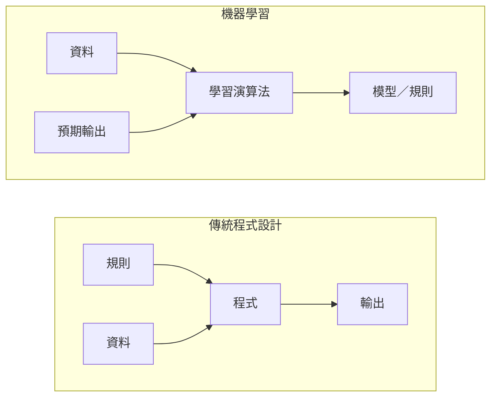
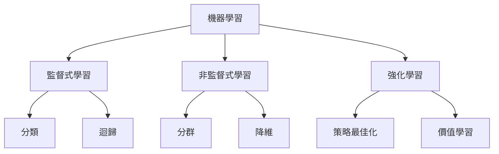
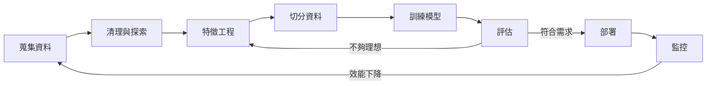
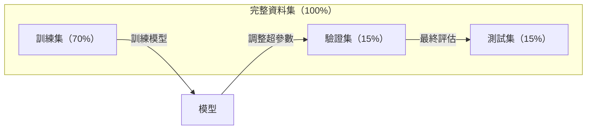
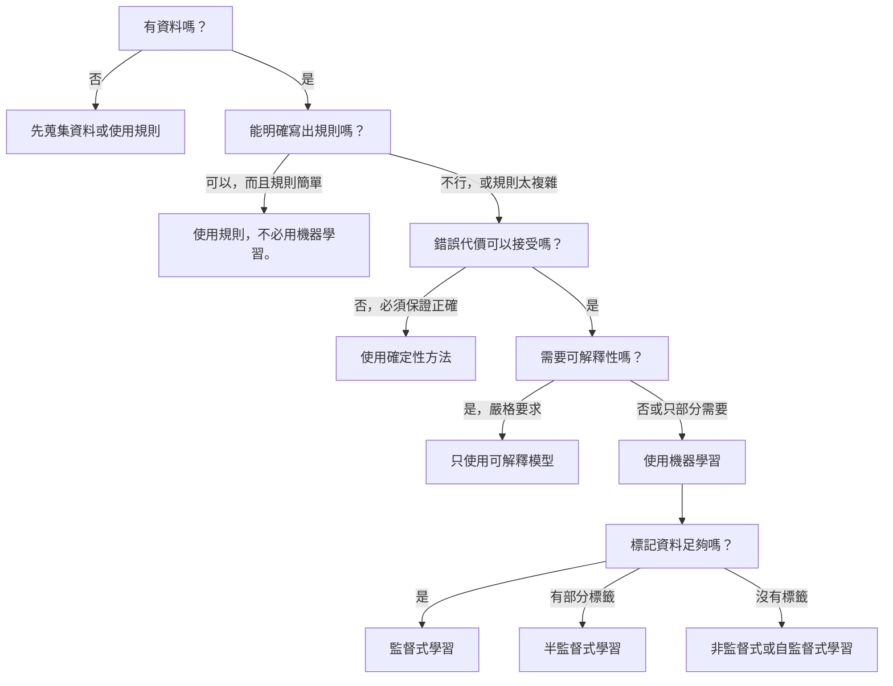

# 什麼是機器學習

> 機器學習是讓電腦從資料中找出模式，而不是由人手動撰寫規則。

**Type:** Learn
**Languages:** Python
**Prerequisites:** Phase 1 (Math Foundations)
**Time:** ~45 minutes

## 學習目標

- 說明監督式學習、非監督式學習和強化學習的差異，並判斷問題適用哪一類
- 從零實作最近質心分類器，並與隨機基準比較
- 分辨分類與迴歸任務，並為各任務選擇合適的損失函式
- 評估特定商業問題適合使用機器學習，還是用確定性規則更合適

## 問題

假設你想打造垃圾郵件過濾器。傳統做法是坐下來寫上百條規則：「如果郵件含有『FREE MONEY』，就標記為垃圾郵件。如果驚嘆號超過 3 個，也標記為垃圾郵件。」你花上好幾週撰寫規則，接著垃圾郵件寄件者改了用字，規則就失效了。你只好再寫更多規則，這個循環永無止境。

機器學習會反過來處理：你不必撰寫規則，而是提供數千封已標記的郵件（「垃圾郵件」或「非垃圾郵件」），讓電腦自行找出規則。電腦能發現你原本想不到的模式。當垃圾郵件寄件者改變手法時，只要使用新資料重新訓練，不必重寫程式碼。

從「撰寫規則」轉向「從資料中學習」，就是機器學習的核心。所有推薦引擎、語音助理、自動駕駛車和語言模型都是以此方式運作。

## 核心概念

### 從資料學習，而不是遵循規則

傳統程式設計和機器學習以相反的方向解決問題。



傳統程式設計：由你撰寫規則，程式將規則套用到資料上，產生輸出。

機器學習：由你提供資料和預期輸出，再由演算法找出規則。

訓練完成後產生的「模型」就是這些規則，只是以數字（權重、參數）編碼。模型會從看過的範例中歸納規則，對從未看過的資料做出預測。

### 機器學習的三種類型



**監督式學習：** 你有輸入－輸出配對資料，模型會學習將輸入映射到輸出。
- 「這裡有 10,000 張標記為貓或狗的照片，請學會分辨兩者。」
- 「這裡有房屋特徵和價格，請學會預測房價。」

**非監督式學習：** 你只有輸入資料，沒有標籤，由模型自行找出結構。
- 「這裡有 10,000 份顧客購買紀錄，請找出自然形成的群組。」
- 「這裡有 1,000 筆高維度資料，請在保留結構的前提下將它們降至 2 維。」

**強化學習：** 代理程式在環境中採取行動，並收到獎勵或懲罰。它會學習一種策略（policy），以最大化總獎勵。
- 「玩這個遊戲。贏了 +1，輸了 -1，請自行找出策略。」
- 「控制這隻機器手臂。成功拿起物件得 +1，每浪費一秒扣 -0.01。」

實務上，你將會建構的大多數模型都使用監督式學習。非監督式學習常用於前處理和探索資料；強化學習則應用於遊戲 AI、機器人，以及語言模型的 RLHF。

### 三大類之外的學習方式

上述三種類型界線清楚，但在真實世界的機器學習中，分類方式往往不那麼分明。

**半監督式學習**會同時使用少量標記資料和大量未標記資料。例如，你可能有 100 張已標記的醫療影像，以及 100,000 張未標記影像。常見技術包括：

- **標籤傳播：** 建立連結相似資料點的圖，讓標籤從已標記節點沿著圖傳播到未標記的鄰居。
- **偽標籤：** 使用已標記資料訓練模型，再用模型為未標記資料預測標籤，最後用所有資料重新訓練。模型藉此逐步擴充自己的訓練集。
- **一致性正則化：** 對輸入及其輕微擾動版本，模型應該給出相同預測。即使沒有標籤，這種方法仍然有效。

**自監督式學習**會從資料本身產生監督訊號，完全不需要人工標籤。模型會利用資料的結構自行建立預測任務。

- **遮罩語言模型（BERT）：** 隱藏句子中 15% 的字詞，訓練模型預測缺失字詞。標籤來自原始文字。
- **對比式學習（SimCLR）：** 將一張影像擴增成兩個版本，訓練模型辨識它們來自同一張影像，同時區分其他影像的擴增版本。
- **下一個詞元預測（GPT）：** 根據前面的所有詞元預測下一個詞元，任何文字文件都能成為訓練範例。

這些方式不是與三大類並列的獨立類別，而是結合監督式與非監督式概念的策略。自監督式學習在技術上仍屬監督式學習（模型會預測某個目標），但標籤是自動產生的，而非由人標記。

### 分類與迴歸

這是監督式學習的兩大主要任務。

| 面向 | 分類 | 迴歸 |
|------|------|------|
| 輸出 | 離散類別 | 連續數值 |
| 範例 |「這封郵件是垃圾郵件嗎？」|「房價會是多少？」|
| 輸出空間 | {貓、狗、鳥} | 任意實數 |
| 損失函式 | 交叉熵、準確率 | 均方誤差、MAE |
| 判斷方式 | 類別之間的邊界 | 貼合資料的曲線 |

分類回答「屬於哪個類別？」；迴歸回答「數值是多少？」

有些問題可以用兩種方式表述。預測股價會漲或會跌是分類；預測確切價格則是迴歸。

### 機器學習工作流程

不論使用哪種演算法，每個機器學習專案都會遵循相同的流程。



**蒐集資料：** 蒐集原始資料。資料通常越多越好，但品質比數量更重要。

**清理與探索：** 處理缺失值、移除重複項目、視覺化資料分布並找出異常。這個步驟往往會耗費專案總時間的 60% 到 80%。

**特徵工程：** 將原始資料轉換成模型可用的特徵，例如把日期轉成星期幾、正規化數值欄位，以及編碼類別變數。好的特徵往往比複雜的演算法更重要。

**切分資料：** 將資料分成訓練集、驗證集和測試集。模型使用訓練集訓練；你使用驗證集調整超參數；最後使用測試集回報模型效能。

**訓練模型：** 將訓練資料送入演算法，演算法會調整內部參數，以最小化損失函式。

**評估：** 使用驗證集或測試集衡量效能。如果結果不理想，就回頭嘗試不同特徵、演算法或超參數。

**部署：** 將模型投入正式環境，讓它對新資料做出預測。

**監控：** 持續追蹤模型效能。資料分布會隨時間改變（資料漂移），模型效能也會下降。效能降低時，就要重新訓練。

### 訓練集、驗證集與測試集

這是初學者最容易搞錯、也最重要的概念。評估模型時，必須使用訓練期間從未看過的資料，否則你測到的是記憶能力，而不是學習能力。



| 資料集 | 用途 | 使用時機 | 常見比例 |
|--------|------|----------|----------|
| 訓練集 | 讓模型從資料中學習 | 訓練期間 | 60–80% |
| 驗證集 | 調整超參數、比較模型 | 每次訓練後 | 10–20% |
| 測試集 | 無偏的最終效能估計 | 最後只用一次 | 10–20% |

測試集非常重要，只能查看一次。如果你持續根據測試結果調整模型，等於也用測試集來訓練模型，回報的數字就失去意義。

資料集較小時，可使用 k 折交叉驗證：將資料切成 k 份，每次用 k-1 份訓練、剩下的一份驗證，再輪流切換並取平均結果。

### 過度擬合與欠擬合


**欠擬合：** 模型太簡單，無法掌握資料中的模式。例如用直線擬合曲線關係。訓練誤差和測試誤差都很高。

**過度擬合：** 模型太複雜，連訓練資料中的雜訊也一併記住。例如曲線穿過每個訓練點，卻無法處理新資料。訓練誤差低，測試誤差高。

**良好擬合：** 模型能掌握真實模式，又不會記住雜訊。訓練誤差與測試誤差都合理地低。

過度擬合的徵兆：
- 訓練準確率遠高於驗證準確率
- 模型在訓練資料上表現良好，在新資料上表現不佳
- 增加訓練資料能改善效能（表示模型原本只是在記憶，而非學習）

改善過度擬合的方法：
- 蒐集更多訓練資料
- 降低模型複雜度（減少參數、使用更簡單的架構）
- 使用正則化（對較大的權重加上懲罰）
- 使用 Dropout（訓練期間隨機將部分神經元設為零）
- 提前停止（驗證誤差開始上升時停止訓練）

改善欠擬合的方法：
- 使用更複雜的模型
- 加入更多特徵
- 降低正則化強度
- 延長訓練時間

### 偏差－變異取捨

這是解釋過度擬合與欠擬合的數學架構。

**偏差：** 模型假設錯誤所造成的誤差。若真實關係是非線性的，線性模型就會有高偏差，導致欠擬合。

**變異：** 模型對訓練資料的小幅變化過度敏感所造成的誤差。高變異模型用不同資料子集訓練時，預測結果會相差很大，因而導致過度擬合。

| 模型複雜度 | 偏差 | 變異 | 結果 |
|------------|------|------|------|
| 太低（用線性模型擬合曲線資料）| 高 | 低 | 欠擬合 |
| 恰到好處 | 中 | 中 | 泛化良好 |
| 太高（用 20 次多項式擬合 10 個點）| 低 | 高 | 過度擬合 |

總誤差 = 偏差² + 變異 + 不可約雜訊

不可約雜訊無法降低，因為它是資料本身的隨機性。你要找到偏差² + 變異最小的平衡點。

### 沒有免費午餐定理

沒有任何單一演算法能適用所有問題。在一類問題上表現良好的演算法，可能在另一類問題上表現不佳。因此資料科學家會嘗試多種演算法並比較結果。

實務上的選擇取決於：
- 你有多少資料
- 特徵數量
- 關係是線性還是非線性
- 是否需要可解釋性
- 可負擔多少運算資源

### 何時不該使用機器學習

機器學習很強大，但不一定是合適的工具。在選用模型之前，先確認問題是否真的需要模型。

**以下情況不適合使用機器學習：**

- **規則簡單且明確。** 計算稅額、排序、單位換算等問題，只要幾個 if 敘述就能寫出邏輯；使用模型只會增加複雜度，沒有實際好處。
- **沒有資料或資料很少。** 機器學習需要範例才能學習。只有 10 筆資料時，無法訓練出有意義的模型，應該先蒐集資料。
- **錯誤代價極高，而且必須保證正確。** 例如藥物劑量計算、核反應爐控制、密碼學驗證。機器學習模型是機率性的，有時會出錯；若不能接受偶爾出錯，請使用確定性方法。
- **查表或簡單啟發式就能解決問題。** 若簡單門檻或表格已能涵蓋 99% 的情況，加入機器學習只會增加維護成本，卻沒有明顯改善。
- **無法解釋決策，而且法規要求可解釋性。** 放款、保險、刑事司法等受監管產業，有時要求每項決策都必須完整說明。有些機器學習模型可解釋（例如線性迴歸、小型決策樹），但多數模型不行。
- **問題變化速度比重新訓練還快。** 如果規則每天都變，而模型需要一週才能重新訓練，模型就會一直過時。

請依照這張決策流程圖判斷：



```figure
f3-learning-boundary
```

## Build It：從零實作

`code/ml_intro.py` 會從零實作最近質心分類器，這是最簡單的機器學習演算法。它示範核心概念：從資料中學習，再對新資料做預測。

### 步驟 1：從零實作最近質心分類器

最近質心分類器會計算訓練資料中每個類別的中心（平均值）。預測時，它會將每個新資料點分配給中心距離最近的類別。

```python
class NearestCentroid:
    def fit(self, X, y):
        self.classes = np.unique(y)
        self.centroids = np.array([
            X[y == c].mean(axis=0) for c in self.classes
        ])

    def predict(self, X):
        distances = np.array([
            np.sqrt(((X - c) ** 2).sum(axis=1))
            for c in self.centroids
        ])
        return self.classes[distances.argmin(axis=0)]
```

整個演算法就是如此。fit 會計算兩個平均值，predict 會計算距離。不需要梯度下降、反覆迭代或超參數。

### 步驟 2：用合成資料訓練

我們會產生一個兩類別稍微重疊的二維分類資料集。質心分類器會在兩個類別中心之間畫出線性決策邊界。

```python
rng = np.random.RandomState(42)
X_class0 = rng.randn(100, 2) + np.array([1.0, 1.0])
X_class1 = rng.randn(100, 2) + np.array([-1.0, -1.0])
X = np.vstack([X_class0, X_class1])
y = np.array([0] * 100 + [1] * 100)
```

### 步驟 3：與基準比較

每個機器學習模型都應該與簡單基準比較。這裡的基準是隨機猜測類別。如果模型無法勝過隨機猜測，就表示有問題。

```python
baseline_preds = rng.choice([0, 1], size=len(y_test))
baseline_acc = np.mean(baseline_preds == y_test)
```

在這個乾淨的資料集上，質心分類器的準確率應該超過約 90%；隨機基準則約為 50%。

### 這為什麼重要

最近質心分類器簡單得不能再簡單：沒有超參數、反覆迭代或梯度下降。但它仍呈現了機器學習的基本模式：

1. **學習：** 從訓練資料學出表示法（質心）
2. **預測：** 使用該表示法對新資料預測（最近距離）
3. **評估：** 與基準比較（隨機猜測）

從邏輯迴歸到 Transformer，所有機器學習演算法都遵循這三個步驟。表示法會愈來愈複雜，但工作流程相同。

### 質心分類器的限制

最近質心分類器假設每個類別都形成單一群塊，並以線性邊界進行分類。遇到以下情況就會失效：

- 類別各自包含多個群集（例如數字「1」有多種寫法）
- 決策邊界為非線性（例如一個類別環繞著另一個類別）
- 特徵尺度差異很大（距離會被尺度最大的特徵主導）

這些限制引出了你接下來會學到的其他演算法。K 最近鄰能處理多個群集；決策樹能處理非線性邊界；特徵縮放能解決尺度問題。每一課都會從前一課的限制出發。

## Use It：實際應用

sklearn 提供 `NearestCentroid` 和合成資料產生器：

```python
from sklearn.neighbors import NearestCentroid
from sklearn.datasets import make_classification
from sklearn.model_selection import train_test_split

X, y = make_classification(
    n_samples=500, n_features=2, n_redundant=0,
    n_clusters_per_class=1, random_state=42
)
X_train, X_test, y_train, y_test = train_test_split(X, y, test_size=0.3)

clf = NearestCentroid()
clf.fit(X_train, y_train)
print(f"Accuracy: {clf.score(X_test, y_test):.3f}")
```

## Ship It：交付成果

本課程會產生 `outputs/prompt-ml-problem-framer.md`——將模糊的商業問題轉成具體機器學習任務的提示詞。輸入「我們想降低顧客流失」或「預測下一季需求」等問題描述後，它會辨識學習類型、定義預測目標、列出候選特徵、選擇成功指標、建立基準，並提醒資料洩漏或類別不平衡等風險。可在任何機器學習專案開始時使用，避免一開始就做錯方向。

## 關鍵詞

| 術語 | 一般說法 | 實際意義 |
|------|----------|----------|
| 模型 |「AI」| 帶有可學習參數、能將輸入映射到輸出的數學函式 |
| 訓練 |「教 AI」| 執行最佳化演算法來調整模型參數，使預測符合已知輸出 |
| 特徵 |「輸入欄位」| 模型用來預測、可從資料量測的性質 |
| 標籤 |「答案」| 訓練範例的已知輸出，用來計算誤差訊號 |
| 超參數 |「可調設定」| 訓練前設定、會控制學習過程的參數，例如學習率和層數 |
| 損失函式 |「模型錯多少」| 衡量預測與實際輸出差距的函式，訓練會嘗試將它最小化 |
| 過度擬合 |「把測試資料背起來」| 模型學到訓練資料特有的雜訊，而非一般模式，因此無法處理新資料 |
| 欠擬合 |「什麼都沒學到」| 模型太簡單，無法掌握資料中的真實模式 |
| 泛化 |「能處理新資料」| 模型對未曾訓練過的資料做出正確預測的能力 |
| 交叉驗證 |「用不同資料區塊測試」| 反覆切分訓練與測試資料並取平均，提供較穩健的效能估計 |
| 正則化 |「讓權重保持較小」| 在損失函式中加入懲罰項，避免模型過度複雜 |
| 資料漂移 |「世界改變了」| 隨時間改變的輸入資料統計分布，會降低模型效能 |

## Exercises：練習

1. 選擇任一資料集（例如 Iris、Titanic），依 70/15/15 切分為訓練集、驗證集和測試集。說明為什麼不應使用測試集調整超參數。
2. 列出三個真實世界問題，分別判斷它們屬於分類、迴歸或分群，以及監督式或非監督式學習。
3. 某模型在訓練資料上的準確率為 99%，測試資料上只有 60%。請診斷問題，並列出三種改善方法。

## 延伸閱讀

- [《統計學習導論》](https://www.statlearning.com/)：免費教材，以實務範例介紹各種經典機器學習方法
- [Google 機器學習速成課程](https://developers.google.com/machine-learning/crash-course)：簡潔且具視覺化的機器學習概念入門
- [Scikit-learn 使用者指南](https://scikit-learn.org/stable/user_guide.html)：在 Python 中實作機器學習的實用參考資料
