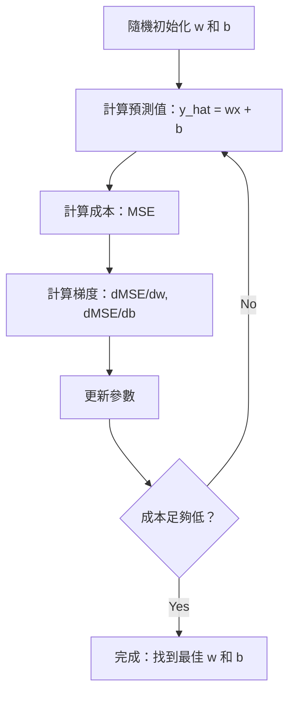

# 線性迴歸

> 線性迴歸（linear regression）會在資料中找出最適合的直線，是機器學習（machine learning）的「Hello, World!」。

**Type:** Build
**Languages:** Python
**Prerequisites:** Phase 1 (Linear Algebra, Calculus, Optimization), Phase 2 Lesson 1
**Time:** ~90 minutes

## Learning Objectives｜學習目標

- 從頭推導均方誤差（mean squared error，MSE）的梯度下降法（gradient descent）更新規則，並實作線性迴歸
- 比較梯度下降法與正規方程組（normal equation）的計算複雜度（computational complexity），並說明兩者各自適用的情況
- 建立含特徵標準化（feature standardization）的多元線性迴歸（multiple linear regression）模型，並解讀學得的權重（weight）
- 說明嶺迴歸（Ridge regression）如何透過 L2 正則化（L2 regularization）懲罰過大的權重，以避免過度擬合（overfitting）

## The Problem｜問題

你手上有一批房屋面積與售價的資料，想根據房屋面積預測新房子的價格。你可以從散佈圖（scatter plot）目測趨勢，但你需要一個公式——一條能良好擬合資料的直線，讓你代入任何面積都能預測價格。

線性迴歸能幫你找出這條直線。更重要的是，它介紹了整個 ML 訓練迴圈（training loop）：定義模型、定義成本函數（cost function）、最佳化參數。每種 ML 演算法都遵循相同模式。在這裡先掌握最簡單的情況，你就能在其他地方認出這個模式。

線性迴歸不只適用於簡單問題。實務系統會用它來預測需求、分析 A/B 測試、建立財務模型，也會把它當成各類迴歸任務的基準模型（baseline）。

## The Concept｜核心概念

### 模型

線性迴歸假設輸入（x）與輸出（y）之間呈線性關係：

```
y = wx + b
```

- `w`（權重／斜率（slope））：x 每增加 1，y 會改變多少
- `b`（偏置（bias）／截距（intercept））：x = 0 時 y 的值

有多個輸入特徵時，模型會擴展為：

```
y = w1*x1 + w2*x2 + ... + wn*xn + b
```

向量形式為：`y = w^T * x + b`

目標是找出 w 和 b，使所有訓練樣本中的預測值 y 都盡可能接近實際值。

### 成本函數（均方誤差）

要怎麼衡量「盡可能接近」？你需要一個數值來總結預測有多不準。最常見的選擇是均方誤差（MSE）：

```
MSE = (1/n) * sum((y_predicted - y_actual)^2)
```

為什麼要平方？有兩個原因。第一，它對大誤差的懲罰比小誤差重（誤差 10 的懲罰是誤差 1 的 100 倍，而不是 10 倍）。第二，平方函數在每個位置都平滑且可微，因此很容易最佳化。

成本函數會形成成本曲面（cost surface）。只有一個權重 w 和偏置 b 時，MSE 曲面看起來像碗狀的凸拋物面（convex paraboloid）。碗底就是 MSE 最小的位置。訓練就是找到碗底。

### 梯度下降法

梯度下降法會沿著下坡方向一步步移動，找到碗底。



梯度會告訴你兩件事：每個參數應該往哪個方向移動，以及要移動多少。

當 y_hat = wx + b 時，MSE 的梯度如下：

```
dMSE/dw = (2/n) * sum((y_hat - y) * x)
dMSE/db = (2/n) * sum(y_hat - y)
```

更新規則：

```
w = w - learning_rate * dMSE/dw
b = b - learning_rate * dMSE/db
```

學習率（learning rate）會控制每一步的大小。太大：越過最小值，導致發散。太小：訓練會花很久。常見起始值為 0.01、0.001 或 0.0001。

### 正規方程組（封閉解）

線性迴歸有一個直接公式，不必反覆迭代就能求得最佳權重。這是封閉解（closed-form solution）：

```
w = (X^T * X)^(-1) * X^T * y
```

這個公式需要對矩陣求逆，才能一步求出 w。小型資料集可以順利使用。資料集很大時（數百萬筆資料或數千個特徵），則較適合使用梯度下降法，因為矩陣求逆（matrix inversion）以特徵數計算的複雜度為 O(n^3)。

### 多元線性迴歸

有多個特徵時，模型會變成：

```
y = w1*x1 + w2*x2 + ... + wn*xn + b
```

其他部分都相同：成本函數仍是 MSE，梯度下降法會同時更新所有權重。唯一差別是，你現在要擬合的是超平面（hyperplane），而不是直線。

這時特徵縮放（feature scaling）很重要。如果一個特徵的範圍是 0 到 1，另一個卻是 0 到 1,000,000，成本曲面就會被拉長，讓梯度下降法難以收斂。訓練前應先標準化特徵：減去平均數，再除以標準差（standard deviation）。

### 多項式迴歸

如果資料關係不是線性的，仍然可以使用線性迴歸，只要先產生多項式特徵（polynomial features）：

```
y = w1*x + w2*x^2 + w3*x^3 + b
```

這仍是「線性」迴歸，因為模型對權重（w1、w2、w3）而言是線性的；你只是使用了 x 的非線性特徵。

高次多項式可以擬合更複雜的曲線，但也有過度擬合的風險。10 次多項式可以穿過含有 10 個資料點的資料集中的所有點，卻可能無法準確預測新資料。

### R 平方分數

MSE 會告訴你預測有多不準，但它的數值會受 y 的尺度影響。R 平方分數（R-squared score）則提供不受尺度影響的衡量方式：

```
R^2 = 1 - (sum of squared residuals) / (sum of squared deviations from mean)
    = 1 - SS_res / SS_tot
```

- R^2 = 1.0：完美預測
- R^2 = 0.0：模型不比每次都預測平均數好
- R^2 < 0.0：模型比每次都預測平均數還差

### 正則化預覽：嶺迴歸

特徵很多時，模型可能會因為學到過大的權重而過度擬合。嶺迴歸（L2 正則化）會加上一項懲罰：

```
Cost = MSE + lambda * sum(w_i^2)
```

懲罰項（penalty term）會抑制過大的權重。超參數（hyperparameter）lambda 會控制取捨：lambda 越大，權重越小，正則化越強。後續課程會深入介紹這個方法。現在先知道它存在，以及它為什麼有幫助。

```figure
linear-regression-fit
```

## Build It｜動手實作

### 步驟 1：產生樣本資料

```python
import random
import math

random.seed(42)

TRUE_W = 3.0
TRUE_B = 7.0
N_SAMPLES = 100

X = [random.uniform(0, 10) for _ in range(N_SAMPLES)]
y = [TRUE_W * x + TRUE_B + random.gauss(0, 2.0) for x in X]

print(f"Generated {N_SAMPLES} samples")
print(f"True relationship: y = {TRUE_W}x + {TRUE_B} (+ noise)")
print(f"First 5 points: {[(round(X[i], 2), round(y[i], 2)) for i in range(5)]}")
```

### 步驟 2：以梯度下降法從頭實作線性迴歸

```python
class LinearRegression:
    def __init__(self, learning_rate=0.01):
        self.w = 0.0
        self.b = 0.0
        self.lr = learning_rate
        self.cost_history = []

    def predict(self, X):
        return [self.w * x + self.b for x in X]

    def compute_cost(self, X, y):
        predictions = self.predict(X)
        n = len(y)
        cost = sum((pred - actual) ** 2 for pred, actual in zip(predictions, y)) / n
        return cost

    def compute_gradients(self, X, y):
        predictions = self.predict(X)
        n = len(y)
        dw = (2 / n) * sum((pred - actual) * x for pred, actual, x in zip(predictions, y, X))
        db = (2 / n) * sum(pred - actual for pred, actual in zip(predictions, y))
        return dw, db

    def fit(self, X, y, epochs=1000, print_every=200):
        for epoch in range(epochs):
            dw, db = self.compute_gradients(X, y)
            self.w -= self.lr * dw
            self.b -= self.lr * db
            cost = self.compute_cost(X, y)
            self.cost_history.append(cost)
            if epoch % print_every == 0:
                print(f"  Epoch {epoch:4d} | Cost: {cost:.4f} | w: {self.w:.4f} | b: {self.b:.4f}")
        return self

    def r_squared(self, X, y):
        predictions = self.predict(X)
        y_mean = sum(y) / len(y)
        ss_res = sum((actual - pred) ** 2 for actual, pred in zip(y, predictions))
        ss_tot = sum((actual - y_mean) ** 2 for actual in y)
        return 1 - (ss_res / ss_tot)


print("=== Training Linear Regression (Gradient Descent) ===")
model = LinearRegression(learning_rate=0.005)
model.fit(X, y, epochs=1000, print_every=200)
print(f"\nLearned: y = {model.w:.4f}x + {model.b:.4f}")
print(f"True:    y = {TRUE_W}x + {TRUE_B}")
print(f"R-squared: {model.r_squared(X, y):.4f}")
```

### 步驟 3：正規方程組（封閉解）

```python
class LinearRegressionNormal:
    def __init__(self):
        self.w = 0.0
        self.b = 0.0

    def fit(self, X, y):
        n = len(X)
        x_mean = sum(X) / n
        y_mean = sum(y) / n
        numerator = sum((X[i] - x_mean) * (y[i] - y_mean) for i in range(n))
        denominator = sum((X[i] - x_mean) ** 2 for i in range(n))
        self.w = numerator / denominator
        self.b = y_mean - self.w * x_mean
        return self

    def predict(self, X):
        return [self.w * x + self.b for x in X]

    def r_squared(self, X, y):
        predictions = self.predict(X)
        y_mean = sum(y) / len(y)
        ss_res = sum((actual - pred) ** 2 for actual, pred in zip(y, predictions))
        ss_tot = sum((actual - y_mean) ** 2 for actual in y)
        return 1 - (ss_res / ss_tot)


print("\n=== Normal Equation (Closed-Form) ===")
model_normal = LinearRegressionNormal()
model_normal.fit(X, y)
print(f"Learned: y = {model_normal.w:.4f}x + {model_normal.b:.4f}")
print(f"R-squared: {model_normal.r_squared(X, y):.4f}")
```

### 步驟 4：多元線性迴歸

```python
class MultipleLinearRegression:
    def __init__(self, n_features, learning_rate=0.01):
        self.weights = [0.0] * n_features
        self.bias = 0.0
        self.lr = learning_rate
        self.cost_history = []

    def predict_single(self, x):
        return sum(w * xi for w, xi in zip(self.weights, x)) + self.bias

    def predict(self, X):
        return [self.predict_single(x) for x in X]

    def compute_cost(self, X, y):
        predictions = self.predict(X)
        n = len(y)
        return sum((pred - actual) ** 2 for pred, actual in zip(predictions, y)) / n

    def fit(self, X, y, epochs=1000, print_every=200):
        n = len(y)
        n_features = len(X[0])
        for epoch in range(epochs):
            predictions = self.predict(X)
            errors = [pred - actual for pred, actual in zip(predictions, y)]
            for j in range(n_features):
                grad = (2 / n) * sum(errors[i] * X[i][j] for i in range(n))
                self.weights[j] -= self.lr * grad
            grad_b = (2 / n) * sum(errors)
            self.bias -= self.lr * grad_b
            cost = self.compute_cost(X, y)
            self.cost_history.append(cost)
            if epoch % print_every == 0:
                print(f"  Epoch {epoch:4d} | Cost: {cost:.4f}")
        return self

    def r_squared(self, X, y):
        predictions = self.predict(X)
        y_mean = sum(y) / len(y)
        ss_res = sum((actual - pred) ** 2 for actual, pred in zip(y, predictions))
        ss_tot = sum((actual - y_mean) ** 2 for actual in y)
        return 1 - (ss_res / ss_tot)


random.seed(42)
N = 100
X_multi = []
y_multi = []
for _ in range(N):
    size = random.uniform(500, 3000)
    bedrooms = random.randint(1, 5)
    age = random.uniform(0, 50)
    price = 50 * size + 10000 * bedrooms - 1000 * age + 50000 + random.gauss(0, 20000)
    X_multi.append([size, bedrooms, age])
    y_multi.append(price)


def standardize(X):
    n_features = len(X[0])
    means = [sum(X[i][j] for i in range(len(X))) / len(X) for j in range(n_features)]
    stds = []
    for j in range(n_features):
        variance = sum((X[i][j] - means[j]) ** 2 for i in range(len(X))) / len(X)
        stds.append(variance ** 0.5)
    X_scaled = []
    for i in range(len(X)):
        row = [(X[i][j] - means[j]) / stds[j] if stds[j] > 0 else 0 for j in range(n_features)]
        X_scaled.append(row)
    return X_scaled, means, stds


y_mean_val = sum(y_multi) / len(y_multi)
y_std_val = (sum((yi - y_mean_val) ** 2 for yi in y_multi) / len(y_multi)) ** 0.5
y_scaled = [(yi - y_mean_val) / y_std_val for yi in y_multi]

X_scaled, x_means, x_stds = standardize(X_multi)

print("\n=== Multiple Linear Regression (3 features) ===")
print("Features: house size, bedrooms, age")
multi_model = MultipleLinearRegression(n_features=3, learning_rate=0.01)
multi_model.fit(X_scaled, y_scaled, epochs=1000, print_every=200)

print(f"\nWeights (standardized): {[round(w, 4) for w in multi_model.weights]}")
print(f"Bias (standardized): {multi_model.bias:.4f}")
print(f"R-squared: {multi_model.r_squared(X_scaled, y_scaled):.4f}")
```

### 步驟 5：多項式迴歸

```python
class PolynomialRegression:
    def __init__(self, degree, learning_rate=0.01):
        self.degree = degree
        self.weights = [0.0] * degree
        self.bias = 0.0
        self.lr = learning_rate

    def make_features(self, X):
        return [[x ** (d + 1) for d in range(self.degree)] for x in X]

    def predict(self, X):
        features = self.make_features(X)
        return [sum(w * f for w, f in zip(self.weights, row)) + self.bias for row in features]

    def fit(self, X, y, epochs=1000, print_every=200):
        features = self.make_features(X)
        n = len(y)
        for epoch in range(epochs):
            predictions = [sum(w * f for w, f in zip(self.weights, row)) + self.bias for row in features]
            errors = [pred - actual for pred, actual in zip(predictions, y)]
            for j in range(self.degree):
                grad = (2 / n) * sum(errors[i] * features[i][j] for i in range(n))
                self.weights[j] -= self.lr * grad
            grad_b = (2 / n) * sum(errors)
            self.bias -= self.lr * grad_b
            if epoch % print_every == 0:
                cost = sum(e ** 2 for e in errors) / n
                print(f"  Epoch {epoch:4d} | Cost: {cost:.6f}")
        return self

    def r_squared(self, X, y):
        predictions = self.predict(X)
        y_mean = sum(y) / len(y)
        ss_res = sum((actual - pred) ** 2 for actual, pred in zip(y, predictions))
        ss_tot = sum((actual - y_mean) ** 2 for actual in y)
        return 1 - (ss_res / ss_tot)


random.seed(42)
X_poly = [x / 10.0 for x in range(0, 50)]
y_poly = [0.5 * x ** 2 - 2 * x + 3 + random.gauss(0, 1.0) for x in X_poly]

x_max = max(abs(x) for x in X_poly)
X_poly_norm = [x / x_max for x in X_poly]
y_poly_mean = sum(y_poly) / len(y_poly)
y_poly_std = (sum((yi - y_poly_mean) ** 2 for yi in y_poly) / len(y_poly)) ** 0.5
y_poly_norm = [(yi - y_poly_mean) / y_poly_std for yi in y_poly]

print("\n=== Polynomial Regression (degree 2 vs degree 5) ===")
print("True relationship: y = 0.5x^2 - 2x + 3")

print("\nDegree 2:")
poly2 = PolynomialRegression(degree=2, learning_rate=0.1)
poly2.fit(X_poly_norm, y_poly_norm, epochs=2000, print_every=500)
print(f"  R-squared: {poly2.r_squared(X_poly_norm, y_poly_norm):.4f}")

print("\nDegree 5:")
poly5 = PolynomialRegression(degree=5, learning_rate=0.1)
poly5.fit(X_poly_norm, y_poly_norm, epochs=2000, print_every=500)
print(f"  R-squared: {poly5.r_squared(X_poly_norm, y_poly_norm):.4f}")

print("\nDegree 2 fits the true curve well. Degree 5 fits training data slightly better")
print("but risks overfitting on new data.")
```

### 步驟 6：嶺迴歸（L2 正則化）

```python
class RidgeRegression:
    def __init__(self, n_features, learning_rate=0.01, alpha=1.0):
        self.weights = [0.0] * n_features
        self.bias = 0.0
        self.lr = learning_rate
        self.alpha = alpha

    def predict_single(self, x):
        return sum(w * xi for w, xi in zip(self.weights, x)) + self.bias

    def predict(self, X):
        return [self.predict_single(x) for x in X]

    def fit(self, X, y, epochs=1000, print_every=200):
        n = len(y)
        n_features = len(X[0])
        for epoch in range(epochs):
            predictions = self.predict(X)
            errors = [pred - actual for pred, actual in zip(predictions, y)]
            mse = sum(e ** 2 for e in errors) / n
            reg_term = self.alpha * sum(w ** 2 for w in self.weights)
            cost = mse + reg_term
            for j in range(n_features):
                grad = (2 / n) * sum(errors[i] * X[i][j] for i in range(n))
                grad += 2 * self.alpha * self.weights[j]
                self.weights[j] -= self.lr * grad
            grad_b = (2 / n) * sum(errors)
            self.bias -= self.lr * grad_b
            if epoch % print_every == 0:
                print(f"  Epoch {epoch:4d} | Cost: {cost:.4f} | L2 penalty: {reg_term:.4f}")
        return self


print("\n=== Ridge Regression (L2 Regularization) ===")
print("Same data as multiple regression, with alpha=0.1")
ridge = RidgeRegression(n_features=3, learning_rate=0.01, alpha=0.1)
ridge.fit(X_scaled, y_scaled, epochs=1000, print_every=200)
print(f"\nRidge weights: {[round(w, 4) for w in ridge.weights]}")
print(f"Plain weights: {[round(w, 4) for w in multi_model.weights]}")
print("Ridge weights are smaller (shrunk toward zero) due to the L2 penalty.")
```

## Use It｜實際應用

接著用 scikit-learn 做同一件事，這才是你在實務環境中會使用的方式。

```python
from sklearn.linear_model import LinearRegression as SklearnLR
from sklearn.linear_model import Ridge
from sklearn.preprocessing import PolynomialFeatures, StandardScaler
from sklearn.model_selection import train_test_split
from sklearn.metrics import mean_squared_error, r2_score
import numpy as np

np.random.seed(42)
X_sk = np.random.uniform(0, 10, (100, 1))
y_sk = 3.0 * X_sk.squeeze() + 7.0 + np.random.normal(0, 2.0, 100)

X_train, X_test, y_train, y_test = train_test_split(X_sk, y_sk, test_size=0.2, random_state=42)

lr = SklearnLR()
lr.fit(X_train, y_train)
y_pred = lr.predict(X_test)

print("=== Scikit-learn Linear Regression ===")
print(f"Coefficient (w): {lr.coef_[0]:.4f}")
print(f"Intercept (b): {lr.intercept_:.4f}")
print(f"R-squared (test): {r2_score(y_test, y_pred):.4f}")
print(f"MSE (test): {mean_squared_error(y_test, y_pred):.4f}")

poly = PolynomialFeatures(degree=2, include_bias=False)
X_poly_sk = poly.fit_transform(X_train)
X_poly_test = poly.transform(X_test)

lr_poly = SklearnLR()
lr_poly.fit(X_poly_sk, y_train)
print(f"\nPolynomial degree 2 R-squared: {r2_score(y_test, lr_poly.predict(X_poly_test)):.4f}")

scaler = StandardScaler()
X_train_scaled = scaler.fit_transform(X_train)
X_test_scaled = scaler.transform(X_test)

ridge = Ridge(alpha=1.0)
ridge.fit(X_train_scaled, y_train)
print(f"Ridge R-squared: {r2_score(y_test, ridge.predict(X_test_scaled)):.4f}")
print(f"Ridge coefficient: {ridge.coef_[0]:.4f}")
```

從頭實作的版本與 scikit-learn 會得到相同結果。差別在於 scikit-learn 處理了邊界情況、數值穩定性（numerical stability）與效能最佳化。正式環境使用函式庫；從頭實作的版本則能幫你理解背後的運作方式。

## Ship It｜交付成果

本課會產出：
- `outputs/skill-regression.md`——根據問題特性，協助選擇合適迴歸方法的 skill

## Exercises｜練習

1. 實作批次梯度下降法（batch gradient descent）、隨機梯度下降法（stochastic gradient descent，SGD）和小批次梯度下降法（mini-batch gradient descent）。在相同資料集上比較收斂速度。哪一種收斂最快？哪一種方法的成本曲線最平滑？
2. 使用三次函數（y = ax^3 + bx^2 + cx + d + noise）產生資料。以 1、3 和 10 次多項式擬合，並比較訓練集（training set）R^2 與測試集（test set）R^2。多項式次數（degree）到幾次時，過度擬合才變得明顯？
3. 實作 LASSO 迴歸（Lasso regression），其 L1 正則化（L1 regularization）懲罰項為 penalty = alpha * sum(|w_i|)。在多特徵房屋資料上訓練，並比較哪些權重會變成零，以及嶺迴歸的權重有何不同。為什麼 L1 會產生稀疏解（sparse solution），而 L2 不會？

## Key Terms｜關鍵術語

| 術語 | 常見說法 | 實際意義 |
|------|----------------|----------------------|
| 線性迴歸（linear regression） | 「在資料上畫一條線」 | 找出能讓 wx+b 與實際 y 值之差的平方總和最小的權重 w 和偏置 b |
| 成本函數（cost function） | 「模型有多糟」 | 將模型參數映射為單一數值，以衡量預測誤差，再透過最佳化將它最小化 |
| 均方誤差（mean squared error） | 「平方誤差的平均數」 | (1/n) * sum((predicted - actual)^2)；大誤差受到的懲罰會不成比例地加重 |
| 梯度下降法（gradient descent） | 「往下坡走」 | 反覆沿著能降低成本函數的方向調整參數，並使用偏導數計算方向 |
| 學習率（learning rate） | 「步長」 | 控制每次梯度下降法更新中參數改變幅度的純量 |
| 正規方程組（normal equation） | 「直接求解」 | 封閉解 w = (X^T X)^-1 X^T y，不需迭代就能求得最佳權重 |
| R 平方分數（R-squared） | 「擬合得有多好」 | 模型能解釋的 y 變異比例，範圍從負無限大到 1.0 |
| 特徵縮放（feature scaling） | 「讓特徵尺度一致」 | 將特徵轉換至相近範圍（例如平均數為 0、變異數為 1），使梯度下降法更快收斂 |
| 正則化（regularization） | 「懲罰模型複雜度」 | 在成本函數中加入一項以縮小權重，避免過度擬合 |
| 嶺迴歸（Ridge regression） | 「L2 正則化」 | 在線性迴歸的 MSE 上加入 lambda * sum(w_i^2) 懲罰項 |
| 多項式迴歸（polynomial regression） | 「用線性數學擬合曲線」 | 在多項式特徵（x、x^2、x^3、...）上套用線性迴歸；模型對權重而言仍是線性的 |
| 過度擬合（overfitting） | 「記住訓練資料」 | 模型過於複雜，擬合了訓練資料中的雜訊，因而無法在新資料上做好預測 |

## Further Reading｜延伸閱讀

- [An Introduction to Statistical Learning (ISLR)](https://www.statlearning.com/)——免費 PDF，第 3 章和第 6 章提供 R 的實務範例，介紹線性迴歸與正則化
- [The Elements of Statistical Learning (ESL)](https://hastie.su.domains/ElemStatLearn/)——免費 PDF，是 ISLR 的數學取向姊妹書，更深入介紹嶺迴歸與 LASSO
- [Stanford CS229 Lecture Notes on Linear Regression](https://cs229.stanford.edu/main_notes.pdf)——Andrew Ng 的講義，從第一原理推導正規方程組與梯度下降法
- [scikit-learn LinearRegression documentation](https://scikit-learn.org/stable/modules/linear_model.html)——LinearRegression、Ridge、Lasso 和 ElasticNet 的實務參考文件，附有程式碼範例
