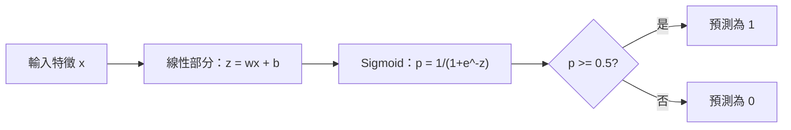
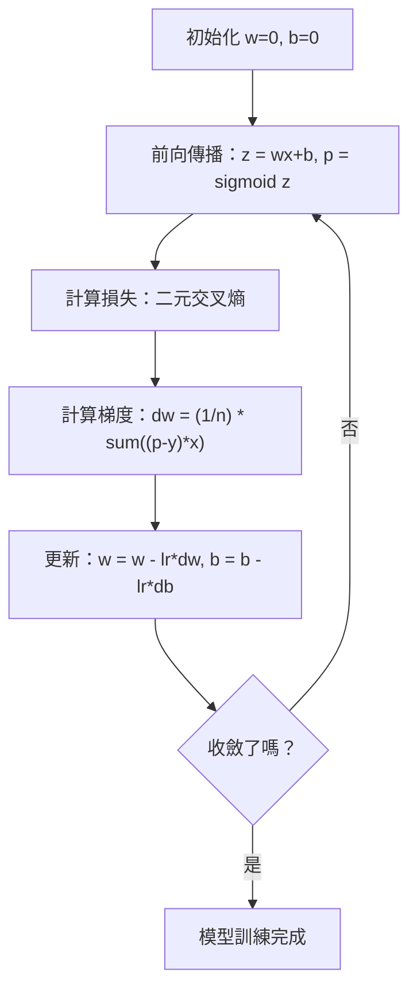

# 邏輯迴歸

> 邏輯迴歸會把直線彎成 S 形曲線，用機率回答是非問題。

**Type:** Build
**Languages:** Python
**Prerequisites:** Phase 2 Lesson 1-2 (What Is ML, Linear Regression)
**Time:** ~90 minutes

## 學習目標

- 使用 sigmoid 函式和二元交叉熵損失，從零實作邏輯迴歸
- 計算並解讀二元分類的 precision、recall、F1 分數與混淆矩陣
- 說明為什麼 MSE 不適用於分類，以及二元交叉熵為何會形成凸成本曲面
- 建立用於多類別分類的 softmax 迴歸模型，並評估調整閾值的取捨

## 問題

假設你想根據腫瘤大小預測它是惡性還是良性，於是嘗試線性迴歸。它輸出 0.3、1.7 或 -0.5 之類的數字，這些代表什麼？1.7 是「非常惡性」嗎？-0.5 是「非常良性」嗎？線性迴歸輸出沒有範圍限制的數值；分類需要介於 0 和 1 之間的機率，以及清楚的「是」或「否」判斷。

邏輯迴歸可以解決這個問題。它會先計算相同的線性組合 (wx + b)，再將結果傳入 sigmoid 函式，把任意數值壓縮到 (0, 1) 範圍內，得到機率。接著設定閾值（通常是 0.5）並做出判斷。

這是實務上最廣泛使用的演算法之一。雖然名稱有「迴歸」，邏輯迴歸其實是分類演算法。名稱來自它使用的 logistic（sigmoid）函式。

## 核心概念

### 線性迴歸為什麼不適合分類

假設要根據讀書時數預測是否及格（1/0），線性迴歸會在資料點中擬合一條直線：

```text
時數：  1   2   3   4   5   6   7   8   9   10
實際：  0   0   0   0   1   1   1   1   1   1
```

線性擬合可能在讀書 1 小時時預測 -0.2，讀書 10 小時時預測 1.3。這些數值不是機率，因為它們會低於 0 或高於 1。更糟的是，單一離群值（例如讀了 50 小時的人）就可能拉動整條線，改變所有人的預測結果。

分類需要一個能做到以下事情的函式：
- 輸出介於 0 和 1 之間的值（機率）
- 形成明確的轉折（決策邊界）
- 不會被遠離邊界的離群值扭曲

### Sigmoid 函式

Sigmoid 函式正好能做到這些事：

```text
sigmoid(z) = 1 / (1 + e^(-z))
```

它具有以下性質：
- z 很大且為正時，sigmoid(z) 會趨近 1
- z 很大且為負時，sigmoid(z) 會趨近 0
- z = 0 時，sigmoid(z) = 0.5
- 輸出永遠介於 0 和 1 之間
- 函式處處平滑且可微

它的導數形式很簡潔：sigmoid'(z) = sigmoid(z) * (1 - sigmoid(z))，因此能有效率地計算梯度。

### 邏輯迴歸 = 線性模型 + Sigmoid

模型會先計算 z = wx + b（與線性迴歸相同），再套用 sigmoid：



輸出 p 可解讀為 P(y=1 | x)，也就是輸入屬於類別 1 的機率。當 wx + b = 0 時，就位於決策邊界，此時 sigmoid 的輸出正好是 0.5。

### 二元交叉熵損失

邏輯迴歸不能使用 MSE。sigmoid 搭配 MSE 會形成非凸成本曲面，其中有許多局部最小值。應改用二元交叉熵（對數損失）：

```text
Loss = -(1/n) * sum(y * log(p) + (1-y) * log(1-p))
```

這種做法有效的原因：
- y=1 且 p 接近 1 時：log(1) = 0，因此損失接近 0（預測正確，成本低）
- y=1 且 p 接近 0 時：log(0) 趨近負無限大，因此損失很大（預測錯誤，成本高）
- y=0 且 p 接近 0 時：log(1) = 0，因此損失接近 0（預測正確，成本低）
- y=0 且 p 接近 1 時：log(0) 趨近負無限大，因此損失很大（預測錯誤，成本高）

對邏輯迴歸而言，這個損失函式是凸函式，因此保證只有一個全域最小值。

### 邏輯迴歸的梯度下降

sigmoid 搭配二元交叉熵的梯度形式很簡潔：

```text
dL/dw = (1/n) * sum((p - y) * x)
dL/db = (1/n) * sum(p - y)
```

這些梯度看起來與線性迴歸完全相同。差別在於 p = sigmoid(wx + b)，而非 p = wx + b。sigmoid 引入非線性，但梯度更新規則維持不變。



### 決策邊界

若輸入是二維（有兩個特徵），決策邊界就是符合以下條件的直線：

```text
w1*x1 + w2*x2 + b = 0
```

直線一側的點會被分成 1，另一側則分成 0。邏輯迴歸產生的決策邊界永遠是線性的。若需要曲線邊界，就加入多項式特徵或改用非線性模型。

### 使用 Softmax 進行多類別分類

二元邏輯迴歸能處理兩個類別。若有 k 個類別，請使用 softmax 函式：

```text
softmax(z_i) = e^(z_i) / sum(e^(z_j) for all j)
```

每個類別都有自己的權重向量。模型會為各類別計算分數 z_i，再由 softmax 將分數轉成總和為 1 的機率。預測結果就是機率最高的類別。

此時損失函式會改為類別交叉熵：

```text
Loss = -(1/n) * sum(sum(y_k * log(p_k)))
```

其中真實類別的 y_k 為 1，其餘類別為 0（獨熱編碼）。

### 評估指標

只看準確率並不足夠。假設資料中 95% 是負類、5% 是正類，永遠預測負類的模型仍有 95% 準確率，但完全沒有實用價值。

**混淆矩陣：**

| | 預測正類 | 預測負類 |
|---|----------|----------|
| 實際為正類 | 真陽性（TP）| 假陰性（FN）|
| 實際為負類 | 假陽性（FP）| 真陰性（TN）|

**Precision（精確率）：** 所有預測為正類的樣本中，實際為正類的有多少？
```text
Precision = TP / (TP + FP)
```

**Recall（召回率，又稱敏感度）：** 所有實際為正類的樣本中，成功找出的有多少？
```text
Recall = TP / (TP + FN)
```

**F1 分數：** Precision 和 Recall 的調和平均數，可平衡兩者。
```text
F1 = 2 * (Precision * Recall) / (Precision + Recall)
```

指標的優先順序依情境而定：
- **Precision：** 假陽性代價高時優先（例如垃圾郵件過濾器不能封鎖正常郵件）
- **Recall：** 假陰性代價高時優先（例如癌症篩檢不能漏掉腫瘤）
- **F1：** 需要單一、兼顧兩者的指標時使用

```figure
logistic-sigmoid
```

## Build It：從零實作

### 步驟 1：Sigmoid 函式與資料產生

```python
import random
import math

def sigmoid(z):
    z = max(-500, min(500, z))
    return 1.0 / (1.0 + math.exp(-z))


random.seed(42)
N = 200
X = []
y = []

for _ in range(N // 2):
    X.append([random.gauss(2, 1), random.gauss(2, 1)])
    y.append(0)

for _ in range(N // 2):
    X.append([random.gauss(5, 1), random.gauss(5, 1)])
    y.append(1)

combined = list(zip(X, y))
random.shuffle(combined)
X, y = zip(*combined)
X = list(X)
y = list(y)

print(f"Generated {N} samples (2 classes, 2 features)")
print(f"Class 0 center: (2, 2), Class 1 center: (5, 5)")
print(f"First 5 samples:")
for i in range(5):
    print(f"  Features: [{X[i][0]:.2f}, {X[i][1]:.2f}], Label: {y[i]}")
```

### 步驟 2：從零實作邏輯迴歸

```python
class LogisticRegression:
    def __init__(self, n_features, learning_rate=0.01):
        self.weights = [0.0] * n_features
        self.bias = 0.0
        self.lr = learning_rate
        self.loss_history = []

    def predict_proba(self, x):
        z = sum(w * xi for w, xi in zip(self.weights, x)) + self.bias
        return sigmoid(z)

    def predict(self, x, threshold=0.5):
        return 1 if self.predict_proba(x) >= threshold else 0

    def compute_loss(self, X, y):
        n = len(y)
        total = 0.0
        for i in range(n):
            p = self.predict_proba(X[i])
            p = max(1e-15, min(1 - 1e-15, p))
            total += y[i] * math.log(p) + (1 - y[i]) * math.log(1 - p)
        return -total / n

    def fit(self, X, y, epochs=1000, print_every=200):
        n = len(y)
        n_features = len(X[0])
        for epoch in range(epochs):
            dw = [0.0] * n_features
            db = 0.0
            for i in range(n):
                p = self.predict_proba(X[i])
                error = p - y[i]
                for j in range(n_features):
                    dw[j] += error * X[i][j]
                db += error
            for j in range(n_features):
                self.weights[j] -= self.lr * (dw[j] / n)
            self.bias -= self.lr * (db / n)
            loss = self.compute_loss(X, y)
            self.loss_history.append(loss)
            if epoch % print_every == 0:
                print(f"  Epoch {epoch:4d} | Loss: {loss:.4f} | w: [{self.weights[0]:.3f}, {self.weights[1]:.3f}] | b: {self.bias:.3f}")
        return self

    def accuracy(self, X, y):
        correct = sum(1 for i in range(len(y)) if self.predict(X[i]) == y[i])
        return correct / len(y)


split = int(0.8 * N)
X_train, X_test = X[:split], X[split:]
y_train, y_test = y[:split], y[split:]

print("\n=== Training Logistic Regression ===")
model = LogisticRegression(n_features=2, learning_rate=0.1)
model.fit(X_train, y_train, epochs=1000, print_every=200)

print(f"\nTrain accuracy: {model.accuracy(X_train, y_train):.4f}")
print(f"Test accuracy:  {model.accuracy(X_test, y_test):.4f}")
print(f"Weights: [{model.weights[0]:.4f}, {model.weights[1]:.4f}]")
print(f"Bias: {model.bias:.4f}")
```

### 步驟 3：從零實作混淆矩陣與評估指標

```python
class ClassificationMetrics:
    def __init__(self, y_true, y_pred):
        self.tp = sum(1 for t, p in zip(y_true, y_pred) if t == 1 and p == 1)
        self.tn = sum(1 for t, p in zip(y_true, y_pred) if t == 0 and p == 0)
        self.fp = sum(1 for t, p in zip(y_true, y_pred) if t == 0 and p == 1)
        self.fn = sum(1 for t, p in zip(y_true, y_pred) if t == 1 and p == 0)

    def accuracy(self):
        total = self.tp + self.tn + self.fp + self.fn
        return (self.tp + self.tn) / total if total > 0 else 0

    def precision(self):
        denom = self.tp + self.fp
        return self.tp / denom if denom > 0 else 0

    def recall(self):
        denom = self.tp + self.fn
        return self.tp / denom if denom > 0 else 0

    def f1(self):
        p = self.precision()
        r = self.recall()
        return 2 * p * r / (p + r) if (p + r) > 0 else 0

    def print_confusion_matrix(self):
        print(f"\n  Confusion Matrix:")
        print(f"                  Predicted")
        print(f"                  Pos   Neg")
        print(f"  Actual Pos     {self.tp:4d}  {self.fn:4d}")
        print(f"  Actual Neg     {self.fp:4d}  {self.tn:4d}")

    def print_report(self):
        self.print_confusion_matrix()
        print(f"\n  Accuracy:  {self.accuracy():.4f}")
        print(f"  Precision: {self.precision():.4f}")
        print(f"  Recall:    {self.recall():.4f}")
        print(f"  F1 Score:  {self.f1():.4f}")


y_pred_test = [model.predict(x) for x in X_test]
print("\n=== Classification Report (Test Set) ===")
metrics = ClassificationMetrics(y_test, y_pred_test)
metrics.print_report()
```

### 步驟 4：分析決策邊界

```python
print("\n=== Decision Boundary ===")
w1, w2 = model.weights
b = model.bias
print(f"Decision boundary: {w1:.4f}*x1 + {w2:.4f}*x2 + {b:.4f} = 0")
if abs(w2) > 1e-10:
    print(f"Solved for x2:     x2 = {-w1/w2:.4f}*x1 + {-b/w2:.4f}")

print("\nSample predictions near the boundary:")
test_points = [
    [3.0, 3.0],
    [3.5, 3.5],
    [4.0, 4.0],
    [2.5, 2.5],
    [5.0, 5.0],
]
for point in test_points:
    prob = model.predict_proba(point)
    pred = model.predict(point)
    print(f"  [{point[0]}, {point[1]}] -> prob={prob:.4f}, class={pred}")
```

### 步驟 5：使用 Softmax 處理多類別

```python
class SoftmaxRegression:
    def __init__(self, n_features, n_classes, learning_rate=0.01):
        self.n_features = n_features
        self.n_classes = n_classes
        self.lr = learning_rate
        self.weights = [[0.0] * n_features for _ in range(n_classes)]
        self.biases = [0.0] * n_classes

    def softmax(self, scores):
        max_score = max(scores)
        exp_scores = [math.exp(s - max_score) for s in scores]
        total = sum(exp_scores)
        return [e / total for e in exp_scores]

    def predict_proba(self, x):
        scores = [
            sum(self.weights[k][j] * x[j] for j in range(self.n_features)) + self.biases[k]
            for k in range(self.n_classes)
        ]
        return self.softmax(scores)

    def predict(self, x):
        probs = self.predict_proba(x)
        return probs.index(max(probs))

    def fit(self, X, y, epochs=1000, print_every=200):
        n = len(y)
        for epoch in range(epochs):
            grad_w = [[0.0] * self.n_features for _ in range(self.n_classes)]
            grad_b = [0.0] * self.n_classes
            total_loss = 0.0
            for i in range(n):
                probs = self.predict_proba(X[i])
                for k in range(self.n_classes):
                    target = 1.0 if y[i] == k else 0.0
                    error = probs[k] - target
                    for j in range(self.n_features):
                        grad_w[k][j] += error * X[i][j]
                    grad_b[k] += error
                true_prob = max(probs[y[i]], 1e-15)
                total_loss -= math.log(true_prob)
            for k in range(self.n_classes):
                for j in range(self.n_features):
                    self.weights[k][j] -= self.lr * (grad_w[k][j] / n)
                self.biases[k] -= self.lr * (grad_b[k] / n)
            if epoch % print_every == 0:
                print(f"  Epoch {epoch:4d} | Loss: {total_loss / n:.4f}")
        return self

    def accuracy(self, X, y):
        correct = sum(1 for i in range(len(y)) if self.predict(X[i]) == y[i])
        return correct / len(y)


random.seed(42)
X_3class = []
y_3class = []

centers = [(1, 1), (5, 1), (3, 5)]
for label, (cx, cy) in enumerate(centers):
    for _ in range(50):
        X_3class.append([random.gauss(cx, 0.8), random.gauss(cy, 0.8)])
        y_3class.append(label)

combined = list(zip(X_3class, y_3class))
random.shuffle(combined)
X_3class, y_3class = zip(*combined)
X_3class = list(X_3class)
y_3class = list(y_3class)

split_3 = int(0.8 * len(X_3class))
X_train_3 = X_3class[:split_3]
y_train_3 = y_3class[:split_3]
X_test_3 = X_3class[split_3:]
y_test_3 = y_3class[split_3:]

print("\n=== Multi-class Softmax Regression (3 classes) ===")
softmax_model = SoftmaxRegression(n_features=2, n_classes=3, learning_rate=0.1)
softmax_model.fit(X_train_3, y_train_3, epochs=1000, print_every=200)
print(f"\nTrain accuracy: {softmax_model.accuracy(X_train_3, y_train_3):.4f}")
print(f"Test accuracy:  {softmax_model.accuracy(X_test_3, y_test_3):.4f}")

print("\nSample predictions:")
for i in range(5):
    probs = softmax_model.predict_proba(X_test_3[i])
    pred = softmax_model.predict(X_test_3[i])
    print(f"  True: {y_test_3[i]}, Predicted: {pred}, Probs: [{', '.join(f'{p:.3f}' for p in probs)}]")
```

### 步驟 6：調整閾值

```python
print("\n=== Threshold Tuning ===")
print("Default threshold: 0.5. Adjusting the threshold trades precision for recall.\n")

thresholds = [0.3, 0.4, 0.5, 0.6, 0.7]
print(f"{'Threshold':>10} {'Accuracy':>10} {'Precision':>10} {'Recall':>10} {'F1':>10}")
print("-" * 52)

for t in thresholds:
    y_pred_t = [1 if model.predict_proba(x) >= t else 0 for x in X_test]
    m = ClassificationMetrics(y_test, y_pred_t)
    print(f"{t:>10.1f} {m.accuracy():>10.4f} {m.precision():>10.4f} {m.recall():>10.4f} {m.f1():>10.4f}")
```

## Use It：實際應用

接著使用 scikit-learn 做相同的事。

```python
from sklearn.linear_model import LogisticRegression as SklearnLR
from sklearn.metrics import accuracy_score, precision_score, recall_score, f1_score
from sklearn.metrics import confusion_matrix, classification_report
from sklearn.model_selection import train_test_split
from sklearn.preprocessing import StandardScaler
import numpy as np

np.random.seed(42)
X_0 = np.random.randn(100, 2) + [2, 2]
X_1 = np.random.randn(100, 2) + [5, 5]
X_sk = np.vstack([X_0, X_1])
y_sk = np.array([0] * 100 + [1] * 100)

X_tr, X_te, y_tr, y_te = train_test_split(X_sk, y_sk, test_size=0.2, random_state=42)

scaler = StandardScaler()
X_tr_sc = scaler.fit_transform(X_tr)
X_te_sc = scaler.transform(X_te)

lr = SklearnLR()
lr.fit(X_tr_sc, y_tr)
y_pred = lr.predict(X_te_sc)

print("=== Scikit-learn Logistic Regression ===")
print(f"Accuracy:  {accuracy_score(y_te, y_pred):.4f}")
print(f"Precision: {precision_score(y_te, y_pred):.4f}")
print(f"Recall:    {recall_score(y_te, y_pred):.4f}")
print(f"F1:        {f1_score(y_te, y_pred):.4f}")
print(f"\nConfusion Matrix:\n{confusion_matrix(y_te, y_pred)}")
print(f"\nClassification Report:\n{classification_report(y_te, y_pred)}")
```

從零實作的版本會產生相同的決策邊界和評估指標。scikit-learn 還提供多種求解器（liblinear、lbfgs、saga）、自動正則化、多類別策略（一對多、多項式）和數值穩定性最佳化。

## Ship It：交付成果

本課程會產生：
- `code/logistic_regression.py`——含評估指標的邏輯迴歸從零實作

## Exercises：練習

1. 產生無法以直線分開的資料（例如兩個同心圓），訓練邏輯迴歸並觀察失敗情形。接著加入多項式特徵 (x1^2, x2^2, x1*x2) 再次訓練，並展示準確率如何提升。
2. 為 3 類別 softmax 模型實作多類別混淆矩陣，計算各類別的 Precision 和 Recall。哪一類最難分類？
3. 從零建立 ROC 曲線。使用介於 0 到 1 的 100 個閾值，分別計算真陽性率和假陽性率，再用梯形法則計算 AUC（曲線下面積）。

## 關鍵詞

| 術語 | 一般說法 | 實際意義 |
|------|----------|----------|
| 邏輯迴歸 |「用於分類的迴歸」| 在線性模型後接上 sigmoid 函式，輸出類別機率 |
| Sigmoid 函式 |「S 形曲線」| 將任意實數映射至 (0, 1) 範圍的函式 1/(1+e^(-z)) |
| 二元交叉熵 |「對數損失」| 損失函式 -[y*log(p) + (1-y)*log(1-p)]，會嚴厲懲罰有把握卻錯誤的預測 |
| 決策邊界 |「分類分界線」| 模型輸出機率為 0.5 的邊界，用來分隔預測類別 |
| Softmax |「多類別版 sigmoid」| 將分數向量轉換成總和為 1 的機率 |
| Precision（精確率）|「選出的項目有多少相關」| TP / (TP + FP)，所有正類預測中實際為正類的比例 |
| Recall（召回率）|「相關項目找出多少」| TP / (TP + FN)，模型正確找出的實際正類比例 |
| F1 分數 |「平衡準確率」| Precision 和 Recall 的調和平均數：2*P*R / (P+R) |
| 混淆矩陣 |「錯誤分類明細」| 呈現各類別配對中 TP、TN、FP、FN 數量的表格 |
| 閾值 |「判斷門檻」| 機率高於此值時模型會預測為類別 1（預設 0.5，可調整） |
| 獨熱編碼 |「類別的二元欄位」| 用全為 0、但第 k 個位置為 1 的向量表示類別 k |
| 類別交叉熵 |「多類別對數損失」| 使用獨熱編碼標籤，將二元交叉熵擴展到 k 個類別 |
