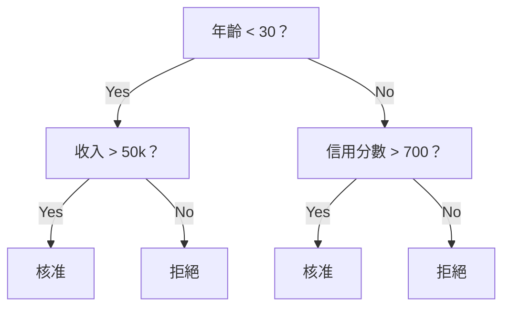
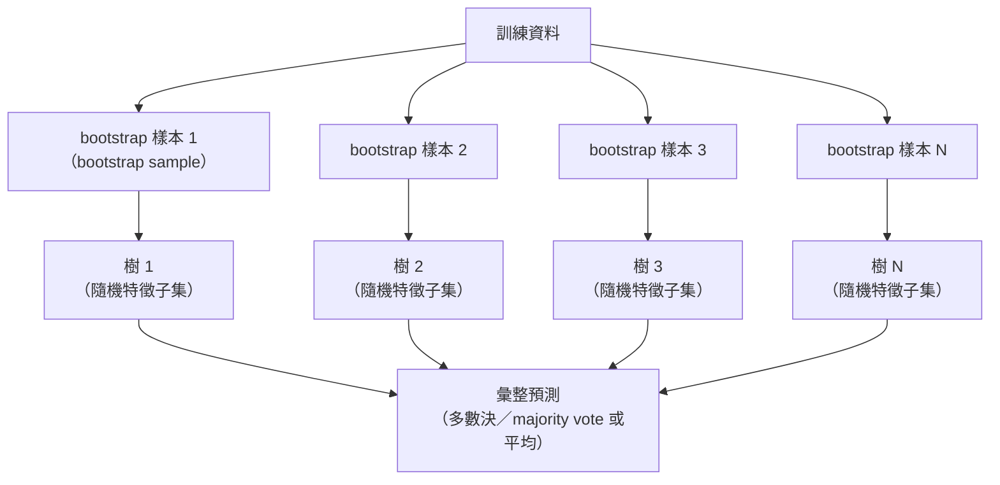

# 決策樹與隨機森林

> 決策樹（decision tree）不過就是一張流程圖；但由許多決策樹組成的隨機森林（random forest），是機器學習（machine learning，ML）中最強大的工具之一。

**Type:** Build
**Language:** Python
**Prerequisites:** Phase 1 (Lessons 09 Information Theory, 06 Probability)
**Time:** ~90 minutes

## Learning Objectives｜學習目標

- 實作基尼不純度（Gini impurity）、熵（entropy）與資訊增益（information gain）的計算，以找出最佳決策樹分割
- 從頭建立決策樹分類器（classifier），並加入預剪枝（pre-pruning）控制：最大深度（max depth）、最小樣本數（min samples）
- 使用 bootstrap 抽樣（bootstrap sampling）與特徵隨機化（feature randomization）建構隨機森林，並說明它為何能降低變異數（variance）
- 比較以平均不純度下降（mean decrease in impurity，MDI）計算的特徵重要度（feature importance）與置換重要度（permutation importance），並找出 MDI 有偏誤的情況

## The Problem｜問題

你有一份表格資料（tabular data）。每一列是樣本，每一欄是特徵，還有一個要預測的目標欄位。你可以直接套用神經網路（neural network），但在表格資料上，樹模型（tree-based models），例如決策樹、隨機森林和梯度提升樹（gradient boosted trees），表現一向優於深度學習（deep learning）。Kaggle 的結構化資料競賽大多由 XGBoost 和 LightGBM 稱霸，而不是 transformer 模型。

為什麼？樹模型不需前處理（preprocessing），就能處理數值特徵（numeric features）與類別特徵（categorical features）等混合型特徵。它們不必仰賴特徵工程（feature engineering），就能處理非線性關係（nonlinear relationships）。它們也容易解釋：你可以直接查看樹，確切了解模型為何做出某個預測。隨機森林會平均多棵樹的預測，因此在中型資料集上也很能抵抗過度擬合（overfitting）。

本課會從頭實作以遞迴切分為核心的決策樹，再以此建構隨機森林。你將實作分割準則背後的數學（基尼不純度、熵、資訊增益），並了解弱學習器（weak learner）集成（ensemble）後為何能成為強模型。

## The Concept｜核心概念

### 決策樹的運作方式

決策樹會透過一連串是／否問題，將特徵空間（feature space）分割成矩形區域（rectangular regions）。



每個內部節點（internal node）會比較特徵值與閾值（threshold）。每個葉節點（leaf node）都會做出預測。要分類新的資料點（data point），就從根節點（root node）開始，沿著判斷路徑前進，直到抵達葉節點。

決策樹由上而下建立；在每個節點，挑選最能區分資料的特徵和閾值。「最好」由分割準則（split criterion）定義。

### 分割準則：衡量不純度（impurity）

在每個節點，我們都有一組樣本。目標是將樣本切分成「純度」盡可能高的子節點，也就是讓每個子節點都主要包含同一個類別。

**基尼不純度（Gini impurity）**衡量隨機抽取的樣本在依該節點的類別分布（class distribution）標記時被誤分類的機率。

```
Gini(S) = 1 - sum(p_k^2)

where p_k is the proportion of class k in set S.
```

若節點是純的（只含一個類別），Gini = 0。若二元分割的兩個類別各占 50%，Gini = 0.5。數值越低越好。

```
Example: 6 cats, 4 dogs

Gini = 1 - (0.6^2 + 0.4^2) = 1 - (0.36 + 0.16) = 0.48
```

**熵（entropy）**衡量節點中的資訊量（information content；混亂程度）。第一階段第 09 課曾介紹過這個概念。

```
Entropy(S) = -sum(p_k * log2(p_k))
```

若節點是純的，熵 = 0。若二元分割的兩個類別各占 50%，熵 = 1.0。數值越低越好。

```
Example: 6 cats, 4 dogs

Entropy = -(0.6 * log2(0.6) + 0.4 * log2(0.4))
        = -(0.6 * -0.737 + 0.4 * -1.322)
        = 0.442 + 0.529
        = 0.971 bits
```

**資訊增益（information gain）**是分割後不純度（熵或基尼不純度）的減少量。

```
IG(S, feature, threshold) = Impurity(S) - weighted_avg(Impurity(S_left), Impurity(S_right))

where the weights are the proportions of samples in each child.
```

在每個節點使用的貪婪演算法（greedy algorithm）：嘗試每個特徵和每個可能的閾值，選出資訊增益最高的（特徵、閾值）組合。

### 分割如何運作

假設目前節點的資料集有 n 個特徵和 m 個樣本：

1. 對每個特徵 j（j = 1 到 n）：
   - 依照特徵 j 的值排序樣本
   - 將排序後相鄰且不同的特徵值取中點，作為候選閾值，逐一嘗試
   - 計算每個閾值的資訊增益
2. 選出資訊增益最高的特徵與閾值
3. 將資料切分成左側（feature <= threshold）與右側（feature > threshold）
4. 對每個子節點遞迴執行

這種貪婪方法無法保證找到全域最佳決策樹。尋找最佳決策樹是 NP-hard 問題，但貪婪分割在實務上效果良好。

### 停止條件

若沒有停止條件，決策樹會持續生長，直到每個葉節點都純化（每個葉節點只剩一個樣本）。這會讓樹完美記住訓練資料，卻讓模型的泛化（generalization）表現極差。

**預剪枝（pre-pruning）**會在樹完全長成前停止生長：
- 最大深度：樹達到設定深度時停止切分
- 葉節點最小樣本數（minimum samples per leaf）：若節點樣本少於 k 個，就停止切分
- 最低資訊增益（minimum information gain）：若最佳分割帶來的不純度改善低於某個閾值，就停止切分
- 葉節點數上限（maximum leaf nodes）：限制葉節點總數

**後剪枝（post-pruning）**會先讓樹完整生長，再將過大的樹修剪：
- 成本複雜度剪枝（cost-complexity pruning，scikit-learn 使用）：加入與葉節點數量成正比的懲罰項。提高懲罰值會得到較小的樹
- 減少錯誤剪枝（reduced error pruning）：若移除子樹後驗證誤差（validation error）沒有增加，就移除該子樹

預剪枝較簡單、速度也較快。後剪枝通常能產生更好的樹，因為它不會過早停止樹的生長，讓可能再形成有用分割的路徑得以延伸。

### 迴歸樹（regression tree）

在迴歸問題中，葉節點會輸出該節點中目標值的平均數。分割準則也會改變：

**變異數減少（variance reduction）**取代資訊增益：

```
VR(S, feature, threshold) = Var(S) - weighted_avg(Var(S_left), Var(S_right))
```

選擇能最大幅度降低變異數的分割。決策樹會把輸入空間切分成多個區域，並在每個區域預測一個常數（平均數）。

### 隨機森林：集成模型（ensemble）的力量

單棵決策樹的變異數很高。資料稍有變化，就可能產生完全不同的樹。隨機森林會平均多棵樹的預測來解決這個問題。



兩種隨機性來源讓樹彼此不同：

**bagging（bootstrap aggregating，bootstrap 聚合）：**每棵樹都使用 bootstrap 樣本訓練，也就是從訓練資料中有放回抽取的隨機樣本。每次 bootstrap 樣本約會包含原始資料中 63% 的不同樣本；其餘未出現在該樣本中的資料稱為袋外樣本（out-of-bag samples），可用於驗證。

**特徵隨機化（feature randomization）：**在每次分割時，只考慮隨機抽取的一部分特徵。分類的預設值（default）是 sqrt(n_features)，迴歸則是 n_features/3。這可以避免所有樹都用同一個主導特徵來切分。

關鍵洞見是：平均許多彼此去相關的樹（decorrelated trees），能降低變異數而不增加偏差（bias）。每棵樹單獨來看可能表現平平，但集成後的模型很強。

### 特徵重要度

隨機森林會自然產生特徵重要度（feature importance）分數。最常見的方法是：

**平均不純度下降（mean decrease in impurity，MDI）：**對每個特徵，將所有樹中使用該特徵的節點所帶來的不純度減少量加總。在較早期分割中帶來較大不純度減少量的特徵，重要度會較高。

```
importance(feature_j) = sum over all nodes where feature_j is used:
    (n_samples_at_node / n_total_samples) * impurity_decrease
```

這種方法速度快（訓練時就能計算），但容易高估高基數特徵（high-cardinality features）與有許多可能分割點（split point）的特徵。

**置換重要度（permutation importance）**是另一種方法：打亂一個特徵的值，觀察模型準確率（accuracy）下降多少。這種方法較可靠，但速度較慢。

### 樹模型何時勝過神經網路

在表格資料上，樹模型和隨機森林的表現凌駕神經網路，原因包括：

| 面向 | 樹模型 | 神經網路 |
|--------|-------|----------------|
| 混合特徵型態（數值＋類別） | 原生支援 | 需要編碼 |
| 小型資料集（< 10k 列） | 表現良好 | 容易過度擬合 |
| 特徵交互作用（feature interactions） | 透過切分找出 | 需要設計架構 |
| 可解釋性（interpretability） | 完全透明 | 黑箱 |
| 訓練時間 | 幾分鐘 | 幾小時 |
| 超參數敏感度（hyperparameter sensitivity） | 低 | 高 |

神經網路在資料有空間或序列結構時更有優勢（例如影像、文字、音訊）。若資料是單純的特徵表格，樹模型就是預設選擇。

```figure
decision-tree-depth
```

## Build It｜動手實作

### 步驟 1：基尼不純度與熵

從頭實作這兩種分割準則，並確認它們對優劣分割的判斷一致。

```python
import math

def gini_impurity(labels):
    n = len(labels)
    if n == 0:
        return 0.0
    counts = {}
    for label in labels:
        counts[label] = counts.get(label, 0) + 1
    return 1.0 - sum((c / n) ** 2 for c in counts.values())

def entropy(labels):
    n = len(labels)
    if n == 0:
        return 0.0
    counts = {}
    for label in labels:
        counts[label] = counts.get(label, 0) + 1
    return -sum(
        (c / n) * math.log2(c / n) for c in counts.values() if c > 0
    )
```

### 步驟 2：找出最佳分割

嘗試每個特徵和每個閾值，回傳資訊增益最高的組合。

```python
def information_gain(parent_labels, left_labels, right_labels, criterion="gini"):
    measure = gini_impurity if criterion == "gini" else entropy
    n = len(parent_labels)
    n_left = len(left_labels)
    n_right = len(right_labels)
    if n_left == 0 or n_right == 0:
        return 0.0
    parent_impurity = measure(parent_labels)
    child_impurity = (
        (n_left / n) * measure(left_labels) +
        (n_right / n) * measure(right_labels)
    )
    return parent_impurity - child_impurity
```

### 步驟 3：建立 DecisionTree 類別

加入遞迴切分、預測與特徵重要度追蹤。`_build` 是決策樹的核心：若節點已純化或觸及預剪枝限制，就停止；否則取最佳分割，並對左右子節點遞迴執行。

```python
import random

class DecisionTree:
    def __init__(self, max_depth=None, min_samples_split=2,
                 min_samples_leaf=1, criterion="gini",
                 max_features=None):
        self.max_depth = max_depth
        self.min_samples_split = min_samples_split
        self.min_samples_leaf = min_samples_leaf
        self.criterion = criterion
        self.max_features = max_features
        self.tree = None
        self.feature_importances_ = None

    def fit(self, X, y):
        self.n_features = len(X[0])
        self.feature_importances_ = [0.0] * self.n_features
        self.n_samples = len(X)
        self.tree = self._build(X, y, depth=0)
        total = sum(self.feature_importances_)
        if total > 0:
            self.feature_importances_ = [
                fi / total for fi in self.feature_importances_
            ]

    def predict(self, X):
        return [self._predict_one(x, self.tree) for x in X]

    def _build(self, X, y, depth):
        if len(set(y)) == 1:
            return {"leaf": True, "value": y[0]}

        if self.max_depth is not None and depth >= self.max_depth:
            return self._make_leaf(y)

        if len(y) < self.min_samples_split:
            return self._make_leaf(y)

        best_feature, best_threshold, best_gain = self._best_split(X, y)

        if best_feature is None or best_gain <= 0:
            return self._make_leaf(y)

        left_X, left_y, right_X, right_y = self._split_data(
            X, y, best_feature, best_threshold
        )

        if len(left_y) < self.min_samples_leaf or len(right_y) < self.min_samples_leaf:
            return self._make_leaf(y)

        weight = len(y) / self.n_samples
        self.feature_importances_[best_feature] += weight * best_gain

        return {
            "leaf": False,
            "feature": best_feature,
            "threshold": best_threshold,
            "left": self._build(left_X, left_y, depth + 1),
            "right": self._build(right_X, right_y, depth + 1),
        }

    def _make_leaf(self, y):
        counts = {}
        for label in y:
            counts[label] = counts.get(label, 0) + 1
        return {"leaf": True, "value": max(counts, key=counts.get)}

    def _best_split(self, X, y):
        best_feature = None
        best_threshold = None
        best_gain = -1.0

        if self.max_features == "sqrt":
            k = max(1, int(math.sqrt(self.n_features)))
            feature_indices = random.sample(range(self.n_features), k)
        elif isinstance(self.max_features, int):
            if self.max_features < 1:
                raise ValueError("max_features must be at least 1 when given as an integer")
            k = min(self.max_features, self.n_features)
            feature_indices = random.sample(range(self.n_features), k)
        else:
            feature_indices = list(range(self.n_features))

        for feature_idx in feature_indices:
            values = sorted(set(X[i][feature_idx] for i in range(len(X))))
            if len(values) <= 1:
                continue

            for i in range(len(values) - 1):
                threshold = (values[i] + values[i + 1]) / 2.0
                left_y = [y[j] for j in range(len(X)) if X[j][feature_idx] <= threshold]
                right_y = [y[j] for j in range(len(X)) if X[j][feature_idx] > threshold]

                if len(left_y) < self.min_samples_leaf or len(right_y) < self.min_samples_leaf:
                    continue

                gain = information_gain(y, left_y, right_y, self.criterion)
                if gain > best_gain:
                    best_gain = gain
                    best_feature = feature_idx
                    best_threshold = threshold

        return best_feature, best_threshold, best_gain

    def _split_data(self, X, y, feature, threshold):
        left_X, left_y, right_X, right_y = [], [], [], []
        for i in range(len(X)):
            if X[i][feature] <= threshold:
                left_X.append(X[i])
                left_y.append(y[i])
            else:
                right_X.append(X[i])
                right_y.append(y[i])
        return left_X, left_y, right_X, right_y

    def _predict_one(self, x, node):
        if node["leaf"]:
            return node["value"]
        if x[node["feature"]] <= node["threshold"]:
            return self._predict_one(x, node["left"])
        return self._predict_one(x, node["right"])
```

### 步驟 4：建立 RandomForest 類別

加入 bootstrap 抽樣、特徵隨機化與多數決。

```python
class RandomForest:
    def __init__(self, n_trees=100, max_depth=None,
                 min_samples_split=2, max_features="sqrt",
                 criterion="gini"):
        self.n_trees = n_trees
        self.max_depth = max_depth
        self.min_samples_split = min_samples_split
        self.max_features = max_features
        self.criterion = criterion
        self.trees = []

    def fit(self, X, y):
        n = len(X)
        for _ in range(self.n_trees):
            indices = [random.randint(0, n - 1) for _ in range(n)]
            X_boot = [X[i] for i in indices]
            y_boot = [y[i] for i in indices]
            tree = DecisionTree(
                max_depth=self.max_depth,
                min_samples_split=self.min_samples_split,
                max_features=self.max_features,
                criterion=self.criterion,
            )
            tree.fit(X_boot, y_boot)
            self.trees.append(tree)

    def predict(self, X):
        all_preds = [tree.predict(X) for tree in self.trees]
        predictions = []
        for i in range(len(X)):
            votes = {}
            for preds in all_preds:
                v = preds[i]
                votes[v] = votes.get(v, 0) + 1
            predictions.append(max(votes, key=votes.get))
        return predictions
```

完整實作及所有輔助方法請參閱 `code/trees.py`。

## Use It｜實際應用

使用 scikit-learn 訓練隨機森林只要三行：

```python
from sklearn.ensemble import RandomForestClassifier
from sklearn.datasets import load_iris
from sklearn.model_selection import train_test_split

X, y = load_iris(return_X_y=True)
X_train, X_test, y_train, y_test = train_test_split(X, y, random_state=42)

rf = RandomForestClassifier(n_estimators=100, random_state=42)
rf.fit(X_train, y_train)
print(f"Accuracy: {rf.score(X_test, y_test):.4f}")
print(f"Feature importances: {rf.feature_importances_}")
```

實務上，梯度提升樹（gradient boosted trees），例如 XGBoost、LightGBM 和 CatBoost，往往比隨機森林更強，因為它們會依序建立樹，讓每棵樹修正前一棵樹的錯誤。不過，隨機森林比較不容易設定錯誤，幾乎不需要調整超參數。

## Ship It｜交付成果

本課會產出 `outputs/prompt-tree-interpreter.md`——一份能為商業利害關係人解讀決策樹分割結果的 prompt。提供訓練後決策樹的結構資訊（深度、使用的特徵、分割閾值、準確率），它就能將模型轉成白話規則、排列特徵重要度、指出過度擬合或資料洩漏（data leakage），並建議後續步驟。每當你需要向不讀程式碼的人說明樹模型時，都可以使用它。

## Exercises｜練習

1. 在含有 3 個類別的二維資料集上訓練單一決策樹。手動追蹤分割過程，並畫出矩形決策邊界（decision boundaries）。比較 max_depth=2 與 max_depth=10 時的邊界。

2. 為迴歸樹實作變異數減少分割。產生 200 個 y = sin(x) + noise 資料點（data point），並訓練迴歸樹。將樹的分段常數（piecewise-constant）預測畫在真實曲線上比較。

3. 使用 1、5、10、50 和 200 棵樹建立隨機森林。繪製訓練準確率和測試準確率隨樹數量變化的圖。觀察測試準確率會達到平台期，但不會下降（隨機森林能抵抗過度擬合）。

4. 在 5 個不同資料集上比較基尼不純度和熵這兩種分割準則，測量準確率和樹深度。大多數情況下，它們產生的結果幾乎相同。請說明原因。

5. 實作置換重要度。在某個資料集中加入一個隨機雜訊特徵，並讓它具有高基數，再比較置換重要度與 MDI 重要度。MDI 會把這個雜訊特徵排得很高，但置換重要度不會。

## Key Terms｜關鍵術語

| 術語 | 常見說法 | 實際意義 |
|------|----------------|----------------------|
| 決策樹（decision tree） | 「用流程圖做預測」 | 透過學習一連串 if/else 分割，將特徵空間分割成矩形區域的模型 |
| 基尼不純度（Gini impurity） | 「節點裡有多混雜」 | 在節點依類別分布標記樣本時，隨機樣本被誤分類的機率。0 = 純；二元分類最大值為 0.5 |
| 熵（entropy） | 「節點裡的混亂程度」 | 節點的資訊量。0 = 純；二元分類的不確定性最大值為 1.0。源自資訊理論（information theory） |
| 資訊增益（information gain） | 「一次分割有多好」 | 分割後不純度的減少量。用來選擇分割的貪婪準則 |
| 預剪枝（pre-pruning） | 「提早停止生長」 | 設定最大深度、最小樣本數或最小增益閾值，提早停止樹的生長 |
| 後剪枝（post-pruning） | 「長成後再修剪」 | 先讓整棵樹長成，再移除不會改善驗證表現的子樹 |
| bagging | 「用隨機子集訓練」 | bootstrap 聚合。讓每個模型使用不同的有放回隨機樣本訓練 |
| 隨機森林（random forest） | 「一群決策樹」 | 由決策樹集成而成的模型；每棵樹使用 bootstrap 樣本訓練，並在每次分割時考慮隨機特徵子集 |
| 特徵重要度（feature importance；MDI） | 「哪些特徵重要」 | 將每個特徵在所有樹、所有節點帶來的不純度下降量加總 |
| 置換重要度（permutation importance） | 「打亂後再檢查」 | 隨機打亂某個特徵的值後，模型準確率下降的幅度。對雜訊特徵而言，比 MDI 可靠 |
| 變異數減少（variance reduction） | 「迴歸版的資訊增益」 | 資訊增益在迴歸樹中的對應概念，會選擇最能降低目標值變異數的分割 |
| bootstrap 樣本（bootstrap sample） | 「可重複抽樣的隨機樣本」 | 從原始資料中有放回抽出的隨機樣本。樣本數相同，但可能有重複項目 |

## Further Reading｜延伸閱讀

- [Breiman: Random Forests (2001)](https://link.springer.com/article/10.1023/A:1010933404324)——原始的隨機森林論文
- [Grinsztajn et al.: Why do tree-based models still outperform deep learning on tabular data? (2022)](https://arxiv.org/abs/2207.08815)——嚴謹比較樹模型與神經網路在表格任務上的表現
- [scikit-learn Decision Trees documentation](https://scikit-learn.org/stable/modules/tree.html)——含視覺化工具的實用指南
- [XGBoost: A Scalable Tree Boosting System (Chen & Guestrin, 2016)](https://arxiv.org/abs/1603.02754)——在 Kaggle 競賽中稱霸的梯度提升論文
