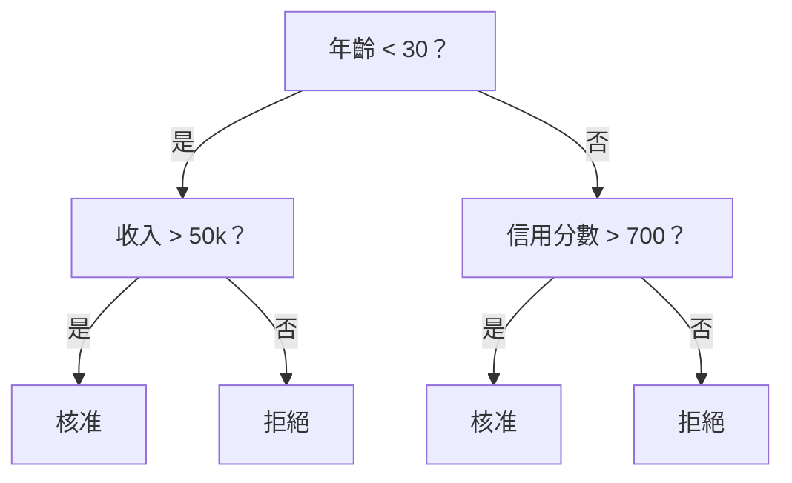
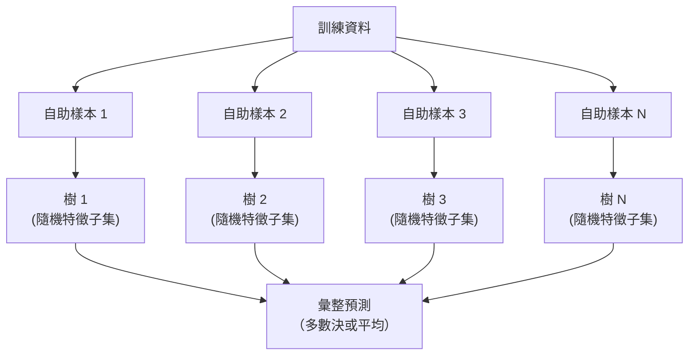

# 決策樹與隨機森林

> 決策樹就是流程圖，而許多棵決策樹組成的森林，則是機器學習中最強大的工具之一。

**Type:** Build
**Language:** Python
**Prerequisites:** Phase 1 (Lessons 09 Information Theory, 06 Probability)
**Time:** ~90 minutes

## 學習目標

- 實作 Gini 不純度、熵和資訊增益計算，找出最佳決策樹分裂方式
- 從零建立決策樹分類器，並使用預剪枝控制項（最大深度、最小樣本數）
- 使用自助抽樣和特徵隨機化建構隨機森林，並說明它為何能降低變異
- 比較 MDI 特徵重要性與置換重要性，並判斷 MDI 何時會產生偏誤

## 問題

你有一份表格資料：每一列是一筆樣本，每一欄是一個特徵，還有一欄是要預測的目標。你可以直接使用神經網路，但對表格資料而言，樹模型（決策樹、隨機森林、梯度提升樹）通常比深度學習表現更好。以結構化資料參賽的 Kaggle 競賽，多由 XGBoost 和 LightGBM 稱霸，而不是 Transformer。

為什麼？樹能直接處理混合特徵類型（數值和類別），不必先做前處理；不需特徵工程就能掌握非線性關係；而且容易解讀，你可以直接查看樹的結構，知道每個預測是如何產生的。隨機森林會平均許多棵樹，在中型資料集上也很能抵抗過度擬合。

本課程會先用遞迴分裂從零建立決策樹，再以此建立隨機森林。你會實作分裂準則背後的數學（Gini 不純度、熵、資訊增益），並理解弱學習器組成的集成為什麼能成為強模型。

## 核心概念

### 決策樹的運作方式

決策樹會依序提出是非問題，將特徵空間切分成矩形區域。



每個內部節點會比較某個特徵與閾值；每個葉節點會產生預測。要分類新的資料點時，從根節點開始沿分支前進，直到抵達葉節點。

決策樹由上而下建構：在每個節點選擇最能區分資料的特徵與閾值。這裡的「最佳」由分裂準則定義。

### 分裂準則：衡量不純度

每個節點都有一組樣本。我們希望將它們分開，讓子節點盡可能「純」，也就是每個子節點主要包含同一個類別。

**Gini 不純度**衡量一筆隨機抽取的樣本，若依照該節點的類別分布來標記時，被錯誤分類的機率。

```text
Gini(S) = 1 - sum(p_k^2)

其中 p_k 是集合 S 中類別 k 的比例。
```

純節點（全部屬於同一類別）的 Gini = 0。二元類別各佔 50% 時，Gini = 0.5。數值越低越好。

```text
範例：6 隻貓、4 隻狗

Gini = 1 - (0.6^2 + 0.4^2) = 1 - (0.36 + 0.16) = 0.48
```

**熵**衡量節點中的資訊量（混亂程度），Phase 01 第 09 課已介紹。

```text
Entropy(S) = -sum(p_k * log2(p_k))
```

純節點的熵 = 0；二元類別各佔 50% 時，熵 = 1.0。數值越低越好。

```text
範例：6 隻貓、4 隻狗

Entropy = -(0.6 * log2(0.6) + 0.4 * log2(0.4))
        = -(0.6 * -0.737 + 0.4 * -1.322)
        = 0.442 + 0.529
        = 0.971 bits
```

**資訊增益**是分裂後不純度（熵或 Gini）的降低量。

```text
IG(S, feature, threshold) = Impurity(S) - weighted_avg(Impurity(S_left), Impurity(S_right))

其中權重是各子節點中的樣本比例。
```

每個節點的貪婪演算法都會嘗試每個特徵和每個可能的閾值，然後選出資訊增益最大的（特徵、閾值）配對。

### 分裂方式

假設目前節點有 m 個樣本和 n 個特徵：

1. 對每個特徵 j（j = 1 到 n）：
   - 依照特徵 j 排序樣本
   - 將相異值之間的所有中點都當作閾值來嘗試
   - 計算每個閾值的資訊增益
2. 選擇資訊增益最高的特徵與閾值
3. 將資料切分到左側（特徵 <= 閾值）和右側（特徵 > 閾值）
4. 對每個子節點遞迴執行

這種貪婪策略不保證能找到全域最佳的樹。找出最佳樹是 NP-hard 問題，但在實務上，貪婪分裂的效果很好。

### 停止條件

若沒有停止條件，決策樹會不斷生長，直到每個葉節點都純化（每個葉節點只有一筆樣本）。這雖然能完美記住訓練資料，卻無法良好地泛化。

**預剪枝**會在樹完全長成前停止：
- 最大深度：樹到達指定深度時停止分裂
- 葉節點最小樣本數：節點樣本少於 k 時停止
- 最小資訊增益：最佳分裂改善不純度的幅度低於門檻時停止
- 葉節點數量上限：限制葉節點總數

**後剪枝**會先讓完整的樹長成，再修剪部分子樹：
- 成本複雜度剪枝（scikit-learn 使用）：按照葉節點數量加入懲罰。懲罰越大，樹越小
- 降低錯誤率剪枝：若移除子樹後驗證錯誤率沒有上升，就移除該子樹

預剪枝比較簡單快速。後剪枝通常能產生更好的樹，因為它不會過早停止那些後續可能帶來有用分裂的分支。

### 用決策樹進行迴歸

在迴歸任務中，葉節點的預測值是該葉節點內目標值的平均數，分裂準則也會改變：

改用**變異數降低**取代資訊增益：

```text
VR(S, feature, threshold) = Var(S) - weighted_avg(Var(S_left), Var(S_right))
```

選擇能最大幅度降低變異數的分裂方式。樹會把輸入空間切成不同區域，並在每個區域預測一個常數（平均數）。

### 隨機森林：集成模型的力量

單棵決策樹的變異很高。資料稍微改變，就可能產生完全不同的樹。隨機森林會平均多棵樹，解決這個問題。



兩種隨機性會讓樹彼此不同：

**Bagging（自助聚合）：** 每棵樹都使用自助樣本訓練，也就是從訓練資料中有放回地隨機抽樣。每個自助樣本約包含 63% 的原始樣本，其餘是袋外樣本，可用於驗證。

**特徵隨機化：** 每次分裂時只考慮隨機選出的部分特徵。分類的預設值是 sqrt(n_features)，迴歸則是 n_features/3。這可避免所有樹都依賴同一個主導特徵分裂。

關鍵觀念是：平均許多彼此低相關的樹，可以降低變異而不增加偏差。個別的樹可能表現平平，但集成模型很強。

### 特徵重要性

隨機森林自然會提供特徵重要性分數。最常見的方法是：

**平均不純度下降（MDI）：** 對每個特徵，加總所有樹中使用該特徵之節點的不純度降低量。較早分裂且能大幅降低不純度的特徵，重要性會較高。

```text
importance(feature_j) = 對所有使用 feature_j 的節點加總：
    (節點樣本數 / 樣本總數) * 不純度下降量
```

這種方法計算速度快（訓練時就能算出來），但容易偏向高基數特徵，以及可供分裂的點較多的特徵。

**置換重要性**是另一種方法：打亂某個特徵的數值，再衡量模型準確率下降多少。這種方法較可靠，但速度較慢。

### 決策樹勝過神經網路的情況

在表格資料上，樹和森林通常勝過神經網路，原因包括：

| 因素 | 樹模型 | 神經網路 |
|------|--------|----------|
| 混合類型（數值 + 類別）| 原生支援 | 需要編碼 |
| 小型資料集（< 10k 列）| 效果良好 | 容易過度擬合 |
| 特徵交互作用 | 透過分裂找出 | 需要設計架構 |
| 可解釋性 | 完全透明 | 黑箱 |
| 訓練時間 | 數分鐘 | 數小時 |
| 對超參數的敏感度 | 低 | 高 |

資料具有空間或序列結構（影像、文字、音訊）時，神經網路較有優勢。對只有平面特徵的表格而言，預設選擇通常是樹模型。

```figure
decision-tree-depth
```

## Build It：從零實作

### 步驟 1：Gini 不純度與熵

從零實作這兩種分裂準則，並確認它們對好壞分裂的判斷一致。

```python
import math

def gini_impurity(labels):
    n = len(labels)
    if n == 0:
        return 0.0
    counts = {}
    for label in labels:
        counts[label] = counts.get(label, 0) + 1
    return 1.0 - sum((c / n) ** 2 for c in counts.values())

def entropy(labels):
    n = len(labels)
    if n == 0:
        return 0.0
    counts = {}
    for label in labels:
        counts[label] = counts.get(label, 0) + 1
    return -sum(
        (c / n) * math.log2(c / n) for c in counts.values() if c > 0
    )
```

### 步驟 2：找出最佳分裂方式

嘗試每個特徵和閾值，回傳資訊增益最高的組合。

```python
def information_gain(parent_labels, left_labels, right_labels, criterion="gini"):
    measure = gini_impurity if criterion == "gini" else entropy
    n = len(parent_labels)
    n_left = len(left_labels)
    n_right = len(right_labels)
    if n_left == 0 or n_right == 0:
        return 0.0
    parent_impurity = measure(parent_labels)
    child_impurity = (
        (n_left / n) * measure(left_labels) +
        (n_right / n) * measure(right_labels)
    )
    return parent_impurity - child_impurity
```

### 步驟 3：建立 DecisionTree 類別

遞迴分裂、預測和追蹤特徵重要性。`_build` 是樹的核心：若節點純化或達到預剪枝限制，就停止；否則取用最佳分裂，並對兩個子節點遞迴執行。

```python
import random

class DecisionTree:
    def __init__(self, max_depth=None, min_samples_split=2,
                 min_samples_leaf=1, criterion="gini",
                 max_features=None):
        self.max_depth = max_depth
        self.min_samples_split = min_samples_split
        self.min_samples_leaf = min_samples_leaf
        self.criterion = criterion
        self.max_features = max_features
        self.tree = None
        self.feature_importances_ = None

    def fit(self, X, y):
        self.n_features = len(X[0])
        self.feature_importances_ = [0.0] * self.n_features
        self.n_samples = len(X)
        self.tree = self._build(X, y, depth=0)
        total = sum(self.feature_importances_)
        if total > 0:
            self.feature_importances_ = [
                fi / total for fi in self.feature_importances_
            ]

    def predict(self, X):
        return [self._predict_one(x, self.tree) for x in X]

    def _build(self, X, y, depth):
        if len(set(y)) == 1:
            return {"leaf": True, "value": y[0]}

        if self.max_depth is not None and depth >= self.max_depth:
            return self._make_leaf(y)

        if len(y) < self.min_samples_split:
            return self._make_leaf(y)

        best_feature, best_threshold, best_gain = self._best_split(X, y)

        if best_feature is None or best_gain <= 0:
            return self._make_leaf(y)

        left_X, left_y, right_X, right_y = self._split_data(
            X, y, best_feature, best_threshold
        )

        if len(left_y) < self.min_samples_leaf or len(right_y) < self.min_samples_leaf:
            return self._make_leaf(y)

        weight = len(y) / self.n_samples
        self.feature_importances_[best_feature] += weight * best_gain

        return {
            "leaf": False,
            "feature": best_feature,
            "threshold": best_threshold,
            "left": self._build(left_X, left_y, depth + 1),
            "right": self._build(right_X, right_y, depth + 1),
        }

    def _make_leaf(self, y):
        counts = {}
        for label in y:
            counts[label] = counts.get(label, 0) + 1
        return {"leaf": True, "value": max(counts, key=counts.get)}

    def _best_split(self, X, y):
        best_feature = None
        best_threshold = None
        best_gain = -1.0

        if self.max_features == "sqrt":
            k = max(1, int(math.sqrt(self.n_features)))
            feature_indices = random.sample(range(self.n_features), k)
        elif isinstance(self.max_features, int):
            if self.max_features < 1:
                raise ValueError("max_features must be at least 1 when given as an integer")
            k = min(self.max_features, self.n_features)
            feature_indices = random.sample(range(self.n_features), k)
        else:
            feature_indices = list(range(self.n_features))

        for feature_idx in feature_indices:
            values = sorted(set(X[i][feature_idx] for i in range(len(X))))
            if len(values) <= 1:
                continue

            for i in range(len(values) - 1):
                threshold = (values[i] + values[i + 1]) / 2.0
                left_y = [y[j] for j in range(len(X)) if X[j][feature_idx] <= threshold]
                right_y = [y[j] for j in range(len(X)) if X[j][feature_idx] > threshold]

                if len(left_y) < self.min_samples_leaf or len(right_y) < self.min_samples_leaf:
                    continue

                gain = information_gain(y, left_y, right_y, self.criterion)
                if gain > best_gain:
                    best_gain = gain
                    best_feature = feature_idx
                    best_threshold = threshold

        return best_feature, best_threshold, best_gain

    def _split_data(self, X, y, feature, threshold):
        left_X, left_y, right_X, right_y = [], [], [], []
        for i in range(len(X)):
            if X[i][feature] <= threshold:
                left_X.append(X[i])
                left_y.append(y[i])
            else:
                right_X.append(X[i])
                right_y.append(y[i])
        return left_X, left_y, right_X, right_y

    def _predict_one(self, x, node):
        if node["leaf"]:
            return node["value"]
        if x[node["feature"]] <= node["threshold"]:
            return self._predict_one(x, node["left"])
        return self._predict_one(x, node["right"])
```

### 步驟 4：建立 RandomForest 類別

實作自助抽樣、特徵隨機化和多數決。

```python
class RandomForest:
    def __init__(self, n_trees=100, max_depth=None,
                 min_samples_split=2, max_features="sqrt",
                 criterion="gini"):
        self.n_trees = n_trees
        self.max_depth = max_depth
        self.min_samples_split = min_samples_split
        self.max_features = max_features
        self.criterion = criterion
        self.trees = []

    def fit(self, X, y):
        n = len(X)
        for _ in range(self.n_trees):
            indices = [random.randint(0, n - 1) for _ in range(n)]
            X_boot = [X[i] for i in indices]
            y_boot = [y[i] for i in indices]
            tree = DecisionTree(
                max_depth=self.max_depth,
                min_samples_split=self.min_samples_split,
                max_features=self.max_features,
                criterion=self.criterion,
            )
            tree.fit(X_boot, y_boot)
            self.trees.append(tree)

    def predict(self, X):
        all_preds = [tree.predict(X) for tree in self.trees]
        predictions = []
        for i in range(len(X)):
            votes = {}
            for preds in all_preds:
                v = preds[i]
                votes[v] = votes.get(v, 0) + 1
            predictions.append(max(votes, key=votes.get))
        return predictions
```

完整實作（包含所有輔助方法）請參閱 `code/trees.py`。

## Use It：實際應用

使用 scikit-learn，只要三行就能訓練隨機森林：

```python
from sklearn.ensemble import RandomForestClassifier
from sklearn.datasets import load_iris
from sklearn.model_selection import train_test_split

X, y = load_iris(return_X_y=True)
X_train, X_test, y_train, y_test = train_test_split(X, y, random_state=42)

rf = RandomForestClassifier(n_estimators=100, random_state=42)
rf.fit(X_train, y_train)
print(f"Accuracy: {rf.score(X_test, y_test):.4f}")
print(f"Feature importances: {rf.feature_importances_}")
```

實務上，梯度提升樹（XGBoost、LightGBM、CatBoost）通常比隨機森林更強，因為它們會依序建立樹，每棵樹都會修正前一棵樹的錯誤。不過，隨機森林比較不容易設定錯誤，而且幾乎不需要調整超參數。

## Ship It：交付成果

本課程會產生 `outputs/prompt-tree-interpreter.md`——協助商業利害關係人理解決策樹分裂方式的提示詞。輸入訓練完成的樹結構（深度、特徵、分裂閾值、準確率）後，它會將模型轉成白話規則、排列特徵重要性、提醒過度擬合或資料洩漏，並建議後續步驟。若要向不看程式碼的人說明樹模型，就可以使用它。

## Exercises：練習

1. 在含有 3 個類別的二維資料集上訓練單棵決策樹，手動追蹤各次分裂並畫出矩形決策邊界。比較 max_depth=2 和 max_depth=10 時的邊界。

2. 為迴歸樹實作變異數降低分裂。使用 y = sin(x) + noise 產生 200 個點並擬合迴歸樹，再把樹的分段常數預測與真實曲線畫在一起。

3. 分別使用 1、5、10、50 和 200 棵樹建立隨機森林，繪製訓練準確率及測試準確率隨樹數增加的變化。觀察測試準確率會逐漸趨於平穩，但不會下降（森林能抵抗過度擬合）。

4. 在 5 個不同資料集上比較 Gini 不純度與熵分裂準則，測量準確率和樹的深度。多數情況下，兩者產生的結果幾乎相同。請說明原因。

5. 實作置換重要性，並在某個含有高基數隨機雜訊特徵的資料集上，將置換重要性與 MDI 比較。MDI 會把雜訊特徵排在很前面，置換重要性則不會。

## 關鍵詞

| 術語 | 一般說法 | 實際意義 |
|------|----------|----------|
| 決策樹 |「用來預測的流程圖」| 依照一連串 if/else 分裂學習規則，將特徵空間切成矩形區域的模型 |
| Gini 不純度 |「節點混合得多嚴重」| 節點中的隨機樣本被錯誤分類的機率；0 表示純化，二元分類的最大值為 0.5 |
| 熵 |「節點中的混亂程度」| 節點的資訊量；0 表示純化，二元分類的不確定性最大值為 1.0，源自資訊理論 |
| 資訊增益 |「分裂效果有多好」| 分裂後不純度的降低量，是貪婪選擇分裂方式的準則 |
| 預剪枝 |「提早停止樹的生長」| 透過設定最大深度、最小樣本數或最小增益門檻，提早停止建樹 |
| 後剪枝 |「樹長好之後再修剪」| 先建完整棵樹，再移除無法改善驗證表現的子樹 |
| Bagging（自助聚合）|「使用隨機子集訓練」| 自助聚合；每個模型都使用不同的有放回隨機樣本訓練 |
| 隨機森林 |「一大群樹」| 由多棵決策樹組成的集成；每棵樹使用自助樣本訓練，且每次分裂都隨機挑選部分特徵 |
| 特徵重要性（MDI）|「哪些特徵重要」| 將各特徵在所有樹及節點中貢獻的不純度下降量加總 |
| 置換重要性 |「打亂再檢查」| 隨機打亂特徵值後準確率下降的程度；對雜訊特徵而言，比 MDI 更可靠 |
| 變異數降低 |「迴歸版的資訊增益」| 迴歸樹的資訊增益類比，選擇最能降低目標變異數的分裂方式 |
| 自助樣本 |「有重複的隨機樣本」| 從原始資料集中有放回抽取、大小相同但可能含有重複項目的樣本 |

## 延伸閱讀

- [Breiman：Random Forests（2001）](https://link.springer.com/article/10.1023/A:1010933404324)：原始隨機森林論文
- [Grinsztajn 等人：Why do tree-based models still outperform deep learning on tabular data?（2022）](https://arxiv.org/abs/2207.08815)：嚴謹比較樹模型與神經網路處理表格資料的研究
- [scikit-learn 決策樹文件](https://scikit-learn.org/stable/modules/tree.html)：附有視覺化工具的實用指南
- [XGBoost: A Scalable Tree Boosting System（Chen 與 Guestrin，2016）](https://arxiv.org/abs/1603.02754)：主宰 Kaggle 競賽的梯度提升論文
