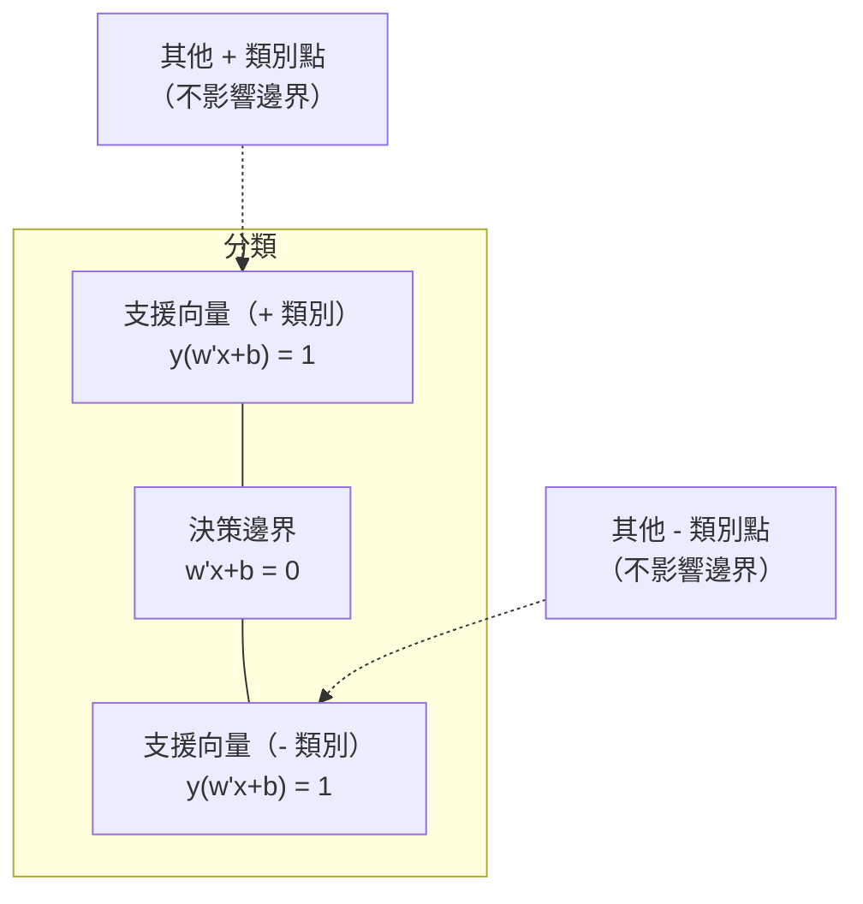
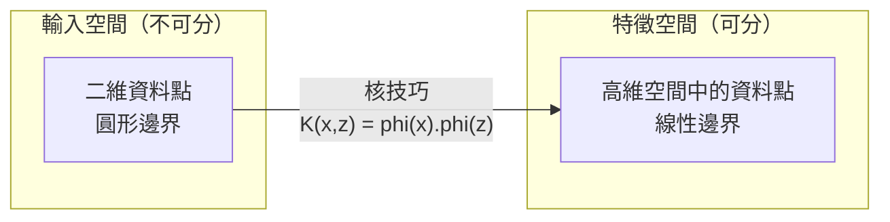

# 支援向量機

> 在兩個類別之間找出最寬的街道，就是支援向量機的核心概念。

**Type:** Build
**Language:** Python
**Prerequisites:** Phase 1 (Lessons 08 Optimization, 14 Norms and Distances, 18 Convex Optimization)
**Time:** ~90 minutes

## 學習目標

- 使用 hinge loss 和原始形式上的梯度下降，從零實作線性 SVM
- 說明最大間隔原則，並從訓練完成的模型找出支援向量
- 比較線性、多項式和 RBF 核函式，並說明核技巧如何避免明確映射到高維空間
- 評估 C 參數如何控制間隔寬度與分類錯誤之間的取捨

## 問題

你有兩個類別的資料點，需要畫一條線（或超平面）把它們分開。能做到這件事的線有無限多條，應該選哪一條？

選擇間隔最大的那一條。間隔是決策邊界與兩側最近資料點之間的距離。間隔越寬，分類器越有把握，也越能泛化到未見資料。

這個想法引出了支援向量機（SVM），這是機器學習中數學結構最優雅的演算法之一。深度學習興起前，SVM 曾是主流分類方法；如今在小型資料集、高維資料，以及需要原理清楚、理論保證的問題上，仍然是很好的選擇。

SVM 與 Phase 01 直接相關：最佳化問題是凸的（第 18 課）、間隔以範數測量（第 14 課），而核技巧會利用內積處理非線性邊界，不需要在高維空間中實際計算。

## 核心概念

### 最大間隔分類器

給定標籤 y_i 屬於 {-1, +1}、特徵向量為 x_i 的線性可分資料，我們要找一個超平面 w^T x + b = 0 將類別分開。

點 x_i 到超平面的距離為：

```text
distance = |w^T x_i + b| / ||w||
```

若點分類正確，則 y_i * (w^T x_i + b) > 0。間隔是超平面到兩側最近點的距離總和。


最佳化問題如下：

```text
最大化    2 / ||w||     (間隔寬度)
限制條件  y_i * (w^T x_i + b) >= 1  對所有 i
```

等價地（最小化 ||w||^2 比較容易最佳化）：

```text
最小化    (1/2) ||w||^2
限制條件  y_i * (w^T x_i + b) >= 1  對所有 i
```

這是凸二次規劃問題，具有唯一的全域解。恰好落在間隔邊界上（y_i * (w^T x_i + b) = 1）的資料點稱為支援向量。只有這些點會決定決策邊界；移動或移除任何非支援向量，邊界都不會改變。

### 支援向量：少數關鍵點



多數訓練點都不重要，只有支援向量重要。因此 SVM 在預測時相當節省記憶體：只需儲存支援向量，不必儲存整份訓練資料。

支援向量的數量也能提供泛化誤差上限。相較於資料集大小，支援向量越少，泛化能力通常越好。

### 軟間隔：使用 C 參數處理雜訊

真實資料很少能完美分開。有些點可能落在決策邊界的錯誤一側，或位於間隔內。軟間隔形式會加入鬆弛變數，允許違反間隔條件。

```text
最小化    (1/2) ||w||^2 + C * sum(xi_i)
限制條件  y_i * (w^T x_i + b) >= 1 - xi_i
            xi_i >= 0  對所有 i
```

鬆弛變數 xi_i 衡量第 i 個點違反間隔條件的程度。C 控制以下取捨：

| C 值 | 行為 |
|------|------|
| 大 C | 嚴格懲罰違反條件的點。間隔較窄、誤分類較少，但容易過度擬合 |
| 小 C | 容許較多違反條件的點。間隔較寬、誤分類較多，但容易欠擬合 |

C 是反向定義的正則化強度：C 越大，正則化越弱；C 越小，正則化越強。

### Hinge loss：SVM 的損失函式

軟間隔 SVM 可改寫成不受限制的最佳化問題：

```text
最小化    (1/2) ||w||^2 + C * sum(max(0, 1 - y_i * (w^T x_i + b)))
```

max(0, 1 - y_i * f(x_i)) 這一項稱為 hinge loss。點分類正確且位於間隔之外時，損失為零；點落在間隔內或分類錯誤時，損失會線性增加。

```text
單一資料點的 Hinge loss：

損失
  |
  | \
  |  \
  |   \
  |    \
  |     \_______________
  |
  +-----|-----|-------->  y * f(x)
       0     1

若 y*f(x) >= 1（分類正確且位於間隔外），損失為零。
若 y*f(x) < 1，則會線性受罰。
```

與邏輯迴歸的 logistic loss 比較：

```text
Hinge：     max(0, 1 - y*f(x))          在間隔處硬性截斷
Logistic：  log(1 + exp(-y*f(x)))        平滑，永遠不會恰好為零
```

Hinge loss 會產生稀疏解（只有支援向量的貢獻不為零），而 logistic loss 會使用所有資料點。因此 SVM 在預測時更節省記憶體。

### 使用梯度下降訓練線性 SVM

你可以對 hinge loss 加上 L2 正則化後，以梯度下降訓練線性 SVM，不必求解受限制的二次規劃問題：

```text
L(w, b) = (lambda/2) * ||w||^2 + (1/n) * sum(max(0, 1 - y_i * (w^T x_i + b)))

對 w 的梯度：
  若 y_i * (w^T x_i + b) >= 1： dL/dw = lambda * w
  若 y_i * (w^T x_i + b) < 1：  dL/dw = lambda * w - y_i * x_i

對 b 的梯度：
  若 y_i * (w^T x_i + b) >= 1： dL/db = 0
  若 y_i * (w^T x_i + b) < 1：  dL/db = -y_i
```

這稱為原始形式。每個 epoch 的複雜度是 O(n * d)，其中 n 是樣本數、d 是特徵數。對大型、稀疏、高維資料（例如文字分類）而言，速度很快。

### 對偶形式與核技巧

SVM 問題的拉格朗日對偶形式（Phase 01 第 18 課的 KKT 條件）如下：

```text
最大化    sum(alpha_i) - (1/2) * sum_ij(alpha_i * alpha_j * y_i * y_j * (x_i . x_j))
限制條件  0 <= alpha_i <= C
            sum(alpha_i * y_i) = 0
```

對偶形式只包含資料點之間的內積 x_i . x_j。這是關鍵所在：將每個內積換成核函式 K(x_i, x_j)，SVM 就能學習非線性邊界，不必實際計算轉換結果。

```text
線性核：          K(x, z) = x . z
多項式核：        K(x, z) = (x . z + c)^d
RBF（高斯）核：   K(x, z) = exp(-gamma * ||x - z||^2)
```

RBF 核會將資料映射到無限維空間。輸入空間中距離近的點，核函式值接近 1；距離遠的點，核函式值接近 0。它能學習任意平滑的決策邊界。



核技巧能在不實際進入高維空間的情況下，計算該空間中的內積。對 D 維資料的 d 次多項式核而言，明確建立的特徵空間會有 O(D^d) 維；但計算 K(x, z) 只需要 O(D) 時間。

### 用 SVM 進行迴歸（SVR）

支援向量迴歸會在資料周圍擬合寬度為 epsilon 的管狀區域。位於管內的點損失為零；管外的點則依距離線性受罰。

```text
最小化    (1/2) ||w||^2 + C * sum(xi_i + xi_i*)
限制條件  y_i - (w^T x_i + b) <= epsilon + xi_i
            (w^T x_i + b) - y_i <= epsilon + xi_i*
            xi_i, xi_i* >= 0
```

epsilon 參數控制管狀區域的寬度。管越寬，支援向量越少，擬合越平滑；管越窄，支援向量越多，擬合越緊密。

### SVM 為何被深度學習取代，以及何時仍有優勢

從 1990 年代末到 2010 年代初，SVM 曾在機器學習領域居於主導地位。後來深度學習在以下方面超越了 SVM：

| 因素 | SVM | 深度學習 |
|------|-----|----------|
| 特徵工程 | 需要 | 可自行學得特徵 |
| 可擴展性 | 核方法為 O(n²) 到 O(n³) | SGD 每個 epoch 為 O(n) |
| 影像／文字／音訊 | 需要手工設計特徵 | 可從原始資料學習 |
| 大型資料集（>100k）| 慢 | 可有效擴展 |
| GPU 加速 | 效益有限 | 大幅加速 |

SVM 在以下情況仍有優勢：
- 小型資料集（數百到數千筆樣本）
- 高維度稀疏資料（具有 TF-IDF 特徵的文字）
- 需要數學保證（間隔界限）
- 必須縮短訓練時間（線性 SVM 很快）
- 間隔結構明確的二元分類
- 異常偵測（單類別 SVM）

```figure
svm-margin
```

## Build It：從零實作

### 步驟 1：Hinge loss 與梯度

先計算一批資料的 hinge loss 和梯度，建立基本實作。

```python
def hinge_loss(X, y, w, b):
    n = len(X)
    total_loss = 0.0
    for i in range(n):
        margin = y[i] * (dot(w, X[i]) + b)
        total_loss += max(0.0, 1.0 - margin)
    return total_loss / n
```

### 步驟 2：用梯度下降訓練線性 SVM

透過最小化正則化 hinge loss 來訓練，不需要二次規劃求解器。

```python
class LinearSVM:
    def __init__(self, lr=0.001, lambda_param=0.01, n_epochs=1000):
        self.lr = lr
        self.lambda_param = lambda_param
        self.n_epochs = n_epochs
        self.w = None
        self.b = 0.0

    def fit(self, X, y):
        n_features = len(X[0])
        self.w = [0.0] * n_features
        self.b = 0.0

        for epoch in range(self.n_epochs):
            for i in range(len(X)):
                margin = y[i] * (dot(self.w, X[i]) + self.b)
                if margin >= 1:
                    self.w = [wj - self.lr * self.lambda_param * wj
                              for wj in self.w]
                else:
                    self.w = [wj - self.lr * (self.lambda_param * wj - y[i] * X[i][j])
                              for j, wj in enumerate(self.w)]
                    self.b -= self.lr * (-y[i])

    def predict(self, X):
        return [1 if dot(self.w, x) + self.b >= 0 else -1 for x in X]
```

### 步驟 3：核函式

實作線性、多項式和 RBF 核函式。

```python
def linear_kernel(x, z):
    return dot(x, z)

def polynomial_kernel(x, z, degree=3, c=1.0):
    return (dot(x, z) + c) ** degree

def rbf_kernel(x, z, gamma=0.5):
    diff = [xi - zi for xi, zi in zip(x, z)]
    return math.exp(-gamma * dot(diff, diff))
```

### 步驟 4：辨識間隔與支援向量

訓練後找出支援向量，並計算間隔寬度。

```python
def find_support_vectors(X, y, w, b, tol=1e-3):
    support_vectors = []
    for i in range(len(X)):
        margin = y[i] * (dot(w, X[i]) + b)
        if abs(margin - 1.0) < tol:
            support_vectors.append(i)
    return support_vectors
```

完整實作和所有示範請參閱 `code/svm.py`。

## Use It：實際應用

使用 scikit-learn：

```python
from sklearn.svm import SVC, LinearSVC, SVR
from sklearn.preprocessing import StandardScaler
from sklearn.pipeline import Pipeline

clf = Pipeline([
    ("scaler", StandardScaler()),
    ("svm", SVC(kernel="rbf", C=1.0, gamma="scale")),
])
clf.fit(X_train, y_train)
print(f"Accuracy: {clf.score(X_test, y_test):.4f}")
print(f"Support vectors: {clf['svm'].n_support_}")
```

重要提醒：訓練 SVM 前務必縮放特徵。由於間隔取決於 ||w||，SVM 對特徵量級很敏感；未縮放的特徵會扭曲幾何關係。

大型資料集請使用 `LinearSVC`（原始形式，每個 epoch 為 O(n)），而非 `SVC`（對偶形式，複雜度為 O(n²) 到 O(n³)）：

```python
from sklearn.svm import LinearSVC

clf = Pipeline([
    ("scaler", StandardScaler()),
    ("svm", LinearSVC(C=1.0, max_iter=10000)),
])
```

## Exercises：練習

1. 產生二維線性可分資料集，訓練 LinearSVM 並找出支援向量。確認支援向量就是最接近決策邊界的點。

2. 在有雜訊的資料集上，將 C 從 0.001 調整到 1000，並繪製各個 C 值對應的決策邊界。觀察模型如何從寬間隔（欠擬合）轉為窄間隔（過度擬合）。

3. 建立類別邊界為圓形（不是線性）的資料集，展示線性 SVM 會失敗。計算 RBF 核矩陣，並展示兩個類別如何在核函式誘導的特徵空間中分開。

4. 在相同資料集上比較 hinge loss 與 logistic loss：分別訓練線性 SVM 和邏輯迴歸，再計算各模型有多少訓練點會貢獻於決策邊界（支援向量與所有資料點）。

5. 實作 SVR（epsilon 不敏感損失），並將模型擬合到 y = sin(x) + noise。繪製預測周圍的 epsilon 管，並標出支援向量（位於管外的點）。

## 關鍵詞

| 術語 | 實際意義 |
|------|----------|
| 支援向量 | 最接近決策邊界的訓練點，也是唯一能決定超平面的點 |
| 間隔 | 決策邊界到最近支援向量的距離，SVM 會將它最大化 |
| Hinge loss | max(0, 1 - y*f(x))；正確分類且位於間隔外時為零，否則會線性受罰 |
| C 參數 | 間隔寬度與分類錯誤之間的取捨；C 大則間隔窄，C 小則間隔寬 |
| 軟間隔 | 透過鬆弛變數允許違反間隔條件的 SVM 形式，可處理非線性可分資料 |
| 核技巧 | 不必明確映射到高維特徵空間，就能計算該空間中的內積 |
| 線性核 | K(x, z) = x . z，等同標準內積，適用於線性可分資料 |
| RBF 核 | K(x, z) = exp(-gamma * \|\|x-z\|\|^2)，映射到無限維空間，可學習任意平滑邊界 |
| 多項式核 | K(x, z) = (x . z + c)^d，映射到由多項式組合構成的特徵空間 |
| 對偶形式 | 只依賴資料點之間內積的 SVM 改寫形式，能使用核函式 |
| SVR | 支援向量迴歸，在資料周圍擬合 epsilon 管；管內的點損失為零 |
| 鬆弛變數 | xi_i 衡量某點違反間隔條件的程度；正確分類且位於間隔外時為零 |
| 最大間隔 | 選擇一個超平面，使它到各類別最近點的距離最大化的原則 |

## 延伸閱讀

- [Vapnik：《The Nature of Statistical Learning Theory》（1995）](https://link.springer.com/book/10.1007/978-1-4757-3264-1)：SVM 與統計學習的基礎著作
- [Cortes 與 Vapnik：〈Support-vector networks〉（1995）](https://link.springer.com/article/10.1007/BF00994018)：SVM 原始論文
- [Platt：〈Sequential Minimal Optimization〉（1998）](https://www.microsoft.com/en-us/research/publication/sequential-minimal-optimization-a-fast-algorithm-for-training-support-vector-machines/)：讓 SVM 訓練變得實用的 SMO 演算法
- [scikit-learn SVM 文件](https://scikit-learn.org/stable/modules/svm.html)：含實作細節的實用指南
- [LIBSVM：支援向量機函式庫](https://www.csie.ntu.edu.tw/~cjlin/libsvm/)：多數 SVM 實作背後使用的 C++ 函式庫
