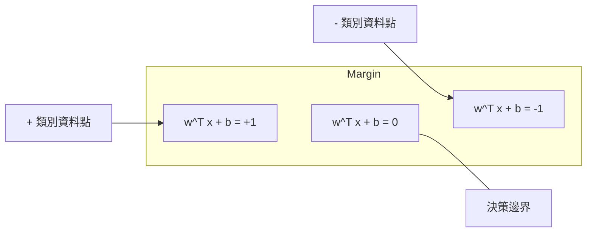
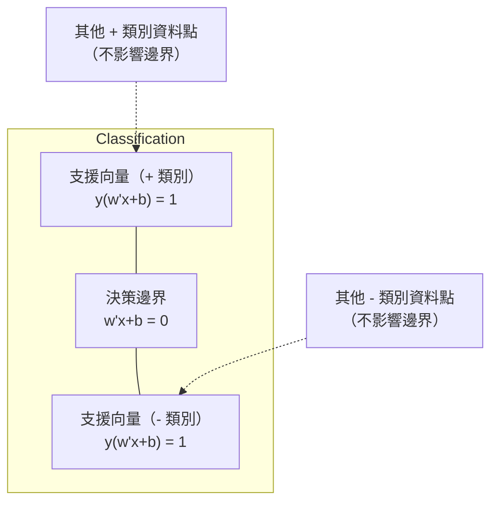
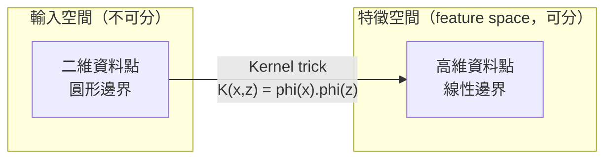

# 支援向量機

> 在兩個類別之間，找出最寬的街道。整個想法就是如此。

**Type:** Build
**Language:** Python
**Prerequisites:** Phase 1 (Lessons 08 Optimization, 14 Norms and Distances, 18 Convex Optimization)
**Time:** ~90 minutes

## Learning Objectives｜學習目標

- 從頭實作線性支援向量機（linear SVM），使用合頁損失（hinge loss）和梯度下降法（gradient descent）最佳化原始形式（primal formulation）
- 說明最大間隔原則（maximum margin principle），並從訓練完成的模型中找出支援向量（support vector）
- 比較線性核（linear kernel）、多項式核（polynomial kernel）與 RBF 核（RBF kernel），並說明核技巧（kernel trick）如何免去明確建立高維特徵映射（feature mapping）
- 評估 C 參數（C parameter）如何取捨間隔寬度（margin width）與分類錯誤

## The Problem｜問題

你有兩類資料點，需要畫一條直線或超平面（hyperplane）將它們分開。可行的直線有無限多條，你該選哪一條？

選擇間隔（margin）最大的那一條。間隔是決策邊界（decision boundary）到兩側最近資料點的距離。間隔越寬，分類器（classifier）越有把握，對未見資料的泛化（generalization）能力也越好。

這個直覺引出了支援向量機（support vector machine，SVM）——這是機器學習（ML）中數學上最優雅的演算法（algorithm）之一。深度學習（deep learning）興起前，SVM 曾主導分類領域。如今，無論是小型資料集、高維資料，或需要具備明確原理、已為人熟知且有理論保證之模型的問題，SVM 都是最佳選擇。

SVM 與第一階段直接相連：其最佳化是凸的（convex；第 18 課），間隔以範數（norm；第 14 課）衡量，而核技巧會利用內積（dot product）處理非線性決策邊界，無須真的在高維空間中計算。

## The Concept｜核心概念

### 最大間隔分類器（maximum margin classifier）

給定線性可分（linearly separable）的資料，標籤為 y_i in {-1, +1}，特徵向量（feature vector）為 x_i；我們要找出超平面 w^T x + b = 0，將兩個類別分開。

資料點 x_i 到超平面的距離為：

```
distance = |w^T x_i + b| / ||w||
```

若資料點分類正確，就有 y_i * (w^T x_i + b) > 0。間隔是超平面到任一側最近資料點之距離的兩倍。



最佳化問題如下：

```
maximize    2 / ||w||     (the margin width)
subject to  y_i * (w^T x_i + b) >= 1  for all i
```

等價地，我們也可以最小化 ||w||^2，這樣較容易最佳化：

```
minimize    (1/2) ||w||^2
subject to  y_i * (w^T x_i + b) >= 1  for all i
```

這是凸二次規劃問題（convex quadratic program），有唯一的全域解。恰好落在間隔邊界上的資料點（其中 y_i * (w^T x_i + b) = 1）就是支援向量。只有這些資料點會決定決策邊界；移動或移除任何非支援向量的資料點，都不會改變邊界。

### 支援向量：關鍵少數



大多數訓練資料點都無關緊要，只有支援向量重要。這使 SVM 在預測時很省記憶體（memory）：只需儲存支援向量，不必保留整份訓練集（training set）。

支援向量的數量也能界定泛化誤差的上界。相對於資料集大小，支援向量越少，泛化能力就越好。

### 軟間隔：用 C 參數處理雜訊

真實資料很少能完美分開。有些點可能落在決策邊界的錯誤一側，或位於間隔內。軟間隔（soft margin）形式會引入鬆弛變數（slack variable），允許違反間隔條件。

```
minimize    (1/2) ||w||^2 + C * sum(xi_i)
subject to  y_i * (w^T x_i + b) >= 1 - xi_i
            xi_i >= 0  for all i
```

鬆弛變數 xi_i 衡量第 i 個資料點違反間隔的程度。C 控制這項取捨：

| C 值 | 行為 |
|---------|----------|
| C 大 | 對違規懲罰很重。間隔窄、誤分類較少，但容易過度擬合（overfitting） |
| C 小 | 容許較多違規。間隔寬、誤分類較多，但容易欠擬合（underfitting） |

C 與正則化強度（regularization strength）呈反向關係：C 越大，正則化越弱；C 越小，正則化越強。

### 合頁損失（hinge loss）：SVM 的損失函數

軟間隔 SVM 可以改寫為無約束最佳化（unconstrained optimization）問題：

```
minimize    (1/2) ||w||^2 + C * sum(max(0, 1 - y_i * (w^T x_i + b)))
```

max(0, 1 - y_i * f(x_i)) 這一項就是合頁損失。若資料點分類正確且位於間隔之外，損失為零；若資料點落在間隔內或被誤分類，損失則呈線性變化。

```
Hinge loss for a single point:

loss
  |
  | \
  |  \
  |   \
  |    \
  |     \_______________
  |
  +-----|-----|-------->  y * f(x)
       0     1

Zero loss when y*f(x) >= 1 (correctly classified, outside margin).
Linear penalty when y*f(x) < 1.
```

再與邏輯斯迴歸（logistic regression）使用的邏輯斯損失（logistic loss）比較：

```
Hinge:     max(0, 1 - y*f(x))          Hard cutoff at margin
Logistic:  log(1 + exp(-y*f(x)))        Smooth, never exactly zero
```

合頁損失會產生稀疏解（sparse solution），只有支援向量有非零貢獻；邏輯斯損失則會使用所有資料點。因此，SVM 在預測時更節省記憶體（memory）。

### 使用梯度下降法訓練線性 SVM

不必求解受限二次規劃問題（quadratic program，QP）；使用梯度下降法最小化合頁損失與 L2 正則化（L2 regularization）項的總和，即可訓練線性 SVM：

```
L(w, b) = (lambda/2) * ||w||^2 + (1/n) * sum(max(0, 1 - y_i * (w^T x_i + b)))

Gradient with respect to w:
  If y_i * (w^T x_i + b) >= 1:  dL/dw = lambda * w
  If y_i * (w^T x_i + b) < 1:   dL/dw = lambda * w - y_i * x_i

Gradient with respect to b:
  If y_i * (w^T x_i + b) >= 1:  dL/db = 0
  If y_i * (w^T x_i + b) < 1:   dL/db = -y_i
```

這稱為原始形式。每個 epoch 的計算量為 O(n * d)，其中 n 是樣本數，d 是特徵數。對大型、稀疏且高維的資料，例如文字分類（text classification），這種方法速度很快。

### 對偶形式（dual formulation）與核技巧

SVM 問題的拉格朗日對偶（Lagrangian dual）形式如下；相關概念來自第一階段第 18 課，該課介紹 KKT 條件（KKT conditions）：

```
maximize    sum(alpha_i) - (1/2) * sum_ij(alpha_i * alpha_j * y_i * y_j * (x_i . x_j))
subject to  0 <= alpha_i <= C
            sum(alpha_i * y_i) = 0
```

對偶形式只涉及資料點之間的內積 x_i . x_j。關鍵就在於：將每個內積換成核函數（kernel function）K(x_i, x_j)，SVM 就能學習非線性邊界，而不必明確計算該變換。

```
Linear kernel:      K(x, z) = x . z
Polynomial kernel:  K(x, z) = (x . z + c)^d
RBF (Gaussian):     K(x, z) = exp(-gamma * ||x - z||^2)
```

RBF 核會將資料映射到無限維空間（infinite-dimensional space）。在輸入空間中距離很近的點，其核值接近 1；距離很遠的點，核值則接近 0。它能學習任何平滑的決策邊界。



核技巧能在不實際進入高維空間的情況下，計算其中的內積。在 D 維空間中，d 次多項式核的明確特徵空間需要 O(D^d) 個維度；但計算 K(x, z) 只需 O(D) 時間。

### 支援向量迴歸（support vector regression，SVR）

支援向量迴歸會在資料周圍擬合寬度為 ε 的管狀區域（epsilon tube）。位於管狀區域內的點損失為零；位於區域外的點則受到線性懲罰。

```
minimize    (1/2) ||w||^2 + C * sum(xi_i + xi_i*)
subject to  y_i - (w^T x_i + b) <= epsilon + xi_i
            (w^T x_i + b) - y_i <= epsilon + xi_i*
            xi_i, xi_i* >= 0
```

ε 參數（epsilon parameter）控制管狀區域的寬度。區域越寬，支援向量越少，擬合結果越平滑；區域越窄，支援向量越多，擬合也越貼近資料。

### SVM 為何不敵深度學習（deep learning）（以及何時仍有優勢）

從 1990 年代末期到 2010 年代初期，SVM 曾主導機器學習。深度學習（deep learning）後來超越 SVM，原因包括：

| 面向 | SVM | 深度學習（deep learning） |
|--------|------|---------------|
| 特徵工程（feature engineering） | 需要人工設計 | 能自行學習特徵 |
| 可擴充性（scalability） | 核方法需 O(n^2) 至 O(n^3) | 使用隨機梯度下降法（SGD）時每個 epoch 為 O(n) |
| 影像／文字／音訊 | 需要人工設計特徵 | 能從原始資料學習 |
| 大型資料集（>100k） | 慢 | 擴充性佳 |
| GPU 加速 | 效益有限 | 大幅提升速度 |

以下情況下，SVM 仍有優勢：
- 小型資料集（數百到數千筆樣本）
- 高維稀疏資料（例如使用 TF-IDF 特徵的文字）
- 需要數學保證（間隔界限）時
- 必須盡量縮短訓練時間時（線性 SVM 非常快）
- 間隔結構明確的二元分類（binary classification）
- 異常偵測（anomaly detection），可使用單類別 SVM（one-class SVM）

```figure
svm-margin
```

## Build It｜動手實作

### 步驟 1：合頁損失與梯度

先打好基礎：計算一個批次的合頁損失及其梯度。

```python
def hinge_loss(X, y, w, b):
    n = len(X)
    total_loss = 0.0
    for i in range(n):
        margin = y[i] * (dot(w, X[i]) + b)
        total_loss += max(0.0, 1.0 - margin)
    return total_loss / n
```

### 步驟 2：以梯度下降法訓練線性 SVM

最小化經正則化的合頁損失來訓練模型，不需要 QP 求解器（solver）。

```python
class LinearSVM:
    def __init__(self, lr=0.001, lambda_param=0.01, n_epochs=1000):
        self.lr = lr
        self.lambda_param = lambda_param
        self.n_epochs = n_epochs
        self.w = None
        self.b = 0.0

    def fit(self, X, y):
        n_features = len(X[0])
        self.w = [0.0] * n_features
        self.b = 0.0

        for epoch in range(self.n_epochs):
            for i in range(len(X)):
                margin = y[i] * (dot(self.w, X[i]) + self.b)
                if margin >= 1:
                    self.w = [wj - self.lr * self.lambda_param * wj
                              for wj in self.w]
                else:
                    self.w = [wj - self.lr * (self.lambda_param * wj - y[i] * X[i][j])
                              for j, wj in enumerate(self.w)]
                    self.b -= self.lr * (-y[i])

    def predict(self, X):
        return [1 if dot(self.w, x) + self.b >= 0 else -1 for x in X]
```

### 步驟 3：核函數

實作線性核、多項式核與 RBF 核。

```python
def linear_kernel(x, z):
    return dot(x, z)

def polynomial_kernel(x, z, degree=3, c=1.0):
    return (dot(x, z) + c) ** degree

def rbf_kernel(x, z, gamma=0.5):
    diff = [xi - zi for xi, zi in zip(x, z)]
    return math.exp(-gamma * dot(diff, diff))
```

### 步驟 4：間隔與支援向量辨識

訓練完成後，找出哪些資料點是支援向量，並計算間隔寬度。

```python
def find_support_vectors(X, y, w, b, tol=1e-3):
    support_vectors = []
    for i in range(len(X)):
        margin = y[i] * (dot(w, X[i]) + b)
        if abs(margin - 1.0) < tol:
            support_vectors.append(i)
    return support_vectors
```

完整實作與所有示範請見 `code/svm.py`。

## Use It｜實際應用

使用 scikit-learn：

```python
from sklearn.svm import SVC, LinearSVC, SVR
from sklearn.preprocessing import StandardScaler
from sklearn.pipeline import Pipeline

clf = Pipeline([
    ("scaler", StandardScaler()),
    ("svm", SVC(kernel="rbf", C=1.0, gamma="scale")),
])
clf.fit(X_train, y_train)
print(f"Accuracy: {clf.score(X_test, y_test):.4f}")
print(f"Support vectors: {clf['svm'].n_support_}")
```

重要：訓練 SVM 前務必先做特徵縮放（feature scaling）。SVM 對特徵數值的量級很敏感，因為間隔取決於 ||w||；未縮放的特徵會扭曲幾何關係。

大型資料集建議使用 `LinearSVC`（原始形式，每個 epoch 為 O(n)），不要用 `SVC`（對偶形式，O(n^2) 到 O(n^3)）：

```python
from sklearn.svm import LinearSVC

clf = Pipeline([
    ("scaler", StandardScaler()),
    ("svm", LinearSVC(C=1.0, max_iter=10000)),
])
```

## Exercises｜練習

1. 產生一個二維線性可分的資料集，訓練 LinearSVM 並找出支援向量。確認這些支援向量就是最靠近決策邊界的資料點。

2. 在含雜訊的資料集上，將 C 從 0.001 調到 1000，並繪出每個 C 值對應的決策邊界。觀察間隔如何從寬（欠擬合）逐漸變窄（過度擬合）。

3. 建立類別邊界呈圓形而非線性的資料集，展示線性 SVM 無法處理。計算 RBF 核矩陣（kernel matrix），並展示在核所誘導的特徵空間中，兩個類別可以分開。

4. 在同一個資料集上比較合頁損失與邏輯斯損失。分別訓練線性 SVM 和邏輯斯迴歸，計算各模型有多少訓練資料點會影響決策邊界（支援向量對比全部資料點）。

5. 實作支援向量迴歸（SVR），使用 ε 不敏感損失（epsilon-insensitive loss）。將模型擬合到 y = sin(x) + noise，繪出預測值周圍的 ε 管狀區域，並標示支援向量（位於區域外的資料點）。

## Key Terms｜關鍵術語

| 術語 | 實際意義 |
|------|----------------------|
| 支援向量（support vector） | 最靠近決策邊界的訓練資料點，也是唯一會決定超平面的資料點 |
| 間隔（margin） | 決策邊界到最近支援向量的距離；SVM 會將間隔最大化 |
| 合頁損失（hinge loss） | max(0, 1 - y*f(x))。分類正確且位於間隔之外時為零，否則會受到線性懲罰 |
| C 參數（C parameter） | 取捨間隔寬度與分類錯誤。C 大代表間隔窄，C 小代表間隔寬 |
| 軟間隔（soft margin） | 透過鬆弛變數容許違反間隔條件的 SVM 形式，可處理不可分的資料 |
| 核技巧（kernel trick） | 不必明確映射到高維特徵空間，也能計算其中的內積 |
| 線性核（linear kernel） | K(x, z) = x . z，等同於一般內積；適用於線性可分的資料 |
| RBF 核（RBF kernel） | K(x, z) = exp(-gamma * \|\|x-z\|\|^2)。映射到無限維空間，能學習任何平滑邊界 |
| 多項式核（polynomial kernel） | K(x, z) = (x . z + c)^d。映射到由多項式組合構成的特徵空間 |
| 對偶形式（dual formulation） | 只涉及資料點間內積的 SVM 問題改寫方式，因此能使用核函數 |
| 支援向量迴歸（support vector regression，SVR） | 在資料周圍擬合 ε 管狀區域；區域內的資料點損失為零 |
| 鬆弛變數（slack variable） | xi_i 衡量資料點違反間隔的程度；分類正確且位於間隔之外時為零 |
| 最大間隔（maximum margin） | 選擇能讓超平面到各類別最近資料點之距離最大的原則 |

## Further Reading｜延伸閱讀

- [Vapnik: The Nature of Statistical Learning Theory (1995)](https://link.springer.com/book/10.1007/978-1-4757-3264-1)——SVM 與統計學習的奠基著作
- [Cortes & Vapnik: Support-vector networks (1995)](https://link.springer.com/article/10.1007/BF00994018)——SVM 的原始論文
- [Platt: Sequential Minimal Optimization (1998)](https://www.microsoft.com/en-us/research/publication/sequential-minimal-optimization-a-fast-algorithm-for-training-support-vector-machines/)——讓 SVM 訓練變得實用的 SMO 演算法（algorithm）
- [scikit-learn SVM documentation](https://scikit-learn.org/stable/modules/svm.html)——附有實作細節的實用指南
- [LIBSVM: A Library for Support Vector Machines](https://www.csie.ntu.edu.tw/~cjlin/libsvm/)——大多數 SVM 實作背後的 C++ 函式庫
