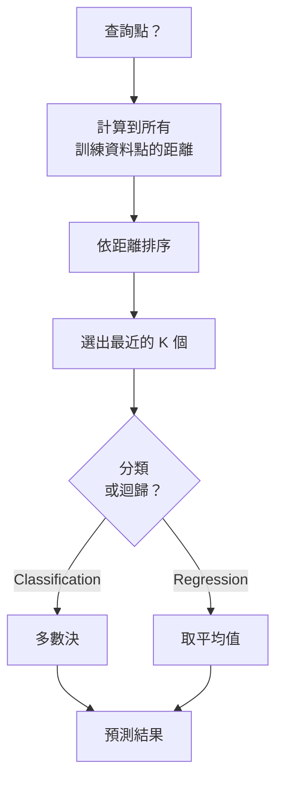
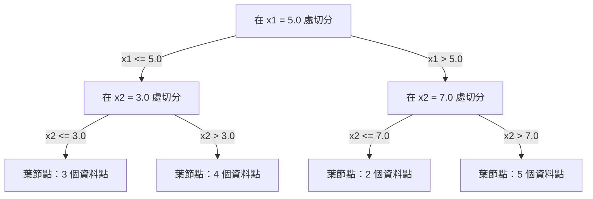

# K 最近鄰法與距離

> 把所有資料都存起來，預測時看看鄰居就好。這是最簡單、也確實有效的演算法（algorithm）。

**Type:** Build
**Language:** Python
**Prerequisites:** Phase 1 (Lesson 14 Norms and Distances)
**Time:** ~90 minutes

## Learning Objectives｜學習目標

- 從頭實作 K 最近鄰法（K-nearest neighbors，KNN）的分類與迴歸，支援設定 K 值與距離加權投票（distance-weighted voting）
- 比較 L1 距離（L1 distance）、L2 距離（L2 distance）、餘弦距離（cosine distance）與 Minkowski 距離（Minkowski distance），並依資料類型選擇合適的距離度量（distance metric）
- 說明維度災難（curse of dimensionality），並展示 KNN 為何在高維空間中效能下降
- 建立 KD-tree 以加速最近鄰搜尋（nearest neighbor search），並分析它在何時比暴力搜尋（brute force search）更快

## The Problem｜問題

手上有一份資料集（dataset），現在來了一個新資料點（data point）。你需要替它分類或預測數值。KNN 不像線性迴歸（linear regression）或支援向量機（support vector machine，SVM）會從資料中學習參數（parameters），而是找出最接近這個新資料點的 K 個訓練資料點，讓它們投票決定結果。

這就是 K 最近鄰法。它沒有訓練階段，也沒有需要學習的參數或需要最小化的損失函數（loss function）。你只要儲存整份訓練集（training set），等到預測時再計算距離。

這聽起來簡單得不像真的有效，但 KNN 在許多問題上意外地有競爭力，特別是資料集規模小到中等時。深入理解 KNN，也能掌握幾個基本概念：距離度量的選擇（連結到第一階段第 14 課）、維度災難，以及惰性學習（lazy learning）和積極式學習（eager learning）的差異。

KNN 也以不同名稱出現在現代 AI 的各個角落。向量資料庫（vector database）會在 embedding 向量上執行 KNN 搜尋；檢索增強生成（retrieval-augmented generation，RAG）會找出距離最近的 K 個文件片段；推薦系統（recommendation system）則會尋找相似的使用者或物品。演算法（algorithm）相同，差別在規模與資料結構。

## The Concept｜核心概念

### KNN 的運作方式

給定一份附有標籤的資料集，以及一個新的查詢點（query point）：

1. 計算查詢點到資料集中每個資料點的距離
2. 依距離排序
3. 選出距離最近的 K 個資料點
4. 分類時：由 K 個鄰居投票，以多數決（majority vote）決定類別
5. 迴歸時：取 K 個鄰居的目標值（target）平均數，或改用加權平均（weighted average）



整個演算法（algorithm）就是這樣：不必擬合模型，也不需要梯度下降法（gradient descent）或訓練週期（epoch）。

### 選擇 K 值

K 是唯一的超參數（hyperparameter），控制偏差－變異取捨（bias-variance tradeoff）：

| K | 行為 |
|---|----------|
| K = 1 | 決策邊界（decision boundary）追隨每個資料點。訓練誤差為零、變異數（variance）高，容易過度擬合（overfitting） |
| K 值小（3–5） | 對局部結構敏感，能捕捉複雜的邊界 |
| K 值大 | 邊界較平滑、較不受雜訊影響，但可能欠擬合（underfitting） |
| K = N | 每個資料點都會被預測為多數類別，偏差（bias）最大 |

常見的起始值是 K = sqrt(N)，其中 N 是資料點數量。二元分類（binary classification）時使用奇數 K，可避免票數平手。


### 距離度量

距離函數（distance function）決定什麼叫「接近」。不同的度量會選出不同鄰居，也會產生不同預測。

**L2 距離（歐幾里得距離；Euclidean distance）** 是預設（default），代表直線距離。

```
d(a, b) = sqrt(sum((a_i - b_i)^2))
```

L2 距離對特徵的數值尺度很敏感。使用 KNN 搭配 L2 距離前，務必先做特徵標準化（feature standardization）。

**L1 距離（曼哈頓距離；Manhattan distance）** 會加總各維度的絕對差值。由於不會將差值平方，它比 L2 對離群值（outlier）更穩健。

```
d(a, b) = sum(|a_i - b_i|)
```

**餘弦距離** 衡量向量之間的夾角，不考慮向量長度。對文字和 embedding 資料不可或缺。

```
d(a, b) = 1 - (a . b) / (||a|| * ||b||)
```

**Minkowski 距離** 以參數 p 推廣 L1 和 L2 距離。

```
d(a, b) = (sum(|a_i - b_i|^p))^(1/p)

p=1: Manhattan
p=2: Euclidean
p->inf: Chebyshev (max absolute difference)
```

適合使用哪種度量，取決於資料類型：

| 資料類型 | 最佳度量 | 原因 |
|-----------|------------|-----|
| 數值特徵，尺度相近 | L2（歐幾里得） | 預設（default），適用於空間資料 |
| 數值特徵，含離群值 | L1（曼哈頓） | 較穩健，不會放大較大的差異 |
| 文字 embedding | 餘弦距離 | 向量長度只是雜訊，方向才代表意義 |
| 高維稀疏資料 | 餘弦距離或 L1 | L2 會受到維度災難影響 |
| 混合型資料 | 自訂距離 | 依特徵類型組合不同度量 |

### 加權 KNN（weighted KNN）

標準 KNN 對 K 個鄰居一視同仁，但距離 0.1 的鄰居理應比距離 5.0 的鄰居更有影響力。

**距離加權 KNN（distance-weighted KNN）** 依鄰居距離的倒數給予權重：

```
weight_i = 1 / (distance_i + epsilon)

For classification: weighted vote
For regression:     weighted average = sum(w_i * y_i) / sum(w_i)
```

ε（epsilon）可避免查詢點與訓練資料點完全相同時出現除以零的情況。

加權 KNN 較不受 K 值選擇影響，因為距離較遠的鄰居無論如何都只會貢獻少量權重。

### 維度災難

KNN 在高維空間中的效能會下降。這不是模糊的疑慮，而是數學上的事實。

**問題 1：距離趨於一致。** 維度增加時，最大距離與最小距離的比值會趨近 1，所有資料點到查詢點的距離都變得差不多。

```
In d dimensions, for random uniform points:

d=2:    max_dist / min_dist = varies widely
d=100:  max_dist / min_dist ~ 1.01
d=1000: max_dist / min_dist ~ 1.001

When all distances are nearly equal, "nearest" is meaningless.
```

**問題 2：體積急遽膨脹。** 若要在固定比例的資料中涵蓋 K 個鄰居，搜尋半徑就得擴大，才能涵蓋特徵空間（feature space）中大得多的一部分。在高維空間裡，「鄰域」會佔據大部分空間。

**問題 3：角落佔主導。** 在 d 維的單位超立方體（unit hypercube）中，大部分體積集中在角落附近，而非中心。隨著 d 增大，內接於立方體的球所佔體積比例會趨近於零。

實務上，特徵數量不超過約 20–50 個時，KNN 通常效果良好。超過這個範圍，套用 KNN 前就需要先降維（dimensionality reduction；例如 PCA、UMAP、t-SNE），或使用能利用資料內在低維結構的樹狀搜尋結構。

### KD-tree：加速最近鄰搜尋

採暴力搜尋的 KNN 會計算查詢點到每個訓練資料點的距離，每次查詢的計算複雜度為 O(n * d)。對大型資料集來說，這太慢了。

KD-tree 會沿著特徵軸遞迴切分空間。每一層都在某個維度上，以中位數（median）值作為切分點。



搜尋最近鄰時，先沿樹走到包含查詢點的葉節點，再回溯；只有相鄰分區可能包含更近的資料點時，才檢查該分區。

低維時，平均查詢時間為 O(log n)。但在高維空間（d > 20）中，KD-tree 的效能會退化到 O(n)，因為回溯搜尋能排除的子樹越來越少。

### Ball tree：更適合中等維度

Ball tree 以巢狀超球面（hypersphere）而非軸對齊方框來切分資料。每個節點定義一個球（中心 + 半徑），涵蓋該子樹中的所有資料點。

相較於 KD-tree，Ball tree 的優點：
- 在中等維度（最多約 50 維）下效果較好
- 能處理非軸對齊的結構
- 包圍體越緊密，搜尋時就能跳過更多子樹

KD-tree 和 Ball tree 都是精確演算法（algorithm）。若需要真正大規模的搜尋（數百萬個資料點、數百個維度），則會改用近似最近鄰（approximate nearest neighbor）方法，例如 HNSW、IVF 和乘積量化（product quantization）。第一階段第 14 課會介紹這些方法。

### 惰性學習與積極式學習

KNN 是惰性學習器（lazy learner）：訓練時不做運算，所有運算都留到預測時才做。多數其他演算法（algorithm）則是積極式學習器（eager learner），例如線性迴歸、SVM 和神經網路（neural network）；這些演算法（algorithm）會在訓練時執行大量運算以建立精簡模型，因此預測速度快。

| 面向 | 惰性學習（KNN） | 積極式學習（SVM、神經網路） |
|--------|------------|------------------------|
| 訓練時間 | O(1)，只儲存資料 | O(n * epochs) |
| 預測時間 | 每次查詢 O(n * d) | O(d) 或 O(parameters) |
| 記憶體（memory） | 儲存整份訓練集 | 只儲存模型參數 |
| 適應新資料 | 立即新增資料點 | 重新訓練模型 |
| 決策邊界 | 隱式，預測時才計算 | 明確，訓練後固定 |

適合採用惰性學習的情況：
- 資料集經常變動（可新增或移除資料點，不必重新訓練）
- 只有極少數查詢需要預測
- 希望訓練時間為零
- 資料集夠小，暴力搜尋仍然很快

### KNN 迴歸（KNN regression）

KNN 迴歸不採用多數決，而是將 K 個鄰居的目標值（target）取平均。

```
prediction = (1/K) * sum(y_i for i in K nearest neighbors)

Or with distance weighting:
prediction = sum(w_i * y_i) / sum(w_i)
where w_i = 1 / distance_i
```

KNN 迴歸產生分段常數（piecewise-constant）預測；加權時則會得到分段平滑（piecewise-smooth）的預測。它無法外插（extrapolation）到訓練資料範圍以外。若訓練目標值（target）都介於 0 到 100，KNN 絕不會預測出 200。

```figure
knn-smoothness
```

## Build It｜動手實作

### 步驟 1：距離函數

實作 L1、L2、餘弦與 Minkowski 距離。這些概念直接連結到第一階段第 14 課。

```python
import math

def l2_distance(a, b):
    return math.sqrt(sum((ai - bi) ** 2 for ai, bi in zip(a, b)))

def l1_distance(a, b):
    return sum(abs(ai - bi) for ai, bi in zip(a, b))

def cosine_distance(a, b):
    dot_val = sum(ai * bi for ai, bi in zip(a, b))
    norm_a = math.sqrt(sum(ai ** 2 for ai in a))
    norm_b = math.sqrt(sum(bi ** 2 for bi in b))
    if norm_a == 0 or norm_b == 0:
        return 1.0
    return 1.0 - dot_val / (norm_a * norm_b)

def minkowski_distance(a, b, p=2):
    if p == float('inf'):
        return max(abs(ai - bi) for ai, bi in zip(a, b))
    return sum(abs(ai - bi) ** p for ai, bi in zip(a, b)) ** (1 / p)
```

### 步驟 2：KNN 分類器與迴歸器

建構完整的 KNN，支援設定 K 值、距離度量，並可選擇啟用距離加權。

```python
class KNN:
    def __init__(self, k=5, distance_fn=l2_distance, weighted=False,
                 task="classification"):
        self.k = k
        self.distance_fn = distance_fn
        self.weighted = weighted
        self.task = task
        self.X_train = None
        self.y_train = None

    def fit(self, X, y):
        self.X_train = X
        self.y_train = y

    def predict(self, X):
        return [self._predict_one(x) for x in X]
```

### 步驟 3：建立 KD-tree 以加速搜尋

從頭建立 KD-tree，依各維度的中位數（median）遞迴切分空間。

```python
class KDTree:
    def __init__(self, X, indices=None, depth=0):
        # Recursively partition the data
        self.axis = depth % len(X[0])
        # Split on median of the current axis
        ...

    def query(self, point, k=1):
        # Traverse to leaf, then backtrack
        ...
```

完整實作、所有輔助方法與示範請見 `code/knn.py`。

### 步驟 4：特徵縮放（feature scaling）

KNN 必須搭配特徵縮放，因為距離容易受特徵數值的量級影響。數值範圍為 0 到 1000 的特徵，會壓過範圍為 0 到 1 的特徵。

```python
def standardize(X):
    n = len(X)
    d = len(X[0])
    means = [sum(X[i][j] for i in range(n)) / n for j in range(d)]
    stds = [
        max(1e-10, (sum((X[i][j] - means[j]) ** 2 for i in range(n)) / n) ** 0.5)
        for j in range(d)
    ]
    return [[((X[i][j] - means[j]) / stds[j]) for j in range(d)] for i in range(n)], means, stds
```

## Use It｜實際應用

使用 scikit-learn：

```python
from sklearn.neighbors import KNeighborsClassifier
from sklearn.preprocessing import StandardScaler
from sklearn.pipeline import Pipeline

clf = Pipeline([
    ("scaler", StandardScaler()),
    ("knn", KNeighborsClassifier(n_neighbors=5, metric="euclidean")),
])
clf.fit(X_train, y_train)
print(f"Accuracy: {clf.score(X_test, y_test):.4f}")
```

資料集夠大且維度夠低時，scikit-learn 會自動使用 KD-tree 或 Ball tree；遇到高維資料時則會退回暴力搜尋。你可以透過 `algorithm` 參數控制此行為。

若要大規模搜尋最近鄰（數百萬個向量），請使用 FAISS、Annoy 或向量資料庫：

```python
import faiss

index = faiss.IndexFlatL2(dimension)
index.add(embeddings)
distances, indices = index.search(query_vectors, k=5)
```

## Exercises｜練習

1. 在含有 3 個類別的二維資料集上實作 KNN 分類。分別繪出 K=1、K=5、K=15 和 K=N 時的決策邊界，觀察模型如何從過度擬合轉為欠擬合。

2. 在 2、5、10、50、100 和 500 維空間中，各產生 1000 個隨機資料點。對每種維度，計算最大成對距離（pairwise distance）與最小成對距離的比值，並繪出比值隨維度變化的圖表，觀察維度災難。

3. 在文字分類（text classification）問題中，使用 TF-IDF 向量比較 KNN 搭配 L1、L2 與餘弦距離的表現。哪種度量的準確率（accuracy）最高？為什麼餘弦距離通常更適合文字？

4. 實作 KD-tree，並針對含 1k、10k 和 100k 個資料點、維度為 2D、10D 和 50D 的資料集，比較 KD-tree 與暴力搜尋的查詢時間。KD-tree 在維度多高時不再比暴力搜尋快？

5. 為 y = sin(x) + noise 建立加權 KNN 迴歸器。將 K=3、10、30 的加權與未加權 KNN 相互比較，展示加權如何讓預測更平滑，尤其是在 K 值較大時。

## Key Terms｜關鍵術語

| 術語 | 實際意義 |
|------|----------------------|
| K 最近鄰法（K-nearest neighbors） | 非參數演算法（non-parametric algorithm），找出距離查詢點最近的 K 個訓練資料點，再據此預測 |
| 惰性學習（lazy learning） | 訓練時不做運算，所有運算都留到預測時才做。KNN 是典型例子 |
| 積極式學習（eager learning） | 訓練時執行大量運算以建立精簡模型。多數機器學習演算法（algorithm）都屬於此類 |
| 維度災難（curse of dimensionality） | 高維空間中的距離會趨於一致，鄰域也會擴大到涵蓋空間的大部分，使 KNN 難以奏效 |
| KD-tree | 沿特徵軸遞迴切分空間的二元樹；在低維空間中，查詢時間為 O(log n) |
| Ball tree | 由巢狀超球面構成的樹；在中等維度（最多約 50 維）下，比 KD-tree 更有效 |
| 加權 KNN（weighted KNN） | 依距離的倒數為鄰居加權；距離越近，對預測的影響越大 |
| 特徵縮放（feature scaling） | 將特徵調整到可比較的數值範圍；KNN 等依賴距離的方法都需要特徵縮放 |
| 多數決（majority vote） | 統計 K 個鄰居中各類別的數量，並以數量最多的類別作為分類結果 |
| 暴力搜尋（brute force search） | 計算查詢點到每個訓練資料點的距離；每次查詢需 O(n*d)，結果精確，但 n 很大時速度較慢 |
| 近似最近鄰（approximate nearest neighbor） | 使用 HNSW、LSH、IVF 等演算法（algorithm）近似搜尋最近鄰，速度遠快於精確搜尋 |
| Voronoi 圖（Voronoi diagram） | 將空間劃分為多個區域，每個區域內的點，離同一個訓練點都比離其他訓練點更近；K=1 的 KNN 會產生 Voronoi 邊界 |

## Further Reading｜延伸閱讀

- [Cover & Hart: Nearest Neighbor Pattern Classification (1967)](https://ieeexplore.ieee.org/document/1053964)——KNN 的奠基論文，證明其錯誤率至多為貝氏最優錯誤率的兩倍
- [Friedman, Bentley, Finkel: An Algorithm for Finding Best Matches in Logarithmic Expected Time (1977)](https://dl.acm.org/doi/10.1145/355744.355745)——KD-tree 的原始論文
- [Beyer et al.: When Is "Nearest Neighbor" Meaningful? (1999)](https://link.springer.com/chapter/10.1007/3-540-49257-7_15)——正式分析最近鄰搜尋中的維度災難
- [scikit-learn Nearest Neighbors documentation](https://scikit-learn.org/stable/modules/neighbors.html)——說明演算法（algorithm）選擇的實用指南
- [FAISS: A Library for Efficient Similarity Search](https://github.com/facebookresearch/faiss)——Meta 提供、可支援十億規模近似最近鄰搜尋的函式庫
