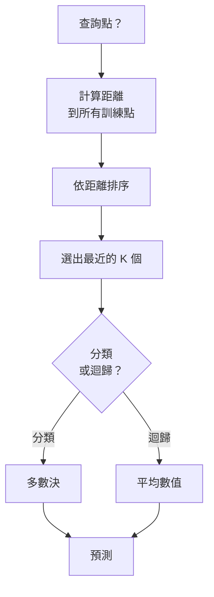
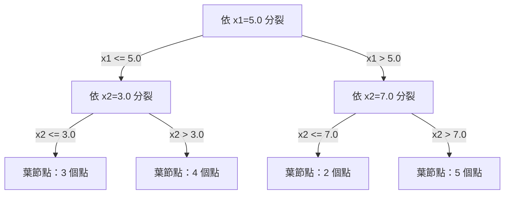

# K 最近鄰與距離

> 把所有資料都存下來，再看鄰居來預測。這是最簡單、卻真的管用的演算法。

**Type:** Build
**Language:** Python
**Prerequisites:** Phase 1 (Lesson 14 Norms and Distances)
**Time:** ~90 minutes

## 學習目標

- 從零實作 KNN 分類與迴歸，並支援自訂 K 值和距離加權投票
- 比較 L1、L2、餘弦和 Minkowski 距離，並依資料型態選擇合適的指標
- 說明維度災難，並展示 KNN 為何會在高維空間中退化
- 建立 KD 樹以有效率地搜尋最近鄰，並分析它何時勝過暴力搜尋

## 問題

你有一份資料集，現在來了一筆新資料。你需要為它分類或預測數值。與線性迴歸或 SVM 等方法從資料中學習參數不同，你只要找出距離新資料最近的 K 筆訓練資料，讓它們投票即可。

這就是 K 最近鄰。它沒有訓練階段，也沒有待學習的參數或待最小化的損失函式。你會儲存整個訓練集，並在預測時才計算距離。

這聽起來簡單得不太可靠，但 KNN 在許多問題上表現出乎意料地好，尤其是中小型資料集。深入理解 KNN，還能認識幾個基本概念：距離指標的選擇（連結到 Phase 01 第 14 課）、維度災難，以及惰性學習與積極學習的差異。

KNN 也以不同名稱出現在現代 AI 的各處。向量資料庫會對嵌入向量執行 KNN 搜尋；檢索增強生成（RAG）會找出最近的 K 個文件區塊；推薦系統會尋找相似的使用者或項目。演算法相同，只是規模和資料結構不同。

## 核心概念

### KNN 的運作方式

給定一組已標記的資料點和新的查詢點：

1. 計算查詢點與資料集中每個點的距離
2. 依距離排序
3. 取出距離最近的 K 個點
4. 分類時：由 K 個鄰居進行多數決
5. 迴歸時：對 K 個鄰居的數值取平均（或加權平均）



演算法就這麼簡單，不需要擬合、梯度下降或 epoch。

### 選擇 K

K 是唯一的超參數，控制偏差與變異之間的取捨：

| K 值 | 行為 |
|------|------|
| K = 1 | 決策邊界會追隨每個資料點；訓練誤差為零，但變異很高，容易過度擬合 |
| K 值小（3–5）| 對局部結構很敏感，能掌握複雜邊界 |
| K 值大 | 邊界較平滑、較能抵抗雜訊，但可能欠擬合 |
| K = N | 每個資料點都預測為多數類別，偏差最大 |

常見的起始值是 K = sqrt(N)，其中 N 是資料點數。二元分類可選奇數 K，避免平手。


### 距離指標

距離函式定義了什麼叫「近」。使用不同的指標會得到不同鄰居，也會產生不同預測。

**L2（歐幾里得距離）**是預設選項，也就是直線距離。

```text
d(a, b) = sqrt(sum((a_i - b_i)^2))
```

它對特徵尺度很敏感。使用 L2 搭配 KNN 前，務必先標準化特徵。

**L1（曼哈頓距離）**會加總各維度的絕對差異。由於不會將差異平方，因此比 L2 更能抵抗離群值。

```text
d(a, b) = sum(|a_i - b_i|)
```

**餘弦距離**衡量向量之間的夾角，不考慮向量長度。對文字和嵌入資料而言很重要。

```text
d(a, b) = 1 - (a . b) / (||a|| * ||b||)
```

**Minkowski 距離**會透過參數 p 泛化 L1 和 L2。

```text
d(a, b) = (sum(|a_i - b_i|^p))^(1/p)

p=1：曼哈頓距離
p=2：歐幾里得距離
p->inf：Chebyshev 距離（最大絕對差）
```

距離指標應依資料型態選擇：

| 資料型態 | 建議指標 | 原因 |
|----------|----------|------|
| 尺度相近的數值特徵 | L2（歐幾里得）| 預設選項，適用於空間資料 |
| 含離群值的數值特徵 | L1（曼哈頓）| 較穩健，不會放大較大的差異 |
| 文字嵌入 | 餘弦距離 | 長度多半是雜訊，方向才代表意義 |
| 高維稀疏資料 | 餘弦或 L1 | L2 會受維度災難影響 |
| 混合型態 | 自訂距離 | 依各特徵型態組合指標 |

### 加權 KNN

標準 KNN 對 K 個鄰居給予相同權重，但距離 0.1 的鄰居應該比距離 5.0 的鄰居更重要。

**距離加權 KNN**會依照距離的倒數來加權每個鄰居：

```text
weight_i = 1 / (distance_i + epsilon)

分類：加權投票
迴歸：             加權平均 = sum(w_i * y_i) / sum(w_i)
```

epsilon 可避免查詢點恰好與訓練點重合時發生除以零。

加權 KNN 對 K 值的選擇比較不敏感，因為距離較遠的鄰居不論如何都只會有很小的貢獻。

### 維度災難

KNN 的效能會隨維度增加而退化。這不是模糊的顧慮，而是數學事實。

**問題 1：距離趨同。** 維度增加時，最大距離與最小距離的比值會趨近 1。所有資料點到查詢點的距離都變得差不多遠。

```text
d 維空間中的均勻隨機點：

d=2：    max_dist / min_dist = 差異很大
d=100：  max_dist / min_dist 約為 1.01
d=1000： max_dist / min_dist 約為 1.001

當所有距離都幾乎相同時，「最近」就失去意義。
```

**問題 2：體積快速膨脹。** 若要在固定比例的資料範圍內找到 K 個鄰居，就必須擴大搜尋半徑，涵蓋更大比例的特徵空間。在高維空間中，「鄰域」會包含大部分空間。

**問題 3：角落占據主要體積。** 在 d 維單位超立方體中，大部分體積集中在角落，而非中心。隨著 d 增加，內接於立方體的球體所占體積比例會趨近於零。

實務上，KNN 在約 20 到 50 個特徵以內通常運作良好。維度更高時，要先用 PCA、UMAP 或 t-SNE 降維，再套用 KNN；或者使用能利用資料內在低維結構的樹狀搜尋法。

### KD 樹：快速搜尋最近鄰

暴力 KNN 會計算查詢點到每個訓練點的距離，每次查詢需要 O(n * d) 時間。資料集很大時，這會太慢。

KD 樹會沿著特徵軸遞迴切分空間。每一層都會選一個維度，並在其中位數處切開。



搜尋最近鄰時，先沿樹走到包含查詢點的葉節點，再回溯；只有當相鄰分區可能包含更近的點時，才檢查該分區。

低維度時，平均查詢時間為 O(log n)。但高維度（d > 20）時，回溯能排除的分支越來越少，KD 樹的查詢時間會退化到 O(n)。

### 球樹：較適合中等維度

球樹會以巢狀超球面，而非與座標軸對齊的方框切分資料。每個節點定義一個球（中心 + 半徑），涵蓋其子樹中的所有點。

相較 KD 樹的優點：
- 在中等維度（最高約 50 維）運作較好
- 能處理與座標軸不對齊的結構
- 更緊密的邊界範圍，讓搜尋期間可剪除更多分支

KD 樹和球樹都是精確演算法。若要進行真正大規模搜尋（數百萬個點、數百個維度），則會改用近似最近鄰方法（HNSW、IVF、乘積量化）。Phase 01 第 14 課會介紹這些方法。

### 惰性學習與積極學習

KNN 是惰性學習器：訓練時不做運算，所有工作都在預測時才進行。其他多數演算法（線性迴歸、SVM、神經網路）則是積極學習器：訓練時會大量計算以建立精簡模型，預測速度因此很快。

| 面向 | 惰性學習（KNN）| 積極學習（SVM、神經網路）|
|------|---------------|---------------------------|
| 訓練時間 | O(1)，只需儲存資料 | O(n * epochs) |
| 預測時間 | 每次查詢 O(n * d) | O(d) 或 O(參數數量) |
| 預測時的記憶體 | 儲存整份訓練資料 | 只儲存模型參數 |
| 適應新資料 | 立即加入資料點 | 重新訓練模型 |
| 決策邊界 | 隱式，預測時才計算 | 明確，訓練後固定 |

以下情況適合使用惰性學習：
- 資料集經常變動（新增或移除資料點即可，不必重新訓練）
- 只需處理少量查詢
- 希望完全免除訓練時間
- 資料集小到能快速暴力搜尋

### 使用 KNN 進行迴歸

KNN 迴歸不採用多數決，而是計算 K 個鄰居目標值的平均數。

```text
prediction = (1/K) * sum(y_i for K 個最近鄰)

或進行距離加權：
prediction = sum(w_i * y_i) / sum(w_i)
其中 w_i = 1 / distance_i
```

KNN 迴歸會產生分段常數預測（使用加權時則為分段平滑預測），無法外插到訓練資料範圍以外。若所有訓練目標都介於 0 到 100，KNN 永遠不會預測 200。

```figure
knn-smoothness
```

## Build It：從零實作

### 步驟 1：距離函式

實作 L1、L2、餘弦和 Minkowski 距離，這些概念直接連結到 Phase 01 第 14 課。

```python
import math

def l2_distance(a, b):
    return math.sqrt(sum((ai - bi) ** 2 for ai, bi in zip(a, b)))

def l1_distance(a, b):
    return sum(abs(ai - bi) for ai, bi in zip(a, b))

def cosine_distance(a, b):
    dot_val = sum(ai * bi for ai, bi in zip(a, b))
    norm_a = math.sqrt(sum(ai ** 2 for ai in a))
    norm_b = math.sqrt(sum(bi ** 2 for bi in b))
    if norm_a == 0 or norm_b == 0:
        return 1.0
    return 1.0 - dot_val / (norm_a * norm_b)

def minkowski_distance(a, b, p=2):
    if p == float('inf'):
        return max(abs(ai - bi) for ai, bi in zip(a, b))
    return sum(abs(ai - bi) ** p for ai, bi in zip(a, b)) ** (1 / p)
```

### 步驟 2：KNN 分類器與迴歸器

建立完整的 KNN，讓使用者可設定 K、距離指標，以及是否進行距離加權。

```python
class KNN:
    def __init__(self, k=5, distance_fn=l2_distance, weighted=False,
                 task="classification"):
        self.k = k
        self.distance_fn = distance_fn
        self.weighted = weighted
        self.task = task
        self.X_train = None
        self.y_train = None

    def fit(self, X, y):
        self.X_train = X
        self.y_train = y

    def predict(self, X):
        return [self._predict_one(x) for x in X]
```

### 步驟 3：用 KD 樹進行有效率搜尋

從零建立 KD 樹，並依各維度的中位數遞迴切分。

```python
class KDTree:
    def __init__(self, X, indices=None, depth=0):
        # Recursively partition the data
        self.axis = depth % len(X[0])
        # Split on median of the current axis
        ...

    def query(self, point, k=1):
        # Traverse to leaf, then backtrack
        ...
```

完整實作、輔助方法和示範請參閱 `code/knn.py`。

### 步驟 4：特徵縮放

KNN 需要縮放特徵，因為距離會受特徵數值大小影響。範圍為 0 到 1000 的特徵會主導範圍為 0 到 1 的特徵。

```python
def standardize(X):
    n = len(X)
    d = len(X[0])
    means = [sum(X[i][j] for i in range(n)) / n for j in range(d)]
    stds = [
        max(1e-10, (sum((X[i][j] - means[j]) ** 2 for i in range(n)) / n) ** 0.5)
        for j in range(d)
    ]
    return [[((X[i][j] - means[j]) / stds[j]) for j in range(d)] for i in range(n)], means, stds
```

## Use It：實際應用

使用 scikit-learn：

```python
from sklearn.neighbors import KNeighborsClassifier
from sklearn.preprocessing import StandardScaler
from sklearn.pipeline import Pipeline

clf = Pipeline([
    ("scaler", StandardScaler()),
    ("knn", KNeighborsClassifier(n_neighbors=5, metric="euclidean")),
])
clf.fit(X_train, y_train)
print(f"Accuracy: {clf.score(X_test, y_test):.4f}")
```

資料集夠大且維度夠低時，scikit-learn 會自動使用 KD 樹或球樹；高維資料則會退回暴力搜尋。你可以透過 `algorithm` 參數控制這項設定。

若要大規模搜尋最近鄰（數百萬個向量），可使用 FAISS、Annoy 或向量資料庫：

```python
import faiss

index = faiss.IndexFlatL2(dimension)
index.add(embeddings)
distances, indices = index.search(query_vectors, k=5)
```

## Exercises：練習

1. 在含 3 個類別的二維資料集上實作 KNN 分類，並繪製 K=1、K=5、K=15 和 K=N 的決策邊界，觀察模型如何從過度擬合轉為欠擬合。

2. 在 2、5、10、50、100 和 500 維空間中，各產生 1000 個隨機點。對每種維度計算最大成對距離與最小成對距離的比值，並繪製比值隨維度變化的圖，呈現維度災難。

3. 使用 TF-IDF 向量，在文字分類問題上比較 KNN 的 L1、L2 和餘弦距離。哪個指標的準確率最高？為什麼餘弦距離在文字資料上通常效果最好？

4. 實作 KD 樹，並測量它與暴力搜尋處理 2D、10D 和 50D 中 1k、10k 和 100k 點資料集的查詢時間。維度增加到多少時，KD 樹不再比暴力搜尋快？

5. 為 y = sin(x) + noise 建立加權 KNN 迴歸器，並比較 K=3、10、30 時的未加權 KNN。展示加權方法如何產生更平滑的預測，尤其是 K 值較大時。

## 關鍵詞

| 術語 | 實際意義 |
|------|----------|
| K 最近鄰 | 非參數式演算法，透過尋找距離查詢點最近的 K 個訓練點來預測 |
| 惰性學習 | 訓練時不進行計算，所有運算都在預測時執行；KNN 是典型例子 |
| 積極學習 | 訓練時大量計算以建立精簡模型，多數機器學習演算法都屬於此類 |
| 維度災難 | 高維空間中距離會趨同、鄰域會擴大並涵蓋大部分空間，使 KNN 失效 |
| KD 樹 | 沿特徵軸遞迴切分空間的二元樹；低維度時查詢時間為 O(log n) |
| 球樹 | 由巢狀超球面組成的樹；中等維度（最高約 50 維）時比 KD 樹更有效 |
| 加權 KNN | 按距離倒數加權鄰居，距離較近的鄰居對預測影響較大 |
| 特徵縮放 | 將特徵調整至相近範圍，KNN 等距離式方法的必要前處理 |
| 多數決 | 依 K 個鄰居中最常見的類別來分類 |
| 暴力搜尋 | 計算查詢點與每個訓練點的距離；每次查詢 O(n*d)，結果精確但大資料集時很慢 |
| 近似最近鄰 | HNSW、LSH、IVF 等方法，可比精確搜尋更快地找出近似最近的點 |
| Voronoi 圖 | 將空間分成多個區域，每個區域包含距某個訓練點比其他點更近的位置；K=1 的 KNN 會產生 Voronoi 邊界 |

## 延伸閱讀

- [Cover 與 Hart：〈Nearest Neighbor Pattern Classification〉（1967）](https://ieeexplore.ieee.org/document/1053964)：奠定 KNN 理論的論文，證明它的錯誤率至多為貝氏最佳錯誤率的兩倍
- [Friedman、Bentley、Finkel：〈An Algorithm for Finding Best Matches in Logarithmic Expected Time〉（1977）](https://dl.acm.org/doi/10.1145/355744.355745)：KD 樹原始論文
- [Beyer 等人：〈When Is “Nearest Neighbor” Meaningful?〉（1999）](https://link.springer.com/chapter/10.1007/3-540-49257-7_15)：正式分析最近鄰搜尋中的維度災難
- [scikit-learn 最近鄰文件](https://scikit-learn.org/stable/modules/neighbors.html)：含演算法選擇建議的實用指南
- [FAISS：高效率相似度搜尋函式庫](https://github.com/facebookresearch/faiss)：Meta 提供、可處理十億級近似最近鄰搜尋的函式庫
