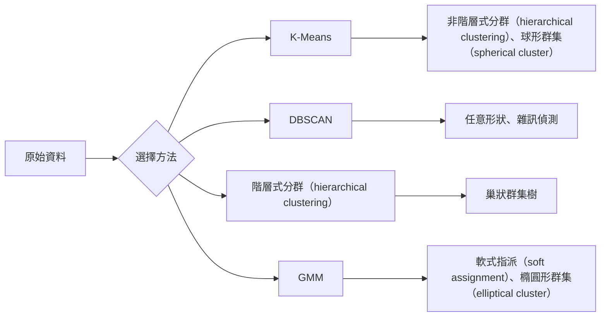

# 非監督式學習（unsupervised learning）

> 沒有標籤（label），也沒有老師；演算法（algorithm）自行找出資料中的結構。

**Type:** Build
**Languages:** Python
**Prerequisites:** Phase 1 (Norms & Distances, Probability & Distributions), Phase 2 Lessons 1-6
**Time:** ~90 minutes

## Learning Objectives｜學習目標

- 從頭實作 K-Means、DBSCAN 和高斯混合模型（Gaussian Mixture Model，GMM），並比較它們的分群（clustering）行為
- 使用輪廓分數（silhouette score）評估分群品質，並以手肘法（elbow method）選出最佳 K 值
- 說明何時 DBSCAN 優於 K-Means，並辨識哪些演算法能處理非球形群集（non-spherical cluster）和離群值（outlier）
- 使用分群方法建立異常偵測（anomaly detection）管線（pipeline），標記偏離正常模式的資料點（data point）

## The Problem｜問題

到目前為止，每堂機器學習（ML）課都假設資料已有標籤：「這是輸入，這是正確輸出。」但在現實世界中，取得標籤的成本很高。醫院有數百萬筆病歷，卻沒有人手動替每筆資料標上疾病類別；電商網站有數百萬筆使用者工作階段，卻沒有人逐一標註客群；資安團隊有網路紀錄，也沒有人標記出每一筆異常。

非監督式學習不需要先指定要尋找什麼，就能從資料中找出模式。它會將相似的資料點分群、發掘隱藏結構，並找出異常。如果說監督式學習（supervised learning）像是讀一本附有解答的教科書，非監督式學習就像是仔細檢視原始資料，直到模式自行浮現。

問題在於：沒有標籤，就無法直接判斷結果「對」或「錯」。你需要用其他工具評估演算法找到的結構是否有意義。

## The Concept｜核心概念

### 分群：將相似事物歸在一起

分群會將每個資料點指派到一個群集，讓同一群集內的資料點彼此之間，比與其他群集的資料點更相似。關鍵問題始終是：「相似」代表什麼？



### K-Means：主力演算法

K-Means 會將資料分成恰好 K 個群集。每個群集都有一個質心（centroid，也就是群集的質量中心），每個資料點都會指派到最近質心所屬的群集。

Lloyd 演算法（Lloyd's algorithm）：

1. 隨機選取 K 個資料點作為初始質心
2. 將每個資料點指派給最近的質心
3. 以指派給各群集的資料點平均數（mean）重新計算質心
4. 重複步驟 2–3，直到指派結果不再改變

慣性（inertia）是 K-Means 的目標函數（objective function）值，代表所有資料點到其所屬質心的平方距離總和。K-Means 會最小化這個值，但只能找到局部最小值（local minimum）。不同的初始化（initialization）可能產生不同結果。

### 選擇 K 值

標準方法有兩種：

**手肘法：** 分別以 K = 1、2、3、…、n 執行 K-Means，繪出慣性隨 K 變化的圖表，找出增加群集數後慣性不再明顯下降的「手肘」位置。

**輪廓分數：** 對每個資料點，計算它到所屬群集其他資料點的平均距離（a），以及到最近其他群集各資料點的平均距離（b）。輪廓係數（silhouette coefficient）為 (b - a) / max(a, b)，範圍從 -1（分錯群）到 +1（分群良好）。將所有資料點的係數取平均，得到整體輪廓分數。

### DBSCAN：密度（density）式分群（density-based clustering）

K-Means 假設群集呈球形，且要求事先指定 K 值。DBSCAN 不作這兩項假設，而是在高密度（density）區域之間以低密度（density）區域為界，找出群集。

DBSCAN 有兩個參數（parameter）：
- **eps**：鄰域半徑（neighborhood radius）
- **min_samples**：形成高密度（density）區域所需的最少資料點數

資料點分為三種類型：
- **核心點（core point）**：eps 鄰域內至少有 min_samples 個資料點
- **邊界點（border point）**：位於核心點 eps 鄰域內，但自身不是核心點
- **雜訊點（noise point）**：既不是核心點，也不是邊界點；這些都是離群值。

DBSCAN 會將彼此距離在 eps 以內的核心點連成同一個群集。邊界點會加入附近核心點所屬的群集；雜訊點則不屬於任何群集。

優點：能找出任何形狀的群集、自動決定群集數量，也能辨識離群值。缺點：難以處理密度（density）不同的群集。

### 階層式分群（hierarchical clustering）

建立一棵呈現巢狀群集關係的樹狀圖（dendrogram）。

凝聚式分群（agglomerative clustering；由下而上）：
1. 一開始將每個資料點各自視為一個群集
2. 合併距離最近的兩個群集
3. 重複合併，直到只剩一個群集
4. 在樹狀圖的適當高度切割，取得 K 個群集

群集之間的「接近程度」可用連結法（linkage）衡量：
- **單一連結法（single linkage）**：兩個群集中任意資料點配對後的最小距離
- **完全連結法（complete linkage）**：任意兩個資料點配對後的最大距離
- **平均連結法（average linkage）**：所有資料點配對距離的平均值
- **Ward 法（Ward's method）**：選擇使群內變異數（within-cluster variance）總增量最小的合併方式

### 高斯混合模型（Gaussian Mixture Model，GMM）

K-Means 採用硬式指派（hard assignment）：每個資料點只屬於一個群集。GMM 採用軟式指派：每個資料點都有屬於各群集的機率（probability）。

GMM 假設資料是由 K 個常態分布（Gaussian distribution）混合生成，每個分布都有自己的平均數和共變異數（covariance）。期望最大化演算法（expectation-maximization algorithm，EM algorithm）會交替執行：

- **E 步驟（E-step）**：計算每個資料點屬於各常態分布的機率
- **M 步驟（M-step）**：更新各常態分布的平均數、共變異數和混合權重（mixing weight），以最大化資料概似（likelihood）

GMM 能表示橢圓形群集（不只像 K-Means 一樣處理球形群集），也能自然處理重疊群集（overlapping cluster）。

### 如何選擇分群方法

| 方法 | 適用情況 | 避免使用的情況 |
|--------|----------|------------|
| K-Means | 大型資料集（dataset）、球形群集、已知 K 值 | 形狀不規則或含有離群值 |
| DBSCAN | K 值未知、形狀任意、需要偵測離群值 | 密度（density）不同或維度（dimension）非常高 |
| 階層式分群（hierarchical clustering） | 小型資料集、需要樹狀圖、K 值未知 | 大型資料集（記憶體（memory）用量為 O(n^2)） |
| GMM | 群集重疊、需要軟式指派 | 資料集極大或維度太多 |

### 以分群偵測異常

分群方法也能自然地用於異常偵測：
- **K-Means**：遠離所有質心的資料點就是異常
- **DBSCAN**：依定義，雜訊點就是異常
- **GMM**：在所有常態分布下機率都很低的資料點就是異常

```figure
kmeans-step
```

## Build It｜動手實作

### 步驟 1：從頭實作 K-Means

```python
import math
import random


def euclidean_distance(a, b):
    return math.sqrt(sum((ai - bi) ** 2 for ai, bi in zip(a, b)))


def kmeans(data, k, max_iterations=100, seed=42):
    random.seed(seed)
    n_features = len(data[0])

    centroids = random.sample(data, k)

    for iteration in range(max_iterations):
        clusters = [[] for _ in range(k)]
        assignments = []

        for point in data:
            distances = [euclidean_distance(point, c) for c in centroids]
            nearest = distances.index(min(distances))
            clusters[nearest].append(point)
            assignments.append(nearest)

        new_centroids = []
        for cluster in clusters:
            if len(cluster) == 0:
                new_centroids.append(random.choice(data))
                continue
            centroid = [
                sum(point[j] for point in cluster) / len(cluster)
                for j in range(n_features)
            ]
            new_centroids.append(centroid)

        if all(
            euclidean_distance(old, new) < 1e-6
            for old, new in zip(centroids, new_centroids)
        ):
            print(f"  Converged at iteration {iteration + 1}")
            break

        centroids = new_centroids

    return assignments, centroids
```

### 步驟 2：手肘法與輪廓分數

```python
def compute_inertia(data, assignments, centroids):
    total = 0.0
    for point, cluster_id in zip(data, assignments):
        total += euclidean_distance(point, centroids[cluster_id]) ** 2
    return total


def silhouette_score(data, assignments):
    n = len(data)
    if n < 2:
        return 0.0

    clusters = {}
    for i, c in enumerate(assignments):
        clusters.setdefault(c, []).append(i)

    if len(clusters) < 2:
        return 0.0

    scores = []
    for i in range(n):
        own_cluster = assignments[i]
        own_members = [j for j in clusters[own_cluster] if j != i]

        if len(own_members) == 0:
            scores.append(0.0)
            continue

        a = sum(euclidean_distance(data[i], data[j]) for j in own_members) / len(own_members)

        b = float("inf")
        for cluster_id, members in clusters.items():
            if cluster_id == own_cluster:
                continue
            avg_dist = sum(euclidean_distance(data[i], data[j]) for j in members) / len(members)
            b = min(b, avg_dist)

        if max(a, b) == 0:
            scores.append(0.0)
        else:
            scores.append((b - a) / max(a, b))

    return sum(scores) / len(scores)


def find_best_k(data, max_k=10):
    print("Elbow method:")
    inertias = []
    for k in range(1, max_k + 1):
        assignments, centroids = kmeans(data, k)
        inertia = compute_inertia(data, assignments, centroids)
        inertias.append(inertia)
        print(f"  K={k}: inertia={inertia:.2f}")

    print("\nSilhouette scores:")
    for k in range(2, max_k + 1):
        assignments, centroids = kmeans(data, k)
        score = silhouette_score(data, assignments)
        print(f"  K={k}: silhouette={score:.4f}")

    return inertias
```

### 步驟 3：從頭實作 DBSCAN

```python
def dbscan(data, eps, min_samples):
    n = len(data)
    labels = [-1] * n
    cluster_id = 0

    def region_query(point_idx):
        neighbors = []
        for i in range(n):
            if euclidean_distance(data[point_idx], data[i]) <= eps:
                neighbors.append(i)
        return neighbors

    visited = [False] * n

    for i in range(n):
        if visited[i]:
            continue
        visited[i] = True

        neighbors = region_query(i)

        if len(neighbors) < min_samples:
            labels[i] = -1
            continue

        labels[i] = cluster_id
        seed_set = list(neighbors)
        seed_set.remove(i)

        j = 0
        while j < len(seed_set):
            q = seed_set[j]

            if not visited[q]:
                visited[q] = True
                q_neighbors = region_query(q)
                if len(q_neighbors) >= min_samples:
                    for nb in q_neighbors:
                        if nb not in seed_set:
                            seed_set.append(nb)

            if labels[q] == -1:
                labels[q] = cluster_id

            j += 1

        cluster_id += 1

    return labels
```

### 步驟 4：高斯混合模型（EM 演算法）

```python
def gmm(data, k, max_iterations=100, seed=42):
    random.seed(seed)
    n = len(data)
    d = len(data[0])

    indices = random.sample(range(n), k)
    means = [list(data[i]) for i in indices]
    variances = [1.0] * k
    weights = [1.0 / k] * k

    def gaussian_pdf(x, mean, variance):
        d = len(x)
        coeff = 1.0 / ((2 * math.pi * variance) ** (d / 2))
        exponent = -sum((xi - mi) ** 2 for xi, mi in zip(x, mean)) / (2 * variance)
        return coeff * math.exp(max(exponent, -500))

    for iteration in range(max_iterations):
        responsibilities = []
        for i in range(n):
            probs = []
            for j in range(k):
                probs.append(weights[j] * gaussian_pdf(data[i], means[j], variances[j]))
            total = sum(probs)
            if total == 0:
                total = 1e-300
            responsibilities.append([p / total for p in probs])

        old_means = [list(m) for m in means]

        for j in range(k):
            r_sum = sum(responsibilities[i][j] for i in range(n))
            if r_sum < 1e-10:
                continue

            weights[j] = r_sum / n

            for dim in range(d):
                means[j][dim] = sum(
                    responsibilities[i][j] * data[i][dim] for i in range(n)
                ) / r_sum

            variances[j] = sum(
                responsibilities[i][j]
                * sum((data[i][dim] - means[j][dim]) ** 2 for dim in range(d))
                for i in range(n)
            ) / (r_sum * d)
            variances[j] = max(variances[j], 1e-6)

        shift = sum(
            euclidean_distance(old_means[j], means[j]) for j in range(k)
        )
        if shift < 1e-6:
            print(f"  GMM converged at iteration {iteration + 1}")
            break

    assignments = []
    for i in range(n):
        assignments.append(responsibilities[i].index(max(responsibilities[i])))

    return assignments, means, weights, responsibilities
```

### 步驟 5：產生測試資料（test data）並執行所有方法

```python
def make_blobs(centers, n_per_cluster=50, spread=0.5, seed=42):
    random.seed(seed)
    data = []
    true_labels = []
    for label, (cx, cy) in enumerate(centers):
        for _ in range(n_per_cluster):
            x = cx + random.gauss(0, spread)
            y = cy + random.gauss(0, spread)
            data.append([x, y])
            true_labels.append(label)
    return data, true_labels


def make_moons(n_samples=200, noise=0.1, seed=42):
    random.seed(seed)
    data = []
    labels = []
    n_half = n_samples // 2
    for i in range(n_half):
        angle = math.pi * i / n_half
        x = math.cos(angle) + random.gauss(0, noise)
        y = math.sin(angle) + random.gauss(0, noise)
        data.append([x, y])
        labels.append(0)
    for i in range(n_half):
        angle = math.pi * i / n_half
        x = 1 - math.cos(angle) + random.gauss(0, noise)
        y = 1 - math.sin(angle) - 0.5 + random.gauss(0, noise)
        data.append([x, y])
        labels.append(1)
    return data, labels


if __name__ == "__main__":
    centers = [[2, 2], [8, 3], [5, 8]]
    data, true_labels = make_blobs(centers, n_per_cluster=50, spread=0.8)

    print("=== K-Means on 3 blobs ===")
    assignments, centroids = kmeans(data, k=3)
    print(f"  Centroids: {[[round(c, 2) for c in cent] for cent in centroids]}")
    sil = silhouette_score(data, assignments)
    print(f"  Silhouette score: {sil:.4f}")

    print("\n=== Elbow Method ===")
    find_best_k(data, max_k=6)

    print("\n=== DBSCAN on 3 blobs ===")
    db_labels = dbscan(data, eps=1.5, min_samples=5)
    n_clusters = len(set(db_labels) - {-1})
    n_noise = db_labels.count(-1)
    print(f"  Found {n_clusters} clusters, {n_noise} noise points")

    print("\n=== GMM on 3 blobs ===")
    gmm_assignments, gmm_means, gmm_weights, _ = gmm(data, k=3)
    print(f"  Means: {[[round(m, 2) for m in mean] for mean in gmm_means]}")
    print(f"  Weights: {[round(w, 3) for w in gmm_weights]}")
    gmm_sil = silhouette_score(data, gmm_assignments)
    print(f"  Silhouette score: {gmm_sil:.4f}")

    print("\n=== DBSCAN on moons (non-spherical clusters) ===")
    moon_data, moon_labels = make_moons(n_samples=200, noise=0.1)
    moon_db = dbscan(moon_data, eps=0.3, min_samples=5)
    n_moon_clusters = len(set(moon_db) - {-1})
    n_moon_noise = moon_db.count(-1)
    print(f"  Found {n_moon_clusters} clusters, {n_moon_noise} noise points")

    print("\n=== K-Means on moons (will fail to separate) ===")
    moon_km, moon_centroids = kmeans(moon_data, k=2)
    moon_sil = silhouette_score(moon_data, moon_km)
    print(f"  Silhouette score: {moon_sil:.4f}")
    print("  K-Means splits moons poorly because they are not spherical")

    print("\n=== Anomaly detection with DBSCAN ===")
    anomaly_data = list(data)
    anomaly_data.append([20.0, 20.0])
    anomaly_data.append([-5.0, -5.0])
    anomaly_data.append([15.0, 0.0])
    anomaly_labels = dbscan(anomaly_data, eps=1.5, min_samples=5)
    anomalies = [
        anomaly_data[i]
        for i in range(len(anomaly_labels))
        if anomaly_labels[i] == -1
    ]
    print(f"  Detected {len(anomalies)} anomalies")
    for a in anomalies[-3:]:
        print(f"    Point {[round(v, 2) for v in a]}")
```

## Use It｜實際應用

使用 scikit-learn，只要一行程式碼就能執行相同的演算法：

```python
from sklearn.cluster import KMeans, DBSCAN, AgglomerativeClustering
from sklearn.mixture import GaussianMixture
from sklearn.metrics import silhouette_score as sklearn_silhouette

km = KMeans(n_clusters=3, random_state=42).fit(data)
db = DBSCAN(eps=1.5, min_samples=5).fit(data)
agg = AgglomerativeClustering(n_clusters=3).fit(data)
gmm_model = GaussianMixture(n_components=3, random_state=42).fit(data)
```

從頭實作的版本能清楚呈現這些函式庫（library）實際執行的運算。K-Means 反覆指派資料點並重新計算質心；DBSCAN 從高密度（density）的起始點逐步擴展群集；GMM 則在 E 步驟與 M 步驟間交替。函式庫版本加入數值穩定性（numerical stability）、更聰明的初始化方式（K-Means++）和 GPU 加速，但核心邏輯相同。

## Ship It｜交付成果

本課從頭實作了 K-Means、DBSCAN 和 GMM，可直接執行。這些分群程式碼也能作為進階非監督式方法的基礎。

## Exercises｜練習

1. 實作 K-Means++ 初始化：不要隨機挑選所有質心；先隨機選第一個，之後每個質心被選中的機率，與它到最近既有質心的距離平方成正比。比較這種方法與隨機初始化的收斂速度（convergence speed）。
2. 在程式中加入凝聚式階層分群，實作 Ward 法，並產生樹狀圖（以巢狀合併清單表示）。在不同高度切割樹狀圖，再與 K-Means 結果比較。
3. 建立簡單的異常偵測管線（pipeline）：對相同資料分別執行 DBSCAN 和 GMM，標記兩種方法都判定為離群值的資料點（DBSCAN 中的雜訊點、GMM 中機率很低的點）。計算兩種方法判定結果的重疊程度，並討論它們何時會有不同判斷。

## Key Terms｜關鍵術語

| 術語 | 常見說法 | 實際意義 |
|------|----------------|----------------------|
| 分群（clustering） | 「把相似的事物分在一起」 | 將資料分成多個子集，並以特定距離度量（distance metric）衡量群內相似度是否高於群間相似度 |
| 質心（centroid） | 「群集的中心」 | 指派到某個群集的所有資料點之平均位置；K-Means 以此代表該群集 |
| 慣性（inertia） | 「群集有多緊密」 | 每個資料點到其所屬質心的平方距離總和；數值越低，群集越緊密 |
| 輪廓分數（silhouette score） | 「群集分隔得多好」 | 對每個資料點計算 (b - a) / max(a, b)，其中 a 是群內平均距離，b 是到最近群集的平均距離 |
| 核心點（core point） | 「位於高密度（density）區域的資料點」 | 在 DBSCAN 中，eps 鄰域內至少有 min_samples 個鄰居的資料點 |
| 期望最大化演算法（EM algorithm） | 「軟式 K-Means」 | 期望最大化演算法：反覆計算隸屬機率（E 步驟），並更新分布參數（M 步驟） |
| 樹狀圖（dendrogram） | 「群集樹」 | 顯示階層式分群（hierarchical clustering）中群集合併順序與距離的樹狀圖 |
| 異常（anomaly） | 「離群值」 | 不符合預期模式的資料點；DBSCAN 會將其辨識為雜訊點，GMM 則會給予低機率 |

## Further Reading｜延伸閱讀

- [Stanford CS229 - Unsupervised Learning](https://cs229.stanford.edu/notes2022fall/main_notes.pdf)——Andrew Ng 的分群與 EM 演算法課堂筆記
- [scikit-learn Clustering Guide](https://scikit-learn.org/stable/modules/clustering.html)——透過視覺範例實際比較各種分群演算法的指南
- [DBSCAN original paper (Ester et al., 1996)](https://www.aaai.org/Papers/KDD/1996/KDD96-037.pdf)——提出密度（density）式分群的原始論文
