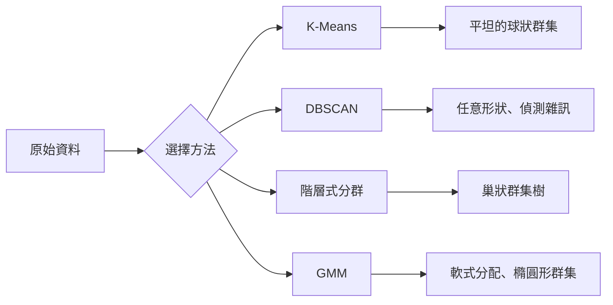

# 非監督式學習

> 沒有標籤，也沒有老師。演算法會自行找出結構。

**Type:** Build
**Languages:** Python
**Prerequisites:** Phase 1 (Norms & Distances, Probability & Distributions), Phase 2 Lessons 1-6
**Time:** ~90 minutes

## 學習目標

- 從零實作 K-Means、DBSCAN 和高斯混合模型，並比較它們的分群方式
- 使用 silhouette 分數評估群集品質，並以肘部法選擇最佳 K 值
- 說明 DBSCAN 何時優於 K-Means，以及哪種演算法適用於非球狀群集和離群值
- 建立分群異常偵測流程，找出偏離正常模式的資料點

## 問題

到目前為止的每堂機器學習課都假設資料已有標籤：「這是輸入，這是正確輸出。」但在真實世界中，標記資料的成本很高。醫院有數百萬筆病患紀錄，卻沒有人逐筆標記疾病類別；電商網站有數百萬個使用者工作階段，卻沒有人手動標記顧客分群；資安團隊有網路紀錄，卻沒有人逐一標示所有異常。

非監督式學習不需要事先指定要尋找什麼模式，就能從資料中發現模式、將相似資料點分群、找出隱藏結構並呈現異常。如果監督式學習像是看著附有解答的教科書學習，非監督式學習就像盯著原始資料，直到模式自己浮現。

但沒有標籤，就無法直接判斷結果「對」或「錯」。你需要不同工具，評估演算法找到的結構是否有意義。

## 核心概念

### 分群：將相似事物放在一起

分群會將每個資料點分配到某個群集，讓同一群集內的點彼此較相似，而與其他群集的點較不相似。關鍵問題始終是：「相似」到底如何定義？



### K-Means：主力方法

K-Means 會將資料分成剛好 K 個群集。每個群集都有一個質心（重心），每個資料點都會分配給距離最近的質心。

Lloyd 演算法如下：

1. 隨機選出 K 個點作為初始質心
2. 將每個資料點分配給最近的質心
3. 重新計算每個質心，取其所屬資料點的平均值
4. 重複步驟 2–3，直到分配結果不再改變

目標函式 inertia 衡量每個點到所屬質心的平方距離總和。K-Means 會將它最小化，但只能找到局部最小值。不同的初始化方式可能產生不同結果。

### 選擇 K 值

有兩種標準方法：

**肘部法：** 以 K = 1、2、3、...、n 執行 K-Means，繪製 inertia 隨 K 值變化的曲線，找出增加群集數量後 inertia 不再明顯下降的「肘點」。

**Silhouette 分數：** 對每個點，比較它與所屬群集的相似度 (a) 及與最近其他群集的相似度 (b)。Silhouette 係數為 (b - a) / max(a, b)，範圍從 -1（分錯群）到 +1（分群良好）。對所有點取平均，就得到整體分數。

### DBSCAN：以密度為基礎的分群

K-Means 假設群集是球狀，且要求事先選擇 K 值。DBSCAN 不需要這兩項假設，而是找出被稀疏區域隔開的高密度區域，作為群集。

兩個參數：
- **eps：** 鄰域半徑
- **min_samples：** 形成高密度區域所需的最少點數

資料點分成三種類型：
- **核心點：** eps 距離內至少有 min_samples 個點
- **邊界點：** 位於核心點的 eps 距離內，但自身不是核心點
- **雜訊點：** 既不是核心點也不是邊界點，也就是離群值

DBSCAN 會將 eps 距離內的核心點連成同一個群集。邊界點會加入附近核心點所屬的群集；雜訊點則不屬於任何群集。

優點：能找出任意形狀的群集、自動決定群集數量並辨識離群值。缺點：難以處理密度各異的群集。

### 階層式分群

階層式分群會建立一棵由巢狀群集組成的樹，稱為樹狀圖（dendrogram）。

凝聚式分群（由下而上）：
1. 將每個點視為自己的群集
2. 合併距離最近的兩個群集
3. 重複合併，直到只剩一個群集
4. 在樹狀圖的指定層級切割，取得 K 個群集

群集之間的「距離」可依照以下方式測量：
- **單一連結：** 兩個群集中任意兩點之間的最小距離
- **完全連結：** 兩個群集中任意兩點之間的最大距離
- **平均連結：** 所有點對之間距離的平均值
- **Ward 方法：** 選擇合併後群內總變異數增加最少的兩個群集

### 高斯混合模型（GMM）

K-Means 會進行硬式分配：每個點只屬於一個群集。GMM 則採用軟式分配：每個點都有屬於各群集的機率。

GMM 假設資料來自 K 個高斯分布的混合，每個分布各自有平均數和共變異數。期望最大化（EM）演算法會交替執行：

- **E 步驟：** 計算每個點屬於各個高斯分布的機率
- **M 步驟：** 更新各高斯分布的平均數、共變異數和混合權重，使資料概似最大化

GMM 能建立橢圓形群集（而非像 K-Means 只處理球狀群集），也能自然處理彼此重疊的群集。

### 如何選擇分群方法

| 方法 | 適用情況 | 不適用情況 |
|------|----------|------------|
| K-Means | 大型資料集、球狀群集、已知 K 值 | 不規則形狀、有離群值 |
| DBSCAN | K 值未知、任意形狀、需要偵測離群值 | 密度不同、維度非常高 |
| 階層式分群 | 小型資料集、需要樹狀圖、K 值未知 | 大型資料集（記憶體 O(n²)）|
| GMM | 群集重疊、需要軟式分配 | 極大型資料集、維度過多 |

### 使用分群進行異常偵測

分群也能自然地支援異常偵測：
- **K-Means：** 距離所有質心都很遠的點是異常
- **DBSCAN：** 雜訊點定義上就是異常
- **GMM：** 在所有高斯分布下機率都很低的點是異常

```figure
kmeans-step
```

## Build It：從零實作

### 步驟 1：從零實作 K-Means

```python
import math
import random


def euclidean_distance(a, b):
    return math.sqrt(sum((ai - bi) ** 2 for ai, bi in zip(a, b)))


def kmeans(data, k, max_iterations=100, seed=42):
    random.seed(seed)
    n_features = len(data[0])

    centroids = random.sample(data, k)

    for iteration in range(max_iterations):
        clusters = [[] for _ in range(k)]
        assignments = []

        for point in data:
            distances = [euclidean_distance(point, c) for c in centroids]
            nearest = distances.index(min(distances))
            clusters[nearest].append(point)
            assignments.append(nearest)

        new_centroids = []
        for cluster in clusters:
            if len(cluster) == 0:
                new_centroids.append(random.choice(data))
                continue
            centroid = [
                sum(point[j] for point in cluster) / len(cluster)
                for j in range(n_features)
            ]
            new_centroids.append(centroid)

        if all(
            euclidean_distance(old, new) < 1e-6
            for old, new in zip(centroids, new_centroids)
        ):
            print(f"  Converged at iteration {iteration + 1}")
            break

        centroids = new_centroids

    return assignments, centroids
```

### 步驟 2：肘部法與 Silhouette 分數

```python
def compute_inertia(data, assignments, centroids):
    total = 0.0
    for point, cluster_id in zip(data, assignments):
        total += euclidean_distance(point, centroids[cluster_id]) ** 2
    return total


def silhouette_score(data, assignments):
    n = len(data)
    if n < 2:
        return 0.0

    clusters = {}
    for i, c in enumerate(assignments):
        clusters.setdefault(c, []).append(i)

    if len(clusters) < 2:
        return 0.0

    scores = []
    for i in range(n):
        own_cluster = assignments[i]
        own_members = [j for j in clusters[own_cluster] if j != i]

        if len(own_members) == 0:
            scores.append(0.0)
            continue

        a = sum(euclidean_distance(data[i], data[j]) for j in own_members) / len(own_members)

        b = float("inf")
        for cluster_id, members in clusters.items():
            if cluster_id == own_cluster:
                continue
            avg_dist = sum(euclidean_distance(data[i], data[j]) for j in members) / len(members)
            b = min(b, avg_dist)

        if max(a, b) == 0:
            scores.append(0.0)
        else:
            scores.append((b - a) / max(a, b))

    return sum(scores) / len(scores)


def find_best_k(data, max_k=10):
    print("Elbow method:")
    inertias = []
    for k in range(1, max_k + 1):
        assignments, centroids = kmeans(data, k)
        inertia = compute_inertia(data, assignments, centroids)
        inertias.append(inertia)
        print(f"  K={k}: inertia={inertia:.2f}")

    print("\nSilhouette scores:")
    for k in range(2, max_k + 1):
        assignments, centroids = kmeans(data, k)
        score = silhouette_score(data, assignments)
        print(f"  K={k}: silhouette={score:.4f}")

    return inertias
```

### 步驟 3：從零實作 DBSCAN

```python
def dbscan(data, eps, min_samples):
    n = len(data)
    labels = [-1] * n
    cluster_id = 0

    def region_query(point_idx):
        neighbors = []
        for i in range(n):
            if euclidean_distance(data[point_idx], data[i]) <= eps:
                neighbors.append(i)
        return neighbors

    visited = [False] * n

    for i in range(n):
        if visited[i]:
            continue
        visited[i] = True

        neighbors = region_query(i)

        if len(neighbors) < min_samples:
            labels[i] = -1
            continue

        labels[i] = cluster_id
        seed_set = list(neighbors)
        seed_set.remove(i)

        j = 0
        while j < len(seed_set):
            q = seed_set[j]

            if not visited[q]:
                visited[q] = True
                q_neighbors = region_query(q)
                if len(q_neighbors) >= min_samples:
                    for nb in q_neighbors:
                        if nb not in seed_set:
                            seed_set.append(nb)

            if labels[q] == -1:
                labels[q] = cluster_id

            j += 1

        cluster_id += 1

    return labels
```

### 步驟 4：高斯混合模型（EM 演算法）

```python
def gmm(data, k, max_iterations=100, seed=42):
    random.seed(seed)
    n = len(data)
    d = len(data[0])

    indices = random.sample(range(n), k)
    means = [list(data[i]) for i in indices]
    variances = [1.0] * k
    weights = [1.0 / k] * k

    def gaussian_pdf(x, mean, variance):
        d = len(x)
        coeff = 1.0 / ((2 * math.pi * variance) ** (d / 2))
        exponent = -sum((xi - mi) ** 2 for xi, mi in zip(x, mean)) / (2 * variance)
        return coeff * math.exp(max(exponent, -500))

    for iteration in range(max_iterations):
        responsibilities = []
        for i in range(n):
            probs = []
            for j in range(k):
                probs.append(weights[j] * gaussian_pdf(data[i], means[j], variances[j]))
            total = sum(probs)
            if total == 0:
                total = 1e-300
            responsibilities.append([p / total for p in probs])

        old_means = [list(m) for m in means]

        for j in range(k):
            r_sum = sum(responsibilities[i][j] for i in range(n))
            if r_sum < 1e-10:
                continue

            weights[j] = r_sum / n

            for dim in range(d):
                means[j][dim] = sum(
                    responsibilities[i][j] * data[i][dim] for i in range(n)
                ) / r_sum

            variances[j] = sum(
                responsibilities[i][j]
                * sum((data[i][dim] - means[j][dim]) ** 2 for dim in range(d))
                for i in range(n)
            ) / (r_sum * d)
            variances[j] = max(variances[j], 1e-6)

        shift = sum(
            euclidean_distance(old_means[j], means[j]) for j in range(k)
        )
        if shift < 1e-6:
            print(f"  GMM converged at iteration {iteration + 1}")
            break

    assignments = []
    for i in range(n):
        assignments.append(responsibilities[i].index(max(responsibilities[i])))

    return assignments, means, weights, responsibilities
```

### 步驟 5：產生測試資料並執行所有方法

```python
def make_blobs(centers, n_per_cluster=50, spread=0.5, seed=42):
    random.seed(seed)
    data = []
    true_labels = []
    for label, (cx, cy) in enumerate(centers):
        for _ in range(n_per_cluster):
            x = cx + random.gauss(0, spread)
            y = cy + random.gauss(0, spread)
            data.append([x, y])
            true_labels.append(label)
    return data, true_labels


def make_moons(n_samples=200, noise=0.1, seed=42):
    random.seed(seed)
    data = []
    labels = []
    n_half = n_samples // 2
    for i in range(n_half):
        angle = math.pi * i / n_half
        x = math.cos(angle) + random.gauss(0, noise)
        y = math.sin(angle) + random.gauss(0, noise)
        data.append([x, y])
        labels.append(0)
    for i in range(n_half):
        angle = math.pi * i / n_half
        x = 1 - math.cos(angle) + random.gauss(0, noise)
        y = 1 - math.sin(angle) - 0.5 + random.gauss(0, noise)
        data.append([x, y])
        labels.append(1)
    return data, labels


if __name__ == "__main__":
    centers = [[2, 2], [8, 3], [5, 8]]
    data, true_labels = make_blobs(centers, n_per_cluster=50, spread=0.8)

    print("=== K-Means on 3 blobs ===")
    assignments, centroids = kmeans(data, k=3)
    print(f"  Centroids: {[[round(c, 2) for c in cent] for cent in centroids]}")
    sil = silhouette_score(data, assignments)
    print(f"  Silhouette score: {sil:.4f}")

    print("\n=== Elbow Method ===")
    find_best_k(data, max_k=6)

    print("\n=== DBSCAN on 3 blobs ===")
    db_labels = dbscan(data, eps=1.5, min_samples=5)
    n_clusters = len(set(db_labels) - {-1})
    n_noise = db_labels.count(-1)
    print(f"  Found {n_clusters} clusters, {n_noise} noise points")

    print("\n=== GMM on 3 blobs ===")
    gmm_assignments, gmm_means, gmm_weights, _ = gmm(data, k=3)
    print(f"  Means: {[[round(m, 2) for m in mean] for mean in gmm_means]}")
    print(f"  Weights: {[round(w, 3) for w in gmm_weights]}")
    gmm_sil = silhouette_score(data, gmm_assignments)
    print(f"  Silhouette score: {gmm_sil:.4f}")

    print("\n=== DBSCAN on moons (non-spherical clusters) ===")
    moon_data, moon_labels = make_moons(n_samples=200, noise=0.1)
    moon_db = dbscan(moon_data, eps=0.3, min_samples=5)
    n_moon_clusters = len(set(moon_db) - {-1})
    n_moon_noise = moon_db.count(-1)
    print(f"  Found {n_moon_clusters} clusters, {n_moon_noise} noise points")

    print("\n=== K-Means on moons (will fail to separate) ===")
    moon_km, moon_centroids = kmeans(moon_data, k=2)
    moon_sil = silhouette_score(moon_data, moon_km)
    print(f"  Silhouette score: {moon_sil:.4f}")
    print("  K-Means splits moons poorly because they are not spherical")

    print("\n=== Anomaly detection with DBSCAN ===")
    anomaly_data = list(data)
    anomaly_data.append([20.0, 20.0])
    anomaly_data.append([-5.0, -5.0])
    anomaly_data.append([15.0, 0.0])
    anomaly_labels = dbscan(anomaly_data, eps=1.5, min_samples=5)
    anomalies = [
        anomaly_data[i]
        for i in range(len(anomaly_labels))
        if anomaly_labels[i] == -1
    ]
    print(f"  Detected {len(anomalies)} anomalies")
    for a in anomalies[-3:]:
        print(f"    Point {[round(v, 2) for v in a]}")
```

## Use It：實際應用

使用 scikit-learn 時，相同演算法都只需要一行程式碼：

```python
from sklearn.cluster import KMeans, DBSCAN, AgglomerativeClustering
from sklearn.mixture import GaussianMixture
from sklearn.metrics import silhouette_score as sklearn_silhouette

km = KMeans(n_clusters=3, random_state=42).fit(data)
db = DBSCAN(eps=1.5, min_samples=5).fit(data)
agg = AgglomerativeClustering(n_clusters=3).fit(data)
gmm_model = GaussianMixture(n_components=3, random_state=42).fit(data)
```

從零實作的版本能讓你清楚看到函式庫實際計算的內容：K-Means 在分配和重新計算之間反覆迭代；DBSCAN 從高密度核心逐步擴展群集；GMM 則交替執行期望步驟與最大化步驟。函式庫版本還加入數值穩定性、更聰明的初始化（K-Means++）和 GPU 加速，但核心邏輯相同。

## Ship It：交付成果

本課程會從零實作 K-Means、DBSCAN 和 GMM，產生可運作的程式。這些分群程式碼可作為建構更進階非監督式方法的基礎。

## Exercises：練習

1. 實作 K-Means++ 初始化：不再隨機挑選所有質心，而是先隨機挑第一個，後續質心則依照它到最近既有質心的平方距離比例取樣。比較它與隨機初始化的收斂速度。
2. 在程式中加入階層式凝聚分群，實作 Ward 連結法，並以巢狀合併清單產生樹狀圖。在不同層級切割樹狀圖，再與 K-Means 結果比較。
3. 建立簡單的異常偵測流程：對同一份資料執行 DBSCAN 和 GMM，將兩種方法都判定為離群值的點標示出來（DBSCAN 中的雜訊點，及 GMM 中的低機率點），測量重疊程度並討論兩種方法判斷不一致的情況。

## 關鍵詞

| 術語 | 一般說法 | 實際意義 |
|------|----------|----------|
| 分群 |「把相似事物放在一起」| 將資料分成多個子集，讓群內相似度高於群間相似度，並以特定距離指標衡量 |
| 質心 |「群集中心」| 所屬群集內所有點的平均值，是 K-Means 用來代表群集的位置 |
| Inertia |「群集有多緊密」| 每個點到所屬質心的平方距離總和；數值越低表示群集越緊密 |
| Silhouette 分數 |「群集分得多清楚」| 對每個點計算 (b - a) / max(a, b)，其中 a 是群內平均距離，b 是最近群集的平均距離 |
| 核心點 |「位於高密度區域的點」| 在 DBSCAN 中，eps 距離內至少有 min_samples 個鄰居的點 |
| EM 演算法 |「軟式 K-Means」| 期望最大化：反覆計算歸屬機率（E 步驟），並更新分布參數（M 步驟）|
| 樹狀圖 |「群集樹」| 顯示階層式分群中各群集合併順序和距離的樹狀圖 |
| 異常 |「離群值」| 不符合預期模式的資料點；DBSCAN 會標為雜訊，GMM 則會判為低機率 |

## 延伸閱讀

- [Stanford CS229：非監督式學習](https://cs229.stanford.edu/notes2022fall/main_notes.pdf)：Andrew Ng 介紹分群和 EM 的課堂講義
- [scikit-learn 分群指南](https://scikit-learn.org/stable/modules/clustering.html)：以視覺化範例實務比較各種分群演算法
- [DBSCAN 原始論文（Ester 等人，1996）](https://www.aaai.org/Papers/KDD/1996/KDD96-037.pdf)：提出密度式分群的論文
