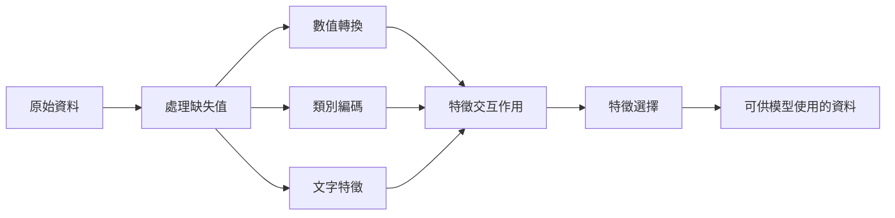

# 特徵工程與特徵選擇

> 好的特徵，勝過上千筆資料。

**Type:** Build
**Languages:** Python
**Prerequisites:** Phase 1 (Statistics for ML, Linear Algebra), Phase 2 Lessons 1-7
**Time:** ~90 minutes

## 學習目標

- 實作數值轉換（標準化、最小－最大縮放、對數轉換、分箱），並說明各自適用的情境
- 為類別特徵實作獨熱、標籤和目標編碼，並辨識目標編碼造成資料洩漏的風險
- 從零建構 TF-IDF 向量化器，並說明它為何比原始詞頻更適合文字分類
- 套用以篩選法為基礎的特徵選擇（變異數門檻、相關性、互資訊），降低資料維度

## 問題

你有一份資料集，選了一個演算法並訓練模型，結果卻不理想。你換了更複雜的演算法，表現還是普通。你花了一週調整超參數，改善幅度仍然有限。

接著有人把原始資料轉成更好的特徵，結果簡單的邏輯迴歸竟勝過調校過的梯度提升集成模型。

這種情況不斷發生。在傳統機器學習中，資料表示法往往比演算法選擇更重要。使用「坪數」和「臥室數量」預測房價，會比將「地址原始字串」輸入模型效果更好，不論後者的演算法多複雜。演算法只能處理你提供的資訊。

特徵工程是將原始資料轉換成更容易讓模型找出模式的表示法；特徵選擇則是移除只增加雜訊、沒有提供訊號的特徵。兩者合起來，是傳統機器學習中最具影響力的工作。

## 核心概念

### 特徵處理流程



### 數值特徵

原始數值通常不能直接供模型使用。常見轉換如下：

**縮放：** 將特徵調整到相同範圍，讓 K-Means、KNN 和 SVM 等距離式演算法平等看待所有特徵。最小－最大縮放會把數值映射到 [0, 1]；標準化（z 分數）則會讓平均值為 0、標準差為 1。

**對數轉換：** 壓縮右偏分布（收入、人口、詞數），並將乘法關係轉成加法關係。

**分箱：** 將連續數值轉成類別。當特徵與目標之間是非線性但呈階梯狀關係時很有用（例如年齡層）。

**多項式特徵：** 建立 x^2、x^3、x1*x2 等項目，讓線性模型能掌握非線性關係，代價是特徵數量增加。

### 類別特徵

模型需要數值，所以類別必須先編碼。

**獨熱編碼：** 每個類別都建立一個二元欄位。「color = red/blue/green」會變成三欄：is_red、is_blue、is_green。適用於類別數少的特徵，但類別很多時欄位數會暴增。

**標籤編碼：** 將每個類別映射成整數，例如 red=0、blue=1、green=2。這會引入錯誤的順序關係（模型可能以為 green > blue > red），只適合依個別數值切分的樹模型。

**目標編碼：** 將每個類別替換為該類別目標值的平均數。效果強大，但資料洩漏風險很高：只能使用訓練資料計算，再套用到測試資料。

### 文字特徵

**詞頻向量化器：** 計算每個詞在文件中出現的次數。「the cat sat on the mat」會轉成 {the: 2, cat: 1, sat: 1, on: 1, mat: 1}。

**TF-IDF：** 詞頻－反向文件頻率。依照詞語在不同文件中的獨特程度加權。像「the」這種常見詞權重低；少見且有辨識力的詞權重高。

```text
TF(word, doc) = count(word in doc) / 文件中的總詞數
IDF(word) = log(文件總數 / 含有該詞的文件數)
TF-IDF = TF * IDF
```

### 缺失值

真實資料常有缺漏，可採用以下策略：

- **刪除列：** 只適用於缺失資料比例很低且隨機發生的情況
- **平均數／中位數插補：** 方法簡單，可保留分布形狀（中位數較能抵抗離群值）
- **眾數插補：** 適用於類別特徵
- **指示欄：** 插補前新增二元欄位「was_this_missing」。缺失本身也可能含有資訊
- **向前／向後填補：** 適用於時間序列資料

### 特徵交互作用

有時，關係存在於特徵組合中。「身高」和「體重」單獨使用時，預測力不如「BMI = weight / height^2」。特徵交互作用會擴大特徵空間，因此應運用領域知識挑選合適項目。

### 特徵選擇

特徵不是越多越好。無關特徵會增加雜訊和訓練時間，也可能造成過度擬合。

**篩選法（模型訓練前）：**
- 相關性：移除彼此高度相關的特徵（避免重複）
- 互資訊：衡量已知某特徵後，對目標不確定性的降低程度
- 變異數門檻：移除幾乎不變動的特徵

**包裹法（依模型選擇）：**
- L1 正則化（Lasso）：讓無關特徵的權重精確降為零
- 遞迴特徵消除：訓練模型、移除最不重要的特徵，再重複執行

**為什麼特徵選擇很重要：** 使用 10 個好特徵的模型，通常會勝過同時使用這 10 個好特徵和 90 個雜訊特徵的模型。雜訊特徵會讓模型有機會過度擬合訓練資料中的模式，卻無法泛化。

```figure
feature-scaling
```

## Build It：從零實作

### 步驟 1：從零實作數值轉換

```python
import math


def min_max_scale(values):
    min_val = min(values)
    max_val = max(values)
    if max_val == min_val:
        return [0.0] * len(values)
    return [(v - min_val) / (max_val - min_val) for v in values]


def standardize(values):
    n = len(values)
    mean = sum(values) / n
    variance = sum((v - mean) ** 2 for v in values) / n
    std = math.sqrt(variance) if variance > 0 else 1.0
    return [(v - mean) / std for v in values]


def log_transform(values):
    return [math.log(v + 1) for v in values]


def bin_values(values, n_bins=5):
    min_val = min(values)
    max_val = max(values)
    bin_width = (max_val - min_val) / n_bins
    if bin_width == 0:
        return [0] * len(values)
    result = []
    for v in values:
        bin_idx = int((v - min_val) / bin_width)
        bin_idx = min(bin_idx, n_bins - 1)
        result.append(bin_idx)
    return result


def polynomial_features(row, degree=2):
    n = len(row)
    result = list(row)
    if degree >= 2:
        for i in range(n):
            result.append(row[i] ** 2)
        for i in range(n):
            for j in range(i + 1, n):
                result.append(row[i] * row[j])
    return result
```

### 步驟 2：從零實作類別編碼

```python
def one_hot_encode(values):
    categories = sorted(set(values))
    cat_to_idx = {cat: i for i, cat in enumerate(categories)}
    n_cats = len(categories)

    encoded = []
    for v in values:
        row = [0] * n_cats
        row[cat_to_idx[v]] = 1
        encoded.append(row)

    return encoded, categories


def label_encode(values):
    categories = sorted(set(values))
    cat_to_int = {cat: i for i, cat in enumerate(categories)}
    return [cat_to_int[v] for v in values], cat_to_int


def target_encode(feature_values, target_values, smoothing=10):
    global_mean = sum(target_values) / len(target_values)

    category_stats = {}
    for feat, target in zip(feature_values, target_values):
        if feat not in category_stats:
            category_stats[feat] = {"sum": 0.0, "count": 0}
        category_stats[feat]["sum"] += target
        category_stats[feat]["count"] += 1

    encoding = {}
    for cat, stats in category_stats.items():
        cat_mean = stats["sum"] / stats["count"]
        weight = stats["count"] / (stats["count"] + smoothing)
        encoding[cat] = weight * cat_mean + (1 - weight) * global_mean

    return [encoding[v] for v in feature_values], encoding
```

### 步驟 3：從零實作文字特徵

```python
def count_vectorize(documents):
    vocab = {}
    idx = 0
    for doc in documents:
        for word in doc.lower().split():
            if word not in vocab:
                vocab[word] = idx
                idx += 1

    vectors = []
    for doc in documents:
        vec = [0] * len(vocab)
        for word in doc.lower().split():
            vec[vocab[word]] += 1
        vectors.append(vec)

    return vectors, vocab


def tfidf(documents):
    n_docs = len(documents)

    vocab = {}
    idx = 0
    for doc in documents:
        for word in doc.lower().split():
            if word not in vocab:
                vocab[word] = idx
                idx += 1

    doc_freq = {}
    for doc in documents:
        seen = set()
        for word in doc.lower().split():
            if word not in seen:
                doc_freq[word] = doc_freq.get(word, 0) + 1
                seen.add(word)

    vectors = []
    for doc in documents:
        words = doc.lower().split()
        word_count = len(words)
        tf_map = {}
        for word in words:
            tf_map[word] = tf_map.get(word, 0) + 1

        vec = [0.0] * len(vocab)
        for word, count in tf_map.items():
            tf = count / word_count
            idf = math.log(n_docs / doc_freq[word])
            vec[vocab[word]] = tf * idf
        vectors.append(vec)

    return vectors, vocab
```

### 步驟 4：從零實作缺失值插補

```python
def impute_mean(values):
    present = [v for v in values if v is not None]
    if not present:
        return [0.0] * len(values), 0.0
    mean = sum(present) / len(present)
    return [v if v is not None else mean for v in values], mean


def impute_median(values):
    present = sorted(v for v in values if v is not None)
    if not present:
        return [0.0] * len(values), 0.0
    n = len(present)
    if n % 2 == 0:
        median = (present[n // 2 - 1] + present[n // 2]) / 2
    else:
        median = present[n // 2]
    return [v if v is not None else median for v in values], median


def impute_mode(values):
    present = [v for v in values if v is not None]
    if not present:
        return values, None
    counts = {}
    for v in present:
        counts[v] = counts.get(v, 0) + 1
    mode = max(counts, key=counts.get)
    return [v if v is not None else mode for v in values], mode


def add_missing_indicator(values):
    return [0 if v is not None else 1 for v in values]
```

### 步驟 5：從零實作特徵選擇

```python
def correlation(x, y):
    n = len(x)
    mean_x = sum(x) / n
    mean_y = sum(y) / n
    cov = sum((xi - mean_x) * (yi - mean_y) for xi, yi in zip(x, y)) / n
    std_x = math.sqrt(sum((xi - mean_x) ** 2 for xi in x) / n)
    std_y = math.sqrt(sum((yi - mean_y) ** 2 for yi in y) / n)
    if std_x == 0 or std_y == 0:
        return 0.0
    return cov / (std_x * std_y)


def mutual_information(feature, target, n_bins=10):
    feat_min = min(feature)
    feat_max = max(feature)
    bin_width = (feat_max - feat_min) / n_bins if feat_max != feat_min else 1.0
    feat_binned = [
        min(int((f - feat_min) / bin_width), n_bins - 1) for f in feature
    ]

    n = len(feature)
    target_classes = sorted(set(target))

    feat_bins = sorted(set(feat_binned))
    p_feat = {}
    for b in feat_bins:
        p_feat[b] = feat_binned.count(b) / n

    p_target = {}
    for t in target_classes:
        p_target[t] = target.count(t) / n

    mi = 0.0
    for b in feat_bins:
        for t in target_classes:
            joint_count = sum(
                1 for fb, tv in zip(feat_binned, target) if fb == b and tv == t
            )
            p_joint = joint_count / n
            if p_joint > 0:
                mi += p_joint * math.log(p_joint / (p_feat[b] * p_target[t]))

    return mi


def variance_threshold(features, threshold=0.01):
    n_features = len(features[0])
    n_samples = len(features)
    selected = []

    for j in range(n_features):
        col = [features[i][j] for i in range(n_samples)]
        mean = sum(col) / n_samples
        var = sum((v - mean) ** 2 for v in col) / n_samples
        if var >= threshold:
            selected.append(j)

    return selected


def remove_correlated(features, threshold=0.9):
    n_features = len(features[0])
    n_samples = len(features)

    to_remove = set()
    for i in range(n_features):
        if i in to_remove:
            continue
        col_i = [features[r][i] for r in range(n_samples)]
        for j in range(i + 1, n_features):
            if j in to_remove:
                continue
            col_j = [features[r][j] for r in range(n_samples)]
            corr = abs(correlation(col_i, col_j))
            if corr >= threshold:
                to_remove.add(j)

    return [i for i in range(n_features) if i not in to_remove]
```

### 步驟 6：完整流程與示範

```python
import random


def make_housing_data(n=200, seed=42):
    random.seed(seed)
    data = []
    for _ in range(n):
        sqft = random.uniform(500, 5000)
        bedrooms = random.choice([1, 2, 3, 4, 5])
        age = random.uniform(0, 50)
        neighborhood = random.choice(["downtown", "suburbs", "rural"])
        has_pool = random.choice([True, False])

        sqft_with_missing = sqft if random.random() > 0.05 else None
        age_with_missing = age if random.random() > 0.08 else None

        price = (
            50 * sqft
            + 20000 * bedrooms
            - 1000 * age
            + (50000 if neighborhood == "downtown" else 10000 if neighborhood == "suburbs" else 0)
            + (15000 if has_pool else 0)
            + random.gauss(0, 20000)
        )

        data.append({
            "sqft": sqft_with_missing,
            "bedrooms": bedrooms,
            "age": age_with_missing,
            "neighborhood": neighborhood,
            "has_pool": has_pool,
            "price": price,
        })
    return data


if __name__ == "__main__":
    data = make_housing_data(200)

    print("=== Raw Data Sample ===")
    for row in data[:3]:
        print(f"  {row}")

    sqft_raw = [d["sqft"] for d in data]
    age_raw = [d["age"] for d in data]
    prices = [d["price"] for d in data]

    print("\n=== Missing Value Handling ===")
    sqft_missing = sum(1 for v in sqft_raw if v is None)
    age_missing = sum(1 for v in age_raw if v is None)
    print(f"  sqft missing: {sqft_missing}/{len(sqft_raw)}")
    print(f"  age missing: {age_missing}/{len(age_raw)}")

    sqft_indicator = add_missing_indicator(sqft_raw)
    age_indicator = add_missing_indicator(age_raw)
    sqft_imputed, sqft_fill = impute_median(sqft_raw)
    age_imputed, age_fill = impute_mean(age_raw)
    print(f"  sqft filled with median: {sqft_fill:.0f}")
    print(f"  age filled with mean: {age_fill:.1f}")

    print("\n=== Numerical Transforms ===")
    sqft_scaled = standardize(sqft_imputed)
    age_scaled = min_max_scale(age_imputed)
    sqft_log = log_transform(sqft_imputed)
    age_binned = bin_values(age_imputed, n_bins=5)
    print(f"  sqft standardized: mean={sum(sqft_scaled)/len(sqft_scaled):.4f}, std={math.sqrt(sum(v**2 for v in sqft_scaled)/len(sqft_scaled)):.4f}")
    print(f"  age min-max: [{min(age_scaled):.2f}, {max(age_scaled):.2f}]")
    print(f"  age bins: {sorted(set(age_binned))}")

    print("\n=== Categorical Encoding ===")
    neighborhoods = [d["neighborhood"] for d in data]

    ohe, ohe_cats = one_hot_encode(neighborhoods)
    print(f"  One-hot categories: {ohe_cats}")
    print(f"  Sample encoding: {neighborhoods[0]} -> {ohe[0]}")

    le, le_map = label_encode(neighborhoods)
    print(f"  Label encoding map: {le_map}")

    te, te_map = target_encode(neighborhoods, prices, smoothing=10)
    print(f"  Target encoding: {({k: round(v) for k, v in te_map.items()})}")

    print("\n=== Text Features ===")
    descriptions = [
        "large modern house with pool",
        "small cozy cottage near downtown",
        "spacious family home with large yard",
        "modern apartment downtown with view",
        "rustic cabin in rural area",
    ]
    cv, cv_vocab = count_vectorize(descriptions)
    print(f"  Vocabulary size: {len(cv_vocab)}")
    print(f"  Doc 0 non-zero features: {sum(1 for v in cv[0] if v > 0)}")

    tf, tf_vocab = tfidf(descriptions)
    print(f"  TF-IDF vocabulary size: {len(tf_vocab)}")
    top_words = sorted(tf_vocab.keys(), key=lambda w: tf[0][tf_vocab[w]], reverse=True)[:3]
    print(f"  Doc 0 top TF-IDF words: {top_words}")

    print("\n=== Polynomial Features ===")
    sample_row = [sqft_scaled[0], age_scaled[0]]
    poly = polynomial_features(sample_row, degree=2)
    print(f"  Input: {[round(v, 4) for v in sample_row]}")
    print(f"  Polynomial: {[round(v, 4) for v in poly]}")
    print(f"  Features: [x1, x2, x1^2, x2^2, x1*x2]")

    print("\n=== Feature Selection ===")
    feature_matrix = [
        [sqft_scaled[i], age_scaled[i], float(sqft_indicator[i]), float(age_indicator[i])]
        + ohe[i]
        for i in range(len(data))
    ]

    print(f"  Total features: {len(feature_matrix[0])}")

    surviving_var = variance_threshold(feature_matrix, threshold=0.01)
    print(f"  After variance threshold (0.01): {len(surviving_var)} features kept")

    surviving_corr = remove_correlated(feature_matrix, threshold=0.9)
    print(f"  After correlation filter (0.9): {len(surviving_corr)} features kept")

    binary_prices = [1 if p > sum(prices) / len(prices) else 0 for p in prices]
    print("\n  Mutual information with target:")
    feature_names = ["sqft", "age", "sqft_missing", "age_missing"] + [f"neigh_{c}" for c in ohe_cats]
    for j in range(len(feature_matrix[0])):
        col = [feature_matrix[i][j] for i in range(len(feature_matrix))]
        mi = mutual_information(col, binary_prices, n_bins=10)
        print(f"    {feature_names[j]}: MI={mi:.4f}")

    print("\n  Correlation with price:")
    for j in range(len(feature_matrix[0])):
        col = [feature_matrix[i][j] for i in range(len(feature_matrix))]
        corr = correlation(col, prices)
        print(f"    {feature_names[j]}: r={corr:.4f}")
```

## Use It：實際應用

使用 scikit-learn 時，這些轉換可以組合成處理流程：

```python
from sklearn.preprocessing import StandardScaler, OneHotEncoder, PolynomialFeatures
from sklearn.impute import SimpleImputer
from sklearn.feature_extraction.text import TfidfVectorizer
from sklearn.feature_selection import mutual_info_classif, VarianceThreshold
from sklearn.compose import ColumnTransformer
from sklearn.pipeline import Pipeline

numeric_pipe = Pipeline([
    ("imputer", SimpleImputer(strategy="median")),
    ("scaler", StandardScaler()),
])

categorical_pipe = Pipeline([
    ("encoder", OneHotEncoder(sparse_output=False)),
])

preprocessor = ColumnTransformer([
    ("num", numeric_pipe, ["sqft", "age"]),
    ("cat", categorical_pipe, ["neighborhood"]),
])
```

從零實作的版本能清楚呈現每個轉換內部的運作方式。函式庫版本則加入邊界情況處理、稀疏矩陣支援和流程組合功能，但數學原理相同。

## Ship It：交付成果

本課程會產生：
- `outputs/prompt-feature-engineer.md`——協助系統化地從原始資料建構特徵的提示詞

## Exercises：練習

1. 在數值轉換中加入穩健縮放（使用中位數和四分位距，而不是平均數和標準差），並在含有極端離群值的資料上與標準縮放比較。
2. 實作留一法目標編碼：每一列的目標平均值都排除該列自身的目標值。展示它如何比一般目標編碼更能降低過度擬合。
3. 建立自動特徵選擇流程，結合變異數門檻、相關性篩選和互資訊排序。套用到房屋資料集，使用簡單線性迴歸比較全特徵和選出特徵的模型效能。

## 關鍵詞

| 術語 | 一般說法 | 實際意義 |
|------|----------|----------|
| 特徵工程 |「建立新欄位」| 將原始資料轉換成能讓模型看見模式的表示法 |
| 標準化 |「調成常態」| 減去平均值再除以標準差，讓特徵的平均值為 0、標準差為 1 |
| 獨熱編碼 |「建立虛擬變數」| 每個類別建立一個二元欄位，每列恰有一欄為 1 |
| 目標編碼 |「用答案編碼」| 將每個類別替換成該類別的目標平均值，並使用平滑處理防止過度擬合 |
| TF-IDF |「進階詞頻」| 詞頻乘上反向文件頻率，依詞語在整個語料中的獨特程度加權 |
| 插補 |「填補空缺」| 用估計值（平均數、中位數、眾數或模型預測）替換缺失值 |
| 特徵選擇 |「移除不好的欄位」| 移除增加雜訊或重複資訊的特徵，只留下含有目標訊號的特徵 |
| 互資訊 |「一件事能告訴你多少另一件事」| 觀察變數 X 後，變數 Y 的不確定性降低了多少 |
| 資料洩漏 |「不小心作弊」| 訓練時使用了預測時無法取得的資訊，導致結果看似過度樂觀 |

## 延伸閱讀

- [Max Kuhn 與 Kjell Johnson：《Feature Engineering and Selection》](http://www.feat.engineering/)：免費線上專書，涵蓋完整的特徵工程方法
- [scikit-learn 前處理指南](https://scikit-learn.org/stable/modules/preprocessing.html)：各種標準轉換方法的實用參考
- [Target Encoding Done Right（Micci-Barreca，2001）](https://dl.acm.org/doi/10.1145/507533.507538)：介紹含平滑處理目標編碼的原始論文
