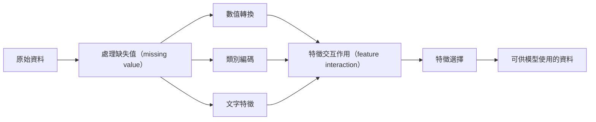

# 特徵工程與特徵選擇（feature engineering & selection）

> 一個好的特徵（feature）勝過一千個資料點（data point）。

**Type:** Build
**Languages:** Python
**Prerequisites:** Phase 1 (Statistics for ML, Linear Algebra), Phase 2 Lessons 1-7
**Time:** ~90 minutes

## Learning Objectives｜學習目標

- 實作數值特徵（numerical feature）轉換——標準化（standardization）、最小–最大縮放（min-max scaling）、對數轉換（log transform）、分箱（binning）——並說明各方法的適用時機
- 為類別特徵（categorical feature）建立 one-hot 編碼（one-hot encoding）、標籤編碼（label encoding）和目標編碼（target encoding），並指出目標編碼中的資料洩漏（data leakage）風險
- 從頭建構 TF-IDF 向量化器，並說明它為何在文字分類（text classification）上優於原始詞數（word count）
- 套用過濾法（filter method）特徵選擇——變異數閾值（variance threshold）、相關性（correlation）、互資訊（mutual information）——以降低維度（dimensionality）

## The Problem｜問題

你有一個資料集（dataset），選了一個演算法（algorithm），訓練它，結果普普通通。你換上更花俏的演算法，結果還是普通。你花了一週調整超參數（hyperparameter），改善有限。

然後有人把原始資料轉換成更好的特徵，一個簡單的邏輯斯迴歸（logistic regression）就打敗了你調好的梯度提升集成（gradient-boosted ensemble）。

這種事經常發生。在傳統機器學習（machine learning）中，資料的表示方式（representation）比演算法的選擇更重要。一個使用「坪數」和「房間數」的房價模型，不管學習器多精密，都會勝過拿「原始字串地址」餵進去的模型。演算法只能處理你給它的東西。

特徵工程是把原始資料轉換成更容易讓模型找出模式的表示法的過程。特徵選擇則是丟棄只加雜訊（noise）、不加訊號（signal）的特徵。兩者合起來，是傳統機器學習中最值得投入的工作。

## The Concept｜核心概念

### 特徵處理管線（feature pipeline）



### 數值特徵

原始數字很少能直接給模型使用。常見的轉換（transform）：

**縮放（scaling）：** 將特徵放到相同範圍，讓以距離為基礎的演算法（K-Means、KNN、SVM）平等對待所有特徵。最小–最大縮放把值映射到 [0, 1]；標準化（z 分數，z-score）則映射成平均數（mean）為 0、標準差（standard deviation）為 1。

**對數轉換：** 壓縮右偏（right-skewed）分布（distribution，收入、人口數、詞數這類資料）。它能把乘法關係轉成加法關係。

**分箱：** 將連續值轉成類別。當特徵與目標變數（target variable）之間是非線性但呈階梯狀的關係時（例如年齡分組）很有用。

**多項式特徵（polynomial features）：** 建立 x^2、x^3、x1*x2 等項。讓線性模型也能捕捉非線性關係，代價是特徵數增加。

### 類別特徵

模型需要數字，類別（category）就需要編碼（encoding）。

**one-hot 編碼：** 為每個類別建立一個二元欄位。「color = red/blue/green」會變成三個欄位：is_red、is_blue、is_green。適合基數（cardinality）低的特徵；類別一多就會膨脹。

**標籤編碼：** 將每個類別映射為整數：red=0、blue=1、green=2。這會引入虛假順序（模型可能會以為 green > blue > red）。只適合會按單一值切分的樹模型（tree-based model）。

**目標編碼：** 將每個類別替換成該類別下目標變數的平均數。強大但危險：資料洩漏風險很高。只能在訓練資料（training data）上計算，再套用到測試資料（test data）。

### 文字特徵

**計數向量化器（count vectorizer）：** 統計每個詞在一份文件（document）中出現的次數。「the cat sat on the mat」會變成 {the: 2, cat: 1, sat: 1, on: 1, mat: 1}。

**TF-IDF：** 詞頻–逆文件頻率（Term Frequency-Inverse Document Frequency）。依詞在所有文件中的稀有程度加權。像「the」這種常見詞權重低；稀有而有辨識度的詞權重高。

```
TF(word, doc) = count(word in doc) / total words in doc
IDF(word) = log(total docs / docs containing word)
TF-IDF = TF * IDF
```

### 缺失值（missing value）

真實資料總有破洞。處理策略：

- **刪除資料列：** 只在缺失資料稀少且隨機時使用
- **平均數／中位數補值（mean/median imputation）：** 簡單、保留分布形狀（中位數對離群值（outlier）更穩健）
- **眾數補值（mode imputation）：** 用於類別特徵
- **指標欄（indicator column）：** 補值前加一個「was_this_missing」二元欄位。資料缺失這件事本身就可能帶有資訊
- **向前／向後填補（forward/backward fill）：** 用於時間序列（time series）資料

### 特徵交互作用（feature interaction）

有時關係藏在組合裡。「身高」和「體重」各自的預測力，都不如「BMI = 體重 / 身高^2」。特徵交互作用（feature interaction）會讓特徵空間（feature space）倍增，所以要靠領域知識（domain knowledge）挑對組合。

### 特徵選擇

特徵不是越多越好。不相關的特徵會增加雜訊、拉長訓練時間，還可能造成過度擬合（overfitting）。

**過濾法（filter method）（建模前）：**
- 相關性：移除彼此高度相關的冗餘（redundant）特徵
- 互資訊：衡量知道某個特徵後，對目標的不確定性減少多少
- 變異數閾值：移除幾乎不變動的特徵

**包裝法（wrapper method；依模型評估）：**
- L1 正則化（Lasso）：把不相關特徵的權重壓到剛好為零
- 遞迴特徵消除（recursive feature elimination）：訓練、移除最不重要的特徵、重複

**為什麼要選擇特徵：** 只有 10 個好特徵的模型，通常會勝過 10 個好特徵加 90 個雜訊特徵的模型。雜訊特徵讓模型有機會對訓練資料中無法泛化（generalization）的模式過度擬合。

```figure
feature-scaling
```

## Build It｜動手實作

### 步驟 1：從頭實作數值轉換

```python
import math


def min_max_scale(values):
    min_val = min(values)
    max_val = max(values)
    if max_val == min_val:
        return [0.0] * len(values)
    return [(v - min_val) / (max_val - min_val) for v in values]


def standardize(values):
    n = len(values)
    mean = sum(values) / n
    variance = sum((v - mean) ** 2 for v in values) / n
    std = math.sqrt(variance) if variance > 0 else 1.0
    return [(v - mean) / std for v in values]


def log_transform(values):
    return [math.log(v + 1) for v in values]


def bin_values(values, n_bins=5):
    min_val = min(values)
    max_val = max(values)
    bin_width = (max_val - min_val) / n_bins
    if bin_width == 0:
        return [0] * len(values)
    result = []
    for v in values:
        bin_idx = int((v - min_val) / bin_width)
        bin_idx = min(bin_idx, n_bins - 1)
        result.append(bin_idx)
    return result


def polynomial_features(row, degree=2):
    n = len(row)
    result = list(row)
    if degree >= 2:
        for i in range(n):
            result.append(row[i] ** 2)
        for i in range(n):
            for j in range(i + 1, n):
                result.append(row[i] * row[j])
    return result
```

### 步驟 2：從頭實作類別編碼

```python
def one_hot_encode(values):
    categories = sorted(set(values))
    cat_to_idx = {cat: i for i, cat in enumerate(categories)}
    n_cats = len(categories)

    encoded = []
    for v in values:
        row = [0] * n_cats
        row[cat_to_idx[v]] = 1
        encoded.append(row)

    return encoded, categories


def label_encode(values):
    categories = sorted(set(values))
    cat_to_int = {cat: i for i, cat in enumerate(categories)}
    return [cat_to_int[v] for v in values], cat_to_int


def target_encode(feature_values, target_values, smoothing=10):
    global_mean = sum(target_values) / len(target_values)

    category_stats = {}
    for feat, target in zip(feature_values, target_values):
        if feat not in category_stats:
            category_stats[feat] = {"sum": 0.0, "count": 0}
        category_stats[feat]["sum"] += target
        category_stats[feat]["count"] += 1

    encoding = {}
    for cat, stats in category_stats.items():
        cat_mean = stats["sum"] / stats["count"]
        weight = stats["count"] / (stats["count"] + smoothing)
        encoding[cat] = weight * cat_mean + (1 - weight) * global_mean

    return [encoding[v] for v in feature_values], encoding
```

### 步驟 3：從頭實作文字特徵

```python
def count_vectorize(documents):
    vocab = {}
    idx = 0
    for doc in documents:
        for word in doc.lower().split():
            if word not in vocab:
                vocab[word] = idx
                idx += 1

    vectors = []
    for doc in documents:
        vec = [0] * len(vocab)
        for word in doc.lower().split():
            vec[vocab[word]] += 1
        vectors.append(vec)

    return vectors, vocab


def tfidf(documents):
    n_docs = len(documents)

    vocab = {}
    idx = 0
    for doc in documents:
        for word in doc.lower().split():
            if word not in vocab:
                vocab[word] = idx
                idx += 1

    doc_freq = {}
    for doc in documents:
        seen = set()
        for word in doc.lower().split():
            if word not in seen:
                doc_freq[word] = doc_freq.get(word, 0) + 1
                seen.add(word)

    vectors = []
    for doc in documents:
        words = doc.lower().split()
        word_count = len(words)
        tf_map = {}
        for word in words:
            tf_map[word] = tf_map.get(word, 0) + 1

        vec = [0.0] * len(vocab)
        for word, count in tf_map.items():
            tf = count / word_count
            idf = math.log(n_docs / doc_freq[word])
            vec[vocab[word]] = tf * idf
        vectors.append(vec)

    return vectors, vocab
```

### 步驟 4：從頭實作缺失值（missing value）補值

```python
def impute_mean(values):
    present = [v for v in values if v is not None]
    if not present:
        return [0.0] * len(values), 0.0
    mean = sum(present) / len(present)
    return [v if v is not None else mean for v in values], mean


def impute_median(values):
    present = sorted(v for v in values if v is not None)
    if not present:
        return [0.0] * len(values), 0.0
    n = len(present)
    if n % 2 == 0:
        median = (present[n // 2 - 1] + present[n // 2]) / 2
    else:
        median = present[n // 2]
    return [v if v is not None else median for v in values], median


def impute_mode(values):
    present = [v for v in values if v is not None]
    if not present:
        return values, None
    counts = {}
    for v in present:
        counts[v] = counts.get(v, 0) + 1
    mode = max(counts, key=counts.get)
    return [v if v is not None else mode for v in values], mode


def add_missing_indicator(values):
    return [0 if v is not None else 1 for v in values]
```

### 步驟 5：從頭實作特徵選擇

```python
def correlation(x, y):
    n = len(x)
    mean_x = sum(x) / n
    mean_y = sum(y) / n
    cov = sum((xi - mean_x) * (yi - mean_y) for xi, yi in zip(x, y)) / n
    std_x = math.sqrt(sum((xi - mean_x) ** 2 for xi in x) / n)
    std_y = math.sqrt(sum((yi - mean_y) ** 2 for yi in y) / n)
    if std_x == 0 or std_y == 0:
        return 0.0
    return cov / (std_x * std_y)


def mutual_information(feature, target, n_bins=10):
    feat_min = min(feature)
    feat_max = max(feature)
    bin_width = (feat_max - feat_min) / n_bins if feat_max != feat_min else 1.0
    feat_binned = [
        min(int((f - feat_min) / bin_width), n_bins - 1) for f in feature
    ]

    n = len(feature)
    target_classes = sorted(set(target))

    feat_bins = sorted(set(feat_binned))
    p_feat = {}
    for b in feat_bins:
        p_feat[b] = feat_binned.count(b) / n

    p_target = {}
    for t in target_classes:
        p_target[t] = target.count(t) / n

    mi = 0.0
    for b in feat_bins:
        for t in target_classes:
            joint_count = sum(
                1 for fb, tv in zip(feat_binned, target) if fb == b and tv == t
            )
            p_joint = joint_count / n
            if p_joint > 0:
                mi += p_joint * math.log(p_joint / (p_feat[b] * p_target[t]))

    return mi


def variance_threshold(features, threshold=0.01):
    n_features = len(features[0])
    n_samples = len(features)
    selected = []

    for j in range(n_features):
        col = [features[i][j] for i in range(n_samples)]
        mean = sum(col) / n_samples
        var = sum((v - mean) ** 2 for v in col) / n_samples
        if var >= threshold:
            selected.append(j)

    return selected


def remove_correlated(features, threshold=0.9):
    n_features = len(features[0])
    n_samples = len(features)

    to_remove = set()
    for i in range(n_features):
        if i in to_remove:
            continue
        col_i = [features[r][i] for r in range(n_samples)]
        for j in range(i + 1, n_features):
            if j in to_remove:
                continue
            col_j = [features[r][j] for r in range(n_samples)]
            corr = abs(correlation(col_i, col_j))
            if corr >= threshold:
                to_remove.add(j)

    return [i for i in range(n_features) if i not in to_remove]
```

### 步驟 6：完整管線與示範

```python
import random


def make_housing_data(n=200, seed=42):
    random.seed(seed)
    data = []
    for _ in range(n):
        sqft = random.uniform(500, 5000)
        bedrooms = random.choice([1, 2, 3, 4, 5])
        age = random.uniform(0, 50)
        neighborhood = random.choice(["downtown", "suburbs", "rural"])
        has_pool = random.choice([True, False])

        sqft_with_missing = sqft if random.random() > 0.05 else None
        age_with_missing = age if random.random() > 0.08 else None

        price = (
            50 * sqft
            + 20000 * bedrooms
            - 1000 * age
            + (50000 if neighborhood == "downtown" else 10000 if neighborhood == "suburbs" else 0)
            + (15000 if has_pool else 0)
            + random.gauss(0, 20000)
        )

        data.append({
            "sqft": sqft_with_missing,
            "bedrooms": bedrooms,
            "age": age_with_missing,
            "neighborhood": neighborhood,
            "has_pool": has_pool,
            "price": price,
        })
    return data


if __name__ == "__main__":
    data = make_housing_data(200)

    print("=== Raw Data Sample ===")
    for row in data[:3]:
        print(f"  {row}")

    sqft_raw = [d["sqft"] for d in data]
    age_raw = [d["age"] for d in data]
    prices = [d["price"] for d in data]

    print("\n=== Missing Value Handling ===")
    sqft_missing = sum(1 for v in sqft_raw if v is None)
    age_missing = sum(1 for v in age_raw if v is None)
    print(f"  sqft missing: {sqft_missing}/{len(sqft_raw)}")
    print(f"  age missing: {age_missing}/{len(age_raw)}")

    sqft_indicator = add_missing_indicator(sqft_raw)
    age_indicator = add_missing_indicator(age_raw)
    sqft_imputed, sqft_fill = impute_median(sqft_raw)
    age_imputed, age_fill = impute_mean(age_raw)
    print(f"  sqft filled with median: {sqft_fill:.0f}")
    print(f"  age filled with mean: {age_fill:.1f}")

    print("\n=== Numerical Transforms ===")
    sqft_scaled = standardize(sqft_imputed)
    age_scaled = min_max_scale(age_imputed)
    sqft_log = log_transform(sqft_imputed)
    age_binned = bin_values(age_imputed, n_bins=5)
    print(f"  sqft standardized: mean={sum(sqft_scaled)/len(sqft_scaled):.4f}, std={math.sqrt(sum(v**2 for v in sqft_scaled)/len(sqft_scaled)):.4f}")
    print(f"  age min-max: [{min(age_scaled):.2f}, {max(age_scaled):.2f}]")
    print(f"  age bins: {sorted(set(age_binned))}")

    print("\n=== Categorical Encoding ===")
    neighborhoods = [d["neighborhood"] for d in data]

    ohe, ohe_cats = one_hot_encode(neighborhoods)
    print(f"  One-hot categories: {ohe_cats}")
    print(f"  Sample encoding: {neighborhoods[0]} -> {ohe[0]}")

    le, le_map = label_encode(neighborhoods)
    print(f"  Label encoding map: {le_map}")

    te, te_map = target_encode(neighborhoods, prices, smoothing=10)
    print(f"  Target encoding: {({k: round(v) for k, v in te_map.items()})}")

    print("\n=== Text Features ===")
    descriptions = [
        "large modern house with pool",
        "small cozy cottage near downtown",
        "spacious family home with large yard",
        "modern apartment downtown with view",
        "rustic cabin in rural area",
    ]
    cv, cv_vocab = count_vectorize(descriptions)
    print(f"  Vocabulary size: {len(cv_vocab)}")
    print(f"  Doc 0 non-zero features: {sum(1 for v in cv[0] if v > 0)}")

    tf, tf_vocab = tfidf(descriptions)
    print(f"  TF-IDF vocabulary size: {len(tf_vocab)}")
    top_words = sorted(tf_vocab.keys(), key=lambda w: tf[0][tf_vocab[w]], reverse=True)[:3]
    print(f"  Doc 0 top TF-IDF words: {top_words}")

    print("\n=== Polynomial Features ===")
    sample_row = [sqft_scaled[0], age_scaled[0]]
    poly = polynomial_features(sample_row, degree=2)
    print(f"  Input: {[round(v, 4) for v in sample_row]}")
    print(f"  Polynomial: {[round(v, 4) for v in poly]}")
    print(f"  Features: [x1, x2, x1^2, x2^2, x1*x2]")

    print("\n=== Feature Selection ===")
    feature_matrix = [
        [sqft_scaled[i], age_scaled[i], float(sqft_indicator[i]), float(age_indicator[i])]
        + ohe[i]
        for i in range(len(data))
    ]

    print(f"  Total features: {len(feature_matrix[0])}")

    surviving_var = variance_threshold(feature_matrix, threshold=0.01)
    print(f"  After variance threshold (0.01): {len(surviving_var)} features kept")

    surviving_corr = remove_correlated(feature_matrix, threshold=0.9)
    print(f"  After correlation filter (0.9): {len(surviving_corr)} features kept")

    binary_prices = [1 if p > sum(prices) / len(prices) else 0 for p in prices]
    print("\n  Mutual information with target:")
    feature_names = ["sqft", "age", "sqft_missing", "age_missing"] + [f"neigh_{c}" for c in ohe_cats]
    for j in range(len(feature_matrix[0])):
        col = [feature_matrix[i][j] for i in range(len(feature_matrix))]
        mi = mutual_information(col, binary_prices, n_bins=10)
        print(f"    {feature_names[j]}: MI={mi:.4f}")

    print("\n  Correlation with price:")
    for j in range(len(feature_matrix[0])):
        col = [feature_matrix[i][j] for i in range(len(feature_matrix))]
        corr = correlation(col, prices)
        print(f"    {feature_names[j]}: r={corr:.4f}")
```

## Use It｜實際應用

使用 scikit-learn，這些轉換構成可組合的管線（pipeline）：

```python
from sklearn.preprocessing import StandardScaler, OneHotEncoder, PolynomialFeatures
from sklearn.impute import SimpleImputer
from sklearn.feature_extraction.text import TfidfVectorizer
from sklearn.feature_selection import mutual_info_classif, VarianceThreshold
from sklearn.compose import ColumnTransformer
from sklearn.pipeline import Pipeline

numeric_pipe = Pipeline([
    ("imputer", SimpleImputer(strategy="median")),
    ("scaler", StandardScaler()),
])

categorical_pipe = Pipeline([
    ("encoder", OneHotEncoder(sparse_output=False)),
])

preprocessor = ColumnTransformer([
    ("num", numeric_pipe, ["sqft", "age"]),
    ("cat", categorical_pipe, ["neighborhood"]),
])
```

從頭實作的版本能確切呈現每個轉換內部的運算。函式庫（library）版本另外加入了邊界情況處理、稀疏矩陣（sparse matrix）支援和管線組合，但數學是一樣的。

## Ship It｜交付成果

本課產出：
- `outputs/prompt-feature-engineer.md`——一個用於系統化處理原始資料特徵工程的 prompt

## Exercises｜練習

1. 在數值轉換中加入穩健縮放（robust scaling；以中位數與四分位距（interquartile range）取代平均數與標準差）。在含極端離群值的資料上，與標準化做比較。
2. 實作留一法（leave-one-out）目標編碼：對每一列，計算目標平均數時排除該列自己的目標值。說明它比起單純的目標編碼如何降低過度擬合。
3. 建立一條自動化特徵選擇管線，組合變異數閾值、相關性過濾和互資訊排名。把它套用到房價資料集，比較使用全部特徵與只使用入選特徵時的模型表現（用簡單的線性迴歸（linear regression））。

## Key Terms｜關鍵術語

| 術語 | 常見說法 | 實際意義 |
|------|----------------|----------------------|
| 特徵工程（feature engineering） | 「新增欄位」 | 將原始資料轉換成能把模式暴露給模型的表示法 |
| 標準化（standardization） | 「讓它變正常」 | 減去平均數再除以標準差，讓特徵的平均數為 0、標準差為 1 |
| one-hot 編碼（one-hot encoding） | 「做虛擬變數」 | 為每個類別建立一個二元欄位，每一列恰好有一欄為 1 |
| 目標編碼（target encoding） | 「拿答案來編碼」 | 將每個類別替換成該類別的平均目標值，並以平滑化（smoothing）防止過度擬合 |
| TF-IDF | 「高級版詞數統計」 | 詞頻乘以逆文件頻率：依詞在整個語料庫（corpus）中的辨識度加權 |
| 補值（imputation） | 「填空格」 | 以估計值取代缺失值（missing value）（平均數、中位數、眾數或模型預測值） |
| 特徵選擇（feature selection） | 「刪掉爛欄位」 | 移除只增加雜訊或冗餘的特徵，只留下對目標帶有訊號的特徵 |
| 互資訊（mutual information） | 「一件事能告訴你多少關於另一件事的資訊」 | 衡量觀察到變數（variable）X 後，對變數 Y 不確定性的減少量 |
| 資料洩漏（data leakage） | 「不小心作弊」 | 訓練時使用了預測時不可能取得的資訊，造成虛假的樂觀結果 |

## Further Reading｜延伸閱讀

- [Feature Engineering and Selection (Max Kuhn & Kjell Johnson)](http://www.feat.engineering/)——涵蓋特徵工程全貌的免費線上書
- [scikit-learn Preprocessing Guide](https://scikit-learn.org/stable/modules/preprocessing.html)——所有標準轉換的實用參考
- [Target Encoding Done Right (Micci-Barreca, 2001)](https://dl.acm.org/doi/10.1145/507533.507538)——提出帶平滑化的目標編碼的原始論文
