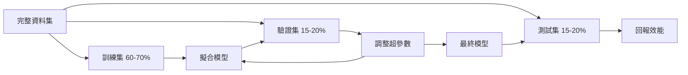

# 模型評估

> 模型表現好不好，取決於你如何衡量。

**Type:** Build
**Languages:** Python
**Prerequisites:** Phase 1 (Probability & Distributions, Statistics for ML), Phase 2 Lessons 1-8
**Time:** ~90 minutes

## 學習目標

- 從零實作 K 折與分層 K 折交叉驗證，並說明分層對不平衡資料的重要性
- 從零計算 Precision、Recall、F1、AUC-ROC 及迴歸指標（MSE、RMSE、MAE、R 平方）
- 解讀學習曲線，診斷模型是否有高偏差或高變異問題
- 找出常見評估錯誤，包括資料洩漏、指標選錯及測試集受到污染

## 問題

你訓練好一個模型，它在資料上的準確率是 95%。這樣算好嗎？

不一定。如果 95% 的資料都屬於同一類別，永遠預測該類別的模型也會有 95% 準確率，卻完全沒有用。如果在訓練資料上評估，95% 這個數字也沒有意義，因為模型只是把答案記起來。如果資料集有時間因素，切分前卻隨機打亂，模型可能會用未來資料預測過去。

多數機器學習專案都在模型評估階段出錯。指標選錯，差勁的模型看起來會很好；資料切分錯誤，模型就能作弊；比較方式錯誤，你可能會選到較差的模型。正確評估不可或缺，這決定了模型能否在正式環境運作，而不是遇到真實資料就失效。

## 核心概念

### 訓練集、驗證集、測試集



三種資料集各有不同用途：

- **訓練集：** 模型從這些資料學習，訓練時會看見這些範例。
- **驗證集：** 用於調整超參數和選擇模型。模型不會用這些資料訓練，但你的決策會受驗證結果影響。
- **測試集：** 只在最後使用一次，以回報最終效能。如果查看測試結果後又回去修改模型，它就不再是測試集，而成了第二個驗證集。

測試集是保留資料，可確保回報的效能能反映模型處理真正未見資料時的表現。

### K 折交叉驗證

資料集較小時，單次訓練／驗證切分會浪費資料，也容易得到波動較大的估計值。K 折交叉驗證會同時用所有資料進行訓練和驗證：

```mermaid
flowchart TB
    subgraph Fold1["第 1 折"]
        direction LR
        V1["驗證"] --- T1a["訓練"] --- T1b["訓練"] --- T1c["訓練"] --- T1d["訓練"]
    end
    subgraph Fold2["第 2 折"]
        direction LR
        T2a["訓練"] --- V2["驗證"] --- T2b["訓練"] --- T2c["訓練"] --- T2d["訓練"]
    end
    subgraph Fold3["第 3 折"]
        direction LR
        T3a["訓練"] --- T3b["訓練"] --- V3["驗證"] --- T3c["訓練"] --- T3d["訓練"]
    end
    subgraph Fold4["第 4 折"]
        direction LR
        T4a["訓練"] --- T4b["訓練"] --- T4c["訓練"] --- V4["驗證"] --- T4d["訓練"]
    end
    subgraph Fold5["第 5 折"]
        direction LR
        T5a["訓練"] --- T5b["訓練"] --- T5c["訓練"] --- T5d["訓練"] --- V5["驗證"]
    end
    Fold1 --> R["平均分數"]
    Fold2 --> R
    Fold3 --> R
    Fold4 --> R
    Fold5 --> R
```



1. 將資料切成 K 份大小相同的區塊。
2. 每次用 K-1 份訓練，剩下的一份驗證。
3. 將 K 次驗證分數取平均。

K=5 或 K=10 是常見選擇。每筆資料都會恰好作為驗證資料一次。平均分數比單次切分的估計更穩定。

**分層 K 折：** 保留每一折中的類別分布。若資料集有 70% 的 A 類和 30% 的 B 類，每一折也會大致維持相同比例。這對不平衡資料集很重要，否則隨機切分可能讓所有少數類別樣本都落在同一折。

### 分類指標

**混淆矩陣：** 其他指標的計算基礎。以二元分類為例：

| | 預測正類 | 預測負類 |
|--|----------|----------|
| 實際為正類 | 真陽性（TP）| 假陰性（FN）|
| 實際為負類 | 假陽性（FP）| 真陰性（TN）|

其他指標都可以從這個矩陣計算：

- **準確率** = (TP + TN) / (TP + TN + FP + FN)，代表預測正確的比例。類別不平衡時容易誤導。
- **Precision（精確率）** = TP / (TP + FP)。所有預測為正類的樣本中，實際為正類的有多少？假陽性代價高時使用（例如垃圾郵件過濾器不能把正常郵件標成垃圾郵件）。
- **Recall（召回率，又稱敏感度）** = TP / (TP + FN)。所有實際為正類的樣本中，成功找出的有多少？假陰性代價高時使用（例如癌症篩檢不能漏掉腫瘤）。
- **F1 分數** = 2 * precision * recall / (precision + recall)，是 Precision 與 Recall 的調和平均數；沒有任何一項明顯優先時，可用它平衡兩者。
- **AUC-ROC：** ROC 曲線下面積，繪製不同分類閾值下的真陽性率與假陽性率。AUC = 0.5 代表隨機猜測，AUC = 1.0 代表完美區分。它不受閾值影響，衡量模型將正類排在負類之前的能力。

### 迴歸指標

- **MSE（均方誤差）** = mean((y_true - y_pred)^2)，會以平方幅度懲罰較大的誤差，容易受離群值影響。
- **RMSE（均方根誤差）** = sqrt(MSE)，與目標變數使用相同單位，比 MSE 更容易解讀。
- **MAE（平均絕對誤差）** = mean(|y_true - y_pred|)，所有誤差都以線性方式計算，比 MSE 更能抵抗離群值。
- **R 平方** = 1 - SS_res / SS_tot，其中 SS_res = sum((y_true - y_pred)^2)，SS_tot = sum((y_true - y_mean)^2)，表示模型解釋的變異比例。R² = 1.0 代表完美預測；R² = 0.0 代表不比永遠預測平均值好；模型表現比平均值預測還差時，R² 可能為負。

### 學習曲線

繪製訓練集大小與訓練、驗證分數之間的關係：

- **高偏差（欠擬合）：** 兩條曲線都收斂到低分數。增加資料無濟於事，需要更複雜的模型。
- **高變異（過度擬合）：** 訓練分數高，驗證分數低得多，兩者差距很大。增加資料應該能有所幫助。

### 驗證曲線

繪製超參數值與訓練、驗證分數之間的關係：

- 複雜度低：兩種分數都低（欠擬合）
- 複雜度適中：兩種分數都高，而且彼此接近
- 複雜度高：訓練分數維持高分，驗證分數卻下降（過度擬合）

驗證分數最高時對應的超參數值，就是最佳值。

### 常見評估錯誤

**資料洩漏：** 測試集資訊洩漏到訓練流程中。例子包括：切分前先用完整資料集擬合縮放器、在時間序列預測中使用未來資料，以及加入由目標值推導出的特徵。務必先切分，再做前處理。

**類別不平衡：** 99% 的交易合法，1% 是詐欺。永遠預測「合法」的模型也有 99% 準確率。此時應改用 Precision、Recall、F1 或 AUC-ROC。

**指標錯誤：** 醫療診斷應該最佳化 Recall，卻去最佳化準確率；或資料含有大量離群值，卻最佳化 RMSE（此時應改用 MAE）。

**未使用分層切分：** 對不平衡資料隨機切分時，驗證折中的少數類別樣本可能非常少，造成估計不穩定。

**測試太頻繁：** 每查看一次測試效能並據此調整模型，就會對測試集過度擬合。測試集只能用一次。

```figure
precision-recall-threshold
```

## Build It：從零實作

### 步驟 1：切分訓練集、驗證集和測試集

```python
import random
import math


def train_val_test_split(X, y, train_ratio=0.6, val_ratio=0.2, seed=42):
    random.seed(seed)
    n = len(X)
    indices = list(range(n))
    random.shuffle(indices)

    train_end = int(n * train_ratio)
    val_end = int(n * (train_ratio + val_ratio))

    train_idx = indices[:train_end]
    val_idx = indices[train_end:val_end]
    test_idx = indices[val_end:]

    X_train = [X[i] for i in train_idx]
    y_train = [y[i] for i in train_idx]
    X_val = [X[i] for i in val_idx]
    y_val = [y[i] for i in val_idx]
    X_test = [X[i] for i in test_idx]
    y_test = [y[i] for i in test_idx]

    return X_train, y_train, X_val, y_val, X_test, y_test
```

### 步驟 2：K 折與分層 K 折交叉驗證

```python
def kfold_split(n, k=5, seed=42):
    random.seed(seed)
    indices = list(range(n))
    random.shuffle(indices)

    fold_size = n // k
    folds = []

    for i in range(k):
        start = i * fold_size
        end = start + fold_size if i < k - 1 else n
        val_idx = indices[start:end]
        train_idx = indices[:start] + indices[end:]
        folds.append((train_idx, val_idx))

    return folds


def stratified_kfold_split(y, k=5, seed=42):
    random.seed(seed)

    class_indices = {}
    for i, label in enumerate(y):
        class_indices.setdefault(label, []).append(i)

    for label in class_indices:
        random.shuffle(class_indices[label])

    folds = [{"train": [], "val": []} for _ in range(k)]

    for label, indices in class_indices.items():
        fold_size = len(indices) // k
        for i in range(k):
            start = i * fold_size
            end = start + fold_size if i < k - 1 else len(indices)
            val_part = indices[start:end]
            train_part = indices[:start] + indices[end:]
            folds[i]["val"].extend(val_part)
            folds[i]["train"].extend(train_part)

    return [(f["train"], f["val"]) for f in folds]


def cross_validate(X, y, model_fn, k=5, metric_fn=None, stratified=False):
    n = len(X)

    if stratified:
        folds = stratified_kfold_split(y, k)
    else:
        folds = kfold_split(n, k)

    scores = []
    for train_idx, val_idx in folds:
        X_train = [X[i] for i in train_idx]
        y_train = [y[i] for i in train_idx]
        X_val = [X[i] for i in val_idx]
        y_val = [y[i] for i in val_idx]

        model = model_fn()
        model.fit(X_train, y_train)
        predictions = [model.predict(x) for x in X_val]

        if metric_fn:
            score = metric_fn(y_val, predictions)
        else:
            score = sum(1 for yt, yp in zip(y_val, predictions) if yt == yp) / len(y_val)
        scores.append(score)

    return scores
```

### 步驟 3：混淆矩陣與分類指標

```python
def confusion_matrix(y_true, y_pred):
    tp = sum(1 for yt, yp in zip(y_true, y_pred) if yt == 1 and yp == 1)
    tn = sum(1 for yt, yp in zip(y_true, y_pred) if yt == 0 and yp == 0)
    fp = sum(1 for yt, yp in zip(y_true, y_pred) if yt == 0 and yp == 1)
    fn = sum(1 for yt, yp in zip(y_true, y_pred) if yt == 1 and yp == 0)
    return tp, tn, fp, fn


def accuracy(y_true, y_pred):
    tp, tn, fp, fn = confusion_matrix(y_true, y_pred)
    total = tp + tn + fp + fn
    return (tp + tn) / total if total > 0 else 0.0


def precision(y_true, y_pred):
    tp, tn, fp, fn = confusion_matrix(y_true, y_pred)
    return tp / (tp + fp) if (tp + fp) > 0 else 0.0


def recall(y_true, y_pred):
    tp, tn, fp, fn = confusion_matrix(y_true, y_pred)
    return tp / (tp + fn) if (tp + fn) > 0 else 0.0


def f1_score(y_true, y_pred):
    p = precision(y_true, y_pred)
    r = recall(y_true, y_pred)
    return 2 * p * r / (p + r) if (p + r) > 0 else 0.0


def roc_curve(y_true, y_scores):
    thresholds = sorted(set(y_scores), reverse=True)
    tpr_list = []
    fpr_list = []

    total_positives = sum(y_true)
    total_negatives = len(y_true) - total_positives

    for threshold in thresholds:
        y_pred = [1 if s >= threshold else 0 for s in y_scores]
        tp = sum(1 for yt, yp in zip(y_true, y_pred) if yt == 1 and yp == 1)
        fp = sum(1 for yt, yp in zip(y_true, y_pred) if yt == 0 and yp == 1)

        tpr = tp / total_positives if total_positives > 0 else 0.0
        fpr = fp / total_negatives if total_negatives > 0 else 0.0

        tpr_list.append(tpr)
        fpr_list.append(fpr)

    return fpr_list, tpr_list, thresholds


def auc_roc(y_true, y_scores):
    fpr_list, tpr_list, _ = roc_curve(y_true, y_scores)

    pairs = sorted(zip(fpr_list, tpr_list))
    fpr_sorted = [p[0] for p in pairs]
    tpr_sorted = [p[1] for p in pairs]

    area = 0.0
    for i in range(1, len(fpr_sorted)):
        width = fpr_sorted[i] - fpr_sorted[i - 1]
        height = (tpr_sorted[i] + tpr_sorted[i - 1]) / 2
        area += width * height

    return area
```

### 步驟 4：迴歸指標

```python
def mse(y_true, y_pred):
    n = len(y_true)
    return sum((yt - yp) ** 2 for yt, yp in zip(y_true, y_pred)) / n


def rmse(y_true, y_pred):
    return math.sqrt(mse(y_true, y_pred))


def mae(y_true, y_pred):
    n = len(y_true)
    return sum(abs(yt - yp) for yt, yp in zip(y_true, y_pred)) / n


def r_squared(y_true, y_pred):
    mean_y = sum(y_true) / len(y_true)
    ss_res = sum((yt - yp) ** 2 for yt, yp in zip(y_true, y_pred))
    ss_tot = sum((yt - mean_y) ** 2 for yt in y_true)
    if ss_tot == 0:
        return 0.0
    return 1.0 - ss_res / ss_tot
```

### 步驟 5：學習曲線

```python
def learning_curve(X, y, model_fn, metric_fn, train_sizes=None, val_ratio=0.2, seed=42):
    random.seed(seed)
    n = len(X)
    indices = list(range(n))
    random.shuffle(indices)

    val_size = int(n * val_ratio)
    val_idx = indices[:val_size]
    pool_idx = indices[val_size:]

    X_val = [X[i] for i in val_idx]
    y_val = [y[i] for i in val_idx]

    if train_sizes is None:
        train_sizes = [int(len(pool_idx) * r) for r in [0.1, 0.2, 0.4, 0.6, 0.8, 1.0]]

    train_scores = []
    val_scores = []

    for size in train_sizes:
        subset = pool_idx[:size]
        X_train = [X[i] for i in subset]
        y_train = [y[i] for i in subset]

        model = model_fn()
        model.fit(X_train, y_train)

        train_pred = [model.predict(x) for x in X_train]
        val_pred = [model.predict(x) for x in X_val]

        train_scores.append(metric_fn(y_train, train_pred))
        val_scores.append(metric_fn(y_val, val_pred))

    return train_sizes, train_scores, val_scores
```

### 步驟 6：用於測試的簡單分類器與完整示範

```python
class SimpleLogistic:
    def __init__(self, lr=0.1, epochs=100):
        self.lr = lr
        self.epochs = epochs
        self.weights = None
        self.bias = 0.0

    def sigmoid(self, z):
        z = max(-500, min(500, z))
        return 1.0 / (1.0 + math.exp(-z))

    def fit(self, X, y):
        n_features = len(X[0])
        self.weights = [0.0] * n_features
        self.bias = 0.0

        for _ in range(self.epochs):
            for xi, yi in zip(X, y):
                z = sum(w * x for w, x in zip(self.weights, xi)) + self.bias
                pred = self.sigmoid(z)
                error = yi - pred
                for j in range(n_features):
                    self.weights[j] += self.lr * error * xi[j]
                self.bias += self.lr * error

    def predict_proba(self, x):
        z = sum(w * xi for w, xi in zip(self.weights, x)) + self.bias
        return self.sigmoid(z)

    def predict(self, x):
        return 1 if self.predict_proba(x) >= 0.5 else 0


class SimpleLinearRegression:
    def __init__(self, lr=0.001, epochs=200):
        self.lr = lr
        self.epochs = epochs
        self.weights = None
        self.bias = 0.0

    def fit(self, X, y):
        n_features = len(X[0])
        self.weights = [0.0] * n_features
        self.bias = 0.0
        n = len(X)

        for _ in range(self.epochs):
            for xi, yi in zip(X, y):
                pred = sum(w * x for w, x in zip(self.weights, xi)) + self.bias
                error = yi - pred
                for j in range(n_features):
                    self.weights[j] += self.lr * error * xi[j] / n
                self.bias += self.lr * error / n

    def predict(self, x):
        return sum(w * xi for w, xi in zip(self.weights, x)) + self.bias


def standardize(values):
    n = len(values)
    mean = sum(values) / n
    var = sum((v - mean) ** 2 for v in values) / n
    std = math.sqrt(var) if var > 0 else 1.0
    return [(v - mean) / std for v in values], mean, std


def make_classification_data(n=300, seed=42):
    random.seed(seed)
    X = []
    y = []
    for _ in range(n):
        x1 = random.gauss(0, 1)
        x2 = random.gauss(0, 1)
        label = 1 if (x1 + x2 + random.gauss(0, 0.5)) > 0 else 0
        X.append([x1, x2])
        y.append(label)
    return X, y


def make_regression_data(n=200, seed=42):
    random.seed(seed)
    X = []
    y = []
    for _ in range(n):
        x1 = random.uniform(0, 10)
        x2 = random.uniform(0, 5)
        target = 3 * x1 + 2 * x2 + random.gauss(0, 2)
        X.append([x1, x2])
        y.append(target)
    return X, y


def make_imbalanced_data(n=300, minority_ratio=0.05, seed=42):
    random.seed(seed)
    X = []
    y = []
    for _ in range(n):
        if random.random() < minority_ratio:
            x1 = random.gauss(3, 0.5)
            x2 = random.gauss(3, 0.5)
            label = 1
        else:
            x1 = random.gauss(0, 1)
            x2 = random.gauss(0, 1)
            label = 0
        X.append([x1, x2])
        y.append(label)
    return X, y


if __name__ == "__main__":
    X_clf, y_clf = make_classification_data(300)

    print("=== Train/Validation/Test Split ===")
    X_train, y_train, X_val, y_val, X_test, y_test = train_val_test_split(X_clf, y_clf)
    print(f"  Train: {len(X_train)}, Val: {len(X_val)}, Test: {len(X_test)}")
    print(f"  Train class distribution: {sum(y_train)}/{len(y_train)} positive")
    print(f"  Val class distribution: {sum(y_val)}/{len(y_val)} positive")

    model = SimpleLogistic(lr=0.1, epochs=200)
    model.fit(X_train, y_train)

    print("\n=== Classification Metrics ===")
    y_pred = [model.predict(x) for x in X_test]
    tp, tn, fp, fn = confusion_matrix(y_test, y_pred)
    print(f"  Confusion matrix: TP={tp}, TN={tn}, FP={fp}, FN={fn}")
    print(f"  Accuracy:  {accuracy(y_test, y_pred):.4f}")
    print(f"  Precision: {precision(y_test, y_pred):.4f}")
    print(f"  Recall:    {recall(y_test, y_pred):.4f}")
    print(f"  F1 Score:  {f1_score(y_test, y_pred):.4f}")

    y_scores = [model.predict_proba(x) for x in X_test]
    auc = auc_roc(y_test, y_scores)
    print(f"  AUC-ROC:   {auc:.4f}")

    print("\n=== K-Fold Cross-Validation (K=5) ===")
    cv_scores = cross_validate(
        X_clf, y_clf,
        model_fn=lambda: SimpleLogistic(lr=0.1, epochs=200),
        k=5,
        metric_fn=accuracy,
    )
    mean_cv = sum(cv_scores) / len(cv_scores)
    std_cv = math.sqrt(sum((s - mean_cv) ** 2 for s in cv_scores) / len(cv_scores))
    print(f"  Fold scores: {[round(s, 4) for s in cv_scores]}")
    print(f"  Mean: {mean_cv:.4f} (+/- {std_cv:.4f})")

    print("\n=== Stratified K-Fold Cross-Validation (K=5) ===")
    strat_scores = cross_validate(
        X_clf, y_clf,
        model_fn=lambda: SimpleLogistic(lr=0.1, epochs=200),
        k=5,
        metric_fn=accuracy,
        stratified=True,
    )
    strat_mean = sum(strat_scores) / len(strat_scores)
    strat_std = math.sqrt(sum((s - strat_mean) ** 2 for s in strat_scores) / len(strat_scores))
    print(f"  Fold scores: {[round(s, 4) for s in strat_scores]}")
    print(f"  Mean: {strat_mean:.4f} (+/- {strat_std:.4f})")

    print("\n=== Imbalanced Data: Why Accuracy Lies ===")
    X_imb, y_imb = make_imbalanced_data(300, minority_ratio=0.05)
    positives = sum(y_imb)
    print(f"  Class distribution: {positives} positive, {len(y_imb) - positives} negative ({positives/len(y_imb)*100:.1f}% positive)")

    always_negative = [0] * len(y_imb)
    print(f"  Always-negative baseline:")
    print(f"    Accuracy:  {accuracy(y_imb, always_negative):.4f}")
    print(f"    Precision: {precision(y_imb, always_negative):.4f}")
    print(f"    Recall:    {recall(y_imb, always_negative):.4f}")
    print(f"    F1 Score:  {f1_score(y_imb, always_negative):.4f}")

    X_tr_i, y_tr_i, X_v_i, y_v_i, X_te_i, y_te_i = train_val_test_split(X_imb, y_imb)
    model_imb = SimpleLogistic(lr=0.5, epochs=500)
    model_imb.fit(X_tr_i, y_tr_i)
    y_pred_imb = [model_imb.predict(x) for x in X_te_i]
    print(f"\n  Trained model on imbalanced data:")
    print(f"    Accuracy:  {accuracy(y_te_i, y_pred_imb):.4f}")
    print(f"    Precision: {precision(y_te_i, y_pred_imb):.4f}")
    print(f"    Recall:    {recall(y_te_i, y_pred_imb):.4f}")
    print(f"    F1 Score:  {f1_score(y_te_i, y_pred_imb):.4f}")

    print("\n=== Regression Metrics ===")
    X_reg, y_reg = make_regression_data(200)

    col0 = [x[0] for x in X_reg]
    col1 = [x[1] for x in X_reg]
    col0_s, m0, s0 = standardize(col0)
    col1_s, m1, s1 = standardize(col1)
    X_reg_scaled = [[col0_s[i], col1_s[i]] for i in range(len(X_reg))]

    X_tr_r, y_tr_r, X_v_r, y_v_r, X_te_r, y_te_r = train_val_test_split(X_reg_scaled, y_reg)
    reg_model = SimpleLinearRegression(lr=0.01, epochs=500)
    reg_model.fit(X_tr_r, y_tr_r)
    y_pred_r = [reg_model.predict(x) for x in X_te_r]

    print(f"  MSE:       {mse(y_te_r, y_pred_r):.4f}")
    print(f"  RMSE:      {rmse(y_te_r, y_pred_r):.4f}")
    print(f"  MAE:       {mae(y_te_r, y_pred_r):.4f}")
    print(f"  R-squared: {r_squared(y_te_r, y_pred_r):.4f}")

    mean_baseline = [sum(y_tr_r) / len(y_tr_r)] * len(y_te_r)
    print(f"\n  Mean baseline:")
    print(f"    MSE:       {mse(y_te_r, mean_baseline):.4f}")
    print(f"    R-squared: {r_squared(y_te_r, mean_baseline):.4f}")

    print("\n=== Learning Curve ===")
    sizes, train_sc, val_sc = learning_curve(
        X_clf, y_clf,
        model_fn=lambda: SimpleLogistic(lr=0.1, epochs=200),
        metric_fn=accuracy,
    )
    print(f"  {'Size':>6} {'Train':>8} {'Val':>8}")
    for s, tr, va in zip(sizes, train_sc, val_sc):
        print(f"  {s:>6} {tr:>8.4f} {va:>8.4f}")

    print("\n=== Statistical Model Comparison ===")
    model_a_scores = cross_validate(
        X_clf, y_clf,
        model_fn=lambda: SimpleLogistic(lr=0.1, epochs=100),
        k=5, metric_fn=accuracy,
    )
    model_b_scores = cross_validate(
        X_clf, y_clf,
        model_fn=lambda: SimpleLogistic(lr=0.1, epochs=500),
        k=5, metric_fn=accuracy,
    )
    diffs = [a - b for a, b in zip(model_a_scores, model_b_scores)]
    mean_diff = sum(diffs) / len(diffs)
    std_diff = math.sqrt(sum((d - mean_diff) ** 2 for d in diffs) / len(diffs))
    t_stat = mean_diff / (std_diff / math.sqrt(len(diffs))) if std_diff > 0 else 0.0
    print(f"  Model A (100 epochs) mean: {sum(model_a_scores)/len(model_a_scores):.4f}")
    print(f"  Model B (500 epochs) mean: {sum(model_b_scores)/len(model_b_scores):.4f}")
    print(f"  Mean difference: {mean_diff:.4f}")
    print(f"  Paired t-statistic: {t_stat:.4f}")
    print(f"  (|t| > 2.78 for significance at p<0.05 with df=4)")
```

## Use It：實際應用

在 scikit-learn 中，模型評估已整合到工作流程中：

```python
from sklearn.model_selection import cross_val_score, StratifiedKFold, learning_curve
from sklearn.metrics import (
    accuracy_score, precision_score, recall_score, f1_score,
    roc_auc_score, confusion_matrix, mean_squared_error, r2_score,
)
from sklearn.linear_model import LogisticRegression

model = LogisticRegression()
scores = cross_val_score(model, X, y, cv=StratifiedKFold(5), scoring="f1")
```

從零實作的版本會明確呈現交叉驗證的運作方式（只是迴圈和索引追蹤，沒有黑箱）、各指標的計算方式（只是在計算 TP、FP、TN、FN），以及分層為何重要（保留各折的類別比例）。函式庫版本則加入平行處理、更多評分選項，以及與處理流程的整合。

## Ship It：交付成果

本課程會產生：
- `outputs/skill-evaluation.md`——涵蓋分類與迴歸模型評估策略的 skill

## Exercises：練習

1. 實作 Precision-Recall 曲線：在不同閾值下繪製 Precision 與 Recall，並計算平均 Precision（PR 曲線下面積）。在不平衡資料集上將 PR 曲線與 ROC 曲線比較，說明何時各自更有資訊。
2. 建立巢狀交叉驗證：外層迴圈評估模型效能，內層迴圈調整超參數。使用它公平比較兩個模型，且不讓驗證資料洩漏到評估中。
3. 為模型比較實作置換檢定：打亂標籤、重新訓練並測量效能，重複 100 次建立虛無分布，再根據這個分布計算觀察效能的 p 值。

## 關鍵詞

| 術語 | 一般說法 | 實際意義 |
|------|----------|----------|
| 過度擬合 |「記住訓練資料」| 模型擷取訓練資料中的雜訊，在訓練資料上表現良好，卻無法處理未見資料 |
| 交叉驗證 |「用不同子集測試」| 系統化輪替驗證資料的切分方式，並對各次結果取平均 |
| Precision（精確率）|「預測為正類的樣本有多少正確」| TP / (TP + FP)：所有正類預測中，實際為正類的比例 |
| Recall（召回率）|「找出多少實際正類」| TP / (TP + FN)：實際正類中被正確找出的比例 |
| AUC-ROC |「模型區分類別的能力」| 不同閾值下真陽性率對假陽性率曲線的面積，範圍從 0.5（隨機）到 1.0（完美）|
| R 平方 |「解釋了多少變異」| 1 -（殘差平方和／總平方和）：模型捕捉的目標變異比例 |
| 資料洩漏 |「模型作弊了」| 訓練時使用了預測時無法取得的資訊，導致評估結果過度樂觀 |
| 學習曲線 |「資料增加時效能如何變化」| 繪製訓練集大小與訓練、驗證分數的關係，用來看出欠擬合或過度擬合 |
| 分層切分 |「維持類別比例」| 切分各子集時，讓每個類別比例與完整資料集相同 |

## 延伸閱讀

- [scikit-learn 模型選擇指南](https://scikit-learn.org/stable/model_selection.html)：交叉驗證、評估指標和超參數調整的完整參考
- [不只看準確率：Precision 與 Recall（Google 機器學習速成課程）](https://developers.google.com/machine-learning/crash-course/classification/precision-and-recall)：附有互動範例的清楚說明
- [A Survey of Cross-Validation Procedures（Arlot 與 Celisse，2010）](https://projecteuclid.org/journals/statistics-surveys/volume-4/issue-none/A-survey-of-cross-validation-procedures-for-model-selection/10.1214/09-SS054.full)：深入分析不同交叉驗證策略何時有效及其原因
