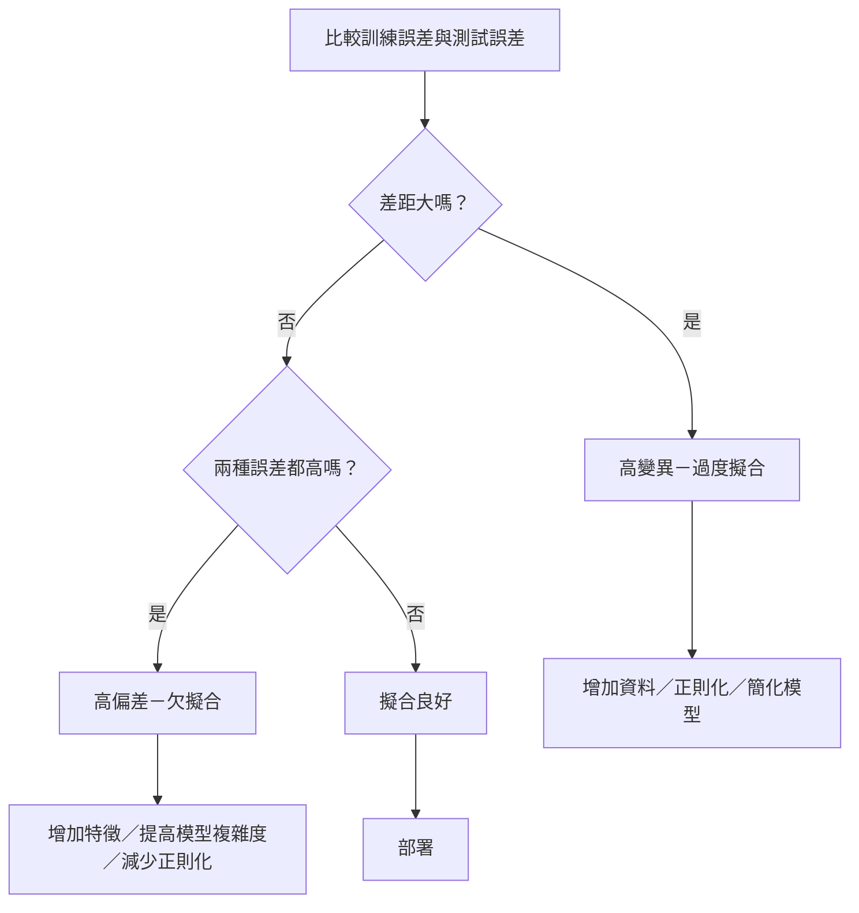
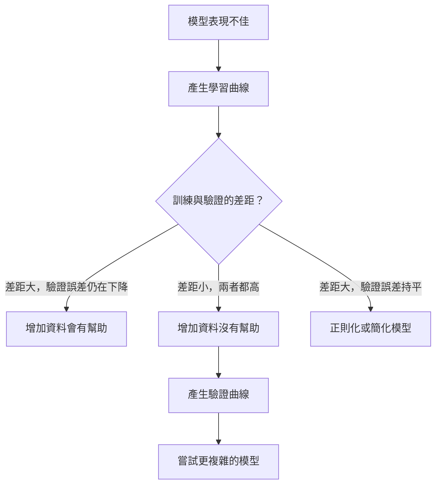

# 偏差－變異取捨

> 模型誤差只來自三種來源之一：偏差、變異或雜訊。你只能控制前兩者。

**Type:** Learn
**Language:** Python
**Prerequisites:** Phase 2, Lessons 01-09 (ML basics, regression, classification, evaluation)
**Time:** ~75 minutes

## 學習目標

- 推導預期預測誤差的偏差－變異分解，並說明不可約雜訊的作用
- 根據訓練誤差和測試誤差的模式，診斷模型是否有高偏差或高變異問題
- 說明正則化技巧（L1、L2、dropout、提前停止）如何在偏差與變異之間取捨
- 設計實驗，視覺化模型複雜度增加時的偏差－變異取捨

## 問題

你訓練好一個模型，它在測試資料上有誤差。這個誤差從哪裡來？

如果模型太簡單（用線性迴歸擬合曲線資料），就會持續錯過真實模式，這是偏差。如果模型太複雜（用 20 次多項式擬合 15 筆資料），它會完美擬合訓練資料，但對新資料的預測會大幅波動，這是變異。

在模型容量固定時，你無法同時將兩者最小化。降低偏差會提高變異；降低變異會提高偏差。理解這種取捨，是機器學習中最實用的診斷能力。它能告訴你應該增加或降低模型複雜度、蒐集更多資料或設計更好的特徵，以及加強或減弱正則化。

## 核心概念

### 偏差：系統性誤差

偏差衡量模型的平均預測與真實值相差多遠。如果用來自相同分布的許多不同訓練集訓練相同模型，再將預測取平均，這個平均預測與真實值之間的差距就是偏差。

高偏差表示模型太僵化，無法掌握真實模式。不論提供多少資料，用直線擬合拋物線都會漏掉曲線。這就是欠擬合。

```text
高偏差（欠擬合）：
  模型總是預測差不多的錯誤結果。
  訓練誤差：高
  測試誤差：高
  兩者差距：小
```

### 變異：對訓練資料的敏感度

變異衡量模型使用不同資料子集訓練時，預測會改變多少。若訓練資料稍有變化，模型就大幅改變，代表變異很高。

高變異表示模型擬合的是訓練資料中的雜訊，而非背後的訊號。20 次多項式會穿過每個訓練點，卻在點與點之間劇烈震盪。這就是過度擬合。

```text
高變異（過度擬合）：
  模型完美擬合訓練資料，卻無法處理新資料。
  訓練誤差：低
  測試誤差：高
  兩者差距：大
```

### 誤差分解

對任意點 x，平方損失下的預期預測誤差可精確分解如下：

```text
預期誤差 = 偏差^2 + 變異 + 不可約雜訊

其中：
  偏差^2  = (E[f_hat(x)] - f(x))^2
  變異    = E[(f_hat(x) - E[f_hat(x)])^2]
  雜訊    = E[(y - f(x))^2]             (sigma^2)
```

- `f(x)` 是真實函式
- `f_hat(x)` 是模型預測
- `E[...]` 是對不同訓練集取期望值
- `y` 是觀察到的標籤（真實函式加上雜訊）

雜訊項不可約。對有雜訊的資料，任何模型的表現都不可能優於 sigma^2。你的工作是找到 bias^2 和 variance 之間的平衡。

### 模型複雜度與誤差


經典的 U 形曲線：

| 複雜度 | 偏差 | 變異 | 總誤差 |
|--------|------|------|--------|
| 太低 | 高 | 低 | 高（欠擬合）|
| 恰到好處 | 中 | 中 | 最低 |
| 太高 | 低 | 高 | 高（過度擬合）|

### 用正則化控制偏差與變異

正則化會刻意提高偏差，以降低變異。它會限制模型，避免模型追著雜訊跑。

- **L2（Ridge）：** 將所有權重往零縮小，保留所有特徵，但降低各特徵的影響。
- **L1（Lasso）：** 將部分權重精確壓到零，藉此進行特徵選擇。
- **Dropout：** 訓練時隨機停用神經元，促使模型建立冗餘表示法。
- **提前停止：** 在模型完全擬合訓練資料前停止訓練。

正則化強度（lambda、dropout 比例、epoch 數量）會直接控制模型位於偏差－變異曲線上的位置。正則化越強，偏差越高、變異越低。

### 雙重下降：現代觀點

經典理論認為，超過最佳點後，增加模型複雜度只會讓表現變差。但 2019 年以來的研究發現一個令人意外的現象：如果持續增加模型容量，遠超過插值閾值（模型參數足以完美擬合訓練資料的點），測試誤差可能再次下降。


這種「雙重下降」現象，解釋了為何參數數量遠超過訓練範例的大型神經網路，仍然能良好泛化。經典偏差－變異取捨理論並沒有錯，但無法完整描述現代模型的狀況。

雙重下降的幾項觀察：
- 線性模型、決策樹和神經網路都會出現
- 在插值區域中，增加資料也可能讓表現變差（依樣本數變化的雙重下降）
- 增加訓練 epoch 也可能產生雙重下降（依 epoch 變化的雙重下降）
- 正則化能讓峰值較平滑，但無法消除峰值

為什麼會發生？到達插值閾值時，模型容量剛好足以擬合所有訓練點。模型被迫採用一個非常特殊、穿過每個點的解，資料稍微擾動就會讓擬合結果大幅改變，因此變異在此達到高峰。超過閾值後，模型有許多能完美擬合資料的解。學習演算法（例如帶有隱式正則化的梯度下降）通常會選擇其中最簡單的解。模型偏好簡單解的隱式偏差，正是過度參數化模型仍能泛化的原因。

| 模型區間 | 參數數量與樣本數 | 行為 |
|----------|------------------|------|
| 參數不足 | p << n | 遵循經典取捨 |
| 插值閾值 | p ~ n | 變異達到高峰，測試誤差暴增 |
| 過度參數化 | p >> n | 隱式正則化開始作用，測試誤差下降 |

實務上，若使用神經網路或大型樹集成，不要停在插值閾值。應該藉由明確正則化維持在閾值以下，或直接遠超過閾值。最糟的情況是剛好停在閾值上。

### 診斷模型



| 徵兆 | 診斷 | 改善方法 |
|------|------|----------|
| 訓練誤差高、測試誤差高 | 偏差 | 加入特徵、改用複雜模型、減少正則化 |
| 訓練誤差低、測試誤差高 | 變異 | 蒐集更多資料、正則化、簡化模型、使用 dropout |
| 訓練誤差低、測試誤差低 | 擬合良好 | 部署 |
| 訓練誤差下降、測試誤差上升 | 正在過度擬合 | 提前停止 |

### 實務策略

**偏差是問題時：**
- 加入多項式或交互作用特徵
- 改用更有彈性的模型（例如用樹集成取代線性模型）
- 降低正則化強度
- 若尚未收斂，延長訓練時間

**變異是問題時：**
- 蒐集更多訓練資料
- 使用 Bagging（例如隨機森林）
- 加強正則化（提高 lambda、增加 dropout）
- 選擇特徵（移除雜訊特徵）
- 使用交叉驗證及早發現

### 集成方法與降低變異

集成方法是實務上最有效的降低變異工具。

**Bagging（自助聚合）**會在訓練資料的不同自助樣本上訓練多個模型，再將預測取平均。個別模型的變異很高，但平均後的變異會低很多。隨機森林就是套用在決策樹上的 Bagging。

數學上有效的原因是：若將 N 個彼此獨立、變異數皆為 sigma^2 的預測取平均，平均值的變異數會是 sigma^2 / N。這些模型並非完全獨立（它們看到的資料相似），因此降低幅度不會達到 1/N，但效果仍然明顯。

**Boosting**會依序建立模型，每個新模型都專注修正集成目前的錯誤，以降低偏差。梯度提升和 AdaBoost 是主要例子。模型數量太多時，Boosting 也會過度擬合，因此需要提前停止或正則化。

| 方法 | 主要效果 | 偏差變化 | 變異變化 |
|------|----------|----------|----------|
| Bagging | 降低變異 | 不變 | 降低 |
| Boosting | 降低偏差 | 降低 | 可能提高 |
| Stacking | 兩者都降低 | 取決於次級學習器 | 取決於基礎模型 |
| Dropout | 隱式 Bagging | 稍微提高 | 降低 |

**實用原則：** 基礎模型變異高（深樹、高次多項式）時，使用 Bagging；基礎模型偏差高（淺層樹樁、簡單線性模型）時，使用 Boosting。

### 學習曲線

學習曲線會繪製訓練集大小與訓練、驗證誤差的關係，是最實用的診斷工具。與單次訓練／測試比較不同，學習曲線會呈現模型的變化趨勢，並指出增加資料是否有幫助。


解讀方式如下：

| 情況 | 訓練誤差 | 驗證誤差 | 差距 | 意義 | 改善方式 |
|------|----------|----------|------|------|----------|
| 高偏差 | 高 | 高 | 小 | 模型無法掌握模式 | 加入特徵、提高模型複雜度、減少正則化 |
| 高變異 | 低 | 高 | 大 | 模型記住訓練資料 | 蒐集更多資料、正則化、簡化模型 |
| 擬合良好 | 中 | 中 | 小 | 模型泛化良好 | 部署 |
| 高變異，持續改善 | 低 | 資料增加時下降 | 縮小中 | 資料能改善變異問題 | 蒐集更多資料 |
| 高偏差，曲線平坦 | 高 | 高且平坦 | 小且平坦 | 增加資料沒有幫助 | 改變模型架構 |

關鍵觀念是：若兩條曲線都已趨於平坦、差距很小但誤差都很高，增加資料沒有用，你需要更好的模型。若差距很大但持續縮小，增加資料會有幫助。

### 如何產生學習曲線

有兩種方式：

**方式 1：固定模型，改變訓練集大小。** 固定模型與超參數，使用越來越大的訓練資料子集訓練，再記錄各個資料量下的訓練與驗證誤差。這是標準的學習曲線。

**方式 2：固定資料，改變模型複雜度。** 固定資料，依序改變複雜度參數（多項式次數、樹深度、層數），並測量各個複雜度下的訓練與驗證誤差。這是驗證曲線，能直接呈現偏差－變異取捨。

兩種方式互補：第一種告訴你增加資料是否有用，第二種告訴你更換模型是否有用。決定下一步之前，兩種都要執行。



```figure
bias-variance
```

## Build It：從零實作

`code/bias_variance.py` 會執行完整的偏差－變異分解實驗，以下逐步說明實作方式。

### 步驟 1：從已知函式產生合成資料

我們使用 `f(x) = sin(1.5x) + 0.5x`，再加入高斯雜訊。知道真實函式後，就能精確計算偏差和變異。

```python
def true_function(x):
    return np.sin(1.5 * x) + 0.5 * x

def generate_data(n_samples=30, noise_std=0.5, x_range=(-3, 3), seed=None):
    rng = np.random.RandomState(seed)
    x = rng.uniform(x_range[0], x_range[1], n_samples)
    y = true_function(x) + rng.normal(0, noise_std, n_samples)
    return x, y
```

### 步驟 2：自助抽樣與多項式擬合

對每個多項式次數，抽取多個自助訓練集、擬合多項式，並在固定測試網格上記錄預測值。如此就能得到各測試點預測值的分布。

```python
def fit_polynomial(x_train, y_train, degree, lam=0.0):
    X = np.column_stack([x_train ** d for d in range(degree + 1)])
    if lam > 0:
        penalty = lam * np.eye(X.shape[1])
        penalty[0, 0] = 0
        w = np.linalg.solve(X.T @ X + penalty, X.T @ y_train)
    else:
        w = np.linalg.lstsq(X, y_train, rcond=None)[0]
    return w
```

我們會使用 200 個不同的自助樣本進行擬合。每個樣本都來自相同的底層分布，但包含不同資料點。

### 步驟 3：計算偏差平方與變異分解

每個測試點有 200 組預測值，因此可直接依照定義計算分解：

```python
mean_pred = predictions.mean(axis=0)
bias_sq = np.mean((mean_pred - y_true) ** 2)
variance = np.mean(predictions.var(axis=0))
total_error = np.mean(np.mean((predictions - y_true) ** 2, axis=1))
```

- `mean_pred` 是從自助樣本估計的 E[f_hat(x)]
- `bias_sq` 是平均預測與真實值之間差距的平方
- `variance` 是各預測值在自助樣本間的平均分散程度
- `total_error` 應約等於 bias^2 + variance + noise

### 步驟 4：學習曲線

學習曲線會固定模型複雜度並改變訓練集大小，顯示模型是受限於資料量還是模型容量。

```python
def demo_learning_curves():
    sizes = [10, 15, 20, 30, 50, 75, 100, 150, 200, 300]
    degree = 5

    for n in sizes:
        train_errors = []
        test_errors = []
        for seed in range(50):
            x_train, y_train = generate_data(n_samples=n, seed=seed * 100)
            w = fit_polynomial(x_train, y_train, degree)
            train_pred = predict_polynomial(x_train, w)
            train_mse = np.mean((train_pred - y_train) ** 2)
            test_pred = predict_polynomial(x_test, w)
            test_mse = np.mean((test_pred - y_test) ** 2)
            train_errors.append(train_mse)
            test_errors.append(test_mse)
        # Average over runs gives the learning curve point
```

對高變異模型（資料少、5 次多項式），你會看到：
- 訓練誤差一開始很低，隨著資料增加、記憶變難而上升
- 測試誤差一開始很高，隨著模型取得更多訊號而下降
- 資料越多，兩者差距越小

對高偏差模型（1 次多項式），兩種誤差都會快速收斂到相同的高值，增加資料沒有幫助。

### 步驟 5：掃描正則化強度

程式也包含 `demo_regularization_sweep()`：固定高次多項式（15 次），將 Ridge 正則化強度從 0.001 掃描到 100。這能從另一個角度呈現偏差－變異取捨：不改變模型複雜度，而改變限制強度。

```python
def demo_regularization_sweep():
    alphas = [0.001, 0.005, 0.01, 0.05, 0.1, 0.5, 1.0, 5.0, 10.0, 50.0, 100.0]
    for alpha in alphas:
        results = bias_variance_decomposition([15], lam=alpha)
        r = results[15]
        print(f"alpha={alpha:.3f}  bias={r['bias_sq']:.4f}  var={r['variance']:.4f}")
```

alpha 低時，15 次多項式幾乎不受限制。模型會追著每個自助樣本中的雜訊跑，因此變異占主導。alpha 高時，懲罰非常強，模型實際上接近常數函式，因此偏差占主導。最佳 alpha 位於兩者之間。

這和調整多項式次數時出現的 U 形曲線相同，但使用連續旋鈕控制，而非離散設定。實務上，正則化是較好的控制方式，因為它能細緻調整取捨，不必改動特徵集合。

## Use It：實際應用

sklearn 提供 `learning_curve` 和 `validation_curve`，可自動執行這些診斷，不必自行撰寫自助抽樣迴圈。

### 驗證曲線：掃描模型複雜度

```python
from sklearn.model_selection import validation_curve
from sklearn.pipeline import make_pipeline
from sklearn.preprocessing import PolynomialFeatures
from sklearn.linear_model import Ridge

degrees = list(range(1, 16))
train_scores_all = []
val_scores_all = []

for d in degrees:
    pipe = make_pipeline(PolynomialFeatures(d), Ridge(alpha=0.01))
    train_scores, val_scores = validation_curve(
        pipe, X, y, param_name="polynomialfeatures__degree",
        param_range=[d], cv=5, scoring="neg_mean_squared_error"
    )
    train_scores_all.append(-train_scores.mean())
    val_scores_all.append(-val_scores.mean())
```

這會直接呈現偏差－變異取捨曲線。驗證分數相較訓練分數最差時，代表變異占主導；兩種分數都很差時，代表偏差占主導。

### 學習曲線：掃描訓練集大小

```python
from sklearn.model_selection import learning_curve

pipe = make_pipeline(PolynomialFeatures(5), Ridge(alpha=0.01))
train_sizes, train_scores, val_scores = learning_curve(
    pipe, X, y, train_sizes=np.linspace(0.1, 1.0, 10),
    cv=5, scoring="neg_mean_squared_error"
)
train_mse = -train_scores.mean(axis=1)
val_mse = -val_scores.mean(axis=1)
```

繪製 `train_mse` 和 `val_mse` 隨 `train_sizes` 變化的曲線，曲線形狀能告訴你模型的所有狀況。

### 使用正則化掃描進行交叉驗證

```python
from sklearn.model_selection import cross_val_score

alphas = [0.001, 0.01, 0.1, 1.0, 10.0, 100.0]
for alpha in alphas:
    pipe = make_pipeline(PolynomialFeatures(10), Ridge(alpha=alpha))
    scores = cross_val_score(pipe, X, y, cv=5, scoring="neg_mean_squared_error")
    print(f"alpha={alpha:>7.3f}  MSE={-scores.mean():.4f} +/- {scores.std():.4f}")
```

在固定模型複雜度下掃描正則化強度，會看到相同的偏差－變異取捨：alpha 低代表變異高，alpha 高代表偏差高。

### 綜合使用：完整診斷流程

實務上請依序執行以下診斷：

1. 訓練模型，計算訓練誤差和測試誤差。
2. 若兩者都高，代表偏差問題，跳到步驟 4。
3. 若訓練誤差低、測試誤差高，代表變異問題。產生學習曲線，確認增加資料是否有幫助；若沒有，就加強正則化。
4. 掃描主要複雜度參數，產生驗證曲線並找出最佳點。
5. 在最佳點產生學習曲線。若差距仍大，就需要更多資料或正則化。
6. 使用 `cross_val_score`，以不同 alpha 值測試 Ridge/Lasso，選擇交叉驗證誤差最低的 alpha。

多數表格資料集只需 10 到 15 分鐘運算，就能省下數小時的盲目猜測。

## Ship It：交付成果

本課程會產生：`outputs/prompt-model-diagnostics.md`

## Exercises：練習

1. 將 noise_std 設為 0（沒有雜訊）後執行分解。不可約誤差項會如何變化？最佳模型複雜度會改變嗎？

2. 將訓練集大小從 30 增加到 300，觀察變異項如何改變。最佳多項式次數會移動嗎？

3. 在實驗中加入 L2 正則化（Ridge 迴歸）。固定使用 15 次多項式，讓 lambda 從 0 掃描到 100，並繪製偏差平方和變異隨 lambda 改變的曲線。

4. 將真實函式從多項式改成 `sin(x)`。偏差－變異分解會如何改變？是否仍有明確的最佳次數？

5. 實作簡單的 Bagging 包裝器：在自助樣本上訓練 10 個模型，並將預測取平均。展示變異如何降低，而偏差幾乎不變。

## 關鍵詞

| 術語 | 一般說法 | 實際意義 |
|------|----------|----------|
| 偏差 |「模型太簡單」| 假設錯誤所造成的系統性誤差，也就是模型平均預測與真實值之間的差距 |
| 變異 |「模型過度擬合」| 對訓練資料敏感所造成的誤差，衡量不同訓練集下預測改變多少 |
| 不可約誤差 |「資料中的雜訊」| 來自真實資料產生過程中隨機性的誤差，任何模型都無法消除 |
| 欠擬合 |「學得不夠」| 模型偏差高，即使在訓練資料上也無法掌握真實模式 |
| 過度擬合 |「記住資料」| 模型變異高，擬合了無法泛化的訓練雜訊 |
| 正則化 |「限制模型」| 加入懲罰以降低模型複雜度，犧牲偏差以降低變異 |
| 雙重下降 |「參數增加可能有幫助」| 模型容量遠超過插值閾值後，測試誤差再次下降 |
| 模型複雜度 |「模型有多靈活」| 模型擬合任意模式的容量，可由架構、特徵或正則化控制 |

## 延伸閱讀

- [Hastie、Tibshirani、Friedman：《Elements of Statistical Learning》第 7 章](https://hastie.su.domains/ElemStatLearn/)：深入介紹偏差－變異分解的權威著作
- [Belkin 等人：〈Reconciling modern machine learning practice and the bias-variance trade-off〉（2019）](https://arxiv.org/abs/1812.11118)：提出雙重下降的論文
- [Nakkiran 等人：〈Deep Double Descent〉（2019）](https://arxiv.org/abs/1912.02292)：介紹依 epoch 數與樣本數變化的雙重下降
- [Scott Fortmann-Roe：理解偏差－變異取捨](http://scott.fortmann-roe.com/docs/BiasVariance.html)：清楚的視覺化解說
