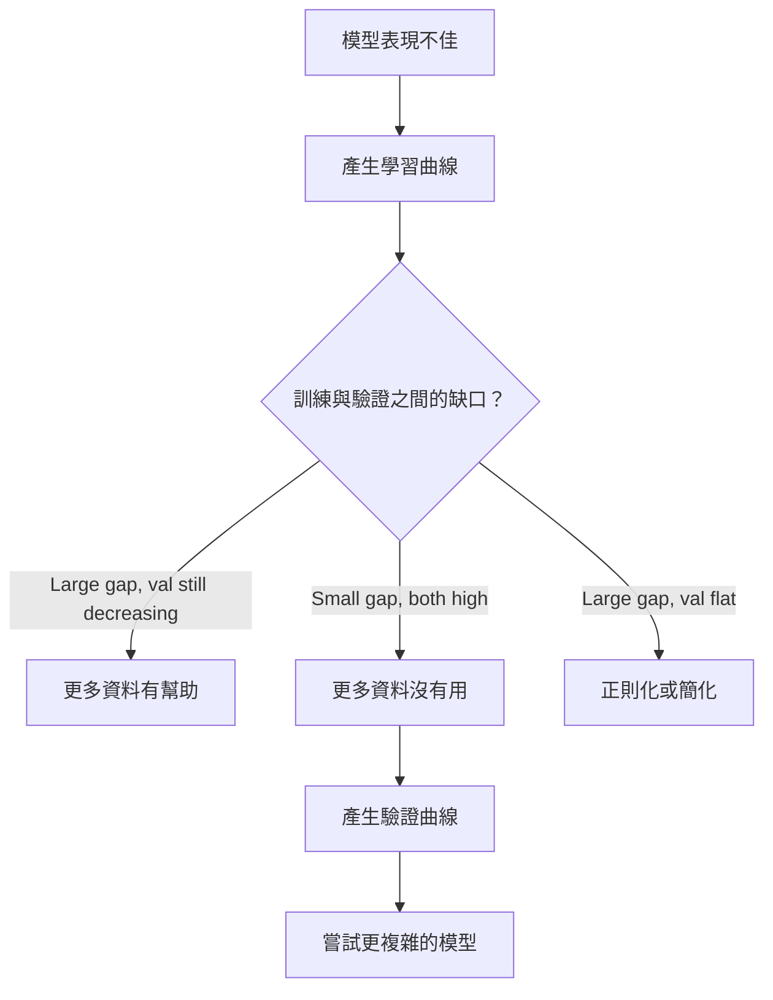

# 偏差－變異取捨（bias-variance tradeoff）

> 每個模型誤差都來自三個來源之一：偏差（bias）、變異（variance）或雜訊（noise）。你只能控制前兩個。

**Type:** Learn
**Language:** Python
**Prerequisites:** Phase 2, Lessons 01-09 (ML basics, regression, classification, evaluation)
**Time:** ~75 minutes

## Learning Objectives｜學習目標

- 推導期望預測誤差（expected prediction error）的偏差－變異分解（bias-variance decomposition），並說明不可約雜訊（irreducible noise）的角色
- 用訓練誤差（training error）與測試誤差（test error）的模式診斷模型是高偏差（high bias）還是高變異（high variance）
- 說明正則化（regularization）技術（L1、L2、dropout、提前停止（early stopping））如何用偏差換變異
- 實作實驗，把模型複雜度（model complexity）增加時的偏差－變異取捨視覺化

## The Problem｜問題

你訓練了一個模型。它在測試資料（test data）上有一些誤差。這些誤差是哪裡來的？

如果模型太簡單（在有彎曲的資料集（dataset）上做線性迴歸（linear regression）），它會一致地錯過真正的模式。那是偏差。如果模型太複雜（用 20 次（degree-20）多項式（polynomial）擬合 15 個資料點（data point）），它會完美擬合訓練資料（training data），卻在新資料上給出天差地遠的預測。那是變異。

在固定的模型容量（model capacity）下，兩者無法同時最小化。把偏差壓下去，變異就升上來；把變異壓下去，偏差就升上來。理解這個取捨，是機器學習（machine learning）中最有用的診斷技能。它告訴你該把模型變複雜還是變簡單、該拿更多資料還是做出更好的特徵（feature）、該加強還是放寬正則化。

## The Concept｜核心概念

### 偏差：系統性誤差

偏差衡量的是：模型預測的平均值離真實值有多遠。如果你從同一個分布（distribution）抽出許多不同的訓練集（training set），訓練同一個模型，再把所有預測取平均，偏差就是那個平均值與真相之間的落差。

高偏差代表模型太僵硬，捕捉不到真正的模式。拿直線去擬合拋物線，不管給它多少資料，它永遠都會錯過那條曲線。這就是欠擬合（underfitting）。

```
High bias (underfitting):
  Model always predicts roughly the same wrong thing.
  Training error: HIGH
  Test error: HIGH
  Gap between them: SMALL
```

### 變異：對訓練資料的敏感度

變異衡量的是：換一批訓練資料時，你的預測會變動多大。如果訓練集的小小變動就造成模型的大幅改變，變異就很高。

高變異代表模型在擬合訓練資料裡的雜訊，而不是底層的訊號（signal）。20 次（degree-20）多項式會穿過每一個訓練點，卻在點與點之間劇烈震盪。這就是過度擬合（overfitting）。

```
High variance (overfitting):
  Model fits training data perfectly but fails on new data.
  Training error: LOW
  Test error: HIGH
  Gap between them: LARGE
```

### 分解

對任意一點 x，平方損失下的期望預測誤差可以精確分解為：

```
Expected Error = Bias^2 + Variance + Irreducible Noise

where:
  Bias^2   = (E[f_hat(x)] - f(x))^2
  Variance = E[(f_hat(x) - E[f_hat(x)])^2]
  Noise    = E[(y - f(x))^2]             (sigma^2)
```

- `f(x)` 是真實函數
- `f_hat(x)` 是模型的預測
- `E[...]` 是對不同訓練集取的期望值
- `y` 是觀測到的標籤（label）（真實函數加上雜訊）

雜訊項是不可約的。在有雜訊的資料上，沒有任何模型能比 sigma^2 做得更好。你的工作是在 bias^2 與 variance 之間找到正確的平衡點。

### 模型複雜度與誤差


經典的 U 形曲線：

| 複雜度 | 偏差 | 變異 | 總誤差 |
|-----------|------|----------|-------------|
| 太低 | 高 | 低 | 高（欠擬合） |
| 剛好 | 中等 | 中等 | 最低 |
| 太高 | 低 | 高 | 高（過度擬合） |

### 用正則化控制偏差－變異

正則化刻意增加偏差來換取更低的變異。它約束模型，讓模型追不了雜訊。

- **L2（嶺迴歸 Ridge）：** 把所有權重（weight）往零的方向縮小。保留所有特徵，但降低它們的影響力。
- **L1（LASSO）：** 把部分權重恰好壓成零，順便做特徵選擇（feature selection）。
- **Dropout：** 訓練時隨機關掉一些神經元（neuron），迫使模型學出冗餘的表示。
- **提前停止：** 在模型完全擬合訓練資料之前就停止訓練。

正則化強度（regularization strength，lambda、dropout 比例、epoch 數）直接控制你在偏差－變異曲線上的位置。正則化越強，偏差越高、變異越低。

### 雙重下降：現代觀點

古典理論說：過了甜蜜點（sweet spot）之後，增加複雜度只會愈來愈糟。但 2019 年以來的研究發現了出乎意料的事。如果繼續增加模型容量（model capacity），遠遠超過插值閾值（interpolation threshold）（模型參數數量剛好足以完美擬合訓練資料的點），測試誤差會再度下降。


這種「雙重下降（double descent）」現象解釋了為什麼大幅過度參數化（overparameterized）的神經網路（neural network；參數遠多於訓練樣本）依然能泛化（generalization）得很好。古典的偏差－變異取捨沒有錯，但對現代區間而言並不完整。

關於雙重下降的幾個重點：
- 線性模型、決策樹（decision tree）和神經網路都會發生
- 在插值區間，更多資料反而可能有害（樣本數方向的雙重下降（sample-wise double descent））
- 更多訓練 epoch 也可能引發訓練 epoch 方向的雙重下降（epoch-wise double descent）
- 正則化會把那個峰值抹平，但不會消除它

為什麼會這樣？在插值閾值上，模型的容量恰好足以擬合所有訓練點。它被迫找出一個非常特定的、穿過每一個點的解，資料的小小擾動就會造成擬合的巨大變化——這正是變異的峰頂。超過閾值之後，能完美擬合資料的解有非常多個，學習演算法（例如帶有隱式正則化（implicit regularization）的梯度下降法（gradient descent））傾向從中挑出最簡單的那個。這種對簡單解的隱性偏好，就是過度參數化模型能泛化的原因。

| 區間 | 參數數量 vs 樣本數 | 行為 |
|--------|----------------------|----------|
| 參數不足 | p << n | 適用古典取捨 |
| 插值閾值 | p ~ n | 變異達到峰值，測試誤差飆升 |
| 過度參數化 | p >> n | 隱式正則化接手，測試誤差下降 |

實務上：如果你用的是神經網路或大型樹集成（ensemble），不要停在插值閾值上。要麼遠低於它（搭配明確的正則化），要麼遠超過它。最糟的位置就是正好站在閾值上。

### 診斷你的模型


| 症狀 | 診斷 | 解法 |
|---------|-----------|-----|
| 訓練誤差高、測試誤差高 | 偏差 | 更多特徵、更複雜的模型、減少正則化 |
| 訓練誤差低、測試誤差高 | 變異 | 更多資料、正則化、更簡單的模型、dropout |
| 訓練誤差低、測試誤差低 | 擬合良好 | 交付 |
| 訓練誤差下降中、測試誤差上升中 | 正在過度擬合 | 提前停止 |

### 實務策略

**當問題是偏差時：**
- 加入多項式或交互作用特徵
- 換用更彈性的模型（例如用樹集成取代線性模型）
- 降低正則化強度
- 訓練更久（如果尚未收斂（convergence））

**當問題是變異時：**
- 拿更多訓練資料
- 用 bagging——例如隨機森林（random forest）
- 加強正則化（更大的 lambda、更多 dropout）
- 做特徵選擇（移除帶雜訊的特徵）
- 用交叉驗證（cross-validation）及早發現

### 集成方法與降低變異

集成方法（ensemble method）是對付變異最實用的工具。

**Bagging（bootstrap 聚合，bootstrap aggregating）** 在訓練資料的不同 bootstrap 樣本上訓練多個模型，再把預測取平均。每個個別模型的變異都很高，但平均之後變異就低得多。隨機森林就是把 bagging 套用在決策樹上。

數學上為什麼有效：如果平均 N 個獨立預測，每個的變異都是 sigma^2，那平均值的變異就是 sigma^2 / N。這些模型並非真正獨立（它們看到的資料很類似），所以實際降幅不到 1/N，但依然可觀。

**Boosting** 則是降低偏差：它依序建立模型，每個新模型都專注修正集成到目前為止的錯誤。gradient boosting 和 AdaBoost 是主要例子。boosting 加太多模型也會過度擬合，所以需要提前停止或正則化。

| 方法 | 主要效果 | 偏差變化 | 變異變化 |
|--------|---------------|-------------|-----------------|
| Bagging | 降低變異 | 不變 | 下降 |
| Boosting | 降低偏差 | 下降 | 可能上升 |
| Stacking | 兩者都降 | 取決於元學習器（meta-learner） | 取決於基模型（base model） |
| Dropout | 隱式 bagging | 微升 | 下降 |

**實務法則：** 如果基模型是高變異型（深層決策樹、高次多項式），用 bagging；如果基模型是高偏差型（淺層樹樁（shallow stump）、簡單線性模型），用 boosting。

### 學習曲線（learning curve）

學習曲線把訓練誤差與驗證誤差（validation error）畫成訓練集大小的函數。它是你手邊最實用的診斷工具。不同於單次的訓練／測試比較，學習曲線讓你看到模型的變化軌跡，並告訴你更多資料是否有幫助。


怎麼讀：

| 情境 | 訓練誤差 | 驗證誤差 | 缺口 | 代表什麼 | 該怎麼做 |
|----------|---------------|-----------------|-----|---------------|------------|
| 高偏差 | 高 | 高 | 小 | 模型捕捉不到模式 | 更多特徵、更複雜的模型、減少正則化 |
| 高變異 | 低 | 高 | 大 | 模型在背訓練資料 | 更多資料、正則化、更簡單的模型 |
| 擬合良好 | 中等 | 中等 | 小 | 模型泛化良好 | 交付 |
| 高變異、改善中 | 低 | 隨資料增加而下降 | 縮小中 | 資料可以解決的變異問題 | 蒐集更多資料 |
| 高偏差、持平 | 高 | 高且持平 | 小且持平 | 更多資料沒有用 | 改模型架構 |

關鍵洞察：如果兩條曲線都進入平台期、缺口很小但兩個誤差都高，更多資料也沒用——你需要更好的模型。如果缺口很大而且還在縮小，更多資料就有幫助。

### 如何產生學習曲線

有兩種做法：

**做法一：改變訓練集大小，固定模型。** 固定模型與超參數（hyperparameter）不變，用愈來愈大的訓練資料子集訓練，在每個大小測量訓練誤差與驗證誤差。這是標準的學習曲線。

**做法二：改變模型複雜度，固定資料。** 固定資料不變，掃過一個複雜度參數（多項式次數、樹深度、層數），在每個複雜度測量訓練誤差與驗證誤差。這是驗證曲線（validation curve），直接呈現偏差－變異取捨。

兩種做法互補。第一種告訴你更多資料是否有幫助；第二種告訴你換個模型是否有幫助。決定下一步之前，兩個都跑。



```figure
bias-variance
```

## Build It｜動手實作

`code/bias_variance.py` 裡的程式碼會跑完整的偏差－變異分解實驗。以下逐步說明做法。

### 步驟 1：從已知函數產生合成資料

我們使用 `f(x) = sin(1.5x) + 0.5x` 加上高斯雜訊（Gaussian noise）。知道真實函數，我們才能算出精確的偏差與變異。

```python
def true_function(x):
    return np.sin(1.5 * x) + 0.5 * x

def generate_data(n_samples=30, noise_std=0.5, x_range=(-3, 3), seed=None):
    rng = np.random.RandomState(seed)
    x = rng.uniform(x_range[0], x_range[1], n_samples)
    y = true_function(x) + rng.normal(0, noise_std, n_samples)
    return x, y
```

### 步驟 2：Bootstrap 抽樣與多項式擬合

對每個多項式次數，我們抽出許多 bootstrap 訓練集、擬合多項式，並在固定的測試網格上記錄預測。這讓我們在每個測試點上都有一組預測的分布（distribution）。

```python
def fit_polynomial(x_train, y_train, degree, lam=0.0):
    X = np.column_stack([x_train ** d for d in range(degree + 1)])
    if lam > 0:
        penalty = lam * np.eye(X.shape[1])
        penalty[0, 0] = 0
        w = np.linalg.solve(X.T @ X + penalty, X.T @ y_train)
    else:
        w = np.linalg.lstsq(X, y_train, rcond=None)[0]
    return w
```

我們在 200 個不同的 bootstrap 樣本上擬合。每個 bootstrap 樣本都抽自同一個底層分布（distribution），但包含的點不同。

### 步驟 3：計算偏差平方與變異的分解

有了每個測試點上的 200 組預測，我們可以直接照定義計算分解：

```python
mean_pred = predictions.mean(axis=0)
bias_sq = np.mean((mean_pred - y_true) ** 2)
variance = np.mean(predictions.var(axis=0))
total_error = np.mean(np.mean((predictions - y_true) ** 2, axis=1))
```

- `mean_pred` 是從 bootstrap 樣本估出的 E[f_hat(x)]
- `bias_sq` 是平均預測與真相之間的平方落差
- `variance` 是各 bootstrap 樣本間預測分散程度的平均
- `total_error` 應該約等於 bias^2 + variance + noise

### 步驟 4：學習曲線

學習曲線固定模型複雜度，掃過不同的訓練集大小。它顯示你的模型是受限於資料還是受限於容量。

```python
def demo_learning_curves():
    sizes = [10, 15, 20, 30, 50, 75, 100, 150, 200, 300]
    degree = 5

    for n in sizes:
        train_errors = []
        test_errors = []
        for seed in range(50):
            x_train, y_train = generate_data(n_samples=n, seed=seed * 100)
            w = fit_polynomial(x_train, y_train, degree)
            train_pred = predict_polynomial(x_train, w)
            train_mse = np.mean((train_pred - y_train) ** 2)
            test_pred = predict_polynomial(x_test, w)
            test_mse = np.mean((test_pred - y_test) ** 2)
            train_errors.append(train_mse)
            test_errors.append(test_mse)
        # Average over runs gives the learning curve point
```

對高變異模型（小資料配 5 次多項式），你會看到：
- 訓練誤差一開始很低，隨著資料變多、背誦變難而上升
- 測試誤差一開始很高，隨著模型拿到更多訊號而下降
- 缺口隨資料增加而縮小

對高偏差模型（1 次多項式），兩個誤差很快就收斂到同樣的高處，再多資料也沒用。

### 步驟 5：正則化強度掃描

程式碼還包含 `demo_regularization_sweep()`：固定一個高次多項式（15 次），掃過 0.001 到 100 的嶺迴歸正則化強度。這從另一個角度呈現偏差－變異取捨——不改變模型複雜度，而是改變約束強度。

```python
def demo_regularization_sweep():
    alphas = [0.001, 0.005, 0.01, 0.05, 0.1, 0.5, 1.0, 5.0, 10.0, 50.0, 100.0]
    for alpha in alphas:
        results = bias_variance_decomposition([15], lam=alpha)
        r = results[15]
        print(f"alpha={alpha:.3f}  bias={r['bias_sq']:.4f}  var={r['variance']:.4f}")
```

alpha 低的時候，15 次多項式幾乎不受約束，模型會去追每個 bootstrap 樣本裡的雜訊，變異主導。alpha 高的時候，懲罰強到模型實際上變成近乎常數的函數，偏差主導。最佳 alpha 就在這兩個極端之間。

這和掃多項式次數是同一條 U 形曲線，只是控制的旋鈕從離散變成連續。實務上，正則化是控制這個取捨的首選方式，因為它不必改變特徵集就能做到細緻的調整。

## Use It｜實際應用

sklearn 提供 `learning_curve` 與 `validation_curve`，不用自己寫 bootstrap 迴圈就能自動化這些診斷。

### 驗證曲線：掃模型複雜度

```python
from sklearn.model_selection import validation_curve
from sklearn.pipeline import make_pipeline
from sklearn.preprocessing import PolynomialFeatures
from sklearn.linear_model import Ridge

degrees = list(range(1, 16))
train_scores_all = []
val_scores_all = []

for d in degrees:
    pipe = make_pipeline(PolynomialFeatures(d), Ridge(alpha=0.01))
    train_scores, val_scores = validation_curve(
        pipe, X, y, param_name="polynomialfeatures__degree",
        param_range=[d], cv=5, scoring="neg_mean_squared_error"
    )
    train_scores_all.append(-train_scores.mean())
    val_scores_all.append(-val_scores.mean())
```

這直接給你偏差－變異取捨曲線。訓練與驗證分數差距最大的地方，是變異在主導；兩者都差的地方，是偏差在主導。

### 學習曲線：掃訓練集大小

```python
from sklearn.model_selection import learning_curve

pipe = make_pipeline(PolynomialFeatures(5), Ridge(alpha=0.01))
train_sizes, train_scores, val_scores = learning_curve(
    pipe, X, y, train_sizes=np.linspace(0.1, 1.0, 10),
    cv=5, scoring="neg_mean_squared_error"
)
train_mse = -train_scores.mean(axis=1)
val_mse = -val_scores.mean(axis=1)
```

把 `train_mse` 與 `val_mse` 對 `train_sizes` 畫出來，曲線的形狀就告訴你模型的一切狀況。

### 交叉驗證搭配正則化掃描

```python
from sklearn.model_selection import cross_val_score

alphas = [0.001, 0.01, 0.1, 1.0, 10.0, 100.0]
for alpha in alphas:
    pipe = make_pipeline(PolynomialFeatures(10), Ridge(alpha=alpha))
    scores = cross_val_score(pipe, X, y, cv=5, scoring="neg_mean_squared_error")
    print(f"alpha={alpha:>7.3f}  MSE={-scores.mean():.4f} +/- {scores.std():.4f}")
```

這是在固定模型複雜度下掃正則化強度。你會看到同樣的偏差－變異取捨：alpha 低代表高變異，alpha 高代表高偏差。

### 全部串起來：完整的診斷流程

實務上你依序跑這些診斷：

1. 訓練模型，計算訓練誤差與測試誤差。
2. 如果兩者都高：是偏差問題，跳到步驟 4。
3. 如果訓練誤差低但測試誤差高：是變異問題。產生學習曲線看更多資料是否有幫助；沒有就正則化。
4. 產生驗證曲線，掃過主要的複雜度參數，找出甜蜜點。
5. 在甜蜜點上產生學習曲線。如果缺口還是很大，你需要更多資料或正則化。
6. 用 `cross_val_score` 試不同的 alpha 值跑 Ridge／LASSO。選交叉驗證誤差最低的 alpha。

對大多數表格資料集，這整套只要 10–15 分鐘的計算，卻能省下好幾個小時的瞎猜。

## Ship It｜交付成果

本課會產出：`outputs/prompt-model-diagnostics.md`

## Exercises｜練習

1. 用 `noise_std=0`（無雜訊）跑分解。不可約誤差項會變成什麼？最佳複雜度會改變嗎？

2. 把訓練集大小從 30 增加到 300。這對變異成分有什麼影響？最佳多項式次數會偏移嗎？

3. 在實驗中加入 L2 正則化（嶺迴歸）。固定高次多項式（15 次），掃過 0 到 100 的 lambda。把 bias^2 與 variance 畫成 lambda 的函數。

4. 把真實函數從多項式改成 `sin(x)`。偏差－變異分解會有什麼變化？還有一個明確的最佳次數嗎？

5. 實作一個簡單的 bootstrap 聚合（bagging）包裝器：在 bootstrap 樣本上訓練 10 個模型並平均預測。展示這能降低變異，而偏差幾乎不增加。

## Key Terms｜關鍵術語

| 術語 | 常見說法 | 實際意思 |
|------|----------------|----------------------|
| 偏差（bias） | 「模型太簡單」 | 來自錯誤假設的系統性誤差。模型平均預測與真相之間的落差。 |
| 變異（variance） | 「模型過度擬合了」 | 來自對訓練資料敏感的誤差。換一批訓練集時預測變動的幅度。 |
| 不可約誤差（irreducible error） | 「資料裡的雜訊」 | 真實資料生成過程中隨機性造成的誤差，沒有模型能消除。 |
| 欠擬合（underfitting） | 「學得不夠」 | 模型偏差高。即使在訓練資料上也錯過真正的模式。 |
| 過度擬合（overfitting） | 「把資料背起來」 | 模型變異高。它擬合了訓練資料中無法泛化的雜訊。 |
| 正則化（regularization） | 「約束模型」 | 加入懲罰項以降低模型複雜度，用偏差換取更低的變異。 |
| 雙重下降（double descent） | 「參數更多反而有幫助」 | 當模型容量（model capacity）遠遠超過插值閾值時，測試誤差再度下降。 |
| 模型複雜度（model complexity） | 「模型有多彈性」 | 模型擬合任意模式的能力上限。由架構、特徵或正則化控制。 |

## Further Reading｜延伸閱讀

- [Hastie, Tibshirani, Friedman: Elements of Statistical Learning, Ch. 7](https://hastie.su.domains/ElemStatLearn/)——偏差－變異分解的權威論述
- [Belkin et al., Reconciling modern machine learning practice and the bias-variance trade-off (2019)](https://arxiv.org/abs/1812.11118)——雙重下降論文
- [Nakkiran et al., Deep Double Descent (2019)](https://arxiv.org/abs/1912.02292)——epoch 維度與樣本維度的雙重下降
- [Scott Fortmann-Roe: Understanding the Bias-Variance Tradeoff](http://scott.fortmann-roe.com/docs/BiasVariance.html)——清楚的視覺化解說
