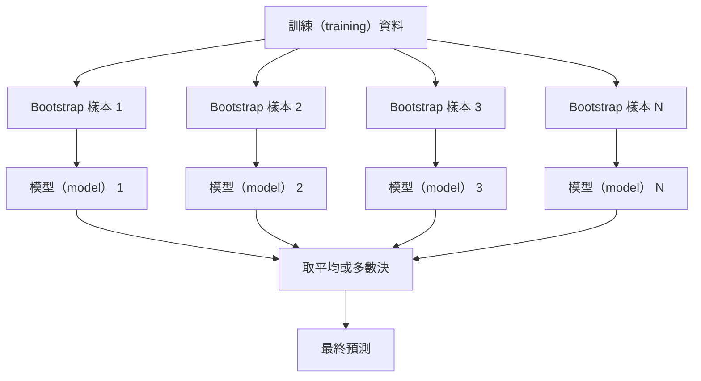
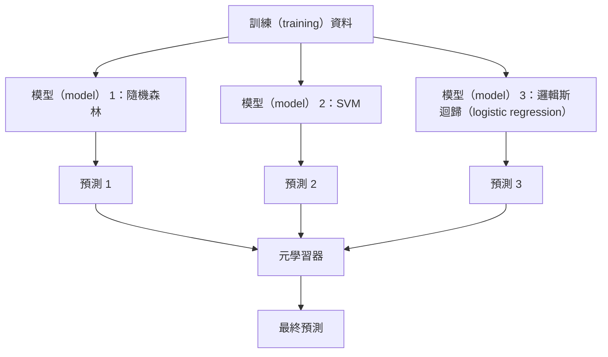

# 集成方法（ensemble method）

> 一群弱學習器（weak learner），只要組合得對，就會變成強學習器（strong learner）。這不是比喻——這是定理。

**Type:** Build
**Language:** Python
**Prerequisites:** Phase 2, Lesson 10 (Bias-Variance Tradeoff)
**Time:** ~120 minutes

## Learning Objectives｜學習目標

- 從頭實作 AdaBoost 與 gradient boosting，並說明 boosting 如何依序降低偏差（bias）
- 建立 bagging 集成，並示範對去相關的模型（model）取平均如何在不增加偏差的情況下降低變異（variance）
- 比較 bagging、boosting 與 stacking 各自針對哪種誤差成分
- 評估集成多樣性（ensemble diversity），並解釋為什麼獨立的弱學習器愈多，多數決（majority vote）準確率（accuracy）愈高

## The Problem｜問題

單一決策樹（decision tree）訓練（training）快、好解讀，但會過度擬合（overfitting）。單一線性模型（model）在複雜邊界上又會欠擬合（underfitting）。你可以花好幾天打造完美的模型（model）架構——或者，你也可以把一堆不完美的模型（model）組合起來，得到比其中任何一個都好的東西。

集成方法做的就是這件事。它們是在表格資料（tabular data）上贏得 Kaggle 競賽最可靠的技術，驅動了大多數正式環境的機器學習（machine learning）系統，也把偏差－變異取捨（bias-variance tradeoff）具體展現出來：bagging 降變異，boosting 降偏差，stacking 學習在哪些輸入上該信任哪些模型（model）。

## The Concept｜核心概念

### 為什麼集成有效

假設你有 N 個各自獨立的分類器（classifier），每個的準確率都是 p > 0.5。多數決的準確率是：

```
P(majority correct) = sum over k > N/2 of C(N,k) * p^k * (1-p)^(N-k)
```

每個準確率都是 60% 的 21 個分類器（classifier），多數決的準確率約為 74%；有 101 個時，會升到 84%。當各模型（model）犯的是不同的錯，錯誤會互相抵銷。

關鍵條件是**多樣性（diversity）**。如果所有模型（model）都犯一樣的錯，組合起來一點用都沒有。集成之所以有效，是因為它透過以下方式產生多樣的模型（model）：

- 不同的訓練（training）子集（bagging）
- 不同的特徵（feature）子集——隨機森林（random forest）
- 依序修正錯誤（boosting）
- 不同的模型（model）家族（stacking）

### Bagging（bootstrap 聚合；bootstrap aggregating）

Bagging 讓每個模型（model）在訓練（training）資料（training data）的不同 bootstrap 樣本（bootstrap sample）上訓練（training），藉此製造多樣性。



bootstrap 樣本是以有放回（with replacement）的方式從原始資料抽出、大小與原資料相同的樣本。每個 bootstrap 樣本中約有 63.2% 的不重複原始樣本會出現；剩下的 36.8%——袋外樣本（out-of-bag sample）——就是一套免費的驗證集（validation set）。

Bagging 降低變異而幾乎不增加偏差。每棵樹各自對自己的 bootstrap 樣本過度擬合，但每棵樹的過度擬合各不相同，所以取平均就抵銷了雜訊。

**隨機森林** 是在 bagging 的基礎上再加入一項機制：每次分割只考慮一個隨機的特徵子集，使樹之間更加多樣化。候選特徵的常見數量是分類（classification）用 `sqrt(n_features)`、迴歸（regression）用 `n_features / 3`。

### Boosting（依序修正錯誤）

Boosting 依序訓練（training）模型（model）。每個新模型（model）都專注在前面模型（model）答錯的樣本上。


Boosting 降低偏差：每個新模型（model）都在修正目前為止集成的系統性誤差。最終預測是所有模型（model）的加權總和（weighted sum），表現較好的模型（model）權重較高。

代價是：boosting 跑太多輪會過度擬合，因為它會一直去擬合愈來愈難的樣本，其中有些可能只是雜訊。

### AdaBoost

AdaBoost（Adaptive Boosting）是第一個實用的 boosting 演算法（algorithm）。它可以搭配任何基學習器（base learner），通常用決策樹樁（decision stump）——深度為 1 的決策樹。

演算法如下：

```
1. Initialize sample weights: w_i = 1/N for all i

2. For t = 1 to T:
   a. Train weak learner h_t on weighted data
   b. Compute weighted error:
      err_t = sum(w_i * I(h_t(x_i) != y_i)) / sum(w_i)
   c. Compute model weight:
      alpha_t = 0.5 * ln((1 - err_t) / err_t)
   d. Update sample weights:
      w_i = w_i * exp(-alpha_t * y_i * h_t(x_i))
   e. Normalize weights to sum to 1

3. Final prediction: H(x) = sign(sum(alpha_t * h_t(x)))
```

誤差愈低的模型（model） alpha 愈高；被分錯的樣本權重（sample weight）會提高，讓下一個模型（model）專注在它們身上。

### Gradient Boosting

Gradient boosting 把 boosting 推廣到任意損失函數（loss function）。它不再對樣本重新加權，而是讓每個新模型（model）去擬合當前集成的殘差（residual）——也就是損失的負梯度（negative gradient）。

```
1. Initialize: F_0(x) = argmin_c sum(L(y_i, c))

2. For t = 1 to T:
   a. Compute pseudo-residuals:
      r_i = -dL(y_i, F_{t-1}(x_i)) / dF_{t-1}(x_i)
   b. Fit a tree h_t to the residuals r_i
   c. Find optimal step size:
      gamma_t = argmin_gamma sum(L(y_i, F_{t-1}(x_i) + gamma * h_t(x_i)))
   d. Update:
      F_t(x) = F_{t-1}(x) + learning_rate * gamma_t * h_t(x)

3. Final prediction: F_T(x)
```

對平方誤差損失而言，偽殘差（pseudo-residual）就是真正的殘差：`r_i = y_i - F_{t-1}(x_i)`。每棵樹等於直接擬合前一個集成的誤差。

學習率（learning rate）亦稱縮減（shrinkage），控制每棵樹的貢獻量。學習率愈小，需要的樹愈多，但泛化（generalization）愈好。常見值是 0.01 到 0.3。

### XGBoost：為什麼它主宰表格資料

XGBoost（eXtreme Gradient Boosting）是 gradient boosting 加上一系列工程最佳化（optimization），讓它又快、又準、又不容易過度擬合：

- **正則化（regularization）目標：** 對葉權重（leaf weight）加 L1 與 L2 懲罰項（penalty term），防止單棵樹過度自信
- **二階近似：** 同時使用損失的一階與二階導數（derivative），做出更好的分割決策
- **稀疏感知分割：** 原生支援缺失值（missing value），在每次分割自動學出缺失資料該走的方向
- **欄位子取樣（column subsampling）：** 像隨機森林一樣，在每次分割對特徵取樣以增加多樣性
- **加權分位數草圖（weighted quantile sketch）：** 在分散式資料上有效率地為連續特徵找分割點
- **考量 CPU 快取（cache）的區塊結構：** 為 CPU 快取行最佳化的記憶體配置（memory layout）

對表格資料而言，XGBoost（以及它的後繼者 LightGBM）持續勝過神經網路（neural network），而且短期內不會改變。如果你的資料可以放進有列有欄的表格，就從 gradient boosting 開始。

### Stacking（元學習）

Stacking 把多個基模型（base model）的預測當成元學習器（meta-learner）的特徵。



元學習器會學到：在哪種輸入上該信任哪個基模型（model）。如果隨機森林在某些區域比較強、SVM 在另一些區域比較強，元學習器就會學會依輸入選擇合適的模型（model）。

為了避免資料洩漏（data leakage），基模型（model）的預測必須在訓練（training）集（training set）上以交叉驗證（cross-validation）產生。絕不能在訓練（training）基模型（model）的同一份資料上產生元特徵（meta-feature）。

### 投票

最簡單的集成。直接把預測組合起來。

- **硬投票（hard voting）：** 對類別標籤（class labels）做多數決。
- **軟投票（soft voting）：** 對預測機率（probability）取平均，選平均機率最高的類別。通常比較好，因為它用到了信心（confidence）資訊。

```figure
f3-ensemble-average
```

## Build It｜動手實作

### 步驟 1：決策樹樁（基學習器）

`code/ensembles.py` 裡的程式碼從頭實作了全部內容。我們從決策樹樁開始——只有單一分割的樹。

```python
class DecisionStump:
    def __init__(self):
        self.feature_idx = None
        self.threshold = None
        self.polarity = 1
        self.alpha = None

    def fit(self, X, y, weights):
        n_samples, n_features = X.shape
        best_error = float("inf")

        for f in range(n_features):
            thresholds = np.unique(X[:, f])
            for thresh in thresholds:
                for polarity in [1, -1]:
                    pred = np.ones(n_samples)
                    pred[polarity * X[:, f] < polarity * thresh] = -1
                    error = np.sum(weights[pred != y])
                    if error < best_error:
                        best_error = error
                        self.feature_idx = f
                        self.threshold = thresh
                        self.polarity = polarity

    def predict(self, X):
        n = X.shape[0]
        pred = np.ones(n)
        idx = self.polarity * X[:, self.feature_idx] < self.polarity * self.threshold
        pred[idx] = -1
        return pred
```

### 步驟 2：從頭實作 AdaBoost

```python
class AdaBoostScratch:
    def __init__(self, n_estimators=50):
        self.n_estimators = n_estimators
        self.stumps = []
        self.alphas = []

    def fit(self, X, y):
        n = X.shape[0]
        weights = np.full(n, 1 / n)

        for _ in range(self.n_estimators):
            stump = DecisionStump()
            stump.fit(X, y, weights)
            pred = stump.predict(X)

            err = np.sum(weights[pred != y])
            err = np.clip(err, 1e-10, 1 - 1e-10)

            alpha = 0.5 * np.log((1 - err) / err)
            weights *= np.exp(-alpha * y * pred)
            weights /= weights.sum()

            stump.alpha = alpha
            self.stumps.append(stump)
            self.alphas.append(alpha)

    def predict(self, X):
        total = sum(a * s.predict(X) for a, s in zip(self.alphas, self.stumps))
        return np.sign(total)
```

### 步驟 3：從頭實作 Gradient Boosting

```python
class GradientBoostingScratch:
    def __init__(self, n_estimators=100, learning_rate=0.1, max_depth=3):
        self.n_estimators = n_estimators
        self.lr = learning_rate
        self.max_depth = max_depth
        self.trees = []
        self.initial_pred = None

    def fit(self, X, y):
        self.initial_pred = np.mean(y)
        current_pred = np.full(len(y), self.initial_pred)

        for _ in range(self.n_estimators):
            residuals = y - current_pred
            tree = SimpleRegressionTree(max_depth=self.max_depth)
            tree.fit(X, residuals)
            update = tree.predict(X)
            current_pred += self.lr * update
            self.trees.append(tree)

    def predict(self, X):
        pred = np.full(X.shape[0], self.initial_pred)
        for tree in self.trees:
            pred += self.lr * tree.predict(X)
        return pred
```

### 步驟 4：與 sklearn 對照

程式碼會驗證我們從頭實作的版本能達到與 sklearn 的 `AdaBoostClassifier`、`GradientBoostingClassifier` 相近的準確率，並把所有方法並排比較。

## Use It｜實際應用

### 什麼情況用哪種方法

| 方法 | 降低 | 適用於 | 注意事項 |
|--------|---------|----------|---------------|
| Bagging／隨機森林 | 變異 | 雜訊多、特徵多的資料 | 對偏差沒有幫助 |
| AdaBoost | 偏差 | 乾淨資料、簡單基學習器 | 對離群值（outlier）與雜訊敏感 |
| Gradient Boosting | 偏差 | 表格資料、競賽 | 訓練（training）慢，不調校就容易過度擬合 |
| XGBoost／LightGBM | 兩者 | 正式環境的表格資料 ML | 超參數（hyperparameter）很多 |
| Stacking | 兩者 | 搶最後 1-2% 的準確率 | 複雜，元學習器有過度擬合風險 |
| 投票 | 變異 | 快速組合多樣的模型（model） | 模型（model）不多樣就沒用 |

### 表格資料的正式環境技術堆疊

對大多數表格資料預測問題，請照這個順序嘗試：

1. **LightGBM 或 XGBoost**，先用預設參數（default parameters）
2. 調 n_estimators、learning_rate、max_depth、min_child_weight
3. 如果還需要最後 0.5%，建立由 3–5 個多樣模型（model）組成的 stacking 集成
4. 全程使用交叉驗證

在表格資料上，神經網路幾乎總是比 gradient boosting 差——儘管研究仍持續嘗試。TabNet、NODE 這類架構偶爾能追平，但很少打敗調好的 XGBoost。

## Ship It｜交付成果

本課會產出 `outputs/prompt-ensemble-selector.md`——一份協助你為資料集（dataset）挑選合適集成方法的 prompt。描述你的資料（大小、特徵類型、雜訊程度、類別平衡（class balance））與你要解決的問題，它會帶你逐步檢查決策清單、推薦方法、建議起始超參數，並提醒該方法的常見地雷。另外還會產出內容為完整挑選指南的 `outputs/skill-ensemble-builder.md`。

## Exercises｜練習

1. 修改 AdaBoost 實作，在每一輪之後記錄訓練（training）準確率。畫出準確率對弱學習器數量的圖。它什麼時候收斂（convergence）？

2. 在迴歸樹（regression tree）上加入隨機特徵子取樣，從頭實作一個隨機森林。用 `max_features=sqrt(n_features)` 訓練（training） 100 棵樹並平均預測。與單棵樹比較變異降低的幅度。

3. 在 gradient boosting 實作中加入提前停止（early stopping）：每一輪後記錄驗證損失（validation loss），連續 10 輪沒有改善就停止。它實際需要多少棵樹？

4. 用三個基模型（model）（邏輯斯迴歸、決策樹、k 最近鄰法（KNN））加一個邏輯斯迴歸元學習器，建立一個 stacking 集成。用 5 折交叉驗證（5-fold cross-validation）產生元特徵。與每個單獨的基模型（model）比較。

5. 用預設參數在同一個資料集上跑 XGBoost。與你從頭實作的 gradient boosting 比較準確率，並計時兩者。速度差多少？

## Key Terms｜關鍵術語

| 術語 | 常見說法 | 實際意義 |
|------|----------------|----------------------|
| bagging | 「在隨機子集上訓練（training）」 | bootstrap 聚合：在 bootstrap 樣本上訓練（training）多個模型（model）、平均預測以降低變異 |
| boosting | 「專攻困難樣本」 | 依序訓練（training）模型（model），每個模型（model）修正目前為止集成所犯的錯誤，以降低偏差 |
| AdaBoost | 「把資料重新加權」 | 透過樣本權重更新實現的 boosting；分錯的點在下一輪權重更高 |
| gradient boosting | 「去擬合殘差」 | 讓每個新模型（model）擬合損失函數負梯度的 boosting |
| XGBoost | 「Kaggle 神器」 | 具備正則化、二階最佳化與系統層級加速技巧的 gradient boosting |
| stacking | 「模型（model）上面再疊模型（model）」 | 把基模型（model）的預測當成元學習器的輸入特徵 |
| 隨機森林（random forest） | 「很多隨機的樹」 | 對決策樹做 bagging，並在每次分割時隨機對特徵子取樣以增加多樣性 |
| 集成多樣性（ensemble diversity） | 「各犯各的錯」 | 各模型（model）的錯誤必須不相關，集成才能勝過個別模型（model） |
| 袋外誤差（out-of-bag error） | 「免費的驗證」 | 未被抽入某次 bootstrap 的樣本（約 36.8%）可作為驗證集，不需另留保留集（hold-out） |

## Further Reading｜延伸閱讀

- [Schapire & Freund: Boosting: Foundations and Algorithms](https://mitpress.mit.edu/9780262526036/)——AdaBoost 創造者寫的書
- [Friedman: Greedy Function Approximation: A Gradient Boosting Machine (2001)](https://doi.org/10.1214/aos/1013203451)——gradient boosting 原始論文
- [Chen & Guestrin: XGBoost (2016)](https://arxiv.org/abs/1603.02754)——XGBoost 論文
- [Wolpert: Stacked Generalization (1992)](https://www.sciencedirect.com/science/article/abs/pii/S0893608005800231)——stacking 原始論文
- [scikit-learn Ensemble Methods](https://scikit-learn.org/stable/modules/ensemble.html)——實務參考
