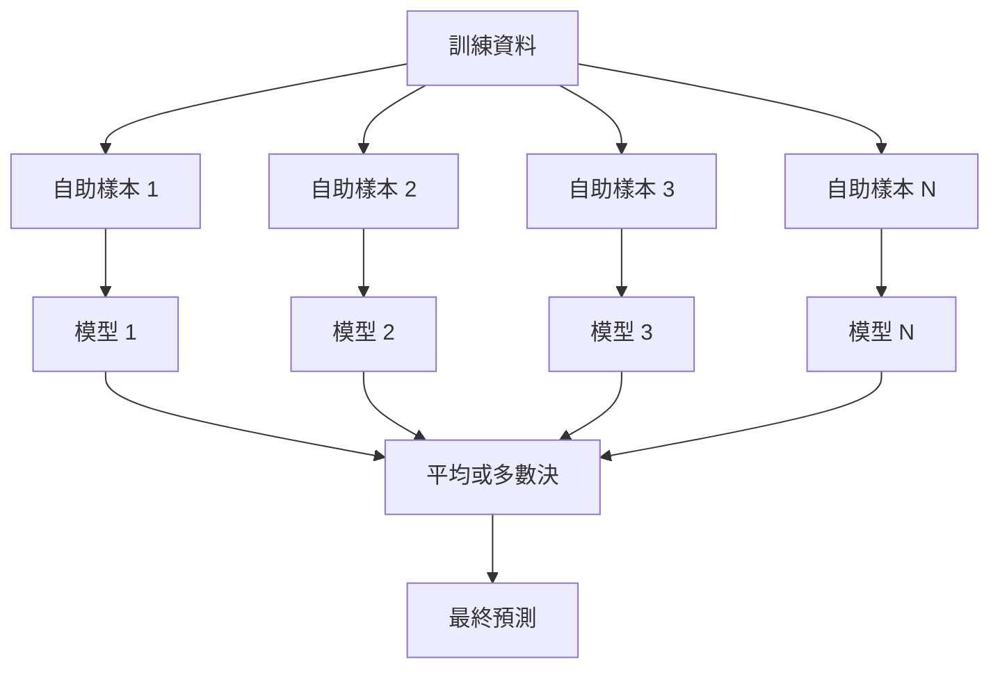
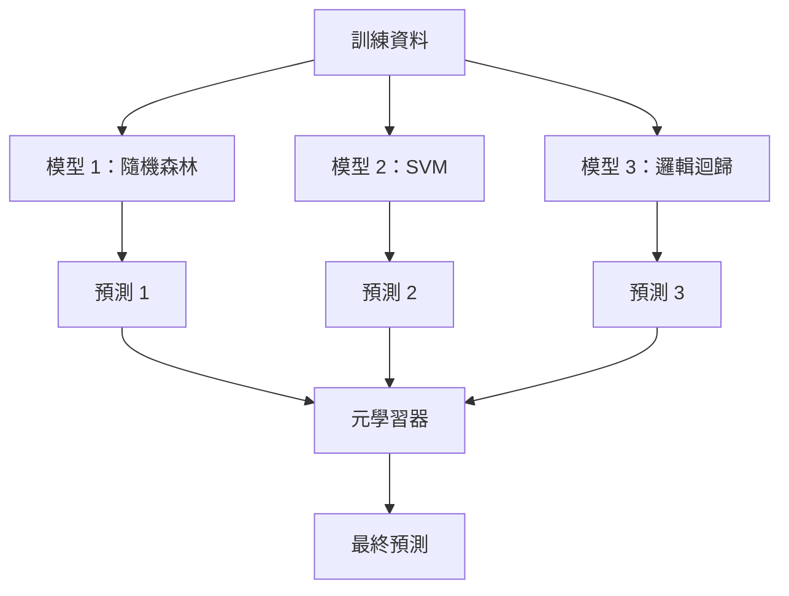

# 集成方法

> 將一群弱學習器正確組合，就能成為強學習器。這不是比喻，而是定理。

**Type:** Build
**Language:** Python
**Prerequisites:** Phase 2, Lesson 10 (Bias-Variance Tradeoff)
**Time:** ~120 minutes

## 學習目標

- 從零實作 AdaBoost 和梯度提升，並說明提升法如何依序降低偏差
- 建立 Bagging 集成，並展示平均彼此低相關的模型如何降低變異而不增加偏差
- 比較 Bagging、Boosting 和 Stacking 各自針對哪種誤差成分
- 評估集成多樣性，並說明獨立弱學習器增加時，多數決的準確率為何會提高

## 問題

單棵決策樹訓練快速、容易解讀，卻容易過度擬合；單一線性模型面對複雜邊界時則會欠擬合。你可以花好幾天設計完美的模型架構，也可以結合多個不完美的模型，得到比任何單一模型都好的結果。

集成方法正是這樣做。它是贏得表格資料 Kaggle 競賽最可靠的方法，支援多數正式機器學習系統，也能實際呈現偏差－變異取捨：Bagging 降低變異、Boosting 降低偏差、Stacking 則學習哪些輸入適合信任哪些模型。

## 核心概念

### 集成方法為何有效

假設有 N 個彼此獨立的分類器，每個分類器的準確率都是 p > 0.5。多數決的準確率為：

```text
P(多數決正確) = 對所有 k > N/2 加總 C(N,k) * p^k * (1-p)^(N-k)
```

若有 21 個準確率為 60% 的分類器，多數決準確率約為 74%；若有 101 個，準確率會升到 84%。當模型犯下不同錯誤時，錯誤就會互相抵銷。

關鍵條件是**多樣性**。如果所有模型犯下相同錯誤，組合它們也不會有幫助。集成方法會透過以下方式產生多樣模型：

- 使用不同的訓練子集（Bagging）
- 使用不同的特徵子集（隨機森林）
- 依序修正錯誤（Boosting）
- 使用不同模型家族（Stacking）

### Bagging（自助聚合）

Bagging 會在訓練資料的不同自助樣本上訓練每個模型，以產生多樣性。



自助樣本是從原始資料中有放回抽取、大小與原資料集相同的樣本。每個自助樣本約包含 63.2% 的不重複原始樣本；其餘 36.8% 是袋外樣本，可直接用作驗證集。

Bagging 能降低變異，而不會大幅提高偏差。每棵樹都會對自己的自助樣本過度擬合，但各棵樹擬合的方式不同，因此取平均後會抵銷雜訊。

**隨機森林**是加入額外技巧的 Bagging：每次分裂時，只會考慮隨機挑選的部分特徵，讓樹彼此更加不同。分類通常使用 sqrt(n_features) 個候選特徵，迴歸則使用 n_features / 3 個。

### Boosting（依序修正錯誤）

Boosting 會依序訓練模型。每個新模型都會專注於先前模型判斷錯誤的範例。


Boosting 能降低偏差。每個新模型都會修正目前集成的系統性錯誤。最終預測是所有模型的加權總和，表現較好的模型權重較高。

取捨在於：若執行太多輪，Boosting 可能會過度擬合，因為它會持續擬合較困難的範例，其中有些可能只是雜訊。

### AdaBoost

AdaBoost（Adaptive Boosting，適應性提升）是第一個實用的提升演算法。它可搭配任意基礎學習器，最常搭配決策樹樁（深度為 1 的樹）。

演算法如下：

```text
1. 初始化樣本權重：w_i = 1/N，對所有 i

2. 對 t = 1 到 T：
   a. 使用加權資料訓練弱學習器 h_t
   b. 計算加權錯誤率：
      err_t = sum(w_i * I(h_t(x_i) != y_i)) / sum(w_i)
   c. 計算模型權重：
      alpha_t = 0.5 * ln((1 - err_t) / err_t)
   d. 更新樣本權重：
      w_i = w_i * exp(-alpha_t * y_i * h_t(x_i))
   e. 將權重正規化，使總和為 1

3. 最終預測：H(x) = sign(sum(alpha_t * h_t(x)))
```

錯誤率較低的模型會得到較大的 alpha。分錯的樣本權重會提高，讓下一個模型更專注於這些樣本。

### 梯度提升

梯度提升將提升法泛化到任意損失函式。它不會重新調整樣本權重，而是讓每個新模型擬合目前集成的殘差（損失函式的負梯度）。

```text
1. 初始化：F_0(x) = argmin_c sum(L(y_i, c))

2. 對 t = 1 到 T：
   a. 計算偽殘差：
      r_i = -dL(y_i, F_{t-1}(x_i)) / dF_{t-1}(x_i)
   b. 使用殘差 r_i 擬合樹 h_t
   c. 找出最佳步長：
      gamma_t = argmin_gamma sum(L(y_i, F_{t-1}(x_i) + gamma * h_t(x_i)))
   d. 更新：
      F_t(x) = F_{t-1}(x) + learning_rate * gamma_t * h_t(x)

3. 最終預測：F_T(x)
```

平方誤差損失下，偽殘差就是實際殘差：`r_i = y_i - F_{t-1}(x_i)`。每棵樹實際上都是在擬合前一個集成模型的錯誤。

學習率（收縮率）會控制每棵樹的貢獻程度。學習率越小，需要的樹越多，但泛化能力通常更好。常見值介於 0.01 到 0.3。

### XGBoost：為何稱霸表格資料

XGBoost（eXtreme Gradient Boosting，極致梯度提升）是在梯度提升上加入工程最佳化，使它快速、準確且能抵抗過度擬合：

- **正則化目標函式：** 對葉節點權重使用 L1 和 L2 懲罰，避免單棵樹過度有把握。
- **二階近似：** 同時使用損失函式的一階和二階導數，讓分裂判斷更好。
- **稀疏感知分裂：** 原生處理缺失值，並在每次分裂時學習缺失資料的最佳方向。
- **欄位子抽樣：** 類似隨機森林，在每次分裂時抽樣特徵以增加多樣性。
- **加權分位數草圖：** 在分散式資料上有效率地找出連續特徵的分裂點。
- **快取感知區塊結構：** 依照 CPU 快取列最佳化記憶體配置。

對表格資料而言，XGBoost（及其後繼者 LightGBM）的表現一向勝過神經網路，這種情況短期內不太會改變。若資料能放進列欄格式的表格，就從梯度提升開始嘗試。

### Stacking（堆疊）：元學習

Stacking 會將多個基礎模型的預測當作特徵，輸入元學習器。



元學習器會學習對不同輸入該信任哪個基礎模型。若隨機森林在某些區域表現較好、SVM 在其他區域較好，元學習器就會學會如何選用。

為避免資料洩漏，基礎模型的預測必須使用訓練集上的交叉驗證產生。絕不可在相同資料上訓練基礎模型並產生元特徵。

### 投票

這是最簡單的集成方式，直接組合預測結果即可。

- **硬投票：** 對類別標籤採多數決。
- **軟投票：** 對預測機率取平均，再選擇平均機率最高的類別。通常效果較好，因為會使用信心程度。

```figure
f3-ensemble-average
```

## Build It：從零實作

### 步驟 1：決策樹樁（基礎學習器）

`code/ensembles.py` 會從零實作所有內容。先從決策樹樁開始，也就是只有一次分裂的樹。

```python
class DecisionStump:
    def __init__(self):
        self.feature_idx = None
        self.threshold = None
        self.polarity = 1
        self.alpha = None

    def fit(self, X, y, weights):
        n_samples, n_features = X.shape
        best_error = float("inf")

        for f in range(n_features):
            thresholds = np.unique(X[:, f])
            for thresh in thresholds:
                for polarity in [1, -1]:
                    pred = np.ones(n_samples)
                    pred[polarity * X[:, f] < polarity * thresh] = -1
                    error = np.sum(weights[pred != y])
                    if error < best_error:
                        best_error = error
                        self.feature_idx = f
                        self.threshold = thresh
                        self.polarity = polarity

    def predict(self, X):
        n = X.shape[0]
        pred = np.ones(n)
        idx = self.polarity * X[:, self.feature_idx] < self.polarity * self.threshold
        pred[idx] = -1
        return pred
```

### 步驟 2：從零實作 AdaBoost

```python
class AdaBoostScratch:
    def __init__(self, n_estimators=50):
        self.n_estimators = n_estimators
        self.stumps = []
        self.alphas = []

    def fit(self, X, y):
        n = X.shape[0]
        weights = np.full(n, 1 / n)

        for _ in range(self.n_estimators):
            stump = DecisionStump()
            stump.fit(X, y, weights)
            pred = stump.predict(X)

            err = np.sum(weights[pred != y])
            err = np.clip(err, 1e-10, 1 - 1e-10)

            alpha = 0.5 * np.log((1 - err) / err)
            weights *= np.exp(-alpha * y * pred)
            weights /= weights.sum()

            stump.alpha = alpha
            self.stumps.append(stump)
            self.alphas.append(alpha)

    def predict(self, X):
        total = sum(a * s.predict(X) for a, s in zip(self.alphas, self.stumps))
        return np.sign(total)
```

### 步驟 3：從零實作梯度提升

```python
class GradientBoostingScratch:
    def __init__(self, n_estimators=100, learning_rate=0.1, max_depth=3):
        self.n_estimators = n_estimators
        self.lr = learning_rate
        self.max_depth = max_depth
        self.trees = []
        self.initial_pred = None

    def fit(self, X, y):
        self.initial_pred = np.mean(y)
        current_pred = np.full(len(y), self.initial_pred)

        for _ in range(self.n_estimators):
            residuals = y - current_pred
            tree = SimpleRegressionTree(max_depth=self.max_depth)
            tree.fit(X, residuals)
            update = tree.predict(X)
            current_pred += self.lr * update
            self.trees.append(tree)

    def predict(self, X):
        pred = np.full(X.shape[0], self.initial_pred)
        for tree in self.trees:
            pred += self.lr * tree.predict(X)
        return pred
```

### 步驟 4：與 sklearn 比較

程式會確認從零實作的版本與 sklearn 的 `AdaBoostClassifier` 和 `GradientBoostingClassifier` 準確率相近，並將各種方法並列比較。

## Use It：實際應用

### 各方法適用情境

| 方法 | 降低項目 | 最適合 | 注意事項 |
|------|----------|--------|----------|
| Bagging／隨機森林 | 變異 | 含雜訊資料、特徵多 | 無法改善偏差 |
| AdaBoost | 偏差 | 乾淨資料、簡單基礎學習器 | 對離群值和雜訊敏感 |
| 梯度提升 | 偏差 | 表格資料、競賽 | 訓練慢，未調校時容易過度擬合 |
| XGBoost／LightGBM | 兩者 | 正式環境表格機器學習 | 超參數很多 |
| Stacking | 兩者 | 追求最後 1–2% 的準確率 | 複雜，元學習器可能過度擬合 |
| 投票 | 變異 | 快速組合多樣模型 | 只有模型彼此不同時才有幫助 |

### 表格資料的正式環境模型組合

多數表格預測問題可依照以下順序嘗試：

1. 使用預設參數訓練 LightGBM 或 XGBoost
2. 調整 n_estimators、learning_rate、max_depth、min_child_weight
3. 若還要提高 0.5%，使用 3–5 個多樣模型建立 Stacking 集成
4. 全程使用交叉驗證

儘管研究持續進展，神經網路處理表格資料時幾乎總是比梯度提升差。TabNet、NODE 等架構偶爾能追平，但很少勝過調校良好的 XGBoost。

## Ship It：交付成果

本課程會產生 `outputs/prompt-ensemble-selector.md`——協助你依資料集選擇合適集成方法的提示詞。描述資料的大小、特徵型態、雜訊程度、類別平衡，以及要解決的問題後，提示詞會逐項檢查決策條件、推薦方法、建議起始超參數，並提醒該方法常見的錯誤。此外也會產生含完整選擇指南的 `outputs/skill-ensemble-builder.md`。

## Exercises：練習

1. 修改 AdaBoost 實作，追蹤每一輪訓練準確率並繪製準確率與估計器數量的關係。演算法何時收斂？

2. 為迴歸樹加入隨機特徵子抽樣，從零實作隨機森林。使用 `max_features=sqrt(n_features)` 訓練 100 棵樹並平均預測，將降低變異的程度與單棵樹比較。

3. 在梯度提升實作中加入提前停止：追蹤每輪驗證損失，若連續 10 輪都沒有改善就停止。實際上需要幾棵樹？

4. 使用三個基礎模型（邏輯迴歸、決策樹、K 最近鄰）和一個邏輯迴歸元學習器建立 Stacking 集成。使用 5 折交叉驗證產生元特徵，並與各基礎模型單獨比較。

5. 使用預設參數在相同資料集上執行 XGBoost，將準確率與從零實作的梯度提升比較，再測量兩者執行時間。速度差距有多大？

## 關鍵詞

| 術語 | 一般說法 | 實際意義 |
|------|----------|----------|
| Bagging（自助聚合）|「使用隨機子集訓練」| 在自助樣本上訓練多個模型，再將預測取平均，以降低變異 |
| Boosting（提升法）|「專注處理困難範例」| 依序訓練模型，每個模型都修正目前集成的錯誤，以降低偏差 |
| AdaBoost |「重新加權資料」| 透過更新樣本權重執行提升；分錯的點會提高權重，供下一個學習器處理 |
| 梯度提升 |「擬合殘差」| 讓每個新模型擬合損失函式負梯度的提升方法 |
| XGBoost |「Kaggle 利器」| 加上正則化、二階最佳化和系統層級加速技巧的梯度提升 |
| Stacking（堆疊）|「在模型上再疊模型」| 將基礎模型預測作為元學習器的輸入特徵 |
| 隨機森林 |「多棵隨機樹」| 使用決策樹的 Bagging，並在每次分裂時隨機抽取特徵以增加多樣性 |
| 集成多樣性 |「犯下不同錯誤」| 各模型的錯誤必須低相關，集成效果才會勝過個別模型 |
| 袋外錯誤 |「免費驗證」| 未出現在自助樣本中的資料（約 36.8%）可作為驗證集，不必另外保留資料 |

## 延伸閱讀

- [Schapire 與 Freund：《Boosting: Foundations and Algorithms》](https://mitpress.mit.edu/9780262526036/)：AdaBoost 創作者所著的專書
- [Friedman：〈Greedy Function Approximation: A Gradient Boosting Machine〉（2001）](https://doi.org/10.1214/aos/1013203451)：梯度提升原始論文
- [Chen 與 Guestrin：〈XGBoost〉（2016）](https://arxiv.org/abs/1603.02754)：XGBoost 論文
- [Wolpert：〈Stacked Generalization〉（1992）](https://www.sciencedirect.com/science/article/abs/pii/S0893608005800231)：Stacking 原始論文
- [scikit-learn 集成方法](https://scikit-learn.org/stable/modules/ensemble.html)：實用參考資料
