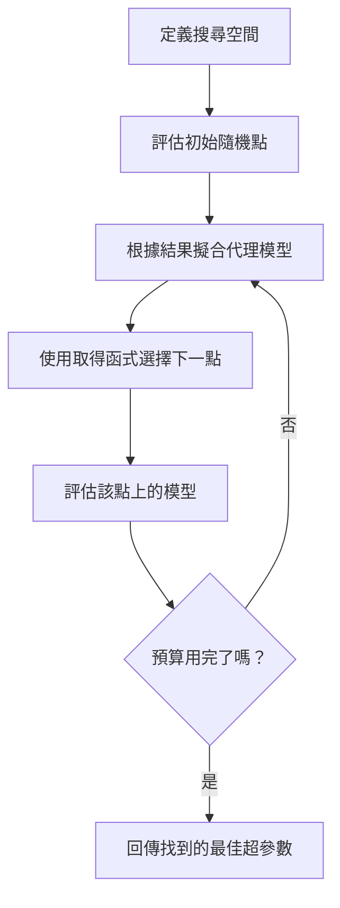
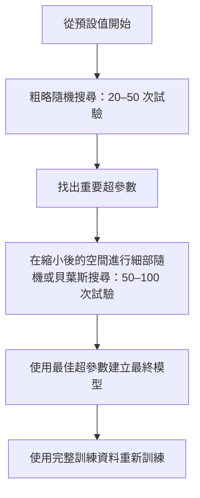
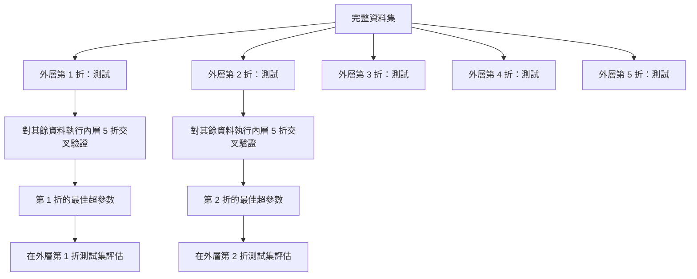

# 超參數調校

> 超參數是訓練開始前要調整的旋鈕。調得好不好，決定模型表現平庸還是出色。

**Type:** Build
**Language:** Python
**Prerequisites:** Phase 2, Lesson 11 (Ensemble Methods)
**Time:** ~90 minutes

## 學習目標

- 從零實作網格搜尋、隨機搜尋和貝葉斯最佳化，並比較它們的樣本效率
- 說明當超參數的有效維度多數很低時，隨機搜尋為何勝過網格搜尋
- 使用代理模型和取得函式建立貝葉斯最佳化迴圈，引導搜尋方向
- 設計超參數調校策略，透過適當的交叉驗證避免對驗證集過度擬合

## 問題

假設你的梯度提升模型有學習率、樹的數量、最大深度、葉節點最小樣本數、子抽樣比例和欄位抽樣比例，共 6 個超參數。每個超參數若各有 5 個合理取值，網格就有 5^6 = 15,625 種組合。每種組合訓練要花 10 秒，全部測試就需要 43 小時運算。

網格搜尋看起來最直接，規模一大卻最糟。隨機搜尋能用更少運算得到更好結果；貝葉斯最佳化則會從過去評估結果中學習，表現更好。知道該用哪種策略，以及哪些超參數真正重要，能省下好幾天白費的 GPU 時間。

## 核心概念

### 參數與超參數

參數會在訓練期間學得（例如權重、偏差、分裂閾值）；超參數則在訓練前設定，用來控制學習過程。

| 超參數 | 控制項目 | 常見範圍 |
|--------|----------|----------|
| 學習率 | 每次更新的步幅 | 0.001 到 1.0 |
| 樹數量／epoch 數量 | 訓練時間 | 10 到 10,000 |
| 最大深度 | 模型複雜度 | 1 到 30 |
| 正則化（lambda）| 防止過度擬合 | 0.0001 到 100 |
| 批次大小 | 梯度估計的雜訊 | 16 到 512 |
| Dropout 比例 | 停用神經元的比例 | 0.0 到 0.5 |

### 網格搜尋

網格搜尋會評估指定值的每種組合。它完整且容易理解，但超參數一多，計算量就會指數成長。

```text
兩個超參數的網格：

  learning_rate： [0.01, 0.1, 1.0]
  max_depth：     [3, 5, 7]

  評估次數：3 x 3 = 9 種組合

  (0.01, 3)  (0.01, 5)  (0.01, 7)
  (0.1,  3)  (0.1,  5)  (0.1,  7)
  (1.0,  3)  (1.0,  5)  (1.0,  7)
```

網格搜尋有個根本缺陷：若只有一個超參數重要，其他都不重要，多數評估就會白費。9 次評估只會涵蓋重要超參數的 3 個不同值。

### 隨機搜尋

隨機搜尋會從分布中抽取超參數，而非使用網格。同樣花費 9 次評估，就能為每個超參數取得 9 個不同值。


隨機搜尋為何勝過網格搜尋（Bergstra 與 Bengio，2012）：

- 多數超參數的有效維度很低。對特定問題而言，6 個超參數中通常只有 1–2 個重要。
- 網格搜尋會浪費資源評估不重要的維度。
- 相同預算下，隨機搜尋能更密集地探索重要維度。
- 若搜尋空間中存在最佳點，隨機試驗 60 次，有 95% 的機率能找到距離最佳點 5% 以內的結果。

### 貝葉斯最佳化

隨機搜尋不會利用過去的結果，也不會學到學習率太高會發散，或深度 3 一直勝過深度 10。貝葉斯最佳化則會根據過去評估結果，決定下一步要搜尋的位置。



有兩個關鍵元件：

**代理模型：** 一個評估成本低的模型（通常是高斯過程），用來近似昂貴的目標函式。它會為搜尋空間中的任意點提供預測值與不確定性估計。

**取得函式：** 透過平衡利用（在已知的好點附近搜尋）與探索（搜尋不確定性高的區域），決定下一個評估位置。常見選擇如下：

- **預期改善（EI）：** 這個點預期能比目前最佳結果改善多少？
- **上置信界（UCB）：** 預測值加上不確定性的倍數。UCB 越高，表示該點可能有潛力，也可能尚未探索。
- **改善機率（PI）：** 這個點勝過目前最佳結果的機率是多少？

貝葉斯最佳化通常只需隨機搜尋 2 到 5 分之 1 的評估次數，就能找到更好的超參數。與實際模型訓練相比，擬合代理模型的額外成本幾乎可以忽略。

### 提前停止

不必讓每次訓練都跑完。如果某種設定在 10 個 epoch 後明顯很差，就停止它並繼續下一種設定。在超參數搜尋中，這也是提前停止。

常見策略：
- **耐心值：** 若驗證損失連續 N 個 epoch 都沒有改善，就停止。
- **中位數剪枝：** 若某試驗的中間結果比相同步驟中已完成試驗的中位數還差，就停止。
- **Hyperband：** 先分配小預算給許多組設定，再逐步增加表現最佳者的預算。

Hyperband 特別有效：先讓 81 種設定各訓練 1 個 epoch，留下表現最好的三分之一，給它們 3 個 epoch，再留下前三分之一，以此類推。與所有設定都訓練完整預算相比，它能快 10 到 50 倍找到好設定。

### 學習率排程器

學習率幾乎總是最重要的超參數。排程器會在訓練期間調整學習率，而不是維持固定值。

| 排程器 | 公式 | 適用情境 |
|--------|------|----------|
| 階梯衰減 | 每 N 個 epoch 乘以 0.1 | 傳統 CNN 訓練 |
| 餘弦退火 | lr * 0.5 * (1 + cos(pi * t / T)) | 現代預設選項 |
| 預熱後衰減 | 先線性增加，再以餘弦衰減 | Transformer |
| 單週期 | 在單一週期中先增加再降低 | 快速收斂 |
| 平臺期降低 | 指標停滯時按比例降低 | 安全的預設選項 |

### 超參數重要性

不同超參數的重要性並不相同。隨機森林研究（Probst 等人，2019）和梯度提升研究都呈現一致趨勢：

**重要性高：**
- 學習率（永遠先調整）
- 估計器數量／epoch 數量（使用提前停止，不必手動調整）
- 正則化強度

**重要性中等：**
- 最大深度／層數
- 葉節點最小樣本數／權重衰減
- 子抽樣比例

**重要性低：**
- 最大特徵數（用於隨機森林）
- 特定啟用函式的選擇
- 批次大小（在合理範圍內）

先調整重要的超參數，其餘維持預設值。

### 實務策略



具體流程如下：

1. **從函式庫預設值開始。** 這些值由有經驗的實作者挑選，通常已達到理想結果的 80%。
2. **進行粗略隨機搜尋。** 搜尋範圍放寬，執行 20–50 次試驗，並用提前停止快速淘汰差的設定。
3. **分析結果。** 哪些超參數與效能相關？依結果縮小搜尋空間。
4. **進行細部搜尋。** 在縮小後的空間使用貝葉斯最佳化或聚焦隨機搜尋，執行 50–100 次試驗。
5. 使用找到的最佳超參數，重新以所有訓練資料訓練模型。

### 整合交叉驗證

只根據單一驗證集調整超參數有風險，因為最佳超參數可能只是對特定驗證折過度擬合。巢狀交叉驗證使用兩層迴圈來解決：

- **外層迴圈（評估）：** 將資料切成訓練＋驗證集及測試集，回報無偏效能。
- **內層迴圈（調校）：** 將訓練＋驗證資料再切成訓練集和驗證集，找出最佳超參數。



每個外層折都會獨立找出自己的最佳超參數。外層分數是泛化效能的無偏估計。

使用 sklearn：

```python
from sklearn.model_selection import cross_val_score, GridSearchCV
from sklearn.ensemble import GradientBoostingRegressor

inner_cv = GridSearchCV(
    GradientBoostingRegressor(),
    param_grid={
        "learning_rate": [0.01, 0.05, 0.1],
        "max_depth": [2, 3, 5],
        "n_estimators": [50, 100, 200],
    },
    cv=5,
    scoring="neg_mean_squared_error",
)

outer_scores = cross_val_score(
    inner_cv, X, y, cv=5, scoring="neg_mean_squared_error"
)

print(f"Nested CV MSE: {-outer_scores.mean():.4f} +/- {outer_scores.std():.4f}")
```

這種方法運算成本很高（5 個外層折 x 5 個內層折 x 27 個網格點 = 675 次模型擬合），但能提供可信的效能估計。發表論文或決策風險很高時，請使用巢狀交叉驗證。

### 實用技巧

**先調整學習率。** 對梯度式方法而言，學習率永遠是最重要的超參數。學習率選錯，其他調整都沒有意義。先將其他超參數設為預設值，再掃描學習率。

**學習率和正則化使用對數均勻分布。** 0.001 到 0.01 的差異，與 0.1 到 1.0 的差異同樣重要。線性搜尋會浪費預算在數值較大的範圍。

**使用提前停止取代調整 n_estimators。** 對提升模型和神經網路，將 n_estimators 或 epoch 設得很高，再由提前停止決定何時停止。這樣能省去一個待搜尋的超參數。

**分配預算。** 將 60% 的調校預算用在最重要的兩個超參數，剩下 40% 再用於其他項目。前兩個超參數會影響大部分效能變化。

**尺度很重要。** 批次大小不要使用對數尺度搜尋（16、32、64 就很合理）；學習率則務必使用對數尺度搜尋。要依超參數影響模型的方式選擇搜尋分布。

| 模型類型 | 重要超參數 | 建議搜尋方式 | 預算 |
|----------|------------|--------------|------|
| 隨機森林 | n_estimators、max_depth、min_samples_leaf | 隨機搜尋，50 次試驗 | 低（訓練快）|
| 梯度提升 | learning_rate、n_estimators、max_depth | 貝葉斯搜尋，100 次試驗並提前停止 | 中 |
| 神經網路 | learning_rate、weight_decay、batch_size | 貝葉斯或隨機搜尋，100 次以上試驗 | 高（訓練慢）|
| SVM | C、gamma（RBF 核）| 對數尺度網格搜尋，25–50 次試驗 | 低（2 個參數）|
| Lasso／Ridge | alpha | 對數尺度一維搜尋，20 次試驗 | 非常低 |
| XGBoost | learning_rate、max_depth、subsample、colsample | 貝葉斯搜尋，100–200 次試驗並提前停止 | 中 |

**不確定時：** 以超參數數量兩倍的試驗次數執行隨機搜尋（例如 6 個超參數至少試 12 次以上）。你會驚訝地發現，50 次隨機搜尋經常勝過精心設計的網格搜尋。

```figure
k-fold-cv
```

## Build It：從零實作

### 步驟 1：從零實作網格搜尋

`code/tuning.py` 會從零實作網格搜尋、隨機搜尋和簡易貝葉斯最佳化器。

```python
def grid_search(model_fn, param_grid, X_train, y_train, X_val, y_val):
    keys = list(param_grid.keys())
    values = list(param_grid.values())
    best_score = -float("inf")
    best_params = None
    n_evals = 0

    for combo in itertools.product(*values):
        params = dict(zip(keys, combo))
        model = model_fn(**params)
        model.fit(X_train, y_train)
        score = evaluate(model, X_val, y_val)
        n_evals += 1

        if score > best_score:
            best_score = score
            best_params = params

    return best_params, best_score, n_evals
```

### 步驟 2：從零實作隨機搜尋

```python
def random_search(model_fn, param_distributions, X_train, y_train,
                  X_val, y_val, n_iter=50, seed=42):
    rng = np.random.RandomState(seed)
    best_score = -float("inf")
    best_params = None

    for _ in range(n_iter):
        params = {k: sample(v, rng) for k, v in param_distributions.items()}
        model = model_fn(**params)
        model.fit(X_train, y_train)
        score = evaluate(model, X_val, y_val)

        if score > best_score:
            best_score = score
            best_params = params

    return best_params, best_score, n_iter
```

### 步驟 3：簡化版貝葉斯最佳化

核心概念是：根據已觀察到的（超參數、分數）配對擬合高斯過程，再由取得函式決定下一步搜尋位置。

```python
class SimpleBayesianOptimizer:
    def __init__(self, search_space, n_initial=5):
        self.search_space = search_space
        self.n_initial = n_initial
        self.X_observed = []
        self.y_observed = []

    def _kernel(self, x1, x2, length_scale=1.0):
        dists = np.sum((x1[:, None, :] - x2[None, :, :]) ** 2, axis=2)
        return np.exp(-0.5 * dists / length_scale ** 2)

    def _fit_gp(self, X_new):
        X_obs = np.array(self.X_observed)
        y_obs = np.array(self.y_observed)
        y_mean = y_obs.mean()
        y_centered = y_obs - y_mean

        K = self._kernel(X_obs, X_obs) + 1e-4 * np.eye(len(X_obs))
        K_star = self._kernel(X_new, X_obs)

        L = np.linalg.cholesky(K)
        alpha = np.linalg.solve(L.T, np.linalg.solve(L, y_centered))
        mu = K_star @ alpha + y_mean

        v = np.linalg.solve(L, K_star.T)
        var = 1.0 - np.sum(v ** 2, axis=0)
        var = np.maximum(var, 1e-6)

        return mu, var

    def _expected_improvement(self, mu, var, best_y):
        sigma = np.sqrt(var)
        z = (mu - best_y) / (sigma + 1e-10)
        ei = sigma * (z * norm_cdf(z) + norm_pdf(z))
        return ei

    def suggest(self):
        if len(self.X_observed) < self.n_initial:
            return sample_random(self.search_space)

        candidates = [sample_random(self.search_space) for _ in range(500)]
        X_cand = np.array([to_vector(c) for c in candidates])
        mu, var = self._fit_gp(X_cand)
        ei = self._expected_improvement(mu, var, max(self.y_observed))
        return candidates[np.argmax(ei)]

    def observe(self, params, score):
        self.X_observed.append(to_vector(params))
        self.y_observed.append(score)
```

代理高斯過程會為每個候選點提供預測分數 (mu) 和不確定性 (var)。預期改善會平衡兩者：偏好模型預測分數高或不確定性高的點。初期多數點的不確定性都高，因此最佳化器會探索；後期則聚焦在最有潛力的區域。

### 步驟 4：比較所有方法

在相同的合成目標函式上執行三種方法並比較。這裡使用簡化包裝器，直接將目標函式交給各最佳化器（不需訓練模型），因此 API 與前面以模型為基礎的實作不同：

```python
def synthetic_objective(params):
    lr = params["learning_rate"]
    depth = params["max_depth"]
    return -(np.log10(lr) + 2) ** 2 - (depth - 4) ** 2 + 10

param_grid = {
    "learning_rate": [0.001, 0.01, 0.1, 1.0],
    "max_depth": [2, 3, 4, 5, 6, 7, 8],
}

grid_best = None
grid_score = -float("inf")
grid_history = []
for combo in itertools.product(*param_grid.values()):
    params = dict(zip(param_grid.keys(), combo))
    score = synthetic_objective(params)
    grid_history.append((params, score))
    if score > grid_score:
        grid_score = score
        grid_best = params

param_dist = {
    "learning_rate": ("log_float", 0.001, 1.0),
    "max_depth": ("int", 2, 8),
}

rand_best = None
rand_score = -float("inf")
rand_history = []
rng = np.random.RandomState(42)
for _ in range(28):
    params = {k: sample(v, rng) for k, v in param_dist.items()}
    score = synthetic_objective(params)
    rand_history.append((params, score))
    if score > rand_score:
        rand_score = score
        rand_best = params

optimizer = SimpleBayesianOptimizer(param_dist, n_initial=5)
bayes_history = []
for _ in range(28):
    params = optimizer.suggest()
    score = synthetic_objective(params)
    optimizer.observe(params, score)
    bayes_history.append((params, score))
bayes_score = max(s for _, s in bayes_history)

print(f"{'Method':<20} {'Best Score':>12} {'Evaluations':>12}")
print("-" * 50)
print(f"{'Grid Search':<20} {grid_score:>12.4f} {len(grid_history):>12}")
print(f"{'Random Search':<20} {rand_score:>12.4f} {len(rand_history):>12}")
print(f"{'Bayesian Opt':<20} {bayes_score:>12.4f} {len(bayes_history):>12}")
```

在相同預算下，貝葉斯最佳化通常最快找到最佳分數，因為不會浪費資源評估明顯很差的區域。隨機搜尋比網格搜尋涵蓋更多範圍。只有超參數很少且能負擔完整搜尋時，網格搜尋才會勝出。

## Use It：實際應用

### 實際使用 Optuna

Optuna 是認真進行超參數調校時的推薦函式庫，原生支援試驗剪枝、分散式搜尋和視覺化。

```python
import optuna

def objective(trial):
    lr = trial.suggest_float("learning_rate", 1e-4, 1e-1, log=True)
    n_est = trial.suggest_int("n_estimators", 50, 500)
    max_depth = trial.suggest_int("max_depth", 2, 10)

    model = GradientBoostingRegressor(
        learning_rate=lr,
        n_estimators=n_est,
        max_depth=max_depth,
    )
    model.fit(X_train, y_train)
    return mean_squared_error(y_val, model.predict(X_val))

study = optuna.create_study(direction="minimize")
study.optimize(objective, n_trials=100)

print(f"Best params: {study.best_params}")
print(f"Best MSE: {study.best_value:.4f}")
```

Optuna 的主要功能：
- 使用 `suggest_float(..., log=True)` 搜尋適合對數尺度的參數（學習率、正則化）
- 使用 `suggest_int` 設定整數參數
- 使用 `suggest_categorical` 設定離散選項
- 內建 `MedianPruner`，可提前停止表現不佳的試驗
- 使用 `study.trials_dataframe()` 分析試驗結果

### 使用 Optuna 進行剪枝

剪枝會提早停止沒有希望的試驗，省下大量運算。常見流程如下：

```python
import optuna
from sklearn.model_selection import cross_val_score

def objective(trial):
    params = {
        "learning_rate": trial.suggest_float("lr", 1e-4, 0.5, log=True),
        "max_depth": trial.suggest_int("max_depth", 2, 10),
        "n_estimators": trial.suggest_int("n_estimators", 50, 500),
        "subsample": trial.suggest_float("subsample", 0.5, 1.0),
    }

    model = GradientBoostingRegressor(**params)
    scores = cross_val_score(model, X_train, y_train, cv=3,
                             scoring="neg_mean_squared_error")
    mean_score = -scores.mean()

    trial.report(mean_score, step=0)
    if trial.should_prune():
        raise optuna.TrialPruned()

    return mean_score

pruner = optuna.pruners.MedianPruner(n_startup_trials=10, n_warmup_steps=5)
study = optuna.create_study(direction="minimize", pruner=pruner)
study.optimize(objective, n_trials=200)
```

若某試驗在相同步驟中的中間值比所有已完成試驗的中位數還差，`MedianPruner` 就會停止它。剪枝需要呼叫 `trial.report()` 回報中間指標，並呼叫 `trial.should_prune()` 檢查是否應停止。`n_startup_trials=10` 會確保至少有 10 次試驗完整結束後，剪枝才開始運作。這通常能節省總運算量的 40% 到 60%。

### sklearn 內建的調校器

快速實驗可使用 sklearn 提供的 `GridSearchCV`、`RandomizedSearchCV` 和 `HalvingRandomSearchCV`：

```python
from sklearn.model_selection import RandomizedSearchCV
from scipy.stats import loguniform, randint

param_dist = {
    "learning_rate": loguniform(1e-4, 0.5),
    "max_depth": randint(2, 10),
    "n_estimators": randint(50, 500),
}

search = RandomizedSearchCV(
    GradientBoostingRegressor(),
    param_dist,
    n_iter=100,
    cv=5,
    scoring="neg_mean_squared_error",
    random_state=42,
    n_jobs=-1,
)
search.fit(X_train, y_train)
print(f"Best params: {search.best_params_}")
print(f"Best CV MSE: {-search.best_score_:.4f}")
```

學習率和正則化請使用 scipy 的 `loguniform`；整數超參數請使用 `randint`。`n_jobs=-1` 會使用所有 CPU 核心平行處理。

### 超參數調校常見錯誤

**前處理造成資料洩漏。** 若在交叉驗證前用完整資料集擬合縮放器，驗證折的資訊就會洩漏到訓練資料。務必將前處理放進 `Pipeline`，讓它只在訓練折上擬合。

**對驗證集過度擬合。** 執行數千次試驗，等於用驗證集訓練。最終效能估計請使用巢狀交叉驗證，或另外保留一份調校期間完全不碰的測試集。

**搜尋範圍過窄。** 若最佳值落在搜尋空間邊界，表示範圍不夠廣，最佳值可能在範圍之外。務必檢查最佳參數是否落在邊界。

**忽略交互作用。** 在提升模型中，學習率與估計器數量會強烈互相影響。學習率低時需要更多估計器。分開調整會比一起調整得到更差的結果。

**迭代模型沒有使用提前停止。** 對梯度提升和神經網路，將 n_estimators 或 epoch 設為高值，再使用提前停止。這肯定比將迭代次數當作超參數搜尋更好。

## Exercises：練習

1. 使用相同總預算（例如 50 次評估）執行網格搜尋和隨機搜尋，比較找到的最佳分數。使用不同亂數種子重複實驗 10 次，隨機搜尋贏幾次？

2. 從零實作 Hyperband：從 81 種設定開始，每種訓練 1 個 epoch。每輪保留表現最好的三分之一，再將它們的預算增加三倍。將總運算量（所有設定訓練 epoch 的總和）與 81 種設定都訓練完整預算相比。

3. 在第 11 課的梯度提升實作中加入餘弦退火學習率排程器。與固定學習率相比，有幫助嗎？

4. 使用 Optuna 在真實資料集（例如 sklearn 的 breast cancer 資料集）上調整 RandomForestClassifier。使用 `optuna.visualization.plot_param_importances(study)` 查看最重要的超參數。結果是否符合本課的排序？

5. 實作簡單的取得函式（預期改善），展示探索與利用的取捨。繪製代理模型的平均預測和不確定性，並顯示 EI 下一步選擇評估的位置。

## 關鍵詞

| 術語 | 一般說法 | 實際意義 |
|------|----------|----------|
| 超參數 |「自行選擇的設定」| 訓練前設定、會控制學習過程的值，不是從資料中學得 |
| 網格搜尋 |「嘗試所有組合」| 對指定參數網格進行完整搜尋，計算成本呈指數成長 |
| 隨機搜尋 |「隨機取樣」| 從分布中抽取超參數，對重要維度的涵蓋通常勝過網格搜尋 |
| 貝葉斯最佳化 |「智慧搜尋」| 使用目標函式的代理模型決定下一個評估位置，平衡探索與利用 |
| 代理模型 |「便宜的近似模型」| 根據已觀察評估結果，近似昂貴目標函式的模型（通常是高斯過程）|
| 取得函式 |「決定下一步搜尋位置」| 平衡預期改善和不確定性，為候選點評分；EI 和 UCB 是常見選擇 |
| 提前停止 |「別再浪費時間」| 驗證效能停止改善時，提早終止訓練 |
| Hyperband |「設定組合淘汰賽」| 自適應分配資源：先讓多種設定使用小預算，再保留最佳設定並增加預算 |
| 學習率排程器 |「訓練時改變學習率」| 在訓練期間調整學習率以改善收斂的函式 |

## 延伸閱讀

- [Bergstra 與 Bengio：〈Random Search for Hyper-Parameter Optimization〉（2012）](https://jmlr.org/papers/v13/bergstra12a.html)：證明隨機搜尋勝過網格搜尋的論文
- [Snoek 等人：〈Practical Bayesian Optimization of Machine Learning Algorithms〉（2012）](https://arxiv.org/abs/1206.2944)：將貝葉斯最佳化用於機器學習
- [Li 等人：〈Hyperband: A Novel Bandit-Based Approach〉（2018）](https://jmlr.org/papers/v18/16-558.html)：Hyperband 原始論文
- [Optuna：次世代超參數最佳化架構](https://arxiv.org/abs/1907.10902)：Optuna 論文
- [Probst 等人：〈Tunability: Importance of Hyperparameters〉（2019）](https://jmlr.org/papers/v20/18-444.html)：研究哪些超參數重要
