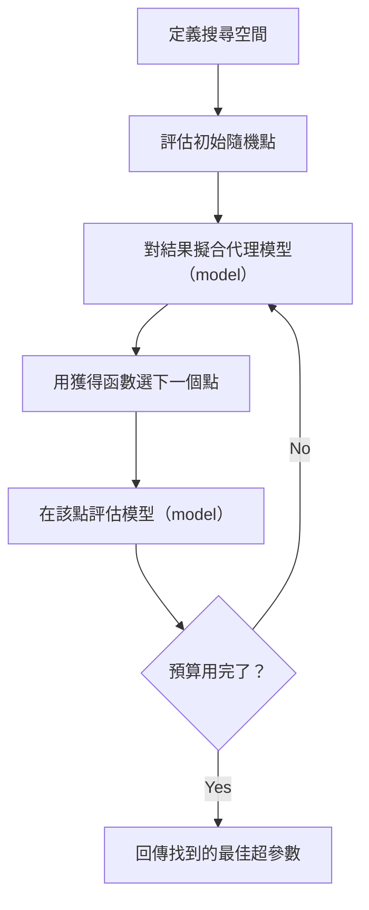
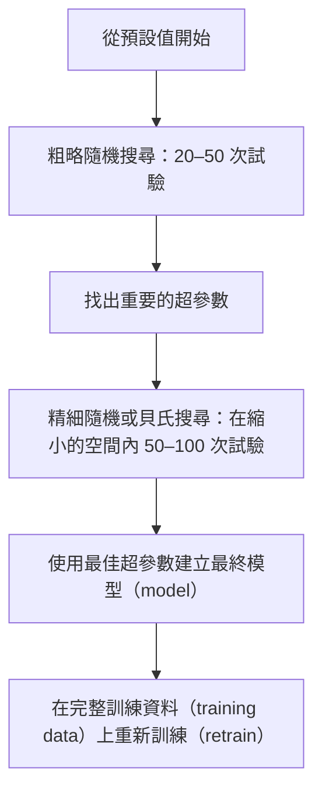
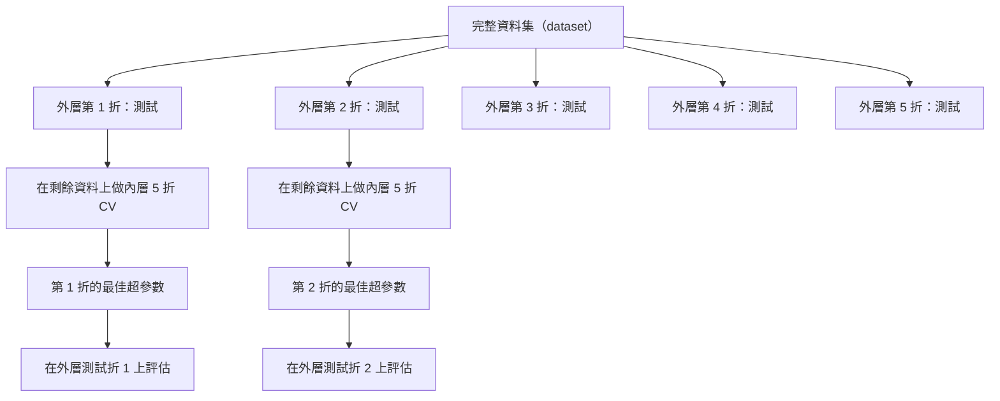

# 超參數調校（hyperparameter tuning）

> 超參數（hyperparameter）是訓練（training）開始前你要轉動的旋鈕。轉得好不好，就是平庸模型（model）與出色模型（model）的差別。

**Type:** Build
**Language:** Python
**Prerequisites:** Phase 2, Lesson 11 (Ensemble Methods)
**Time:** ~90 minutes

## Learning Objectives｜學習目標

- 從頭實作網格搜尋（grid search）、隨機搜尋（random search）與貝氏最佳化（Bayesian optimization），並比較它們的樣本效率（sample efficiency）
- 說明為什麼當大多數超參數的有效維度（effective dimensionality）很低時，隨機搜尋勝過網格搜尋
- 用代理模型（surrogate model）與獲得函數（acquisition function）建立貝氏最佳化迴圈來引導搜尋
- 設計一套超參數調校策略，用正確的交叉驗證（cross-validation）避免對驗證集（validation set）過度擬合（overfitting）

## The Problem｜問題

你的 gradient boosting 模型（model）有學習率（learning rate）、樹的數量、最大深度（max depth）、葉節點最小樣本數（minimum samples per leaf）、子取樣比例（subsample ratio），還有欄位子取樣比例（column sample ratio）。那是六個超參數。如果每個都有 5 個合理取值，網格就有 5^6 = 15,625 種組合。每種組合都要訓練 10 秒，全部跑完要 43 小時。

網格搜尋是最直覺的做法，也是規模擴大時最糟糕的做法。隨機搜尋用更少的計算得到更好的結果。貝氏最佳化更進一步，會從過去的評估中學習。知道該用哪種策略、哪些超參數才真正重要，能省下好幾天白跑的 GPU 時間。

## The Concept｜核心概念

### 參數（parameter）與超參數

參數是訓練過程中學出來的——權重（weight）、偏置（bias）與分割閾值（split thresholds）。超參數是訓練開始前設定的，控制學習如何發生。

| 超參數 | 控制什麼 | 常見範圍 |
|---------------|-----------------|---------------|
| 學習率 | 每次更新的步長 | 0.001 到 1.0 |
| 樹的數量／epoch 數 | 訓練多久 | 10 到 10,000 |
| 最大深度 | 模型（model）複雜度（model complexity） | 1 到 30 |
| 正則化（regularization，lambda） | 防止過度擬合 | 0.0001 到 100 |
| 批次大小（batch size） | 梯度（gradient）估計的雜訊 | 16 到 512 |
| Dropout 比例 | 被關閉的神經元（neuron）比例 | 0.0 到 0.5 |

### 網格搜尋

網格搜尋會評估每一種指定的數值組合。它窮舉所有可能、容易理解，但成本會隨超參數數量呈指數成長。

```
Grid for 2 hyperparameters:

  learning_rate: [0.01, 0.1, 1.0]
  max_depth:     [3, 5, 7]

  Evaluations: 3 x 3 = 9 combinations

  (0.01, 3)  (0.01, 5)  (0.01, 7)
  (0.1,  3)  (0.1,  5)  (0.1,  7)
  (1.0,  3)  (1.0,  5)  (1.0,  7)
```

網格搜尋有一個根本缺陷：如果一個超參數重要、另一個不重要，大多數評估都浪費掉了。9 次評估只換來重要參數的 3 個不同取值。

### 隨機搜尋

隨機搜尋不沿著網格，而是從分布（distribution）中抽樣超參數。同樣 9 次評估的預算，每個超參數都能得到 9 個不同的取值。


為什麼隨機勝過網格（Bergstra & Bengio, 2012）：

- 大多數超參數的有效維度很低。對特定問題而言，6 個超參數通常只有 1–2 個真正重要。
- 網格搜尋在不重要的維度上浪費評估。
- 同樣的預算下，隨機搜尋在重要維度上覆蓋得更密。
- 做 60 次隨機試驗（trial），你有 95% 的機率（probability）找到距最佳點 5% 以內的點（前提是搜尋空間（search space）裡存在這樣的點）。

### 貝氏最佳化

隨機搜尋不看結果。它不會學到「高學習率會發散」或「深度 3 一直勝過深度 10」。貝氏最佳化會利用過去的評估結果，決定下一步往哪裡搜尋。



兩個關鍵元件（component）：

**代理模型（model）：** 一個評估成本很低的模型（model）（通常是高斯過程（Gaussian process）），用來近似昂貴的目標函數（objective function）。在搜尋空間的任何一點，它都同時給出預測值與不確定性（uncertainty）估計。

**獲得函數：** 在「利用（exploitation）」（在已知的好點附近搜尋）與「探索（exploration）」（往不確定性高的地方搜尋）之間取得平衡，決定下一個要評估的點。常見選擇：

- **期望改善（Expected Improvement，EI）：** 在這個候選點，我們預期能比目前最佳值改善多少？
- **信賴上界（Upper Confidence Bound，UCB）：** 預測值加上不確定性的倍數。UCB 高代表要麼有潛力、要麼還沒探索過。
- **改善機率（Probability of Improvement，PI）：** 這一點勝過目前最佳值的機率是多少？

貝氏最佳化通常只需 1/2 至 1/5 的評估次數，就能找到更好的超參數。比起訓練真正的模型（model），擬合代理模型（model）的開銷微不足道。

### 提前停止（early stopping）

不是每個訓練作業（training run）都要完成。如果一個組態（configuration）跑完 10 個 epoch 後明顯很糟，就停掉它、繼續下一個。這就是超參數搜尋語境下的提前停止。

策略包括：
- **容忍輪數（patience）制：** 驗證損失連續 N 個 epoch 沒有改善就停止
- **中位數剪枝（median pruning）：** 若試驗的中間結果比同一步數已完成試驗的中位數差，就停止
- **Hyperband：** 給很多組態很小的預算，再逐步為表現最好的加碼

Hyperband 特別有效。它讓 81 個組態各跑 1 個 epoch，留下前三分之一、給它們 3 個 epoch、再留下前三分之一，以此類推。比起讓所有組態都跑滿預算，這樣能以快 10–50 倍的速度找到好組態。

### 學習率排程器

學習率幾乎永遠是最重要的超參數。與其固定不變，排程器（scheduler）會在訓練過程中調整它。

| 排程器 | 公式 | 適用時機 |
|-----------|---------|-------------|
| 步進衰減（step decay） | 每 N 個 epoch 乘上 0.1 | 經典 CNN 訓練 |
| 餘弦退火（cosine annealing） | lr * 0.5 * (1 + cos(pi * t / T)) | 現今常用的預設選擇 |
| 預熱（warmup）＋衰減 | 先線性上升再餘弦衰減 | Transformer |
| 一循環（one-cycle） | 一個循環內先升後降 | 快速收斂（convergence） |
| 高原期（plateau）降速 | 指標（metric）停滯時按比例降低 | 安全的預設 |

### 超參數重要性

不是所有超參數都一樣重要。對隨機森林（random forest；Probst et al., 2019）與 gradient boosting 的研究呈現出一致的模式：

**高重要性：**
- 學習率（永遠先調它）
- estimator 數量／epoch 數（與其調它，不如用提前停止）
- 正則化強度（regularization strength）

**中重要性：**
- 最大深度／層數
- 葉節點最小樣本數／權重衰減（weight decay）
- 子取樣比例

**低重要性：**
- 最大特徵數（max features，針對隨機森林）
- 活化函數（activation function）的具體選擇
- 批次大小（在合理範圍內）

先調重要的，其他留在預設值。

### 實務策略



具體流程：

1. **從函式庫（library）預設值開始。** 它們是有經驗的實務工作者選的，通常已經達到 80% 的效果。
2. **粗略隨機搜尋。** 範圍廣、20–50 次試驗。用提前停止快速淘汰表現不佳的設定。
3. **分析結果。** 哪些超參數與表現相關？縮小搜尋空間。
4. **精細搜尋。** 在縮小的空間內做貝氏最佳化或聚焦的隨機搜尋，50–100 次試驗。
5. **用找到的最佳超參數，在所有訓練資料上重新訓練。**

### 與交叉驗證整合

只在單一驗證切分上調超參數是有風險的：找到的最佳超參數可能對該驗證折（fold）過度擬合。巢狀交叉驗證（nested cross-validation）用兩層迴圈解決這個問題：

- **外層迴圈**（評估）：把資料切成「訓練＋驗證」與「測試」，回報不偏的表現。
- **內層迴圈**（調校）：把「訓練＋驗證」再切成訓練與驗證，找出最佳超參數。



每個外層折各自獨立找出自己的最佳超參數。外層分數是泛化（generalization）表現的不偏估計。

用 sklearn：

```python
from sklearn.model_selection import cross_val_score, GridSearchCV
from sklearn.ensemble import GradientBoostingRegressor

inner_cv = GridSearchCV(
    GradientBoostingRegressor(),
    param_grid={
        "learning_rate": [0.01, 0.05, 0.1],
        "max_depth": [2, 3, 5],
        "n_estimators": [50, 100, 200],
    },
    cv=5,
    scoring="neg_mean_squared_error",
)

outer_scores = cross_val_score(
    inner_cv, X, y, cv=5, scoring="neg_mean_squared_error"
)

print(f"Nested CV MSE: {-outer_scores.mean():.4f} +/- {outer_scores.std():.4f}")
```

這很昂貴（5 個外層折 × 5 個內層折 × 27 個網格點 = 675 次模型（model）擬合），但能給你可信的表現估計。在論文中回報最終結果、或決策攸關重大時使用它。

### 實務提示

**先從學習率開始。** 對以梯度為基礎的方法來說它永遠是最重要的超參數。學習率設定不當，其他超參數就都無關緊要。先把其他超參數固定在預設值，搜尋學習率範圍。

**學習率與正則化用對數均勻（log-uniform）分布（distribution）。** 0.001 與 0.01 的差別，跟 0.1 與 1.0 的差別一樣重要。用線性搜尋會把預算浪費在大的一端。

**用提前停止取代調 n_estimators。** 對 boosting 與神經網路（neural network），把 n_estimators 或 epoch 數設高，讓提前停止決定何時停下。等於少調一個超參數。

**預算分配。** 把 60% 的調校預算花在前 2 個最重要的超參數上，剩下 40% 給其他所有參數。前 2 個解釋了大部分的表現差異。

**尺度很重要。** 批次大小永遠不要用對數尺度（log scale）搜尋（16、32、64 就好）；學習率永遠要用對數尺度搜尋。搜尋分布（distribution）要配合該超參數影響模型（model）的方式。

| 模型（model）類型 | 首要超參數 | 建議搜尋 | 預算 |
|-----------|--------------------|--------------------|--------|
| 隨機森林 | n_estimators、max_depth、min_samples_leaf | 隨機搜尋，50 次試驗 | 低（訓練快） |
| Gradient Boosting | learning_rate、n_estimators、max_depth | 貝氏，100 次試驗＋提前停止 | 中 |
| 神經網路 | learning_rate、weight_decay、batch_size | 貝氏或隨機，100+ 次試驗 | 高（訓練慢） |
| SVM | C、gamma（RBF 核，RBF kernel） | 對數尺度網格，25–50 次試驗 | 低（2 個參數） |
| LASSO 迴歸（lasso regression）／嶺迴歸（ridge regression） | alpha | 對數尺度一維搜尋，20 次試驗 | 極低 |
| XGBoost | learning_rate、max_depth、subsample、colsample | 貝氏，100–200 次試驗＋提前停止 | 中 |

**不確定時：** 用隨機搜尋，試驗次數取超參數個數的 2 倍（例如 6 個超參數＝至少 12 次試驗）。50 次隨機搜尋勝過精心設計的網格搜尋，其頻率之高會讓你驚訝。

```figure
k-fold-cv
```

## Build It｜動手實作

### 步驟 1：從頭實作網格搜尋

`code/tuning.py` 裡的程式碼（code）從頭實作了網格搜尋、隨機搜尋和一個簡化的貝氏最佳化器（optimizer）。

```python
def grid_search(model_fn, param_grid, X_train, y_train, X_val, y_val):
    keys = list(param_grid.keys())
    values = list(param_grid.values())
    best_score = -float("inf")
    best_params = None
    n_evals = 0

    for combo in itertools.product(*values):
        params = dict(zip(keys, combo))
        model = model_fn(**params)
        model.fit(X_train, y_train)
        score = evaluate(model, X_val, y_val)
        n_evals += 1

        if score > best_score:
            best_score = score
            best_params = params

    return best_params, best_score, n_evals
```

### 步驟 2：從頭實作隨機搜尋

```python
def random_search(model_fn, param_distributions, X_train, y_train,
                  X_val, y_val, n_iter=50, seed=42):
    rng = np.random.RandomState(seed)
    best_score = -float("inf")
    best_params = None

    for _ in range(n_iter):
        params = {k: sample(v, rng) for k, v in param_distributions.items()}
        model = model_fn(**params)
        model.fit(X_train, y_train)
        score = evaluate(model, X_val, y_val)

        if score > best_score:
            best_score = score
            best_params = params

    return best_params, best_score, n_iter
```

### 步驟 3：貝氏最佳化（簡化版）

核心想法：對已觀測的（超參數，分數）配對擬合一個高斯過程，再用獲得函數決定下一步看哪裡。

```python
class SimpleBayesianOptimizer:
    def __init__(self, search_space, n_initial=5):
        self.search_space = search_space
        self.n_initial = n_initial
        self.X_observed = []
        self.y_observed = []

    def _kernel(self, x1, x2, length_scale=1.0):
        dists = np.sum((x1[:, None, :] - x2[None, :, :]) ** 2, axis=2)
        return np.exp(-0.5 * dists / length_scale ** 2)

    def _fit_gp(self, X_new):
        X_obs = np.array(self.X_observed)
        y_obs = np.array(self.y_observed)
        y_mean = y_obs.mean()
        y_centered = y_obs - y_mean

        K = self._kernel(X_obs, X_obs) + 1e-4 * np.eye(len(X_obs))
        K_star = self._kernel(X_new, X_obs)

        L = np.linalg.cholesky(K)
        alpha = np.linalg.solve(L.T, np.linalg.solve(L, y_centered))
        mu = K_star @ alpha + y_mean

        v = np.linalg.solve(L, K_star.T)
        var = 1.0 - np.sum(v ** 2, axis=0)
        var = np.maximum(var, 1e-6)

        return mu, var

    def _expected_improvement(self, mu, var, best_y):
        sigma = np.sqrt(var)
        z = (mu - best_y) / (sigma + 1e-10)
        ei = sigma * (z * norm_cdf(z) + norm_pdf(z))
        return ei

    def suggest(self):
        if len(self.X_observed) < self.n_initial:
            return sample_random(self.search_space)

        candidates = [sample_random(self.search_space) for _ in range(500)]
        X_cand = np.array([to_vector(c) for c in candidates])
        mu, var = self._fit_gp(X_cand)
        ei = self._expected_improvement(mu, var, max(self.y_observed))
        return candidates[np.argmax(ei)]

    def observe(self, params, score):
        self.X_observed.append(to_vector(params))
        self.y_observed.append(score)
```

GP 代理模型（model）在每一個候選點提供兩項資訊：預測分數（mu）與不確定性（var）。期望改善在兩者之間平衡：它偏好「模型（model）預測分數高」或「不確定性高」的點。初期大多數點不確定性都高，所以最佳化器會先探索；後期則聚焦在最有希望的區域。

### 步驟 4：比較所有方法

在同一個合成目標函數上跑三種方法來比較。這段比較用一個簡化的包裝函式，直接以目標函數呼叫各最佳化器（不訓練模型（model）），所以 API 與前面以模型（model）為基礎的實作不同：

```python
def synthetic_objective(params):
    lr = params["learning_rate"]
    depth = params["max_depth"]
    return -(np.log10(lr) + 2) ** 2 - (depth - 4) ** 2 + 10

param_grid = {
    "learning_rate": [0.001, 0.01, 0.1, 1.0],
    "max_depth": [2, 3, 4, 5, 6, 7, 8],
}

grid_best = None
grid_score = -float("inf")
grid_history = []
for combo in itertools.product(*param_grid.values()):
    params = dict(zip(param_grid.keys(), combo))
    score = synthetic_objective(params)
    grid_history.append((params, score))
    if score > grid_score:
        grid_score = score
        grid_best = params

param_dist = {
    "learning_rate": ("log_float", 0.001, 1.0),
    "max_depth": ("int", 2, 8),
}

rand_best = None
rand_score = -float("inf")
rand_history = []
rng = np.random.RandomState(42)
for _ in range(28):
    params = {k: sample(v, rng) for k, v in param_dist.items()}
    score = synthetic_objective(params)
    rand_history.append((params, score))
    if score > rand_score:
        rand_score = score
        rand_best = params

optimizer = SimpleBayesianOptimizer(param_dist, n_initial=5)
bayes_history = []
for _ in range(28):
    params = optimizer.suggest()
    score = synthetic_objective(params)
    optimizer.observe(params, score)
    bayes_history.append((params, score))
bayes_score = max(s for _, s in bayes_history)

print(f"{'Method':<20} {'Best Score':>12} {'Evaluations':>12}")
print("-" * 50)
print(f"{'Grid Search':<20} {grid_score:>12.4f} {len(grid_history):>12}")
print(f"{'Random Search':<20} {rand_score:>12.4f} {len(rand_history):>12}")
print(f"{'Bayesian Opt':<20} {bayes_score:>12.4f} {len(bayes_history):>12}")
```

同樣的預算下，貝氏最佳化通常最快找到最佳分數，因為它不會在明顯很差的區域浪費評估。隨機搜尋比網格搜尋覆蓋更廣。網格搜尋只有在超參數很少、又負擔得起窮舉搜尋的成本時才會贏。

## Use It｜實際應用

### Optuna 實戰

Optuna 是認真做超參數調校時推薦的函式庫。它內建剪枝（pruning）、分散式搜尋與視覺化。

```python
import optuna

def objective(trial):
    lr = trial.suggest_float("learning_rate", 1e-4, 1e-1, log=True)
    n_est = trial.suggest_int("n_estimators", 50, 500)
    max_depth = trial.suggest_int("max_depth", 2, 10)

    model = GradientBoostingRegressor(
        learning_rate=lr,
        n_estimators=n_est,
        max_depth=max_depth,
    )
    model.fit(X_train, y_train)
    return mean_squared_error(y_val, model.predict(X_val))

study = optuna.create_study(direction="minimize")
study.optimize(objective, n_trials=100)

print(f"Best params: {study.best_params}")
print(f"Best MSE: {study.best_value:.4f}")
```

Optuna 的重點功能：
- `suggest_float(..., log=True)` 用於適合對數尺度搜尋的參數（學習率、正則化）
- `suggest_int` 用於整數參數
- `suggest_categorical` 用於離散選項
- 內建 MedianPruner，能提早停止表現不佳的試驗
- `study.trials_dataframe()` 供分析使用

### Optuna 搭配剪枝

剪枝能提早停掉不具潛力的試驗，省下大量計算。寫法如下：

```python
import optuna
from sklearn.model_selection import cross_val_score

def objective(trial):
    params = {
        "learning_rate": trial.suggest_float("lr", 1e-4, 0.5, log=True),
        "max_depth": trial.suggest_int("max_depth", 2, 10),
        "n_estimators": trial.suggest_int("n_estimators", 50, 500),
        "subsample": trial.suggest_float("subsample", 0.5, 1.0),
    }

    model = GradientBoostingRegressor(**params)
    scores = cross_val_score(model, X_train, y_train, cv=3,
                             scoring="neg_mean_squared_error")
    mean_score = -scores.mean()

    trial.report(mean_score, step=0)
    if trial.should_prune():
        raise optuna.TrialPruned()

    return mean_score

pruner = optuna.pruners.MedianPruner(n_startup_trials=10, n_warmup_steps=5)
study = optuna.create_study(direction="minimize", pruner=pruner)
study.optimize(objective, n_trials=200)
```

`MedianPruner` 會在試驗的中間值比同一步數下所有已完成試驗的中位數差時停止該試驗。剪枝需要呼叫 `trial.report()` 回報中間指標，並用 `trial.should_prune()` 檢查是否該停。`n_startup_trials=10` 確保至少 10 個試驗完整跑完才開始剪枝。這通常能省下 40–60% 的總計算量。

### sklearn 內建的超參數調校工具

快速實驗可以用 sklearn 的 `GridSearchCV`、`RandomizedSearchCV` 與 `HalvingRandomSearchCV`：

```python
from sklearn.model_selection import RandomizedSearchCV
from scipy.stats import loguniform, randint

param_dist = {
    "learning_rate": loguniform(1e-4, 0.5),
    "max_depth": randint(2, 10),
    "n_estimators": randint(50, 500),
}

search = RandomizedSearchCV(
    GradientBoostingRegressor(),
    param_dist,
    n_iter=100,
    cv=5,
    scoring="neg_mean_squared_error",
    random_state=42,
    n_jobs=-1,
)
search.fit(X_train, y_train)
print(f"Best params: {search.best_params_}")
print(f"Best CV MSE: {-search.best_score_:.4f}")
```

學習率與正則化用 scipy 的 `loguniform`；整數超參數用 `randint`。`n_jobs=-1` 旗標會讓工作在所有 CPU 核心上平行執行。

### 超參數調校的常見錯誤

**前處理（preprocessing）造成的資料洩漏（data leakage）。** 如果在交叉驗證前就在完整資料集上擬合縮放器，驗證折的資訊就會洩漏進訓練。永遠把前處理放進 `Pipeline` 裡，讓它只在訓練折（training fold）上擬合。

**對驗證集過度擬合。** 跑上千次試驗等於變相在驗證集上訓練。最終表現估計要用巢狀交叉驗證，或者留一份調校過程中絕對不碰的獨立測試集（test set）。

**搜尋範圍太窄。** 如果最佳值落在搜尋空間的邊界上，代表搜尋範圍不夠廣——最佳值可能在範圍之外。永遠檢查最佳參數是否位於邊界。

**忽略交互作用。** 在 boosting 中，學習率與 estimator 數量強烈交互影響：低學習率需要更多 estimator。分開調會比一起調差。

**未對迭代式模型（model）使用提前停止。** 對 gradient boosting 與神經網路，把 n_estimators 或 epoch 數設高再用提前停止。這嚴格優於把迭代次數當超參數來調。

## Exercises｜練習

1. 用相同的總預算（例如 50 次評估）跑網格搜尋與隨機搜尋，比較找到的最佳分數。用不同種子（seed）跑 10 次實驗，隨機搜尋贏的頻率有多高？

2. 從頭實作 Hyperband。從 81 個組態開始，每個各訓練 1 個 epoch；每一輪留下前 1/3 並把預算乘三。與 81 個組態全跑滿預算相比，比較總計算量（所有組態的 epoch 數總和）。

3. 在第 11 課的 gradient boosting 實作中加入學習率排程器（餘弦退火）。與固定學習率相比有幫助嗎？

4. 用 Optuna 在真實資料集（例如 sklearn 的乳癌資料集）上調校 RandomForestClassifier。用 `optuna.visualization.plot_param_importances(study)` 看哪些超參數最重要。跟本課的重要性排名一致嗎？

5. 實作一個簡單的獲得函數（期望改善），展示探索與利用的差別。畫出代理模型（model）的平均數（mean）與不確定性，並標出 EI 選擇的下一個評估點。

## Key Terms｜關鍵術語

| 術語 | 常見說法 | 實際意義 |
|------|----------------|----------------------|
| 超參數 | 「自己選的設定」 | 訓練前設定的值，控制學習過程本身，不是從資料學出來的 |
| 網格搜尋 | 「每種組合都試」 | 對指定參數網格的窮舉搜尋，成本呈指數成長 |
| 隨機搜尋 | 「就隨機抽」 | 從分布（distribution）中抽樣超參數；同預算下對重要維度覆蓋得比網格好 |
| 貝氏最佳化 | 「聰明的搜尋」 | 用目標函數的代理模型（model）決定下一個評估點，平衡探索與利用 |
| 代理模型（model） | 「便宜的近似」 | 根據已觀測的評估，近似昂貴目標函數的模型（model）（通常是高斯過程） |
| 獲得函數 | 「決定往哪看」 | 以期望改善與不確定性的平衡為候選點評分；EI 與 UCB 是常見選擇 |
| 提前停止 | 「別浪費時間」 | 驗證表現不再改善時就提早終止訓練 |
| Hyperband | 「組態的淘汰賽」 | 適應性資源分配：大量組態各給小預算，留下最好的再逐步加碼 |
| 學習率排程器（learning rate scheduler） | 「訓練中調 lr」 | 在訓練過程中調整學習率以求更好收斂的函數 |

## Further Reading｜延伸閱讀

- [Bergstra & Bengio: Random Search for Hyper-Parameter Optimization (2012)](https://jmlr.org/papers/v13/bergstra12a.html)——證明隨機勝過網格的論文
- [Snoek et al., Practical Bayesian Optimization of Machine Learning Algorithms (2012)](https://arxiv.org/abs/1206.2944)——ML 的貝氏最佳化
- [Li et al., Hyperband: A Novel Bandit-Based Approach (2018)](https://jmlr.org/papers/v18/16-558.html)——Hyperband 論文
- [Optuna: A Next-generation Hyperparameter Optimization Framework](https://arxiv.org/abs/1907.10902)——Optuna 論文
- [Probst et al., Tunability: Importance of Hyperparameters (2019)](https://jmlr.org/papers/v20/18-444.html)——哪些超參數重要
