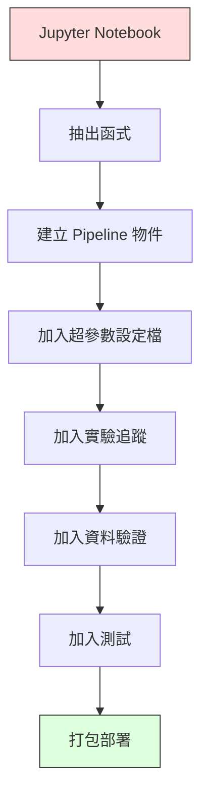

# 機器學習管線（ML pipeline）

> 模型（model）不是產品，管線（pipeline）才是。管線涵蓋從原始資料到部署後產生的預測（deployed prediction）之間的一切，而且每一步都必須可重現（reproducible）。

**Type:** Build
**Language:** Python
**Prerequisites:** Phase 2, Lesson 12 (Hyperparameter Tuning)
**Time:** ~120 minutes

## Learning Objectives｜學習目標

- 從頭打造一條機器學習管線，把補值（imputation）、縮放、編碼與模型（model）訓練（model training）串成單一可重現的物件
- 識別資料洩漏（data leakage）情境，並說明管線只在訓練資料（training data）上擬合 transformer，藉此防止洩漏
- 建構 ColumnTransformer，對數值特徵（numeric feature）與類別特徵（categorical feature）套用不同的前處理（preprocessing）
- 實作管線序列化（serialization），並展示同一個已擬合管線在訓練與正式環境（production）產生相同結果

## The Problem｜問題

你有一個 notebook：載入資料、用中位數（median）填缺失值（missing value）、縮放特徵（feature）、訓練模型（model）、印出準確率（accuracy）。能跑，你交付了。

一個月後，有人重新訓練模型（model），卻得到不同的結果。中位數是在包含測試資料（test data）的完整資料集（dataset）上算的（資料洩漏）。縮放參數沒有儲存，所以推論（inference）用了不同的統計量。特徵工程（feature engineering）程式碼在訓練與服務（serving）之間複製貼上，兩份程式碼後來不再一致。某個類別欄位（categorical column）在正式環境出現了編碼器（encoder）從未見過的新值。

這些都不是假設情境——它們是機器學習系統在正式環境失敗最常見的原因。管線把每個轉換步驟封裝成單一、有序、可重現的物件，一次解決所有問題。

## The Concept｜核心概念

### 什麼是管線

管線是一串有序的資料轉換，最後接一個模型（model）。每一步以前一步的輸出為輸入。整條管線只在訓練資料上擬合一次。推論時，同一條已擬合的管線轉換新資料並產生預測。


管線保證：
- 轉換只在訓練資料上擬合（無洩漏）
- 推論時套用相同的轉換
- 整個物件可以序列化，作為單一產物（artifact）部署
- 交叉驗證（cross-validation）會對每一折（fold）各自套用管線，防止隱晦的洩漏

### 資料洩漏：沉默的殺手

當測試集（test set）或未來資料的資訊污染了訓練，就發生資料洩漏。管線能防止最常見的資料洩漏形式。

**洩漏的寫法（錯誤）：**
```python
X = df.drop("target", axis=1)
y = df["target"]

scaler = StandardScaler()
X_scaled = scaler.fit_transform(X)

X_train, X_test = X_scaled[:800], X_scaled[800:]
y_train, y_test = y[:800], y[800:]
```

縮放器看到了測試資料——平均數（mean）與標準差（standard deviation）包含了測試樣本，這會讓準確率估計值偏高。

**正確寫法：**
```python
X_train, X_test = X[:800], X[800:]

scaler = StandardScaler()
X_train_scaled = scaler.fit_transform(X_train)
X_test_scaled = scaler.transform(X_test)
```

用了管線，你就不必再為這件事操心——管線自動處理好。

### sklearn Pipeline

sklearn 的 `Pipeline` 把 transformer 與一個 estimator 串起來，對外提供依序套用所有步驟的 `.fit()`、`.predict()` 與 `.score()`。

```python
from sklearn.pipeline import Pipeline
from sklearn.preprocessing import StandardScaler
from sklearn.linear_model import LogisticRegression

pipe = Pipeline([
    ("scaler", StandardScaler()),
    ("model", LogisticRegression()),
])

pipe.fit(X_train, y_train)
predictions = pipe.predict(X_test)
```

呼叫 `pipe.fit(X_train, y_train)` 時：
1. 縮放器對 X_train 呼叫 `fit_transform`
2. 模型（model）對縮放後的 X_train 呼叫 `fit`

呼叫 `pipe.predict(X_test)` 時：
1. 縮放器對 X_test 呼叫 `transform`（不是 fit_transform）
2. 模型（model）對縮放後的 X_test 呼叫 `predict`

擬合過程中縮放器從未看到測試資料——這正是重點所在。

### ColumnTransformer：不同欄位走不同管線

真實資料集同時有數值欄位（numeric column）與類別欄位，需要不同的前處理，`ColumnTransformer` 就是為此而生。

```python
from sklearn.compose import ColumnTransformer
from sklearn.preprocessing import StandardScaler, OneHotEncoder
from sklearn.impute import SimpleImputer

numeric_pipe = Pipeline([
    ("impute", SimpleImputer(strategy="median")),
    ("scale", StandardScaler()),
])

categorical_pipe = Pipeline([
    ("impute", SimpleImputer(strategy="most_frequent")),
    ("encode", OneHotEncoder(handle_unknown="ignore")),
])

preprocessor = ColumnTransformer([
    ("num", numeric_pipe, ["age", "income", "score"]),
    ("cat", categorical_pipe, ["city", "gender", "plan"]),
])

full_pipeline = Pipeline([
    ("preprocess", preprocessor),
    ("model", GradientBoostingClassifier()),
])
```

OneHotEncoder 的 `handle_unknown="ignore"` 對正式環境至關重要：當新類別出現（模型（model）從未見過的城市），它會產生零向量而不是直接崩潰。

### 實驗追蹤（experiment tracking）

管線讓訓練可重現，但你還需要追蹤每次實驗發生了什麼：用了哪些超參數（hyperparameters）、哪個版本的資料集、指標（metrics）是多少、跑的是哪份程式碼。

**MLflow** 是最常見的開源方案：

```python
import mlflow

with mlflow.start_run():
    mlflow.log_param("max_depth", 5)
    mlflow.log_param("n_estimators", 100)
    mlflow.log_param("learning_rate", 0.1)

    pipe.fit(X_train, y_train)
    accuracy = pipe.score(X_test, y_test)

    mlflow.log_metric("accuracy", accuracy)
    mlflow.sklearn.log_model(pipe, "model")
```

每次執行都記錄參數、指標、產物與完整模型（model）。你可以比較多次執行、重現任何實驗、部署任何模型（model）版本。

**Weights & Biases（wandb）** 提供相同功能，外加託管的儀表板：

```python
import wandb

wandb.init(project="my-pipeline")
wandb.config.update({"max_depth": 5, "n_estimators": 100})

pipe.fit(X_train, y_train)
accuracy = pipe.score(X_test, y_test)

wandb.log({"accuracy": accuracy})
```

### 模型（model）版本管理（model versioning）

做完實驗追蹤，還要管理模型（model）版本：哪個模型（model）在正式環境？哪個在預備環境（staging）？上週的是哪個？

MLflow 的 Model Registry（模型登錄）提供：
- **版本追蹤：** 每個儲存的模型（model）都有版本號
- **階段轉換：** 「Staging」、「Production」、「Archived」
- **核准流程（approval workflow）：** 模型（model）必須明確晉升（promote）至正式環境
- **回滾（rollback）：** 立即切回先前版本

### 用 DVC 做資料版本管理（data versioning）

程式碼用 git 做版本控制（version control），資料也該有版本——但 git 應付不了大型檔案。DVC（Data Version Control）解決這個問題。

```
dvc init
dvc add data/training.csv
git add data/training.csv.dvc data/.gitignore
git commit -m "Track training data"
dvc push
```

DVC 將實際資料儲存在遠端儲存空間（S3、GCS、Azure），git 裡只留一個記錄雜湊值的小 `.dvc` 檔。切換到某個 git commit 時，`dvc checkout` 會還原當時使用的確切資料。

也就是說，每個 git commit 同時固定程式碼和資料——完全可重現。

### 可重現的實驗

一個可重現的實驗需要四樣東西：

1. **固定亂數種子（fixed random seed）：** 為 numpy、random 與框架（framework，如 torch、sklearn）設種子
2. **鎖定相依套件（pinned dependencies）：** requirements.txt 或 poetry.lock 指定精確版本
3. **有版本的資料：** DVC 或類似工具
4. **設定檔（config file）：** 所有超參數放進設定檔，不要寫死在程式裡

```python
import numpy as np
import random

def set_seed(seed=42):
    random.seed(seed)
    np.random.seed(seed)
    try:
        import torch
        torch.manual_seed(seed)
        torch.cuda.manual_seed_all(seed)
        torch.backends.cudnn.deterministic = True
    except ImportError:
        pass
```

### 從 Notebook 到正式環境管線



典型的演進路徑：

1. **Notebook 探索：** 快速實驗、視覺化、特徵構想
2. **抽出函式：** 把前處理、特徵工程、評估搬進模組
3. **建立管線：** 把轉換串成 sklearn Pipeline 或自訂類別
4. **設定管理：** 把所有超參數搬進 YAML／JSON 設定檔
5. **實驗追蹤：** 加上 MLflow 或 wandb 記錄
6. **資料驗證：** 訓練前檢查結構描述（schema）、分布與缺失值模式
7. **測試：** transformer 的單元測試（unit test）＋整條管線的整合測試（integration test）
8. **部署：** 序列化管線，包進 API（FastAPI、Flask），做成容器（container）

### 常見管線錯誤

| 錯誤 | 為什麼糟 | 修正 |
|---------|-------------|-----|
| 切分前在完整資料上擬合 | 資料洩漏 | 用 Pipeline 搭配 cross_val_score |
| 特徵工程寫在管線外 | 訓練與服務的轉換不一致 | 把所有轉換放進 Pipeline |
| 沒處理未知類別 | 新值一出現正式環境就崩潰 | OneHotEncoder(handle_unknown="ignore") |
| 欄名寫死 | 結構描述一改就壞 | 從設定檔讀欄名清單 |
| 沒有資料驗證 | 壞資料進來就靜默給出錯誤預測 | 預測前加結構描述檢查 |
| 訓練／服務落差（training-serving skew） | 模型（model）在正式環境看到不同的特徵 | 訓練與服務共用同一個 Pipeline 物件 |

```figure
f3-pipeline-flow
```

## Build It｜動手實作

`code/pipeline.py` 裡的程式碼從頭打造一條完整的機器學習管線：

### 步驟 1：自訂 transformer

```python
class CustomTransformer:
    def __init__(self):
        self.means = None
        self.stds = None

    def fit(self, X):
        self.means = np.mean(X, axis=0)
        self.stds = np.std(X, axis=0)
        self.stds[self.stds == 0] = 1.0
        return self

    def transform(self, X):
        return (X - self.means) / self.stds

    def fit_transform(self, X):
        return self.fit(X).transform(X)
```

### 步驟 2：從頭實作管線

```python
class PipelineFromScratch:
    def __init__(self, steps):
        self.steps = steps

    def fit(self, X, y=None):
        X_current = X.copy()
        for name, step in self.steps[:-1]:
            X_current = step.fit_transform(X_current)
        name, model = self.steps[-1]
        model.fit(X_current, y)
        return self

    def predict(self, X):
        X_current = X.copy()
        for name, step in self.steps[:-1]:
            X_current = step.transform(X_current)
        name, model = self.steps[-1]
        return model.predict(X_current)
```

### 步驟 3：管線搭配交叉驗證

程式碼展示了管線搭配交叉驗證如何防止資料洩漏：縮放器在每一折的訓練資料上各自擬合。

### 步驟 4：用 sklearn 做完整的正式環境管線

一條完整的管線：含 `ColumnTransformer`、多條前處理路徑與一個模型（model），並以正確的交叉驗證與實驗記錄訓練。

## Ship It｜交付成果

本課會產出：
- `outputs/prompt-ml-pipeline.md`——一份用來建立與除錯機器學習管線的 skill
- `code/pipeline.py`——從零到 sklearn 的完整管線

## Exercises｜練習

1. 建立一條管線，處理含 3 個數值欄位與 2 個類別欄位的資料集。用 `ColumnTransformer` 對數值欄位做中位數補值（median imputation）＋縮放，對類別欄位做眾數補值（most-frequent imputation）＋one-hot 編碼（one-hot encoding）。用 5 折交叉驗證訓練。

2. 故意製造資料洩漏：切分前先在完整資料集上擬合縮放器。比較交叉驗證分數（洩漏版）與管線交叉驗證分數（無洩漏版），差距有多大？

3. 用 `joblib.dump` 序列化你的管線。在另一個程式檔案（script）裡載入並跑預測，驗證預測結果完全相同。

4. 在管線中加一個自訂 transformer，為最重要的兩個數值欄位產生二次多項式特徵（polynomial features）。它應該放在管線的哪個位置？

5. 為這條管線設定 MLflow 追蹤。用不同超參數跑 5 次實驗，用 MLflow UI（`mlflow ui`）比較各次執行並選出最佳模型（model）。

## Key Terms｜關鍵術語

| 術語 | 常見說法 | 實際意義 |
|------|----------------|----------------------|
| 管線 | 「一串轉換＋模型（model）」 | 一串有序、已擬合的 transformer 加上一個模型（model），作為單一單元套用以防止洩漏 |
| 資料洩漏 | 「測試資訊漏進訓練」 | 用訓練集以外的資訊建立模型（model），讓表現估計值偏高 |
| ColumnTransformer | 「每欄各自前處理」 | 對不同欄位子集套用不同管線，再合併結果 |
| 實驗追蹤 | 「記錄你的執行」 | 記錄每次訓練作業（training run）的參數、指標、產物與程式碼版本 |
| MLflow | 「追蹤並部署模型（model）」 | 開源的實驗追蹤、模型（model）登錄（model registry）與部署平台 |
| DVC | 「資料版 Git」 | 大型資料檔的版本控制系統：git 存雜湊、資料存遠端 |
| 模型（model）登錄（model registry） | 「模型（model）版本目錄」 | 以階段標籤（staging、production、archived）追蹤模型（model）版本的系統 |
| 訓練／服務落差 | 「notebook 裡明明是好的」 | 訓練與推論時資料處理方式不一致，造成靜默錯誤 |
| 可重現性（reproducibility） | 「同一份程式碼、同一個結果」 | 用相同程式碼、資料與設定得到相同結果的能力 |

## Further Reading｜延伸閱讀

- [scikit-learn Pipeline 文件](https://scikit-learn.org/stable/modules/compose.html)——官方管線參考
- [MLflow 文件](https://mlflow.org/docs/latest/index.html)——實驗追蹤與模型（model）登錄（model registry）
- [DVC 文件](https://dvc.org/doc)——資料版本管理
- [Sculley et al., Hidden Technical Debt in Machine Learning Systems (2015)](https://papers.nips.cc/paper/2015/hash/86df7dcfd896fcaf2674f757a2463eba-Abstract.html)——談機器學習系統複雜度的開山之作
- [Google ML Best Practices: Rules of ML](https://developers.google.com/machine-learning/guides/rules-of-ml)——實務上的正式環境 ML 建議
