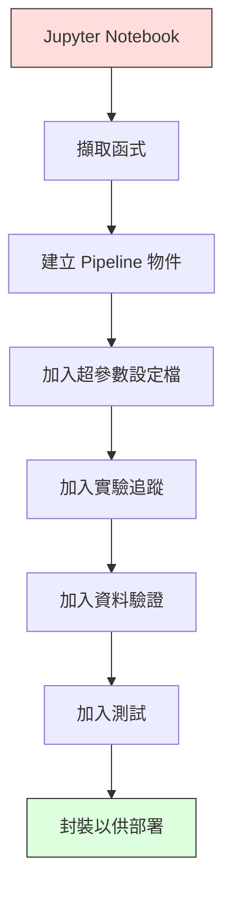

# 機器學習處理流程

> 模型不是產品，處理流程才是。處理流程涵蓋從原始資料到部署預測的所有步驟，而且每一步都必須可重現。

**Type:** Build
**Language:** Python
**Prerequisites:** Phase 2, Lesson 12 (Hyperparameter Tuning)
**Time:** ~120 minutes

## 學習目標

- 從零建立機器學習處理流程，將插補、縮放、編碼和模型訓練串成單一、可重現的物件
- 辨識資料洩漏情境，並說明處理流程如何透過只在訓練資料上擬合轉換器來防止洩漏
- 建立 ColumnTransformer，對數值和類別特徵套用不同前處理
- 實作處理流程序列化，並展示相同的已擬合流程在訓練和正式環境會產生相同結果

## 問題

你有一個 Notebook，會載入資料、以中位數填補缺失值、縮放特徵、訓練模型並輸出準確率。一切運作正常，於是你部署了它。

一個月後，有人重新訓練模型，卻得到不同結果。中位數是在包含測試資料的完整資料集上計算（資料洩漏）；縮放參數沒有儲存，因此推論時使用不同統計值；特徵工程程式碼在訓練和服務端各複製一份，後來兩份內容不一致；類別欄位在正式環境出現編碼器從未看過的新值。

這些都不是假設情況，而是機器學習系統在正式環境中失效的最常見原因。處理流程能將每個轉換步驟包成一個有順序、可重現的物件，一次解決所有問題。

## 核心概念

### 什麼是處理流程

處理流程是依序排列的資料轉換和模型。每個步驟都會將上一個步驟的輸出作為輸入。整個處理流程只會在訓練資料上擬合一次；推論時，再用相同的已擬合流程轉換新資料並產生預測。


處理流程可確保：
- 轉換器只在訓練資料上擬合（沒有資料洩漏）
- 推論時套用相同的轉換
- 整個物件可序列化並以單一產物部署
- 交叉驗證會在每一折各自套用處理流程，避免細微的資料洩漏

### 資料洩漏：悄無聲息的殺手

測試集或未來資料的資訊滲入訓練，就會發生資料洩漏。處理流程可以防止最常見的洩漏方式。

**會洩漏的錯誤做法：**
```python
X = df.drop("target", axis=1)
y = df["target"]

scaler = StandardScaler()
X_scaled = scaler.fit_transform(X)

X_train, X_test = X_scaled[:800], X_scaled[800:]
y_train, y_test = y[:800], y[800:]
```

縮放器看過測試資料，因此平均值和標準差包含測試樣本，會讓準確率估計看起來比實際更高。

**正確做法：**
```python
X_train, X_test = X[:800], X[800:]

scaler = StandardScaler()
X_train_scaled = scaler.fit_transform(X_train)
X_test_scaled = scaler.transform(X_test)
```

使用處理流程後，你不必擔心這個問題，流程會自動正確處理。

### sklearn 的 Pipeline

sklearn 的 `Pipeline` 會串接轉換器和估計器，並提供 `.fit()`、`.predict()` 和 `.score()`，依序套用所有步驟。

```python
from sklearn.pipeline import Pipeline
from sklearn.preprocessing import StandardScaler
from sklearn.linear_model import LogisticRegression

pipe = Pipeline([
    ("scaler", StandardScaler()),
    ("model", LogisticRegression()),
])

pipe.fit(X_train, y_train)
predictions = pipe.predict(X_test)
```

呼叫 `pipe.fit(X_train, y_train)` 時：
1. 縮放器對 X_train 呼叫 `fit_transform`。
2. 模型對縮放後的 X_train 呼叫 `fit`。

呼叫 `pipe.predict(X_test)` 時：
1. 縮放器對 X_test 呼叫 `transform`（不是 `fit_transform`）。
2. 模型對縮放後的 X_test 呼叫 `predict`。

縮放器在擬合期間不會看見測試資料，這就是處理流程的全部重點。

### ColumnTransformer：不同欄位使用不同處理流程

真實資料集包含數值和類別欄位，需要不同的前處理方式。`ColumnTransformer` 可以處理這件事。

```python
from sklearn.compose import ColumnTransformer
from sklearn.preprocessing import StandardScaler, OneHotEncoder
from sklearn.impute import SimpleImputer

numeric_pipe = Pipeline([
    ("impute", SimpleImputer(strategy="median")),
    ("scale", StandardScaler()),
])

categorical_pipe = Pipeline([
    ("impute", SimpleImputer(strategy="most_frequent")),
    ("encode", OneHotEncoder(handle_unknown="ignore")),
])

preprocessor = ColumnTransformer([
    ("num", numeric_pipe, ["age", "income", "score"]),
    ("cat", categorical_pipe, ["city", "gender", "plan"]),
])

full_pipeline = Pipeline([
    ("preprocess", preprocessor),
    ("model", GradientBoostingClassifier()),
])
```

`OneHotEncoder` 中的 `handle_unknown="ignore"` 對正式環境非常重要。出現新類別（例如模型從未看過的城市）時，它會產生零向量，而不會讓程式崩潰。

### 實驗追蹤

處理流程讓訓練可重現，但你還要追蹤每次實驗的內容：使用哪些超參數、哪個資料集版本、得到哪些指標，以及執行了哪一版程式碼。

**MLflow** 是最常見的開源解決方案：

```python
import mlflow

with mlflow.start_run():
    mlflow.log_param("max_depth", 5)
    mlflow.log_param("n_estimators", 100)
    mlflow.log_param("learning_rate", 0.1)

    pipe.fit(X_train, y_train)
    accuracy = pipe.score(X_test, y_test)

    mlflow.log_metric("accuracy", accuracy)
    mlflow.sklearn.log_model(pipe, "model")
```

每次執行都會記錄參數、指標、產物和完整模型。你可以比較不同執行結果、重現任何實驗，並部署任一模型版本。

**Weights & Biases（wandb）**提供相同功能，並附有託管式儀表板：

```python
import wandb

wandb.init(project="my-pipeline")
wandb.config.update({"max_depth": 5, "n_estimators": 100})

pipe.fit(X_train, y_train)
accuracy = pipe.score(X_test, y_test)

wandb.log({"accuracy": accuracy})
```

### 模型版本管理

實驗追蹤之後，還需要管理模型版本：目前哪個模型在正式環境？哪個在預備環境？上週使用的是哪一個？

MLflow 的 Model Registry 提供：
- **版本追蹤：** 每個儲存的模型都有版本號
- **階段轉換：**「Staging」、「Production」、「Archived」
- **核准流程：** 模型必須明確升級才能部署到正式環境
- **回復版本：** 可立即切回先前版本

### 使用 DVC 管理資料版本

程式碼透過 git 進行版本管理，資料也應該版本管理，但 git 無法處理大型檔案。DVC（Data Version Control，資料版本控制）可以解決這個問題。

```bash
dvc init
dvc add data/training.csv
git add data/training.csv.dvc data/.gitignore
git commit -m "Track training data"
dvc push
```

DVC 將實際資料儲存在遠端儲存空間（S3、GCS、Azure），並在 git 中保留記錄雜湊值的小型 `.dvc` 檔案。簽出某個 git 提交時，執行 `dvc checkout` 就會還原當時使用的確切資料。

因此，每筆 git 提交都會同時固定程式碼和資料版本，達到完整可重現。

### 可重現實驗

可重現實驗需要四項條件：

1. **固定亂數種子：** 為 numpy、random 和框架（torch、sklearn）設定種子。
2. **固定相依套件版本：** 使用 requirements.txt 或 poetry.lock 記錄精確版本。
3. **資料版本管理：** 使用 DVC 或類似工具。
4. **設定檔：** 將所有超參數放在設定檔，不要寫死在程式碼中。

```python
import numpy as np
import random

def set_seed(seed=42):
    random.seed(seed)
    np.random.seed(seed)
    try:
        import torch
        torch.manual_seed(seed)
        torch.cuda.manual_seed_all(seed)
        torch.backends.cudnn.deterministic = True
    except ImportError:
        pass
```

### 從 Notebook 到正式環境處理流程



常見發展步驟如下：

1. **Notebook 探索：** 快速實驗、視覺化、發想特徵。
2. **擷取函式：** 將前處理、特徵工程和評估移至模組。
3. **建立處理流程：** 將轉換串成 sklearn Pipeline 或自訂類別。
4. **管理設定：** 將所有超參數移至 YAML/JSON 設定檔。
5. **追蹤實驗：** 加入 MLflow 或 wandb 記錄。
6. **驗證資料：** 訓練前檢查結構、分布和缺失值模式。
7. **測試：** 為轉換器撰寫單元測試，為整個流程撰寫整合測試。
8. **部署：** 序列化處理流程、包裝成 API（FastAPI、Flask），再放入容器。

### 處理流程常見錯誤

| 錯誤 | 問題 | 修正方式 |
|------|------|----------|
| 切分前先用完整資料擬合 | 資料洩漏 | 使用 Pipeline 搭配 cross_val_score |
| 在處理流程外做特徵工程 | 訓練與服務階段的轉換不同 | 將所有轉換放進 Pipeline |
| 未處理未知類別 | 正式環境遇到新值時崩潰 | OneHotEncoder(handle_unknown="ignore") |
| 寫死欄位名稱 | 結構改變時失效 | 從設定檔讀取欄位清單 |
| 未驗證資料 | 不良資料造成錯誤預測卻不會顯示錯誤 | 預測前檢查資料結構 |
| 訓練／服務偏差 | 正式環境的模型輸入特徵不同 | 訓練與推論使用同一個 Pipeline 物件 |

```figure
f3-pipeline-flow
```

## Build It：從零實作

`code/pipeline.py` 會從零建立完整的機器學習處理流程：

### 步驟 1：自訂轉換器

```python
class CustomTransformer:
    def __init__(self):
        self.means = None
        self.stds = None

    def fit(self, X):
        self.means = np.mean(X, axis=0)
        self.stds = np.std(X, axis=0)
        self.stds[self.stds == 0] = 1.0
        return self

    def transform(self, X):
        return (X - self.means) / self.stds

    def fit_transform(self, X):
        return self.fit(X).transform(X)
```

### 步驟 2：從零建立處理流程

```python
class PipelineFromScratch:
    def __init__(self, steps):
        self.steps = steps

    def fit(self, X, y=None):
        X_current = X.copy()
        for name, step in self.steps[:-1]:
            X_current = step.fit_transform(X_current)
        name, model = self.steps[-1]
        model.fit(X_current, y)
        return self

    def predict(self, X):
        X_current = X.copy()
        for name, step in self.steps[:-1]:
            X_current = step.transform(X_current)
        name, model = self.steps[-1]
        return model.predict(X_current)
```

### 步驟 3：搭配處理流程進行交叉驗證

程式展示交叉驗證搭配處理流程如何防止資料洩漏：縮放器會在每一折分別使用該折的訓練資料擬合。

### 步驟 4：使用 sklearn 建立完整正式環境流程

建立完整流程，使用 `ColumnTransformer`、多條前處理路徑和模型，並透過適當交叉驗證及實驗記錄進行訓練。

## Ship It：交付成果

本課程會產生：
- `outputs/prompt-ml-pipeline.md`——協助建構和除錯機器學習處理流程的 skill
- `code/pipeline.py`——從零實作到 sklearn 的完整處理流程

## Exercises：練習

1. 為含有 3 個數值欄位和 2 個類別欄位的資料集建立處理流程。使用 ColumnTransformer：數值欄位執行中位數插補和縮放，類別欄位執行最常見值插補和獨熱編碼。使用 5 折交叉驗證訓練。

2. 刻意引入資料洩漏：切分前先在完整資料集上擬合縮放器，比較洩漏版和乾淨處理流程的交叉驗證分數。差異有多大？

3. 使用 `joblib.dump` 序列化處理流程，在另一個指令碼中載入並執行預測，確認預測結果完全相同。

4. 在處理流程中加入自訂轉換器，為最重要的兩個數值欄位建立 2 次多項式特徵。它應放在流程的哪個位置？

5. 為處理流程設定 MLflow 實驗追蹤。使用不同超參數執行 5 次實驗，再透過 MLflow UI（`mlflow ui`）比較結果並選出最佳模型。

## 關鍵詞

| 術語 | 一般說法 | 實際意義 |
|------|----------|----------|
| 處理流程 |「轉換器串接模型」| 依序套用已擬合的轉換器和模型，作為單一單位防止資料洩漏 |
| 資料洩漏 |「測試資訊流進訓練」| 使用訓練集以外的資訊建構模型，讓效能估計看起來過度樂觀 |
| ColumnTransformer |「每欄使用不同前處理」| 對不同欄位子集套用不同處理流程，再合併結果 |
| 實驗追蹤 |「記錄每次執行」| 記錄每次訓練所用的參數、指標、產物和程式碼版本 |
| MLflow |「追蹤與部署模型」| 開源平台，支援實驗追蹤、模型註冊和部署 |
| DVC |「資料版 git」| 管理大型資料檔的版本控制系統，在 git 中記錄雜湊值，在遠端儲存空間保存資料 |
| 模型註冊表 |「模型版本目錄」| 透過階段標籤（預備、正式、封存）追蹤模型版本的系統 |
| 訓練／服務偏差 |「Notebook 裡可以，正式環境不行」| 訓練和推論期間處理資料的方式不同，造成難以察覺的錯誤 |
| 可重現性 |「相同程式碼得到相同結果」| 使用相同程式碼、資料和設定時，能取得完全相同結果的能力 |

## 延伸閱讀

- [scikit-learn Pipeline 文件](https://scikit-learn.org/stable/modules/compose.html)：官方處理流程參考資料
- [MLflow 文件](https://mlflow.org/docs/latest/index.html)：實驗追蹤和模型註冊
- [DVC 文件](https://dvc.org/doc)：資料版本管理
- [Sculley 等人：〈Hidden Technical Debt in Machine Learning Systems〉（2015）](https://papers.nips.cc/paper/2015/hash/86df7dcfd896fcaf2674f757a2463eba-Abstract.html)：探討機器學習系統複雜度的經典論文
- [Google 機器學習最佳實務：Rules of ML](https://developers.google.com/machine-learning/guides/rules-of-ml)：正式環境機器學習的實用建議
