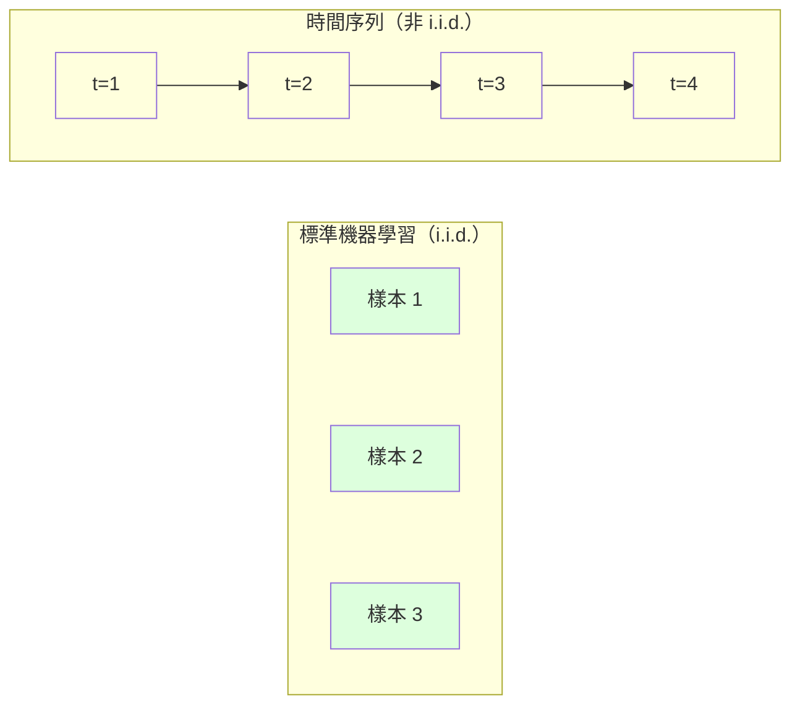
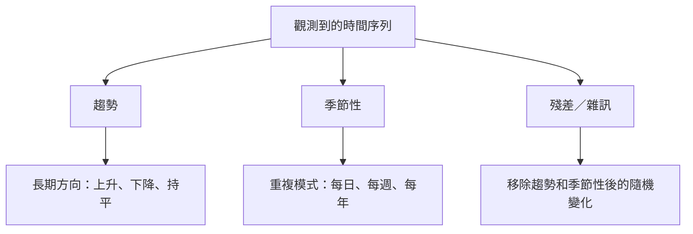
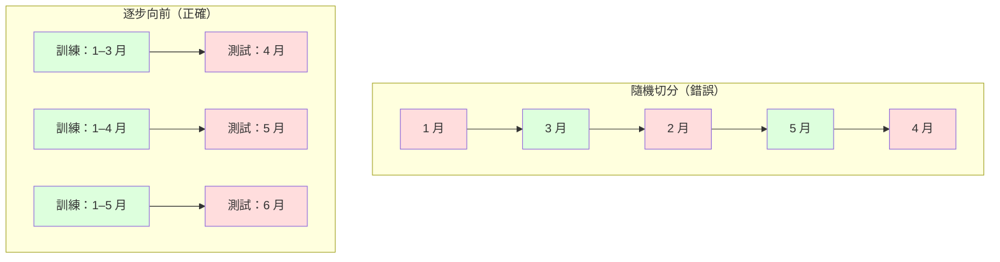

# 時間序列基礎

> 只要先檢查定態性，過去的表現確實能預測未來。

**Type:** Build
**Language:** Python
**Prerequisites:** Phase 2, Lessons 01-09
**Time:** ~90 minutes

## 學習目標

- 將時間序列分解為趨勢、季節性與殘差，並檢查定態性
- 實作落後特徵與滾動統計量，將時間序列轉成監督式學習問題
- 建立逐步向前驗證架構，避免未來資料洩漏到訓練資料
- 說明為什麼時間序列不能隨機切分訓練集與測試集，並比較隨機切分和正確時間切分的效能差距

## 問題

你有一份依時間排序的資料，例如每日銷售額、每小時氣溫、每分鐘 CPU 使用率或每週股價。你想預測下一個值、下週或下一季的數值。

你拿出熟悉的機器學習工具：隨機切分訓練集與測試集、交叉驗證、輸入特徵矩陣並產生預測。但這些步驟全都不適用。

時間序列違反了標準機器學習所依賴的假設。樣本並非彼此獨立：今天的氣溫會受到昨天影響。隨機切分會把未來資訊洩漏到過去。回測時看似有效的特徵，也可能因時間推移後模式改變而在正式環境中失效。

使用隨機交叉驗證時準確率可能達到 95%，換成正確的時間切分評估後卻只剩 55%。這不是枝微末節，而是紙上看似有效的模型和正式環境中真正有效的模型之間的差別。

本課將介紹時間資料的特性、如何誠實評估模型，以及如何將時間序列轉成標準機器學習模型可用的特徵。

## 核心概念

### 時間序列有何不同

標準機器學習假設資料是 i.i.d.，也就是獨立同分布。每筆樣本都獨立地從相同分布中抽出。時間序列同時違反這兩個條件：

- **並非彼此獨立。** 今天的股價會受昨天影響；本週銷售額會和上週相關。
- **並非同分布。** 分布會隨時間改變。12 月的銷售狀況和 3 月不同。

這些違反並非小問題，而是會改變特徵建構方式、模型評估方法，以及適用的演算法。



在標準機器學習中，樣本可以互換，打亂順序不會造成影響。時間序列則完全不同：順序就是一切，打亂資料會破壞其中的訊號。

### 時間序列的組成

每個時間序列都由以下部分組合而成：



- **趨勢：** 長期的變化方向，例如營收每年成長 10%、全球氣溫上升。
- **季節性：** 按固定間隔重複出現的模式，例如零售業 12 月銷售額暴增、冷氣使用量在 7 月達到高峰。
- **殘差：** 移除趨勢和季節性後剩餘的部分。如果殘差看起來像白雜訊，表示分解已捕捉到主要訊號。

### 定態性

如果時間序列的統計特性（平均值、變異數、自相關）不會隨時間改變，就稱為定態序列。大多數預測方法都假設資料是定態的。

**為什麼重要：** 非定態序列的平均值會漂移。使用 1 月資料訓練的模型所學到的平均值，可能與 2 月實際情況不同，因此預測會持續出錯。

**如何檢查：** 計算不同時間視窗的滾動平均值和滾動標準差。如果這些數值持續漂移，序列就不是定態的。

**如何處理：** 使用差分。不要直接建模原始值，而是建模相鄰時間點的變化：

```text
diff[t] = value[t] - value[t-1]
```

如果一次差分仍未讓序列達到定態，可以再做一次（二階差分）。大多數真實資料最多做兩次就足夠。

**範例：**

原始序列：[100, 102, 106, 112, 120]
一階差分：[2, 4, 6, 8]（仍持續上升）
二階差分：[2, 2, 2]（固定不變，達到定態）

原始序列有二次趨勢。一階差分後轉成線性趨勢，二階差分後則變成平坦序列。實務上很少需要差分超過兩次。

**正式檢定：** 增廣 Dickey-Fuller（ADF）檢定是常用的定態性統計檢定。其虛無假設是「序列為非定態」。p 值低於 0.05 時，可以拒絕虛無假設並判定序列為定態。我們不會從頭實作 ADF（它需要漸近分布表），但程式中的滾動統計量能提供實用的視覺檢查。

### 自相關

自相關衡量時間 t 的數值與 t-k 時刻數值（往前 k 步）之間的相關程度。自相關函數（ACF）會繪出各個落後期 k 的相關性。

**ACF 可以告訴你：**
- 序列保留多久的過去資訊。如果 ACF 在落後期 5 之後降為 0，超過 5 個時間步的資料就不再相關。
- 是否存在季節性。如果月資料的 ACF 在落後期 12 出現尖峰，表示有年度季節性。
- 要建立多少個落後特徵。可以使用 ACF 尚未降到可忽略程度前的所有落後期。

**PACF（偏自相關函數）** 會移除間接相關性。若今天和三天前的相關性只是因為兩者都與昨天相關，那麼 ACF 在落後期 3 仍會顯示相關，但 PACF 在落後期 3 會是 0。

### 落後特徵：將時間序列轉成監督式學習

標準機器學習模型需要特徵矩陣 X 和目標 y；時間序列則只有一欄數值。落後特徵就是兩者之間的橋梁。

以序列 [10, 12, 14, 13, 15] 為例，建立落後 1 期與落後 2 期的特徵：

| lag_2 | lag_1 | 目標值 |
|-------|-------|--------|
| 10    | 12    | 14     |
| 12    | 14    | 13     |
| 14    | 13    | 15     |

現在你就有標準的迴歸問題。任何機器學習模型（線性迴歸、隨機森林、梯度提升）都能根據這些落後值預測目標。

還可以設計其他特徵：
- **滾動統計量：** 最近 k 個值的平均值、標準差、最小值和最大值
- **日曆特徵：** 星期幾、月份、`is_holiday`、`is_weekend`
- **差分值：** 和前一個時間點相比的變化
- **擴展統計量：** 累積平均值、累積總和
- **比率特徵：** 目前值／滾動平均值（偏離近期平均的程度）
- **交互特徵：** `lag_1 * day_of_week`（週幾對動能的影響）

**要用多少個落後期？** 參考自相關函數。如果 ACF 到落後期 10 都仍顯著，就至少使用 10 個落後期。如果有每週季節性，應納入落後 7 期（也可以加上 14 期）。更多落後期能提供更多歷史資訊，但也會增加待擬合的特徵數量，提高過度擬合風險。

**目標值對齊陷阱。** 建立落後特徵時，目標必須是時間 t 的數值，而所有特徵只能使用時間 t-1 或更早的資料。如果不小心把時間 t 的數值也放進特徵，就會得到完美預測器，卻完全無法實際使用。這是時間序列特徵工程中最常見的錯誤。

### 逐步向前驗證

這是本課最重要的概念。標準的 K 折交叉驗證會隨機分派訓練與測試樣本；對時間序列來說，這會洩漏未來資訊。



逐步向前驗證的步驟：
1. 使用時間 t 以前的資料訓練
2. 預測時間 t+1 的數值（多步預測時則預測 t+1 到 t+k）
3. 將視窗往前移動
4. 重複以上步驟

每個測試折都只包含晚於所有訓練資料的資料，不會發生未來資料洩漏，因此能誠實估計模型部署後的效能。

**擴展視窗**會使用所有歷史資料訓練，訓練視窗逐漸變大。**滑動視窗**會使用固定大小的訓練視窗，並隨時間往前移動。如果較早的資料仍有參考價值，使用擴展視窗；如果環境變化使舊資料有害，則使用滑動視窗。

### ARIMA 的直觀理解

ARIMA 是經典的時間序列模型，由三個部分組成：

- **AR（自我迴歸）：** 根據過去的數值預測。AR(p) 使用最近 p 個數值。
- **I（整合）：** 透過差分達到定態。I(d) 表示進行 d 次差分。
- **MA（移動平均）：** 根據過去的預測誤差進行預測。MA(q) 使用最近 q 個誤差。

ARIMA(p, d, q) 結合這三個部分。可根據 ACF／PACF 分析或自動搜尋（auto-ARIMA）選擇 p、d、q。

本課不會從頭實作 ARIMA，因為這需要超出本課範圍的數值最佳化。關鍵是理解各部分的功能，才能解讀 ARIMA 結果並判斷何時使用。

### 如何選擇方法

| 方法 | 適用情境 | 處理季節性 | 處理外部特徵 |
|----------|---------|-------------------|------------------------|
| 落後特徵 + 機器學習 | 含有許多外部特徵的表格資料 | 可以，搭配日曆特徵 | 可以 |
| ARIMA | 單一變量的短期序列 | SARIMA 變體 | 不行（ARIMAX 僅能有限度處理） |
| 指數平滑 | 簡單趨勢與季節性 | 可以（Holt-Winters） | 不行 |
| Prophet | 商業預測、假日 | 可以（Fourier 項） | 有限度 |
| 神經網路（LSTM、Transformer） | 長序列、多個序列 | 從資料中學習 | 可以 |

多數實務問題都適合先從「落後特徵 + 梯度提升」開始。這種方法能自然處理外部特徵，不要求序列為定態，也容易除錯。

### 預測範圍與策略

單步預測會預測下一個時間點，多步預測則會預測多個時間點。有三種策略：

**遞迴式（反覆預測）：** 先預測下一步，再將預測值當成下一次的輸入。方法簡單，但誤差會累積：每個預測都用到前一次的預測，因此錯誤會逐步放大。

**直接式：** 每個預測範圍各訓練一個模型。Model-1 預測 t+1，Model-5 預測 t+5。這種方式不會累積預測誤差，但每個模型能使用的訓練樣本較少，而且彼此不會共享資訊。

**多輸出式：** 訓練一個模型，同時輸出所有預測範圍的結果。這種方式能共享各範圍的資訊，但模型必須支援多輸出（或使用自訂損失函式）。

多數實務問題可從短期範圍（1–5 步）的遞迴式預測開始；較長期則採用直接式預測。

### 時間序列常見錯誤

| 錯誤 | 原因 | 修正方式 |
|---------|---------------|-----------|
| 隨機切分訓練集與測試集 | 沿用標準機器學習的習慣 | 使用逐步向前驗證或時間切分 |
| 使用未來特徵 | 不小心納入時間 t 的特徵 | 檢查每個特徵的時間對齊 |
| 對季節性過度擬合 | 模型記住日曆模式 | 在測試集中保留完整的季節週期 |
| 忽略尺度變化 | 營收翻倍，但模式不變 | 改建模百分比變化，而非絕對值 |
| 落後特徵太多 | 認為歷史資料越多越好 | 使用 ACF 決定相關落後期 |
| 未做差分 | 認為模型會自行處理 | 樹模型能處理趨勢；線性模型需要定態資料 |

```figure
f3-series-decompose
```

## Build It：動手實作

`code/time_series.py` 會從頭實作時間序列的核心建構區塊。

### 落後特徵產生器

```python
def make_lag_features(series, n_lags):
    n = len(series)
    X = np.full((n, n_lags), np.nan)
    for lag in range(1, n_lags + 1):
        X[lag:, lag - 1] = series[:-lag]
    valid = ~np.isnan(X).any(axis=1)
    return X[valid], series[valid]
```

將一維序列轉成特徵矩陣：每一列包含最近 `n_lags` 個數值作為特徵，並以目前值作為目標。

### 逐步向前交叉驗證

```python
def walk_forward_split(n_samples, n_splits=5, min_train=50):
    assert min_train < n_samples, "min_train must be less than n_samples"
    step = max(1, (n_samples - min_train) // n_splits)
    for i in range(n_splits):
        train_end = min_train + i * step
        test_end = min(train_end + step, n_samples)
        if train_end >= n_samples:
            break
        yield slice(0, train_end), slice(train_end, test_end)
```

每次切分都會確保訓練資料嚴格早於測試資料。每一折的訓練視窗都會逐漸擴大。

### 簡易自我迴歸模型

純 AR 模型就是對落後特徵進行線性迴歸：

```python
class SimpleAR:
    def __init__(self, n_lags=5):
        self.n_lags = n_lags
        self.weights = None
        self.bias = None

    def fit(self, series):
        X, y = make_lag_features(series, self.n_lags)
        # Solve via normal equations
        X_b = np.column_stack([np.ones(len(X)), X])
        theta = np.linalg.lstsq(X_b, y, rcond=None)[0]
        self.bias = theta[0]
        self.weights = theta[1:]
        return self
```

概念上，這和第 02 課的線性迴歸完全相同，只是改用同一變數在不同時間點的數值作為特徵。

### 定態性檢查

程式碼會計算滾動統計量，從視覺和數值兩方面評估定態性：

```python
def check_stationarity(series, window=50):
    rolling_mean = np.array([
        series[max(0, i - window):i].mean()
        for i in range(1, len(series) + 1)
    ])
    rolling_std = np.array([
        series[max(0, i - window):i].std()
        for i in range(1, len(series) + 1)
    ])
    return rolling_mean, rolling_std
```

如果滾動平均值漂移或滾動標準差改變，表示序列不是定態的。進行差分後再檢查一次。

程式碼也會比較序列前半段與後半段來檢查定態性。如果兩段的平均值差異超過半個標準差，或變異數比值超過 2 倍，就會將序列標記為非定態。

### 自相關

```python
def autocorrelation(series, max_lag=20):
    n = len(series)
    mean = series.mean()
    var = series.var()
    acf = np.zeros(max_lag + 1)
    for k in range(max_lag + 1):
        cov = np.mean((series[:n-k] - mean) * (series[k:] - mean))
        acf[k] = cov / var if var > 0 else 0
    return acf
```

## Use It：套用現成工具

使用 sklearn 時，可以將落後特徵直接搭配任何迴歸器：

```python
from sklearn.linear_model import Ridge
from sklearn.ensemble import GradientBoostingRegressor

X, y = make_lag_features(series, n_lags=10)

for train_idx, test_idx in walk_forward_split(len(X)):
    model = Ridge(alpha=1.0)
    model.fit(X[train_idx], y[train_idx])
    predictions = model.predict(X[test_idx])
```

使用 statsmodels 建立 ARIMA：

```python
from statsmodels.tsa.arima.model import ARIMA

model = ARIMA(train_series, order=(5, 1, 2))
fitted = model.fit()
forecast = fitted.forecast(steps=30)
```

`time_series.py` 會示範這兩種方法，並使用逐步向前驗證比較結果。

### sklearn 的 TimeSeriesSplit

sklearn 提供 `TimeSeriesSplit`，可實作逐步向前驗證：

```python
from sklearn.model_selection import TimeSeriesSplit

tscv = TimeSeriesSplit(n_splits=5)
for train_index, test_index in tscv.split(X):
    X_train, X_test = X[train_index], X[test_index]
    y_train, y_test = y[train_index], y[test_index]
    model.fit(X_train, y_train)
    score = model.score(X_test, y_test)
```

這和我們從頭實作的 `walk_forward_split` 等效，但已整合進 sklearn 的交叉驗證架構。也可以搭配 `cross_val_score` 使用：

```python
from sklearn.model_selection import cross_val_score

scores = cross_val_score(model, X, y, cv=TimeSeriesSplit(n_splits=5))
print(f"Mean score: {scores.mean():.4f} +/- {scores.std():.4f}")
```

### 評估指標

時間序列預測會使用迴歸指標，但須放在時間序列脈絡中理解：

- **MAE（平均絕對誤差）：** `|y_true - y_pred|` 的平均值。容易用原始單位解讀，例如「預測平均差了 3.2 度」。
- **RMSE（均方根誤差）：** 均方誤差的平方根。比 MAE 更重視較大的誤差；如果一次大錯比多次小錯更糟，就使用 RMSE。
- **MAPE（平均絕對百分比誤差）：** `|error / true_value| * 100` 的平均值。與尺度無關，適合跨不同序列比較，但真實值為 0 時無法計算。
- **比較樸素基準：** 一定要與簡單基準比較。季節性樸素基準會預測上個週期的數值（例如昨天或上週的數值）。如果模型無法勝過樸素基準，就表示有問題。

### 滾動特徵

程式碼會示範如何將視窗為 7 天和 14 天的滾動平均值、標準差、最小值與最大值加入落後特徵。這些特徵能提供近期趨勢與波動資訊，補足落後特徵本身無法表達的部分。

例如，滾動平均值上升可能表示趨勢向上；滾動標準差增加可能表示波動加劇。樹模型能從資料中學到這類模式，線性模型則無法。

## Ship It：交付成果

本課程會產出：
- `outputs/prompt-time-series-advisor.md`：協助梳理時間序列問題的提示
- `code/time_series.py`：落後特徵、逐步向前驗證、AR 模型和定態性檢查

### 必須超越的基準

建立任何模型前，先設定基準：

1. **最後值（持續性預測）。** 預測明天和今天相同。許多序列很難超越這種簡單方法。
2. **季節性樸素預測。** 預測今天和上週（或去年）的同一天相同。如果模型無法勝過它，就代表模型尚未學到季節性以外的有效模式。
3. **移動平均。** 預測最近 k 個值的平均值。這種方法能平滑雜訊，但無法捕捉突然變化。

如果複雜的機器學習模型輸給季節性樸素基準，就表示程式有錯。最常見的原因是特徵包含未來資訊、評估方法錯誤，或序列本身確實隨機且無法預測。

### 實務建議

1. **先繪圖。** 建模前先繪出原始序列，觀察趨勢、季節性、離群值和結構性轉變（行為突然改變）。花 30 秒目視檢查，往往比一小時的自動分析更有收穫。

2. **先做差分，再建模。** 如果序列有明顯趨勢，先做差分再建立落後特徵。樹模型能處理趨勢，但線性模型不行；差分則不會有害。

3. **至少保留一個完整季節週期。** 如果有每週季節性，測試集至少要包含完整的一週；若有每月季節性，則至少要包含一個月。否則無法評估模型是否捕捉到季節模式。

4. **在正式環境監控。** 隨著環境改變，時間序列模型的表現會逐漸下降。持續追蹤滾動預測誤差；誤差開始增加時，就使用近期資料重新訓練模型。

5. **留意體制變化。** 使用疫情前資料訓練的模型，無法預測疫情後的行為。可以將已知體制變化的指標加入特徵，或使用會捨棄舊資料的滑動視窗。

6. **對偏態序列取對數。** 營收、價格和計數通常呈右偏分布。取對數可穩定變異數，並將乘法模式轉成線性模型可處理的加法模式。先在對數空間預測，再取指數還原原始單位。

## Exercises：練習

1. **定態性實驗。** 產生一個具有線性趨勢的序列，使用滾動統計量檢查定態性，再做一階差分並重新檢查。二次趨勢需要做幾次差分？

2. **選擇落後期。** 對週期為 7 的季節序列計算 ACF。哪些落後期的自相關最高？只使用這些落後期建立特徵（而不是連續的落後期）。和使用落後 1 到 7 期相比，準確率有改善嗎？

3. **比較逐步向前驗證和隨機切分。** 對落後特徵訓練 Ridge 迴歸，分別使用隨機 80／20 切分和逐步向前驗證。隨機切分讓效能看起來高了多少？

4. **特徵工程。** 在落後特徵中加入視窗為 7 天的滾動平均值、滾動標準差和星期幾特徵。使用逐步向前驗證比較加入這些特徵前後的準確率。

5. **多步預測。** 修改 AR 模型，讓它一次預測未來 5 步而非 1 步。比較兩種策略：（a）先預測一步，再把預測值當作下一步輸入（遞迴式）；（b）每個預測範圍各自訓練一個模型（直接式）。哪種方法較準確？

## 關鍵詞

| 術語 | 常見說法 | 實際意義 |
|------|----------------|----------------------|
| 定態性 | 「統計特性不隨時間改變」 | 平均值、變異數和自相關結構會隨時間保持固定的序列 |
| 差分 | 「相鄰數值相減」 | 計算 `y[t] - y[t-1]`，移除趨勢並使序列達到定態 |
| 自相關（ACF） | 「序列和自身的相關性」 | 時間序列與其落後版本之間的相關性，隨落後期而變化 |
| 偏自相關（PACF） | 「只看直接相關」 | 移除所有較短落後期的影響後，落後期 k 的自相關 |
| 落後特徵 | 「把過去值當成輸入」 | 使用 `y[t-1]`、`y[t-2]`、…、`y[t-k]` 等特徵預測 `y[t]` |
| 逐步向前驗證 | 「符合時間順序的交叉驗證」 | 依時間順序評估，訓練資料總是早於測試資料 |
| ARIMA | 「經典時間序列模型」 | 自我迴歸整合移動平均模型：結合過去數值（AR）、差分（I）和過去誤差（MA） |
| 季節性 | 「重複的日曆模式」 | 時間序列中依日、週、年等日曆週期規律重複出現的循環 |
| 趨勢 | 「長期變化方向」 | 序列水準隨時間持續上升或下降 |
| 擴展視窗 | 「使用所有歷史資料」 | 逐步向前驗證中，訓練集隨每一折逐漸擴大 |
| 滑動視窗 | 「固定大小的歷史資料」 | 逐步向前驗證中，訓練集維持固定長度並往前移動 |

## 延伸閱讀

- [Hyndman 和 Athanasopoulos，《Forecasting: Principles and Practice》第 3 版](https://otexts.com/fpp3/)：免費時間序列預測教科書
- [scikit-learn Time Series Split 文件](https://scikit-learn.org/stable/modules/generated/sklearn.model_selection.TimeSeriesSplit.html)：sklearn 的逐步向前切分器
- [statsmodels ARIMA 文件](https://www.statsmodels.org/stable/generated/statsmodels.tsa.arima.model.ARIMA.html)：ARIMA 實作與診斷功能
- [Makridakis 等人，M5 預測競賽（2022）](https://www.sciencedirect.com/science/article/pii/S0169207021001874)：比較機器學習與統計方法的大規模預測競賽
