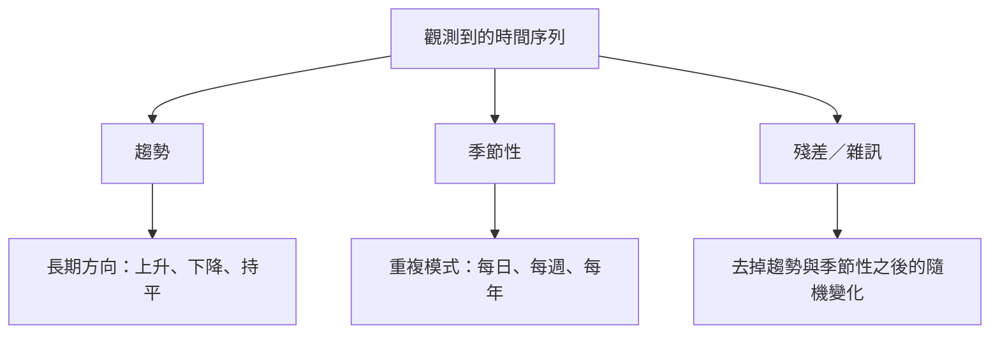
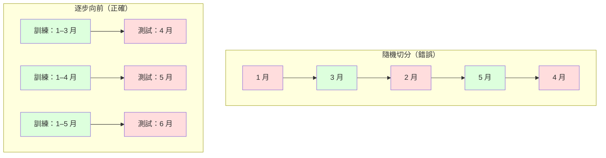

# 時間序列基礎（time series）

> 過去表現確實能預測未來結果——只要你先檢查定態（stationarity）。

**Type:** Build
**Language:** Python
**Prerequisites:** Phase 2, Lessons 01-09
**Time:** ~90 minutes

## Learning Objectives｜學習目標

- 把時間序列分解（decomposition）成趨勢（trend）、季節性（seasonality）與殘差（residual），並檢驗定態
- 實作落後特徵（lag feature）與滾動統計量，把時間序列轉成監督式學習（supervised learning）問題
- 建立逐步向前驗證（walk-forward validation），避免未來資料洩漏（data leakage）進訓練
- 說明為什麼隨機的訓練／測試切分對時間序列無效，並展示它和正確時間切分的表現差距

## The Problem｜問題

你有依時間排列的資料。每日銷售、每小時氣溫、每分鐘 CPU 用量、每週股價。你想預測下一個值、下一週、下一季。

你拿出標準的機器學習（machine learning）工具：隨機訓練／測試切分、交叉驗證（cross-validation）、特徵矩陣（feature matrix）進去、預測出來。每一步都是錯的。

時間序列打破了標準機器學習所依賴的假設。樣本並不獨立——今天的氣溫取決於昨天。隨機切分會把未來資訊洩漏到過去。回測（backtest）裡看起來很好的特徵，到了正式環境會失敗，因為它們依賴的模式會隨時間改變。

一個用隨機交叉驗證得到 95% 準確率（accuracy）的模型，用正確的時間評估可能只剩 55%。這不是技術細節。這是「紙上能用的模型」和「正式環境能用的模型」的差別。

本課講基礎：時間資料有什麼不同、如何誠實評估模型，以及如何把時間序列變成標準機器學習模型能用的特徵（feature）。

## The Concept｜核心概念

### 時間序列哪裡不同

標準機器學習假設 i.i.d.——獨立且同分布。每個樣本都從同一個分布抽出，而且彼此獨立。時間序列兩邊都違反：

- **不是獨立的。** 今天的股價取決於昨天。這週的銷售和上週相關。
- **不是同分布的。** 分布會隨時間移動。12 月的銷售看起來和 3 月不同。

這些違反不是小事。它們改變你怎麼做特徵、怎麼評估模型，以及哪些演算法（algorithm）能用。


在標準機器學習裡，樣本可以互換。打亂它們不會改變什麼。在時間序列裡，順序就是一切。打亂會毀掉訊號。

### 時間序列的成分

每條時間序列都是這些成分的組合：



- **趨勢：** 長期方向。營收每年成長 10%。全球氣溫上升。
- **季節性：** 固定間隔的重複模式。零售銷售在 12 月衝高。冷氣用量在 7 月達到高峰。
- **殘差：** 去掉趨勢和季節性之後剩下的部分。如果殘差看起來像白雜訊（white noise），分解（decomposition）就抓到了訊號。

### 定態

如果一條時間序列的統計性質（平均數（mean）、變異數（variance）、自相關（autocorrelation））不隨時間改變，它就是定態的。多數預測方法假設定態。

**為什麼要緊：** 非定態序列的平均數會漂移。在 1 月資料上訓練的模型，學到的平均數和 2 月將出現的不同。它會系統性地出錯。

**怎麼檢查：** 在視窗（window）上計算滾動平均數和滾動標準差（standard deviation）。如果它們漂移，序列就不是定態的。

**怎麼修：** 差分（differencing）。不要建模原始值，改建模相鄰值的變化：

```
diff[t] = value[t] - value[t-1]
```

如果一輪差分還不能讓序列定態，就再做一次（二階差分）。多數真實序列最多需要兩輪。

**例子：**

原始序列：[100, 102, 106, 112, 120]
一階差分：[2, 4, 6, 8]（仍在向上）
二階差分：[2, 2, 2]（常數——定態）

原始序列有二次趨勢。一階差分把它變成線性趨勢。二階差分把它變平。實務上很少需要超過兩輪。

**正規檢定：** 擴充 Dickey-Fuller（Augmented Dickey-Fuller，ADF）檢定是定態的標準統計檢定。虛無假設（null hypothesis）是「序列不是定態的」。p 值（p-value）低於 0.05，就可以拒絕虛無假設並認定定態。我們不從頭實作 ADF（它需要漸近分布表），但程式碼裡的滾動統計量提供一個實用的視覺檢查。

### 自相關

自相關衡量時間 t 的值與時間 t-k（往前 k 步）的值有多相關。自相關函數（ACF）把每個落後 k 的相關畫出來。

**ACF 告訴你：**
- 序列記得多遠。如果 ACF 在落後 5 之後掉到零，超過 5 步以前的值就不重要。
- 有沒有季節性。如果 ACF 在落後 12 出現尖峰（月資料），就有年季節性。
- 要做幾個落後特徵。用到 ACF 變得可忽略的那個落後為止。

**PACF（偏自相關函數，partial autocorrelation）** 去掉間接相關。如果今天和 3 天前相關，只是因為兩者都和昨天相關，落後 3 的 PACF 會是零，落後 3 的 ACF 則不會。

### 落後特徵：把時間序列變成監督式學習

標準機器學習模型需要特徵矩陣 X 和目標 y。時間序列給你的是單一欄數值。橋梁就是落後特徵。

取序列 [10, 12, 14, 13, 15]，建立落後 1 與落後 2 特徵：

| lag_2 | lag_1 | target |
|-------|-------|--------|
| 10    | 12    | 14     |
| 12    | 14    | 13     |
| 14    | 13    | 15     |

現在你有一個標準迴歸問題。任何機器學習模型（線性迴歸（linear regression）、隨機森林（random forest）、gradient boosting）都能用落後來預測目標。

還可以再做的特徵：
- **滾動統計量：** 最近 k 個值的平均數、標準差、最小值、最大值
- **日曆特徵：** 星期幾、月份、是否假日、是否週末
- **差分值：** 和前一步的變化
- **擴張統計量：** 累積平均數、累積和
- **比率特徵：** 目前值／滾動平均數（離近期平均有多遠）
- **交互特徵：** lag_1 * day_of_week（平日對動能的影響）

**要幾個落後？** 用自相關函數。如果 ACF 到落後 10 都顯著，至少用 10 個落後。如果有週季節性，納入落後 7（也許還有 14）。落後愈多，模型看得到愈多歷史，但要擬合的特徵也愈多，過度擬合（overfitting）的風險上升。

**目標對齊陷阱。** 做落後特徵時，目標必須是時間 t 的值，所有特徵都只能用時間 t-1 或更早的值。如果你不小心把時間 t 的值放進特徵，你會得到一個完美的預測器——以及一個完全沒用的模型。這是時間序列特徵工程（feature engineering）最常見的 bug。

### 逐步向前驗證

這是本課最重要的概念。標準 k 折交叉驗證把樣本隨機分到訓練和測試。對時間序列，這會洩漏未來資訊。



逐步向前驗證：
1. 用截至時間 t 的資料訓練
2. 預測時間 t+1（或多步時預測 t+1 到 t+k）
3. 把視窗往前滑
4. 重複

每一個測試折只包含全部訓練資料之後的資料。沒有未來洩漏。這給你一個誠實的估計：模型部署後會表現如何。

**擴張視窗（expanding window）** 用全部歷史資料訓練（視窗變大）。**滑動視窗（sliding window）** 用固定長度的訓練視窗（視窗滑動）。如果你相信舊資料仍然相關，用擴張。如果世界在變、舊資料會造成干擾，用滑動。

### ARIMA 的直覺

ARIMA 是古典的時間序列模型。它有三個成分：

- **AR（自迴歸，autoregressive）：** 用過去的值來預測。AR(p) 用最近 p 個值。
- **I（整合，integrated）：** 用差分達成定態。I(d) 做 d 輪差分。
- **MA（移動平均，moving average）：** 用過去的預測誤差來預測。MA(q) 用最近 q 個誤差。

ARIMA(p, d, q) 把三者合在一起。你依 ACF／PACF 分析或自動搜尋（auto-ARIMA）選擇 p、d、q。

我們不從頭實作 ARIMA——它需要的數值最佳化（numerical optimization）超出本課範圍。關鍵是弄懂每個成分在做什麼，這樣你才能解讀 ARIMA 的結果，並知道何時該用它。

### 何時用什麼

| 做法 | 最適合 | 能否處理季節性 | 能否處理外部特徵 |
|----------|---------|-------------------|------------------------|
| 落後特徵＋機器學習 | 有很多外部特徵的表格資料（tabular data） | 搭配日曆特徵可以 | 可以 |
| ARIMA | 單一單變量序列、短期 | SARIMA 變體 | 不行（有限情況用 ARIMAX） |
| 指數平滑（exponential smoothing） | 簡單的趨勢＋季節性 | 可以（Holt-Winters） | 不行 |
| Prophet | 商業預測、假日 | 可以（Fourier 項） | 有限 |
| 神經網路（neural network）——LSTM、Transformer | 長序列、很多條序列 | 由模型學到 | 可以 |

對多數實務問題，落後特徵加上 gradient boosting 是最強的起點。它自然處理外部特徵、不要求定態，也容易除錯。

### 預測期距與策略

單步預測只預測往前一個時間步。多步預測一次預測多步。有三種策略：

**遞迴（迭代）：** 預測一步，再把預測值當成下一步的輸入。簡單，但誤差會累積——每一次預測都用到前一次預測，所以錯誤會疊加。

**直接：** 每個期距各訓練一個模型。模型 1 預測 t+1，模型 5 預測 t+5。誤差不會累積，但每個模型的訓練樣本較少，而且它們不共享資訊。

**多輸出：** 訓練一個同時輸出所有期距的模型。期距之間共享資訊，但需要支援多輸出的模型（或自訂損失函數（loss function））。

對多數實務問題，短期距（1–5 步）先用遞迴，較長期距用直接。

### 時間序列的常見錯誤

| 錯誤 | 為什麼會發生 | 怎麼修 |
|---------|---------------|-----------|
| 隨機訓練／測試切分 | 標準機器學習的習慣 | 用逐步向前或時間切分 |
| 用到未來特徵 | 不小心納入時間 t 的特徵 | 檢查每個特徵的時間對齊 |
| 對季節性過度擬合 | 模型背下日曆模式 | 測試集留出完整的一個季節週期 |
| 忽略尺度變化 | 營收加倍但模式不變 | 建模百分比變化，而不是絕對值 |
| 落後特徵太多 | 「歷史愈多愈好」 | 用 ACF 決定相關的落後 |
| 沒有差分 | 「模型自己會弄懂」 | 樹模型（tree-based model）能處理趨勢；線性模型需要定態 |

```figure
f3-series-decompose
```

## Build It｜動手實作

`code/time_series.py` 裡的程式碼從頭實作這些核心積木。

### 落後特徵產生器

```python
def make_lag_features(series, n_lags):
    n = len(series)
    X = np.full((n, n_lags), np.nan)
    for lag in range(1, n_lags + 1):
        X[lag:, lag - 1] = series[:-lag]
    valid = ~np.isnan(X).any(axis=1)
    return X[valid], series[valid]
```

這把一維序列轉成特徵矩陣：每一列用最近 `n_lags` 個值當特徵，用目前值當目標。

### 逐步向前交叉驗證

```python
def walk_forward_split(n_samples, n_splits=5, min_train=50):
    assert min_train < n_samples, "min_train must be less than n_samples"
    step = max(1, (n_samples - min_train) // n_splits)
    for i in range(n_splits):
        train_end = min_train + i * step
        test_end = min(train_end + step, n_samples)
        if train_end >= n_samples:
            break
        yield slice(0, train_end), slice(train_end, test_end)
```

每一次切分都保證訓練資料嚴格早於測試資料。訓練視窗隨每一折擴張。

### 簡單自迴歸模型

純粹的 AR 模型就是落後特徵上的線性迴歸：

```python
class SimpleAR:
    def __init__(self, n_lags=5):
        self.n_lags = n_lags
        self.weights = None
        self.bias = None

    def fit(self, series):
        X, y = make_lag_features(series, self.n_lags)
        # Solve via normal equations
        X_b = np.column_stack([np.ones(len(X)), X])
        theta = np.linalg.lstsq(X_b, y, rcond=None)[0]
        self.bias = theta[0]
        self.weights = theta[1:]
        return self
```

這在概念上和第 2 課的線性迴歸相同，只是用在同一個變數（variable）的時間落後版本上。

### 定態檢查

程式碼計算滾動統計量，從視覺和數值兩方面評估定態：

```python
def check_stationarity(series, window=50):
    rolling_mean = np.array([
        series[max(0, i - window):i].mean()
        for i in range(1, len(series) + 1)
    ])
    rolling_std = np.array([
        series[max(0, i - window):i].std()
        for i in range(1, len(series) + 1)
    ])
    return rolling_mean, rolling_std
```

如果滾動平均數漂移，或滾動標準差改變，序列就不是定態的。做差分後再檢查一次。

程式碼也會比較序列前半段和後半段來檢查定態。如果平均數相差超過半個標準差，或變異數比值超過 2 倍，序列就會被標成非定態。

### 自相關

```python
def autocorrelation(series, max_lag=20):
    n = len(series)
    mean = series.mean()
    var = series.var()
    acf = np.zeros(max_lag + 1)
    for k in range(max_lag + 1):
        cov = np.mean((series[:n-k] - mean) * (series[k:] - mean))
        acf[k] = cov / var if var > 0 else 0
    return acf
```

## Use It｜實際應用

用 sklearn 時，你把落後特徵直接交給任何迴歸器：

```python
from sklearn.linear_model import Ridge
from sklearn.ensemble import GradientBoostingRegressor

X, y = make_lag_features(series, n_lags=10)

for train_idx, test_idx in walk_forward_split(len(X)):
    model = Ridge(alpha=1.0)
    model.fit(X[train_idx], y[train_idx])
    predictions = model.predict(X[test_idx])
```

ARIMA 用 statsmodels：

```python
from statsmodels.tsa.arima.model import ARIMA

model = ARIMA(train_series, order=(5, 1, 2))
fitted = model.fit()
forecast = fitted.forecast(steps=30)
```

`time_series.py` 裡的程式碼示範這兩種做法，並用逐步向前驗證比較它們。

### sklearn 的 TimeSeriesSplit

sklearn 提供 `TimeSeriesSplit`，它實作逐步向前驗證：

```python
from sklearn.model_selection import TimeSeriesSplit

tscv = TimeSeriesSplit(n_splits=5)
for train_index, test_index in tscv.split(X):
    X_train, X_test = X[train_index], X[test_index]
    y_train, y_test = y[train_index], y[test_index]
    model.fit(X_train, y_train)
    score = model.score(X_test, y_test)
```

這和我們從頭寫的 `walk_forward_split` 等價，但接進 sklearn 的交叉驗證框架。你可以把它和 `cross_val_score` 一起用：

```python
from sklearn.model_selection import cross_val_score

scores = cross_val_score(model, X, y, cv=TimeSeriesSplit(n_splits=5))
print(f"Mean score: {scores.mean():.4f} +/- {scores.std():.4f}")
```

### 評估指標（metric）

時間序列預測用的是迴歸指標，但要放在時間的脈絡裡：

- **MAE（平均絕對誤差（mean absolute error））：** |y_true - y_pred| 的平均。用原始單位很好解讀。「平均來說，預測差了 3.2 度。」
- **RMSE（均方根誤差）：** 均方誤差的平方根。比 MAE 更懲罰大誤差。大誤差比很多小誤差更糟時用它。
- **MAPE（平均絕對百分比誤差）：** |誤差 / 真實值| * 100 的平均。與尺度無關，適合比較不同序列。但真實值為零時沒有定義。
- **和單純基準模型比較：** 永遠要和簡單的基準模型（baseline）比。季節性簡單基準模型用一個週期前的值來預測（昨天、上週）。如果你的模型打不贏單純基準，一定有問題。

### 滾動特徵

程式碼示範把滾動統計量（7 天和 14 天視窗的平均數、標準差、最小值、最大值）加到落後特徵上。它們告訴模型近期的趨勢和波動，這是落後特徵單獨給不了的。

例如，滾動平均數上升代表向上的趨勢。滾動標準差變大代表波動升高。這些是樹模型學得到、線性模型學不到的模式。

## Ship It｜交付成果

本課會產出：
- `outputs/prompt-time-series-advisor.md`——一份用來框定時間序列問題的 prompt
- `code/time_series.py`——落後特徵、逐步向前驗證、AR 模型、定態檢查

### 你必須打敗的基準模型

做任何模型之前，先建立基準模型：

1. **最後一個值（持續）。** 預測明天會和今天一樣。對很多序列，這出乎意料地難打。
2. **季節性簡單基準模型。** 預測今天會和上週同一天（或去年）一樣。如果你的模型打不贏這個，它就沒有學到季節性以外的有用模式。
3. **移動平均。** 預測最近 k 個值的平均。能平滑雜訊，但抓不到突然的變化。

如果你花俏的機器學習模型輸給季節性簡單基準模型，你有 bug。最常見的是：特徵裡有未來洩漏、評估方法錯了，或序列真的是隨機且不可預測的。

### 實務提示

1. **先畫圖。** 建模之前先畫原始序列。找趨勢、季節性、離群值（outlier）、結構斷裂（structural break）（行為突然改變）。30 秒的目視往往比一小時的自動分析告訴你更多。

2. **先差分，再建模。** 如果序列有明顯趨勢，做落後特徵之前先差分。樹模型能處理趨勢，線性模型不能，而差分從來不會有害。

3. **至少留出完整的一個季節週期。** 如果有週季節性，測試集至少要有完整一週。如果是月，至少要有完整一個月。否則你無法評估模型有沒有抓到季節模式。

4. **在正式環境監控。** 世界改變時，時間序列模型會隨時間變差。用滾動方式追蹤預測誤差。誤差開始上升時，用近期資料重新訓練模型。

5. **小心體制改變。** 用疫情前資料訓練的模型，預測不了疫情後的行為。把已知體制改變的指標放進特徵，或用會忘掉舊資料的滑動視窗。

6. **對右偏（right-skewed）序列做對數轉換（log transform）。** 營收、價格和計數常常右偏。取對數能穩定變異數，並把乘法模式變成加法，線性模型就能處理。在對數空間預測，再取指數回到原始單位。

## Exercises｜練習

1. **定態實驗。** 產生一條有線性趨勢的序列。用滾動統計量檢查定態。做一階差分。再檢查一次。二次趨勢需要幾輪差分？

2. **落後選擇。** 在一條季節序列（週期=7）上計算 ACF。哪些落後的自相關最高？只用那些落後（不是連續落後）建立落後特徵。準確率會比用落後 1 到 7 更好嗎？

3. **逐步向前對隨機切分。** 在落後特徵上訓練 Ridge 迴歸。用隨機 80/20 切分和逐步向前驗證來評估。隨機切分把表現高估了多少？

4. **特徵工程。** 在落後特徵上加入滾動平均數（視窗=7）、滾動標準差（視窗=7）和星期幾特徵。用逐步向前驗證比較有沒有這些額外特徵的準確率。

5. **多步預測。** 修改 AR 模型，改成預測往前 5 步而不是 1 步。比較兩種策略：(a) 預測一步，把預測值當成下一步的輸入（遞迴）；(b) 每個期距各訓練一個模型（直接）。哪一種更準？

## Key Terms｜關鍵術語

| 術語 | 常見說法 | 實際意義 |
|------|----------------|----------------------|
| 定態 | 「統計量不隨時間變」 | 平均數、變異數和自相關結構在時間上保持不變的序列 |
| 差分 | 「相鄰值相減」 | 計算 y[t] - y[t-1]，去掉趨勢並達成定態 |
| 自相關（ACF） | 「序列和自己有多相關」 | 一條時間序列和它的落後複本之間的相關，寫成落後的函數 |
| 偏自相關（PACF） | 「只留直接相關」 | 去掉所有更短落後的影響之後，落後 k 的自相關 |
| 落後特徵 | 「用過去的值當輸入」 | 用 y[t-1]、y[t-2]、……、y[t-k] 當特徵來預測 y[t] |
| 逐步向前驗證 | 「尊重時間的交叉驗證」 | 訓練資料在時間上永遠早於測試資料的評估 |
| ARIMA | 「古典時間序列模型」 | 自迴歸整合移動平均：結合過去的值（AR）、差分（I）和過去的誤差（MA） |
| 季節性 | 「重複的日曆模式」 | 時間序列裡與日曆週期（每日、每週、每年）綁在一起的規則、可預測循環 |
| 趨勢 | 「長期方向」 | 序列水準隨時間持續上升或下降 |
| 擴張視窗 | 「用全部歷史」 | 每一折的訓練集都變大的逐步向前驗證 |
| 滑動視窗 | 「固定長度的歷史」 | 訓練集是固定長度、往前滑動的逐步向前驗證 |

## Further Reading｜延伸閱讀

- [Hyndman and Athanasopoulos, Forecasting: Principles and Practice (3rd ed.)](https://otexts.com/fpp3/)——最好的免費時間序列預測教科書
- [scikit-learn Time Series Split](https://scikit-learn.org/stable/modules/generated/sklearn.model_selection.TimeSeriesSplit.html)——sklearn 的逐步向前切分器
- [statsmodels ARIMA docs](https://www.statsmodels.org/stable/generated/statsmodels.tsa.arima.model.ARIMA.html)——帶診斷的 ARIMA 實作
- [Makridakis et al., The M5 Competition (2022)](https://www.sciencedirect.com/science/article/pii/S0169207021001874)——大規模預測競賽，比較機器學習方法與統計方法
