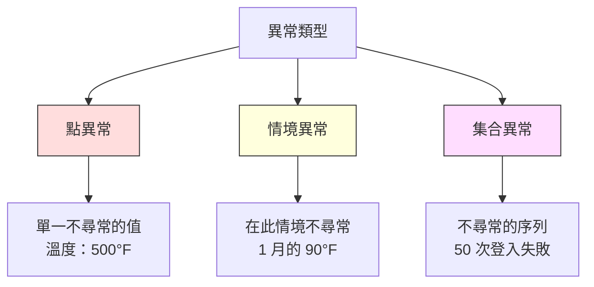
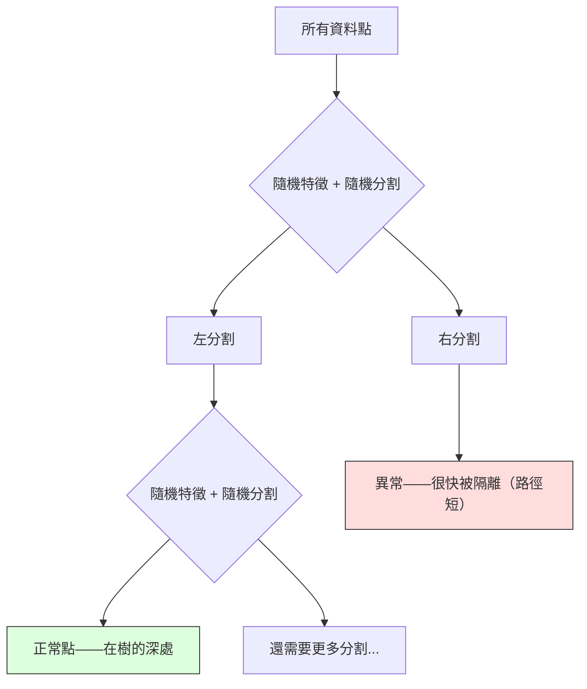
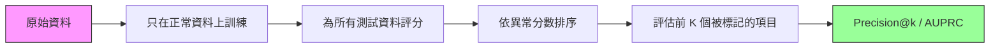

# 異常偵測（anomaly detection）

> 正常很容易定義。不正常就是任何對不上的東西。

**Type:** Build
**Language:** Python
**Prerequisites:** Phase 2, Lessons 01-09
**Time:** ~75 minutes

## Learning Objectives｜學習目標

- 從頭實作 z 分數（z-score）、IQR 與隔離森林（Isolation Forest）的異常偵測方法
- 區分點異常（point anomaly）、情境異常（contextual anomaly）與集合異常（collective anomaly），並為每種類型選擇合適的偵測方法
- 說明為什麼異常偵測是在建模正常資料，而不是在分類異常
- 比較非監督式（unsupervised）異常偵測與監督式分類，並評估「涵蓋新異常」和精確率（precision）之間的取捨

## The Problem｜問題

一張信用卡下午 2 點在紐約使用，2:05 又在東京使用。工廠感測器讀到 150 度，正常範圍卻是 80–120。伺服器（server）每秒送出 50,000 個請求，每日平均卻是 200。

這些都是異常（anomaly）。找出它們很重要。詐欺損失數十億。裝置故障造成停機。網路入侵造成資料損失。

難處是：你很少有標好的異常例子。詐欺只佔交易的 0.1%。裝置故障一年只發生幾次。你沒辦法訓練標準分類器（classifier），因為「異常」類別裡幾乎沒有東西可學。就算有一些標籤，你見過的異常也不是你會遇到的全部類型。明天的詐欺手法和今天不同。

異常偵測把問題翻過來。不要學什麼是異常，改學什麼是正常。任何偏離正常的東西都可疑。這不需要標籤，能適應新類型的異常，也能擴展到巨大的資料集（dataset）。

## The Concept｜核心概念

### 異常的類型

不是所有異常都一樣：

- **點異常。** 不論情境，單一資料點（data point）本身就不尋常。500 度的溫度讀數。一個平時只花 $50 的帳戶卻刷了 $50,000。
- **情境異常。** 給定情境才不尋常的資料點。90 度在夏天正常，在冬天就是異常。同一個值，情境不同。
- **集合異常。** 一整段資料點放在一起才不尋常，雖然每個點單獨可能正常。五次登入失敗很正常。連續五十次就是暴力破解攻擊。

多數方法偵測點異常。情境異常需要時間或位置特徵（feature）。集合異常需要能看序列的方法。



### 非監督式的框架

在標準分類裡，兩個類別都有標籤。異常偵測通常是下面三種情況之一：

1. **完全非監督。** 完全沒有標籤。你在全部資料上擬合偵測器，並希望異常夠少，不至於污染「正常」模型。
2. **半監督式（semi-supervised）。** 你有一份只有正常資料的乾淨資料集。在這份乾淨資料上擬合，再為其他所有東西評分。做得到的時候，這是最強的設定。
3. **弱監督。** 你有少數標好的異常。用它們做評估，不要拿來訓練。先以非監督方式訓練，再在有標籤的子集上量精確率／召回率（recall）。

關鍵洞見：異常偵測和分類根本不同。你建模的是正常資料的分布，不是兩個類別之間的決策邊界。

### 監督式對非監督式：取捨

如果你確實有標好的異常，該拿來訓練（監督式分類），還是只拿來評估（非監督式偵測）？

**監督式（當成分類）：**
- 抓得到你以前見過的那幾種異常
- 對已知異常類型的精確率較高
- 全新的異常類型會完全漏掉
- 新類型出現時必須重新訓練
- 需要足夠的異常例子（常常太少）

**非監督式（建模正常，標記偏離）：**
- 抓得到任何偏離正常的東西，包括新類型
- 不需要標好的異常
- 偽陽性（false positive）率較高（不尋常不等於有害）
- 對分布偏移更穩健

實務上，最好的系統兩者都用：非監督式偵測負責廣泛涵蓋，監督式模型負責已知的高優先異常，模糊的案子交給人審。

### z 分數法

最簡單的做法。計算每個特徵的平均數（mean）和標準差（standard deviation）。任何離平均數超過 k 個標準差的點就標記。

```text
z_score = (x - mean) / std
anomaly if |z_score| > threshold
```

預設（default）閾值（threshold）是 3.0（常態分布（normal distribution）下，99.7% 的正常資料落在 3 個標準差以內）。

**優點：** 簡單。快。可解釋（「這個值離正常有 4.5 個標準差」）。

**缺點：** 假設資料呈常態分布。對訓練資料裡的離群值（outlier）敏感（離群值會移動平均數、膨脹標準差，讓自己更難被偵測）。在多峰分布上會失敗。

**何時效果好：** 資料大致呈鐘形的單特徵監控。伺服器（server）回應時間、製造公差、基準穩定的感測器讀數。

**何時失敗：** 多群集資料（兩個辦公室的基準溫度不同）、偏態資料（交易金額裡 $1000 少見但不是異常）、訓練集裡就有離群值的資料。

### IQR 法

比 z 分數穩健。用四分位距（interquartile range）而不是平均數和標準差。

```
Q1 = 25th percentile
Q3 = 75th percentile
IQR = Q3 - Q1
lower_bound = Q1 - factor * IQR
upper_bound = Q3 + factor * IQR
anomaly if x < lower_bound or x > upper_bound
```

預設因子是 1.5。

**優點：** 對離群值穩健（百分位數不受極端值影響）。偏態分布也能用。不假設常態。

**缺點：** 只能單變數（每個特徵各自套用）。抓不到「每個特徵單獨看都正常，合在一起才異常」的點。

**實務注意：** IQR 的 1.5 因子對應箱型圖的鬚線。鬚線外的點是可能的離群值。用 3.0 而不是 1.5 會讓偵測器更保守（標記更少、偽陽性更少）。正確的因子取決於你能容忍多少誤報。

### 隔離森林

關鍵洞見：異常又少又不同。在資料的隨機分割裡，異常比較容易被隔離——把它們和其餘資料分開，需要的隨機分割比較少。



**它怎麼運作：**
1. 建立很多棵隨機樹（一座隔離森林）
2. 每個節點隨機選一個特徵，並在該特徵的最小值和最大值之間隨機選一個分割值
3. 一直分割，直到每個點都被隔離（自己佔一片葉）
4. 異常在所有樹上的平均路徑長度較短

**為什麼有效：** 正常點住在密集區域。要把一個點和鄰居隔離，需要很多次隨機分割。異常住在稀疏區域。一或兩次隨機分割就夠了。

異常分數根據所有樹的平均路徑長度，再用隨機二元搜尋樹的期望路徑長度正規化：

```
score(x) = 2^(-average_path_length(x) / c(n))
```

其中 `c(n)` 是 n 個樣本的期望路徑長度。分數接近 1 代表異常。接近 0.5 代表正常。接近 0 代表非常正常（深埋在密集群集裡）。

**優點：** 不假設分布。高維也能用。擴展性好（每個樹只用子樣本，所以對樣本數是次線性）。能處理混合的特徵類型。

**缺點：** 密集區域裡的異常很難抓（掩蓋效應）。很多特徵不相關時，隨機分割比較沒效。

**關鍵超參數（hyperparameter）：**
- `n_estimators`：樹的數量。100 通常夠了。樹愈多，分數愈穩，但計算愈慢。
- `max_samples`：每棵樹的樣本數。原始論文的預設是 256。較小的值讓單棵樹較不準，但增加多樣性。子取樣正是隔離森林快的原因——每棵樹只看到資料的一小部分。
- `contamination`：預期異常比例（contamination）。只用來設定閾值。不影響分數本身。

### 局部離群因子（LOF）

LOF 把一個點周圍的局部密度和它鄰居周圍的密度比較。一個點若處在稀疏區域、卻被密集區域包圍，就是異常。

**它怎麼運作：**
1. 對每個點找出 k 個最近鄰
2. 計算局部可達密度（reachability density）（鄰域有多密）
3. 把每個點的密度和鄰居的密度比較
4. 如果一個點的密度比鄰居低很多，它就是離群值

**LOF 分數：**
- LOF 接近 1.0 代表和鄰居密度相近（正常）
- LOF 大於 1.0 代表密度比鄰居低（可能異常）
- LOF 遠大於 1.0（例如 2.0 以上）代表密度明顯較低（很可能是異常）

「局部」這兩個字很關鍵。想像一個資料集有兩個群集：1000 個點的密集群集，和 50 個點的稀疏群集。稀疏群集邊緣的點在全域上並不稀奇——它有 50 個鄰居。但如果它緊鄰的鄰居比它更密，它在局部上就不尋常。LOF 抓得到全域方法漏掉的這個差別。

**優點：** 偵測局部異常（在自己的鄰域裡不尋常，即使全域並不稀奇）。不同密度的群集也能用。

**缺點：** 大型資料集很慢（單純實作是 O(n^2)）。對 k 的選擇敏感。在非常高的維度表現不好（維度災難（curse of dimensionality）會影響距離計算）。

### 比較

| 方法 | 假設 | 速度 | 能否處理高維 | 能否偵測局部異常 |
|--------|------------|-------|-------------------|------------------------|
| z 分數 | 常態分布 | 非常快 | 可以（逐特徵） | 不行 |
| IQR | 無（逐特徵） | 非常快 | 可以（逐特徵） | 不行 |
| 隔離森林 | 無 | 快 | 可以 | 部分可以 |
| LOF | 距離要有意義 | 慢 | 不好 | 可以 |

### 評估的困難

評估異常偵測器比評估分類器更難：

- **極端的類別不平衡（class imbalance）。** 異常只有 0.1% 時，全部預測「正常」就有 99.9% 準確率（accuracy）。準確率沒用。
- **AUROC 會誤導。** 嚴重不平衡時，就算模型在實用閾值上漏掉大多數異常，AUROC 看起來仍可能不錯。
- **更好的指標（metric）：** Precision@k（前 k 個被標記的項目裡，有多少是真異常）、AUPRC（精確率–召回率曲線下面積），以及固定偽陽性率下的召回率。



### 異常偵測管線（pipeline）

實務上，異常偵測照這個流程：

1. **收集基準資料。** 理想上是一段你知道沒有（或很少）異常的期間。
2. **特徵工程（feature engineering）。** 原始特徵加上衍生特徵（滾動統計量、時間特徵、比率）。
3. **訓練偵測器。** 在基準資料上擬合。模型學會「正常」長什麼樣子。
4. **為新資料評分。** 每個新觀測值得到一個異常分數。
5. **選擇閾值。** 決定分數切點。這是業務決定：閾值愈高，誤報愈少，但漏掉的異常愈多。
6. **警報並調查。** 被標記的點交給人審，或觸發自動回應。
7. **收集回饋。** 記下被標記的項目是真異常還是誤報。用這些資料評估偵測器，並隨時間調校閾值。

管線從來不會「做完」。資料分布會移動，新的異常類型會出現，閾值需要調整。把異常偵測當成會持續運作的系統，不是一次性的模型。

```figure
f3-anomaly-fence
```

## Build It｜動手實作

`code/anomaly_detection.py` 裡的程式碼從頭實作 z 分數、IQR 與隔離森林。

### z 分數偵測器

```python
def zscore_detect(X, threshold=3.0):
    mean = X.mean(axis=0)
    std = X.std(axis=0)
    std[std == 0] = 1.0
    z = np.abs((X - mean) / std)
    return z.max(axis=1) > threshold
```

簡單而且向量化。任一特徵超過閾值就標記該點。

### IQR 偵測器

```python
def iqr_detect(X, factor=1.5):
    q1 = np.percentile(X, 25, axis=0)
    q3 = np.percentile(X, 75, axis=0)
    iqr = q3 - q1
    iqr[iqr == 0] = 1.0
    lower = q1 - factor * iqr
    upper = q3 + factor * iqr
    outside = (X < lower) | (X > upper)
    return outside.any(axis=1)
```

### 從頭實作隔離森林

從頭實作會建立隨機分割特徵空間的隔離樹：

```python
class IsolationTree:
    def __init__(self, max_depth):
        self.max_depth = max_depth

    def fit(self, X, depth=0):
        n, p = X.shape
        if depth >= self.max_depth or n <= 1:
            self.is_leaf = True
            self.size = n
            return self
        self.is_leaf = False
        self.feature = np.random.randint(p)
        x_min = X[:, self.feature].min()
        x_max = X[:, self.feature].max()
        if x_min == x_max:
            self.is_leaf = True
            self.size = n
            return self
        self.threshold = np.random.uniform(x_min, x_max)
        left_mask = X[:, self.feature] < self.threshold
        self.left = IsolationTree(self.max_depth).fit(X[left_mask], depth + 1)
        self.right = IsolationTree(self.max_depth).fit(X[~left_mask], depth + 1)
        return self
```

把一個點隔離開來的路徑長度決定它的異常分數。路徑愈短，愈異常。

`IsolationForest` 類別包住多棵樹：

```python
class IsolationForest:
    def __init__(self, n_estimators=100, max_samples=256, seed=42):
        self.n_estimators = n_estimators
        self.max_samples = max_samples

    def fit(self, X):
        sample_size = min(self.max_samples, X.shape[0])
        max_depth = int(np.ceil(np.log2(sample_size)))
        for _ in range(self.n_estimators):
            idx = rng.choice(X.shape[0], size=sample_size, replace=False)
            tree = IsolationTree(max_depth=max_depth)
            tree.fit(X[idx])
            self.trees.append(tree)

    def anomaly_score(self, X):
        avg_path = average path length across all trees
        scores = 2.0 ** (-avg_path / c(max_samples))
        return scores
```

正規化因子 `c(n)` 是在有 n 個元素的二元搜尋樹裡，一次失敗搜尋的期望路徑長度。它等於 `2 * H(n-1) - 2*(n-1)/n`，其中 `H` 是調和數。這個正規化讓不同大小資料集的分數可以比較。

### 示範情境

程式碼產生多個測試情境：

1. **單一群集加離群值。** 一個二維高斯群集，異常被注入在遠離中心的地方。這裡所有方法都該能用。
2. **多峰資料。** 三個大小和密度不同的群集。群集之間的點是異常。z 分數會吃力，因為每個特徵的範圍都很寬。
3. **高維資料。** 50 個特徵，但異常只在其中 5 個上不同。用來測試方法能不能在一部分特徵裡找到異常。

每個示範都用精確率、召回率、F1 和 Precision@k 比較所有方法。

## Use It｜實際應用

用 sklearn 時（用函式庫（library）的實作，不是從頭寫的）：

```python
from sklearn.ensemble import IsolationForest
from sklearn.neighbors import LocalOutlierFactor

iso = IsolationForest(n_estimators=100, contamination=0.05, random_state=42)
iso.fit(X_train)
predictions = iso.predict(X_test)

lof = LocalOutlierFactor(n_neighbors=20, contamination=0.05, novelty=True)
lof.fit(X_train)
predictions = lof.predict(X_test)
```

注意 `contamination` 設定預期的異常比例。設對很重要——太低會漏掉異常，太高會製造誤報。

`anomaly_detection.py` 裡的程式碼在同一份資料上，把從頭實作的版本和 sklearn 比較。

### sklearn 的 contamination 參數

sklearn 的 `contamination` 參數決定如何把連續的異常分數轉成二元預測的閾值。它不改變底層分數。

```python
iso_5 = IsolationForest(contamination=0.05)
iso_10 = IsolationForest(contamination=0.10)
```

兩者產生相同的異常分數。但 `iso_5` 標記前 5%，`iso_10` 標記前 10%。如果你不知道真正的異常率（通常不知道），把 contamination 設成 "auto"，直接使用原始分數。依偽陽性和偽陰性（false negative）的成本取捨，自己設定閾值。

### 單類別 SVM（one-class SVM）

另一個值得認識的非監督式異常偵測器。單類別 SVM 在高維特徵空間裡，用核技巧（kernel trick）在正常資料周圍擬合一條邊界。

```python
from sklearn.svm import OneClassSVM

oc_svm = OneClassSVM(kernel="rbf", gamma="auto", nu=0.05)
oc_svm.fit(X_train)
predictions = oc_svm.predict(X_test)
```

`nu` 參數近似異常的比例。單類別 SVM 在小到中型資料集上效果好，但擴展不到非常大的資料（核矩陣以二次方成長）。

### 自編碼器做法（預告）

自編碼器（autoencoder）是學會壓縮並重建資料的神經網路（neural network）。在正常資料上訓練。測試時，異常的重建誤差（reconstruction error）很高，因為網路只學會重建正常模式。

這會在第 3 階段（深度學習）講，但原則相同：建模什麼是正常，標記偏離的東西。

### 集成異常偵測

就像集成方法改善分類（第 11 課），把多個異常偵測器合起來也會改善偵測。最簡單的做法：

1. 跑多個偵測器（z 分數、IQR、隔離森林、LOF）
2. 把每個偵測器的分數正規化到 [0, 1]
3. 把正規化後的分數平均
4. 平均分數超過閾值的點就標記

這能降低偽陽性，因為不同方法的失敗模式不同。四個方法都標記的點幾乎一定是異常。只有一個方法標記的點，可能只是該方法的怪癖。

更精細的集成會依每個偵測器的估計可靠度加權（如果有已知異常的驗證集（validation set），就在那上面量）。

### 正式環境的考量

1. **閾值漂移。** 資料分布改變／漂移後，固定閾值會過時。監控異常分數的分布，並定期調整。
2. **警報疲勞。** 誤報太多，操作人員就不再看。先用高閾值（較少、較可靠的警報），信任建立後再降低。
3. **集成做法。** 在正式環境結合多個偵測器。只有多個方法都同意它是異常時才標記。這能明顯降低偽陽性。
4. **特徵工程。** 原始特徵很少夠用。加上滾動統計量、比率、距上次事件的時間，以及領域專用特徵。好的特徵集比選哪個偵測器更重要。
5. **回饋迴圈。** 操作人員調查被標記的項目並確認或駁回時，把結果回饋進系統。隨時間累積有標籤的資料，用來評估並改進偵測器。

## Ship It｜交付成果

本課會產出：
- `outputs/skill-anomaly-detector.md`——一份用來選擇正確偵測器的決策 skill
- `code/anomaly_detection.py`——從頭實作的 z 分數、IQR 與隔離森林，並與 sklearn 比較

### 選擇閾值

異常分數是連續的。你需要一個閾值才能做二元決定。這是業務決定，不是技術決定。

考慮兩種情境：
- **詐欺偵測。** 漏掉詐欺很貴（拒付、顧客信任）。誤報讓分析師花 5 分鐘調查。把閾值設低，多抓詐欺，接受更多誤報。
- **裝置維護。** 誤報代表不必要的停機，造成 $50,000 的損失；漏掉故障則要花 $500,000 維修。把閾值設在這兩種成本的平衡點。

兩種情況裡，最佳閾值都取決於偽陽性和偽陰性的成本比。在不同閾值畫出精確率和召回率，疊上成本函數，選成本最低的點。

### 擴展到正式環境

正式環境裡的即時異常偵測：

1. **批次訓練，線上評分。** 定期（每日、每週）在近期正常資料上訓練模型。每個新觀測值一到就評分。
2. **特徵計算必須一致。** 如果你用 30 天的滾動統計量訓練，新觀測值就需要 30 天的歷史才能算出特徵。把需要的歷史放進緩衝。
3. **監控分數分布。** 追蹤異常分數隨時間的分布。如果中位數（median）往上漂移，要麼資料在變，要麼模型過時了。
4. **可解釋性。** 標記異常時要說為什麼。z 分數：「特徵 X 比正常高 4.2 個標準差。」隔離森林：「這個點平均在 3.1 次分割就被隔離（正常點要 8.5 次）。」

## Exercises｜練習

1. **閾值調整。** 用 1.0 到 5.0、每步 0.5 的閾值跑 z 分數偵測器。畫出每個閾值的精確率和召回率。對你的資料來說，甜蜜點（sweet spot）在哪裡？

2. **多變數異常。** 建立二維資料，每個特徵單獨看都正常，但組合起來是異常（例如遠離主群集對角線的點）。顯示逐特徵的 z 分數會漏掉它們，隔離森林卻抓得到。

3. **從頭實作 LOF。** 用 k 最近鄰法（KNN）實作局部離群因子。在同一份資料上和 sklearn 的 LocalOutlierFactor 比較。用 k=10 和 k=50——k 的選擇怎麼影響結果？

4. **串流異常偵測。** 修改 z 分數偵測器，讓它在串流設定下運作：新點到達時更新累計平均數和變異數（Welford 的線上演算法）。在同一份資料上和批次 z 分數比較。

5. **真實世界評估。** 拿一份已知異常的資料集（例如 Kaggle 的信用卡詐欺）。用 precision@100、precision@500 和 AUPRC 評估全部四種方法。哪一種最好？為什麼？

## Key Terms｜關鍵術語

| 術語 | 常見說法 | 實際意義 |
|------|----------------|----------------------|
| 異常 | 「離群值、不尋常的點」 | 明顯偏離正常資料預期模式的資料點 |
| 點異常 | 「單一奇怪的值」 | 不論情境都不尋常的單筆觀測 |
| 情境異常 | 「值正常，情境錯了」 | 在此情境（時間、地點等）不尋常、換個情境可能正常的觀測 |
| 隔離森林 | 「用隨機分割找離群值」 | 一組隨機樹的集成，用比正常點更少的分割把異常隔離出來 |
| 局部離群因子 | 「和鄰居比密度」 | 標記局部密度遠低於鄰居的點 |
| z 分數 | 「離平均數幾個標準差」 | (x - mean) / std，用標準差單位衡量一個點離中心多遠 |
| IQR | 「四分位距」 | Q3 - Q1，衡量中間 50% 資料的散佈，用來做穩健的離群值偵測 |
| 預期異常比例 | 「預期的異常比例」 | 告訴偵測器該把多少比例的資料標記為異常的超參數 |
| Precision@k | 「前 k 個標記裡有多少是真的」 | 只在最可疑的 k 個點上計算的精確率，適合不平衡的異常偵測 |
| AUPRC | 「精確率–召回率曲線下面積」 | 彙總所有閾值上精確率–召回率表現的指標，不平衡資料上比 AUROC 好 |

## Further Reading｜延伸閱讀

- [Liu et al., Isolation Forest (2008)](https://cs.nju.edu.cn/zhouzh/zhouzh.files/publication/icdm08b.pdf)——隔離森林原始論文
- [Breunig et al., LOF: Identifying Density-Based Local Outliers (2000)](https://dl.acm.org/doi/10.1145/342009.335388)——LOF 原始論文
- [scikit-learn Outlier Detection docs](https://scikit-learn.org/stable/modules/outlier_detection.html)——sklearn 所有異常偵測器的概覽
- [Chandola et al., Anomaly Detection: A Survey (2009)](https://dl.acm.org/doi/10.1145/1541880.1541882)——異常偵測方法的完整綜述
- [Goldstein and Uchida, A Comparative Evaluation of Unsupervised Anomaly Detection Algorithms (2016)](https://journals.plos.org/plosone/article?id=10.1371/journal.pone.0152173)——在真實資料集上比較 10 種方法的實證研究
