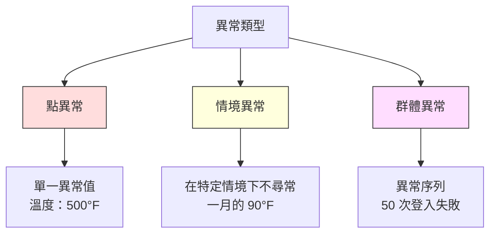
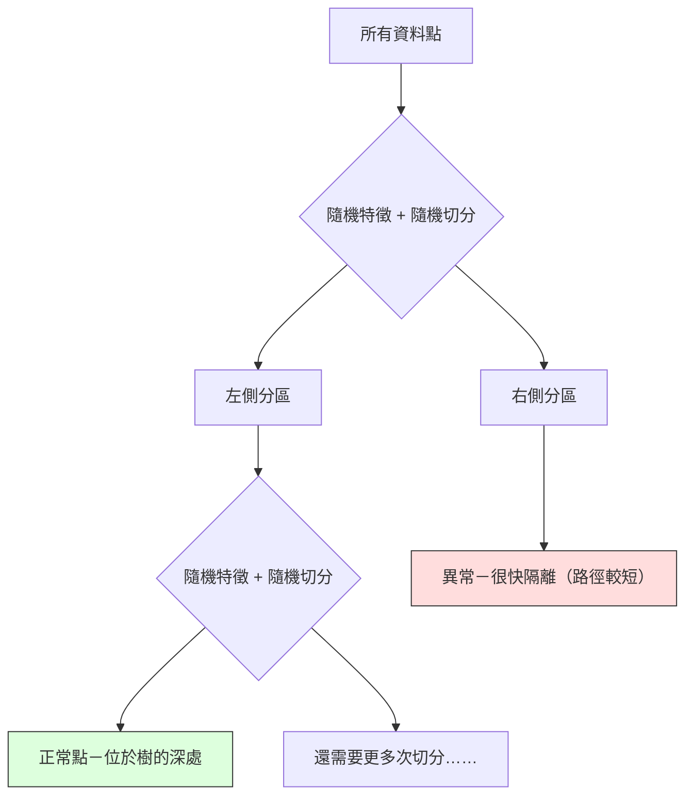

# 異常偵測

> 正常很容易定義；不正常，就是不符合常態的情況。

**Type:** Build
**Language:** Python
**Prerequisites:** Phase 2, Lessons 01-09
**Time:** ~75 minutes

## 學習目標

- 從頭實作 Z-score、IQR 和 Isolation Forest 異常偵測方法
- 區分點異常、情境異常和群體異常，並為每種情況選擇適當的偵測方法
- 說明異常偵測為什麼是建模正常資料，而非分類異常資料
- 比較非監督式異常偵測和監督式分類，並評估偵測新型異常的涵蓋率與精確率之間的取捨

## 問題

一張信用卡下午 2 點在紐約消費，下午 2 點 5 分卻在東京消費。工廠感測器讀值為 150 度，正常範圍卻是 80–120 度。伺服器每秒傳送 50,000 個請求，平常每日平均只有 200 個。

這些都是異常。找出它們非常重要：詐欺造成數十億損失，設備故障會讓產線停擺，網路入侵會造成資料損失。

挑戰在於：你很少有已標記的異常範例。詐欺只占交易的 0.1%；設備故障一年可能只發生幾次。你無法用標準分類器訓練，因為「異常」類別幾乎沒有資料可供學習。即使手上有一些標籤，已見過的異常也不代表涵蓋了所有類型。明天出現的詐欺手法可能和今天完全不同。

異常偵測會反轉問題：與其學習什麼是不正常，不如學習什麼是正常。任何偏離常態的情況都值得懷疑。這種方法不需要標籤、能適應新的異常類型，也能處理龐大的資料集。

## 核心概念

### 異常的類型

異常不只一種：

- **點異常。** 無論情境如何，單一資料點本身就不尋常，例如溫度讀值 500 度，或平常只消費 50 美元的帳戶突然交易 50,000 美元。
- **情境異常。** 某個資料點在特定情境下不尋常，例如 90 度在夏天很正常，在冬天卻不尋常。同一數值，情境不同，判斷也不同。
- **群體異常。** 一組資料點合起來不尋常，即使個別資料點看似正常。例如登入失敗 5 次很常見，連續失敗 50 次就可能是暴力破解攻擊。

多數方法用來偵測點異常。情境異常需要納入時間或地點特徵；群體異常則需要能處理序列的方法。



### 非監督式問題設定

標準分類通常會為兩個類別都提供標籤。異常偵測則通常會遇到以下三種情況之一：

1. **完全非監督式。** 完全沒有標籤。使用所有資料擬合偵測器，並希望異常夠少，不至於污染「正常」模型。
2. **半監督式。** 只有一份乾淨的正常資料集。用這份資料擬合模型，再評分其他所有資料。能採用時，這是最理想的設定。
3. **弱監督式。** 有少量已標記的異常。用它們評估，而非訓練。先用非監督方式訓練，再以已標記的子集測量 Precision 和 Recall。

關鍵在於：異常偵測和分類在本質上不同。前者建模的是正常資料的分布，而不是兩個類別之間的決策邊界。

### 監督式與非監督式的取捨

如果手上有已標記的異常，應該用它們來訓練監督式分類器，還是只用來評估非監督式偵測器？

**監督式（視為分類問題）：**
- 能抓到過去看過的確切異常類型
- 對已知異常類型有較高精確率
- 完全抓不到新型異常
- 新型異常出現時需要重新訓練
- 需要足夠的異常範例（通常不夠）

**非監督式（建模正常資料，標記偏差）：**
- 能抓到任何偏離常態的情況，包括新型異常
- 不需要已標記的異常
- 偽陽性率較高（不尋常不代表一定有問題）
- 對分布漂移較有韌性

實務上，最佳系統會結合兩者：以非監督式偵測廣泛涵蓋異常、用監督式模型處理已知且優先級高的異常，再由人員審查模稜兩可的案例。

### Z-score 方法

這是最簡單的方法。先計算各特徵的平均值和標準差，再將距離平均值超過 k 個標準差的資料點標記為異常。

```text
z_score = (x - mean) / std
anomaly if |z_score| > threshold
```

預設門檻是 3.0（若資料呈高斯分布，99.7% 的正常資料會落在平均值的 3 個標準差內）。

**優點：** 簡單、快速且容易解釋（「這個數值比常態高出 4.5 個標準差」）。

**缺點：** 假設資料呈常態分布；容易受訓練資料中的離群值影響（離群值會拉動平均值並放大標準差，讓它們更難被偵測）；無法處理多峰分布。

**適用情境：** 資料大致呈鐘形分布的單一特徵監控，例如伺服器回應時間、製造公差，以及基準穩定的感測器讀值。

**不適用情境：** 多群集資料（例如兩個辦公室的基準氣溫不同）、偏態資料（例如 1,000 美元的交易很少見，但不一定是異常），或訓練集本身含有離群值。

### IQR 方法

比 Z-score 更穩健。它使用四分位距，而非平均值和標準差。

```text
Q1 = 25th percentile
Q3 = 75th percentile
IQR = Q3 - Q1
lower_bound = Q1 - factor * IQR
upper_bound = Q3 + factor * IQR
anomaly if x < lower_bound or x > upper_bound
```

預設 factor 為 1.5。

**優點：** 不容易受離群值影響（極端值不會影響百分位數），適用於偏態分布，也不需要假設常態分布。

**缺點：** 僅能逐一處理單一特徵，無法偵測只有在多個特徵一起考量時才顯得異常的資料點（個別特徵看似正常，但在聯合空間中卻是異常）。

**實務說明：** IQR 的 1.5 倍對應箱型圖的鬚線範圍，超出鬚線的點可能是離群值。改用 3.0 倍會讓偵測器更保守（標記較少，偽陽性也較少）。合適的倍數取決於你能接受多少誤報。

### Isolation Forest（隔離森林）

關鍵在於：異常數量少，而且與常態不同。隨機切分資料時，異常點比較容易被隔離，只需較少次隨機切分就能和其他資料分開。



**運作方式：**
1. 建立許多隨機樹（組成 Isolation Forest）
2. 每個節點隨機挑選一個特徵，並在該特徵的最小值與最大值之間隨機選一個切分值
3. 持續切分，直到每個資料點都被隔離在自己的葉節點
4. 異常點在所有樹中的平均路徑長度較短

**有效原因：** 正常資料點位於密集區域，需要多次隨機切分才能與鄰近資料分開。異常點則位於稀疏區域，只需一兩次隨機切分便能隔離。

異常分數取決於所有樹上的平均路徑長度，並以隨機二元搜尋樹的預期路徑長度正規化：

```text
score(x) = 2^(-average_path_length(x) / c(n))
```

其中 `c(n)` 是 n 筆樣本的預期路徑長度。分數接近 1 表示異常；接近 0.5 表示正常；接近 0 表示很正常（位於密集群集深處）。

**優點：** 不需假設資料分布，能處理高維資料，擴展性佳（每棵樹只使用子樣本，因此樣本數增加時，運算量不會等比例增加），也能處理混合特徵類型。

**缺點：** 難以偵測位於密集區域的異常（遮蔽效應）；特徵中有許多無關資訊時，隨機切分的效果較差。

**重要超參數：**
- `n_estimators`：樹的數量。通常 100 棵就足夠。增加樹的數量能讓分數更穩定，但計算時間也會變長。
- `max_samples`：每棵樹使用的樣本數。原始論文的預設值是 256。數量較少時，每棵樹的準確度會降低，但多樣性會提高。每棵樹只看一小部分資料，因此 Isolation Forest 能快速運作。
- `contamination`：預期的異常比例，只用來設定門檻，不會影響分數本身。

### 局部離群因子（Local Outlier Factor，LOF）

LOF 會比較某個資料點附近的局部密度與鄰近資料點的密度。位於稀疏區域、周圍卻是密集區域的點就可能是異常。

**運作方式：**
1. 為每個資料點找出 k 個最近鄰
2. 計算局部可及密度（鄰近區域有多密集）
3. 將每個資料點的密度與其鄰居的密度相比
4. 如果某點的密度遠低於鄰居，就將它標記為離群值

**LOF 分數：**
- 接近 1.0 表示密度與鄰居相近（正常）
- 大於 1.0 表示密度低於鄰居（可能異常）
- 遠大於 1.0（例如 2.0 以上）表示密度明顯較低（很可能是異常）

「局部」這個概念很重要。假設資料集有兩個群集：一個密集群集有 1,000 個點，另一個稀疏群集有 50 個點。稀疏群集邊緣的點在全域來看並不罕見，因為它周圍仍有 50 個鄰居；但如果它附近的鄰居比它更密集，它在局部就不尋常。LOF 能捕捉全域方法忽略的細節。

**優點：** 能偵測局部異常（鄰域內不尋常、全域看來卻正常的點），也能處理密度不同的群集。

**缺點：** 大型資料集上速度很慢（簡易實作的複雜度為 `O(n^2)`），容易受 k 值影響，也不適用於極高維資料（維度詛咒會影響距離計算）。

### 方法比較

| 方法 | 假設 | 速度 | 可處理高維資料 | 可偵測局部異常 |
|--------|------------|-------|-------------------|------------------------|
| Z-score | 常態分布 | 非常快 | 可以（逐一處理特徵） | 不行 |
| IQR | 無（逐一處理特徵） | 非常快 | 可以（逐一處理特徵） | 不行 |
| Isolation Forest | 無 | 快 | 可以 | 部分可以 |
| LOF | 距離具有意義 | 慢 | 不佳 | 可以 |

### 評估的挑戰

異常偵測器比分類器更難評估：

- **類別極度不平衡。** 若異常只占 0.1%，把所有資料都預測為「正常」仍有 99.9% 準確率，因此準確率毫無意義。
- **AUROC 可能誤導。** 類別嚴重不平衡時，即使模型在實務門檻下漏掉多數異常，AUROC 看起來仍可能不錯。
- **更適合的指標：** Precision@k（標記分數最高的 k 筆資料中，有多少是真異常）、AUPRC（Precision-Recall 曲線下面積），以及固定偽陽性率下的 Recall。

```mermaid
flowchart LR
    A[原始資料] --> B[只使用正常資料訓練]
    B --> C[為所有測試資料評分]
    C --> D[依異常分數排序]
    D --> E[評估分數最高的 K 個標記項目]
    E --> F[Precision@K／AUPRC]

    style A fill:#f9f,stroke:#333
    style F fill:#9f9,stroke:#333
```

### 異常偵測流程

實務上的異常偵測會依照以下流程進行：

1. **蒐集基準資料。** 最好選擇一段已知沒有（或幾乎沒有）異常的期間。
2. **特徵工程。** 使用原始特徵與衍生特徵（滾動統計量、時間特徵、比率）。
3. **訓練偵測器。** 使用基準資料擬合模型，讓模型學習「正常」的樣貌。
4. **評估新資料。** 為每筆新觀測資料計算異常分數。
5. **選擇門檻。** 選擇分數切點，這是商業決策：門檻越高，誤報越少，但漏掉的異常也越多。
6. **發出警示並調查。** 將被標記的資料交由人員審查，或觸發自動回應。
7. **收集回饋。** 記錄被標記的項目是真異常還是誤報，並以這些資料評估偵測器、持續調校門檻。

異常偵測流程不會有「完成」的一天。資料分布會漂移、新型異常會出現，門檻也需要調整。要把異常偵測視為持續運作的系統，而非一次性的模型。

```figure
f3-anomaly-fence
```

## Build It：動手實作

`code/anomaly_detection.py` 會從頭實作 Z-score、IQR 和 Isolation Forest。

### Z-score 偵測器

```python
def zscore_detect(X, threshold=3.0):
    mean = X.mean(axis=0)
    std = X.std(axis=0)
    std[std == 0] = 1.0
    z = np.abs((X - mean) / std)
    return z.max(axis=1) > threshold
```

方法簡單、向量化程度高。只要有任何特徵超過門檻，就會標記該資料點。

### IQR 偵測器

```python
def iqr_detect(X, factor=1.5):
    q1 = np.percentile(X, 25, axis=0)
    q3 = np.percentile(X, 75, axis=0)
    iqr = q3 - q1
    iqr[iqr == 0] = 1.0
    lower = q1 - factor * iqr
    upper = q3 + factor * iqr
    outside = (X < lower) | (X > upper)
    return outside.any(axis=1)
```

### 從頭實作 Isolation Forest

從頭實作的版本會建立 Isolation Tree，隨機切分特徵空間：

```python
class IsolationTree:
    def __init__(self, max_depth):
        self.max_depth = max_depth

    def fit(self, X, depth=0):
        n, p = X.shape
        if depth >= self.max_depth or n <= 1:
            self.is_leaf = True
            self.size = n
            return self
        self.is_leaf = False
        self.feature = np.random.randint(p)
        x_min = X[:, self.feature].min()
        x_max = X[:, self.feature].max()
        if x_min == x_max:
            self.is_leaf = True
            self.size = n
            return self
        self.threshold = np.random.uniform(x_min, x_max)
        left_mask = X[:, self.feature] < self.threshold
        self.left = IsolationTree(self.max_depth).fit(X[left_mask], depth + 1)
        self.right = IsolationTree(self.max_depth).fit(X[~left_mask], depth + 1)
        return self
```

隔離資料點所需的路徑長度會決定異常分數。路徑越短，越可能是異常。

`IsolationForest` 類別會包裝多棵樹：

```python
class IsolationForest:
    def __init__(self, n_estimators=100, max_samples=256, seed=42):
        self.n_estimators = n_estimators
        self.max_samples = max_samples

    def fit(self, X):
        sample_size = min(self.max_samples, X.shape[0])
        max_depth = int(np.ceil(np.log2(sample_size)))
        for _ in range(self.n_estimators):
            idx = rng.choice(X.shape[0], size=sample_size, replace=False)
            tree = IsolationTree(max_depth=max_depth)
            tree.fit(X[idx])
            self.trees.append(tree)

    def anomaly_score(self, X):
        avg_path = average path length across all trees
        scores = 2.0 ** (-avg_path / c(max_samples))
        return scores
```

正規化係數 `c(n)` 是含有 n 個元素的二元搜尋樹中，搜尋失敗時的預期路徑長度。它等於 `2 * H(n-1) - 2*(n-1)/n`，其中 `H` 是調和數。經過正規化後，不同大小資料集的分數就能互相比較。

### 示範情境

程式碼會產生多種測試情境：

1. **單一群集搭配離群值。** 建立二維高斯群集，並在離中心很遠的位置加入異常。所有方法在這裡都應該有效。
2. **多峰資料。** 建立三個大小和密度不同的群集，群集之間的點為異常。Z-score 表現不佳，因為各特徵的範圍太大。
3. **高維資料。** 建立 50 個特徵，但異常只在其中 5 個特徵不同。藉此測試方法能否找出只出現在部分特徵中的異常。

每個示範都會以 Precision、Recall、F1 和 Precision@k 比較所有方法。

## Use It：套用現成工具

使用 sklearn 的現成實作（而不是從頭實作）：

```python
from sklearn.ensemble import IsolationForest
from sklearn.neighbors import LocalOutlierFactor

iso = IsolationForest(n_estimators=100, contamination=0.05, random_state=42)
iso.fit(X_train)
predictions = iso.predict(X_test)

lof = LocalOutlierFactor(n_neighbors=20, contamination=0.05, novelty=True)
lof.fit(X_train)
predictions = lof.predict(X_test)
```

請注意，`contamination` 用來設定預期異常比例。設定正確很重要：太低會漏掉異常，太高則會產生誤報。

`anomaly_detection.py` 會在相同資料上比較從頭實作與 sklearn 的結果。

### sklearn 的 Contamination 參數

sklearn 的 `contamination` 參數會決定將連續異常分數轉成二元預測時使用的門檻，不會改變原始分數。

```python
iso_5 = IsolationForest(contamination=0.05)
iso_10 = IsolationForest(contamination=0.10)
```

兩種設定產生的異常分數相同，但 `iso_5` 會標記分數最高的 5%，`iso_10` 則會標記最高的 10%。如果不知道真實異常率（通常都不知道），可以將 contamination 設為 `"auto"`，並直接使用原始分數。再依偽陽性與偽陰性的成本取捨，自行設定門檻。

### 單類別 SVM（One-Class SVM）

另一種值得認識的非監督式異常偵測器。One-Class SVM 會使用核技巧，在高維特徵空間中為正常資料擬合一條邊界。

```python
from sklearn.svm import OneClassSVM

oc_svm = OneClassSVM(kernel="rbf", gamma="auto", nu=0.05)
oc_svm.fit(X_train)
predictions = oc_svm.predict(X_test)
```

`nu` 參數會估計異常比例。One-Class SVM 適合中小型資料集，但不易擴展到非常大型的資料集（核矩陣的大小會隨資料量平方增加）。

### 自編碼器方法（預覽）

自編碼器是學習壓縮和重建資料的神經網路。用正常資料訓練後，在測試階段，異常資料會有較高的重建誤差，因為網路只學會重建正常模式。

這部分會在 Phase 3（深度學習）介紹，但原理相同：建模正常資料，並標記偏離常態的資料。

### 集成式異常偵測

和集成方法能提升分類效果（第 11 課）一樣，組合多種異常偵測器也能提升偵測效果。最簡單的方法如下：

1. 執行多種偵測器（Z-score、IQR、Isolation Forest、LOF）
2. 將各偵測器的分數正規化到 [0, 1]
3. 計算正規化分數的平均值
4. 標記平均分數高於門檻的資料點

這能減少偽陽性，因為不同方法有不同的失效模式。四種方法都標記的資料點幾乎可確定是異常；只有一種方法標記的資料點，則可能只是該方法的偏差。

更複雜的集成方法會依據各偵測器估計的可靠性加權；若有已知異常的驗證集，就能用它來估計可靠性。

### 正式環境考量

1. **門檻漂移。** 資料分布改變後，固定門檻會逐漸失效。持續監控異常分數分布，並定期調整門檻。
2. **警示疲勞。** 誤報太多會讓操作人員不再留意警示。先採用較高門檻，發出較少但較可靠的警示；建立信任後再逐步降低。
3. **集成方法。** 正式環境中應組合多種偵測器，只有多種方法都認為資料點異常時才標記，藉此大幅減少偽陽性。
4. **特徵工程。** 原始特徵通常不夠。加入滾動統計量、比率、距離上次事件的時間，以及領域專屬特徵。特徵品質比選哪種偵測器更重要。
5. **回饋迴路。** 操作人員調查被標記項目並確認或駁回後，將結果回饋至系統。逐步累積已標記資料，用來評估並改善偵測器。

## Ship It：交付成果

本課程會產出：
- `outputs/skill-anomaly-detector.md`：用來挑選合適偵測器的決策技能
- `code/anomaly_detection.py`：從頭實作 Z-score、IQR 和 Isolation Forest，並和 sklearn 比較

### 選擇門檻

異常分數是連續值，需要設定門檻才能做二元判斷。這是商業決策，而非技術決策。

考慮以下兩種情境：
- **詐欺偵測。** 漏掉詐欺的代價很高（款項爭議、失去客戶信任），誤報則會讓人工分析師花 5 分鐘調查。可以降低門檻來抓出更多詐欺，並接受較多誤報。
- **設備維護。** 誤報代表不必要的停機，成本為 50,000 美元；漏掉故障則要花 500,000 美元維修。應依這些成本設定適當門檻。

最佳門檻取決於偽陽性與偽陰性的成本比例。繪製不同門檻下的 Precision 和 Recall，再疊上成本函式，選擇成本最低的點。

### 擴展至正式環境

要在正式環境進行即時異常偵測：

1. **批次訓練、線上評分。** 定期（每日或每週）使用近期正常資料訓練模型，並在每筆新觀測資料送達時評分。
2. **確保特徵計算一致。** 如果訓練時使用 30 天的滾動統計量，評估新資料時也需要 30 天的歷史資料，請預先保留必要的歷史資料。
3. **監控分數分布。** 持續追蹤異常分數隨時間的分布。如果中位數逐漸上升，代表資料正在改變，或模型已經過時。
4. **提供可解釋原因。** 標記異常時，也要說明原因。Z-score：「特徵 X 比常態高出 4.2 個標準差。」Isolation Forest：「此點平均只需 3.1 次切分即可隔離（正常點平均需要 8.5 次）。」

## Exercises：練習

1. **調校門檻。** 將 Z-score 偵測器的門檻從 1.0 調到 5.0，每次增加 0.5。繪製各門檻的 Precision 和 Recall。你的資料在哪個門檻表現最好？

2. **多變量異常。** 建立二維資料，使每個特徵單獨看都正常，但兩者組合起來卻是異常（例如偏離主要群集對角線的點）。展示逐一檢查特徵的 Z-score 如何漏掉這些點，而 Isolation Forest 能偵測到它們。

3. **從頭實作 LOF。** 使用 K 最近鄰實作 Local Outlier Factor，並在相同資料上和 sklearn 的 LocalOutlierFactor 比較。使用 k=10 和 k=50，觀察 k 值如何影響結果。

4. **串流異常偵測。** 修改 Z-score 偵測器，使其能在串流情境中運作：新資料到達時，以 Welford 線上演算法更新累積平均值和變異數，再和相同資料上的批次 Z-score 比較。

5. **真實資料評估。** 使用一份已知異常的資料集（例如 Kaggle 的信用卡詐欺資料），以 precision@100、precision@500 和 AUPRC 評估四種方法。哪種方法效果最好？為什麼？

## 關鍵詞

| 術語 | 常見說法 | 實際意義 |
|------|----------------|----------------------|
| 異常 | 「離群值、不尋常的點」 | 明顯偏離正常資料預期模式的資料點 |
| 點異常 | 「單一奇怪數值」 | 無論情境為何都不尋常的單筆觀測資料 |
| 情境異常 | 「數值正常，情境不對」 | 在特定情境（時間、地點等）下不尋常，但換個情境可能正常的觀測資料 |
| Isolation Forest | 「用隨機切分找出離群值」 | 以隨機樹組成的集成方法；隔離異常所需的切分次數比正常點少 |
| Local Outlier Factor | 「比較鄰近點的密度」 | 將局部密度遠低於鄰居的資料點標記為異常的方法 |
| Z-score | 「距離平均值幾個標準差」 | `(x - mean) / std`，以標準差為單位衡量資料點與中心的距離 |
| IQR | 「四分位距」 | `Q3 - Q1`，衡量資料中間 50% 的分布範圍，可用於穩健的離群值偵測 |
| contamination | 「預期的異常比例」 | 告訴偵測器預期有多少比例的資料應標記為異常的超參數 |
| Precision@k | 「前 k 個標記中有多少是真的」 | 只在最可疑的 k 筆資料上計算 Precision，適合類別不平衡的異常偵測 |
| AUPRC | 「Precision-Recall 曲線下面積」 | 彙總不同門檻下 Precision-Recall 表現的指標；在類別不平衡時比 AUROC 更適用 |

## 延伸閱讀

- [Liu 等人，Isolation Forest（2008）](https://cs.nju.edu.cn/zhouzh/zhouzh.files/publication/icdm08b.pdf)：Isolation Forest 原始論文
- [Breunig 等人，LOF：辨識以密度為基礎的局部離群值（2000）](https://dl.acm.org/doi/10.1145/342009.335388)：LOF 原始論文
- [scikit-learn 離群值偵測文件](https://scikit-learn.org/stable/modules/outlier_detection.html)：sklearn 異常偵測器概覽
- [Chandola 等人，異常偵測：綜述（2009）](https://dl.acm.org/doi/10.1145/1541880.1541882)：異常偵測方法的完整回顧
- [Goldstein 和 Uchida，非監督式異常偵測演算法比較評估（2016）](https://journals.plos.org/plosone/article?id=10.1371/journal.pone.0152173)：使用真實資料集實證比較 10 種方法
