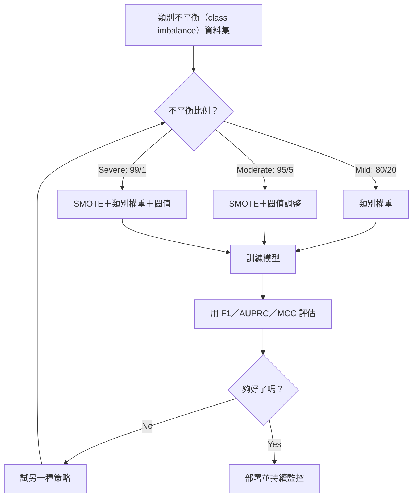
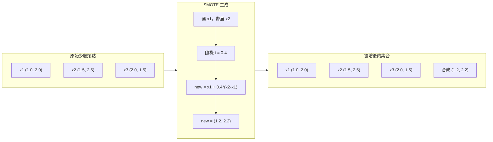
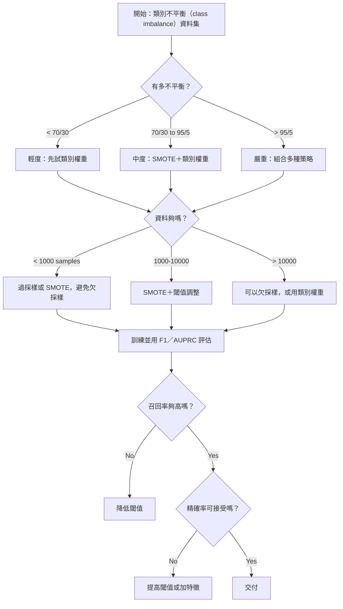

# 處理類別不平衡（class imbalance）資料（imbalanced data）

> 當 99% 的資料都是「正常」時，準確率（accuracy）就是謊言。

**Type:** Build
**Language:** Python
**Prerequisites:** Phase 2, Lessons 01-09 (especially evaluation metrics)
**Time:** ~90 minutes

## Learning Objectives｜學習目標

- 從頭實作 SMOTE，並說明合成過採樣（oversampling）和隨機複製有什麼不同
- 用 F1、AUPRC 與 Matthews 相關係數（Matthews correlation coefficient）評估不平衡分類器（classifier），而不是用準確率
- 比較類別權重（class weight）、閾值調整（threshold tuning）與重新抽樣（resampling），並依不平衡比例選對的做法
- 建立一條完整的類別不平衡（class imbalance）資料管線（pipeline），結合 SMOTE、類別權重與閾值最佳化

## The Problem｜問題

你做了一個詐欺偵測模型。準確率 99.9%。你還因此慶祝。然後你發現它把每一筆交易都預測成「不是詐欺」。

這不是 bug。當只有 0.1% 的交易是詐欺時，這樣做是理性的。模型學到：永遠猜多數類（majority class），整體錯誤最少。它技術上正確，卻完全沒用。

真正要緊的分類（classification）裡，這到處都發生。疾病診斷：陽性率 1%。網路入侵：0.01% 是攻擊。製造瑕疵：0.5% 不良。垃圾郵件篩選器（spam filter）：20% 是垃圾郵件。流失預測：5% 會流失。少數類（minority class）愈關鍵，它往往愈稀少。

準確率會失效，是因為它把所有正確預測一視同仁。正確標出一筆正當交易，和正確抓到詐欺，都只算一分準確率。但抓到詐欺才是這個模型存在的全部理由。我們需要能逼模型注意那個稀少但重要類別的指標（metric）、技術和訓練策略。

## The Concept｜核心概念

### 為什麼準確率會失敗

考慮一個有 1000 個樣本的資料集（dataset）：990 個負類、10 個正類。一個永遠預測負類的模型：

|  | 預測為正 | 預測為負 |
|--|---|---|
| 實際上為正 | 0 (TP) | 10 (FN) |
| 實際上為負 | 0 (FP) | 990 (TN) |

準確率 = (0 + 990) / 1000 = 99.0%

這個模型抓到的詐欺是零。疾病是零。瑕疵是零。但準確率說 99%。這就是不平衡問題裡準確率危險的原因。

### 更好的指標

**精確率（precision）** = TP / (TP + FP)。所有被標記為正的東西裡，有多少真的是？精確率高代表誤報少。

**召回率（recall）** = TP / (TP + FN)。所有實際上為正的東西裡，我們抓到多少？召回率高代表漏掉的正類少。

**F1 分數** = 2 * precision * recall / (precision + recall)。調和平均數（harmonic mean）。它對精確率和召回率的極端失衡，懲罰得比算術平均更重。

**F-beta 分數** = (1 + beta^2) * precision * recall / (beta^2 * precision + recall)。beta > 1 時，召回率更重要。beta < 1 時，精確率更重要。詐欺偵測常用 F2（漏掉詐欺比誤報更糟）。

**AUPRC**（精確率–召回率曲線下面積）。和 AUC-ROC 類似，但對不平衡資料更有資訊。隨機分類器的 AUPRC 等於正類比例（不像 ROC 那樣是 0.5）。這讓改善比較容易看出來。

**Matthews 相關係數** = (TP * TN - FP * FN) / sqrt((TP+FP)(TP+FN)(TN+FP)(TN+FN))。範圍從 -1 到 +1。只有模型在兩個類別上都做得好時，才會給高分。就算類別大小差很多，它仍然平衡。

對上面那個「永遠預測負類」的模型：精確率 = 0/0（未定義，通常設成 0），召回率 = 0/10 = 0，F1 = 0，MCC = 0。這些指標正確地指出這個模型沒有價值。

### 類別不平衡（class imbalance）資料管線



### SMOTE：合成少數類過採樣技術

隨機過採樣會複製既有的少數類樣本。這能用，但有過度擬合（overfitting）的風險，因為模型反覆看到相同的點。

SMOTE 造出新的合成少數類樣本。它們看起來合理，但不是複本。演算法（algorithm）是：

1. 對每個少數類樣本 x，在其他少數類樣本裡找出它的 k 個最近鄰
2. 隨機選一個鄰居
3. 在 x 和那個鄰居之間的線段上造一個新樣本

公式是：`new_sample = x + random(0, 1) * (neighbor - x)`

這在真實的少數類點之間內插，在特徵空間（feature space）的同一區製造樣本，而不是只複製既有資料。



### 抽樣策略比較

**隨機過採樣：** 複製少數類樣本，直到和多數類數量相同。
- 優點：簡單，不損失資訊
- 缺點：完全相同的複本造成過度擬合，訓練時間變長

**隨機欠採樣（undersampling）：** 移除多數類樣本，直到和少數類數量相同。
- 優點：訓練快，簡單
- 缺點：丟掉可能有用的多數類資料，變異（variance）較高

**SMOTE：** 用內插製造合成的少數類樣本。
- 優點：產生新的資料點，比隨機過採樣更不容易過度擬合
- 缺點：可能在決策邊界（decision boundary）附近造出吵雜的樣本，也不考慮多數類的分布

| 策略 | 資料怎麼變 | 風險 | 何時使用 |
|----------|-------------|------|-------------|
| 過採樣 | 少數類被複製 | 過度擬合 | 小資料集、中度不平衡 |
| 欠採樣 | 多數類被移除 | 資訊損失 | 大資料集、想要訓練快 |
| SMOTE | 加入合成少數類 | 邊界雜訊 | 中度不平衡，少數類樣本夠做 k 最近鄰 |

### 類別權重

不要改資料，改模型怎麼看待錯誤。把少數類分錯的權重提高。

一個二元問題有 950 個負類、50 個正類：
- 負類權重 = n_samples / (2 * n_negative) = 1000 / (2 * 950) = 0.526
- 正類權重 = n_samples / (2 * n_positive) = 1000 / (2 * 50) = 10.0

正類的權重是 19 倍。分錯一個正類樣本的成本，等於分錯 19 個負類樣本。模型被迫注意少數類。

在邏輯斯迴歸（logistic regression）裡，這會修改損失函數（loss function）：

```
weighted_loss = -sum(w_i * [y_i * log(p_i) + (1-y_i) * log(1-p_i)])
```

其中 w_i 取決於樣本 i 的類別。

就期望而言，類別權重和過採樣在數學上等價，但不會造出新的資料點。所以它更快，也避開複製樣本的過度擬合風險。

### 閾值調整

多數分類器輸出機率（probability）。預設（default）閾值（threshold）是 0.5：如果 P(positive) >= 0.5，就預測正類。但 0.5 是任意的。類別不平衡（class imbalance）時，最佳閾值通常低很多。

步驟：
1. 訓練一個模型
2. 在驗證集（validation set）上取得預測機率
3. 把閾值從 0.0 掃到 1.0
4. 在每個閾值計算 F1（或你選的指標）
5. 選讓指標最大的閾值


模型可能對一筆詐欺交易輸出 P(fraud) = 0.15。閾值 0.5 時，這會被分成不是詐欺。閾值 0.10 時，它會被正確抓到。機率校準（calibration）不如排名重要——只要詐欺的機率高於非詐欺，就存在一個能把它們分開的閾值。

### 成本敏感學習（cost-sensitive learning）

這是類別權重的推廣。不要用統一成本，改指定特定的誤分類成本：

| | 預測為正 | 預測為負 |
|--|---|---|
| 實際上為正 | 0（正確） | C_FN = 100 |
| 實際上為負 | C_FP = 1 | 0（正確） |

漏掉一筆詐欺交易（FN）的成本，是誤報（FP）的 100 倍。模型最佳化的是總成本，不是錯誤次數。

當你能估計真實世界的成本時，這是最有原則的做法。漏掉一次癌症診斷的成本，和一次會導致不必要切片的誤報，差得非常多。把這些成本寫明白，就會逼出正確的取捨。

### 決策流程



```figure
class-imbalance
```

## Build It｜動手實作

### 步驟 1：產生不平衡資料集

```python
import numpy as np


def make_imbalanced_data(n_majority=950, n_minority=50, seed=42):
    rng = np.random.RandomState(seed)

    X_maj = rng.randn(n_majority, 2) * 1.0 + np.array([0.0, 0.0])
    X_min = rng.randn(n_minority, 2) * 0.8 + np.array([2.5, 2.5])

    X = np.vstack([X_maj, X_min])
    y = np.concatenate([np.zeros(n_majority), np.ones(n_minority)])

    shuffle_idx = rng.permutation(len(y))
    return X[shuffle_idx], y[shuffle_idx]
```

### 步驟 2：從頭實作 SMOTE

```python
def euclidean_distance(a, b):
    return np.sqrt(np.sum((a - b) ** 2))


def find_k_neighbors(X, idx, k):
    distances = []
    for i in range(len(X)):
        if i == idx:
            continue
        d = euclidean_distance(X[idx], X[i])
        distances.append((i, d))
    distances.sort(key=lambda x: x[1])
    return [d[0] for d in distances[:k]]


def smote(X_minority, k=5, n_synthetic=100, seed=42):
    rng = np.random.RandomState(seed)
    n_samples = len(X_minority)
    k = min(k, n_samples - 1)
    synthetic = []

    for _ in range(n_synthetic):
        idx = rng.randint(0, n_samples)
        neighbors = find_k_neighbors(X_minority, idx, k)
        neighbor_idx = neighbors[rng.randint(0, len(neighbors))]
        t = rng.random()
        new_point = X_minority[idx] + t * (X_minority[neighbor_idx] - X_minority[idx])
        synthetic.append(new_point)

    return np.array(synthetic)
```

### 步驟 3：隨機過採樣與欠採樣

```python
def random_oversample(X, y, seed=42):
    rng = np.random.RandomState(seed)
    classes, counts = np.unique(y, return_counts=True)
    max_count = counts.max()

    X_resampled = list(X)
    y_resampled = list(y)

    for cls, count in zip(classes, counts):
        if count < max_count:
            cls_indices = np.where(y == cls)[0]
            n_needed = max_count - count
            chosen = rng.choice(cls_indices, size=n_needed, replace=True)
            X_resampled.extend(X[chosen])
            y_resampled.extend(y[chosen])

    X_out = np.array(X_resampled)
    y_out = np.array(y_resampled)
    shuffle = rng.permutation(len(y_out))
    return X_out[shuffle], y_out[shuffle]


def random_undersample(X, y, seed=42):
    rng = np.random.RandomState(seed)
    classes, counts = np.unique(y, return_counts=True)
    min_count = counts.min()

    X_resampled = []
    y_resampled = []

    for cls in classes:
        cls_indices = np.where(y == cls)[0]
        chosen = rng.choice(cls_indices, size=min_count, replace=False)
        X_resampled.extend(X[chosen])
        y_resampled.extend(y[chosen])

    X_out = np.array(X_resampled)
    y_out = np.array(y_resampled)
    shuffle = rng.permutation(len(y_out))
    return X_out[shuffle], y_out[shuffle]
```

### 步驟 4：帶類別權重的邏輯斯迴歸

```python
def sigmoid(z):
    return 1.0 / (1.0 + np.exp(-np.clip(z, -500, 500)))


def logistic_regression_weighted(X, y, weights, lr=0.01, epochs=200):
    n_samples, n_features = X.shape
    w = np.zeros(n_features)
    b = 0.0

    for _ in range(epochs):
        z = X @ w + b
        pred = sigmoid(z)
        error = pred - y
        weighted_error = error * weights

        gradient_w = (X.T @ weighted_error) / n_samples
        gradient_b = np.mean(weighted_error)

        w -= lr * gradient_w
        b -= lr * gradient_b

    return w, b


def compute_class_weights(y):
    classes, counts = np.unique(y, return_counts=True)
    n_samples = len(y)
    n_classes = len(classes)
    weight_map = {}
    for cls, count in zip(classes, counts):
        weight_map[cls] = n_samples / (n_classes * count)
    return np.array([weight_map[yi] for yi in y])
```

### 步驟 5：閾值調整

```python
def find_optimal_threshold(y_true, y_probs, metric="f1"):
    best_threshold = 0.5
    best_score = -1.0

    for threshold in np.arange(0.05, 0.96, 0.01):
        y_pred = (y_probs >= threshold).astype(int)
        tp = np.sum((y_pred == 1) & (y_true == 1))
        fp = np.sum((y_pred == 1) & (y_true == 0))
        fn = np.sum((y_pred == 0) & (y_true == 1))

        if metric == "f1":
            precision = tp / (tp + fp) if (tp + fp) > 0 else 0.0
            recall = tp / (tp + fn) if (tp + fn) > 0 else 0.0
            score = 2 * precision * recall / (precision + recall) if (precision + recall) > 0 else 0.0
        elif metric == "recall":
            score = tp / (tp + fn) if (tp + fn) > 0 else 0.0
        elif metric == "precision":
            score = tp / (tp + fp) if (tp + fp) > 0 else 0.0

        if score > best_score:
            best_score = score
            best_threshold = threshold

    return best_threshold, best_score
```

### 步驟 6：評估函式

```python
def confusion_matrix_values(y_true, y_pred):
    tp = np.sum((y_pred == 1) & (y_true == 1))
    tn = np.sum((y_pred == 0) & (y_true == 0))
    fp = np.sum((y_pred == 1) & (y_true == 0))
    fn = np.sum((y_pred == 0) & (y_true == 1))
    return tp, tn, fp, fn


def compute_metrics(y_true, y_pred):
    tp, tn, fp, fn = confusion_matrix_values(y_true, y_pred)
    accuracy = (tp + tn) / (tp + tn + fp + fn)
    precision = tp / (tp + fp) if (tp + fp) > 0 else 0.0
    recall = tp / (tp + fn) if (tp + fn) > 0 else 0.0
    f1 = 2 * precision * recall / (precision + recall) if (precision + recall) > 0 else 0.0

    denom = np.sqrt(float((tp + fp) * (tp + fn) * (tn + fp) * (tn + fn)))
    mcc = (tp * tn - fp * fn) / denom if denom > 0 else 0.0

    return {
        "accuracy": accuracy,
        "precision": precision,
        "recall": recall,
        "f1": f1,
        "mcc": mcc,
    }
```

### 步驟 7：比較所有做法

```python
X, y = make_imbalanced_data(950, 50, seed=42)
split = int(0.8 * len(y))
X_train, X_test = X[:split], X[split:]
y_train, y_test = y[:split], y[split:]

# Baseline: no treatment
w_base, b_base = logistic_regression_weighted(
    X_train, y_train, np.ones(len(y_train)), lr=0.1, epochs=300
)
probs_base = sigmoid(X_test @ w_base + b_base)
preds_base = (probs_base >= 0.5).astype(int)

# Oversampled
X_over, y_over = random_oversample(X_train, y_train)
w_over, b_over = logistic_regression_weighted(
    X_over, y_over, np.ones(len(y_over)), lr=0.1, epochs=300
)
preds_over = (sigmoid(X_test @ w_over + b_over) >= 0.5).astype(int)

# SMOTE
minority_mask = y_train == 1
X_minority = X_train[minority_mask]
synthetic = smote(X_minority, k=5, n_synthetic=len(y_train) - 2 * int(minority_mask.sum()))
X_smote = np.vstack([X_train, synthetic])
y_smote = np.concatenate([y_train, np.ones(len(synthetic))])
w_sm, b_sm = logistic_regression_weighted(
    X_smote, y_smote, np.ones(len(y_smote)), lr=0.1, epochs=300
)
preds_smote = (sigmoid(X_test @ w_sm + b_sm) >= 0.5).astype(int)

# Class weights
sample_weights = compute_class_weights(y_train)
w_cw, b_cw = logistic_regression_weighted(
    X_train, y_train, sample_weights, lr=0.1, epochs=300
)
probs_cw = sigmoid(X_test @ w_cw + b_cw)
preds_cw = (probs_cw >= 0.5).astype(int)

# Threshold tuning (tune on held-out validation set, not test set)
probs_val = sigmoid(X_val @ w_cw + b_cw)
best_thresh, best_f1 = find_optimal_threshold(y_val, probs_val, metric="f1")
preds_thresh = (probs_cw >= best_thresh).astype(int)
```

程式檔會在一個程式檔裡跑完以上全部，並印出結果。

## Use It｜實際應用

用 scikit-learn 和 imbalanced-learn 時，這些技術都只要一行：

```python
from sklearn.linear_model import LogisticRegression
from sklearn.metrics import classification_report, f1_score
from sklearn.model_selection import train_test_split
from imblearn.over_sampling import SMOTE
from imblearn.under_sampling import RandomUnderSampler
from imblearn.pipeline import Pipeline

X_train, X_test, y_train, y_test = train_test_split(X, y, stratify=y)

model_weighted = LogisticRegression(class_weight="balanced")
model_weighted.fit(X_train, y_train)
print(classification_report(y_test, model_weighted.predict(X_test)))

smote = SMOTE(random_state=42)
X_resampled, y_resampled = smote.fit_resample(X_train, y_train)
model_smote = LogisticRegression()
model_smote.fit(X_resampled, y_resampled)
print(classification_report(y_test, model_smote.predict(X_test)))

pipeline = Pipeline([
    ("smote", SMOTE()),
    ("model", LogisticRegression(class_weight="balanced")),
])
pipeline.fit(X_train, y_train)
print(classification_report(y_test, pipeline.predict(X_test)))
```

從頭實作顯示每種技術到底在做什麼。SMOTE 只是少數類上的 k 最近鄰內插。類別權重會把損失乘上權重。閾值調整就是對各個切點跑一個 for 迴圈。沒有魔術。

## Ship It｜交付成果

本課會產出：
- `outputs/skill-imbalanced-data.md`——一份處理不平衡分類問題的決策清單

## Exercises｜練習

1. **Borderline-SMOTE：** 修改 SMOTE，只替那些靠近決策邊界的少數類點產生合成樣本（它們的 k 個最近鄰裡包含多數類樣本）。在類別有重疊的資料集上，和標準 SMOTE 比較結果。

2. **成本矩陣最佳化：** 實作成本敏感學習，把成本矩陣當成參數。寫一個函式，接收成本矩陣，回傳使期望成本最小的預測。用不同的成本比（1:10、1:100、1:1000）測試，並畫出精確率–召回率取捨怎麼變。

3. **閾值校準：** 實作 Platt scaling（在模型的原始輸出上擬合一個邏輯斯迴歸，產生校準後的機率）。比較校準前後的精確率–召回率曲線。顯示校準不改變排名（AUC 不變），但讓機率更有意義。

4. **用平衡 bagging 做集成（ensemble）：** 訓練多個模型，每個都在一份平衡的 bootstrap 樣本上訓練（全部少數類＋多數類的隨機子集）。把預測平均。把這個做法和單一的 SMOTE 模型比較。同時量表現，以及各次執行之間的變異。

5. **不平衡比例實驗：** 拿一份平衡的資料集，逐步提高不平衡比例（50/50、70/30、90/10、95/5、99/1）。每個比例都各訓練一次有 SMOTE、一次沒有 SMOTE。畫出兩種做法的 F1 對不平衡比例。從哪個比例開始，SMOTE 才出現有意義的差別？

## Key Terms｜關鍵術語

| 術語 | 常見說法 | 實際意義 |
|------|----------------|----------------------|
| 類別不平衡（class imbalance） | 「一個類別的樣本多很多」 | 資料集裡的類別分布明顯偏斜，使模型偏向多數類 |
| SMOTE | 「合成過採樣」 | 在既有少數類樣本和它們的 k 個少數類最近鄰之間內插，造出新的少數類樣本 |
| 類別權重 | 「讓稀少類別的錯誤更貴」 | 用類別專用的權重去乘損失函數，讓模型更重罰少數類的誤分類 |
| 閾值調整 | 「移動決策邊界」 | 把分類的機率切點從預設的 0.5 改成能最佳化目標指標的值 |
| 精確率–召回率取捨 | 「你不能兩個都要」 | 降低閾值會抓到更多正類（召回率更高），但也會標記更多偽陽性（精確率更低），反過來也一樣 |
| AUPRC | 「PR 曲線下面積」 | 把精確率–召回率曲線彙成一個數字；類別嚴重不平衡時比 AUC-ROC 更有資訊 |
| Matthews 相關係數 | 「平衡的指標」 | 預測標籤和實際標籤的相關；只有兩個類別都表現好時才會高分 |
| 成本敏感學習 | 「不同的錯誤代價不同」 | 把真實世界的誤分類成本放進訓練目標，讓模型最佳化的是總成本，而不是錯誤次數 |
| 隨機過採樣 | 「複製少數類」 | 重複少數類樣本來平衡類別數量；簡單，但有對複本過度擬合的風險 |

## Further Reading｜延伸閱讀

- [SMOTE: Synthetic Minority Over-sampling Technique (Chawla et al., 2002)](https://arxiv.org/abs/1106.1813)——SMOTE 原始論文，仍是不平衡學習被引用最多的工作
- [Learning from Imbalanced Data (He & Garcia, 2009)](https://ieeexplore.ieee.org/document/5128907)——涵蓋抽樣、成本敏感與演算法做法的綜述
- [imbalanced-learn documentation](https://imbalanced-learn.org/stable/)——含 SMOTE 變體、欠採樣策略與管線整合的 Python 函式庫（library）
- [The Precision-Recall Plot Is More Informative than the ROC Plot (Saito & Rehmsmeier, 2015)](https://journals.plos.org/plosone/article?id=10.1371/journal.pone.0118432)——不平衡問題何時、以及為什麼該偏好 PR 曲線而不是 ROC 曲線
