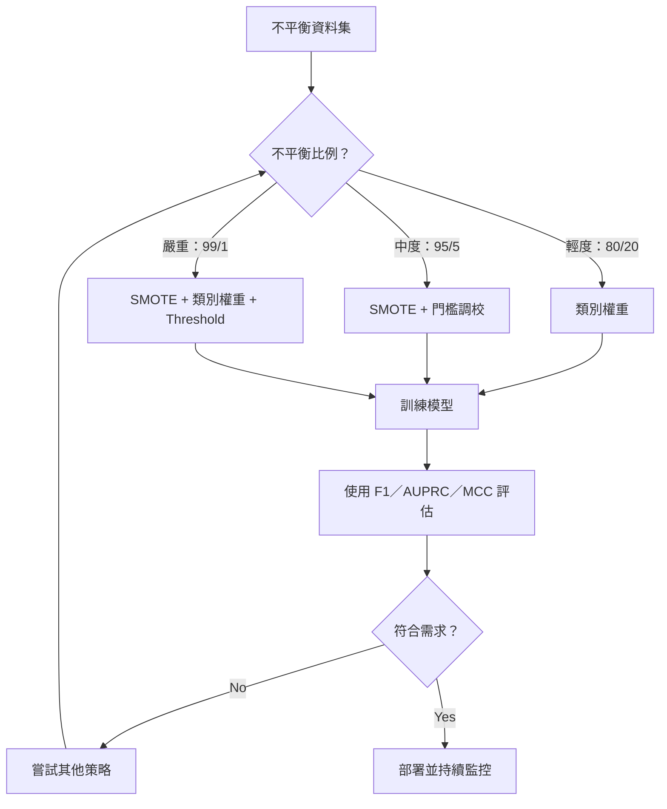
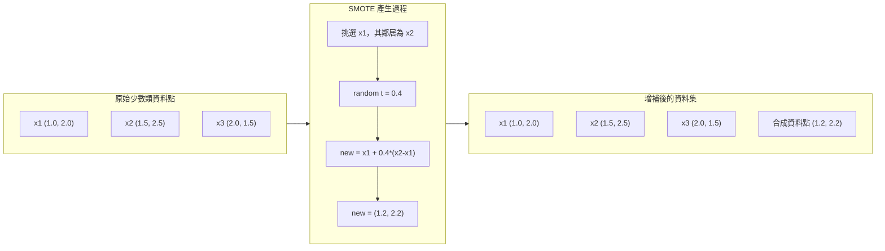
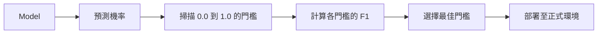
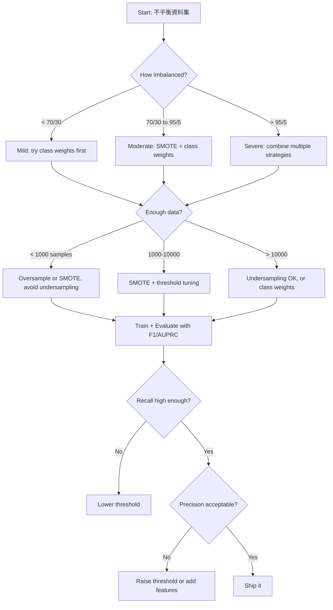

# 處理類別不平衡資料

> 當 99% 的資料都是「正常」，準確率就會說謊。

**Type:** Build
**Language:** Python
**Prerequisites:** Phase 2, Lessons 01-09 (especially evaluation metrics)
**Time:** ~90 minutes

## 學習目標

- 從頭實作 SMOTE，並說明合成過度取樣和隨機複製的差別
- 使用 F1、AUPRC 和 Matthews 相關係數評估類別不平衡的分類器，而非使用準確率
- 比較類別權重、門檻調校和重新取樣策略，並依不平衡比例選擇合適方法
- 建立結合 SMOTE、類別權重與門檻最佳化的完整不平衡資料流程

## 問題

你建立了一個詐欺偵測模型，準確率達到 99.9%。你正準備慶祝，卻發現模型把每一筆交易都預測成「非詐欺」。

這不是程式錯誤。當詐欺交易只占 0.1% 時，這種預測反而很合理。模型發現，只要一律猜多數類別，就能將整體錯誤降到最低。技術上正確，實際上卻毫無用處。

只要分類問題很重要，就常會遇到這種狀況：疾病診斷的陽性率為 1%、網路入侵事件占 0.01%、製造瑕疵率為 0.5%、垃圾郵件占 20%、客戶流失率為 5%。少數類別越攸關重大，通常就越稀少。

準確率會失效，因為它把所有正確預測都視為同樣重要。正確標記一筆合法交易和成功抓到一筆詐欺，都只替準確率加一分。但模型存在的目的正是抓出詐欺。我們需要合適的指標、方法和訓練策略，讓模型重視稀少卻重要的類別。

## 核心概念

### 準確率為什麼會失效

考慮一份有 1,000 筆樣本的資料集：990 筆負類、10 筆正類。若模型一律預測為負類：

|  | 預測為正類 | 預測為負類 |
|--|---|---|
| 實際為正類 | 0（TP） | 10（FN） |
| 實際為負類 | 0（FP） | 990（TN） |

準確率 = (0 + 990) / 1000 = 99.0%

模型完全抓不到詐欺、疾病或瑕疵，但準確率卻有 99%。這就是為什麼準確率不適合用於類別不平衡問題。

### 更合適的指標

**Precision（精確率）** = TP / (TP + FP)。所有被標記為正類的項目中，有多少是真的？精確率高表示誤報少。

**Recall（召回率）** = TP / (TP + FN)。所有實際為正類的項目中，抓到了多少？召回率高表示漏掉的正類少。

**F1 分數** = 2 * precision * recall / (precision + recall)。這是調和平均數；相較於算術平均數，當 Precision 和 Recall 差距很大時，F1 會給予更大的懲罰。

**F-beta 分數** = (1 + beta^2) * precision * recall / (beta^2 * precision + recall)。beta > 1 時較重視 Recall；beta < 1 時較重視 Precision。詐欺偵測常用 F2，因為漏掉詐欺比誤報更糟。

**AUPRC（Precision-Recall 曲線下面積）**和 AUC-ROC 類似，但對類別不平衡的資料更有參考價值。隨機分類器的 AUPRC 會等於正類比例（不像 ROC 的 0.5），因此較容易看出改善幅度。

**Matthews 相關係數（MCC）** = (TP * TN - FP * FN) / sqrt((TP+FP)(TP+FN)(TN+FP)(TN+FN))。範圍介於 -1 和 +1。只有模型在兩個類別上都表現良好時，MCC 才會很高；即使類別數量差距很大，它仍能平衡評估結果。

對前述「一律預測為負類」的模型來說：Precision = 0/0（未定義，通常設為 0）、Recall = 0/10 = 0、F1 = 0、MCC = 0。這些指標能正確顯示模型毫無價值。

### 類別不平衡資料流程



### SMOTE：合成少數類過度取樣技術

隨機過度取樣會複製現有的少數類樣本。雖然有效，但模型會反覆看到完全相同的資料點，因此有過度擬合風險。

SMOTE 會建立合理但非複製品的少數類合成樣本。演算法如下：

1. 對每筆少數類樣本 x，找出其他少數類樣本中的 k 個最近鄰
2. 隨機挑選一個鄰居
3. 在 x 和該鄰居之間的線段上建立一筆新樣本

公式：`new_sample = x + random(0, 1) * (neighbor - x)`

這會在真實少數類資料點之間插值，在相同特徵空間區域中產生新樣本，而不只是複製現有資料。



### 取樣策略比較

**隨機過度取樣：** 複製少數類樣本，直到數量和多數類相同。
- 優點：簡單、不會遺失資訊
- 缺點：完全重複的資料容易造成過度擬合，也會延長訓練時間

**隨機欠取樣：** 移除多數類樣本，直到數量和少數類相同。
- 優點：訓練速度快、方法簡單
- 缺點：會丟棄可能有用的多數類資料，而且變異較高

**SMOTE：** 透過插值產生少數類合成樣本。
- 優點：能產生新資料點，相較於隨機過度取樣可降低過度擬合
- 缺點：可能在決策邊界附近產生雜訊，也不會考量多數類的分布

| 策略 | 資料變化 | 風險 | 適用情境 |
|----------|-------------|------|-------------|
| 過度取樣 | 複製少數類 | 過度擬合 | 小型資料集、中度不平衡 |
| 欠取樣 | 移除多數類 | 資訊損失 | 大型資料集、重視快速訓練 |
| SMOTE | 加入少數類合成資料 | 邊界雜訊 | 中度不平衡，且少數類樣本足以進行 KNN |

### 類別權重

不改變資料，而是改變模型看待錯誤的方式。提高錯分少數類時的權重。

假設二元問題有 950 筆負類和 50 筆正類：
- 負類權重 = n_samples / (2 * n_negative) = 1000 / (2 * 950) = 0.526
- 正類權重 = n_samples / (2 * n_positive) = 1000 / (2 * 50) = 10.0

正類的權重是負類的 19 倍。錯分一筆正類的代價，等於錯分 19 筆負類。模型因此必須重視少數類。

在邏輯迴歸中，這會改變損失函式：

```text
weighted_loss = -sum(w_i * [y_i * log(p_i) + (1-y_i) * log(1-p_i)])
```

其中 `w_i` 取決於第 i 筆樣本所屬的類別。

以期望值來看，類別權重在數學上等同於過度取樣，但不需要建立新資料點。這讓訓練更快，也能避免重複樣本造成過度擬合。

### 門檻調校

多數分類器會輸出機率。預設門檻是 0.5：若 `P(positive) >= 0.5`，就預測為正類。但 0.5 只是任意選擇。類別不平衡時，最佳門檻通常低得多。

調校步驟：
1. 訓練模型
2. 取得驗證集上的預測機率
3. 將門檻從 0.0 掃描到 1.0
4. 計算各門檻下的 F1（或你選擇的指標）
5. 選擇能讓指標最高的門檻



模型可能會為一筆詐欺交易輸出 `P(fraud) = 0.15`。門檻為 0.5 時，這筆交易會被判定為非詐欺；門檻降至 0.10 時，就能正確抓到詐欺。機率校準的重要性低於排序；只要詐欺交易的機率高於非詐欺交易，就能找到區分兩者的門檻。

### 成本敏感式學習

類別權重的進一步延伸。與其使用一致的成本，不如為不同錯誤指定個別成本：

|  | 預測為正類 | 預測為負類 |
|--|---|---|
| 實際為正類 | 0（正確） | C_FN = 100 |
| 實際為負類 | C_FP = 1 | 0（正確） |

漏掉一筆詐欺交易（FN）的成本，是誤報（FP）的 100 倍。模型會以總成本而非錯誤總數作為最佳化目標。

如果你能估計真實成本，這是最有理據的方法。漏診癌症與誤報後多做一次切片檢查，成本截然不同。明確列出成本，能讓模型做出正確的取捨。

### 決策流程圖



```figure
class-imbalance
```

## Build It：動手實作

### 步驟 1：產生不平衡資料集

```python
import numpy as np


def make_imbalanced_data(n_majority=950, n_minority=50, seed=42):
    rng = np.random.RandomState(seed)

    X_maj = rng.randn(n_majority, 2) * 1.0 + np.array([0.0, 0.0])
    X_min = rng.randn(n_minority, 2) * 0.8 + np.array([2.5, 2.5])

    X = np.vstack([X_maj, X_min])
    y = np.concatenate([np.zeros(n_majority), np.ones(n_minority)])

    shuffle_idx = rng.permutation(len(y))
    return X[shuffle_idx], y[shuffle_idx]
```

### 步驟 2：從頭實作 SMOTE

```python
def euclidean_distance(a, b):
    return np.sqrt(np.sum((a - b) ** 2))


def find_k_neighbors(X, idx, k):
    distances = []
    for i in range(len(X)):
        if i == idx:
            continue
        d = euclidean_distance(X[idx], X[i])
        distances.append((i, d))
    distances.sort(key=lambda x: x[1])
    return [d[0] for d in distances[:k]]


def smote(X_minority, k=5, n_synthetic=100, seed=42):
    rng = np.random.RandomState(seed)
    n_samples = len(X_minority)
    k = min(k, n_samples - 1)
    synthetic = []

    for _ in range(n_synthetic):
        idx = rng.randint(0, n_samples)
        neighbors = find_k_neighbors(X_minority, idx, k)
        neighbor_idx = neighbors[rng.randint(0, len(neighbors))]
        t = rng.random()
        new_point = X_minority[idx] + t * (X_minority[neighbor_idx] - X_minority[idx])
        synthetic.append(new_point)

    return np.array(synthetic)
```

### 步驟 3：隨機過度取樣與欠取樣

```python
def random_oversample(X, y, seed=42):
    rng = np.random.RandomState(seed)
    classes, counts = np.unique(y, return_counts=True)
    max_count = counts.max()

    X_resampled = list(X)
    y_resampled = list(y)

    for cls, count in zip(classes, counts):
        if count < max_count:
            cls_indices = np.where(y == cls)[0]
            n_needed = max_count - count
            chosen = rng.choice(cls_indices, size=n_needed, replace=True)
            X_resampled.extend(X[chosen])
            y_resampled.extend(y[chosen])

    X_out = np.array(X_resampled)
    y_out = np.array(y_resampled)
    shuffle = rng.permutation(len(y_out))
    return X_out[shuffle], y_out[shuffle]


def random_undersample(X, y, seed=42):
    rng = np.random.RandomState(seed)
    classes, counts = np.unique(y, return_counts=True)
    min_count = counts.min()

    X_resampled = []
    y_resampled = []

    for cls in classes:
        cls_indices = np.where(y == cls)[0]
        chosen = rng.choice(cls_indices, size=min_count, replace=False)
        X_resampled.extend(X[chosen])
        y_resampled.extend(y[chosen])

    X_out = np.array(X_resampled)
    y_out = np.array(y_resampled)
    shuffle = rng.permutation(len(y_out))
    return X_out[shuffle], y_out[shuffle]
```

### 步驟 4：使用類別權重的邏輯迴歸

```python
def sigmoid(z):
    return 1.0 / (1.0 + np.exp(-np.clip(z, -500, 500)))


def logistic_regression_weighted(X, y, weights, lr=0.01, epochs=200):
    n_samples, n_features = X.shape
    w = np.zeros(n_features)
    b = 0.0

    for _ in range(epochs):
        z = X @ w + b
        pred = sigmoid(z)
        error = pred - y
        weighted_error = error * weights

        gradient_w = (X.T @ weighted_error) / n_samples
        gradient_b = np.mean(weighted_error)

        w -= lr * gradient_w
        b -= lr * gradient_b

    return w, b


def compute_class_weights(y):
    classes, counts = np.unique(y, return_counts=True)
    n_samples = len(y)
    n_classes = len(classes)
    weight_map = {}
    for cls, count in zip(classes, counts):
        weight_map[cls] = n_samples / (n_classes * count)
    return np.array([weight_map[yi] for yi in y])
```

### 步驟 5：調校門檻

```python
def find_optimal_threshold(y_true, y_probs, metric="f1"):
    best_threshold = 0.5
    best_score = -1.0

    for threshold in np.arange(0.05, 0.96, 0.01):
        y_pred = (y_probs >= threshold).astype(int)
        tp = np.sum((y_pred == 1) & (y_true == 1))
        fp = np.sum((y_pred == 1) & (y_true == 0))
        fn = np.sum((y_pred == 0) & (y_true == 1))

        if metric == "f1":
            precision = tp / (tp + fp) if (tp + fp) > 0 else 0.0
            recall = tp / (tp + fn) if (tp + fn) > 0 else 0.0
            score = 2 * precision * recall / (precision + recall) if (precision + recall) > 0 else 0.0
        elif metric == "recall":
            score = tp / (tp + fn) if (tp + fn) > 0 else 0.0
        elif metric == "precision":
            score = tp / (tp + fp) if (tp + fp) > 0 else 0.0

        if score > best_score:
            best_score = score
            best_threshold = threshold

    return best_threshold, best_score
```

### 步驟 6：評估函式

```python
def confusion_matrix_values(y_true, y_pred):
    tp = np.sum((y_pred == 1) & (y_true == 1))
    tn = np.sum((y_pred == 0) & (y_true == 0))
    fp = np.sum((y_pred == 1) & (y_true == 0))
    fn = np.sum((y_pred == 0) & (y_true == 1))
    return tp, tn, fp, fn


def compute_metrics(y_true, y_pred):
    tp, tn, fp, fn = confusion_matrix_values(y_true, y_pred)
    accuracy = (tp + tn) / (tp + tn + fp + fn)
    precision = tp / (tp + fp) if (tp + fp) > 0 else 0.0
    recall = tp / (tp + fn) if (tp + fn) > 0 else 0.0
    f1 = 2 * precision * recall / (precision + recall) if (precision + recall) > 0 else 0.0

    denom = np.sqrt(float((tp + fp) * (tp + fn) * (tn + fp) * (tn + fn)))
    mcc = (tp * tn - fp * fn) / denom if denom > 0 else 0.0

    return {
        "accuracy": accuracy,
        "precision": precision,
        "recall": recall,
        "f1": f1,
        "mcc": mcc,
    }
```

### 步驟 7：比較所有方法

```python
X, y = make_imbalanced_data(950, 50, seed=42)
split = int(0.8 * len(y))
X_train, X_test = X[:split], X[split:]
y_train, y_test = y[:split], y[split:]

# Baseline: no treatment
w_base, b_base = logistic_regression_weighted(
    X_train, y_train, np.ones(len(y_train)), lr=0.1, epochs=300
)
probs_base = sigmoid(X_test @ w_base + b_base)
preds_base = (probs_base >= 0.5).astype(int)

# Oversampled
X_over, y_over = random_oversample(X_train, y_train)
w_over, b_over = logistic_regression_weighted(
    X_over, y_over, np.ones(len(y_over)), lr=0.1, epochs=300
)
preds_over = (sigmoid(X_test @ w_over + b_over) >= 0.5).astype(int)

# SMOTE
minority_mask = y_train == 1
X_minority = X_train[minority_mask]
synthetic = smote(X_minority, k=5, n_synthetic=len(y_train) - 2 * int(minority_mask.sum()))
X_smote = np.vstack([X_train, synthetic])
y_smote = np.concatenate([y_train, np.ones(len(synthetic))])
w_sm, b_sm = logistic_regression_weighted(
    X_smote, y_smote, np.ones(len(y_smote)), lr=0.1, epochs=300
)
preds_smote = (sigmoid(X_test @ w_sm + b_sm) >= 0.5).astype(int)

# Class weights
sample_weights = compute_class_weights(y_train)
w_cw, b_cw = logistic_regression_weighted(
    X_train, y_train, sample_weights, lr=0.1, epochs=300
)
probs_cw = sigmoid(X_test @ w_cw + b_cw)
preds_cw = (probs_cw >= 0.5).astype(int)

# Threshold tuning (tune on held-out validation set, not test set)
probs_val = sigmoid(X_val @ w_cw + b_cw)
best_thresh, best_f1 = find_optimal_threshold(y_val, probs_val, metric="f1")
preds_thresh = (probs_cw >= best_thresh).astype(int)
```

程式檔會用單一指令執行所有步驟並印出結果。

## Use It：套用現成工具

使用 scikit-learn 和 imbalanced-learn，這些方法都能用一行設定完成：

```python
from sklearn.linear_model import LogisticRegression
from sklearn.metrics import classification_report, f1_score
from sklearn.model_selection import train_test_split
from imblearn.over_sampling import SMOTE
from imblearn.under_sampling import RandomUnderSampler
from imblearn.pipeline import Pipeline

X_train, X_test, y_train, y_test = train_test_split(X, y, stratify=y)

model_weighted = LogisticRegression(class_weight="balanced")
model_weighted.fit(X_train, y_train)
print(classification_report(y_test, model_weighted.predict(X_test)))

smote = SMOTE(random_state=42)
X_resampled, y_resampled = smote.fit_resample(X_train, y_train)
model_smote = LogisticRegression()
model_smote.fit(X_resampled, y_resampled)
print(classification_report(y_test, model_smote.predict(X_test)))

pipeline = Pipeline([
    ("smote", SMOTE()),
    ("model", LogisticRegression(class_weight="balanced")),
])
pipeline.fit(X_train, y_train)
print(classification_report(y_test, pipeline.predict(X_test)))
```

從頭實作的版本能明確呈現各方法的原理。SMOTE 只是對少數類套用 KNN 插值；類別權重會乘上損失；門檻調校則是逐一嘗試不同切點。沒有魔法。

## Ship It：交付成果

本課程會產出：
- `outputs/skill-imbalanced-data.md`：處理類別不平衡分類問題的決策檢查表

## Exercises：練習

1. **Borderline-SMOTE：** 修改 SMOTE 實作，只為靠近決策邊界的少數類資料點產生合成樣本（也就是其 K 個最近鄰中包含多數類樣本的點）。在類別重疊的資料集上和標準 SMOTE 比較結果。

2. **成本矩陣最佳化：** 實作以成本矩陣作為參數的成本敏感式學習。建立函式，輸入成本矩陣後回傳能讓預期成本最低的預測結果。使用不同成本比例（1:10、1:100、1:1000）進行測試，並繪出 Precision-Recall 取捨如何改變。

3. **門檻校準：** 實作 Platt scaling（對模型原始輸出擬合邏輯迴歸，產生校準後的機率）。比較校準前後的 Precision-Recall 曲線，並證明校準不會改變排序（AUC 保持不變），但會讓機率更有意義。

4. **使用平衡 Bagging 的集成方法：** 訓練多個模型，每個模型都使用平衡的自助樣本（全部少數類樣本 + 隨機抽取的部分多數類樣本）。平均各模型的預測結果，再和單一使用 SMOTE 的模型比較效能與不同執行結果的變異。

5. **不平衡比例實驗：** 取一份平衡資料集，逐步提高不平衡比例（50/50、70/30、90/10、95/5、99/1）。每種比例都分別使用和不使用 SMOTE 訓練模型，繪製 F1 與不平衡比例的關係圖。SMOTE 從哪個比例開始帶來明顯差異？

## 關鍵詞

| 術語 | 常見說法 | 實際意義 |
|------|----------------|----------------------|
| 類別不平衡 | 「其中一類的樣本多很多」 | 資料集的類別分布明顯偏斜，導致模型偏向多數類 |
| SMOTE | 「合成過度取樣」 | 在現有少數類樣本和其 K 個最近少數類鄰居之間插值，產生新的少數類樣本 |
| 類別權重 | 「讓罕見類別的錯誤代價更高」 | 對損失函式乘上各類別專屬權重，讓模型更重視少數類的錯誤 |
| 門檻調校 | 「移動決策邊界」 | 將分類機率門檻從預設 0.5 改為能最佳化目標指標的值 |
| Precision-Recall 取捨 | 「兩者無法兼得」 | 降低門檻會抓到更多正類（Recall 較高），但也會多標記偽陽性（Precision 較低），反之亦然 |
| AUPRC | 「PR 曲線下面積」 | 將 Precision-Recall 曲線彙整成一個數值；類別嚴重不平衡時，比 AUC-ROC 更有參考價值 |
| Matthews 相關係數 | 「平衡指標」 | 衡量預測標籤與實際標籤的相關性；模型在兩個類別上都表現良好時，分數才會高 |
| 成本敏感式學習 | 「不同錯誤的代價不同」 | 將真實世界的錯分成本納入訓練目標，讓模型最佳化總成本而非錯誤數量 |
| 隨機過度取樣 | 「複製少數類」 | 重複少數類樣本以平衡類別數量；方法簡單，但重複資料點有過度擬合風險 |

## 延伸閱讀

- [SMOTE：合成少數類過度取樣技術（Chawla 等人，2002）](https://arxiv.org/abs/1106.1813)：SMOTE 原始論文，也是類別不平衡學習領域最常引用的研究
- [從不平衡資料學習（He 和 Garcia，2009）](https://ieeexplore.ieee.org/document/5128907)：涵蓋取樣、成本敏感式學習和演算法方法的完整回顧
- [imbalanced-learn 文件](https://imbalanced-learn.org/stable/)：提供 SMOTE 變體、欠取樣策略和流程整合的 Python 函式庫
- [Precision-Recall 圖比 ROC 圖更有參考價值（Saito 和 Rehmsmeier，2015）](https://journals.plos.org/plosone/article?id=10.1371/journal.pone.0118432)：說明類別不平衡問題中，何時以及為何應優先使用 PR 曲線
