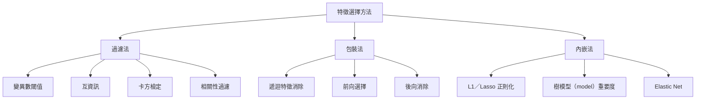
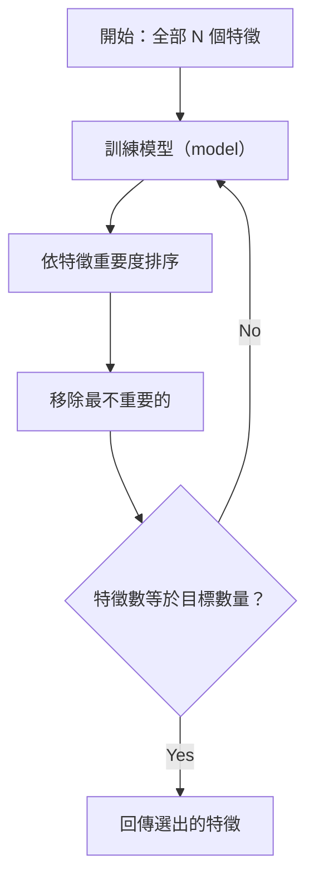
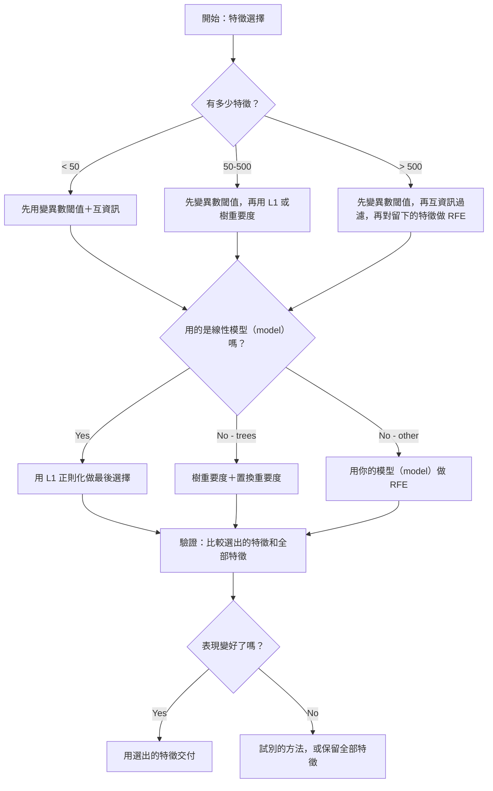

# 特徵選擇（feature selection）

> 特徵（feature）愈多並不比較好。選對的特徵才比較好。

**Type:** Build
**Language:** Python
**Prerequisites:** Phase 2, Lessons 01-09, 08 (feature engineering)
**Time:** ~75 minutes

## Learning Objectives｜學習目標

- 從頭實作過濾法（filter method），包括變異數閾值（variance threshold）、互資訊（mutual information）與卡方檢定（chi-squared），以及包裝法（wrapper method），包括遞迴特徵消除（recursive feature elimination）與前向選擇（forward selection）
- 說明互資訊為什麼抓得到相關性（correlation）抓不到的非線性特徵與目標關係
- 比較 L1 正則化（L1 regularization）這種內嵌法（embedded method），以及遞迴特徵消除這種包裝法，並評估它們在計算量上的取捨
- 建立一條結合多種方法的特徵選擇管線（pipeline），並在留出的資料（held-out data）上展示更好的泛化（generalization）

## The Problem｜問題

你有 500 個特徵。模型（model）訓練很慢，一直過度擬合（overfitting），而且沒有人解釋得了它學到什麼。你再加特徵，希望表現變好。結果更差。

這就是維度災難（curse of dimensionality）。特徵一變多，特徵空間（feature space）的體積會急遽膨脹。資料點變稀疏。點和點之間的距離趨於相同。模型（model）需要呈指數增加的資料，才找得到真正的模式。雜訊特徵蓋過有訊號的特徵。過度擬合變成常態。

特徵選擇是解藥。把雜訊剝掉。把冗餘拿掉。留下真正帶有目標資訊的特徵。結果是訓練更快、泛化更好，而且模型（model）也更容易解釋。

目標不是把所有可用的資訊都用上，而是用對的資訊。

## The Concept｜核心概念

### 特徵選擇的三個類別

每種特徵選擇方法都落在這三類之一：



**過濾法**用統計量替每個特徵單獨打分。它們不用模型（model）。很快，但會漏掉特徵交互作用（feature interaction）。

**包裝法**會訓練模型（model），再拿模型（model）表現評估特徵子集。結果較好，但貴，因為模型（model）要重訓很多次。

**內嵌法**在模型（model）訓練的過程中選特徵。L1 正則化使權重（weight）歸零。決策樹（decision tree）會依最有用的特徵做分裂。選擇發生在擬合當下，不是另一步。

### 變異數閾值

最簡單的過濾法。如果一個特徵在各個樣本之間幾乎不變，它幾乎沒有資訊。

想像一個特徵在 1000 個樣本裡有 999 個是 0.0。它的變異數接近 0。沒有模型（model）能靠它區分類別。把它拿掉。

```
variance(x) = mean((x - mean(x))^2)
```

設一個閾值（例如 0.01）。變異數低於它的特徵全部丟掉。這樣能移除常數或接近常數的特徵，而且完全不看目標變數（target variable）。

何時使用：當作其他方法之前的前處理（preprocessing）。它能以幾乎為零的成本抓到明顯沒用的特徵。

限制：特徵的變異數可以很高，卻仍是純雜訊。變異數閾值是必要的，但並不充分。

### 互資訊

互資訊衡量的是：知道特徵 X 的值之後，目標 Y 的不確定性少了多少。

```
I(X; Y) = sum_x sum_y p(x, y) * log(p(x, y) / (p(x) * p(y)))
```

若 X 和 Y 獨立，p(x, y) = p(x) * p(y)，對數項就是 0，I(X; Y) = 0。X 能告訴你的 Y 愈多，互資訊愈高。

相對相關性的關鍵優點：互資訊抓得到非線性關係。一個特徵和目標的相關性可以是 0，互資訊卻很高，因為關係是二次的，或是週期的。

連續特徵要先離散成區間（bin），再用直方圖估計。區間數會影響估計——太少會損失資訊，太多會加入雜訊。常見選擇是 sqrt(n) 個區間，或 Sturges' rule（1 + log2(n)）。


### 遞迴特徵消除（RFE）

遞迴特徵消除是包裝法。它用模型（model）自己的特徵重要度（feature importance），一輪一輪修剪：

1. 用全部特徵訓練模型（model）
2. 依重要度排序。線性模型（model）用係數，樹用不純度（impurity）下降
3. 移除最不重要的一個或幾個特徵
4. 重複，直到剩下想要的特徵數



遞迴特徵消除會考慮特徵交互作用，因為模型（model）是把剩下的特徵放在一起看。拿掉一個特徵，會改變其他特徵的重要度。所以它比過濾法更徹底。

代價是：訓練次數是特徵數 N 減掉要留下的數量。500 個特徵、要留下 10 個，就是 490 次訓練。模型（model）很貴時，這會很慢。想加快的話，每一步可以移除多個特徵，例如每一輪移除排名最低的 10% 特徵。

### L1（Lasso）正則化

L1 正則化把權重（weight）的絕對值加進損失函數（loss function）：

```
loss = prediction_error + alpha * sum(|w_i|)
```

alpha 參數（parameter）控制修剪有多積極。alpha 愈高，愈多權重（weight）會正好變成 0。

為什麼是正好變成 0？L1 懲罰在權重（weight）空間裡形成菱形的約束區域。最佳解往往落在這個菱形的角落，那裡有一個或多個權重（weight）是 0。L2 正則化（L2 regularization），也就是嶺迴歸（ridge regression），形成的是圓形約束，權重（weight）會縮小，但很少正好變成 0。

這就是內嵌式的特徵選擇：模型（model）在訓練時學會該忽略哪些特徵。權重（weight）為 0 的特徵，等於被移除。

優點：只訓練一次；能處理相關的特徵——挑一個，把其餘的權重（weight）變成 0；多數線性模型（model）的實作都內建這個做法。

限制：只適用於線性模型（model）。抓不到非線性的特徵重要度。

### 樹模型（model）的特徵重要度

決策樹和它們的集成（ensemble），例如隨機森林（random forest）、gradient boosting，天生就會給特徵排序。每一次分裂都會降低不純度。分類用 Gini 或熵（entropy），迴歸用變異數。造成較大不純度下降的特徵比較重要。

有 T 棵樹的隨機森林：

```
importance(feature_j) = (1/T) * sum over all trees of
    sum over all nodes splitting on feature_j of
        (n_samples * impurity_decrease)
```

這樣每個特徵會得到一個正規化後的重要度分數。它會自動處理非線性關係和特徵交互作用。

要注意：樹模型（model）重要度會偏向相異值很多的特徵，也就是高基數（cardinality）。隨機的 ID 欄會看起來很重要，因為它能把每個樣本都完美分開。用置換重要度（permutation importance）做一次健全性檢查。

### 置換重要度

這是一種與模型（model）無關的方法：

1. 訓練模型（model），並在驗證資料上記下基準表現
2. 對每個特徵：隨機打亂它的值，量表現下降多少
3. 下降愈多，特徵愈重要

把一個特徵打亂之後表現沒變差，代表模型（model）不依賴它。表現崩掉，代表這個特徵很關鍵。

置換重要度避開了樹模型（model）重要度的基數偏誤。但它慢：每個特徵都要完整評估一次，而且為了穩定要重複好幾次。

### 比較表

| 方法 | 類型 | 速度 | 非線性 | 特徵交互作用 |
|--------|------|-------|-----------|---------------------|
| 變異數閾值 | 過濾 | 非常快 | 否 | 否 |
| 互資訊 | 過濾 | 快 | 是 | 否 |
| 相關性過濾 | 過濾 | 快 | 否 | 否 |
| RFE | 包裝 | 慢 | 視模型（model）而定 | 是 |
| L1 / Lasso | 內嵌 | 快 | 否（線性） | 否 |
| 樹重要度 | 內嵌 | 中等 | 是 | 是 |
| 置換重要度 | 與模型（model）無關 | 慢 | 是 | 是 |

### 決策流程



```figure
f3-feature-prune
```

## Build It｜動手實作

### 步驟 1：產生結構已知的合成資料（synthetic data）

```python
import numpy as np


def make_feature_selection_data(n_samples=500, seed=42):
    rng = np.random.RandomState(seed)

    x1 = rng.randn(n_samples)
    x2 = rng.randn(n_samples)
    x3 = rng.randn(n_samples)
    x4 = x1 + 0.1 * rng.randn(n_samples)
    x5 = x2 + 0.1 * rng.randn(n_samples)

    informative = np.column_stack([x1, x2, x3, x4, x5])

    correlated = np.column_stack([
        x1 * 0.9 + 0.1 * rng.randn(n_samples),
        x2 * 0.8 + 0.2 * rng.randn(n_samples),
        x3 * 0.7 + 0.3 * rng.randn(n_samples),
        x1 * 0.5 + x2 * 0.5 + 0.1 * rng.randn(n_samples),
        x2 * 0.6 + x3 * 0.4 + 0.1 * rng.randn(n_samples),
    ])

    noise = rng.randn(n_samples, 10) * 0.5

    X = np.hstack([informative, correlated, noise])
    y = (2 * x1 - 1.5 * x2 + x3 + 0.5 * rng.randn(n_samples) > 0).astype(int)

    feature_names = (
        [f"info_{i}" for i in range(5)]
        + [f"corr_{i}" for i in range(5)]
        + [f"noise_{i}" for i in range(10)]
    )

    return X, y, feature_names
```

我們知道正確結構（ground truth）：特徵 0–4 有資訊，而且 3 和 4 是 0 和 1 的相關複本；特徵 5–9 和有資訊的特徵相關；特徵 10–19 是純雜訊。好的選擇方法應該把 0–4 排最高、10–19 排最低。

### 步驟 2：變異數閾值

```python
def variance_threshold(X, threshold=0.01):
    variances = np.var(X, axis=0)
    mask = variances > threshold
    return mask, variances
```

### 步驟 3：互資訊（離散）

```python
def discretize(x, n_bins=10):
    min_val, max_val = x.min(), x.max()
    if max_val == min_val:
        return np.zeros_like(x, dtype=int)
    bin_edges = np.linspace(min_val, max_val, n_bins + 1)
    binned = np.digitize(x, bin_edges[1:-1])
    return binned


def mutual_information(X, y, n_bins=10):
    n_samples, n_features = X.shape
    mi_scores = np.zeros(n_features)

    y_vals, y_counts = np.unique(y, return_counts=True)
    p_y = y_counts / n_samples

    for f in range(n_features):
        x_binned = discretize(X[:, f], n_bins)
        x_vals, x_counts = np.unique(x_binned, return_counts=True)
        p_x = dict(zip(x_vals, x_counts / n_samples))

        mi = 0.0
        for xv in x_vals:
            for yi, yv in enumerate(y_vals):
                joint_mask = (x_binned == xv) & (y == yv)
                p_xy = np.sum(joint_mask) / n_samples
                if p_xy > 0:
                    mi += p_xy * np.log(p_xy / (p_x[xv] * p_y[yi]))
        mi_scores[f] = mi

    return mi_scores
```

### 步驟 4：遞迴特徵消除

```python
def simple_logistic_importance(X, y, lr=0.1, epochs=100):
    n_samples, n_features = X.shape
    w = np.zeros(n_features)
    b = 0.0

    for _ in range(epochs):
        z = X @ w + b
        pred = 1.0 / (1.0 + np.exp(-np.clip(z, -500, 500)))
        error = pred - y
        w -= lr * (X.T @ error) / n_samples
        b -= lr * np.mean(error)

    return w, b


def rfe(X, y, n_features_to_select=5, lr=0.1, epochs=100):
    n_total = X.shape[1]
    remaining = list(range(n_total))
    rankings = np.ones(n_total, dtype=int)
    rank = n_total

    while len(remaining) > n_features_to_select:
        X_subset = X[:, remaining]
        w, _ = simple_logistic_importance(X_subset, y, lr, epochs)
        importances = np.abs(w)

        least_idx = np.argmin(importances)
        original_idx = remaining[least_idx]
        rankings[original_idx] = rank
        rank -= 1
        remaining.pop(least_idx)

    for idx in remaining:
        rankings[idx] = 1

    selected_mask = rankings == 1
    return selected_mask, rankings
```

### 步驟 5：L1 特徵選擇

```python
def soft_threshold(w, alpha):
    return np.sign(w) * np.maximum(np.abs(w) - alpha, 0)


def l1_feature_selection(X, y, alpha=0.1, lr=0.01, epochs=500):
    n_samples, n_features = X.shape
    w = np.zeros(n_features)
    b = 0.0

    for _ in range(epochs):
        z = X @ w + b
        pred = 1.0 / (1.0 + np.exp(-np.clip(z, -500, 500)))
        error = pred - y

        gradient_w = (X.T @ error) / n_samples
        gradient_b = np.mean(error)

        w -= lr * gradient_w
        w = soft_threshold(w, lr * alpha)
        b -= lr * gradient_b

    selected_mask = np.abs(w) > 1e-6
    return selected_mask, w
```

### 步驟 6：樹模型（model）重要度（簡單決策樹）

```python
def gini_impurity(y):
    if len(y) == 0:
        return 0.0
    classes, counts = np.unique(y, return_counts=True)
    probs = counts / len(y)
    return 1.0 - np.sum(probs ** 2)


def best_split(X, y, feature_idx):
    values = np.unique(X[:, feature_idx])
    if len(values) <= 1:
        return None, -1.0

    best_threshold = None
    best_gain = -1.0
    parent_gini = gini_impurity(y)
    n = len(y)

    for i in range(len(values) - 1):
        threshold = (values[i] + values[i + 1]) / 2.0
        left_mask = X[:, feature_idx] <= threshold
        right_mask = ~left_mask

        n_left = np.sum(left_mask)
        n_right = np.sum(right_mask)

        if n_left == 0 or n_right == 0:
            continue

        gain = parent_gini - (n_left / n) * gini_impurity(y[left_mask]) - (n_right / n) * gini_impurity(y[right_mask])

        if gain > best_gain:
            best_gain = gain
            best_threshold = threshold

    return best_threshold, best_gain


def tree_importance(X, y, n_trees=50, max_depth=5, seed=42):
    rng = np.random.RandomState(seed)
    n_samples, n_features = X.shape
    importances = np.zeros(n_features)

    for _ in range(n_trees):
        sample_idx = rng.choice(n_samples, size=n_samples, replace=True)
        feature_subset = rng.choice(n_features, size=max(1, int(np.sqrt(n_features))), replace=False)

        X_boot = X[sample_idx]
        y_boot = y[sample_idx]

        tree_imp = _build_tree_importance(X_boot, y_boot, feature_subset, max_depth)
        importances += tree_imp

    total = importances.sum()
    if total > 0:
        importances /= total

    return importances


def _build_tree_importance(X, y, feature_subset, max_depth, depth=0):
    n_features = X.shape[1]
    importances = np.zeros(n_features)

    if depth >= max_depth or len(np.unique(y)) <= 1 or len(y) < 4:
        return importances

    best_feature = None
    best_threshold = None
    best_gain = -1.0

    for f in feature_subset:
        threshold, gain = best_split(X, y, f)
        if gain > best_gain:
            best_gain = gain
            best_feature = f
            best_threshold = threshold

    if best_feature is None or best_gain <= 0:
        return importances

    importances[best_feature] += best_gain * len(y)

    left_mask = X[:, best_feature] <= best_threshold
    right_mask = ~left_mask

    importances += _build_tree_importance(X[left_mask], y[left_mask], feature_subset, max_depth, depth + 1)
    importances += _build_tree_importance(X[right_mask], y[right_mask], feature_subset, max_depth, depth + 1)

    return importances
```

### 步驟 7：跑完所有方法並比較

程式檔會在同一份合成資料（synthetic data）集（dataset）上跑完這五種方法，並印出比較表，顯示每種方法選了哪些特徵。

## Use It｜實際應用

用 scikit-learn 時，特徵選擇直接做在管線裡：

```python
from sklearn.feature_selection import (
    VarianceThreshold,
    mutual_info_classif,
    RFE,
    SelectFromModel,
)
from sklearn.linear_model import Lasso, LogisticRegression
from sklearn.ensemble import RandomForestClassifier

vt = VarianceThreshold(threshold=0.01)
X_filtered = vt.fit_transform(X)

mi_scores = mutual_info_classif(X, y)
top_k = np.argsort(mi_scores)[-10:]

rfe_selector = RFE(LogisticRegression(), n_features_to_select=10)
rfe_selector.fit(X, y)
X_rfe = rfe_selector.transform(X)

lasso_selector = SelectFromModel(Lasso(alpha=0.01))
lasso_selector.fit(X, y)
X_lasso = lasso_selector.transform(X)

rf = RandomForestClassifier(n_estimators=100)
rf.fit(X, y)
importances = rf.feature_importances_
```

從頭實作顯示每個方法裡面到底發生什麼。變異數閾值只是計算 `var(X, axis=0)` 再套上遮罩。互資訊是在列聯表裡數聯合頻率和邊際頻率。RFE 是一個訓練、排序、修剪的迴圈。L1 是梯度下降法（gradient descent），再加上軟閾值那一步。樹重要度把各次分裂的不純度下降累加起來。沒有魔術——就是統計和迴圈。

sklearn 的版本更穩健，例如 mutual_info_classif 用 k 最近鄰密度估計，而不是分箱；也更快，因為是 C 實作；而且接得進管線。

## Ship It｜交付成果

本課會產出：
- `outputs/skill-feature-selector.md`——一份挑選特徵選擇方法的快速參考決策樹

## Exercises｜練習

1. **前向選擇：** 實作和遞迴特徵消除相反的做法。從零個特徵開始。每一步加入最能改善模型（model）表現的那個特徵。加了特徵也不再有幫助時就停。把選出的特徵和遞迴特徵消除的結果比較。哪一個比較快？哪一個結果比較好？

2. **穩定性選擇（stability selection）：** 把 L1 特徵選擇跑 50 次，每次用資料的隨機 80% 子樣本，alpha 稍微不同。計算每個特徵被選中的次數。在超過 80% 的執行裡被選中的特徵就是「穩定」。把穩定特徵和只跑一次的 L1 選擇比較。哪一個比較可靠？

3. **多重共線性（multicollinearity）偵測：** 計算所有特徵的相關矩陣。寫一個函式，給定相關性閾值，例如 0.9，從每一對高度相關的特徵裡移除一個，留下和目標互資訊較高的那個。在合成資料（synthetic data）集上測試，確認它移除了多餘的相關特徵。

4. **特徵選擇管線：** 把變異數閾值、互資訊過濾和遞迴特徵消除串成一條管線。先移除變異數接近 0 的特徵，再依互資訊留下前 50%，然後對剩下的特徵跑遞迴特徵消除。把這條管線和直接對全部特徵跑遞迴特徵消除比較。管線比較快嗎？準確度一樣嗎？

5. **從頭實作置換重要度：** 實作置換重要度。對每個特徵，把它的值打亂 10 次，量 F1 分數的平均下降。把這個排序和樹模型（model）重要度比較。找出兩者不一致的情況並解釋原因。提示：相關的特徵。

## Key Terms｜關鍵術語

| 術語 | 常見說法 | 實際意義 |
|------|----------------|----------------------|
| 過濾法 | 「各自給特徵打分數」 | 不訓練模型（model），用統計量替特徵排序，而且每個特徵分開評估的特徵選擇做法 |
| 包裝法 | 「用模型（model）挑特徵」 | 訓練模型（model）、評估特徵子集，並用模型（model）表現當選擇標準的特徵選擇做法 |
| 內嵌法 | 「模型（model）在訓練時自己選特徵」 | 特徵選擇發生在模型（model）擬合的過程裡，例如 L1 正則化使權重（weight）正好歸零 |
| 互資訊 | 「一個變數能告訴你另一個變數多少」 | 知道 X 之後，Y 的不確定性減少多少；線性與非線性的依賴都算 |
| 遞迴特徵消除 | 「訓練、排序、修剪、重複」 | 反覆訓練模型（model）、移除最不重要的特徵，直到達到目標數量的包裝法 |
| L1／Lasso 正則化 | 「會殺掉特徵的懲罰項」 | 把權重（weight）絕對值的總和加進損失函數，讓不重要特徵的權重（weight）正好變成 0 |
| 變異數閾值 | 「移除常數特徵」 | 丟掉樣本間變異數低於指定閾值的特徵，濾掉沒有資訊的特徵 |
| 特徵重要度 | 「哪些特徵最要緊」 | 每個特徵對模型（model）預測貢獻多少的分數；樹用分裂增益，線性模型（model）用係數大小 |
| 置換重要度 | 「打亂之後看傷害多大」 | 隨機打亂每個特徵的值，再以模型（model）表現下降多少評估它有多重要 |
| 維度災難 | 「特徵太多、資料不夠」 | 特徵一增加，特徵空間的體積就指數成長，資料變稀疏，距離也失去意義 |

## Further Reading｜延伸閱讀

- [An Introduction to Variable and Feature Selection (Guyon & Elisseeff, 2003)](https://jmlr.org/papers/v3/guyon03a.html)——特徵選擇方法的奠基綜述，至今仍常被引用
- [scikit-learn Feature Selection Guide](https://scikit-learn.org/stable/modules/feature_selection.html)——過濾法、包裝法與內嵌法的實用參考，附程式範例
- [Stability Selection (Meinshausen & Buhlmann, 2010)](https://arxiv.org/abs/0809.2932)——把子抽樣和特徵選擇結合起來，讓結果穩健、可重現
- [Beware Default Random Forest Importances (Strobl et al., 2007)](https://bmcbioinformatics.biomedcentral.com/articles/10.1186/1471-2105-8-25)——指出樹模型（model）重要度的基數偏誤，並提出條件重要度作為替代
