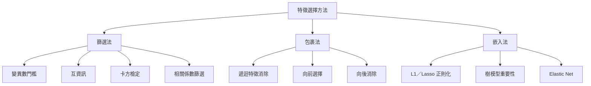
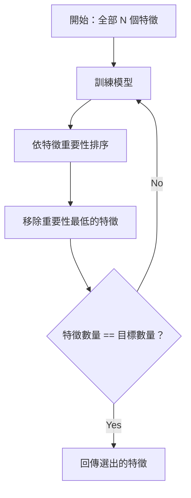
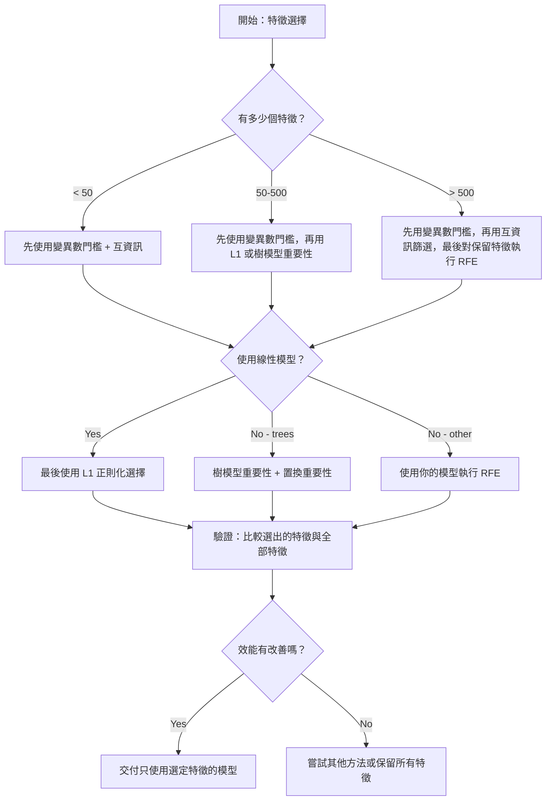

# 特徵選擇

> 特徵越多不一定越好；選對特徵才重要。

**Type:** Build
**Language:** Python
**Prerequisites:** Phase 2, Lessons 01-09, 08 (feature engineering)
**Time:** ~75 minutes

## 學習目標

- 從頭實作篩選法（變異數門檻、互資訊、卡方檢定）與包裹法（RFE、向前選擇）
- 說明為什麼互資訊能捕捉相關分析會漏掉的非線性特徵與目標關係
- 比較 L1 正則化（嵌入式選擇）與 RFE（包裹式選擇），並評估兩者的計算成本取捨
- 建立結合多種方法的特徵選擇流程，並展示它如何改善保留資料上的泛化能力

## 問題

你有 500 個特徵。模型訓練緩慢、持續過度擬合，而且沒有人能說明模型學到了什麼。你加入更多特徵，希望提升效能，結果卻更差。

這就是維度詛咒的影響。特徵數增加時，特徵空間的體積會快速膨脹，資料點變得稀疏，點與點之間的距離逐漸趨同。模型需要指數級增加的資料才能找到真正的模式。雜訊特徵會淹沒訊號，過度擬合也成了常態。

特徵選擇能解決這個問題：去除雜訊和冗餘，只保留真正提供目標資訊的特徵。結果是訓練更快、泛化更好，模型也更容易解釋。

目標不是使用所有可用資訊，而是選對資訊。

## 核心概念

### 特徵選擇的三種類型

每種特徵選擇方法都屬於以下三種類型之一：



**篩選法**會使用統計指標獨立評分各特徵，不會使用模型。速度快，但無法捕捉特徵交互作用。

**包裹法**會訓練模型來評估特徵子集，以模型效能作為分數。效果較好，但必須反覆重新訓練模型，因此成本較高。

**嵌入法**會在模型訓練過程中選擇特徵。L1 正則化會讓權重變成 0；決策樹會切分最有用的特徵。特徵選擇發生在擬合過程中，而非另外執行。

### 變異數門檻

最簡單的篩選法。如果某個特徵在樣本間幾乎沒有變化，它所提供的資訊就很少。

以某個特徵為例：1,000 筆樣本中有 999 筆的值都是 0.0，變異數就會接近 0。沒有任何模型能靠它區分類別，因此可以移除。

```text
variance(x) = mean((x - mean(x))^2)
```

設定一個門檻（例如 0.01），移除變異數低於門檻的所有特徵。完全不必查看目標變數，就能移除常數或接近常數的特徵。

適用時機：作為其他方法前的前處理步驟。幾乎不花成本，就能先移除明顯無用的特徵。

限制：高變異數特徵仍可能只是純雜訊。因此變異數門檻是必要步驟，但還不足以完成特徵選擇。

### 互資訊

互資訊衡量知道特徵 X 的值後，對目標 Y 的不確定性能減少多少。

```text
I(X; Y) = sum_x sum_y p(x, y) * log(p(x, y) / (p(x) * p(y)))
```

如果 X 和 Y 獨立，`p(x, y) = p(x) * p(y)`，因此對數項為 0，互資訊 `I(X; Y) = 0`。X 越能提供 Y 的資訊，互資訊就越高。

相較於相關係數，互資訊的主要優點是能捕捉非線性關係。某個特徵與目標的相關係數可能為 0，但如果兩者呈二次或週期性關係，互資訊仍可能很高。

連續特徵要先離散化成分箱，再以直方圖估計。分箱數量會影響估計結果：太少會遺失資訊，太多則會增加雜訊。常見選擇為 `sqrt(n)` 個分箱，或採用 Sturges 法則（`1 + log2(n)`）。


### 遞迴特徵消除（RFE）

RFE 是一種包裹法，會利用模型本身的特徵重要性反覆刪減特徵：

1. 使用所有特徵訓練模型
2. 依特徵重要性排序（線性模型使用係數，樹模型使用不純度降低量）
3. 移除重要性最低的特徵
4. 重複以上步驟，直到保留目標數量的特徵



RFE 能考量特徵交互作用，因為模型會一起查看所有剩餘特徵。移除一個特徵後，其他特徵的重要性也會改變，因此比篩選法更周全。

代價是需要訓練模型 `N - target` 次。若有 500 個特徵，目標是保留 10 個，就得訓練 490 次。對成本高的模型來說會很慢。可以在每一步移除多個特徵來加速，例如每一輪移除重要性最低的 10%。

### L1（Lasso）正則化

L1 正則化會將權重絕對值加進損失函式：

```text
loss = prediction_error + alpha * sum(|w_i|)
```

alpha 參數控制特徵刪減的強度。alpha 越大，越多權重會變成精確的 0。

為什麼會變成精確的 0？L1 懲罰在權重空間中會形成菱形限制區域。最佳解傾向落在菱形的角上，因此一個或多個權重會是 0。L2 正則化（Ridge）形成的是圓形限制區域，權重會縮小，但很少剛好變成 0。

這是嵌入式特徵選擇：模型會在訓練時學會忽略哪些特徵。權重為 0 的特徵等同於已被移除。

優點：只需訓練一次、能處理相關特徵（保留其中一個並將其他權重設為 0），而且多數線性模型實作都內建此方法。

限制：只適用於線性模型，無法捕捉非線性特徵的重要性。

### 樹模型的特徵重要性

決策樹和集成模型（隨機森林、梯度提升）能自然地為特徵排序。每次切分都會降低不純度（分類時使用 Gini 或熵，迴歸時使用變異數）。不純度降低越多，該特徵就越重要。

以含有 T 棵樹的隨機森林為例：

```text
importance(feature_j) = (1/T) * sum over all trees of
    sum over all nodes splitting on feature_j of
        (n_samples * impurity_decrease)
```

這會為每個特徵產生正規化的重要性分數。它也能自動處理非線性關係與特徵交互作用。

注意：樹模型的特徵重要性會偏向有許多唯一值的特徵（高基數特徵）。隨機 ID 欄位可能看起來很重要，因為它能完美切分每筆樣本。請使用置換重要性進行合理性檢查。

### 置換重要性

這是一種與模型無關的方法：

1. 訓練模型，並記錄驗證資料上的基準效能
2. 對每個特徵隨機打亂其值，測量效能下降幅度
3. 效能下降越多，特徵就越重要

打亂某個特徵後，如果效能沒有變差，表示模型不依賴這個特徵；如果效能大幅下降，表示該特徵很重要。

置換重要性不會受到樹模型重要性中的基數偏差影響，但速度很慢：每個特徵都必須完整評估一次，而且需要重複多次才能確認結果穩定。

### 方法比較表

| 方法 | 類型 | 速度 | 非線性 | 特徵交互作用 |
|--------|------|-------|-----------|---------------------|
| 變異數門檻 | 篩選法 | 非常快 | 不支援 | 不支援 |
| 互資訊 | 篩選法 | 快 | 支援 | 不支援 |
| 相關係數篩選 | 篩選法 | 快 | 不支援 | 不支援 |
| RFE | 包裹法 | 慢 | 取決於模型 | 支援 |
| L1／Lasso | 嵌入法 | 快 | 不支援（線性） | 不支援 |
| 樹模型重要性 | 嵌入法 | 中等 | 支援 | 支援 |
| 置換重要性 | 與模型無關 | 慢 | 支援 | 支援 |

### 決策流程圖



```figure
f3-feature-prune
```

## Build It：動手實作

### 步驟 1：產生具有已知特徵結構的合成資料

```python
import numpy as np


def make_feature_selection_data(n_samples=500, seed=42):
    rng = np.random.RandomState(seed)

    x1 = rng.randn(n_samples)
    x2 = rng.randn(n_samples)
    x3 = rng.randn(n_samples)
    x4 = x1 + 0.1 * rng.randn(n_samples)
    x5 = x2 + 0.1 * rng.randn(n_samples)

    informative = np.column_stack([x1, x2, x3, x4, x5])

    correlated = np.column_stack([
        x1 * 0.9 + 0.1 * rng.randn(n_samples),
        x2 * 0.8 + 0.2 * rng.randn(n_samples),
        x3 * 0.7 + 0.3 * rng.randn(n_samples),
        x1 * 0.5 + x2 * 0.5 + 0.1 * rng.randn(n_samples),
        x2 * 0.6 + x3 * 0.4 + 0.1 * rng.randn(n_samples),
    ])

    noise = rng.randn(n_samples, 10) * 0.5

    X = np.hstack([informative, correlated, noise])
    y = (2 * x1 - 1.5 * x2 + x3 + 0.5 * rng.randn(n_samples) > 0).astype(int)

    feature_names = (
        [f"info_{i}" for i in range(5)]
        + [f"corr_{i}" for i in range(5)]
        + [f"noise_{i}" for i in range(10)]
    )

    return X, y, feature_names
```

我們知道資料的真實結構：特徵 0–4 有資訊（其中 3 和 4 分別是特徵 0 和 1 的相關副本）；特徵 5–9 和有資訊的特徵相關；特徵 10–19 則是純雜訊。好的選擇方法應該把 0–4 排在前面，把 10–19 排在最後。

### 步驟 2：變異數門檻

```python
def variance_threshold(X, threshold=0.01):
    variances = np.var(X, axis=0)
    mask = variances > threshold
    return mask, variances
```

### 步驟 3：互資訊（離散型）

```python
def discretize(x, n_bins=10):
    min_val, max_val = x.min(), x.max()
    if max_val == min_val:
        return np.zeros_like(x, dtype=int)
    bin_edges = np.linspace(min_val, max_val, n_bins + 1)
    binned = np.digitize(x, bin_edges[1:-1])
    return binned


def mutual_information(X, y, n_bins=10):
    n_samples, n_features = X.shape
    mi_scores = np.zeros(n_features)

    y_vals, y_counts = np.unique(y, return_counts=True)
    p_y = y_counts / n_samples

    for f in range(n_features):
        x_binned = discretize(X[:, f], n_bins)
        x_vals, x_counts = np.unique(x_binned, return_counts=True)
        p_x = dict(zip(x_vals, x_counts / n_samples))

        mi = 0.0
        for xv in x_vals:
            for yi, yv in enumerate(y_vals):
                joint_mask = (x_binned == xv) & (y == yv)
                p_xy = np.sum(joint_mask) / n_samples
                if p_xy > 0:
                    mi += p_xy * np.log(p_xy / (p_x[xv] * p_y[yi]))
        mi_scores[f] = mi

    return mi_scores
```

### 步驟 4：遞迴特徵消除

```python
def simple_logistic_importance(X, y, lr=0.1, epochs=100):
    n_samples, n_features = X.shape
    w = np.zeros(n_features)
    b = 0.0

    for _ in range(epochs):
        z = X @ w + b
        pred = 1.0 / (1.0 + np.exp(-np.clip(z, -500, 500)))
        error = pred - y
        w -= lr * (X.T @ error) / n_samples
        b -= lr * np.mean(error)

    return w, b


def rfe(X, y, n_features_to_select=5, lr=0.1, epochs=100):
    n_total = X.shape[1]
    remaining = list(range(n_total))
    rankings = np.ones(n_total, dtype=int)
    rank = n_total

    while len(remaining) > n_features_to_select:
        X_subset = X[:, remaining]
        w, _ = simple_logistic_importance(X_subset, y, lr, epochs)
        importances = np.abs(w)

        least_idx = np.argmin(importances)
        original_idx = remaining[least_idx]
        rankings[original_idx] = rank
        rank -= 1
        remaining.pop(least_idx)

    for idx in remaining:
        rankings[idx] = 1

    selected_mask = rankings == 1
    return selected_mask, rankings
```

### 步驟 5：L1 特徵選擇

```python
def soft_threshold(w, alpha):
    return np.sign(w) * np.maximum(np.abs(w) - alpha, 0)


def l1_feature_selection(X, y, alpha=0.1, lr=0.01, epochs=500):
    n_samples, n_features = X.shape
    w = np.zeros(n_features)
    b = 0.0

    for _ in range(epochs):
        z = X @ w + b
        pred = 1.0 / (1.0 + np.exp(-np.clip(z, -500, 500)))
        error = pred - y

        gradient_w = (X.T @ error) / n_samples
        gradient_b = np.mean(error)

        w -= lr * gradient_w
        w = soft_threshold(w, lr * alpha)
        b -= lr * gradient_b

    selected_mask = np.abs(w) > 1e-6
    return selected_mask, w
```

### 步驟 6：樹模型重要性（簡易決策樹）

```python
def gini_impurity(y):
    if len(y) == 0:
        return 0.0
    classes, counts = np.unique(y, return_counts=True)
    probs = counts / len(y)
    return 1.0 - np.sum(probs ** 2)


def best_split(X, y, feature_idx):
    values = np.unique(X[:, feature_idx])
    if len(values) <= 1:
        return None, -1.0

    best_threshold = None
    best_gain = -1.0
    parent_gini = gini_impurity(y)
    n = len(y)

    for i in range(len(values) - 1):
        threshold = (values[i] + values[i + 1]) / 2.0
        left_mask = X[:, feature_idx] <= threshold
        right_mask = ~left_mask

        n_left = np.sum(left_mask)
        n_right = np.sum(right_mask)

        if n_left == 0 or n_right == 0:
            continue

        gain = parent_gini - (n_left / n) * gini_impurity(y[left_mask]) - (n_right / n) * gini_impurity(y[right_mask])

        if gain > best_gain:
            best_gain = gain
            best_threshold = threshold

    return best_threshold, best_gain


def tree_importance(X, y, n_trees=50, max_depth=5, seed=42):
    rng = np.random.RandomState(seed)
    n_samples, n_features = X.shape
    importances = np.zeros(n_features)

    for _ in range(n_trees):
        sample_idx = rng.choice(n_samples, size=n_samples, replace=True)
        feature_subset = rng.choice(n_features, size=max(1, int(np.sqrt(n_features))), replace=False)

        X_boot = X[sample_idx]
        y_boot = y[sample_idx]

        tree_imp = _build_tree_importance(X_boot, y_boot, feature_subset, max_depth)
        importances += tree_imp

    total = importances.sum()
    if total > 0:
        importances /= total

    return importances


def _build_tree_importance(X, y, feature_subset, max_depth, depth=0):
    n_features = X.shape[1]
    importances = np.zeros(n_features)

    if depth >= max_depth or len(np.unique(y)) <= 1 or len(y) < 4:
        return importances

    best_feature = None
    best_threshold = None
    best_gain = -1.0

    for f in feature_subset:
        threshold, gain = best_split(X, y, f)
        if gain > best_gain:
            best_gain = gain
            best_feature = f
            best_threshold = threshold

    if best_feature is None or best_gain <= 0:
        return importances

    importances[best_feature] += best_gain * len(y)

    left_mask = X[:, best_feature] <= best_threshold
    right_mask = ~left_mask

    importances += _build_tree_importance(X[left_mask], y[left_mask], feature_subset, max_depth, depth + 1)
    importances += _build_tree_importance(X[right_mask], y[right_mask], feature_subset, max_depth, depth + 1)

    return importances
```

### 步驟 7：執行並比較所有方法

程式檔會在相同的合成資料集上執行五種方法，並印出比較表，顯示各方法選出了哪些特徵。

## Use It：套用現成工具

在 scikit-learn 中，特徵選擇可以直接整合進處理流程：

```python
from sklearn.feature_selection import (
    VarianceThreshold,
    mutual_info_classif,
    RFE,
    SelectFromModel,
)
from sklearn.linear_model import Lasso, LogisticRegression
from sklearn.ensemble import RandomForestClassifier

vt = VarianceThreshold(threshold=0.01)
X_filtered = vt.fit_transform(X)

mi_scores = mutual_info_classif(X, y)
top_k = np.argsort(mi_scores)[-10:]

rfe_selector = RFE(LogisticRegression(), n_features_to_select=10)
rfe_selector.fit(X, y)
X_rfe = rfe_selector.transform(X)

lasso_selector = SelectFromModel(Lasso(alpha=0.01))
lasso_selector.fit(X, y)
X_lasso = lasso_selector.transform(X)

rf = RandomForestClassifier(n_estimators=100)
rf.fit(X, y)
importances = rf.feature_importances_
```

從頭實作的版本能清楚展示各方法的內部運作。變異數門檻只是計算 `var(X, axis=0)` 並套用遮罩；互資訊是計算列聯表中的聯合與邊際頻率；RFE 則是反覆訓練、排序並刪減特徵；L1 是搭配軟閾值步驟的梯度下降；樹模型重要性則是累加各次切分的不純度降低量。沒有魔法，只有統計和迴圈。

sklearn 版本則更穩健（例如 `mutual_info_classif` 會使用 KNN 密度估計，而非分箱）、速度更快（以 C 語言實作），也能整合進處理流程。

## Ship It：交付成果

本課程會產出：
- `outputs/skill-feature-selector.md`：協助選擇合適特徵選擇方法的快速決策樹

## Exercises：練習

1. **向前選擇：** 實作與 RFE 相反的方法。從零個特徵開始，每一步都加入最能改善模型效能的特徵；直到新增特徵不再有幫助時停止。比較選出的特徵與 RFE 的結果。哪個方法較快？哪個結果較好？

2. **穩定性選擇：** 使用 L1 特徵選擇執行 50 次，每次從資料中隨機抽取 80% 子樣本，並使用略有差異的 alpha 值。統計每個特徵被選中的次數。若某特徵在超過 80% 的執行中被選中，就視為「穩定」。比較穩定特徵與單次 L1 選擇的結果，哪個較可靠？

3. **偵測多重共線性：** 計算所有特徵的相關矩陣。實作函式，輸入相關門檻（例如 0.9）後，從每一對高度相關的特徵中移除一個，並保留與目標互資訊較高的特徵。在合成資料集上測試，確認它會移除冗餘的相關特徵。

4. **特徵選擇流程：** 將變異數門檻、互資訊篩選和 RFE 串成單一流程。先移除變異數接近 0 的特徵，再依互資訊保留前 50%，最後對剩餘特徵執行 RFE。比較這個流程與直接對所有特徵執行 RFE。流程是否較快？準確率是否相同？

5. **從頭實作置換重要性：** 對每個特徵將其值打亂 10 次，計算 F1 分數平均下降幅度，再與樹模型重要性排序比較。找出兩者結果不一致的情況並說明原因（提示：相關特徵）。

## 關鍵詞

| 術語 | 常見說法 | 實際意義 |
|------|----------------|----------------------|
| 篩選法 | 「獨立評分特徵」 | 不訓練模型，使用統計指標獨立評估各特徵的特徵選擇方法 |
| 包裹法 | 「用模型挑選特徵」 | 訓練模型評估特徵子集，並以模型效能作為選擇依據的特徵選擇方法 |
| 嵌入法 | 「模型在訓練時選擇特徵」 | 在模型擬合過程中進行特徵選擇，例如透過 L1 正則化讓權重變成 0 |
| 互資訊 | 「一個變數能告訴我們多少另一個變數的資訊」 | 知道 X 後，Y 的不確定性降低多少；可捕捉線性和非線性相依性 |
| 遞迴特徵消除 | 「訓練、排序、刪減、重複」 | 反覆訓練模型、移除重要性最低的特徵，直到達到目標數量的包裹法 |
| L1／Lasso 正則化 | 「會淘汰特徵的懲罰」 | 將權重絕對值總和加進損失函式，讓不重要特徵的權重精確變成 0 |
| 變異數門檻 | 「移除固定不變的特徵」 | 移除跨樣本變異數低於指定門檻、幾乎不提供資訊的特徵 |
| 特徵重要性 | 「哪些特徵最重要」 | 衡量各特徵對模型預測貢獻的分數；樹模型依切分增益計算，線性模型依係數大小計算 |
| 置換重要性 | 「打亂特徵，看效能受多少影響」 | 隨機打亂各特徵的值，並測量模型效能下降幅度，以評估特徵重要性 |
| 維度詛咒 | 「特徵太多，資料不夠」 | 特徵增加會使特徵空間體積快速膨脹，導致資料稀疏、距離失去意義的現象 |

## 延伸閱讀

- [變數與特徵選擇導論（Guyon 和 Elisseeff，2003）](https://jmlr.org/papers/v3/guyon03a.html)：特徵選擇方法的基礎綜述，至今仍廣泛引用
- [scikit-learn 特徵選擇指南](https://scikit-learn.org/stable/modules/feature_selection.html)：介紹篩選法、包裹法和嵌入法，附有程式範例
- [穩定性選擇（Meinshausen 和 Buhlmann，2010）](https://arxiv.org/abs/0809.2932)：結合子樣本抽樣和特徵選擇，讓結果穩健且可重現
- [注意隨機森林預設重要性（Strobl 等人，2007）](https://bmcbioinformatics.biomedcentral.com/articles/10.1186/1471-2105-8-25)：展示樹模型重要性的基數偏差，並提出條件重要性作為替代方法
