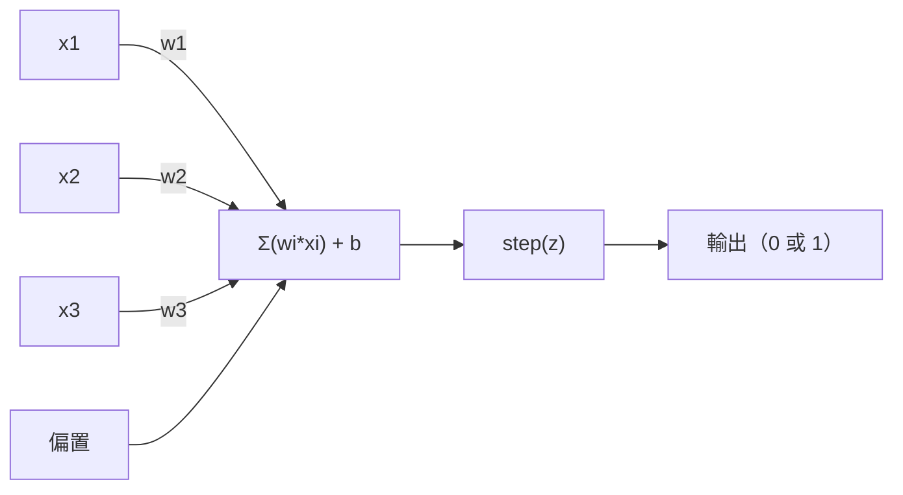
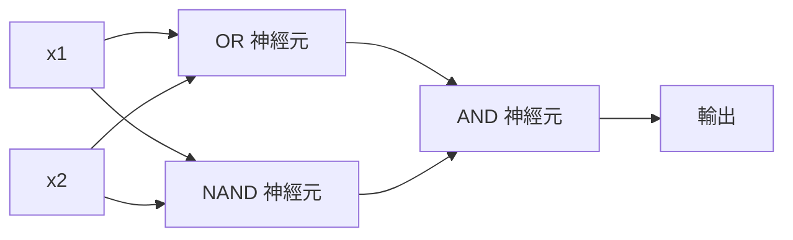

# 感知器（perceptron）

> 感知器是神經網路（neural network）的最小構成單位。拆開來看，裡面是權重（weight）、偏置（bias），以及一個判斷。

**Type:** Build
**Languages:** Python
**Prerequisites:** Phase 1 (Linear Algebra Intuition)
**Time:** ~60 minutes

## Learning Objectives｜學習目標

- 用 Python 從頭實作感知器，包含權重更新（weight update）規則，以及用作活化函數（activation function）的階躍函數（step function）
- 說明為什麼單一感知器只能解決線性可分（linearly separable）問題，並示範 XOR 失敗的情形
- 把 OR、NAND 與 AND 閘組成多層感知器（multi-layer perceptron），用來解決 XOR
- 訓練使用 sigmoid 函數與反向傳播（backpropagation）的兩層網路，讓它自動學會 XOR

## The Problem｜問題

你已經知道向量（vector）與內積（dot product），也知道矩陣（matrix）會把輸入變成輸出。可是機器要怎麼學會該用哪一種變換？

感知器回答了這件事。它是最簡單的學習機器：取幾個輸入，乘上權重，加上偏置，然後做二元判斷。接著再調整。就是這樣。至今打造出來的每一個神經網路，都是把這個想法一層層疊起來。

搞懂感知器，就是搞懂「學習」在程式裡的真正意思：調整數字，直到輸出符合現實。

## The Concept｜核心概念

### 一個神經元（neuron），一次判斷

感知器接收 n 個輸入，每個輸入乘上一個權重，全部加總，加上偏置，再把結果送進活化函數。



階躍函數很粗暴：加權總和（weighted sum）加上偏置後，只要 >= 0 就輸出 1，否則輸出 0。

```
step(z) = 1  if z >= 0
           0  if z < 0
```

這是線性分類器（linear classifier）。權重與偏置定義出一條線；維度（dimension）更高時，則是超平面（hyperplane）。這條邊界把輸入空間切成兩個區域。

### 決策邊界（decision boundary）

有兩個輸入時，感知器會在二維空間畫出一條線：

```
  x2
  ┤
  │  Class 1        /
  │    (0)          /
  │                /
  │               / w1·x1 + w2·x2 + b = 0
  │              /
  │             /     Class 2
  │            /        (1)
  ┼───────────/──────────── x1
```

線的一側全部輸出 0，另一側全部輸出 1。訓練會移動這條線，直到它正確分開各個類別（class）。

### 學習規則

感知器的學習規則很單純：

```
For each training example (x, y_true):
    y_pred = predict(x)
    error = y_true - y_pred

    For each weight:
        w_i = w_i + learning_rate * error * x_i
    bias = bias + learning_rate * error
```

預測正確時，誤差是 0，什麼都不改。若預測為 0 但應該是 1，權重就增大。若預測為 1 但應該是 0，權重就減小。學習率（learning rate）控制每一次調整的幅度。

### XOR 問題

問題出在這裡。看看這些邏輯閘（logic gate）：

```
AND gate:           OR gate:            XOR gate:
x1  x2  out         x1  x2  out         x1  x2  out
0   0   0           0   0   0           0   0   0
0   1   0           0   1   1           0   1   1
1   0   0           1   0   1           1   0   1
1   1   1           1   1   1           1   1   0
```

AND 與 OR 是線性可分的：你可以畫一條線，把 0 和 1 分開。XOR 則不行。沒有任何一條線能把 [0,1] 和 [1,0] 從 [0,0] 和 [1,1] 分出來。

```
AND (separable):        XOR (not separable):

  x2                      x2
  1 ┤  0     1            1 ┤  1     0
    │     /                 │
  0 ┤  0 / 0              0 ┤  0     1
    ┼──/──────── x1         ┼──────────── x1
       line works!          no single line works!
```

這是根本限制。單一感知器只能解決線性可分問題。Minsky 與 Papert 在 1969 年證明了這一點，神經網路研究因此幾乎中斷了十年。

解法是把感知器疊成好幾層。多層感知器可以把兩個線性判斷組合成一個非線性判斷，從而解決 XOR。

```figure
perceptron-boundary
```

## Build It｜動手實作

### 步驟 1：Perceptron 類別

```python
class Perceptron:
    def __init__(self, n_inputs, learning_rate=0.1):
        self.weights = [0.0] * n_inputs
        self.bias = 0.0
        self.lr = learning_rate

    def predict(self, inputs):
        total = sum(w * x for w, x in zip(self.weights, inputs))
        total += self.bias
        return 1 if total >= 0 else 0

    def train(self, training_data, epochs=100):
        for epoch in range(epochs):
            errors = 0
            for inputs, target in training_data:
                prediction = self.predict(inputs)
                error = target - prediction
                if error != 0:
                    errors += 1
                    for i in range(len(self.weights)):
                        self.weights[i] += self.lr * error * inputs[i]
                    self.bias += self.lr * error
            if errors == 0:
                print(f"Converged at epoch {epoch + 1}")
                return
        print(f"Did not converge after {epochs} epochs")
```

### 步驟 2：用邏輯閘（logic gate）訓練

```python
and_data = [
    ([0, 0], 0),
    ([0, 1], 0),
    ([1, 0], 0),
    ([1, 1], 1),
]

or_data = [
    ([0, 0], 0),
    ([0, 1], 1),
    ([1, 0], 1),
    ([1, 1], 1),
]

not_data = [
    ([0], 1),
    ([1], 0),
]

print("=== AND Gate ===")
p_and = Perceptron(2)
p_and.train(and_data)
for inputs, _ in and_data:
    print(f"  {inputs} -> {p_and.predict(inputs)}")

print("\n=== OR Gate ===")
p_or = Perceptron(2)
p_or.train(or_data)
for inputs, _ in or_data:
    print(f"  {inputs} -> {p_or.predict(inputs)}")

print("\n=== NOT Gate ===")
p_not = Perceptron(1)
p_not.train(not_data)
for inputs, _ in not_data:
    print(f"  {inputs} -> {p_not.predict(inputs)}")
```

### 步驟 3：看 XOR 失敗

```python
xor_data = [
    ([0, 0], 0),
    ([0, 1], 1),
    ([1, 0], 1),
    ([1, 1], 0),
]

print("\n=== XOR Gate (single perceptron) ===")
p_xor = Perceptron(2)
p_xor.train(xor_data, epochs=1000)
for inputs, expected in xor_data:
    result = p_xor.predict(inputs)
    status = "OK" if result == expected else "WRONG"
    print(f"  {inputs} -> {result} (expected {expected}) {status}")
```

它永遠不會收斂（convergence）。這次不收斂，就是單一感知器學不會 XOR 的證明。

### 步驟 4：用兩層網路解決 XOR

技巧是：XOR = (x1 OR x2) AND NOT (x1 AND x2)。把三個感知器組合起來：



```python
def xor_network(x1, x2):
    or_neuron = Perceptron(2)
    or_neuron.weights = [1.0, 1.0]
    or_neuron.bias = -0.5

    nand_neuron = Perceptron(2)
    nand_neuron.weights = [-1.0, -1.0]
    nand_neuron.bias = 1.5

    and_neuron = Perceptron(2)
    and_neuron.weights = [1.0, 1.0]
    and_neuron.bias = -1.5

    hidden1 = or_neuron.predict([x1, x2])
    hidden2 = nand_neuron.predict([x1, x2])
    output = and_neuron.predict([hidden1, hidden2])
    return output


print("\n=== XOR Gate (multi-layer network) ===")
for inputs, expected in xor_data:
    result = xor_network(inputs[0], inputs[1])
    print(f"  {inputs} -> {result} (expected {expected})")
```

四種情況全部正確。把感知器疊成層之後，會出現任何單一感知器都畫不出來的決策邊界。

### 步驟 5：訓練兩層網路

步驟 4 是手動設好權重。XOR 可以這樣做，但真正的問題裡，你事先並不知道正確的權重。解法是用 sigmoid 函數取代階躍函數，再靠反向傳播自動學習權重。

```python
class TwoLayerNetwork:
    def __init__(self, learning_rate=0.5):
        import random
        random.seed(0)
        self.w_hidden = [[random.uniform(-1, 1), random.uniform(-1, 1)] for _ in range(2)]
        self.b_hidden = [random.uniform(-1, 1), random.uniform(-1, 1)]
        self.w_output = [random.uniform(-1, 1), random.uniform(-1, 1)]
        self.b_output = random.uniform(-1, 1)
        self.lr = learning_rate

    def sigmoid(self, x):
        import math
        x = max(-500, min(500, x))
        return 1.0 / (1.0 + math.exp(-x))

    def forward(self, inputs):
        self.inputs = inputs
        self.hidden_outputs = []
        for i in range(2):
            z = sum(w * x for w, x in zip(self.w_hidden[i], inputs)) + self.b_hidden[i]
            self.hidden_outputs.append(self.sigmoid(z))
        z_out = sum(w * h for w, h in zip(self.w_output, self.hidden_outputs)) + self.b_output
        self.output = self.sigmoid(z_out)
        return self.output

    def train(self, training_data, epochs=10000):
        for epoch in range(epochs):
            total_error = 0
            for inputs, target in training_data:
                output = self.forward(inputs)
                error = target - output
                total_error += error ** 2

                d_output = error * output * (1 - output)

                saved_w_output = self.w_output[:]
                hidden_deltas = []
                for i in range(2):
                    h = self.hidden_outputs[i]
                    hd = d_output * saved_w_output[i] * h * (1 - h)
                    hidden_deltas.append(hd)

                for i in range(2):
                    self.w_output[i] += self.lr * d_output * self.hidden_outputs[i]
                self.b_output += self.lr * d_output

                for i in range(2):
                    for j in range(len(inputs)):
                        self.w_hidden[i][j] += self.lr * hidden_deltas[i] * inputs[j]
                    self.b_hidden[i] += self.lr * hidden_deltas[i]
```

```python
net = TwoLayerNetwork(learning_rate=2.0)
net.train(xor_data, epochs=10000)
for inputs, expected in xor_data:
    result = net.forward(inputs)
    predicted = 1 if result >= 0.5 else 0
    print(f"  {inputs} -> {result:.4f} (rounded: {predicted}, expected {expected})")
```

和步驟 4 有兩個關鍵差異。第一，sigmoid 函數取代了階躍函數——它是平滑的，所以梯度（gradient）存在。第二，`train` 方法把誤差從輸出往隱藏層（hidden layer）傳回去，並依照每個權重對誤差的貢獻按比例調整。這 20 行就是反向傳播。

這是通往第 03 課的橋。`d_output` 與 `hidden_deltas` 背後的數學，是把連鎖律（chain rule）套到網路圖上。我們會在那一課好好推導。

## Use It｜實際應用

你剛才從頭打造的東西，一個 import 就有了：

```python
from sklearn.linear_model import Perceptron as SkPerceptron
import numpy as np

X = np.array([[0,0],[0,1],[1,0],[1,1]])
y = np.array([0, 0, 0, 1])

clf = SkPerceptron(max_iter=100, tol=1e-3)
clf.fit(X, y)
print([clf.predict([x])[0] for x in X])
```

五行。你那 30 行的 `Perceptron` 類別做的是同一件事。sklearn 版本多了收斂檢查、多種損失函數（loss function），以及稀疏輸入的支援，但核心迴圈相同：加權總和、階躍函數、出錯時更新權重。

差距要到規模變大才顯出來。正式環境裡的網路會改這些地方：

- 階躍函數變成 sigmoid 函數、ReLU，或其他平滑的活化函數
- 權重經由反向傳播自動學習（第 03 課）
- 層數變深：3 層、10 層、100 層以上
- 原則不變：每一層都用前一層的輸出做出新的特徵（feature）

單一感知器只能畫直線。把它們疊起來，就能畫出任何形狀。

## Ship It｜交付成果

本課會產出：

- `outputs/skill-perceptron.md`：一份 skill，說明何時需要單層架構、何時需要多層架構

## Exercises｜練習

1. 用 NAND 閘訓練感知器。NAND 是通用閘，任何邏輯電路都能用它組成。確認它的權重與偏置構成有效的決策邊界。
2. 修改 Perceptron 類別，讓它在每個 epoch（訓練週期）記錄決策邊界（w1*x1 + w2*x2 + b = 0）。印出在 AND 閘上訓練時，這條線如何移動。
3. 做一個三輸入感知器，只有至少兩個輸入為 1 時才輸出 1，也就是多數決函數。它是線性可分的嗎？為什麼？

## Key Terms｜關鍵術語

| 術語 | 常見說法 | 實際意義 |
|------|----------------|----------------------|
| 感知器 | 「假的神經元」 | 一種線性分類器：輸入與權重做內積，加上偏置，再送進階躍函數 |
| 權重 | 「某個輸入有多重要」 | 把每個輸入對判斷的貢獻放大或縮小的乘數 |
| 偏置 | 「閾值」 | 一個常數，用來平移決策邊界，讓輸入全為 0 時感知器仍可能輸出 1 |
| 活化函數 | 「把數值擠一擠的那個東西」 | 加在加權總和之後的函數。感知器用階躍函數，現代網路用 sigmoid 函數或 ReLU |
| 線性可分 | 「可以在它們之間畫一條線」 | 資料集（dataset）可以用單一超平面把類別完全分開 |
| XOR 問題 | 「感知器做不到的那件事」 | 證明單層網路學不會非線性可分的函數 |
| 決策邊界 | 「分類器切換的地方」 | 把輸入空間分成兩類的超平面 w*x + b = 0 |
| 多層感知器 | 「真正的神經網路」 | 一層層疊起來的感知器，每一層的輸出就是下一層的輸入 |

## Further Reading｜延伸閱讀

- Frank Rosenblatt, "The Perceptron: A Probabilistic Model for Information Storage and Organization in the Brain" (1958)——開啟這一切的原始論文
- Minsky & Papert, "Perceptrons" (1969)——這本書證明單層網路無法解決 XOR，並使感知器研究中斷了十年
- Michael Nielsen, "Neural Networks and Deep Learning", Chapter 1 (http://neuralnetworksanddeeplearning.com/)——免費的線上資源，把感知器如何組成網路講得最清楚的視覺說明
