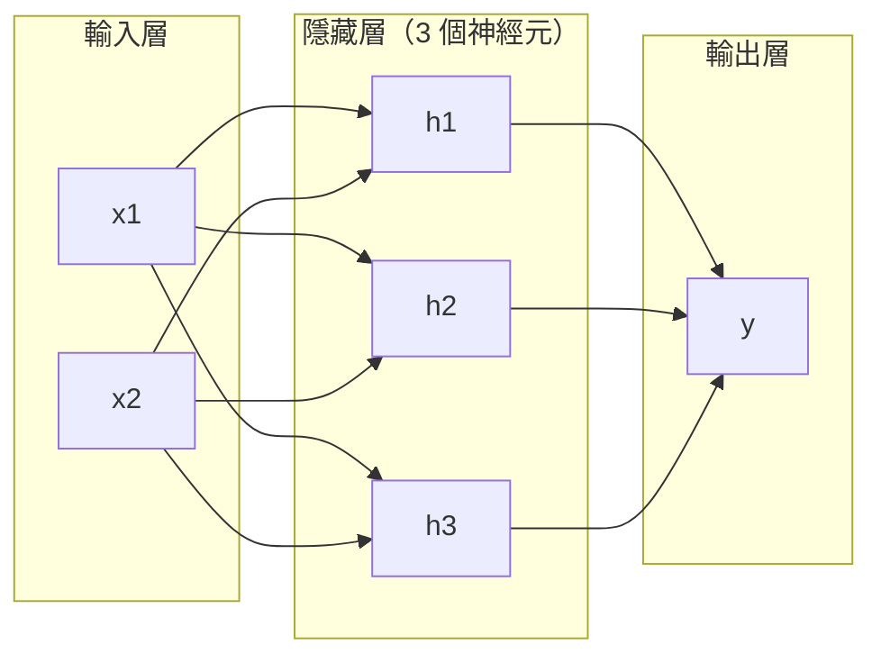
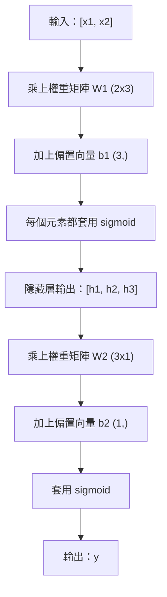

# 多層網路（multi-layer network）與前向傳遞（forward pass）

> 一個神經元（neuron）畫出一條線。把它們疊起來，就能畫出任何東西。

**Type:** Build
**Languages:** Python
**Prerequisites:** Phase 01 (Math Foundations), Lesson 03.01 (The Perceptron)
**Time:** ~90 minutes

## Learning Objectives｜學習目標

- 用 Layer 與 Network 類別從頭打造多層網路，並完成一次完整的前向傳遞
- 沿著網路每一層追蹤矩陣（matrix）的維度（dimension），並找出形狀不符的地方
- 說明把非線性的活化函數（activation function）疊起來之後，網路為什麼能學到彎曲的決策邊界（decision boundary）
- 用手動調好的 sigmoid 權重，以 2-2-1 架構解決 XOR

## The Problem｜問題

單一神經元只會畫線。就是這樣。資料裡的一條直線。人工智慧裡每一個真正的問題，影像辨識、語言理解、下圍棋，都需要曲線。把神經元疊成層，曲線才出現。

1969 年，Minsky 與 Papert 證明這個限制是致命的：單層網路學不會 XOR。不是「學得很吃力」，而是數學上根本做不到。XOR 的真值表把 [0,1] 和 [1,0] 放在一側，把 [0,0] 和 [1,1] 放在另一側。沒有任何一條線能把它們分開。

這讓神經網路（neural network）的研究經費斷了十多年。解法事後看來很明顯：不要只用一層。把神經元疊成層。讓第一層把輸入空間切成新的特徵（feature），再讓第二層把這些特徵組合成任何一條線都做不出的判斷。

這個堆疊就是多層網路。它是今天正式環境裡每一個深度學習（deep learning）模型的基礎。前向傳遞，也就是資料從輸入經過隱藏層（hidden layer）流到輸出，是其他東西能動之前，你得先做出來的第一件事。

## The Concept｜核心概念

### 三種層：輸入、隱藏、輸出

多層網路有三種層：

**輸入層（input layer）**——其實不算一層。它存放原始資料。兩個特徵就是兩個輸入節點。這裡不做任何計算。

**隱藏層**——計算發生的地方。每個神經元取前一層的每一個輸出，乘上權重（weight）、加上偏置（bias），再把結果送進活化函數。「隱藏」的意思是，訓練資料（training data）裡不會直接看到這些值。

**輸出層（output layer）**——最後的答案。二元分類（binary classification）用一個帶 sigmoid 函數的神經元。多類別分類（multi-class classification）則每個類別（class）一個神經元。



這是 2-3-1 網路。兩個輸入、三個隱藏神經元、一個輸出。每條連線帶一個權重。除了輸入以外，每個神經元都帶一個偏置。

每一層都會產出一組叫做隱藏狀態（hidden state）的數字向量。處理文字時，隱藏狀態會提高維度，把一個詞編成 768 個數字，用來抓住語意。處理影像時，隱藏狀態會降低維度，把幾百萬個像素壓成還能處理的表示。學習就發生在隱藏狀態裡。

### 神經元與活化函數

每個神經元做三件事：

1. 把每個輸入乘上對應的權重
2. 把所有乘積加總，再加上偏置
3. 把這個和送進活化函數

目前的活化函數是 sigmoid：

```
sigmoid(z) = 1 / (1 + e^(-z))
```

sigmoid 函數把任何數字壓進 (0, 1)。很大的正數會靠向 1，很大的負數會靠向 0，0 對應到 0.5。這條平滑曲線讓學習成為可能。感知器（perceptron）的階躍函數（step function）是硬切的，sigmoid 函數則處處都有梯度（gradient）。

### 前向傳遞：資料怎麼流動

前向傳遞把輸入一層層推進網路，直到輸出。前向傳遞的過程中不會學習。它只是計算：相乘、相加、活化，然後重複。



每一層都依序做三個運算：

```
z = W * input + b       (linear transformation)
a = sigmoid(z)           (activation)
```

一層的輸出就是下一層的輸入。整個前向傳遞就是這樣。

### 矩陣維度

追蹤維度是深度學習裡最重要的除錯本事。下面是 2-3-1 網路：

| 步驟 | 運算 | 維度 | 結果形狀 |
|------|-----------|------------|-------------|
| 輸入 | x | -- | (2,) |
| 隱藏層線性運算 | W1 * x + b1 | W1: (3, 2), b1: (3,) | (3,) |
| 隱藏層活化 | sigmoid(z1) | -- | (3,) |
| 輸出層線性運算 | W2 * h + b2 | W2: (1, 3), b2: (1,) | (1,) |
| 輸出層活化 | sigmoid(z2) | -- | (1,) |

規則是：第 k 層的權重矩陣（weight matrix）W，形狀是（這一層的神經元數，前一層的神經元數）。列數對應當前層，欄數對應前一層。形狀對不上，就是有 bug。

### 通用近似定理（universal approximation）

1989 年，George Cybenko 證明了一件驚人的事：神經網路只要有一個隱藏層，而且神經元夠多，就能以任何想要的精度近似任何連續函數。

這不是說一個隱藏層永遠最好。這是說這種架構在理論上做得到。實務上，更深的網路，也就是層數更多、每層神經元更少，可以用比淺而寬的網路少得多的參數（parameter）總數，學到同樣的函數。深度學習之所以有效，原因就在這裡。

直覺是這樣：隱藏層裡的每個神經元學到一個「凸起」，或是一個特徵。凸起夠多、位置又對，就能近似任何平滑曲線。神經元越多，凸起越多，近似越好。


### 可組合性

神經網路可以組合。你可以把它們疊起來、串起來，或平行執行。Whisper 用一個編碼器（encoder）網路處理音訊，再用另一個解碼器（decoder）網路產生文字。現代的 LLM 只有解碼器。BERT 只有編碼器。T5 是編碼器－解碼器。架構的選擇決定模型能做什麼。

```figure
mlp-forward
```

## Build It｜動手實作

純 Python，不用 numpy。每一個矩陣運算都從頭寫。

### 步驟 1：sigmoid 活化函數

```python
import math

def sigmoid(x):
    x = max(-500.0, min(500.0, x))
    return 1.0 / (1.0 + math.exp(-x))
```

把數值夾在 [-500, 500]，是為了避免溢位。`math.exp(500)` 很大，但還是有限數。`math.exp(1000)` 則是無限大。

### 步驟 2：Layer 類別

深度學習裡最重要的運算是矩陣乘法（matrix multiplication）。每一層、每一個注意力（attention）頭、每一次前向傳遞，一路下去都是矩陣乘法。線性層取一個輸入向量，乘上權重矩陣，再加上偏置向量（bias vector）：y = Wx + b。這一個式子就佔了神經網路計算量的 90%。

一層裡放著一個權重矩陣和一個偏置向量。它的 forward 方法接收輸入向量，回傳活化後的輸出。

```python
class Layer:
    def __init__(self, n_inputs, n_neurons, weights=None, biases=None):
        if weights is not None:
            self.weights = weights
        else:
            import random
            self.weights = [
                [random.uniform(-1, 1) for _ in range(n_inputs)]
                for _ in range(n_neurons)
            ]
        if biases is not None:
            self.biases = biases
        else:
            self.biases = [0.0] * n_neurons

    def forward(self, inputs):
        self.last_input = inputs
        self.last_output = []
        for neuron_idx in range(len(self.weights)):
            z = sum(
                w * x for w, x in zip(self.weights[neuron_idx], inputs)
            )
            z += self.biases[neuron_idx]
            self.last_output.append(sigmoid(z))
        return self.last_output
```

權重矩陣的形狀是 (n_neurons, n_inputs)。每一列是一個神經元對所有輸入的權重。forward 方法逐一走過神經元，算出加權總和（weighted sum）再加上偏置，套用 sigmoid 函數，再把結果收集起來。

### 步驟 3：Network 類別

網路就是一串層。前向傳遞把它們串起來：第 k 層的輸出送進第 k+1 層。

```python
class Network:
    def __init__(self, layers):
        self.layers = layers

    def forward(self, inputs):
        current = inputs
        for layer in self.layers:
            current = layer.forward(current)
        return current
```

整個前向傳遞就是這樣。四行邏輯。資料進去，流過每一層，再從另一頭出來。

### 步驟 4：用手動調好的權重解決 XOR

第 01 課裡，我們把 OR、NAND 與 AND 感知器組合起來解決 XOR。現在用 Layer 和 Network 類別做同一件事。2-2-1 架構是兩個輸入、兩個隱藏神經元、一個輸出。

```python
hidden = Layer(
    n_inputs=2,
    n_neurons=2,
    weights=[[20.0, 20.0], [-20.0, -20.0]],
    biases=[-10.0, 30.0],
)

output = Layer(
    n_inputs=2,
    n_neurons=1,
    weights=[[20.0, 20.0]],
    biases=[-30.0],
)

xor_net = Network([hidden, output])

xor_data = [
    ([0, 0], 0),
    ([0, 1], 1),
    ([1, 0], 1),
    ([1, 1], 0),
]

for inputs, expected in xor_data:
    result = xor_net.forward(inputs)
    predicted = 1 if result[0] >= 0.5 else 0
    print(f"  {inputs} -> {result[0]:.6f} (rounded: {predicted}, expected: {expected})")
```

很大的權重（20、-20）讓 sigmoid 函數表現得像階躍函數。第一個隱藏神經元近似 OR，第二個近似 NAND。輸出神經元把它們組合成 AND，而那就是 XOR。

### 步驟 5：圓形分類

更難的問題：判斷平面上的點在圓內還是圓外。圓的半徑是 0.5，圓心在原點。這需要彎曲的決策邊界，單一感知器做不到。

```python
import random
import math

random.seed(42)

data = []
for _ in range(200):
    x = random.uniform(-1, 1)
    y = random.uniform(-1, 1)
    label = 1 if (x * x + y * y) < 0.25 else 0
    data.append(([x, y], label))

circle_net = Network([
    Layer(n_inputs=2, n_neurons=8),
    Layer(n_inputs=8, n_neurons=1),
])
```

權重若是隨機的，網路分類不會好。但前向傳遞仍然跑得起來。重點就在這裡：前向傳遞只是計算。要學到正確的權重，得靠反向傳播（backpropagation），那是第 03 課的事。

```python
correct = 0
for inputs, expected in data:
    result = circle_net.forward(inputs)
    predicted = 1 if result[0] >= 0.5 else 0
    if predicted == expected:
        correct += 1

print(f"Accuracy with random weights: {correct}/{len(data)} ({100*correct/len(data):.1f}%)")
```

隨機權重的準確率很差，常常比猜多數類（majority class）還糟。訓練之後（第 03 課），同樣這個有 8 個隱藏神經元的架構會畫出彎曲的邊界，把圓內和圓外分開。

## Use It｜實際應用

PyTorch 用四行就做完上面的事：

```python
import torch
import torch.nn as nn

model = nn.Sequential(
    nn.Linear(2, 8),
    nn.Sigmoid(),
    nn.Linear(8, 1),
    nn.Sigmoid(),
)

x = torch.tensor([[0.0, 0.0], [0.0, 1.0], [1.0, 0.0], [1.0, 1.0]])
output = model(x)
print(output)
```

`nn.Linear(2, 8)` 就是你的 Layer 類別：權重矩陣形狀是 (8, 2)，偏置向量形狀是 (8,)。`nn.Sigmoid()` 就是逐元素套用的 sigmoid 函數。`nn.Sequential` 就是你的 Network 類別：依序把層串起來。

差別在速度和規模。PyTorch 跑在 GPU 上，能處理幾百萬筆樣本的批次（batch），也會為反向傳播自動算出梯度。但前向傳遞的邏輯，和你剛剛從頭打造的完全相同。

## Ship It｜交付成果

本課會產出一份用來設計網路架構的 prompt，可以重複使用：

- `outputs/prompt-network-architect.md`

當你要決定一個問題該用幾層、每層幾個神經元、以及用哪種活化函數時，就用它。

## Exercises｜練習

1. 做一個 2-4-2-1 網路（兩個隱藏層），用隨機權重對 XOR 資料跑前向傳遞。印出中間隱藏層的輸出，看表示在每一層怎麼變。
2. 把圓形分類器的隱藏層大小從 8 改成 2，再改成 32。每次都用隨機權重跑前向傳遞。隱藏神經元的數量會改變輸出的範圍或分布嗎？為什麼？
3. 在 Network 類別上實作 `count_parameters` 方法，回傳可訓練的權重與偏置總數。用 784-256-128-10 網路（經典的 MNIST 架構）測試。它有多少參數？
4. 為 3-4-4-2 網路做前向傳遞。餵入正規化到 0-1 的 RGB 顏色值，觀察兩個輸出。這是一個簡單的兩類顏色分類器架構。
5. 用「leaky step」函數取代 sigmoid：z < 0 時回傳 0.01 * z，否則回傳 1.0。用步驟 4 同一組手動調好的權重，對 XOR 跑前向傳遞。它還能運作嗎？為什麼平滑的 sigmoid 函數比硬切斷更好？

## Key Terms｜關鍵術語

| 術語 | 常見說法 | 實際意義 |
|------|----------------|----------------------|
| 前向傳遞 | 「跑模型」 | 把輸入送過每一層：乘上權重、加上偏置、再活化，最後得到輸出 |
| 隱藏層 | 「中間那段」 | 介於輸入與輸出之間的任何一層，其數值不會直接出現在資料裡 |
| 多層網路 | 「一個深度神經網路」 | 依序疊起的神經元層，每一層的輸出就是下一層的輸入 |
| 活化函數 | 「那個非線性」 | 加在線性變換（linear transformation）之後的函數，讓決策邊界出現曲線 |
| Sigmoid | 「那條 S 形曲線」 | sigma(z) = 1/(1+e^(-z))，把任何實數壓進 (0, 1)，處處平滑且可微分 |
| 權重矩陣 | 「那些參數」 | 形狀為（當前層神經元數，前一層神經元數）的矩陣 W，裡面是可學習的連線強度 |
| 偏置向量 | 「那個偏移」 | 矩陣乘法之後加上的向量，讓輸入全為 0 時神經元仍可能活化 |
| 通用近似 | 「神經網路什麼都能學」 | 單一隱藏層只要神經元夠多，就能近似任何連續函數；而「夠多」可以是幾十億個 |
| 線性變換 | 「矩陣乘法那一步」 | z = W * x + b，活化之前的計算，把輸入映射到一個新的空間 |
| 決策邊界 | 「分類器切換的地方」 | 輸入空間裡，網路輸出跨過分類閾值（threshold）的那個曲面 |

## Further Reading｜延伸閱讀

- Michael Nielsen, "Neural Networks and Deep Learning", Chapter 1-2 (http://neuralnetworksanddeeplearning.com/)——關於前向傳遞和網路結構最清楚的免費說明，附有互動視覺化
- Cybenko, "Approximation by Superpositions of a Sigmoidal Function" (1989)——通用近似定理的原始論文，出乎意料地好讀
- 3Blue1Brown, "But what is a neural network?" (https://www.youtube.com/watch?v=aircAruvnKk)——20 分鐘的視覺導覽，帶你看層、權重和前向傳遞，建立正確的心智模型
- Goodfellow, Bengio, Courville, "Deep Learning", Chapter 6 (https://www.deeplearningbook.org/)——多層網路的標準參考書，可免費線上閱讀
