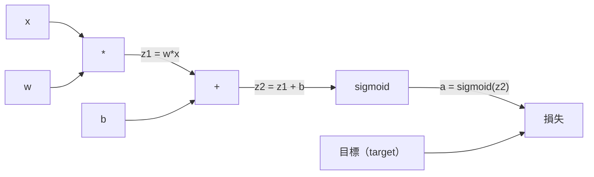
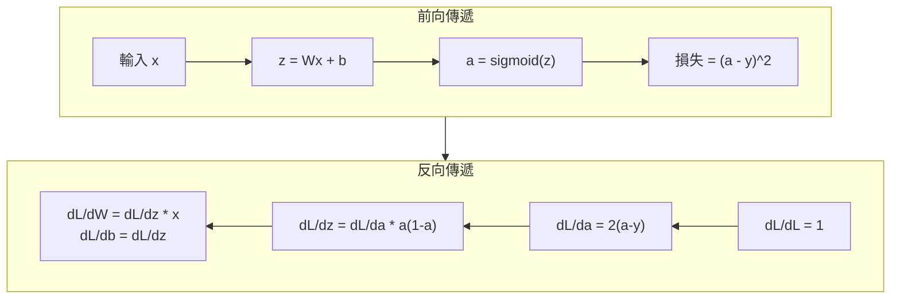

# 反向傳播（backpropagation）

> 反向傳播是讓學習成為可能的演算法（algorithm）。沒有它，神經網路（neural network）只是昂貴的亂數產生器。

**Type:** Build
**Languages:** Python
**Prerequisites:** Lesson 03.02 (Multi-Layer Networks)
**Time:** ~120 minutes

## Learning Objectives｜學習目標

- 實作以 Value 為基礎的自動微分（autograd）引擎：它建立計算圖（computational graph），並用拓撲排序（topological sort）計算梯度（gradient）
- 用連鎖律（chain rule）推導加法、乘法與 sigmoid 函數的反向傳遞（backward pass）
- 只用你從頭打造的反向傳播引擎，在 XOR 與圓形分類上訓練多層網路（multi-layer network）
- 辨認深層 sigmoid 網路裡的梯度消失（vanishing gradient），並說明梯度為什麼會指數縮小

## The Problem｜問題

你的網路有一個隱藏層（hidden layer），768 個輸入、3072 個輸出。那是 2,359,296 個權重（weight）。它預測錯了。是哪些權重造成誤差？逐一測試每個權重，表示要做 230 萬次前向傳遞（forward pass）。反向傳播在一次反向傳遞裡就算完這 230 萬個梯度。這不是一種最佳化（optimization）。這是「訓得動」和「根本不可能」的差別。

單純的作法是：拿一個權重，挪動一點點，再跑一次前向傳遞，看損失函數（loss function）是上升還是下降。這樣你得到那個權重的梯度。接著對網路裡的每個權重都做一次。再乘上幾千步訓練、幾百萬筆資料（data）。要訓練出有用的東西，得花上難以想像的漫長時間。

反向傳播解決了這件事。一次前向傳遞、一次反向傳遞，所有梯度都算出來。技巧是把微積分的連鎖律，有系統地套到計算圖上。這個演算法讓深度學習（deep learning）變得實際可行。沒有它，我們到現在還卡在玩具問題上。

## The Concept｜核心概念

### 把連鎖律套到網路上

你在階段 01 第 05 課看過連鎖律。很快複習：若 y = f(g(x))，則 dy/dx = f'(g(x)) * g'(x)。你把鏈上的導數（derivative）相乘。

在神經網路裡，這條「鏈」是從輸入到損失的一連串運算。每一層套上權重、加上偏置（bias）、再送進活化函數（activation function）。損失函數拿最終輸出和目標比較。反向傳播沿著這條鏈往回走，計算每個運算對誤差的貢獻。

### 計算圖

每次前向傳遞都建立一張圖。每個節點是一個運算，例如相乘、相加、sigmoid。每條邊往前帶一個值，往後帶一個梯度。



前向傳遞：值從左流到右。x 和 w 產生 z1 = w*x。加上 b 得到 z2。sigmoid 函數給出活化值 a。再用損失函數把 a 和目標 y 比較。

反向傳遞：梯度從右流到左。從 dL/da 開始，也就是損失如何隨活化值改變。乘上 da/dz2，也就是 sigmoid 函數的導數，得到 dL/dz2。再拆成 dL/db（因為 z2 = z1 + b，所以它等於 dL/dz2）和 dL/dz1。然後 dL/dw = dL/dz1 * x，dL/dx = dL/dz1 * w。

反向傳遞時，圖上每個節點只做一件事：接住從上方來的梯度，乘上自己的局部導數，再往下傳。

### 前向與反向



前向傳遞存下每一個中間值：z、a，以及每一層的輸入。反向傳遞要用這些存下來的值才能算梯度。這就是反向傳播核心的記憶體（memory）與計算量取捨。你拿記憶體（memory）換速度：存下活化值，換一次傳遞，而不是幾百萬次。

### 梯度在網路裡怎麼流

三層網路裡，梯度會一層層串下去：


每一層，梯度都會乘上 sigmoid 函數的導數。sigmoid 導數是 a * (1 - a)，最大值是 0.25（當 a = 0.5）。三層下來，梯度最多被乘上 0.25^3 = 0.0156。十層下來：0.25^10 = 0.000001。

### 梯度消失

這就是梯度消失。sigmoid 函數把輸出壓進 0 和 1 之間，導數永遠小於 0.25。sigmoid 層疊得夠多，梯度就縮成沒有。前面的層幾乎學不到東西，因為它們收到的梯度接近零。

```
sigmoid(z):     Output range [0, 1]
sigmoid'(z):    Max value 0.25 (at z = 0)

After 5 layers:   gradient * 0.25^5 = 0.001x original
After 10 layers:  gradient * 0.25^10 = 0.000001x original
```

所以深層 sigmoid 網路幾乎訓不動。解法是 ReLU 和它的變體，那是第 04 課的主題。現在先理解：反向傳播本身運作得很好。問題在於它穿過的是什麼。

### 推導兩層網路的梯度

具體算一個網路：輸入 x，隱藏層用 sigmoid 函數，輸出層（output layer）也用 sigmoid 函數，損失是均方誤差（MSE）。

前向傳遞：

```
z1 = W1 * x + b1
a1 = sigmoid(z1)
z2 = W2 * a1 + b2
a2 = sigmoid(z2)
L = (a2 - y)^2
```

反向傳遞（逐步套用連鎖律）：

```
dL/da2 = 2(a2 - y)
da2/dz2 = a2 * (1 - a2)
dL/dz2 = dL/da2 * da2/dz2 = 2(a2 - y) * a2 * (1 - a2)

dL/dW2 = dL/dz2 * a1
dL/db2 = dL/dz2

dL/da1 = dL/dz2 * W2
da1/dz1 = a1 * (1 - a1)
dL/dz1 = dL/da1 * da1/dz1

dL/dW1 = dL/dz1 * x
dL/db1 = dL/dz1
```

每個梯度都是從損失往回追的局部導數乘積。反向傳播就是這些。

```figure
backprop-vanishing
```

## Build It｜動手實作

### 步驟 1：Value 節點

計算裡的每個數字都變成一個 Value。它存自己的資料、自己的梯度，以及它是怎麼來的，這樣才知道怎麼把梯度往回算。

```python
class Value:
    def __init__(self, data, children=(), op=''):
        self.data = data
        self.grad = 0.0
        self._backward = lambda: None
        self._children = set(children)
        self._op = op

    def __repr__(self):
        return f"Value(data={self.data:.4f}, grad={self.grad:.4f})"
```

梯度還沒有，所以是 0.0。反向函數也還沒有，所以是空操作。`_children` 記錄哪些 Value 產生了這一個，之後才能對圖做拓撲排序。

### 步驟 2：帶反向函數的運算

每個運算都產生一個新的 Value，並定義梯度怎麼從它往回流。

```python
def __add__(self, other):
    other = other if isinstance(other, Value) else Value(other)
    out = Value(self.data + other.data, (self, other), '+')

    def _backward():
        self.grad += out.grad
        other.grad += out.grad

    out._backward = _backward
    return out

def __mul__(self, other):
    other = other if isinstance(other, Value) else Value(other)
    out = Value(self.data * other.data, (self, other), '*')

    def _backward():
        self.grad += other.data * out.grad
        other.grad += self.data * out.grad

    out._backward = _backward
    return out
```

加法：d(a+b)/da = 1，d(a+b)/db = 1。所以兩個輸入都直接拿到輸出的梯度。

乘法：d(a*b)/da = b，d(a*b)/db = a。每個輸入拿到另一個的值，再乘上輸出梯度。

`+=` 很關鍵。一個 Value 可能被好幾個運算用到。它的梯度是所有路徑上傳回來的梯度之和。

### 步驟 3：sigmoid 與損失

```python
import math

def sigmoid(self):
    x = self.data
    x = max(-500, min(500, x))
    s = 1.0 / (1.0 + math.exp(-x))
    out = Value(s, (self,), 'sigmoid')

    def _backward():
        self.grad += (s * (1 - s)) * out.grad

    out._backward = _backward
    return out
```

sigmoid 導數是 sigmoid(x) * (1 - sigmoid(x))。前向傳遞時已經算出 sigmoid(x) = s。直接重用，不必再算一次。

```python
def mse_loss(predicted, target):
    diff = predicted + Value(-target)
    return diff * diff
```

單一輸出的 MSE 是 (predicted - target)^2。我們把減法寫成加上一個取負的 Value。

### 步驟 4：反向傳遞

拓撲排序保證節點依照正確順序處理：一個節點的梯度要先全部累加完，才往下傳。

```python
def backward(self):
    topo = []
    visited = set()

    def build_topo(v):
        if v not in visited:
            visited.add(v)
            for child in v._children:
                build_topo(child)
            topo.append(v)

    build_topo(self)
    self.grad = 1.0
    for v in reversed(topo):
        v._backward()
```

從損失開始，梯度是 1.0，因為 dL/dL = 1。再沿著排好的圖往回走。每個節點的 `_backward` 把梯度推給它的子節點。

### 步驟 5：Layer 與 Network

```python
import random

class Neuron:
    def __init__(self, n_inputs):
        scale = (2.0 / n_inputs) ** 0.5
        self.weights = [Value(random.uniform(-scale, scale)) for _ in range(n_inputs)]
        self.bias = Value(0.0)

    def __call__(self, x):
        act = sum((wi * xi for wi, xi in zip(self.weights, x)), self.bias)
        return act.sigmoid()

    def parameters(self):
        return self.weights + [self.bias]


class Layer:
    def __init__(self, n_inputs, n_outputs):
        self.neurons = [Neuron(n_inputs) for _ in range(n_outputs)]

    def __call__(self, x):
        out = [n(x) for n in self.neurons]
        return out[0] if len(out) == 1 else out

    def parameters(self):
        params = []
        for n in self.neurons:
            params.extend(n.parameters())
        return params


class Network:
    def __init__(self, sizes):
        self.layers = []
        for i in range(len(sizes) - 1):
            self.layers.append(Layer(sizes[i], sizes[i + 1]))

    def __call__(self, x):
        for layer in self.layers:
            x = layer(x)
            if not isinstance(x, list):
                x = [x]
        return x[0] if len(x) == 1 else x

    def parameters(self):
        params = []
        for layer in self.layers:
            params.extend(layer.parameters())
        return params

    def zero_grad(self):
        for p in self.parameters():
            p.grad = 0.0
```

一個 Neuron 接收輸入，計算加權總和（weighted sum）加偏置，再套用 sigmoid 函數。權重初始化乘上 sqrt(2/n_inputs)，避免較深的網路裡 sigmoid 飽和。Layer 是一串 Neuron。Network 是一串 Layer。`parameters()` 收集所有可學習的 Value，以便更新。

### 步驟 6：在 XOR 上訓練

```python
random.seed(42)
net = Network([2, 4, 1])

xor_data = [
    ([0.0, 0.0], 0.0),
    ([0.0, 1.0], 1.0),
    ([1.0, 0.0], 1.0),
    ([1.0, 1.0], 0.0),
]

learning_rate = 1.0

for epoch in range(1000):
    total_loss = Value(0.0)
    for inputs, target in xor_data:
        x = [Value(i) for i in inputs]
        pred = net(x)
        loss = mse_loss(pred, target)
        total_loss = total_loss + loss

    net.zero_grad()
    total_loss.backward()

    for p in net.parameters():
        p.data -= learning_rate * p.grad

    if epoch % 100 == 0:
        print(f"Epoch {epoch:4d} | Loss: {total_loss.data:.6f}")

print("\nXOR Results:")
for inputs, target in xor_data:
    x = [Value(i) for i in inputs]
    pred = net(x)
    print(f"  {inputs} -> {pred.data:.4f} (expected {target})")
```

看損失下降。從隨機預測到正確的 XOR 輸出，全程都是反向傳播在算梯度，再把權重往對的方向推。

### 步驟 7：圓形分類

第 02 課裡，圓形分類的權重是你手動設的。現在讓網路自己學。

```python
random.seed(7)

def generate_circle_data(n=100):
    data = []
    for _ in range(n):
        x1 = random.uniform(-1.5, 1.5)
        x2 = random.uniform(-1.5, 1.5)
        label = 1.0 if x1 * x1 + x2 * x2 < 1.0 else 0.0
        data.append(([x1, x2], label))
    return data

circle_data = generate_circle_data(80)

circle_net = Network([2, 8, 1])
learning_rate = 0.5

for epoch in range(2000):
    random.shuffle(circle_data)
    total_loss_val = 0.0
    for inputs, target in circle_data:
        x = [Value(i) for i in inputs]
        pred = circle_net(x)
        loss = mse_loss(pred, target)
        circle_net.zero_grad()
        loss.backward()
        for p in circle_net.parameters():
            p.data -= learning_rate * p.grad
        total_loss_val += loss.data

    if epoch % 200 == 0:
        correct = 0
        for inputs, target in circle_data:
            x = [Value(i) for i in inputs]
            pred = circle_net(x)
            predicted_class = 1.0 if pred.data > 0.5 else 0.0
            if predicted_class == target:
                correct += 1
        accuracy = correct / len(circle_data) * 100
        print(f"Epoch {epoch:4d} | Loss: {total_loss_val:.4f} | Accuracy: {accuracy:.1f}%")
```

這裡用的是線上 SGD（online SGD）：每看一個樣本（sample）就更新權重，而不是先把整個批次（batch）累加起來。這樣比較快打破對稱，也避免在完整批次的損失地景（loss landscape）上讓 sigmoid 飽和。每個 epoch（訓練週期）把資料洗牌，網路就不會把順序背下來。

不必再手動設權重。網路自己找出圓形的決策邊界（decision boundary）。這就是反向傳播的力量：你定義架構、損失函數和資料。演算法自己算出權重。

## Use It｜實際應用

PyTorch 用幾行就做完上面的事。核心想法相同：自動微分在前向傳遞時建立計算圖，再往回追蹤來計算梯度。

```python
import torch
import torch.nn as nn

model = nn.Sequential(
    nn.Linear(2, 4),
    nn.Sigmoid(),
    nn.Linear(4, 1),
    nn.Sigmoid(),
)
optimizer = torch.optim.SGD(model.parameters(), lr=1.0)
criterion = nn.MSELoss()

X = torch.tensor([[0,0],[0,1],[1,0],[1,1]], dtype=torch.float32)
y = torch.tensor([[0],[1],[1],[0]], dtype=torch.float32)

for epoch in range(1000):
    pred = model(X)
    loss = criterion(pred, y)
    optimizer.zero_grad()
    loss.backward()
    optimizer.step()

print("PyTorch XOR Results:")
with torch.no_grad():
    for i in range(4):
        pred = model(X[i])
        print(f"  {X[i].tolist()} -> {pred.item():.4f} (expected {y[i].item()})")
```

`loss.backward()` 就是你的 `total_loss.backward()`。`optimizer.step()` 就是你手動寫的 `p.data -= lr * p.grad`。`optimizer.zero_grad()` 就是你的 `net.zero_grad()`。同一個演算法，工業級的實作。PyTorch 處理 GPU 加速、混合精度（mixed precision）、梯度檢查點（gradient checkpointing），以及好幾百種層。但反向傳遞仍是同一條連鎖律，套在同一種計算圖上。

訓練是跑前向傳遞，再跑反向傳遞，然後更新權重。推論（inference）只跑前向傳遞。沒有梯度，也不更新。這個區別很重要，因為正式環境裡發生的是推論。你呼叫 Claude 或 GPT 這類 API 時，跑的是推論：你的 prompt 往前流過網路，另一頭出來的是 token。權重不變。理解反向傳播之所以重要，是因為那個網路裡的每個權重，都是它塑造的。

## Ship It｜交付成果

本課會產出：

- `outputs/prompt-gradient-debugger.md`：一份可重複使用的 prompt，用來診斷任何神經網路的梯度問題，包括梯度消失、梯度爆炸（exploding gradient）和 NaN

## Exercises｜練習

1. 為 Value 類別加上 `__sub__` 方法（a - b = a + (-1 * b)）。再實作 `__neg__` 方法。用 (a - b)^2 這種簡單算式，和手算結果比對，確認梯度正確。
2. 為 Value 加上 `relu` 方法：輸出 max(0, x)，導數在 x > 0 時是 1，否則是 0。把隱藏層的 sigmoid 換成 ReLU，再訓練 XOR。比較收斂（convergence）速度。你應該會看到訓練變快。這是第 04 課的預告。
3. 在 Value 上實作整數次方的 `__pow__` 方法。用它把 `mse_loss` 改成真正的 `(predicted - target) ** 2`。確認梯度和原本的實作一致。
4. 在訓練迴圈裡加上梯度裁剪（gradient clipping）：呼叫 `backward()` 之後，把所有梯度夾到 [-1, 1]。訓練一個更深的網路（4 層以上，使用 sigmoid），比較有裁剪和沒有裁剪的損失曲線。這是你對付梯度爆炸的第一道防線。
5. 做一個觀察：XOR 訓練完之後，印出網路裡每個參數（parameter）的梯度。找出哪一層的梯度最小。這就是核心概念那一節講的梯度消失。

## Key Terms｜關鍵術語

| 術語 | 常見說法 | 實際意義 |
|------|----------------|----------------------|
| 反向傳播 | 「網路在學習」 | 一個演算法：沿著計算圖往回套用連鎖律，算出每個權重的 dL/dw |
| 計算圖 | 「網路的結構」 | 一張有向無環圖。節點是運算，邊在前向帶值、在反向帶梯度 |
| 連鎖律 | 「把導數乘起來」 | 若 y = f(g(x))，則 dy/dx = f'(g(x)) * g'(x)。這是反向傳播的數學基礎 |
| 梯度 | 「最陡上升的方向」 | 損失對某個參數的偏導數（partial derivative）。它告訴你該怎麼改這個參數，損失才會下降 |
| 梯度消失 | 「深層網路學不會」 | 梯度穿過會飽和的活化函數（例如 sigmoid）時，會一層層指數縮小 |
| 前向傳遞 | 「跑網路」 | 依序套用每一層的運算，從輸入算出輸出，並存下中間值 |
| 反向傳遞 | 「計算梯度」 | 反向走訪計算圖，在每個節點用連鎖律累加梯度 |
| 學習率（learning rate） | 「它學多快」 | 更新權重時控制步伐的純量（scalar）：w_new = w_old - lr * gradient |
| 拓撲排序 | 「正確的順序」 | 圖節點的一種排序：每個節點都排在它依賴的節點之後，梯度才會在往下傳之前累加完成 |
| 自動微分 | 「自動算導數」 | 前向計算時建立計算圖，並自動算出梯度的系統。PyTorch 的引擎就是這樣做的 |

## Further Reading｜延伸閱讀

- Rumelhart, Hinton & Williams, "Learning representations by back-propagating errors" (1986)——讓反向傳播成為主流、並打開多層網路訓練的那篇論文
- 3Blue1Brown, "Neural Networks" series (https://www.youtube.com/playlist?list=PLZHQObOWTQDNU6R1_67000Dx_ZCJB-3pi)——把反向傳播，以及梯度如何流過網路，講得最好的視覺說明
