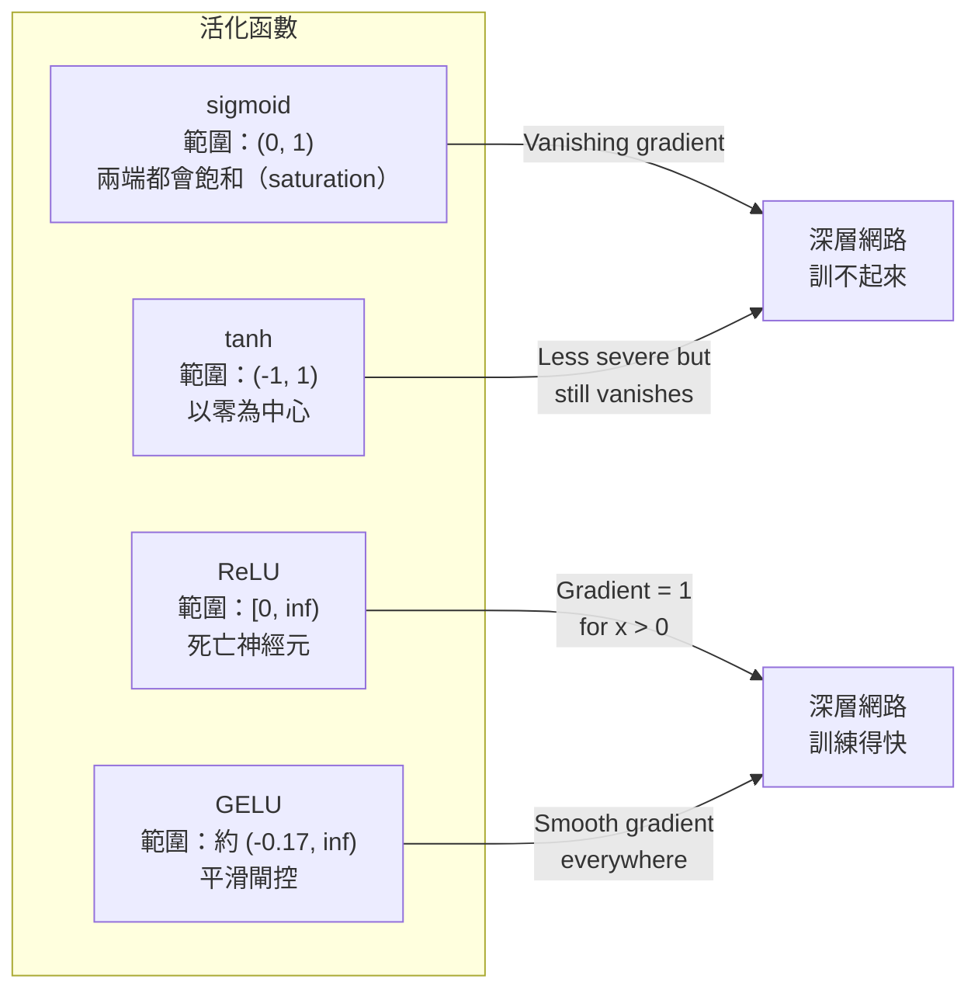
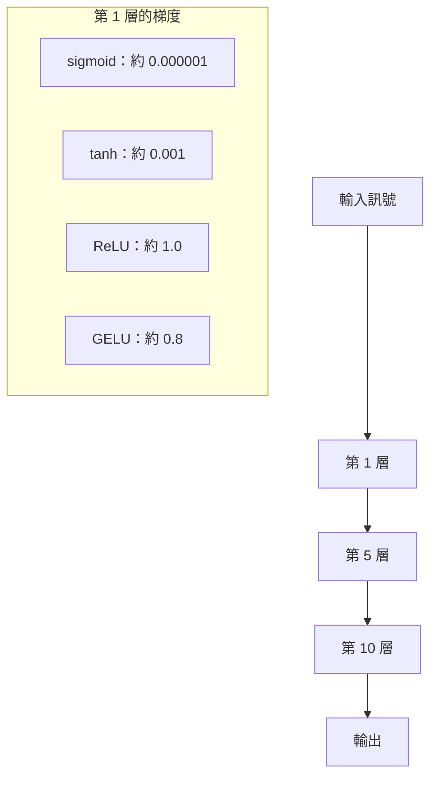
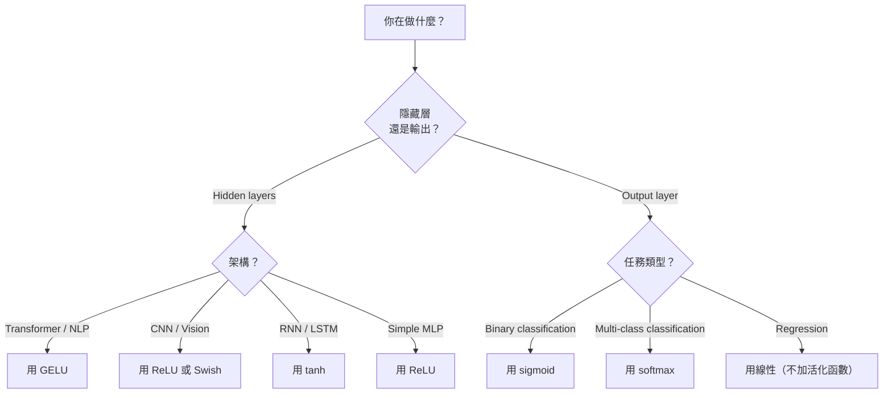

# 活化函數（activation function）

> 沒有非線性（nonlinearity），你的 100 層網路只是花俏的矩陣乘法（matrix multiplication）。活化函數是閘，讓神經網路（neural network）能以曲線思考。

**Type:** Build
**Languages:** Python
**Prerequisites:** Lesson 03.03 (Backpropagation)
**Time:** ~75 minutes

## Learning Objectives｜學習目標

- 從頭實作 sigmoid 函數、tanh、ReLU、Leaky ReLU、GELU、Swish 與 softmax，連同它們的導數（derivative）
- 診斷梯度消失（vanishing gradient）：換不同的活化函數，量測 10 層以上的活化值量級
- 在 ReLU 網路裡找出死亡神經元（dead neuron），並說明 GELU 為什麼避開這個失敗模式
- 依給定的架構選對活化函數：transformer、卷積神經網路（CNN）、循環神經網路（RNN）、輸出層（output layer）

## The Problem｜問題

把兩次線性變換（linear transformation）疊起來：y = W2(W1x + b1) + b2。展開：y = W2W1x + W2b1 + b2。那只是 y = Ax + c，一次線性變換。線性層疊再多，結果都塌成一次矩陣乘法。你的 100 層網路，表示能力和單層一樣。

這不是理論上的好奇。它表示深層線性網路根本學不會 XOR，沒辦法分類螺旋資料集（dataset），也認不出一張臉。沒有活化函數，深度只是錯覺。

活化函數打破線性。它們用非線性函數扭曲每一層的輸出，讓網路能彎曲決策邊界（decision boundary）、近似任意函數，並且真的學得起來。但選錯活化函數，梯度（gradient）會消失成零（深層網路裡的 sigmoid 函數）、爆到無限大（無界活化函數又沒有小心做初始化（initialization）），或神經元（neuron）永久死亡（偏置（bias）很大且為負的 ReLU）。活化函數怎麼選，直接決定網路到底學不學得起來。

## The Concept｜核心概念

### 為什麼需要非線性

矩陣乘法可以複合。向量先乘矩陣 A、再乘矩陣 B，就等於乘上 AB。所以堆十層線性層，數學上等於一個線性層配上一張大矩陣。那些參數（parameter）、那些深度，都浪費了。你得有東西把這條鏈打斷。那就是活化函數。

下面是證明。一個線性層計算 f(x) = Wx + b。疊兩層：

```
Layer 1: h = W1 * x + b1
Layer 2: y = W2 * h + b2
```

代入：

```
y = W2 * (W1 * x + b1) + b2
y = (W2 * W1) * x + (W2 * b1 + b2)
y = A * x + c
```

一層。在層與層之間插入非線性活化函數 g()：

```
h = g(W1 * x + b1)
y = W2 * h + b2
```

這時代入就斷了。W2 * g(W1 * x + b1) + b2 沒辦法化成單一的線性變換。網路就能表示非線性函數。每多一層、並加上活化函數，表示能力就增加。

### Sigmoid

神經網路最早的活化函數。

```
sigmoid(x) = 1 / (1 + e^(-x))
```

輸出範圍是 (0, 1)。它平滑、可微，把任何實數映成一個像機率（probability）的值。

導數：

```
sigmoid'(x) = sigmoid(x) * (1 - sigmoid(x))
```

這個導數的最大值是 0.25，出現在 x = 0。反向傳播（backpropagation）時，梯度會一層層相乘。十層 sigmoid 函數，表示梯度最多被 0.25 乘十次：

```
0.25^10 = 0.000000953674
```

不到原始訊號的百萬分之一。這就是梯度消失。前面幾層的梯度小到權重（weight）幾乎不更新。網路看起來在學：後面幾層的損失（loss）在下降，但最前面的層凍住了。深層 sigmoid 網路根本訓不起來。

還有一個問題：sigmoid 的輸出永遠是正的，從 0 到 1。權重上的梯度正負號就永遠相同。這會讓梯度下降法（gradient descent）左右折返。

### Tanh

以零為中心的 sigmoid 函數。

```
tanh(x) = (e^x - e^(-x)) / (e^x + e^(-x))
```

輸出範圍是 (-1, 1)。以零為中心，左右折返的問題就消失了。

導數：

```
tanh'(x) = 1 - tanh(x)^2
```

導數最大值是 1.0，在 x = 0，是 sigmoid 的四倍。但梯度消失還在。輸入很大的正數或負數時，導數趨近 0。十層仍然把梯度壓扁，只是沒那麼狠。

### ReLU：轉捩點

ReLU，全名 Rectified Linear Unit，也就是修正線性單元。Nair 與 Hinton 在 2010 年把它推廣到深度學習（deep learning）。函數本身可追溯到 Fukushima 1969 年的工作。它改變了一切。

```
relu(x) = max(0, x)
```

輸出範圍是 [0, infinity)。導數簡單到不用算：

```
relu'(x) = 1  if x > 0
            0  if x <= 0
```

正的輸入沒有梯度消失。梯度正好是 1，原樣往下傳。深層網路變得訓得動，就是因為 ReLU 讓梯度的量級跨層保留下來。

但有一種失敗模式：死亡神經元。如果一個神經元的加權輸入永遠是負的，可能是偏置很大且為負，或權重初始化不巧，它的輸出永遠是 0，梯度永遠是 0，也永遠不會更新。它永久死亡。實務上，ReLU 網路在訓練中可能有 10% 到 40% 的神經元死亡。

### Leaky ReLU

對死亡神經元最簡單的補救。

```
leaky_relu(x) = x        if x > 0
                alpha * x if x <= 0
```

alpha 是一個小常數，通常是 0.01。負的那一側有很小的斜率，不是 0，所以死亡神經元仍能收到梯度訊號，並有機會恢復。

### GELU：現在的預設

高斯誤差線性單元，英文是 Gaussian Error Linear Unit，簡稱 GELU。Hendrycks 與 Gimpel 在 2016 年提出。它是 BERT、GPT，以及多數現代 transformer 的預設活化函數。

```
gelu(x) = x * Phi(x)
```

Phi(x) 是標準常態分布（standard normal distribution）的累積分布函數（cumulative distribution function）。實務上用的近似是：

```
gelu(x) ~= 0.5 * x * (1 + tanh(sqrt(2/pi) * (x + 0.044715 * x^3)))
```

GELU 處處平滑，允許小的負值。ReLU 則是硬切成 0。它也有一個機率解釋：依照高斯分布之下輸入為正的可能性，對每個輸入加權。這種平滑閘控在 transformer 架構裡勝過 ReLU，因為梯度流更好，也完全避開死亡神經元。

### Swish / SiLU

自閘控的活化函數。Ramachandran 等人在 2017 年用自動搜尋找到它。

```
swish(x) = x * sigmoid(x)
```

Swish 的形式就是 x * sigmoid(x)。Google 在活化函數的空間裡自動搜尋，找到了它。等於讓神經網路設計神經網路的零件。

和 GELU 一樣，它平滑、非單調，也允許小的負值。差別很細：Swish 用 sigmoid 函數做閘控，GELU 用高斯累積分布函數。實務上表現幾乎一樣。Swish 用在 EfficientNet 和一些視覺模型。語言模型裡以 GELU 為主。

### Softmax：輸出用的活化函數

不用在隱藏層（hidden layer）。softmax 把一組原始分數，也就是 logit，轉成機率分布（probability distribution）。

```
softmax(x_i) = e^(x_i) / sum(e^(x_j) for all j)
```

每個輸出都在 0 和 1 之間。所有輸出加總是 1。所以它是多類別分類（multi-class classification）標準的最後一層活化函數。最大的 logit 得到最高機率。但和 argmax 不同，softmax 可微，也保留相對信心的資訊。

### 形狀比較



### 梯度流比較



### 什麼時候用哪一種



```figure
softmax-temperature
```

## Build It｜動手實作

### 步驟 1：實作所有活化函數與導數

每個函數吃一個浮點數，回傳一個浮點數。每個導數函數吃同樣的輸入，回傳梯度。

```python
import math

def sigmoid(x):
    x = max(-500, min(500, x))
    return 1.0 / (1.0 + math.exp(-x))

def sigmoid_derivative(x):
    s = sigmoid(x)
    return s * (1 - s)

def tanh_act(x):
    return math.tanh(x)

def tanh_derivative(x):
    t = math.tanh(x)
    return 1 - t * t

def relu(x):
    return max(0.0, x)

def relu_derivative(x):
    return 1.0 if x > 0 else 0.0

def leaky_relu(x, alpha=0.01):
    return x if x > 0 else alpha * x

def leaky_relu_derivative(x, alpha=0.01):
    return 1.0 if x > 0 else alpha

def gelu(x):
    return 0.5 * x * (1 + math.tanh(math.sqrt(2 / math.pi) * (x + 0.044715 * x ** 3)))

def gelu_derivative(x):
    phi = 0.5 * (1 + math.erf(x / math.sqrt(2)))
    pdf = math.exp(-0.5 * x * x) / math.sqrt(2 * math.pi)
    return phi + x * pdf

def swish(x):
    return x * sigmoid(x)

def swish_derivative(x):
    s = sigmoid(x)
    return s + x * s * (1 - s)

def softmax(xs):
    max_x = max(xs)
    exps = [math.exp(x - max_x) for x in xs]
    total = sum(exps)
    return [e / total for e in exps]
```

### 步驟 2：看出梯度在哪裡死去

在 -5 到 5 之間取 100 個等距點，計算梯度。印出文字直方圖，顯示每種活化函數的梯度在哪裡接近 0。

```python
def gradient_scan(name, derivative_fn, start=-5, end=5, n=100):
    step = (end - start) / n
    near_zero = 0
    healthy = 0
    for i in range(n):
        x = start + i * step
        g = derivative_fn(x)
        if abs(g) < 0.01:
            near_zero += 1
        else:
            healthy += 1
    pct_dead = near_zero / n * 100
    print(f"{name:15s}: {healthy:3d} healthy, {near_zero:3d} near-zero ({pct_dead:.0f}% dead zone)")

gradient_scan("Sigmoid", sigmoid_derivative)
gradient_scan("Tanh", tanh_derivative)
gradient_scan("ReLU", relu_derivative)
gradient_scan("Leaky ReLU", leaky_relu_derivative)
gradient_scan("GELU", gelu_derivative)
gradient_scan("Swish", swish_derivative)
```

### 步驟 3：梯度消失實驗

讓一個訊號以前向傳遞（forward pass）走過 N 層，比較 sigmoid 函數和 ReLU。量測活化值的量級怎麼變。

```python
import random

def vanishing_gradient_experiment(activation_fn, name, n_layers=10, n_inputs=5):
    random.seed(42)
    values = [random.gauss(0, 1) for _ in range(n_inputs)]

    print(f"\n{name} through {n_layers} layers:")
    for layer in range(n_layers):
        weights = [random.gauss(0, 1) for _ in range(n_inputs)]
        z = sum(w * v for w, v in zip(weights, values))
        activated = activation_fn(z)
        magnitude = abs(activated)
        bar = "#" * int(magnitude * 20)
        print(f"  Layer {layer+1:2d}: magnitude = {magnitude:.6f} {bar}")
        values = [activated] * n_inputs

vanishing_gradient_experiment(sigmoid, "Sigmoid")
vanishing_gradient_experiment(relu, "ReLU")
vanishing_gradient_experiment(gelu, "GELU")
```

### 步驟 4：死亡神經元偵測器

建立一個 ReLU 網路，把隨機輸入送進去，數有多少神經元從未啟動。

```python
def dead_neuron_detector(n_inputs=5, hidden_size=20, n_samples=1000):
    random.seed(0)
    weights = [[random.gauss(0, 1) for _ in range(n_inputs)] for _ in range(hidden_size)]
    biases = [random.gauss(0, 1) for _ in range(hidden_size)]

    fire_counts = [0] * hidden_size

    for _ in range(n_samples):
        inputs = [random.gauss(0, 1) for _ in range(n_inputs)]
        for neuron_idx in range(hidden_size):
            z = sum(w * x for w, x in zip(weights[neuron_idx], inputs)) + biases[neuron_idx]
            if relu(z) > 0:
                fire_counts[neuron_idx] += 1

    dead = sum(1 for c in fire_counts if c == 0)
    rarely_fire = sum(1 for c in fire_counts if 0 < c < n_samples * 0.05)
    healthy = hidden_size - dead - rarely_fire

    print(f"\nDead Neuron Report ({hidden_size} neurons, {n_samples} samples):")
    print(f"  Dead (never fired):     {dead}")
    print(f"  Barely alive (<5%):     {rarely_fire}")
    print(f"  Healthy:                {healthy}")
    print(f"  Dead neuron rate:       {dead/hidden_size*100:.1f}%")

    for i, c in enumerate(fire_counts):
        status = "DEAD" if c == 0 else "WEAK" if c < n_samples * 0.05 else "OK"
        bar = "#" * (c * 40 // n_samples)
        print(f"  Neuron {i:2d}: {c:4d}/{n_samples} fires [{status:4s}] {bar}")

dead_neuron_detector()
```

### 步驟 5：訓練比較，sigmoid、ReLU 與 GELU

用同一個兩層網路，在圓形資料集上訓練。圓內的點是類別（class）1，圓外是類別 0。換三種活化函數，比較收斂（convergence）速度。

```python
def make_circle_data(n=200, seed=42):
    random.seed(seed)
    data = []
    for _ in range(n):
        x = random.uniform(-2, 2)
        y = random.uniform(-2, 2)
        label = 1.0 if x * x + y * y < 1.5 else 0.0
        data.append(([x, y], label))
    return data


class ActivationNetwork:
    def __init__(self, activation_fn, activation_deriv, hidden_size=8, lr=0.1):
        random.seed(0)
        self.act = activation_fn
        self.act_d = activation_deriv
        self.lr = lr
        self.hidden_size = hidden_size

        self.w1 = [[random.gauss(0, 0.5) for _ in range(2)] for _ in range(hidden_size)]
        self.b1 = [0.0] * hidden_size
        self.w2 = [random.gauss(0, 0.5) for _ in range(hidden_size)]
        self.b2 = 0.0

    def forward(self, x):
        self.x = x
        self.z1 = []
        self.h = []
        for i in range(self.hidden_size):
            z = self.w1[i][0] * x[0] + self.w1[i][1] * x[1] + self.b1[i]
            self.z1.append(z)
            self.h.append(self.act(z))

        self.z2 = sum(self.w2[i] * self.h[i] for i in range(self.hidden_size)) + self.b2
        self.out = sigmoid(self.z2)
        return self.out

    def backward(self, target):
        error = self.out - target
        d_out = error * self.out * (1 - self.out)

        for i in range(self.hidden_size):
            d_h = d_out * self.w2[i] * self.act_d(self.z1[i])
            self.w2[i] -= self.lr * d_out * self.h[i]
            for j in range(2):
                self.w1[i][j] -= self.lr * d_h * self.x[j]
            self.b1[i] -= self.lr * d_h
        self.b2 -= self.lr * d_out

    def train(self, data, epochs=200):
        losses = []
        for epoch in range(epochs):
            total_loss = 0
            correct = 0
            for x, y in data:
                pred = self.forward(x)
                self.backward(y)
                total_loss += (pred - y) ** 2
                if (pred >= 0.5) == (y >= 0.5):
                    correct += 1
            avg_loss = total_loss / len(data)
            accuracy = correct / len(data) * 100
            losses.append(avg_loss)
            if epoch % 50 == 0 or epoch == epochs - 1:
                print(f"    Epoch {epoch:3d}: loss={avg_loss:.4f}, accuracy={accuracy:.1f}%")
        return losses


data = make_circle_data()

configs = [
    ("Sigmoid", sigmoid, sigmoid_derivative),
    ("ReLU", relu, relu_derivative),
    ("GELU", gelu, gelu_derivative),
]

results = {}
for name, act_fn, act_d_fn in configs:
    print(f"\n=== Training with {name} ===")
    net = ActivationNetwork(act_fn, act_d_fn, hidden_size=8, lr=0.1)
    losses = net.train(data, epochs=200)
    results[name] = losses

print("\n=== Final Loss Comparison ===")
for name, losses in results.items():
    print(f"  {name:10s}: start={losses[0]:.4f} -> end={losses[-1]:.4f} (improvement: {(1 - losses[-1]/losses[0])*100:.1f}%)")
```

## Use It｜實際應用

PyTorch 把上面這些都做成兩種形式：函式，以及模組。

```python
import torch
import torch.nn as nn
import torch.nn.functional as F

x = torch.randn(4, 10)

relu_out = F.relu(x)
gelu_out = F.gelu(x)
sigmoid_out = torch.sigmoid(x)
swish_out = F.silu(x)

logits = torch.randn(4, 5)
probs = F.softmax(logits, dim=1)

model = nn.Sequential(
    nn.Linear(10, 64),
    nn.GELU(),
    nn.Linear(64, 32),
    nn.GELU(),
    nn.Linear(32, 5),
)
```

transformer 的隱藏層用 GELU。CNN 的隱藏層用 ReLU。分類的輸出層用 softmax。迴歸（regression）的輸出層不加活化函數，也就是線性。要輸出機率，用 sigmoid 函數。就這樣。先用這些預設。有證據再改。

RNN 與 LSTM 的隱藏狀態（hidden state）用 tanh，閘用 sigmoid 函數。但你今天如果從頭做，大概不會用 RNN。如果 ReLU 網路裡的神經元在死亡，就換成 GELU。除非有特定理由，否則不必去用 Leaky ReLU。GELU 解決了死亡神經元，梯度流也更好。

## Ship It｜交付成果

本課會產出：

- `outputs/prompt-activation-selector.md`：一份可重複使用的 prompt，幫你為任何架構挑選合適的活化函數

## Exercises｜練習

1. 實作 Parametric ReLU（PReLU）：負側斜率 alpha 是可學習的參數。在圓形資料集上訓練，並和斜率固定的 Leaky ReLU 比較。
2. 把梯度消失實驗從 10 層改成 50 層。畫出 sigmoid、tanh、ReLU、GELU 每一層的量級。每種活化函數的訊號，大約在第幾層實際上變成 0？
3. 實作 ELU（Exponential Linear Unit）：x > 0 時 elu(x) = x，x <= 0 時是 alpha * (e^x - 1)。在同一個網路上，把它的死亡神經元比例和 ReLU 比較。
4. 做一個訓練時執行的梯度健康監視器：每個 epoch（訓練週期）計算每一層的平均梯度量級。任一層的梯度低於 0.001 或超過 100，就印出警告。
5. 把訓練比較改成用第 01 課的 XOR 資料集，而不是圓形。哪種活化函數在 XOR 上收斂最快？為什麼和圓形的結果不一樣？

## Key Terms｜關鍵術語

| 術語 | 常見說法 | 實際意義 |
|------|----------------|----------------------|
| 活化函數 | 「非線性的那一段」 | 套在每個神經元輸出上的函數。它打斷線性，網路才學得會非線性對應 |
| 梯度消失 | 「深層網路裡梯度不見了」 | 活化函數的導數小於 1 時，梯度會一層層指數縮小，前面的層就訓不動 |
| 梯度爆炸（exploding gradient） | 「梯度爆掉」 | 有效乘數大於 1 時，梯度會一層層指數變大，訓練就不穩定 |
| 死亡神經元 | 「一個不再學習的神經元」 | 輸入永久為負的 ReLU 神經元。輸出是 0，梯度也是 0 |
| sigmoid | 「把數值擠進 0 到 1」 | 邏輯斯函數（logistic function）1/(1+e^-x)。歷史上很重要，但在深層網路裡造成梯度消失 |
| ReLU | 「把負數切成 0」 | max(0, x)。它保住梯度的量級，深度學習才變得實際可行 |
| GELU | 「transformer 用的活化函數」 | 高斯誤差線性單元。平滑的活化函數，依照輸入為正的機率來加權 |
| Swish/SiLU | 「自閘控的 ReLU」 | x * sigmoid(x)。自動搜尋找到的，用在 EfficientNet |
| softmax | 「把分數變成機率」 | 把一組 logit 正規化（normalization）成機率分布。每個值都在 (0, 1)，加總是 1 |
| Leaky ReLU | 「不會死的 ReLU」 | max(alpha*x, x)。alpha 很小，通常是 0.01。負側仍有小梯度，神經元就不會死 |
| 飽和 | 「sigmoid 平坦的那一段」 | 活化函數導數趨近 0 的區域。梯度流在這裡被擋住 |
| logit | 「softmax 之前的原始分數」 | 最後一層還沒套上 softmax 或 sigmoid 函數的未正規化輸出 |

## Further Reading｜延伸閱讀

- Nair & Hinton, "Rectified Linear Units Improve Restricted Boltzmann Machines" (2010)——引進 ReLU、讓深層網路得以訓練的論文
- Hendrycks & Gimpel, "Gaussian Error Linear Units (GELUs)" (2016)——提出後來成為 transformer 預設活化函數的那篇論文
- Ramachandran et al., "Searching for Activation Functions" (2017)——用自動搜尋發現 Swish，說明活化函數的設計也可以自動化
- Glorot & Bengio, "Understanding the difficulty of training deep feedforward neural networks" (2010)——診斷梯度消失與梯度爆炸，並提出 Xavier 初始化（Xavier initialization）的論文
- Goodfellow, Bengio, Courville, "Deep Learning" Chapter 6.3 (https://www.deeplearningbook.org/)——對隱藏單元與活化函數的嚴格說明
