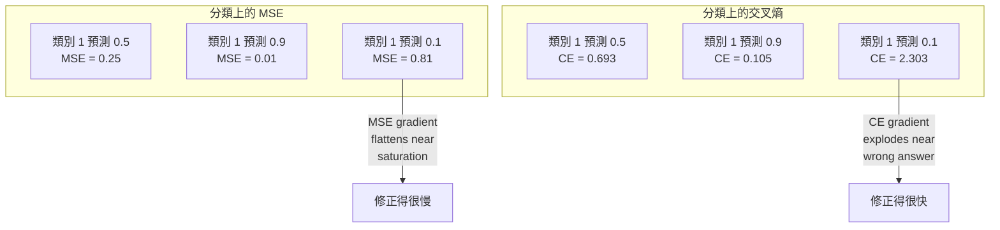
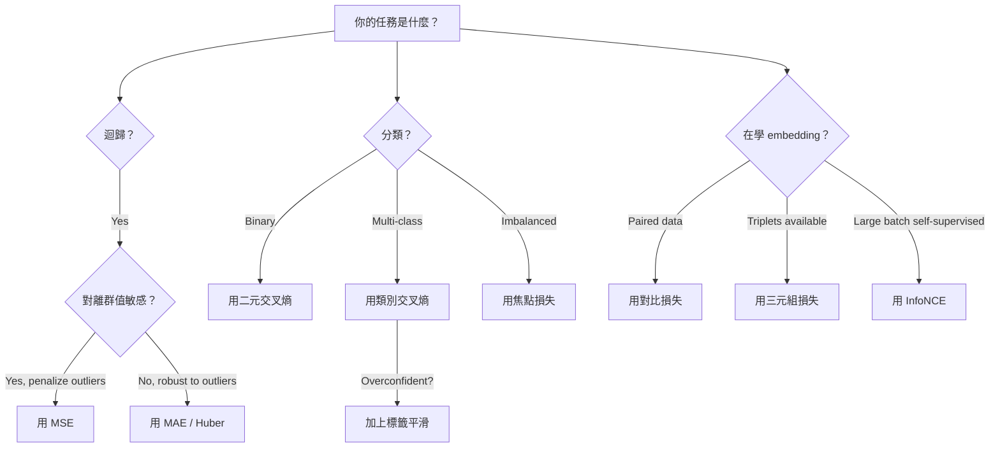
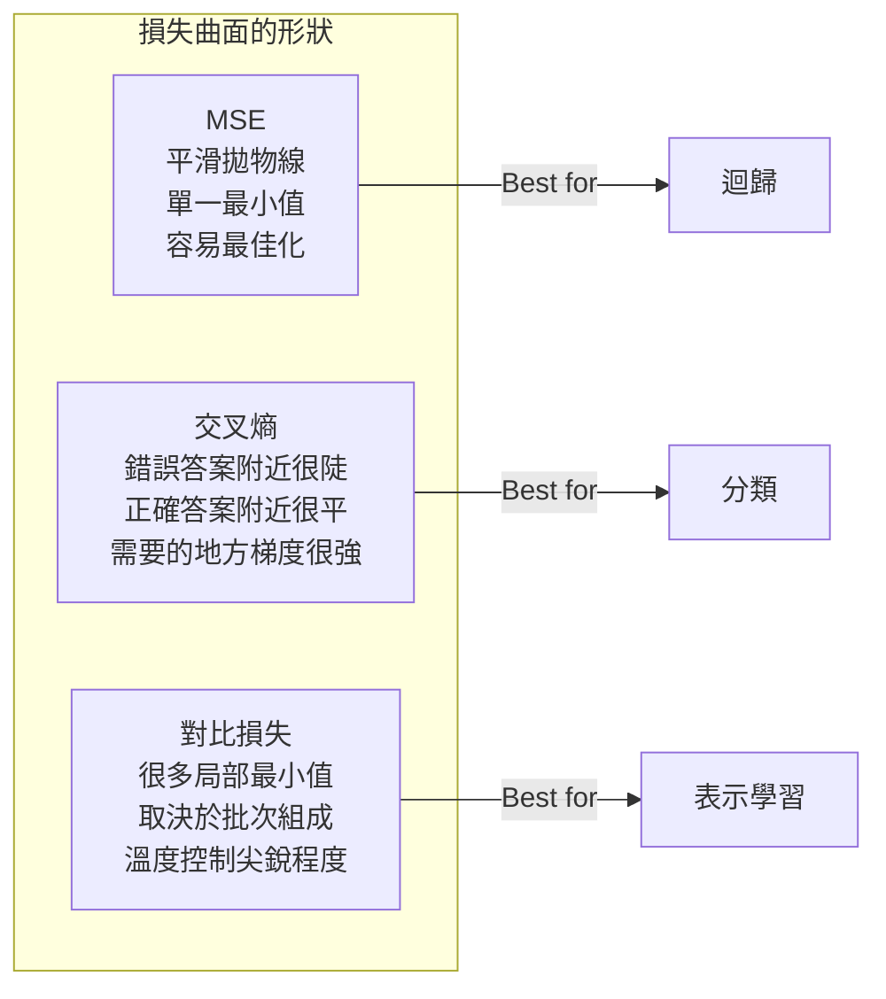

# 損失函數（loss function）

> 你的網路做出一個預測。真實標籤（ground truth）說的是另一回事。錯多少？那個數字就是損失。選錯損失函數，模型最佳化（optimization）的目標就整個錯了。

**Type:** Build
**Languages:** Python
**Prerequisites:** Lesson 03.04 (Activation Functions)
**Time:** ~75 minutes

## Learning Objectives｜學習目標

- 從頭實作 MSE、二元交叉熵（binary cross-entropy）、類別交叉熵（categorical cross-entropy），以及對比損失（contrastive loss，InfoNCE），連同它們的梯度（gradient）
- 說明 MSE 為什麼不適合分類：示範「全部預測 0.5」這個失敗模式
- 把標籤平滑（label smoothing）用在交叉熵（cross-entropy）上，並說明它怎麼避免過度自信的預測
- 為迴歸（regression）、二元分類（binary classification）、多類別分類（multi-class classification）和 embedding 學習任務選對損失函數

## The Problem｜問題

在分類問題上最小化 MSE 的模型，會很有把握地把每件事都預測成 0.5。它確實在把損失變小。它也完全沒用。

損失函數是模型真正在最佳化的唯一東西。不是準確率（accuracy）。不是 F1。也不是你拿去跟主管報告的任何指標（metric）。最佳化器（optimizer）拿損失函數的梯度，調整權重（weight），把那個數字變小。如果損失函數沒有抓住你在乎的事，模型會找數學上最便宜的方式去滿足它，而那種方式幾乎從來不是你要的。

具體例子。你有一個二元分類任務。兩個類別（class），各占一半。你用 MSE 當損失。模型對每一筆輸入都預測 0.5。平均 MSE 是 0.25，這是什麼都不學也能達到的最小值。模型完全沒有區辨能力，但技術上已經把你的損失函數最小化了。改用交叉熵，同一個模型就被迫把預測推向 0 或 1，因為 -log(0.5) = 0.693 是很糟的損失，而 -log(0.99) = 0.01 會獎勵有把握且正確的預測。損失函數怎麼選，就是「模型在學習」和「模型在鑽指標空子」的差別。

更糟的是，自我監督式學習（self-supervised learning）裡你根本沒有標籤。對比損失完全定義了學習訊號：什麼算相似、什麼算不同，以及模型該把它們推開多用力。對比損失設錯，embedding 會塌成一個點，每筆輸入都映到同一個向量（vector）。技術上損失是零。完全沒有價值。

## The Concept｜核心概念

### 均方誤差（MSE）

迴歸的預設。計算預測和目標（target）的差的平方，再對所有樣本（sample）平均。

```
MSE = (1/n) * sum((y_pred - y_true)^2)
```

為什麼要平方：它用二次方懲罰大誤差。誤差為 2 的代價是誤差為 1 的 4 倍。誤差為 10 的代價是 100 倍。所以 MSE 對離群值（outlier）很敏感。一筆離譜的預測就能主導損失。

實際數字：如果模型在預測房價，大多數房子的預測誤差是 1 萬美元，但有一棟豪宅的誤差達 20 萬美元。MSE 會拼命去修那一棟豪宅，其他 99 棟房子的表現可能因此變差。

MSE 對預測的梯度是：

```
dMSE/dy_pred = (2/n) * (y_pred - y_true)
```

它和誤差成線性關係。誤差越大，梯度越大。對迴歸這是優點：大誤差需要大修正。對分類這是缺陷：你想用指數懲罰有把握但錯誤的答案，而不是線性。

### 交叉熵損失

分類用的損失函數。它源自資訊理論（information theory），衡量預測的機率分布（probability distribution）和真實分布差多遠。

**二元交叉熵（BCE）：**

```
BCE = -(y * log(p) + (1 - y) * log(1 - p))
```

y 是真實標籤，0 或 1。p 是預測的機率。

為什麼 -log(p) 有用：真實標籤是 1，你預測 p = 0.99，損失是 -log(0.99) = 0.01。你預測 p = 0.01，損失是 -log(0.01) = 4.6。差了 460 倍，這就是交叉熵有用的原因。它狠狠懲罰有把握但錯誤的預測，對有把握且正確的幾乎不罰。

梯度講的是同一件事：

```
dBCE/dp = -(y/p) + (1-y)/(1-p)
```

當 y = 1 且 p 接近 0，梯度是 -1/p，趨近負無限大。模型收到巨大的訊號去修正錯誤。當 p 接近 1，梯度很小。已經對了，沒有什麼要修。

**類別交叉熵：**

用於多類別分類，目標以 one-hot 編碼（one-hot encoding）表示。

```
CCE = -sum(y_i * log(p_i))
```

只有真實類別會貢獻損失，因為其他的 y_i 都是 0。如果有 10 個類別，正確類別的機率是 0.1（隨機亂猜），損失是 -log(0.1) = 2.3。如果正確類別的機率是 0.9，損失是 -log(0.9) = 0.105。模型學會把機率質量（probability mass）集中到正確答案上。

### 為什麼 MSE 不適合分類



預測接近 0 或 1 時，MSE 的梯度會變平，原因是 sigmoid 函數飽和（saturation）。交叉熵的梯度會把這件事補回來：-log 抵消了 sigmoid 函數平坦的區域，正好在最需要的地方給出強梯度。

### 標籤平滑

標準的 one-hot 標籤說的是「這 100% 是類別 3，其他都是 0%」。這是很強的斷言。標籤平滑把它放軟：

```
smooth_label = (1 - alpha) * one_hot + alpha / num_classes
```

alpha = 0.1、10 個類別時：目標不再是 [0, 0, 1, 0, ...]，而變成 [0.01, 0.01, 0.91, 0.01, ...]。模型的目標是 0.91，不是 1.0。

為什麼有用：模型若要經由 softmax 輸出正好 1.0，就得把 logit 推到無限大。這會造成過度自信，傷害泛化（generalization），遇到分布偏移（distribution shift）也變脆。標籤平滑把目標封頂在 0.9（alpha = 0.1），logit 就留在合理範圍。GPT 和多數現代模型使用標籤平滑，或等價的作法。

### 對比損失

沒有標籤。沒有類別。只有成對的輸入，以及一個問題：這兩個相似，還是不同？

**SimCLR 風格的對比損失（NT-Xent / InfoNCE）：**

拿一張影像。做出兩個資料增強（data augmentation）後的視圖，例如裁切、旋轉、顏色抖動。這是正對（positive pair）：它們的 embedding 應該相似。批次（batch）裡的其他影像組成負對（negative pair）：embedding 應該不同。

```
L = -log(exp(sim(z_i, z_j) / tau) / sum(exp(sim(z_i, z_k) / tau)))
```

sim() 是餘弦相似度（cosine similarity）。z_i 和 z_j 是正對。總和走遍所有負對。tau 是溫度（temperature），控制分布有多尖。溫度越低，負樣本越難，分得越用力。

實際數字：批次大小 256，表示每一個正對有 255 個負對。溫度 tau = 0.07，這是 SimCLR 的預設。這個損失看起來像是對相似度做 softmax。它要正對的相似度，在全部 256 個選項裡最高。

**三元組損失（triplet loss）：**

拿三個輸入：錨點（anchor）、正樣本（positive，同一類別）、負樣本（negative，不同類別）。

```
L = max(0, d(anchor, positive) - d(anchor, negative) + margin)
```

間隔（margin）通常是 0.2 到 1.0，要求正樣本距離和負樣本距離之間至少有這麼大的空隙。如果負樣本已經夠遠，損失是 0，沒有梯度，也不更新。訓練因此比較有效率，但要小心地挑三元組：選離錨點近的困難負樣本。

### 焦點損失（focal loss）

給不平衡的資料集（dataset）用。標準交叉熵對所有分類正確的樣本一視同仁。焦點損失降低簡單樣本的權重：

```
FL = -alpha * (1 - p_t)^gamma * log(p_t)
```

p_t 是真實類別的預測機率。gamma 控制聚焦程度。gamma = 0 時，這就是標準交叉熵。gamma = 2 是預設：

- 簡單樣本（p_t = 0.9）：權重 = (0.1)^2 = 0.01。實際上被忽略。
- 困難樣本（p_t = 0.1）：權重 = (0.9)^2 = 0.81。梯度訊號完整保留。

焦點損失由 Lin 等人為物件偵測提出。那時 99% 的候選區域是背景，也就是簡單的負樣本。沒有焦點損失，模型會被簡單的背景樣本淹沒，永遠學不會偵測物件。有了它，模型把容量集中在困難、含糊、真正要緊的案例上。

### 損失函數的決策樹



### 損失地景（loss landscape）



```figure
cross-entropy-loss
```

## Build It｜動手實作

### 步驟 1：MSE 與它的梯度

```python
def mse(predictions, targets):
    n = len(predictions)
    total = 0.0
    for p, t in zip(predictions, targets):
        total += (p - t) ** 2
    return total / n

def mse_gradient(predictions, targets):
    n = len(predictions)
    grads = []
    for p, t in zip(predictions, targets):
        grads.append(2.0 * (p - t) / n)
    return grads
```

### 步驟 2：二元交叉熵

log(0) 的問題是真的。如果模型對正例預測正好是 0，log(0) 就是負無限大。裁剪可以避免。

```python
import math

def binary_cross_entropy(predictions, targets, eps=1e-15):
    n = len(predictions)
    total = 0.0
    for p, t in zip(predictions, targets):
        p_clipped = max(eps, min(1 - eps, p))
        total += -(t * math.log(p_clipped) + (1 - t) * math.log(1 - p_clipped))
    return total / n

def bce_gradient(predictions, targets, eps=1e-15):
    grads = []
    for p, t in zip(predictions, targets):
        p_clipped = max(eps, min(1 - eps, p))
        grads.append(-(t / p_clipped) + (1 - t) / (1 - p_clipped))
    return grads
```

### 步驟 3：搭配 softmax 的類別交叉熵

softmax 把原始 logit 轉成機率。再對 one-hot 編碼的目標計算交叉熵。

```python
def softmax(logits):
    max_val = max(logits)
    exps = [math.exp(x - max_val) for x in logits]
    total = sum(exps)
    return [e / total for e in exps]

def categorical_cross_entropy(logits, target_index, eps=1e-15):
    probs = softmax(logits)
    p = max(eps, probs[target_index])
    return -math.log(p)

def cce_gradient(logits, target_index):
    probs = softmax(logits)
    grads = list(probs)
    grads[target_index] -= 1.0
    return grads
```

softmax 加交叉熵的梯度簡化得很漂亮：真實類別是預測機率減 1，其他類別就是預測機率。這個簡潔的結果不是巧合。softmax 和交叉熵會成對使用，就是這個原因。

### 步驟 4：標籤平滑

```python
def label_smoothed_cce(logits, target_index, num_classes, alpha=0.1, eps=1e-15):
    probs = softmax(logits)
    loss = 0.0
    for i in range(num_classes):
        if i == target_index:
            smooth_target = 1.0 - alpha + alpha / num_classes
        else:
            smooth_target = alpha / num_classes
        p = max(eps, probs[i])
        loss += -smooth_target * math.log(p)
    return loss
```

### 步驟 5：對比損失（簡化的 InfoNCE）

```python
def cosine_similarity(a, b):
    dot = sum(x * y for x, y in zip(a, b))
    norm_a = math.sqrt(sum(x * x for x in a))
    norm_b = math.sqrt(sum(x * x for x in b))
    if norm_a < 1e-10 or norm_b < 1e-10:
        return 0.0
    return dot / (norm_a * norm_b)

def contrastive_loss(anchor, positive, negatives, temperature=0.07):
    sim_pos = cosine_similarity(anchor, positive) / temperature
    sim_negs = [cosine_similarity(anchor, neg) / temperature for neg in negatives]

    max_sim = max(sim_pos, max(sim_negs)) if sim_negs else sim_pos
    exp_pos = math.exp(sim_pos - max_sim)
    exp_negs = [math.exp(s - max_sim) for s in sim_negs]
    total_exp = exp_pos + sum(exp_negs)

    return -math.log(max(1e-15, exp_pos / total_exp))
```

### 步驟 6：分類上的 MSE 與交叉熵

用第 04 課同一個網路，在圓形資料集上，兩種損失都訓練。看交叉熵收斂（convergence）得比較快。

```python
import random

def sigmoid(x):
    x = max(-500, min(500, x))
    return 1.0 / (1.0 + math.exp(-x))

def make_circle_data(n=200, seed=42):
    random.seed(seed)
    data = []
    for _ in range(n):
        x = random.uniform(-2, 2)
        y = random.uniform(-2, 2)
        label = 1.0 if x * x + y * y < 1.5 else 0.0
        data.append(([x, y], label))
    return data


class LossComparisonNetwork:
    def __init__(self, loss_type="bce", hidden_size=8, lr=0.1):
        random.seed(0)
        self.loss_type = loss_type
        self.lr = lr
        self.hidden_size = hidden_size

        self.w1 = [[random.gauss(0, 0.5) for _ in range(2)] for _ in range(hidden_size)]
        self.b1 = [0.0] * hidden_size
        self.w2 = [random.gauss(0, 0.5) for _ in range(hidden_size)]
        self.b2 = 0.0

    def forward(self, x):
        self.x = x
        self.z1 = []
        self.h = []
        for i in range(self.hidden_size):
            z = self.w1[i][0] * x[0] + self.w1[i][1] * x[1] + self.b1[i]
            self.z1.append(z)
            self.h.append(max(0.0, z))

        self.z2 = sum(self.w2[i] * self.h[i] for i in range(self.hidden_size)) + self.b2
        self.out = sigmoid(self.z2)
        return self.out

    def backward(self, target):
        if self.loss_type == "mse":
            d_loss = 2.0 * (self.out - target)
        else:
            eps = 1e-15
            p = max(eps, min(1 - eps, self.out))
            d_loss = -(target / p) + (1 - target) / (1 - p)

        d_sigmoid = self.out * (1 - self.out)
        d_out = d_loss * d_sigmoid

        for i in range(self.hidden_size):
            d_relu = 1.0 if self.z1[i] > 0 else 0.0
            d_h = d_out * self.w2[i] * d_relu
            self.w2[i] -= self.lr * d_out * self.h[i]
            for j in range(2):
                self.w1[i][j] -= self.lr * d_h * self.x[j]
            self.b1[i] -= self.lr * d_h
        self.b2 -= self.lr * d_out

    def compute_loss(self, pred, target):
        if self.loss_type == "mse":
            return (pred - target) ** 2
        else:
            eps = 1e-15
            p = max(eps, min(1 - eps, pred))
            return -(target * math.log(p) + (1 - target) * math.log(1 - p))

    def train(self, data, epochs=200):
        losses = []
        for epoch in range(epochs):
            total_loss = 0.0
            correct = 0
            for x, y in data:
                pred = self.forward(x)
                self.backward(y)
                total_loss += self.compute_loss(pred, y)
                if (pred >= 0.5) == (y >= 0.5):
                    correct += 1
            avg_loss = total_loss / len(data)
            accuracy = correct / len(data) * 100
            losses.append((avg_loss, accuracy))
            if epoch % 50 == 0 or epoch == epochs - 1:
                print(f"    Epoch {epoch:3d}: loss={avg_loss:.4f}, accuracy={accuracy:.1f}%")
        return losses
```

## Use It｜實際應用

PyTorch 提供所有標準損失函數，數值穩定性已經做進去。

```python
import torch
import torch.nn as nn
import torch.nn.functional as F

predictions = torch.tensor([0.9, 0.1, 0.7], requires_grad=True)
targets = torch.tensor([1.0, 0.0, 1.0])

mse_loss = F.mse_loss(predictions, targets)
bce_loss = F.binary_cross_entropy(predictions, targets)

logits = torch.randn(4, 10)
labels = torch.tensor([3, 7, 1, 9])
ce_loss = F.cross_entropy(logits, labels)
ce_smooth = F.cross_entropy(logits, labels, label_smoothing=0.1)
```

用 `F.cross_entropy`，不要用 `F.nll_loss` 再自己接 softmax。它把 log-softmax 和負對數概似（negative log-likelihood）合成一個數值穩定的運算。分開做 softmax 再取 log 比較不穩定：大的指數相減時，你會丟掉精度。

對比學習時，多數團隊用自己的實作，或 `lightly`、`pytorch-metric-learning` 這類函式庫（library）。核心迴圈永遠一樣：算成對的相似度，對正樣本和負樣本做 softmax，再反向傳播（backpropagation）。

## Ship It｜交付成果

本課會產出：

- `outputs/prompt-loss-function-selector.md`：一份可重複使用的 prompt，用來挑選合適的損失函數
- `outputs/prompt-loss-debugger.md`：損失曲線看起來不對時用的診斷 prompt

## Exercises｜練習

1. 實作 Huber 損失（Huber loss），也就是平滑的 L1 損失：小誤差用 MSE，大誤差用 MAE。訓練一個迴歸網路預測 y = sin(x)。5% 的訓練目標加上隨機雜訊，也就是離群值。比較 MSE 和 Huber 的最終測試誤差。
2. 在二元分類的訓練迴圈裡加上焦點損失。做一個不平衡資料集，90% 是類別 0、10% 是類別 1。200 個 epoch（訓練週期）之後，比較標準 BCE 和焦點損失（gamma = 2）在少數類別上的召回率（recall）。
3. 實作帶半困難負樣本挑選的三元組損失。為 5 個類別產生 2D 的 embedding 資料。每個錨點找出仍比正樣本遠、但最難的負樣本，也就是半困難負樣本。和隨機挑三元組的收斂比較。
4. 跑 MSE 和交叉熵的比較，但訓練時追蹤每一層的梯度量級。畫出每個 epoch 的平均梯度範數（norm）。確認模型最不確定的前幾個 epoch，交叉熵給出較大的梯度。
5. 實作 KL 散度（KL divergence）損失，並驗證：真實分布是 one-hot 時，最小化 KL(true || predicted) 的梯度和交叉熵相同。再試軟目標，像知識蒸餾（knowledge distillation）那樣，「真實」分布來自教師模型的 softmax 輸出。

## Key Terms｜關鍵術語

| 術語 | 常見說法 | 實際意義 |
|------|----------------|----------------------|
| 損失函數 | 「模型錯多少」 | 一個可微的函數，把預測和目標對到一個純量（scalar）。最佳化器要把它變小 |
| MSE | 「平均平方誤差」 | 預測和目標之差的平方再取平均。用二次方懲罰大誤差 |
| 交叉熵 | 「分類用的損失」 | 用 -log(p) 衡量預測機率分布和真實分布差多遠 |
| 二元交叉熵 | 「BCE」 | 兩個類別的交叉熵：-(y*log(p) + (1-y)*log(1-p)) |
| 標籤平滑 | 「把目標弄軟」 | 把硬的 0/1 目標換成軟的值，例如 0.1/0.9，避免過度自信，也改善泛化 |
| 對比損失 | 「拉近、推開」 | 讓相似的一對在 embedding 空間裡靠近、不相似的遠離，藉此學習表示 |
| InfoNCE | 「CLIP/SimCLR 的損失」 | 對相似度分數做溫度縮放後的交叉熵。把對比學習當成分類 |
| 焦點損失 | 「不平衡資料的解法」 | 交叉熵乘上 (1-p_t)^gamma，降低簡單樣本的權重，把焦點放在困難樣本 |
| 三元組損失 | 「錨點、正樣本、負樣本」 | 在 embedding 空間裡，讓錨點比負樣本至少更靠近正樣本一個間隔 |
| 溫度 | 「尖銳程度的旋鈕」 | 除在 logit 或相似度上的純量。它控制最後的分布有多尖。越低越尖 |

## Further Reading｜延伸閱讀

- Lin et al., "Focal Loss for Dense Object Detection" (2017)——為物件偵測裡極端的類別不平衡提出焦點損失（RetinaNet）
- Chen et al., "A Simple Framework for Contrastive Learning of Visual Representations" (SimCLR, 2020)——用 NT-Xent 損失定義了現代的對比學習管線（pipeline）
- Szegedy et al., "Rethinking the Inception Architecture" (2016)——把標籤平滑當作正則化（regularization）提出，現在多數大型模型都用
- Hinton et al., "Distilling the Knowledge in a Neural Network" (2015)——用軟目標和 KL 散度做知識蒸餾，是模型壓縮的基礎
