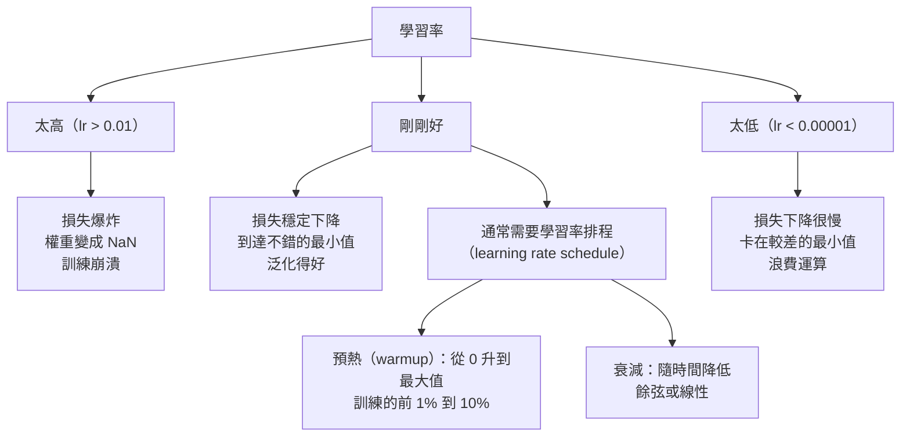
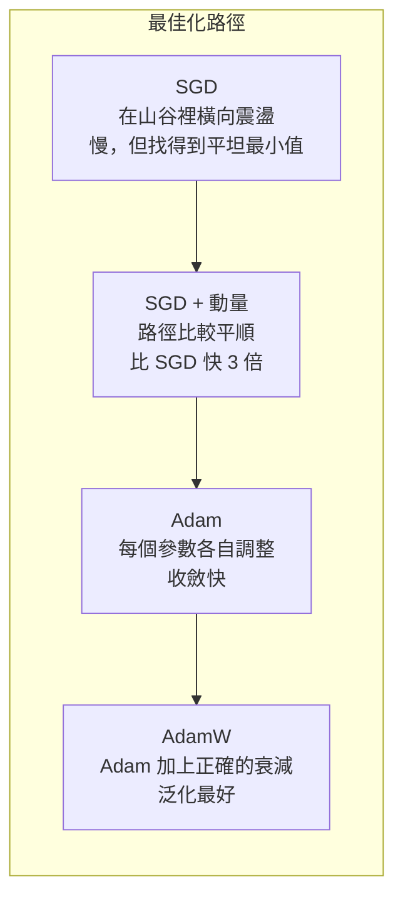
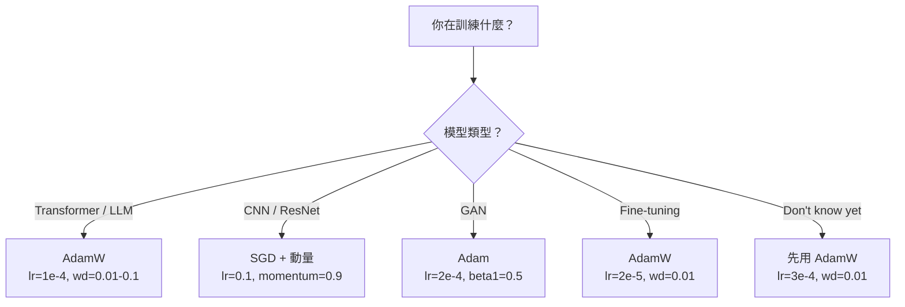

# 最佳化器（optimizer）

> 梯度下降法（gradient descent）告訴你該往哪個方向走。它完全沒說該走多遠、多快。SGD（stochastic gradient descent）是羅盤。Adam 是帶路況的 GPS。

**Type:** Build
**Languages:** Python
**Prerequisites:** Lesson 03.05 (Loss Functions)
**Time:** ~75 minutes

## Learning Objectives｜學習目標

- 用 Python 從頭實作 SGD、帶動量（momentum）的 SGD、Adam 與 AdamW
- 說明 Adam 的偏差校正（bias correction）如何補償訓練初期、動差估計從 0 開始的問題
- 示範為什麼在同一任務上，AdamW 的泛化（generalization）比 Adam 加上 L2 正則化（L2 regularization）更好
- 為 transformer、卷積神經網路（CNN）、GAN 與 fine-tuning 選合適的最佳化器，以及預設的超參數（hyperparameter）

## The Problem｜問題

你算出梯度（gradient）了。你知道第 4,721 號權重（weight）應該減少 0.003，損失才會下降。但 0.003 是什麼單位？要乘上什麼？第 1 步和第 1,000 步，該走一樣遠嗎？

最基本的梯度下降法，每一步、每個參數（parameter）都用同一個學習率（learning rate）：w = w - lr * gradient。這造成三個問題，讓神經網路（neural network）的訓練在實務上很痛苦。

第一，震盪（oscillation）。損失地景（loss landscape）很少長得像光滑的碗。它更像一條又長又窄的山谷。梯度指向橫跨山谷的方向，那裡很陡，而不是沿著山谷，那裡很緩。梯度下降法在窄的那個維度來回彈，在有用的方向上卻只前進一點點。你看過這種情況：損失先快速下降，然後停平。不是因為模型收斂（convergence）了，而是因為它在震盪。

第二，所有參數共用一個學習率是錯的。有些權重需要大步更新，它們還在早期、欠擬合（underfitting）的階段。有些只需要很小的更新，它們已經接近自己的最佳值。適合前者的學習率會毀掉後者，反過來也一樣。

第三，鞍點（saddle point）。維度（dimension）很高時，損失地景有大片平坦區域，梯度接近 0。最基本的 SGD 以梯度的速度爬過這些區域，而那個速度實際上是 0。模型看起來卡住了。它沒有卡住。它在一片平坦區裡，另一側還有下坡可用。但 SGD 沒有機制把它推過去。

Adam 三個都解決了。它為每個參數維持兩組移動平均：梯度的平均，也就是動量，用來處理震盪；梯度平方的平均，也就是自適應學習率，用來處理不同尺度。再加上前幾步的偏差校正，你就有一個最佳化器，用預設超參數就能處理 80% 的問題。這課從頭把它做出來，好讓你精確知道另外那 20% 什麼時候會失敗、為什麼失敗。

## The Concept｜核心概念

### 隨機梯度下降法（SGD）

最簡單的最佳化器。在一個小批次（mini-batch）上算梯度，再往反方向走一步。

```
w = w - lr * gradient
```

「隨機」的意思是：你用資料的一個隨機子集，也就是小批次，來估計梯度，而不是用整份資料集（dataset）。這個雜訊其實有用。它幫助逃出尖銳的局部最小值（local minimum）。但雜訊也造成震盪。

學習率是唯一的旋鈕。太高，損失發散。太低，訓練永遠跑不完。最佳值取決於架構、資料、批次（batch）大小，以及訓練走到哪一階段。現代網路上的最基本 SGD，常見值是 0.01 到 0.1。就算同一次訓練裡，理想的學習率也會變。

### 動量

球滾下山的比喻被用到爛，但仍然準確。你不是只照當下的梯度走一步，而是維持一個速度，把過去的梯度累積起來。

```
m_t = beta * m_{t-1} + gradient
w = w - lr * m_t
```

beta 通常是 0.9，控制要保留多少歷史。beta = 0.9 時，動量大約是最近 10 個梯度的平均，因為 1 / (1 - 0.9) = 10。

為什麼這能處理震盪：指向同一方向的梯度會累積。方向翻來翻去的梯度會互相抵消。在那條窄山谷裡，橫跨的分量每一步都換正負號，於是被壓掉。沿著山谷的分量保持一致，於是被放大。結果是沿著有用的方向平順加速。

實際數字：條件很差的損失地景上，單獨的 SGD 可能要 10,000 步。加上動量、beta = 0.9，同一題通常只要 3,000 到 5,000 步。加速不是一點點。

### RMSProp

第一個真正管用、而且每個參數各自調整學習率的方法。Hinton 在一堂 Coursera 課上提出，從未正式發表。

```
s_t = beta * s_{t-1} + (1 - beta) * gradient^2
w = w - lr * gradient / (sqrt(s_t) + epsilon)
```

s_t 追蹤梯度平方的移動平均。梯度一直很大的參數會被一個大數除掉，有效學習率就比較小。梯度很小的參數會被一個小數除掉，有效學習率就比較大。

這解決了「所有參數共用一個學習率」。一個權重如果一直收到大更新，大概已經接近目標（target），就讓它慢下來。一個權重如果一直只收到很小的更新，可能訓練不足，就讓它加快。

epsilon 通常是 1e-8，避免某個參數還沒被更新時除以零。

### Adam：動量加上 RMSProp

Adam 把兩個想法合在一起。每個參數維持兩個指數移動平均：

```
m_t = beta1 * m_{t-1} + (1 - beta1) * gradient        (first moment: mean)
v_t = beta2 * v_{t-1} + (1 - beta2) * gradient^2       (second moment: variance)
```

**偏差校正**是多數說明會跳過的關鍵細節。第 1 步，m_1 = (1 - beta1) * gradient。beta1 = 0.9 時，那是 0.1 * gradient，小了十倍。移動平均還沒預熱好。偏差校正把這件事補上：

```
m_hat = m_t / (1 - beta1^t)
v_hat = v_t / (1 - beta2^t)
```

第 1 步、beta1 = 0.9 時，m_hat = m_1 / (1 - 0.9) = m_1 / 0.1，也就是真正的梯度。第 100 步，(1 - 0.9^100) 大約是 1.0，修正量就消失了。偏差校正在前大約 10 步很重要，大約 50 步之後就可以忽略。

更新是：

```
w = w - lr * m_hat / (sqrt(v_hat) + epsilon)
```

Adam 的預設：lr = 0.001，beta1 = 0.9，beta2 = 0.999，epsilon = 1e-8。這些預設在 80% 的問題上管用。不管用時，先改 lr，再改 beta2。幾乎不要改 beta1 或 epsilon。

### AdamW：把權重衰減做對

L2 正則化把 lambda * w^2 加進損失。在最基本的 SGD 裡，這等價於權重衰減（weight decay）：每一步從權重減掉 lambda * w。在 Adam 裡，這個等價就不成立。

Loshchilov 與 Hutter 的觀察是：如果你把 L2 加進損失，再讓 Adam 處理梯度，自適應學習率也會縮放正則化（regularization）項。梯度變異大的參數，正則化變少。變異小的，正則化變多。這不是你要的。你要的是不管梯度統計如何，正則化都一樣。

AdamW 的修法是把權重衰減直接套在權重上，放在 Adam 更新之後：

```
w = w - lr * m_hat / (sqrt(v_hat) + epsilon) - lr * lambda * w
```

權重衰減項 lr * lambda * w 不會被 Adam 的自適應因子縮放。每個參數都依相同比例縮小。

這看起來像小事。不是。在幾乎每個任務上，AdamW 都收斂到比 Adam 加 L2 正則化更好的解。它是 PyTorch 訓練 transformer、擴散模型（diffusion model），以及多數現代架構時的預設最佳化器。BERT、GPT、LLaMA、Stable Diffusion，都是用 AdamW 訓練的。

### 學習率：最重要的超參數



如果只調校一個超參數，就調校學習率。學習率改 10 倍，比你做的任何架構決定都更有影響。常見預設：

- SGD：lr = 0.01 到 0.1
- Adam/AdamW：lr = 1e-4 到 3e-4
- fine-tuning 預訓練模型：lr = 1e-5 到 5e-5
- 學習率預熱：前 1% 到 10% 的步驟線性上升

### 最佳化器比較



### 每種最佳化器什麼時候贏



```figure
optimizer-trajectory
```

## Build It｜動手實作

### 步驟 1：最基本的 SGD

```python
class SGD:
    def __init__(self, lr=0.01):
        self.lr = lr

    def step(self, params, grads):
        for i in range(len(params)):
            params[i] -= self.lr * grads[i]
```

### 步驟 2：帶動量的 SGD

```python
class SGDMomentum:
    def __init__(self, lr=0.01, beta=0.9):
        self.lr = lr
        self.beta = beta
        self.velocities = None

    def step(self, params, grads):
        if self.velocities is None:
            self.velocities = [0.0] * len(params)
        for i in range(len(params)):
            self.velocities[i] = self.beta * self.velocities[i] + grads[i]
            params[i] -= self.lr * self.velocities[i]
```

### 步驟 3：Adam

```python
import math

class Adam:
    def __init__(self, lr=0.001, beta1=0.9, beta2=0.999, epsilon=1e-8):
        self.lr = lr
        self.beta1 = beta1
        self.beta2 = beta2
        self.epsilon = epsilon
        self.m = None
        self.v = None
        self.t = 0

    def step(self, params, grads):
        if self.m is None:
            self.m = [0.0] * len(params)
            self.v = [0.0] * len(params)

        self.t += 1

        for i in range(len(params)):
            self.m[i] = self.beta1 * self.m[i] + (1 - self.beta1) * grads[i]
            self.v[i] = self.beta2 * self.v[i] + (1 - self.beta2) * grads[i] ** 2

            m_hat = self.m[i] / (1 - self.beta1 ** self.t)
            v_hat = self.v[i] / (1 - self.beta2 ** self.t)

            params[i] -= self.lr * m_hat / (math.sqrt(v_hat) + self.epsilon)
```

### 步驟 4：AdamW

```python
class AdamW:
    def __init__(self, lr=0.001, beta1=0.9, beta2=0.999, epsilon=1e-8, weight_decay=0.01):
        self.lr = lr
        self.beta1 = beta1
        self.beta2 = beta2
        self.epsilon = epsilon
        self.weight_decay = weight_decay
        self.m = None
        self.v = None
        self.t = 0

    def step(self, params, grads):
        if self.m is None:
            self.m = [0.0] * len(params)
            self.v = [0.0] * len(params)

        self.t += 1

        for i in range(len(params)):
            self.m[i] = self.beta1 * self.m[i] + (1 - self.beta1) * grads[i]
            self.v[i] = self.beta2 * self.v[i] + (1 - self.beta2) * grads[i] ** 2

            m_hat = self.m[i] / (1 - self.beta1 ** self.t)
            v_hat = self.v[i] / (1 - self.beta2 ** self.t)

            params[i] -= self.lr * m_hat / (math.sqrt(v_hat) + self.epsilon)
            params[i] -= self.lr * self.weight_decay * params[i]
```

### 步驟 5：訓練比較

用第 05 課的圓形資料集，同一個兩層網路，四種最佳化器都訓練。比較收斂。

```python
import random

def sigmoid(x):
    x = max(-500, min(500, x))
    return 1.0 / (1.0 + math.exp(-x))

def make_circle_data(n=200, seed=42):
    random.seed(seed)
    data = []
    for _ in range(n):
        x = random.uniform(-2, 2)
        y = random.uniform(-2, 2)
        label = 1.0 if x * x + y * y < 1.5 else 0.0
        data.append(([x, y], label))
    return data


class OptimizerTestNetwork:
    def __init__(self, optimizer, hidden_size=8):
        random.seed(0)
        self.hidden_size = hidden_size
        self.optimizer = optimizer

        self.w1 = [[random.gauss(0, 0.5) for _ in range(2)] for _ in range(hidden_size)]
        self.b1 = [0.0] * hidden_size
        self.w2 = [random.gauss(0, 0.5) for _ in range(hidden_size)]
        self.b2 = 0.0

    def get_params(self):
        params = []
        for row in self.w1:
            params.extend(row)
        params.extend(self.b1)
        params.extend(self.w2)
        params.append(self.b2)
        return params

    def set_params(self, params):
        idx = 0
        for i in range(self.hidden_size):
            for j in range(2):
                self.w1[i][j] = params[idx]
                idx += 1
        for i in range(self.hidden_size):
            self.b1[i] = params[idx]
            idx += 1
        for i in range(self.hidden_size):
            self.w2[i] = params[idx]
            idx += 1
        self.b2 = params[idx]

    def forward(self, x):
        self.x = x
        self.z1 = []
        self.h = []
        for i in range(self.hidden_size):
            z = self.w1[i][0] * x[0] + self.w1[i][1] * x[1] + self.b1[i]
            self.z1.append(z)
            self.h.append(max(0.0, z))

        self.z2 = sum(self.w2[i] * self.h[i] for i in range(self.hidden_size)) + self.b2
        self.out = sigmoid(self.z2)
        return self.out

    def compute_grads(self, target):
        eps = 1e-15
        p = max(eps, min(1 - eps, self.out))
        d_loss = -(target / p) + (1 - target) / (1 - p)
        d_sigmoid = self.out * (1 - self.out)
        d_out = d_loss * d_sigmoid

        grads = [0.0] * (self.hidden_size * 2 + self.hidden_size + self.hidden_size + 1)
        idx = 0
        for i in range(self.hidden_size):
            d_relu = 1.0 if self.z1[i] > 0 else 0.0
            d_h = d_out * self.w2[i] * d_relu
            grads[idx] = d_h * self.x[0]
            grads[idx + 1] = d_h * self.x[1]
            idx += 2

        for i in range(self.hidden_size):
            d_relu = 1.0 if self.z1[i] > 0 else 0.0
            grads[idx] = d_out * self.w2[i] * d_relu
            idx += 1

        for i in range(self.hidden_size):
            grads[idx] = d_out * self.h[i]
            idx += 1

        grads[idx] = d_out
        return grads

    def train(self, data, epochs=300):
        losses = []
        for epoch in range(epochs):
            total_loss = 0.0
            correct = 0
            for x, y in data:
                pred = self.forward(x)
                grads = self.compute_grads(y)
                params = self.get_params()
                self.optimizer.step(params, grads)
                self.set_params(params)

                eps = 1e-15
                p = max(eps, min(1 - eps, pred))
                total_loss += -(y * math.log(p) + (1 - y) * math.log(1 - p))
                if (pred >= 0.5) == (y >= 0.5):
                    correct += 1
            avg_loss = total_loss / len(data)
            accuracy = correct / len(data) * 100
            losses.append((avg_loss, accuracy))
            if epoch % 75 == 0 or epoch == epochs - 1:
                print(f"    Epoch {epoch:3d}: loss={avg_loss:.4f}, accuracy={accuracy:.1f}%")
        return losses
```

## Use It｜實際應用

PyTorch 的最佳化器處理參數群組、梯度裁剪（gradient clipping）和學習率排程。

```python
import torch
import torch.optim as optim

model = torch.nn.Sequential(
    torch.nn.Linear(784, 256),
    torch.nn.ReLU(),
    torch.nn.Linear(256, 10),
)

optimizer = optim.AdamW(model.parameters(), lr=3e-4, weight_decay=0.01)

scheduler = optim.lr_scheduler.CosineAnnealingLR(optimizer, T_max=100)

for epoch in range(100):
    optimizer.zero_grad()
    output = model(torch.randn(32, 784))
    loss = torch.nn.functional.cross_entropy(output, torch.randint(0, 10, (32,)))
    loss.backward()
    torch.nn.utils.clip_grad_norm_(model.parameters(), max_norm=1.0)
    optimizer.step()
    scheduler.step()
```

順序永遠是：zero_grad、forward、loss、backward、可選的 clip、step、可選的 schedule。把這個順序背下來。弄錯的話，例如在 optimizer.step() 之前呼叫 scheduler.step()，是一種常見、很難查的 bug。

對 CNN，很多實作者仍偏好 SGD 加動量，lr = 0.1、momentum = 0.9、weight_decay = 1e-4，搭配階梯式或餘弦排程。SGD 找到比較平坦的最小值，泛化常常比較好。對 transformer 和 LLM，AdamW 加上預熱和餘弦衰減是普遍的預設。沒有量過的理由，就不要跟這個共識對著幹。

## Ship It｜交付成果

本課會產出：

- `outputs/prompt-optimizer-selector.md`：一份決策用的 prompt，為任何架構挑選合適的最佳化器和學習率

## Exercises｜練習

1. 實作 Nesterov 動量：在往前看的位置算梯度，也就是 w - lr * beta * v，而不是當下的位置。在圓形資料集上和標準動量比較收斂。
2. 實作學習率預熱排程：前 10% 的訓練步驟從 0 線性升到 max_lr，再餘弦衰減到 0。比較有預熱和沒有預熱的 Adam。量測圓形資料集上達到 90% 準確率（accuracy）要幾個 epoch（訓練週期）。
3. 追蹤 Adam 訓練時每個參數的有效學習率，也就是 lr * m_hat / (sqrt(v_hat) + eps)。畫出 10 步、50 步、200 步之後有效學習率的分布。所有參數更新的速度一樣嗎？
4. 實作梯度裁剪，依全域範數（norm）裁剪。最大梯度範數設為 1.0。用偏高的學習率，Adam 的 lr = 0.01，有裁剪和沒有裁剪都訓練。用 10 個隨機種子（random seed），數有多少次損失變成 NaN，也就是發散。
5. 在權重很大的網路上比較 Adam 和 AdamW。所有權重初始化成 [-5, 5] 的隨機值，比平常大很多。weight_decay = 0.1，訓練 200 個 epoch。畫出兩種最佳化器在訓練過程中權重的 L2 範數。AdamW 的權重應該縮得比較快。

## Key Terms｜關鍵術語

| 術語 | 常見說法 | 實際意義 |
|------|----------------|----------------------|
| 學習率 | 「步伐大小」 | 乘在梯度更新上的純量（scalar）。訓練裡影響最大的那一個超參數 |
| SGD | 「基本的梯度下降法」 | 隨機梯度下降法：在小批次上算梯度，再用權重減去 lr * gradient |
| 動量 | 「滾動的球」 | 過去梯度的指數移動平均。壓住震盪，並加速方向一致的分量 |
| RMSProp | 「自適應學習率」 | 把每個參數的梯度除以它近期梯度的均方根。讓學習率拉齊 |
| Adam | 「預設的最佳化器」 | 把動量（一階動差）和 RMSProp（二階動差）合在一起，並對最初幾步做偏差校正 |
| AdamW | 「做對的 Adam」 | 把權重衰減拆開的 Adam。正則化直接套在權重上，不經由梯度 |
| 偏差校正 | 「移動平均的預熱」 | 除以 (1 - beta^t)，補償 Adam 的動差估計從 0 開始 |
| 權重衰減 | 「把權重縮小」 | 每一步減掉權重的一部分。懲罰大權重的正則化 |
| 學習率排程 | 「學習率隨時間改變」 | 訓練過程中調整學習率的函數。現代的預設是預熱加上餘弦衰減 |
| 梯度裁剪 | 「把梯度範數封頂」 | 梯度向量（vector）的範數超過門檻就把它縮小。避免梯度爆炸（exploding gradient）的更新 |

## Further Reading｜延伸閱讀

- Kingma & Ba, "Adam: A Method for Stochastic Optimization" (2014)——原始的 Adam 論文，含收斂分析與偏差校正的推導
- Loshchilov & Hutter, "Decoupled Weight Decay Regularization" (2017)——證明在 Adam 裡 L2 正則化和權重衰減並不等價，並提出 AdamW
- Smith, "Cyclical Learning Rates for Training Neural Networks" (2017)——提出學習率範圍測試和循環排程，就不必再調校一個固定的學習率
- Ruder, "An Overview of Gradient Descent Optimization Algorithms" (2016)——把各種最佳化器變體放在一起比較、講得最好的那篇綜述
