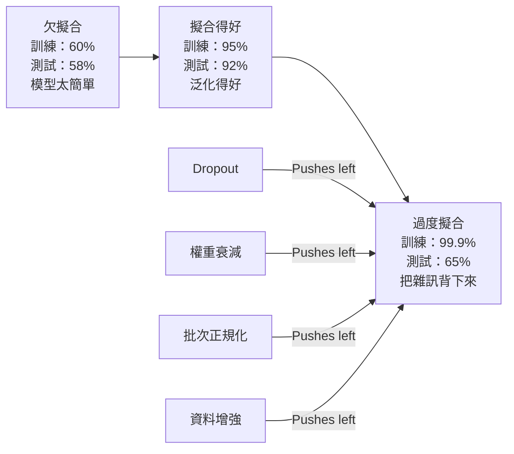
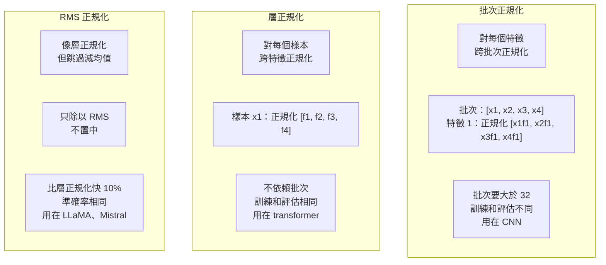
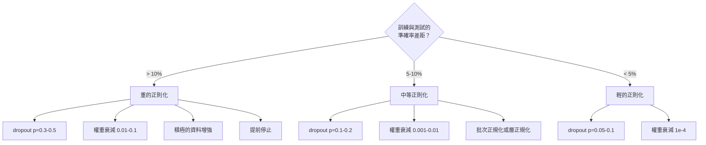

# 正則化（regularization）

> 你的模型在訓練資料（training data）上拿到 99%，測試資料（test data）只有 60%。它是背下來的，不是學到的。正則化是你對模型複雜度施加的懲罰，用來逼出泛化（generalization）。

**Type:** Build
**Languages:** Python
**Prerequisites:** Lesson 03.06 (Optimizers)
**Time:** ~75 minutes

## Learning Objectives｜學習目標

- 從頭實作反向縮放的 dropout、L2 權重衰減（weight decay）、批次正規化（batch normalization）、層正規化（layer normalization）與 RMSNorm
- 量測訓練與測試的準確率（accuracy）差距，並用正則化實驗診斷過度擬合（overfitting）
- 說明為什麼 transformer 用層正規化而不是批次正規化，以及為什麼現代 LLM 偏好 RMSNorm
- 依過度擬合有多嚴重，組合正確的正則化技術

## The Problem｜問題

參數（parameter）夠多的神經網路（neural network）可以背下任何資料集（dataset）。這不是假設。Zhang 等人在 2017 年證明了：他們用標準網路，在隨機標籤的 ImageNet 上訓練。標籤完全隨機，網路的訓練損失仍接近 0。它們背下了一百萬組沒有規律的輸入與輸出。訓練損失完美。測試準確率是 0。

這就是過度擬合，模型越大越嚴重。GPT-3 有 1750 億個參數。訓練集大約有 5000 億個 token。參數這麼多，模型有足夠容量把訓練資料的大段原文背下來。沒有正則化，它只會把訓練範例吐回來，而不是學可泛化的規律。

訓練表現和測試表現的差距，就是過度擬合的差距。這課的每種技術都從不同角度打這個差距。dropout 強迫網路不能依賴任何單一神經元（neuron）。權重衰減不讓任何單一權重（weight）長太大。批次正規化把損失地景（loss landscape）變平滑，最佳化器（optimizer）才找得到更平坦、更能泛化的最小值。層正規化做同樣的事，但用在批次正規化失敗的地方：小批次（mini-batch），以及長度不一的序列。RMSNorm 拿掉平均數的計算，快了 10%。每種技術都很簡單。合在一起，就是「只會背」和「會泛化」的差別。

## The Concept｜核心概念

### 過度擬合的光譜

每個模型都落在一條光譜上。一端是欠擬合（underfitting），太簡單，抓不到規律。另一端是過度擬合，複雜到把雜訊也抓進去。甜蜜點（sweet spot）在中間。正則化從過度擬合那一側把模型往回推。



### Dropout

最簡單的正則化，解釋也最漂亮。訓練時，以機率 p 把每個神經元的輸出隨機設成 0。

```
output = activation(z) * mask    where mask[i] ~ Bernoulli(1 - p)
```

p = 0.5 時，每次前向傳遞（forward pass）有一半神經元是 0。網路必須學多餘的表示，因為它無法預測哪些神經元還在。這避免共同適應（co-adaptation）：神經元學會依賴某幾個特定的其他神經元在場。

集成（ensemble）的解釋：N 個神經元加上 dropout，會產生 2^N 個子網路，也就是哪些神經元開、哪些關的每種組合。用 dropout 訓練，大約是同時訓練全部 2^N 個子網路，每個小批次看到的不一樣。測試時用全部神經元，不做 dropout，再把輸出乘上 (1 - p)，好對上訓練時的期望值。這等於把 2^N 個子網路的預測平均起來。一個模型，就得到一個巨大的集成。

實務上，縮放放在訓練時做，而不是測試時。這叫反向 dropout（inverted dropout）：

```
During training:  output = activation(z) * mask / (1 - p)
During testing:   output = activation(z)   (no change needed)
```

這樣比較乾淨，因為測試的程式完全不必知道 dropout。

預設比率：transformer 用 p = 0.1，多層感知器（multi-layer perceptron）用 p = 0.5，卷積神經網路（CNN）用 p = 0.2 到 0.3。dropout 越高，正則化越強，欠擬合的風險也越大。

### 權重衰減（L2 正則化）

把所有權重大小的平方加進損失：

```
total_loss = task_loss + (lambda / 2) * sum(w_i^2)
```

正則化項的梯度是 lambda * w。所以每一步，每個權重都會朝 0 縮小，縮小的比例跟它的大小成正比。大權重被罰得更重。模型被推向沒有任何單一權重主導的解。

為什麼這有助於泛化：過度擬合的模型往往有很大的權重，把訓練資料裡的雜訊放大。權重衰減把權重維持在小的範圍，限制模型的有效容量，迫使它依賴穩健、可泛化的特徵（feature），而不是背下來的怪癖。

lambda 這個超參數（hyperparameter）控制強度。常見值：

- transformer 上的 AdamW：0.01
- CNN 上的 SGD：1e-4
- 嚴重過度擬合的模型：0.1

第 06 課討論過：在 SGD 裡，權重衰減和 L2 正則化（L2 regularization）等價，在 Adam 裡則不是。用 Adam 訓練時，一律用 AdamW，也就是拆開的權重衰減。

### 批次正規化

把每一層的輸出在小批次之內正規化（normalization），再送進下一層。

某一層、一個小批次的活化值：

```
mu = (1/B) * sum(x_i)           (batch mean)
sigma^2 = (1/B) * sum((x_i - mu)^2)   (batch variance)
x_hat = (x_i - mu) / sqrt(sigma^2 + eps)   (normalize)
y = gamma * x_hat + beta        (scale and shift)
```

gamma 和 beta 是可學習的參數。如果正規化不是最佳的，網路可以把它撤銷。沒有它們，你就是強迫每一層的輸出都是平均數（mean）0、變異數（variance）1，那未必是網路要的。

**訓練和推論要分開：** 訓練時，mu 和 sigma 來自當下的小批次。推論（inference）時，用訓練過程累積的移動平均。指數移動平均的動量（momentum）= 0.1，也就是 90% 舊的加上 10% 新的。

批次正規化為什麼有效，到現在還有爭議。原始論文說它減少內部共變數偏移（internal covariate shift），也就是前面的層一更新，這一層輸入的分布就改變。Santurkar 等人在 2018 年指出這個解釋是錯的。真正的原因是：批次正規化讓損失地景更平滑。梯度（gradient）比較能預測損失怎麼變，Lipschitz 常數比較小，最佳化器可以安全地走更大步。所以批次正規化讓你可以用更高的學習率（learning rate），收斂（convergence）也更快。

批次正規化有一個根本限制：它依賴批次統計。批次大小是 1 時，均值和變異數沒有意義。批次小於 32 時，統計很吵，表現變差。這對物件偵測很重要，因為記憶體（memory）限制了批次（batch）大小；對語言建模也一樣，因為序列長度不一。

### 層正規化

對特徵做正規化，而不是對批次。單一筆樣本（sample）：

```
mu = (1/D) * sum(x_j)           (feature mean)
sigma^2 = (1/D) * sum((x_j - mu)^2)   (feature variance)
x_hat = (x_j - mu) / sqrt(sigma^2 + eps)
y = gamma * x_hat + beta
```

D 是特徵維度（dimension）。每一筆樣本各自正規化，不依賴批次大小。所以 transformer 用層正規化，不用批次正規化。序列長度不一，批次常常很小，生成時甚至是 1，而且訓練和推論的計算相同。

transformer 裡的層正規化，套在每個自注意力（self-attention）區塊和每個前饋區塊之後，這是 Post-LN；或套在它們之前，這是 Pre-LN，訓練比較穩定。

### RMSNorm

層正規化，但不減均值。Zhang 與 Sennrich 在 2019 年提出。

```
rms = sqrt((1/D) * sum(x_j^2))
y = gamma * x / rms
```

就這樣。不算平均數，也沒有 beta。觀察是：層正規化裡的重新置中，也就是減平均數，對模型表現貢獻很少，卻要花計算。拿掉它，準確率一樣，額外開銷大約少 10%。

LLaMA、LLaMA 2、LLaMA 3、Mistral，以及多數現代 LLM，用的是 RMSNorm，不是層正規化。在數十億個參數、數兆個 token 的規模上，省下這 10% 很可觀。

### 正規化比較



### 把資料增強（data augmentation）當作正則化

不是改模型，是改資料。變換訓練輸入，標籤保持不變：

- 影像：隨機裁切、翻轉、旋轉、顏色抖動、cutout
- 文字：同義詞替換、回譯、隨機刪除
- 音訊：時間拉伸、音高偏移、加入雜訊

效果和正則化一樣：訓練集的有效大小變大，模型更難背下特定範例。每張影像如果只以原樣看過一次，模型可以把它背下來。如果每張影像看過 50 個增強版本，它就被迫去學不變的結構。

### 提前停止（early stopping）

最簡單的正則化：驗證集（validation set）上的損失一開始上升，就停止訓練。那時候模型還沒過度擬合。實務上，每個 epoch（訓練週期）追蹤驗證損失，存下最好的模型，再多訓練一段容忍輪數（patience），通常是 5 到 20 個 epoch。如果這段期間驗證損失沒有改善，就停止，並載入存下的最好模型。

### 什麼時候用什麼



```figure
l2-regularization
```

## Build It｜動手實作

### 步驟 1：dropout，訓練模式與評估模式

```python
import random
import math


class Dropout:
    def __init__(self, p=0.5):
        self.p = p
        self.training = True
        self.mask = None

    def forward(self, x):
        if not self.training:
            return list(x)
        self.mask = []
        output = []
        for val in x:
            if random.random() < self.p:
                self.mask.append(0)
                output.append(0.0)
            else:
                self.mask.append(1)
                output.append(val / (1 - self.p))
        return output

    def backward(self, grad_output):
        grads = []
        for g, m in zip(grad_output, self.mask):
            if m == 0:
                grads.append(0.0)
            else:
                grads.append(g / (1 - self.p))
        return grads
```

### 步驟 2：L2 權重衰減

```python
def l2_regularization(weights, lambda_reg):
    penalty = 0.0
    for w in weights:
        penalty += w * w
    return lambda_reg * 0.5 * penalty

def l2_gradient(weights, lambda_reg):
    return [lambda_reg * w for w in weights]
```

### 步驟 3：批次正規化

```python
class BatchNorm:
    def __init__(self, num_features, momentum=0.1, eps=1e-5):
        self.gamma = [1.0] * num_features
        self.beta = [0.0] * num_features
        self.eps = eps
        self.momentum = momentum
        self.running_mean = [0.0] * num_features
        self.running_var = [1.0] * num_features
        self.training = True
        self.num_features = num_features

    def forward(self, batch):
        batch_size = len(batch)
        if self.training:
            mean = [0.0] * self.num_features
            for sample in batch:
                for j in range(self.num_features):
                    mean[j] += sample[j]
            mean = [m / batch_size for m in mean]

            var = [0.0] * self.num_features
            for sample in batch:
                for j in range(self.num_features):
                    var[j] += (sample[j] - mean[j]) ** 2
            var = [v / batch_size for v in var]

            for j in range(self.num_features):
                self.running_mean[j] = (1 - self.momentum) * self.running_mean[j] + self.momentum * mean[j]
                self.running_var[j] = (1 - self.momentum) * self.running_var[j] + self.momentum * var[j]
        else:
            mean = list(self.running_mean)
            var = list(self.running_var)

        self.x_hat = []
        output = []
        for sample in batch:
            normalized = []
            out_sample = []
            for j in range(self.num_features):
                x_h = (sample[j] - mean[j]) / math.sqrt(var[j] + self.eps)
                normalized.append(x_h)
                out_sample.append(self.gamma[j] * x_h + self.beta[j])
            self.x_hat.append(normalized)
            output.append(out_sample)
        return output
```

### 步驟 4：層正規化

```python
class LayerNorm:
    def __init__(self, num_features, eps=1e-5):
        self.gamma = [1.0] * num_features
        self.beta = [0.0] * num_features
        self.eps = eps
        self.num_features = num_features

    def forward(self, x):
        mean = sum(x) / len(x)
        var = sum((xi - mean) ** 2 for xi in x) / len(x)

        self.x_hat = []
        output = []
        for j in range(self.num_features):
            x_h = (x[j] - mean) / math.sqrt(var + self.eps)
            self.x_hat.append(x_h)
            output.append(self.gamma[j] * x_h + self.beta[j])
        return output
```

### 步驟 5：RMSNorm

```python
class RMSNorm:
    def __init__(self, num_features, eps=1e-6):
        self.gamma = [1.0] * num_features
        self.eps = eps
        self.num_features = num_features

    def forward(self, x):
        rms = math.sqrt(sum(xi * xi for xi in x) / len(x) + self.eps)
        output = []
        for j in range(self.num_features):
            output.append(self.gamma[j] * x[j] / rms)
        return output
```

### 步驟 6：有正則化和沒有正則化的訓練

```python
def sigmoid(x):
    x = max(-500, min(500, x))
    return 1.0 / (1.0 + math.exp(-x))


def make_circle_data(n=200, seed=42):
    random.seed(seed)
    data = []
    for _ in range(n):
        x = random.uniform(-2, 2)
        y = random.uniform(-2, 2)
        label = 1.0 if x * x + y * y < 1.5 else 0.0
        data.append(([x, y], label))
    return data


class RegularizedNetwork:
    def __init__(self, hidden_size=16, lr=0.05, dropout_p=0.0, weight_decay=0.0):
        random.seed(0)
        self.hidden_size = hidden_size
        self.lr = lr
        self.dropout_p = dropout_p
        self.weight_decay = weight_decay
        self.dropout = Dropout(p=dropout_p) if dropout_p > 0 else None

        self.w1 = [[random.gauss(0, 0.5) for _ in range(2)] for _ in range(hidden_size)]
        self.b1 = [0.0] * hidden_size
        self.w2 = [random.gauss(0, 0.5) for _ in range(hidden_size)]
        self.b2 = 0.0

    def forward(self, x, training=True):
        self.x = x
        self.z1 = []
        self.h = []
        for i in range(self.hidden_size):
            z = self.w1[i][0] * x[0] + self.w1[i][1] * x[1] + self.b1[i]
            self.z1.append(z)
            self.h.append(max(0.0, z))

        if self.dropout and training:
            self.dropout.training = True
            self.h = self.dropout.forward(self.h)
        elif self.dropout:
            self.dropout.training = False
            self.h = self.dropout.forward(self.h)

        self.z2 = sum(self.w2[i] * self.h[i] for i in range(self.hidden_size)) + self.b2
        self.out = sigmoid(self.z2)
        return self.out

    def backward(self, target):
        eps = 1e-15
        p = max(eps, min(1 - eps, self.out))
        d_loss = -(target / p) + (1 - target) / (1 - p)
        d_sigmoid = self.out * (1 - self.out)
        d_out = d_loss * d_sigmoid

        for i in range(self.hidden_size):
            d_relu = 1.0 if self.z1[i] > 0 else 0.0
            d_h = d_out * self.w2[i] * d_relu
            self.w2[i] -= self.lr * (d_out * self.h[i] + self.weight_decay * self.w2[i])
            for j in range(2):
                self.w1[i][j] -= self.lr * (d_h * self.x[j] + self.weight_decay * self.w1[i][j])
            self.b1[i] -= self.lr * d_h
        self.b2 -= self.lr * d_out

    def evaluate(self, data):
        correct = 0
        total_loss = 0.0
        for x, y in data:
            pred = self.forward(x, training=False)
            eps = 1e-15
            p = max(eps, min(1 - eps, pred))
            total_loss += -(y * math.log(p) + (1 - y) * math.log(1 - p))
            if (pred >= 0.5) == (y >= 0.5):
                correct += 1
        return total_loss / len(data), correct / len(data) * 100

    def train_model(self, train_data, test_data, epochs=300):
        history = []
        for epoch in range(epochs):
            total_loss = 0.0
            correct = 0
            for x, y in train_data:
                pred = self.forward(x, training=True)
                self.backward(y)
                eps = 1e-15
                p = max(eps, min(1 - eps, pred))
                total_loss += -(y * math.log(p) + (1 - y) * math.log(1 - p))
                if (pred >= 0.5) == (y >= 0.5):
                    correct += 1
            train_loss = total_loss / len(train_data)
            train_acc = correct / len(train_data) * 100
            test_loss, test_acc = self.evaluate(test_data)
            history.append((train_loss, train_acc, test_loss, test_acc))
            if epoch % 75 == 0 or epoch == epochs - 1:
                gap = train_acc - test_acc
                print(f"    Epoch {epoch:3d}: train_acc={train_acc:.1f}%, test_acc={test_acc:.1f}%, gap={gap:.1f}%")
        return history
```

## Use It｜實際應用

PyTorch 把所有正規化和正則化都做成模組。

```python
import torch
import torch.nn as nn

model = nn.Sequential(
    nn.Linear(784, 256),
    nn.BatchNorm1d(256),
    nn.ReLU(),
    nn.Dropout(0.3),
    nn.Linear(256, 128),
    nn.BatchNorm1d(128),
    nn.ReLU(),
    nn.Dropout(0.3),
    nn.Linear(128, 10),
)

model.train()
out_train = model(torch.randn(32, 784))

model.eval()
out_test = model(torch.randn(1, 784))
```

`model.train()` / `model.eval()` 這個開關很關鍵。它把 dropout 打開或關掉，也告訴批次正規化要用批次統計還是累積的統計。推論之前忘記 `model.eval()`，是深度學習（deep learning）裡最常見的 bug 之一。測試準確率會隨機跳動，因為 dropout 還開著，批次正規化也還在用小批次的統計。

transformer 的模式不一樣：

```python
class TransformerBlock(nn.Module):
    def __init__(self, d_model=512, nhead=8, dropout=0.1):
        super().__init__()
        self.attention = nn.MultiheadAttention(d_model, nhead, dropout=dropout)
        self.norm1 = nn.LayerNorm(d_model)
        self.ff = nn.Sequential(
            nn.Linear(d_model, d_model * 4),
            nn.GELU(),
            nn.Linear(d_model * 4, d_model),
            nn.Dropout(dropout),
        )
        self.norm2 = nn.LayerNorm(d_model)
        self.dropout = nn.Dropout(dropout)

    def forward(self, x):
        attended, _ = self.attention(x, x, x)
        x = self.norm1(x + self.dropout(attended))
        x = self.norm2(x + self.ff(x))
        return x
```

用層正規化，不用批次正規化。dropout 的 p = 0.1，不是 p = 0.5。這是 transformer 的預設。

## Ship It｜交付成果

本課會產出：

- `outputs/prompt-regularization-advisor.md`：一份 prompt，用來診斷過度擬合，並建議合適的正則化策略

## Exercises｜練習

1. 為 2D 資料實作空間 dropout：不要丟掉個別神經元，而是丟掉整條特徵通道。把連續的一組特徵當成通道，整組丟掉，來模擬這件事。在 hidden_size = 32 的圓形資料集上，和標準 dropout 比較訓練與測試的差距。
2. 把第 05 課的標籤平滑（label smoothing）和這課的 dropout 合在一起。四種組態都訓練：都不用、只用 dropout、只用標籤平滑、兩個都用。量測每種最終的訓練與測試準確率差距。哪一種差距最小？
3. 在圓形資料集的網路裡，隱藏層（hidden layer）和活化函數（activation function）之間加一層批次正規化。學習率 0.01、0.05、0.1，有批次正規化和沒有都訓練。批次正規化應該讓較高的學習率仍能穩定訓練，而最基本的網路在那裡會發散。
4. 實作提前停止：每個 epoch 追蹤測試損失，存下最好的權重，如果測試損失連續 20 個 epoch 沒有改善就停止。把有正則化的網路跑 1000 個 epoch。回報測試準確率最好的是第幾個 epoch，以及你省下多少個 epoch 的計算量。
5. 在 4 層網路上比較層正規化和 RMSNorm，不要只用 2 層。兩者用相同的初始權重。訓練 200 個 epoch，比較最終準確率、訓練速度（每個 epoch 的時間），以及第一層的梯度量級。確認 RMSNorm 比較快，準確率相同。

## Key Terms｜關鍵術語

| 術語 | 常見說法 | 實際意義 |
|------|----------------|----------------------|
| 過度擬合 | 「模型把資料背下來了」 | 訓練表現明顯高於測試表現。它學到的是雜訊，不是訊號 |
| 正則化 | 「避免過度擬合」 | 任何限制模型複雜度、用來改善泛化的技術：dropout、權重衰減、正規化、資料增強 |
| dropout | 「隨機刪掉神經元」 | 訓練時以機率 p 把隨機的神經元設成 0，迫使表示有多餘的備援。等於在訓練一個集成 |
| 權重衰減 | 「L2 懲罰」 | 每一步減掉 lambda * w，把所有權重朝 0 縮。用權重的大小來懲罰複雜度 |
| 批次正規化 | 「按批次正規化」 | 訓練時用批次統計、推論時用移動平均，沿批次維度正規化每一層的輸出 |
| 層正規化 | 「按樣本正規化」 | 在每一筆樣本內部，跨特徵做正規化。不依賴批次。transformer 的批次大小會變，所以用它 |
| RMSNorm | 「不減均值的層正規化」 | 均方根正規化。拿掉層正規化的減均值，快約 10%，準確率相同 |
| 提前停止 | 「過度擬合之前停下來」 | 驗證損失不再改善就停止訓練。最簡單的正則化，常常和其他方法一起用 |
| 資料增強 | 「用較少資料變出更多」 | 變換訓練輸入，例如翻轉、裁切、加雜訊，讓有效資料集變大，並迫使模型學不變性 |
| 泛化差距（generalization gap） | 「訓練和測試拆開」 | 訓練表現和測試表現的差。正則化的目標就是把這個差距縮小 |

## Further Reading｜延伸閱讀

- Srivastava et al., "Dropout: A Simple Way to Prevent Neural Networks from Overfitting" (2014)——原始的 dropout 論文，含集成解釋和大量實驗
- Ioffe & Szegedy, "Batch Normalization: Accelerating Deep Network Training by Reducing Internal Covariate Shift" (2015)——提出批次正規化及其訓練程序，是深度學習裡被引用最多的論文之一
- Zhang & Sennrich, "Root Mean Square Layer Normalization" (2019)——說明 RMSNorm 的準確率與層正規化相當，計算更少。LLaMA 和 Mistral 採用了它
- Zhang et al., "Understanding Deep Learning Requires Rethinking Generalization" (2017)——里程碑論文，說明神經網路可以背下隨機標籤，挑戰了對泛化的傳統看法
