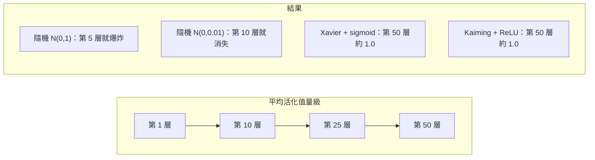
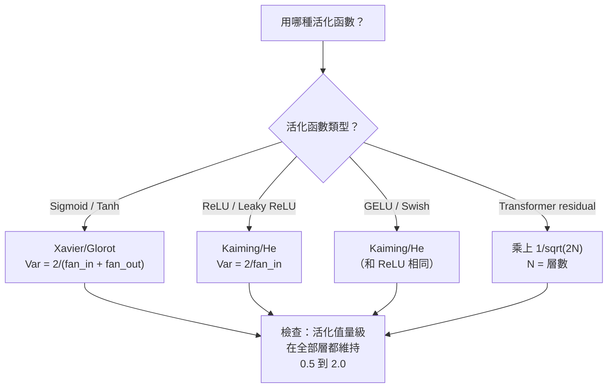

# 權重初始化（weight initialization）與訓練穩定性

> 初始化（initialization）錯了，訓練根本不會開始。初始化對了，50 層會和 3 層一樣順。

**Type:** Build
**Languages:** Python
**Prerequisites:** Lesson 03.04 (Activation Functions), Lesson 03.07 (Regularization)
**Time:** ~90 minutes

## Learning Objectives｜學習目標

- 實作零初始化、隨機初始化、Xavier/Glorot 與 Kaiming/He，並量測它們對 50 層活化值量級的影響
- 推導為什麼 Xavier 初始化用 Var(w) = 2/(fan_in + fan_out)，Kaiming 初始化用 Var(w) = 2/fan_in
- 示範零初始化的對稱（symmetry）問題，並說明為什麼只靠隨機的尺度（scale）還不夠
- 依活化函數（activation function）配對初始化：sigmoid 函數與 tanh 用 Xavier，ReLU 與 GELU 用 Kaiming

## The Problem｜問題

把所有權重（weight）都設成 0。什麼都學不會。每個神經元（neuron）算的是同一個函式，收到同一個梯度（gradient），更新也完全一樣。跑了 10,000 個 epoch（訓練週期）之後，你那個 512 個神經元的隱藏層（hidden layer）仍是同一個神經元的 512 份複本。你付了 512 個參數（parameter）的代價，只得到 1 個。

初始化得太大。活化值在網路裡爆炸。到第 10 層，數值碰到 1e15。到第 20 層，溢位（overflow）成無限大。梯度沿著同一條軌跡往回走。

從標準常態分布（standard normal distribution）隨機初始化。3 層還行。到 50 層，訊號不是塌成 0，就是炸到無限大，看隨機的尺度是稍小一點還是稍大一點。「行」和「壞」的界線薄得像刀口。

權重初始化是深度學習（deep learning）裡最被低估的決定。架構有論文。最佳化器（optimizer）有部落格文章。初始化只有一則註腳。但只要它錯了，其他都不重要：訓練還沒開始，網路就已經死了。

## The Concept｜核心概念

### 對稱問題

一層裡的每個神經元結構都一樣：輸入乘上權重，加上偏置（bias），再套活化函數。如果所有權重從同一個值開始，零是極端情況，每個神經元算出的輸出就相同。反向傳播（backpropagation）時，每個神經元收到同一個梯度。更新時，每個神經元改的量也相同。

你卡住了。網路有好幾百個參數，但它們步調完全一致。這叫對稱。隨機初始化是打破它的暴力作法。每個神經元從權重空間的不同點出發，才會學到不同的特徵（feature）。

但「隨機」不夠。隨機的尺度決定網路訓不訓得動。

### 變異數怎麼一層層傳

考慮一層有 fan-in 個輸入：

```
z = w1*x1 + w2*x2 + ... + w_n*x_n
```

如果每個權重 wi 來自變異數（variance）為 Var(w) 的分布，每個輸入 xi 的變異數是 Var(x)，輸出的變異數是：

```
Var(z) = fan_in * Var(w) * Var(x)
```

若 Var(w) = 1 且 fan-in = 512，輸出變異數是輸入變異數的 512 倍。10 層之後：512^10 = 1.2e27。訊號爆炸了。

若 Var(w) = 0.001，輸出變異數每一層縮成 0.001 * 512 = 0.512。10 層之後：0.512^10 = 0.00013。訊號消失了。

目標是選一個 Var(w)，讓 Var(z) = Var(x)。訊號量級跨層維持不變。

### Xavier/Glorot 初始化

Glorot 與 Bengio（2010）為 sigmoid 函數和 tanh 推導出解法。要讓前向傳遞（forward pass）和反向傳遞的變異數都維持不變：

```
Var(w) = 2 / (fan_in + fan_out)
```

實務上，權重從這個分布抽出：

```
w ~ Uniform(-limit, limit)  where limit = sqrt(6 / (fan_in + fan_out))
```

或：

```
w ~ Normal(0, sqrt(2 / (fan_in + fan_out)))
```

這行得通，是因為 sigmoid 函數和 tanh 在 0 附近大致是線性的，而初始化得當的活化值就落在那附近。變異數可以穩穩地穿過幾十層。

### Kaiming/He 初始化

ReLU 把一半輸出殺掉，負的全部變成 0。有效的 fan-in 少了一半，因為平均有一半輸入是 0。Xavier 初始化沒把這件事算進去，它低估了需要的變異數。

He 等人（2015）改了公式：

```
Var(w) = 2 / fan_in
```

權重從這個分布抽出：

```
w ~ Normal(0, sqrt(2 / fan_in))
```

這個 2 是用來補償 ReLU 把一半活化值變成 0。沒有它，訊號每一層大約縮成 0.5 倍。50 層就是 0.5^50 = 8.8e-16。Kaiming 初始化避免了這件事。

### Transformer 的初始化

GPT-2 用了另一種作法。殘差連接（residual connection）把每個子層的輸出加回它的輸入：

```
x = x + sublayer(x)
```

每加一次，變異數就增加。有 N 層殘差，變異數跟 N 成正比。GPT-2 把殘差層的權重乘上 1/sqrt(2N)，N 是層數。累積起來的訊號量級就維持得住。

Llama 3 有 4050 億個參數、126 層，用的是類似的方案。沒有這個縮放，殘差流（residual stream）會在 126 層注意力（attention）和前饋（feedforward）區塊裡沒有上界地變大。

```mermaid
flowchart TD
    subgraph "零初始化"
        Z1["第 1 層<br/>所有權重 = 0"] --> Z2["第 2 層<br/>所有神經元相同"]
        Z2 --> Z3["第 3 層<br/>仍然相同"]
        Z3 --> ZR["結果：有效神經元只有 1 個<br/>跟寬度無關"]
    end

    subgraph "Xavier 初始化"
        X1["第 1 層<br/>Var = 2/(fan_in+fan_out)"] --> X2["第 2 層<br/>訊號穩定"]
        X2 --> X3["第 50 層<br/>訊號穩定"]
        X3 --> XR["結果：可用 sigmoid/tanh 訓練"]
    end

    subgraph "Kaiming 初始化"
        K1["第 1 層<br/>Var = 2/fan_in"] --> K2["第 2 層<br/>訊號穩定"]
        K2 --> K3["第 50 層<br/>訊號穩定"]
        K3 --> KR["結果：可用 ReLU/GELU 訓練"]
    end
```



### 50 層裡的活化值量級



### 選對初始化



```figure
weight-init-variance
```

## Build It｜動手實作

### 步驟 1：初始化策略

四種初始化權重矩陣的方式。每一種都回傳一層一層的清單，也就是一張二維矩陣：欄數是 fan-in，列數是 fan-out。

```python
import math
import random


def zero_init(fan_in, fan_out):
    return [[0.0 for _ in range(fan_in)] for _ in range(fan_out)]


def random_init(fan_in, fan_out, scale=1.0):
    return [[random.gauss(0, scale) for _ in range(fan_in)] for _ in range(fan_out)]


def xavier_init(fan_in, fan_out):
    std = math.sqrt(2.0 / (fan_in + fan_out))
    return [[random.gauss(0, std) for _ in range(fan_in)] for _ in range(fan_out)]


def kaiming_init(fan_in, fan_out):
    std = math.sqrt(2.0 / fan_in)
    return [[random.gauss(0, std) for _ in range(fan_in)] for _ in range(fan_out)]
```

### 步驟 2：活化函數

我們需要 sigmoid 函數、tanh 和 ReLU，才能用每種策略配上它該配的活化函數來測。

```python
def sigmoid(x):
    x = max(-500, min(500, x))
    return 1.0 / (1.0 + math.exp(-x))


def tanh_act(x):
    return math.tanh(x)


def relu(x):
    return max(0.0, x)
```

### 步驟 3：穿過 50 層的前向傳遞

把隨機資料送進一個深的網路，量每一層的平均活化值量級。

```python
def forward_deep(init_fn, activation_fn, n_layers=50, width=64, n_samples=100):
    random.seed(42)
    layer_magnitudes = []

    inputs = [[random.gauss(0, 1) for _ in range(width)] for _ in range(n_samples)]

    for layer_idx in range(n_layers):
        weights = init_fn(width, width)
        biases = [0.0] * width

        new_inputs = []
        for sample in inputs:
            output = []
            for neuron_idx in range(width):
                z = sum(weights[neuron_idx][j] * sample[j] for j in range(width)) + biases[neuron_idx]
                output.append(activation_fn(z))
            new_inputs.append(output)
        inputs = new_inputs

        magnitudes = []
        for sample in inputs:
            magnitudes.append(sum(abs(v) for v in sample) / width)
        mean_mag = sum(magnitudes) / len(magnitudes)
        layer_magnitudes.append(mean_mag)

    return layer_magnitudes
```

### 步驟 4：實驗

把組合都跑一遍：零初始化、隨機 N(0,1)、隨機 N(0,0.01)、Xavier 配 sigmoid 函數、Xavier 配 tanh、Kaiming 配 ReLU。印出關鍵層的量級。

```python
def run_experiment():
    configs = [
        ("Zero init + Sigmoid", lambda fi, fo: zero_init(fi, fo), sigmoid),
        ("Random N(0,1) + ReLU", lambda fi, fo: random_init(fi, fo, 1.0), relu),
        ("Random N(0,0.01) + ReLU", lambda fi, fo: random_init(fi, fo, 0.01), relu),
        ("Xavier + Sigmoid", xavier_init, sigmoid),
        ("Xavier + Tanh", xavier_init, tanh_act),
        ("Kaiming + ReLU", kaiming_init, relu),
    ]

    print(f"{'Strategy':<30} {'L1':>10} {'L5':>10} {'L10':>10} {'L25':>10} {'L50':>10}")
    print("-" * 80)

    for name, init_fn, act_fn in configs:
        mags = forward_deep(init_fn, act_fn)
        row = f"{name:<30}"
        for idx in [0, 4, 9, 24, 49]:
            val = mags[idx]
            if val > 1e6:
                row += f" {'EXPLODED':>10}"
            elif val < 1e-6:
                row += f" {'VANISHED':>10}"
            else:
                row += f" {val:>10.4f}"
        print(row)
```

### 步驟 5：對稱的示範

示範零初始化會產生一模一樣的神經元。

```python
def symmetry_demo():
    random.seed(42)
    weights = zero_init(2, 4)
    biases = [0.0] * 4

    inputs = [0.5, -0.3]
    outputs = []
    for neuron_idx in range(4):
        z = sum(weights[neuron_idx][j] * inputs[j] for j in range(2)) + biases[neuron_idx]
        outputs.append(sigmoid(z))

    print("\nSymmetry Demo (4 neurons, zero init):")
    for i, out in enumerate(outputs):
        print(f"  Neuron {i}: output = {out:.6f}")
    all_same = all(abs(outputs[i] - outputs[0]) < 1e-10 for i in range(len(outputs)))
    print(f"  All identical: {all_same}")
    print(f"  Effective parameters: 1 (not {len(weights) * len(weights[0])})")
```

### 步驟 6：一層一層的量級報告

印出一張文字長條圖，顯示 50 層的活化值量級。

```python
def magnitude_report(name, magnitudes):
    print(f"\n{name}:")
    for i, mag in enumerate(magnitudes):
        if i % 5 == 0 or i == len(magnitudes) - 1:
            if mag > 1e6:
                bar = "X" * 50 + " EXPLODED"
            elif mag < 1e-6:
                bar = "." + " VANISHED"
            else:
                bar_len = min(50, max(1, int(mag * 10)))
                bar = "#" * bar_len
            print(f"  Layer {i+1:3d}: {bar} ({mag:.6f})")
```

## Use It｜實際應用

PyTorch 把這些做成內建函式。

```python
import torch
import torch.nn as nn

layer = nn.Linear(512, 256)

nn.init.xavier_uniform_(layer.weight)
nn.init.xavier_normal_(layer.weight)

nn.init.kaiming_uniform_(layer.weight, nonlinearity='relu')
nn.init.kaiming_normal_(layer.weight, nonlinearity='relu')

nn.init.zeros_(layer.bias)
```

你呼叫 `nn.Linear(512, 256)` 時，PyTorch 預設是 Kaiming 均勻初始化。所以多數簡單網路看起來就會動：PyTorch 已經選對了。但你做自訂架構，或深過 20 層，就得知道背後發生什麼，必要時覆寫預設。

transformer 這邊，HuggingFace 的模型通常在 `_init_weights` 方法裡處理初始化。GPT-2 的實作把殘差投影乘上 1/sqrt(N)。如果你從頭做 transformer，這一步要自己加上。

## Ship It｜交付成果

本課會產出：

- `outputs/prompt-init-strategy.md`：一份 prompt，用來診斷權重初始化的問題，並建議合適的策略

## Exercises｜練習

1. 加上 LeCun 初始化，Var = 1/fan_in，是為 SELU 活化函數設計的。用 LeCun 配 tanh 跑 50 層實驗，和 Xavier 配 tanh 比較。
2. 實作 GPT-2 的殘差縮放：每一層的輸出在加進殘差流之前，先乘上 1/sqrt(2*N)。50 層有縮放和沒有縮放都跑，量殘差的量級變大有多快。
3. 做一個「初始化健康檢查」函式：輸入網路每一層的維度（dimension）和活化函數類型，建議正確的初始化，並在目前的初始化會出問題時提出警告。
4. 用 fan-in = 16 和 fan-in = 1024 各跑一次實驗。Xavier 和 Kaiming 會跟著 fan-in 調整，隨機初始化不會。示範層變大時，「行」和「壞」的差距怎麼被拉得更開。
5. 實作正交（orthogonal）初始化：產生一個隨機矩陣，算它的 SVD，用正交矩陣 U。在 50 層的 ReLU 網路上和 Kaiming 比較。

## Key Terms｜關鍵術語

| 術語 | 常見說法 | 實際意義 |
|------|----------------|----------------------|
| 權重初始化 | 「把起始權重隨機設一設」 | 選擇初始權重的策略。它決定網路到底訓不訓得動 |
| 打破對稱 | 「讓神經元不一樣」 | 用隨機初始化，讓神經元學到不同特徵，而不是算同一個函式 |
| fan-in | 「一個神經元有幾個輸入」 | 進來的連接數。它決定輸入變異數在加權總和（weighted sum）裡怎麼累積 |
| fan-out | 「一個神經元有幾個輸出」 | 出去的連接數。反向傳播時要維持梯度的變異數，就要用到它 |
| Xavier/Glorot 初始化 | 「給 sigmoid 用的初始化」 | Var(w) = 2/(fan_in + fan_out)。用來讓變異數穿過 sigmoid 函數和 tanh 時維持不變 |
| Kaiming/He 初始化 | 「給 ReLU 用的初始化」 | Var(w) = 2/fan_in。把 ReLU 把一半活化值變成 0 這件事算進去 |
| 變異數的傳遞 | 「訊號怎麼一層層變大或變小」 | 依權重尺度，分析活化值變異數一層層怎麼變的數學 |
| 殘差縮放 | 「GPT-2 的初始化技巧」 | 把殘差連接的權重乘上 1/sqrt(2N)，避免變異數在 N 層 transformer 裡變大 |
| 死掉的網路 | 「什麼都訓不動」 | 初始化太差，所有梯度都是 0，或所有活化值都飽和（saturation） |
| 活化值爆炸 | 「數值跑到無限大」 | 權重變異數太高，活化值量級一層層指數變大 |

## Further Reading｜延伸閱讀

- Glorot & Bengio, "Understanding the difficulty of training deep feedforward neural networks" (2010)——原始的 Xavier 初始化論文，含變異數分析
- He et al., "Delving Deep into Rectifiers" (2015)——為 ReLU 網路提出 Kaiming 初始化
- Radford et al., "Language Models are Unsupervised Multitask Learners" (2019)——GPT-2 論文，含殘差縮放初始化
- Mishkin & Matas, "All You Need is a Good Init" (2016)——逐層單位變異數初始化，一種不靠解析公式、改用實驗的替代作法
