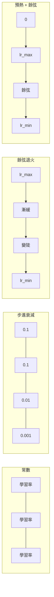
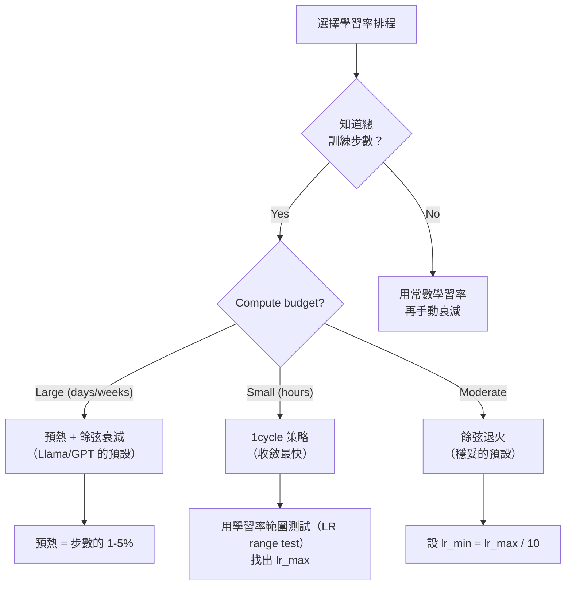
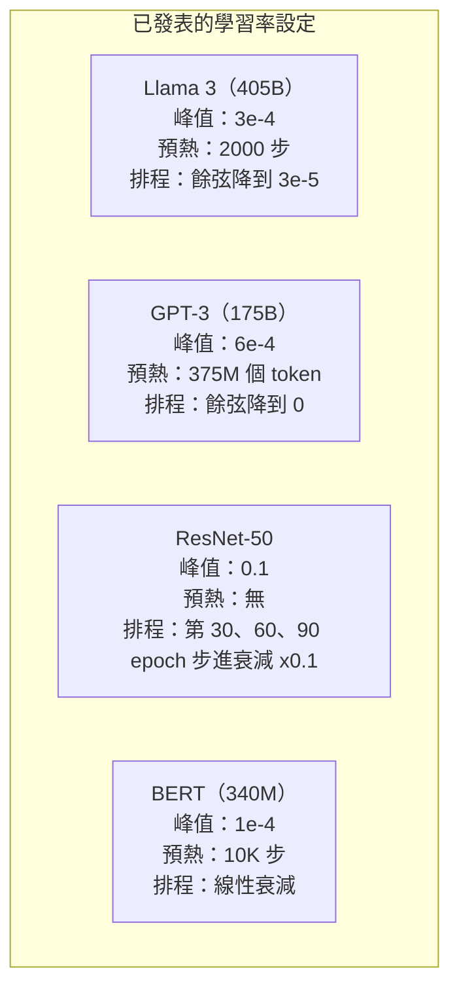

# 學習率排程（learning rate schedule）與預熱（warmup）

> 學習率（learning rate）是最重要的那一個超參數（hyperparameter）。不是架構（architecture）。不是資料集（dataset）大小。不是活化函數（activation function）。是學習率。如果你只調校一個東西，就調校這個。

**Type:** Build
**Languages:** Python
**Prerequisites:** Lesson 03.06 (Optimizers), Lesson 03.08 (Weight Initialization)
**Time:** ~90 minutes

## Learning Objectives｜學習目標

- 從零實作常數、步進衰減（step decay）、餘弦退火（cosine annealing）、預熱加餘弦，以及 1cycle 策略（1cycle policy）
- 示範選學習率的三種失敗：發散（divergence，學習率太高）、停滯（stalling，學習率太低）、振盪（oscillation，沒有衰減）
- 說明為什麼 Adam 這類最佳化器（optimizer）需要預熱，以及它怎麼讓訓練初期穩定
- 在同一個任務上比較五種排程的收斂（convergence）速度，並依給定的訓練預算選一個

## The Problem｜問題

把學習率設成 0.1。訓練發散，損失（loss）在 3 步之內衝到無限大。設成 0.0001。訓練慢得像在爬，100 個 epoch（訓練週期）之後，模型（model）幾乎還沒離開隨機的起點。設成 0.01。前 50 個 epoch 還行，然後損失在一個最小值附近來回振盪，因為步子太大，永遠到不了。

最好的學習率不是常數。它在訓練中會變。一開始你要大步，才快點推進。訓練後期你要很小的步，才能收斂到尖銳極小值（sharp minimum）。準確率 90% 的模型和 95% 的模型，差別常常只是排程。

近三年發表的每個主要模型都用學習率排程。Llama 3 的峰值學習率是 3e-4，預熱 2000 步，再餘弦衰減到 3e-5。GPT-3 的學習率是 6e-4，預熱跨過 3.75 億個 token。這些不是隨便選的。它們是花了好幾百萬美元的超參數搜尋做出來的。

你得懂排程，因為預設不會剛好適合你的問題。fine-tuning 一個預訓練（pretrained）模型時，合適的排程和從頭訓練不一樣。批次（batch）變大時，預熱的長度也要改。訓練在第 10,000 步壞掉時，你得分辨是排程的問題，還是別的問題。

## The Concept｜核心概念

### 常數學習率

最簡單的作法。挑一個數字，每一步都用它。

```
lr(t) = lr_0
```

很少是最好的。它不是對訓練結尾太高，在最小值附近振盪，就是對開頭太低，把算力浪費在很小的步上。小模型和除錯還可以。任何要訓練超過一小時的東西，這都是很糟的選擇。

### 步進衰減

ResNet 那個時代的老派作法。在固定的 epoch 把學習率乘上一個係數，通常是 0.1，也就是降成十分之一。

```
lr(t) = lr_0 * gamma^(floor(epoch / step_size))
```

gamma = 0.1、step_size = 30 的意思是：每 30 個 epoch，學習率變成十分之一。ResNet-50 就是這樣：lr=0.1，在第 30、60、90 個 epoch 各降 10 倍。

問題是：最好的衰減點取決於資料集和架構。換一個問題，你就得重新調校什麼時候降。轉折很突然。學習率一下子改變時，損失可能突然衝高。

### 餘弦退火

沿著一條餘弦曲線，從最高學習率平滑降到最低：

```
lr(t) = lr_min + 0.5 * (lr_max - lr_min) * (1 + cos(pi * t / T))
```

t 是目前的步，T 是總步數。

t=0 時，餘弦項是 1，所以 lr = lr_max。t=T 時，餘弦項是 -1，所以 lr = lr_min。衰減一開始很緩，中段加快，接近結束又變緩。

這是現在多數訓練的預設。除了 lr_max 和 lr_min，沒有別的超參數要調校。餘弦的形狀符合一個經驗觀察：大部分學習發生在訓練中段。那段關鍵時間，你要的是還算合理的步長。

### 預熱：為什麼一開始要小

Adam 和其他適應性最佳化器會維護梯度（gradient）平均數（mean）和變異數（variance）的持續估計。第 0 步時，這些估計被設成 0。頭幾次梯度更新靠的是沒有意義的統計。如果這段時間學習率很大，模型會走出又大、方向又差的步。

預熱修的就是這個。從一個很小的學習率開始，常常是 lr_max / warmup_steps，甚至是 0，再在前 N 步線性拉到 lr_max。等你到達完整學習率時，Adam 的統計已經穩定了。

```
lr(t) = lr_max * (t / warmup_steps)     for t < warmup_steps
```

典型的預熱是總訓練步數的 1-5%。Llama 3 大約訓練了 1.8 兆個 token，預熱 2000 步。GPT-3 預熱跨過 3.75 億個 token。

### 線性預熱 + 餘弦衰減

現在的預設。先線性爬升，再用餘弦衰減：

```
if t < warmup_steps:
    lr(t) = lr_max * (t / warmup_steps)
else:
    progress = (t - warmup_steps) / (total_steps - warmup_steps)
    lr(t) = lr_min + 0.5 * (lr_max - lr_min) * (1 + cos(pi * progress))
```

Llama、GPT、PaLM，以及多數現代 transformer 用的就是這個。預熱避免初期不穩。餘弦衰減讓模型收斂到一個好的極小值。

### 1cycle 策略

Leslie Smith 在 2018 年的發現：訓練前半把學習率從低拉到高，後半再拉回來。這違反直覺。為什麼訓練走到一半還要把學習率加大？

理論是：高學習率會在最佳化（optimization）軌跡上加雜訊，作用像正則化（regularization）。爬升段裡，模型在損失地景（loss landscape）裡探索得更廣，找到更好的盆地。下降段再在找到的最好盆地裡細修。

```
Phase 1 (0 to T/2):    lr ramps from lr_max/25 to lr_max
Phase 2 (T/2 to T):    lr ramps from lr_max to lr_max/10000
```

在固定的算力預算下，1cycle 常常比餘弦退火收斂得更快。代價是你得事先知道總步數。

### 排程的形狀



### 決策流程



### 已發表模型的真實數字



```figure
lr-schedule
```

## Build It｜動手實作

### 步驟 1：排程函式

每個函式吃進目前的步，回傳那一步的學習率。

```python
import math


def constant_schedule(step, lr=0.01, **kwargs):
    return lr


def step_decay_schedule(step, lr=0.1, step_size=100, gamma=0.1, **kwargs):
    return lr * (gamma ** (step // step_size))


def cosine_schedule(step, lr=0.01, total_steps=1000, lr_min=1e-5, **kwargs):
    if step >= total_steps:
        return lr_min
    return lr_min + 0.5 * (lr - lr_min) * (1 + math.cos(math.pi * step / total_steps))


def warmup_cosine_schedule(step, lr=0.01, total_steps=1000, warmup_steps=100, lr_min=1e-5, **kwargs):
    if total_steps <= warmup_steps:
        return lr * (step / max(warmup_steps, 1))
    if step < warmup_steps:
        return lr * step / warmup_steps
    progress = (step - warmup_steps) / (total_steps - warmup_steps)
    return lr_min + 0.5 * (lr - lr_min) * (1 + math.cos(math.pi * progress))


def one_cycle_schedule(step, lr=0.01, total_steps=1000, **kwargs):
    mid = max(total_steps // 2, 1)
    if step < mid:
        return (lr / 25) + (lr - lr / 25) * step / mid
    else:
        progress = (step - mid) / max(total_steps - mid, 1)
        return lr * (1 - progress) + (lr / 10000) * progress
```

### 步驟 2：把所有排程畫出來

印一張文字圖，顯示每個排程在訓練中怎麼變。

```python
def visualize_schedule(name, schedule_fn, total_steps=500, **kwargs):
    steps = list(range(0, total_steps, total_steps // 20))
    if total_steps - 1 not in steps:
        steps.append(total_steps - 1)

    lrs = [schedule_fn(s, total_steps=total_steps, **kwargs) for s in steps]
    max_lr = max(lrs) if max(lrs) > 0 else 1.0

    print(f"\n{name}:")
    for s, lr_val in zip(steps, lrs):
        bar_len = int(lr_val / max_lr * 40)
        bar = "#" * bar_len
        print(f"  Step {s:4d}: lr={lr_val:.6f} {bar}")
```

### 步驟 3：訓練用的網路

圓形資料集上的簡單兩層網路，和前面幾課一樣，但這次改的是排程。

```python
import random


def sigmoid(x):
    x = max(-500, min(500, x))
    return 1.0 / (1.0 + math.exp(-x))


def relu(x):
    return max(0.0, x)


def relu_deriv(x):
    return 1.0 if x > 0 else 0.0


def make_circle_data(n=200, seed=42):
    random.seed(seed)
    data = []
    for _ in range(n):
        x = random.uniform(-2, 2)
        y = random.uniform(-2, 2)
        label = 1.0 if x * x + y * y < 1.5 else 0.0
        data.append(([x, y], label))
    return data


def train_with_schedule(schedule_fn, schedule_name, data, epochs=300, base_lr=0.05, **kwargs):
    random.seed(0)
    hidden_size = 8
    total_steps = epochs * len(data)

    std = math.sqrt(2.0 / 2)
    w1 = [[random.gauss(0, std) for _ in range(2)] for _ in range(hidden_size)]
    b1 = [0.0] * hidden_size
    w2 = [random.gauss(0, std) for _ in range(hidden_size)]
    b2 = 0.0

    step = 0
    epoch_losses = []

    for epoch in range(epochs):
        total_loss = 0
        correct = 0

        for x, target in data:
            lr = schedule_fn(step, lr=base_lr, total_steps=total_steps, **kwargs)

            z1 = []
            h = []
            for i in range(hidden_size):
                z = w1[i][0] * x[0] + w1[i][1] * x[1] + b1[i]
                z1.append(z)
                h.append(relu(z))

            z2 = sum(w2[i] * h[i] for i in range(hidden_size)) + b2
            out = sigmoid(z2)

            error = out - target
            d_out = error * out * (1 - out)

            for i in range(hidden_size):
                d_h = d_out * w2[i] * relu_deriv(z1[i])
                w2[i] -= lr * d_out * h[i]
                for j in range(2):
                    w1[i][j] -= lr * d_h * x[j]
                b1[i] -= lr * d_h
            b2 -= lr * d_out

            total_loss += (out - target) ** 2
            if (out >= 0.5) == (target >= 0.5):
                correct += 1
            step += 1

        avg_loss = total_loss / len(data)
        accuracy = correct / len(data) * 100
        epoch_losses.append(avg_loss)

    return epoch_losses
```

### 步驟 4：比較所有排程

用每個排程訓練同一個網路，比較最終損失和收斂的樣子。

```python
def compare_schedules(data):
    configs = [
        ("Constant", constant_schedule, {}),
        ("Step Decay", step_decay_schedule, {"step_size": 15000, "gamma": 0.1}),
        ("Cosine", cosine_schedule, {"lr_min": 1e-5}),
        ("Warmup+Cosine", warmup_cosine_schedule, {"warmup_steps": 3000, "lr_min": 1e-5}),
        ("1cycle", one_cycle_schedule, {}),
    ]

    print(f"\n{'Schedule':<20} {'Start Loss':>12} {'Mid Loss':>12} {'End Loss':>12} {'Best Loss':>12}")
    print("-" * 70)

    for name, schedule_fn, extra_kwargs in configs:
        losses = train_with_schedule(schedule_fn, name, data, epochs=300, base_lr=0.05, **extra_kwargs)
        mid_idx = len(losses) // 2
        best = min(losses)
        print(f"{name:<20} {losses[0]:>12.6f} {losses[mid_idx]:>12.6f} {losses[-1]:>12.6f} {best:>12.6f}")
```

### 步驟 5：學習率太高和太低

示範三種失敗：太高會發散，太低像在爬，剛剛好才對。

```python
def lr_sensitivity(data):
    learning_rates = [1.0, 0.1, 0.01, 0.001, 0.0001]

    print("\nLR Sensitivity (constant schedule, 100 epochs):")
    print(f"  {'LR':>10} {'Start Loss':>12} {'End Loss':>12} {'Status':>15}")
    print("  " + "-" * 52)

    for lr in learning_rates:
        losses = train_with_schedule(constant_schedule, f"lr={lr}", data, epochs=100, base_lr=lr)
        start = losses[0]
        end = losses[-1]

        if end > start or math.isnan(end) or end > 1.0:
            status = "DIVERGED"
        elif end > start * 0.9:
            status = "BARELY MOVED"
        elif end < 0.15:
            status = "CONVERGED"
        else:
            status = "LEARNING"

        end_str = f"{end:.6f}" if not math.isnan(end) else "NaN"
        print(f"  {lr:>10.4f} {start:>12.6f} {end_str:>12} {status:>15}")
```

## Use It｜實際應用

PyTorch 在 `torch.optim.lr_scheduler` 裡提供排程器。

```python
import torch
import torch.optim as optim
from torch.optim.lr_scheduler import CosineAnnealingLR, OneCycleLR, StepLR

model = nn.Sequential(nn.Linear(10, 64), nn.ReLU(), nn.Linear(64, 1))
optimizer = optim.Adam(model.parameters(), lr=3e-4)

scheduler = CosineAnnealingLR(optimizer, T_max=1000, eta_min=1e-5)

for step in range(1000):
    loss = train_step(model, optimizer)
    scheduler.step()
```

預熱加餘弦可以用 lambda 排程器，或 HuggingFace 的 `get_cosine_schedule_with_warmup`：

```python
from transformers import get_cosine_schedule_with_warmup

scheduler = get_cosine_schedule_with_warmup(
    optimizer,
    num_warmup_steps=2000,
    num_training_steps=100000,
)
```

多數 Llama 和 GPT 的 fine-tuning 腳本用的就是這個 HuggingFace 函式。拿不準的時候，用預熱加餘弦，預熱設成總步數的 3-5%。幾乎什麼都適用。

## Ship It｜交付成果

本課會產出：

- `outputs/prompt-lr-schedule-advisor.md`：一份 prompt，依你的訓練設定建議合適的學習率排程和超參數

## Exercises｜練習

1. 實作指數衰減：lr(t) = lr_0 * gamma^t，gamma = 0.999。在圓形資料集上和餘弦退火比較。
2. 實作學習率範圍測試（learning rate range test），Leslie Smith 的方法：訓練幾百步，同時把學習率從 1e-7 指數加大到 1。畫出損失對學習率。最好的最大學習率，就在損失開始上升之前。
3. 用預熱加餘弦訓練，但改預熱長度：總步數的 0%、1%、5%、10%、20%。找出訓練最穩的甜蜜點（sweet spot）。
4. 實作帶暖重啟的餘弦退火（cosine annealing with warm restarts），也就是 SGDR：每 T 步把學習率重置回 lr_max，再衰減一次。在較長的訓練上和標準餘弦比較。
5. 做一個「schedule surgeon」：監測訓練損失，損失穩定後自動從預熱切到餘弦；損失停滯太久就把學習率降低。

## Key Terms｜關鍵術語

| 術語 | 常見說法 | 實際意義 |
|------|----------------|----------------------|
| 學習率 | 「模型學多快」 | 乘在梯度上、決定參數（parameter）更新多大的純量（scalar） |
| 排程 | 「讓學習率隨時間變」 | 把訓練步對應到學習率的函式，用來讓收斂更好 |
| 預熱 | 「先用小學習率」 | 在前 N 步把學習率從接近 0 線性拉到目標值，讓最佳化器的統計穩定下來 |
| 餘弦退火 | 「學習率平滑下降」 | 沿著餘弦曲線，在訓練中把學習率從 lr_max 降到 lr_min |
| 步進衰減 | 「到了里程碑就把學習率砍下來」 | 在固定的 epoch 間隔把學習率乘上一個倍數，通常是 0.1 |
| 1cycle 策略 | 「先升再降」 | Leslie Smith 的方法：一個週期內先把學習率拉高再拉低，收斂更快 |
| 學習率範圍測試 | 「找出最好的學習率」 | 短暫訓練，同時把學習率加大，找出損失開始發散的那個值 |
| 餘弦退火加暖重啟（cosine annealing with warm restarts） | 「重置再重來」 | 週期性把學習率重置回 lr_max，再衰減一次（SGDR） |
| eta min | 「學習率的地板」 | 排程會衰減到的最小學習率 |
| 峰值學習率 | 「最大的學習率」 | 訓練中達到的最高學習率，通常在預熱之後 |

## Further Reading｜延伸閱讀

- Loshchilov & Hutter, "SGDR: Stochastic Gradient Descent with Warm Restarts" (2017)——提出餘弦退火和暖重啟
- Smith, "Super-Convergence: Very Fast Training of Neural Networks Using Large Learning Rates" (2018)——1cycle 策略的論文
- Touvron et al., "Llama 2: Open Foundation and Fine-Tuned Chat Models" (2023)——記錄了大規模使用的預熱加餘弦排程
- Goyal et al., "Accurate, Large Minibatch SGD: Training ImageNet in 1 Hour" (2017)——大批次訓練的線性縮放規則和預熱
