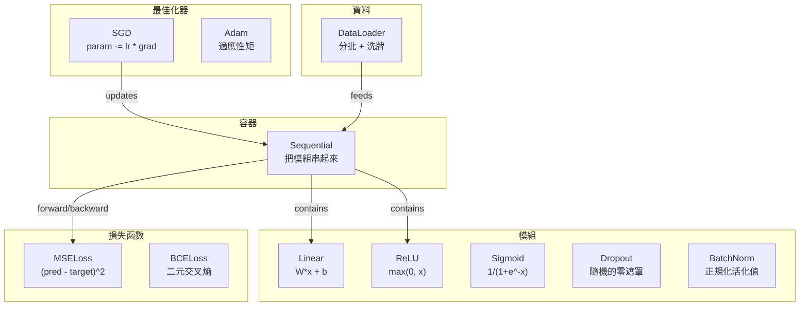
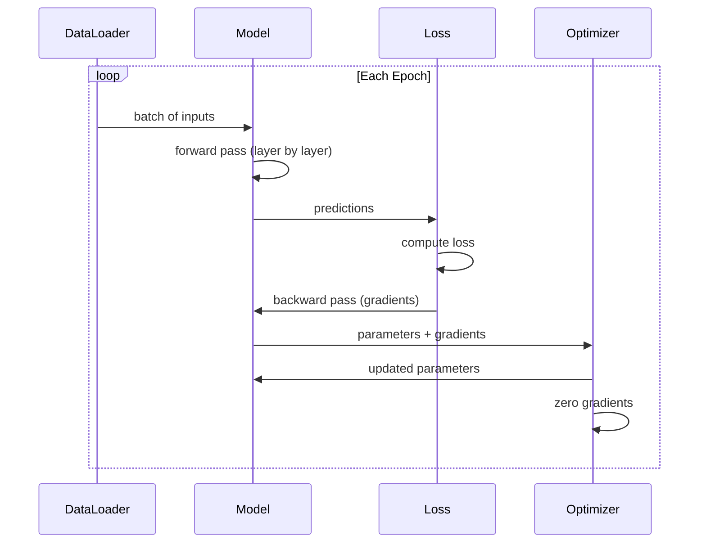
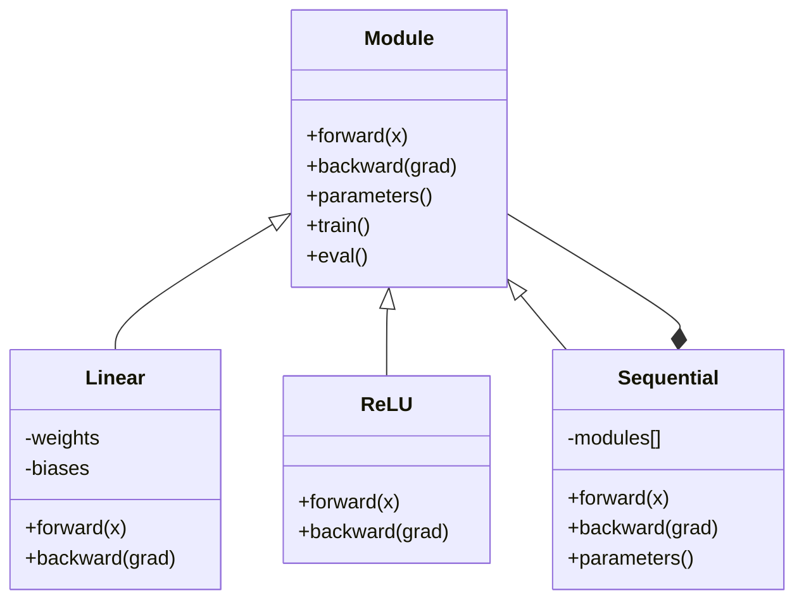

# 打造你自己的迷你框架（framework）

> 你已經做過神經元（neuron）、層（layer）、網路（network）、反向傳播（backpropagation）、活化函數（activation function）、損失函數（loss function）、最佳化器（optimizer）、正則化（regularization）、初始化（initialization）和學習率排程（learning rate schedule）。它們都還是分開的零件。現在把它們接成一個框架。不是 PyTorch。不是 TensorFlow。是你的。

**Type:** Build
**Languages:** Python
**Prerequisites:** All of Phase 03 (Lessons 01-09)
**Time:** ~120 minutes

## Learning Objectives｜學習目標

- 打造一個完整的深度學習（deep learning）框架，大約 500 行，包含 Module、Linear、ReLU、Sigmoid、Dropout、BatchNorm、Sequential、損失函數、最佳化器和 DataLoader
- 說明 Module 這個抽象，也就是 forward、backward、parameters，以及為什麼必須在 train 和 eval 模式之間切換
- 把所有零件接成一個能動的訓練迴圈（training loop），在圓形分類上訓練一個 4 層網路
- 把框架裡的每個零件對到 PyTorch 的對應物：nn.Module、nn.Sequential、optim.Adam、DataLoader

## The Problem｜問題

十課的積木散在不同檔案裡。這裡一個 `Value` 類別，那裡一個訓練迴圈，權重初始化（weight initialization）在另一個檔案，學習率排程又在另一個。要訓練一個網路，你得從五課裡複製貼上，再手動接起來。

框架解決的就是這件事。PyTorch 給你 `nn.Module`、`nn.Sequential`、`optim.Adam`、`DataLoader`，以及把它們綁在一起的訓練迴圈模式。TensorFlow 給你 `keras.Layer`、`keras.Sequential`、`keras.optimizers.Adam`。這些不是魔法。它們是組織方式，讓你能定義、訓練、評估網路，不必每次把底層接線重做一次。

你要用大約 500 行 Python 做同樣的東西。不用 numpy。沒有外部依賴。這個框架可以定義任何前饋（feedforward）網路，用 SGD 或 Adam 訓練，把資料分批，套上 dropout 和批次正規化（batch normalization），用任何活化函數，排程學習率（learning rate）。

做完之後，你會確切知道在 PyTorch 裡寫下 `model = nn.Sequential(...)` 時發生什麼。你會知道為什麼有 `model.train()` 和 `model.eval()`。你會知道為什麼 `optimizer.zero_grad()` 是獨立的一次呼叫。你會全部懂，因為全部是你做的。

## The Concept｜核心概念

### 模組抽象

PyTorch 裡的每一層都繼承自 `nn.Module`。一個 Module 有三件事要做：

1. **forward()**：給定輸入，算出輸出
2. **parameters()**：回傳所有可訓練的權重（weight）
3. **backward()**：計算梯度（gradient）。PyTorch 裡由 autograd（自動微分）處理，我們這裡是明確寫出來的

Linear 層是一個 Module。ReLU 活化函數是一個 Module。dropout 層是一個 Module。批次正規化層是一個 Module。介面都一樣。

### Sequential 容器

`nn.Sequential` 把多個 Module 串起來。前向傳遞（forward pass）：資料先過 Module 1，再過 Module 2，再過 Module 3。反向傳遞（backward pass）：把這條鏈倒過來。容器本身也是一個 Module，它有 forward()、parameters() 和 backward()。這是組合模式（composite pattern）：一串 Module 本身也是一個 Module。

### 訓練模式和評估模式

Dropout 在訓練時隨機把神經元變成 0，評估時則原樣送出去。批次正規化在訓練時用批次統計，評估時用移動平均。`train()` 和 `eval()` 方法切換這個行為。每個 Module 都有一個 `training` 旗標。

### 最佳化器

最佳化器用梯度更新參數（parameter）。SGD 是 `param -= lr * grad`。Adam 維護動量（momentum）和變異數（variance）的估計，然後更新。最佳化器不知道網路的架構（architecture）。它只看到一份攤平的參數清單，以及它們的梯度。

### DataLoader

分批有兩個理由。第一，問題很大時，整個資料集（dataset）放不進記憶體（memory）。第二，小批次梯度下降法（mini-batch gradient descent）帶來的雜訊，有助於逃出局部極小值（local minimum）。DataLoader 把資料切成批次（batch），並且可以在每個 epoch（訓練週期）之間洗牌。

### 框架架構



### 訓練迴圈



### 模組階層



```figure
gradient-clipping
```

## Build It｜動手實作

### 步驟 1：Module 基底類別

每一層都要實作的抽象介面。

```python
class Module:
    def __init__(self):
        self.training = True

    def forward(self, x):
        raise NotImplementedError

    def backward(self, grad):
        raise NotImplementedError

    def parameters(self):
        return []

    def train(self):
        self.training = True

    def eval(self):
        self.training = False
```

### 步驟 2：Linear 層

最基本的積木。它存放權重和偏置（bias），前向算 Wx + b，反向算權重和輸入的梯度。

```python
import math
import random


class Linear(Module):
    def __init__(self, fan_in, fan_out):
        super().__init__()
        std = math.sqrt(2.0 / fan_in)
        self.weights = [[random.gauss(0, std) for _ in range(fan_in)] for _ in range(fan_out)]
        self.biases = [0.0] * fan_out
        self.weight_grads = [[0.0] * fan_in for _ in range(fan_out)]
        self.bias_grads = [0.0] * fan_out
        self.fan_in = fan_in
        self.fan_out = fan_out
        self.input = None

    def forward(self, x):
        self.input = x
        output = []
        for i in range(self.fan_out):
            val = self.biases[i]
            for j in range(self.fan_in):
                val += self.weights[i][j] * x[j]
            output.append(val)
        return output

    def backward(self, grad):
        input_grad = [0.0] * self.fan_in
        for i in range(self.fan_out):
            self.bias_grads[i] += grad[i]
            for j in range(self.fan_in):
                self.weight_grads[i][j] += grad[i] * self.input[j]
                input_grad[j] += grad[i] * self.weights[i][j]
        return input_grad

    def parameters(self):
        params = []
        for i in range(self.fan_out):
            for j in range(self.fan_in):
                params.append((self.weights, i, j, self.weight_grads))
            params.append((self.biases, i, None, self.bias_grads))
        return params
```

### 步驟 3：活化函數模組

把 ReLU、sigmoid 函數和 tanh 做成 Module。每一個都把反向傳遞需要的東西暫存起來。

```python
class ReLU(Module):
    def __init__(self):
        super().__init__()
        self.mask = None

    def forward(self, x):
        self.mask = [1.0 if v > 0 else 0.0 for v in x]
        return [max(0.0, v) for v in x]

    def backward(self, grad):
        return [g * m for g, m in zip(grad, self.mask)]


class Sigmoid(Module):
    def __init__(self):
        super().__init__()
        self.output = None

    def forward(self, x):
        self.output = []
        for v in x:
            v = max(-500, min(500, v))
            self.output.append(1.0 / (1.0 + math.exp(-v)))
        return self.output

    def backward(self, grad):
        return [g * o * (1 - o) for g, o in zip(grad, self.output)]


class Tanh(Module):
    def __init__(self):
        super().__init__()
        self.output = None

    def forward(self, x):
        self.output = [math.tanh(v) for v in x]
        return self.output

    def backward(self, grad):
        return [g * (1 - o * o) for g, o in zip(grad, self.output)]
```

### 步驟 4：Dropout 模組

訓練時隨機把元素變成 0。剩下的元素乘上 1/(1-p)，期望值才維持不變。評估時什麼都不做。

```python
class Dropout(Module):
    def __init__(self, p=0.5):
        super().__init__()
        self.p = p
        self.mask = None

    def forward(self, x):
        if not self.training:
            return x
        self.mask = [0.0 if random.random() < self.p else 1.0 / (1 - self.p) for _ in x]
        return [v * m for v, m in zip(x, self.mask)]

    def backward(self, grad):
        if self.mask is None:
            return grad
        return [g * m for g, m in zip(grad, self.mask)]
```

### 步驟 5：BatchNorm 模組

在一個批次裡，依每個特徵（feature）把活化值正規化（normalization）成平均數（mean）0、變異數 1。評估模式則維護移動統計。

```python
class BatchNorm(Module):
    def __init__(self, size, momentum=0.1, eps=1e-5):
        super().__init__()
        self.size = size
        self.gamma = [1.0] * size
        self.beta = [0.0] * size
        self.gamma_grads = [0.0] * size
        self.beta_grads = [0.0] * size
        self.running_mean = [0.0] * size
        self.running_var = [1.0] * size
        self.momentum = momentum
        self.eps = eps
        self.x_norm = None
        self.std_inv = None
        self.batch_input = None

    def forward_batch(self, batch):
        batch_size = len(batch)
        output_batch = []

        if self.training:
            mean = [0.0] * self.size
            for sample in batch:
                for j in range(self.size):
                    mean[j] += sample[j]
            mean = [m / batch_size for m in mean]

            var = [0.0] * self.size
            for sample in batch:
                for j in range(self.size):
                    var[j] += (sample[j] - mean[j]) ** 2
            var = [v / batch_size for v in var]

            self.std_inv = [1.0 / math.sqrt(v + self.eps) for v in var]

            self.x_norm = []
            self.batch_input = batch
            for sample in batch:
                normed = [(sample[j] - mean[j]) * self.std_inv[j] for j in range(self.size)]
                self.x_norm.append(normed)
                output = [self.gamma[j] * normed[j] + self.beta[j] for j in range(self.size)]
                output_batch.append(output)

            for j in range(self.size):
                self.running_mean[j] = (1 - self.momentum) * self.running_mean[j] + self.momentum * mean[j]
                self.running_var[j] = (1 - self.momentum) * self.running_var[j] + self.momentum * var[j]
        else:
            std_inv = [1.0 / math.sqrt(v + self.eps) for v in self.running_var]
            for sample in batch:
                normed = [(sample[j] - self.running_mean[j]) * std_inv[j] for j in range(self.size)]
                output = [self.gamma[j] * normed[j] + self.beta[j] for j in range(self.size)]
                output_batch.append(output)

        return output_batch

    def forward(self, x):
        result = self.forward_batch([x])
        return result[0]

    def backward(self, grad):
        if self.x_norm is None:
            return grad
        for j in range(self.size):
            self.gamma_grads[j] += self.x_norm[0][j] * grad[j]
            self.beta_grads[j] += grad[j]
        return [grad[j] * self.gamma[j] * self.std_inv[j] for j in range(self.size)]

    def parameters(self):
        params = []
        for j in range(self.size):
            params.append((self.gamma, j, None, self.gamma_grads))
            params.append((self.beta, j, None, self.beta_grads))
        return params
```

### 步驟 6：Sequential 容器

把模組串起來。前向從左到右，反向從右到左。

```python
class Sequential(Module):
    def __init__(self, *modules):
        super().__init__()
        self.modules = list(modules)

    def forward(self, x):
        for module in self.modules:
            x = module.forward(x)
        return x

    def backward(self, grad):
        for module in reversed(self.modules):
            grad = module.backward(grad)
        return grad

    def parameters(self):
        params = []
        for module in self.modules:
            params.extend(module.parameters())
        return params

    def train(self):
        self.training = True
        for module in self.modules:
            module.train()

    def eval(self):
        self.training = False
        for module in self.modules:
            module.eval()
```

### 步驟 7：損失函數

MSE 和二元交叉熵（binary cross-entropy）。每一個都回傳損失值，並提供 backward()，回傳梯度。

```python
class MSELoss:
    def __call__(self, predicted, target):
        self.predicted = predicted
        self.target = target
        n = len(predicted)
        self.loss = sum((p - t) ** 2 for p, t in zip(predicted, target)) / n
        return self.loss

    def backward(self):
        n = len(self.predicted)
        return [2 * (p - t) / n for p, t in zip(self.predicted, self.target)]


class BCELoss:
    def __call__(self, predicted, target):
        self.predicted = predicted
        self.target = target
        eps = 1e-7
        n = len(predicted)
        self.loss = 0
        for p, t in zip(predicted, target):
            p = max(eps, min(1 - eps, p))
            self.loss += -(t * math.log(p) + (1 - t) * math.log(1 - p))
        self.loss /= n
        return self.loss

    def backward(self):
        eps = 1e-7
        n = len(self.predicted)
        grads = []
        for p, t in zip(self.predicted, self.target):
            p = max(eps, min(1 - eps, p))
            grads.append((-t / p + (1 - t) / (1 - p)) / n)
        return grads
```

### 步驟 8：SGD 和 Adam 最佳化器

兩者都接收一份參數清單，用梯度更新權重。

```python
class SGD:
    def __init__(self, parameters, lr=0.01):
        self.params = parameters
        self.lr = lr

    def step(self):
        for container, i, j, grad_container in self.params:
            if j is not None:
                container[i][j] -= self.lr * grad_container[i][j]
            else:
                container[i] -= self.lr * grad_container[i]

    def zero_grad(self):
        for container, i, j, grad_container in self.params:
            if j is not None:
                grad_container[i][j] = 0.0
            else:
                grad_container[i] = 0.0


class Adam:
    def __init__(self, parameters, lr=0.001, beta1=0.9, beta2=0.999, eps=1e-8):
        self.params = parameters
        self.lr = lr
        self.beta1 = beta1
        self.beta2 = beta2
        self.eps = eps
        self.t = 0
        self.m = [0.0] * len(parameters)
        self.v = [0.0] * len(parameters)

    def step(self):
        self.t += 1
        for idx, (container, i, j, grad_container) in enumerate(self.params):
            if j is not None:
                g = grad_container[i][j]
            else:
                g = grad_container[i]

            self.m[idx] = self.beta1 * self.m[idx] + (1 - self.beta1) * g
            self.v[idx] = self.beta2 * self.v[idx] + (1 - self.beta2) * g * g

            m_hat = self.m[idx] / (1 - self.beta1 ** self.t)
            v_hat = self.v[idx] / (1 - self.beta2 ** self.t)

            update = self.lr * m_hat / (math.sqrt(v_hat) + self.eps)

            if j is not None:
                container[i][j] -= update
            else:
                container[i] -= update

    def zero_grad(self):
        for container, i, j, grad_container in self.params:
            if j is not None:
                grad_container[i][j] = 0.0
            else:
                grad_container[i] = 0.0
```

### 步驟 9：DataLoader

把資料切成批次，每個 epoch 可以選擇洗牌。

```python
class DataLoader:
    def __init__(self, data, batch_size=32, shuffle=True):
        self.data = data
        self.batch_size = batch_size
        self.shuffle = shuffle

    def __iter__(self):
        indices = list(range(len(self.data)))
        if self.shuffle:
            random.shuffle(indices)
        for start in range(0, len(indices), self.batch_size):
            batch_indices = indices[start:start + self.batch_size]
            batch = [self.data[i] for i in batch_indices]
            inputs = [item[0] for item in batch]
            targets = [item[1] for item in batch]
            yield inputs, targets

    def __len__(self):
        return (len(self.data) + self.batch_size - 1) // self.batch_size
```

### 步驟 10：在圓形分類上訓練一個 4 層網路

把所有東西接起來。定義模型（model），選一個損失，選一個最佳化器，跑訓練迴圈。

```python
def make_circle_data(n=500, seed=42):
    random.seed(seed)
    data = []
    for _ in range(n):
        x = random.uniform(-2, 2)
        y = random.uniform(-2, 2)
        label = 1.0 if x * x + y * y < 1.5 else 0.0
        data.append(([x, y], [label]))
    return data


def train():
    random.seed(42)

    model = Sequential(
        Linear(2, 16),
        ReLU(),
        Linear(16, 16),
        ReLU(),
        Linear(16, 8),
        ReLU(),
        Linear(8, 1),
        Sigmoid(),
    )

    criterion = BCELoss()
    optimizer = Adam(model.parameters(), lr=0.01)

    data = make_circle_data(500)
    split = int(len(data) * 0.8)
    train_data = data[:split]
    test_data = data[split:]

    loader = DataLoader(train_data, batch_size=16, shuffle=True)

    model.train()

    for epoch in range(100):
        total_loss = 0
        total_correct = 0
        total_samples = 0

        for batch_inputs, batch_targets in loader:
            batch_loss = 0
            for x, t in zip(batch_inputs, batch_targets):
                pred = model.forward(x)
                loss = criterion(pred, t)
                batch_loss += loss

                optimizer.zero_grad()
                grad = criterion.backward()
                model.backward(grad)
                optimizer.step()

                predicted_class = 1.0 if pred[0] >= 0.5 else 0.0
                if predicted_class == t[0]:
                    total_correct += 1
                total_samples += 1

            total_loss += batch_loss

        avg_loss = total_loss / total_samples
        accuracy = total_correct / total_samples * 100

        if epoch % 10 == 0 or epoch == 99:
            print(f"Epoch {epoch:3d} | Loss: {avg_loss:.6f} | Train Accuracy: {accuracy:.1f}%")

    model.eval()
    correct = 0
    for x, t in test_data:
        pred = model.forward(x)
        predicted_class = 1.0 if pred[0] >= 0.5 else 0.0
        if predicted_class == t[0]:
            correct += 1
    test_accuracy = correct / len(test_data) * 100
    print(f"\nTest Accuracy: {test_accuracy:.1f}% ({correct}/{len(test_data)})")

    return model, test_accuracy
```

## Use It｜實際應用

下面是你剛剛做的東西在 PyTorch 裡的對應：

```python
import torch
import torch.nn as nn
from torch.utils.data import DataLoader, TensorDataset

model = nn.Sequential(
    nn.Linear(2, 16),
    nn.ReLU(),
    nn.Linear(16, 16),
    nn.ReLU(),
    nn.Linear(16, 8),
    nn.ReLU(),
    nn.Linear(8, 1),
    nn.Sigmoid(),
)

criterion = nn.BCELoss()
optimizer = torch.optim.Adam(model.parameters(), lr=0.01)

for epoch in range(100):
    model.train()
    for inputs, targets in dataloader:
        optimizer.zero_grad()
        predictions = model(inputs)
        loss = criterion(predictions, targets)
        loss.backward()
        optimizer.step()

    model.eval()
    with torch.no_grad():
        test_predictions = model(test_inputs)
```

結構完全一樣。`Sequential`、`Linear`、`ReLU`、`Sigmoid`、`BCELoss`、`Adam`、`zero_grad`、`backward`、`step`、`train`、`eval`。每個概念都是一對一。差別在於 PyTorch 自動處理 autograd，不必在每個模組裡實作 backward()，可以跑在 GPU 上，而且已經最佳化了很多年。但骨架是一樣的。

現在你看到 PyTorch 程式碼，每一行在做什麼都清楚。懂這件事，就是這課的全部目的。

## Ship It｜交付成果

本課會產出：

- `outputs/prompt-framework-architect.md`：一份 prompt，用框架的抽象來設計神經網路（neural network）架構

## Exercises｜練習

1. 加上 `SoftmaxCrossEntropyLoss` 類別，給多類別分類（multi-class classification）用。對預測做 softmax，計算交叉熵損失，並處理合併後的反向傳遞。在一個 3 類別的螺旋資料集上測試。
2. 在最佳化器裡做學習率排程：加上 `set_lr()` 方法，接上第 09 課的餘弦排程。用預熱（warmup）加餘弦訓練圓形分類器，和常數學習率比較。
3. 給 Sequential 加上 `save()` 和 `load()`，把所有權重序列化成 JSON 檔，再讀回來。確認載入後的模型預測和原本相同。
4. 在 Adam 最佳化器裡實作權重衰減（weight decay），也就是 L2 正則化。加上 `weight_decay` 參數，每一步把權重往 0 縮。比較 decay=0 和 decay=0.01 的訓練。
5. 把逐樣本的訓練迴圈換成真正的小批次梯度累積：在一個批次裡把所有樣本的梯度累加，再除以批次大小，然後只走一步最佳化器。量這會不會改變收斂（convergence）速度。

## Key Terms｜關鍵術語

| 術語 | 常見說法 | 實際意義 |
|------|----------------|----------------------|
| Module | 「一層」 | 框架裡的基底抽象：任何有 forward()、backward() 和 parameters() 的東西 |
| Sequential | 「按順序把層疊起來」 | 把模組串起來的容器。前向依序套用，反向則倒著走 |
| 前向傳遞 | 「把網路跑一次」 | 依序把輸入送過每個模組，算出輸出 |
| 反向傳遞 | 「算梯度」 | 把損失的梯度倒著送過每個模組，算出參數的梯度 |
| 參數 | 「可訓練的權重」 | 網路上所有最佳化器可以更新的值，也就是權重和偏置 |
| 最佳化器 | 「那個更新權重的東西」 | 用梯度更新參數的演算法（algorithm），實作 SGD、Adam 或其他規則 |
| DataLoader | 「那個餵資料的東西」 | 一個迭代器，把資料集切成批次，每個 epoch 之間可以選擇洗牌 |
| 訓練模式 | 「model.train()」 | 一個旗標，打開 dropout 這類隨機行為，並讓批次正規化使用批次統計 |
| 評估模式 | 「model.eval()」 | 一個旗標，關掉 dropout，並讓批次正規化使用移動統計 |
| 梯度歸零 | 「把梯度清掉」 | 在計算下一批次的梯度之前，把所有參數的梯度重置成 0 |

## Further Reading｜延伸閱讀

- Paszke et al., "PyTorch: An Imperative Style, High-Performance Deep Learning Library" (2019)——說明 PyTorch 設計決定的論文
- Chollet, "Deep Learning with Python, Second Edition" (2021)——第 3 章用同樣的模組與層抽象講 Keras 的內部
- Johnson, "Tiny-DNN" (https://github.com/tiny-dnn/tiny-dnn)——只有標頭檔的 C++ 深度學習框架，用來理解框架內部
