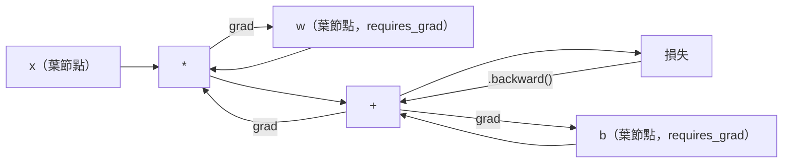
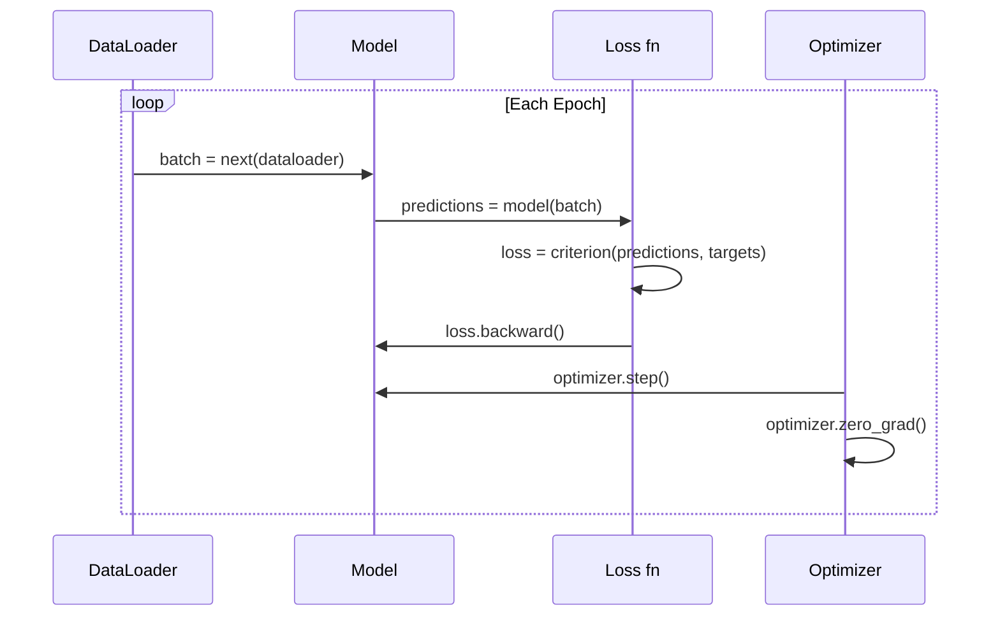

# PyTorch 入門

> 你已經用活塞和曲軸把引擎做出來了。現在來學大家真正在開的那一台。

**Type:** Build
**Languages:** Python
**Prerequisites:** Lesson 03.10 (Build Your Own Mini Framework)
**Time:** ~75 minutes

## Learning Objectives｜學習目標

- 用 PyTorch 的 nn.Module、nn.Sequential 和 autograd（自動微分）建立並訓練神經網路（neural network）
- 使用 PyTorch 張量（tensor）、GPU 加速，以及標準訓練迴圈（training loop）：zero_grad、forward、loss、backward、step
- 把你從頭做的迷你框架零件，換成 PyTorch 的對應物
- 在同一個任務上剖析並比較純 Python 框架和 PyTorch 的訓練速度

## The Problem｜問題

你已經有一個能動的迷你框架。Linear 層、ReLU、dropout、批次正規化（batch normalization）、Adam、DataLoader、訓練迴圈（training loop）。它用純 Python，在圓形分類問題上訓練一個 4 層網路。

在同一個問題上，它也比 PyTorch 慢 500 倍。

你的迷你框架一次處理一個樣本（sample），用的是一層層的 Python 迴圈。PyTorch 把同樣的運算派給最佳化過的 C++/CUDA 核心，在 GPU 上跑。在單張 NVIDIA A100 上，PyTorch 用 ResNet-50（2560 萬個參數）在 ImageNet（128 萬張影像）上訓練大約 6 小時。同樣的任務，你的框架大約要 3,000 小時，前提是它沒有先把記憶體（memory）用完。

速度不是唯一的差距。你的框架沒有 GPU 支援。沒有自動微分，每個模組的 backward() 都是你手寫的。沒有序列化（serialization）。沒有分散式訓練。沒有混合精度（mixed precision）。沒有 print 以外的辦法可以看梯度（gradient）怎麼流。

PyTorch 把這些缺口都補上了。而且它維持的心智模型，就是你已經做過的那一套：Module、forward()、parameters()、backward()、optimizer.step()。概念一對一搬過去。語法幾乎一樣。差別是 PyTorch 在你從頭設計的同一個介面後面，包了十年的系統工程。

## The Concept｜核心概念

### 為什麼 PyTorch 贏了

2015 年，TensorFlow 要求你在跑任何東西之前，先定義一張靜態計算圖（computational graph）。你建好圖、編譯它，再把資料送進去。除錯就是盯著圖的視覺化。要改架構（architecture），就得把圖從頭重建。

PyTorch 在 2017 年帶著另一套哲學推出：立即執行（eager execution）。你寫 Python。它馬上跑。`y = model(x)` 是現在就算出 y，不是「在圖上加一個節點，以後再算 y」。所以一般的 Python 除錯工具能用。print() 能用。pdb 能用。前向傳遞（forward pass）裡的 if/else 也能用。

到了 2020 年，市場已經表態。PyTorch 在機器學習（machine learning）論文裡的占比，從 2017 年的 7% 變成 2022 年的 75% 以上。Meta、Google DeepMind、OpenAI、Anthropic 和 Hugging Face 都把 PyTorch 當主要框架（framework）。TensorFlow 2.x 跟著採用立即執行，等於承認 PyTorch 的設計是對的。

這一課要記的是：開發者體驗會複利。一個框架慢 10%，但除錯快 50%，每次都會贏。

### 張量

張量是多維陣列，有三個關鍵性質：形狀（shape）、dtype 和 device（裝置）。

```python
import torch

x = torch.zeros(3, 4)           # shape: (3, 4), dtype: float32, device: cpu
x = torch.randn(2, 3, 224, 224) # batch of 2 RGB images, 224x224
x = torch.tensor([1, 2, 3])     # from a Python list
```

**形狀** 是維度（dimension）。純量（scalar）的形狀是 ()，向量是 (n,)，矩陣（matrix）是 (m, n)，一批影像是 (batch, channels, height, width)。

**Dtype** 控制精度和記憶體。

| dtype | 位元 | 範圍 | 用途 |
|-------|------|-------|----------|
| float32 | 32 | 大約 7 位十進位 | 預設訓練 |
| float16 | 16 | 大約 3.3 位十進位 | 混合精度 |
| bfloat16 | 16 | 範圍和 float32 相同，精度較低 | LLM 訓練 |
| int8 | 8 | -128 到 127 | 量化推論（quantized inference） |

**裝置** 決定計算在哪裡發生。

```python
device = torch.device("cuda" if torch.cuda.is_available() else "cpu")
x = torch.randn(3, 4, device=device)
x = x.to("cuda")
x = x.cpu()
```

每個運算都要求所有張量在同一個裝置上。這是初學者最常碰到的 PyTorch 錯誤：`RuntimeError: Expected all tensors to be on the same device`。修法是在計算之前，把所有東西移到同一個裝置。

**重塑形狀** 是常數時間。它改的是詮釋資料，不是資料本身。

```python
x = torch.randn(2, 3, 4)
x.view(2, 12)      # reshape to (2, 12) -- must be contiguous
x.reshape(6, 4)    # reshape to (6, 4) -- works always
x.permute(2, 0, 1) # reorder dimensions
x.unsqueeze(0)     # add dimension: (1, 2, 3, 4)
x.squeeze()        # remove size-1 dimensions
```

### 自動微分

你的迷你框架要求每個模組都實作 backward()。PyTorch 不用。它把張量上的每個運算記進一張有向無環圖，也就是計算圖，再把這張圖倒著走，自動算出梯度。



和你的框架關鍵的差別是：PyTorch 用的是以運算記錄帶（tape）為基礎的自動微分。前向傳遞時，每個運算都附加到一條「運算記錄帶」上。呼叫 `.backward()` 會把運算記錄帶倒著重播。

```python
x = torch.randn(3, requires_grad=True)
y = x ** 2 + 3 * x
z = y.sum()
z.backward()
print(x.grad)  # dz/dx = 2x + 3
```

自動微分有三條規則：

1. 只有 `requires_grad=True` 的葉張量會累積梯度
2. 梯度預設會累積。每次反向傳遞之前要呼叫 `optimizer.zero_grad()`
3. `torch.no_grad()` 關掉梯度追蹤，評估時用它

### nn.Module

`nn.Module` 是 PyTorch 裡每個神經網路零件的基底類別。你在第 10 課已經做過這個抽象。PyTorch 的版本加上自動的參數（parameter）註冊、遞迴找出子模組、裝置管理，以及 state dict 序列化（serialization）。

```python
import torch.nn as nn

class MLP(nn.Module):
    def __init__(self, input_dim, hidden_dim, output_dim):
        super().__init__()
        self.layer1 = nn.Linear(input_dim, hidden_dim)
        self.relu = nn.ReLU()
        self.layer2 = nn.Linear(hidden_dim, output_dim)

    def forward(self, x):
        x = self.layer1(x)
        x = self.relu(x)
        x = self.layer2(x)
        return x
```

在 `__init__` 裡把 `nn.Module` 或 `nn.Parameter` 指定成屬性時，PyTorch 會自動註冊它。`model.parameters()` 會遞迴收集每一個已註冊的參數。所以你不必像迷你框架那樣，手動把權重（weight）收集起來。

主要積木：

| 模組 | 做什麼 | 參數 |
|--------|-------------|------------|
| nn.Linear(in, out) | Wx + b | in*out + out |
| nn.Conv2d(in_ch, out_ch, k) | 二維卷積（convolution） | in_ch*out_ch*k*k + out_ch |
| nn.BatchNorm1d(features) | 正規化（normalization）活化值 | 2 * features |
| nn.Dropout(p) | 隨機變成 0 | 0 |
| nn.ReLU() | max(0, x) | 0 |
| nn.GELU() | 高斯誤差線性 | 0 |
| nn.Embedding(vocab, dim) | 查找表 | vocab * dim |
| nn.LayerNorm(dim) | 逐樣本正規化 | 2 * dim |

### 損失函數與最佳化器

PyTorch 把你做過的東西都做成可以上正式環境的版本。

**損失函數（loss function）**，來自 `torch.nn`：

| 損失 | 任務 | 輸入 |
|------|------|-------|
| nn.MSELoss() | 迴歸（regression） | 任何形狀 |
| nn.CrossEntropyLoss() | 多類別分類（multi-class classification） | logits，不是 softmax |
| nn.BCEWithLogitsLoss() | 二元分類（binary classification） | logits，不是 sigmoid |
| nn.L1Loss() | 迴歸，對異常值較穩 | 任何形狀 |
| nn.CTCLoss() | 序列對齊 | 對數機率 |

注意：`CrossEntropyLoss` 在內部把 `LogSoftmax` 和 `NLLLoss` 合在一起。傳原始 logits，不要傳 softmax 的輸出。這是常見錯誤，會靜靜地給出錯的梯度。

**最佳化器（optimizer）**，來自 `torch.optim`：

| 最佳化器 | 什麼時候用 | 常見學習率（learning rate） |
|-----------|-------------|-----------|
| SGD(params, lr, momentum) | CNN、調校好的管線（pipeline） | 0.01--0.1 |
| Adam(params, lr) | 預設的起點 | 1e-3 |
| AdamW(params, lr, weight_decay) | transformer、fine-tuning | 1e-4--1e-3 |
| LBFGS(params) | 小規模、二階 | 1.0 |

### 訓練迴圈（training loop）

每個 PyTorch 訓練迴圈（training loop）都是同樣的 5 步。你在第 10 課已經知道了。



標準寫法：

```python
for epoch in range(num_epochs):
    model.train()
    for inputs, targets in train_loader:
        inputs, targets = inputs.to(device), targets.to(device)
        optimizer.zero_grad()
        outputs = model(inputs)
        loss = criterion(outputs, targets)
        loss.backward()
        optimizer.step()
```

批次迴圈裡面是五行。訓練出 GPT-4、Stable Diffusion 和 LLaMA 的就是這五行。架構會變。資料會變。這五行不會變。

### Dataset 與 DataLoader

PyTorch 的 `Dataset` 是一個抽象類別，有兩個方法：`__len__` 和 `__getitem__`。`DataLoader` 在外面加上分批、洗牌，以及多行程的資料載入。

```python
from torch.utils.data import Dataset, DataLoader

class MNISTDataset(Dataset):
    def __init__(self, images, labels):
        self.images = images
        self.labels = labels

    def __len__(self):
        return len(self.labels)

    def __getitem__(self, idx):
        return self.images[idx], self.labels[idx]

loader = DataLoader(dataset, batch_size=64, shuffle=True, num_workers=4)
```

`num_workers=4` 會生出 4 個行程，在 GPU 訓練目前這個批次（batch）時平行載入資料。在受磁碟限制的工作負載上，例如大影像、音訊，光是這件事就能把訓練速度變成兩倍。

### GPU 訓練

把模型（model）移到 GPU：

```python
device = torch.device("cuda" if torch.cuda.is_available() else "cpu")
model = model.to(device)
```

這會遞迴把每個參數和緩衝區移到 GPU。訓練時再把每個批次移過去：

```python
inputs, targets = inputs.to(device), targets.to(device)
```

**混合精度** 在現代 GPU 上把記憶體用量減半、吞吐量加倍，例如 A100、H100、RTX 4090。前向和反向用 float16 跑，主權重留在 float32：

```python
from torch.amp import autocast, GradScaler

scaler = GradScaler()
for inputs, targets in loader:
    with autocast(device_type="cuda"):
        outputs = model(inputs)
        loss = criterion(outputs, targets)
    scaler.scale(loss).backward()
    scaler.step(optimizer)
    scaler.update()
    optimizer.zero_grad()
```

### 比較：迷你框架、PyTorch 和 JAX

| 特性 | 迷你框架（第 10 課） | PyTorch | JAX |
|---------|---------------------|---------|-----|
| 自動微分 | 手動 backward() | 以運算記錄帶為基礎的 autograd | 函數式變換 |
| 執行方式 | 立即執行，Python 迴圈 | 立即執行，C++ 核心 | 追蹤後 JIT 編譯 |
| GPU 支援 | 無 | 有（CUDA、ROCm、MPS） | 有（CUDA、TPU） |
| 速度（MNIST MLP） | 每個 epoch 約 300 秒 | 每個 epoch 約 0.5 秒 | 每個 epoch 約 0.3 秒 |
| 模組系統 | 自訂 Module 類別 | nn.Module | 無狀態函式（Flax/Equinox） |
| 除錯 | print() | print()、pdb、breakpoint() | 較難，JIT 追蹤會讓 print 失效 |
| 生態系 | 無 | Hugging Face、Lightning、timm | Flax、Optax、Orbax |
| 學習曲線 | 你自己做的 | 中等 | 陡，函數式典範 |
| 正式環境使用 | 玩具問題 | Meta、OpenAI、Anthropic、HF | Google DeepMind、Midjourney |

```figure
dropout-mask
```

## Build It｜動手實作

只用 PyTorch 基本元件，在 MNIST 上訓練一個 3 層 MLP。沒有高階包裝。不用 `torchvision.datasets`。我們自己下載並解析原始資料。

### 步驟 1：從原始檔載入 MNIST

MNIST 以 4 個 gzip 檔發行：訓練影像是 60,000 x 28 x 28，訓練標籤，測試影像是 10,000 x 28 x 28，測試標籤。我們下載它們，並解析二進位格式。

```python
import torch
import torch.nn as nn
import struct
import gzip
import urllib.request
import os

def download_mnist(path="./mnist_data"):
    base_url = "https://storage.googleapis.com/cvdf-datasets/mnist/"
    files = [
        "train-images-idx3-ubyte.gz",
        "train-labels-idx1-ubyte.gz",
        "t10k-images-idx3-ubyte.gz",
        "t10k-labels-idx1-ubyte.gz",
    ]
    os.makedirs(path, exist_ok=True)
    for f in files:
        filepath = os.path.join(path, f)
        if not os.path.exists(filepath):
            urllib.request.urlretrieve(base_url + f, filepath)

def load_images(filepath):
    with gzip.open(filepath, "rb") as f:
        magic, num, rows, cols = struct.unpack(">IIII", f.read(16))
        data = f.read()
        images = torch.frombuffer(bytearray(data), dtype=torch.uint8)
        images = images.reshape(num, rows * cols).float() / 255.0
    return images

def load_labels(filepath):
    with gzip.open(filepath, "rb") as f:
        magic, num = struct.unpack(">II", f.read(8))
        data = f.read()
        labels = torch.frombuffer(bytearray(data), dtype=torch.uint8).long()
    return labels
```

### 步驟 2：定義模型

一個 3 層 MLP：784 -> 256 -> 128 -> 10。ReLU 活化函數（activation function）。用 dropout 做正則化（regularization）。不加批次正規化，好讓它保持簡單。

```python
class MNISTModel(nn.Module):
    def __init__(self):
        super().__init__()
        self.net = nn.Sequential(
            nn.Linear(784, 256),
            nn.ReLU(),
            nn.Dropout(0.2),
            nn.Linear(256, 128),
            nn.ReLU(),
            nn.Dropout(0.2),
            nn.Linear(128, 10),
        )

    def forward(self, x):
        return self.net(x)
```

輸出層（output layer）產生 10 個原始 logits，一個數字一個。不要加 softmax。`CrossEntropyLoss` 在內部處理。

參數數量：784*256 + 256 + 256*128 + 128 + 128*10 + 10 = 235,146。以現在的標準來看很小。GPT-2 small 有 1.24 億。這個幾秒就訓完。

### 步驟 3：訓練迴圈（training loop）

標準的前向、損失、反向、更新模式。

```python
def train_one_epoch(model, loader, criterion, optimizer, device):
    model.train()
    total_loss = 0
    correct = 0
    total = 0
    for images, labels in loader:
        images, labels = images.to(device), labels.to(device)
        optimizer.zero_grad()
        outputs = model(images)
        loss = criterion(outputs, labels)
        loss.backward()
        optimizer.step()
        total_loss += loss.item() * images.size(0)
        _, predicted = outputs.max(1)
        correct += predicted.eq(labels).sum().item()
        total += labels.size(0)
    return total_loss / total, correct / total


def evaluate(model, loader, criterion, device):
    model.eval()
    total_loss = 0
    correct = 0
    total = 0
    with torch.no_grad():
        for images, labels in loader:
            images, labels = images.to(device), labels.to(device)
            outputs = model(images)
            loss = criterion(outputs, labels)
            total_loss += loss.item() * images.size(0)
            _, predicted = outputs.max(1)
            correct += predicted.eq(labels).sum().item()
            total += labels.size(0)
    return total_loss / total, correct / total
```

注意評估時的 `torch.no_grad()`。它關掉 autograd，減少記憶體用量，並加快推論（inference）。沒有它，PyTorch 會建一張你根本不會用的計算圖。

### 步驟 4：把所有東西接起來

```python
def main():
    device = torch.device("cuda" if torch.cuda.is_available() else "cpu")

    download_mnist()
    train_images = load_images("./mnist_data/train-images-idx3-ubyte.gz")
    train_labels = load_labels("./mnist_data/train-labels-idx1-ubyte.gz")
    test_images = load_images("./mnist_data/t10k-images-idx3-ubyte.gz")
    test_labels = load_labels("./mnist_data/t10k-labels-idx1-ubyte.gz")

    train_dataset = torch.utils.data.TensorDataset(train_images, train_labels)
    test_dataset = torch.utils.data.TensorDataset(test_images, test_labels)
    train_loader = torch.utils.data.DataLoader(
        train_dataset, batch_size=64, shuffle=True
    )
    test_loader = torch.utils.data.DataLoader(
        test_dataset, batch_size=256, shuffle=False
    )

    model = MNISTModel().to(device)
    criterion = nn.CrossEntropyLoss()
    optimizer = torch.optim.Adam(model.parameters(), lr=1e-3)

    num_params = sum(p.numel() for p in model.parameters())
    print(f"Device: {device}")
    print(f"Parameters: {num_params:,}")
    print(f"Train samples: {len(train_dataset):,}")
    print(f"Test samples: {len(test_dataset):,}")
    print()

    for epoch in range(10):
        train_loss, train_acc = train_one_epoch(
            model, train_loader, criterion, optimizer, device
        )
        test_loss, test_acc = evaluate(
            model, test_loader, criterion, device
        )
        print(
            f"Epoch {epoch+1:2d} | "
            f"Train Loss: {train_loss:.4f} | Train Acc: {train_acc:.4f} | "
            f"Test Loss: {test_loss:.4f} | Test Acc: {test_acc:.4f}"
        )

    torch.save(model.state_dict(), "mnist_mlp.pt")
    print(f"\nModel saved to mnist_mlp.pt")
    print(f"Final test accuracy: {test_acc:.4f}")
```

10 個 epoch（訓練週期）之後的預期輸出：測試準確率約 97.8%。CPU 上的訓練時間約 30 秒。GPU 上約 5 秒。同樣的架構，你的迷你框架大約 45 分鐘。

## Use It｜實際應用

### 快速比較：迷你框架和 PyTorch

| 迷你框架（第 10 課） | PyTorch |
|---------------------------|---------|
| `model = Sequential(Linear(784, 256), ReLU(), ...)` | `model = nn.Sequential(nn.Linear(784, 256), nn.ReLU(), ...)` |
| `pred = model.forward(x)` | `pred = model(x)` |
| `optimizer.zero_grad()` | `optimizer.zero_grad()` |
| `grad = criterion.backward()` 然後 `model.backward(grad)` | `loss.backward()` |
| `optimizer.step()` | `optimizer.step()` |
| 沒有 GPU | `model.to("cuda")` |
| 每個模組都要手動做反向 | Autograd 全部處理 |

介面幾乎一樣。差別都在引擎蓋下面。

### 儲存和載入模型

```python
torch.save(model.state_dict(), "model.pt")

model = MNISTModel()
model.load_state_dict(torch.load("model.pt", weights_only=True))
model.eval()
```

永遠存 `state_dict()`，也就是參數字典，不要存模型物件。存模型物件用的是 pickle，程式碼一重構就壞。state dict 可以帶走。

### 學習率排程（learning rate schedule）

```python
scheduler = torch.optim.lr_scheduler.CosineAnnealingLR(
    optimizer, T_max=10
)
for epoch in range(10):
    train_one_epoch(model, train_loader, criterion, optimizer, device)
    scheduler.step()
```

PyTorch 內建 15 種以上的排程器：StepLR、ExponentialLR、CosineAnnealingLR、OneCycleLR、ReduceLROnPlateau。全部接在同一個最佳化器介面上。

## Ship It｜交付成果

本課會產出兩份成品：

- `outputs/prompt-pytorch-debugger.md`：一份 prompt，用來診斷常見的 PyTorch 訓練失敗
- `outputs/skill-pytorch-patterns.md`：一份 PyTorch 訓練模式的技能參考

## Exercises｜練習

1. **加上批次正規化。** 在每個線性層後面、活化函數前面插入 `nn.BatchNorm1d`。和只有 dropout 的版本比較測試準確率和訓練速度。批次正規化應該能在更少的 epoch 裡達到 98% 以上。
2. **實作學習率尋找器。** 用指數增加的學習率訓練一個 epoch，從 1e-7 到 1.0。畫出損失對學習率。最好的學習率就在損失開始爬升之前。用它為 MNIST 模型挑一個更好的學習率。
3. **用混合精度搬到 GPU。** 在訓練迴圈（training loop）加上 `torch.amp.autocast` 和 `GradScaler`。在 GPU 上量有混合精度和沒有混合精度的吞吐量，單位是每秒樣本數。在 A100 上，預期大約 2 倍加速。
4. **做一個自訂 Dataset。** 下載 Fashion-MNIST，格式和 MNIST 相同，但內容是衣服。實作 `FashionMNISTDataset(Dataset)` 類別，含 `__getitem__` 和 `__len__`。用同一個 MLP 訓練並比較準確率。Fashion-MNIST 比較難，預期大約 88%，對上大約 98%。
5. **把 Adam 換成 SGD 加動量（momentum）。** 用 `SGD(params, lr=0.01, momentum=0.9)` 訓練。比較收斂（convergence）曲線。再加上 `CosineAnnealingLR` 排程器，看 SGD 能不能在第 10 個 epoch 追上 Adam。

## Key Terms｜關鍵術語

| 術語 | 常見說法 | 實際意義 |
|------|----------------|----------------------|
| 張量 | 「多維陣列」 | 帶型別、知道自己在哪個裝置上的陣列，每個運算都內建自動微分 |
| Autograd | 「自動的反向傳播（backpropagation）」 | 以運算記錄帶為基礎的系統。前向傳遞時記下運算，再倒著重播，算出精確梯度 |
| nn.Module | 「一層」 | 任何可微分計算區塊的基底類別。它註冊參數、支援巢狀，並處理訓練和評估模式 |
| state_dict | 「模型權重」 | 一個 OrderedDict，把參數名稱對到張量。這是訓練好的模型可攜、可序列化（serialization）的表示 |
| .backward() | 「算梯度」 | 把計算圖倒著走，為每個 requires_grad=True 的葉張量計算並累積梯度 |
| .to(device) | 「移到 GPU」 | 遞迴把所有參數和緩衝區轉到指定裝置，可以是 CPU、CUDA 或 MPS |
| DataLoader | 「資料管線」 | 一個迭代器，從 Dataset 分批、洗牌，並可以選擇平行載入資料 |
| 混合精度 | 「用 float16」 | 前向和反向用 float16 以求速度，主權重留在 float32 以維持數值穩定 |
| 立即執行 | 「現在就跑」 | 運算在呼叫當下就執行，不延到後面的編譯步驟。這是 PyTorch 和 TF 1.x 分開的核心設計 |
| zero_grad | 「重置梯度」 | 在下一次反向傳遞之前把所有參數梯度設成 0，因為 PyTorch 預設會累積梯度 |

## Further Reading｜延伸閱讀

- Paszke et al., "PyTorch: An Imperative Style, High-Performance Deep Learning Library" (2019)——說明 PyTorch 設計取捨的原始論文
- PyTorch Tutorials: "Learning PyTorch with Examples" (https://pytorch.org/tutorials/beginner/pytorch_with_examples.html)——從張量走到 nn.Module 的官方路徑
- PyTorch Performance Tuning Guide (https://pytorch.org/tutorials/recipes/recipes/tuning_guide.html)——混合精度、DataLoader 工作行程、pinned memory，以及其他正式環境的最佳化
- Horace He, "Making Deep Learning Go Brrrr" (https://horace.io/brrr_intro.html)——為什麼 GPU 訓練快，以及 PyTorch 專用的最佳化策略
