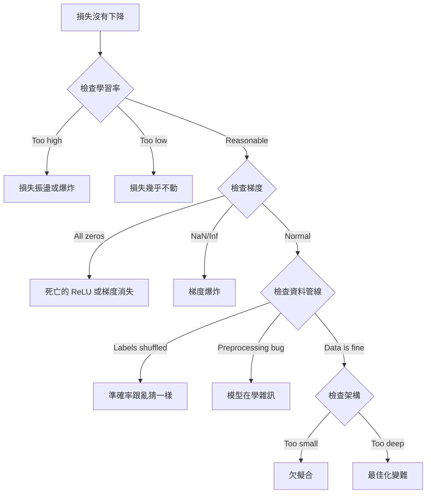
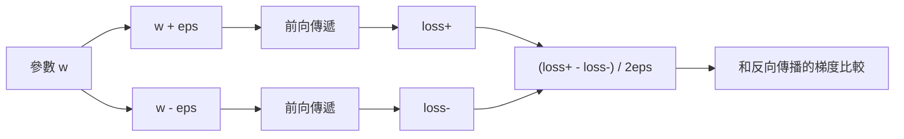
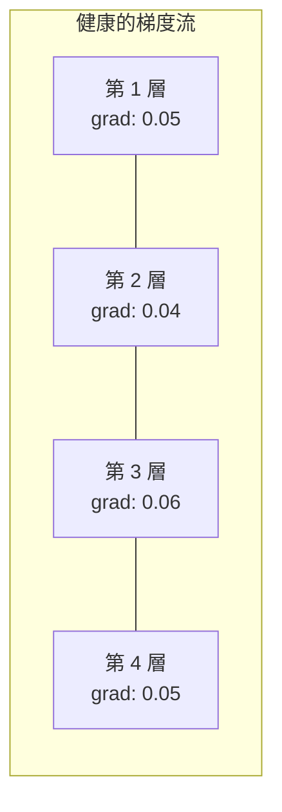
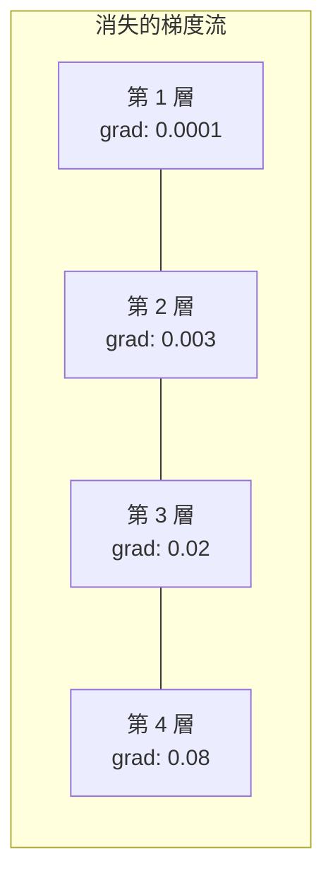
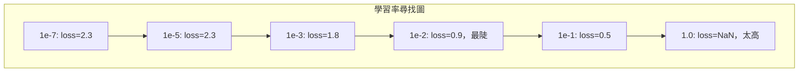

# 為神經網路（neural network）除錯

> 你的網路（network）編譯過了。它跑了。它吐出一個數字。數字是錯的，而且什麼都沒有當掉。歡迎來到最難的那種除錯：沒有錯誤訊息的那種。

**Type:** Build
**Languages:** Python, PyTorch
**Prerequisites:** Phase 03 Lessons 01-10 (especially backpropagation, loss functions, optimizers)
**Time:** ~90 minutes

## Learning Objectives｜學習目標

- 用有系統的除錯策略，診斷常見的神經網路失敗：NaN 損失、平坦的損失曲線、過度擬合（overfitting）、振盪
- 用「過度擬合一個批次（overfit one batch）」，確認模型（model）架構（architecture）和訓練迴圈（training loop）是對的
- 檢查梯度（gradient）量級、活化值分布和權重（weight）範數，找出梯度消失（vanishing gradient）或梯度爆炸（exploding gradient）
- 做一份除錯清單，涵蓋資料管線（pipeline）、模型架構、損失函數（loss function）、最佳化器（optimizer）和學習率（learning rate）

## The Problem｜問題

傳統軟體壞掉就會當。空指標會丟出例外。型別不合會在編譯時失敗。差一錯誤（off-by-one error）會產生明顯不對的輸出。

神經網路不會給你這種奢侈。

壞掉的神經網路會跑完，印出一個損失（loss）值，再輸出預測。損失可能下降。預測看起來可能還算合理。但模型是靜靜地錯了：學到捷徑、把雜訊背下來，或收斂（convergence）到一個沒用的局部極小值。Google 的研究者估計，機器學習（machine learning）的除錯時間有 60-70% 花在「沉默」的 bug 上。它們不報錯，但會讓模型品質變差。

能動的模型和壞掉的模型，差別常常只是放錯位置的一行：少了 `zero_grad()`、維度（dimension）轉置錯了、學習率差了 10 倍。2019 年那份被當成標準的 "Recipe for Training Neural Networks" 開頭就是這句：「最常見的神經網路錯誤，是不會當掉的 bug。」

這一課教你找出那些 bug。

## The Concept｜核心概念

### 除錯的心態

別再靠印一印然後祈禱來除錯。神經網路除錯必須有系統，因為回饋很慢，一次訓練要幾分鐘到幾小時，而且症狀含糊，損失不好可能有 20 種原因。

黃金規則：**從簡單開始，一次只加一件複雜的東西，並且各自獨立驗證。**



### 症狀 1：損失沒有下降

這是最常見的抱怨。訓練迴圈（training loop）在跑，epoch（訓練週期）一個一個過去，損失卻維持平坦，或劇烈振盪。

**學習率錯了。** 太高：損失振盪，或跳到 NaN。太低：損失降得太慢，看起來像平坦。Adam 從 1e-3 開始。SGD 從 1e-1 或 1e-2 開始。先試三個彼此差 10 倍的學習率，例如 1e-2、1e-3、1e-4，再斷定是別的問題。

**死亡的 ReLU。** 如果一個 ReLU 神經元（neuron）收到很大的負輸入，它輸出 0，梯度也是 0。它再也不會活化。死掉的神經元夠多，網路就學不會。檢查：印出每一層 ReLU 之後剛好是 0 的活化值比例。如果超過 50% 死了，改用 LeakyReLU，或把學習率降低。

**梯度消失。** 在用 sigmoid 函數或 tanh 的深網路裡，梯度往回傳時會指數縮小。等它們到第一層，大約是 0。前面的層停止學習。修法：用 ReLU 或 GELU，加上殘差連接（residual connection），或用批次正規化（batch normalization）。

**梯度爆炸。** 相反的問題，梯度指數變大。RNN 和很深的網路常見。損失跳到 NaN。修法：梯度裁剪（gradient clipping），呼叫 `torch.nn.utils.clip_grad_norm_`，降低學習率，或加上正規化（normalization）。

### 症狀 2：損失在降，但模型很差

損失在降。訓練準確率到 99%。測試準確率卻是 55%。或模型在真實資料上吐出沒有意義的輸出。

**過度擬合。** 模型把訓練資料（training data）背下來，而不是學模式。訓練損失和驗證（validation）損失的差距隨時間變大。修法：更多資料、dropout、權重衰減（weight decay）、提前停止（early stopping）、資料增強（data augmentation）。

**資料洩漏（data leakage）。** 測試資料漏進訓練。準確率高得可疑。常見原因：先洗牌再切分、用整個資料集（dataset）的統計做前處理、切分之間有重複的樣本（sample）。修法：先切分，再前處理，並檢查重複。

**標籤錯誤。** 多數真實資料集有 5-10% 的標籤是錯的，Northcutt 等人，2021，《Pervasive Label Errors in Test Sets》。模型把雜訊學進去。修法：用信心學習（confident learning）找出並修正標錯的例子，或用損失截斷（loss truncation）忽略高損失的樣本。

### 症狀 3：損失變成 NaN 或 Inf

損失值變成 `nan` 或 `inf`。訓練死了。

**學習率太高。** 梯度更新衝太遠，權重爆炸。修法：降 10 倍。

**log(0) 或 log(負數)。** 交叉熵損失計算 `log(p)`。如果模型輸出剛好是 0，或負的機率（probability），log 就爆掉。修法：把預測夾到 `[eps, 1-eps]`，其中 `eps=1e-7`。

**除以零。** 批次正規化除以標準差（standard deviation）。一個常數值的批次（batch），標準差是 0。修法：分母加上 epsilon。PyTorch 預設會做，但自己寫的實作可能不會。

**數值溢位（overflow）。** 很大的活化值送進 `exp()` 會得到 Inf。softmax 特別容易。修法：取指數之前先減掉最大值，也就是 log-sum-exp 技巧。

### 技巧 1：梯度檢查

把解析梯度，來自反向傳播（backpropagation），和數值梯度，來自有限差分（finite difference），拿來比較。如果它們不一致，反向傳遞（backward pass）有 bug。

參數 `w` 的數值梯度：

```
grad_numerical = (loss(w + eps) - loss(w - eps)) / (2 * eps)
```

一致程度的指標（相對差）：

```
rel_diff = |grad_analytical - grad_numerical| / max(|grad_analytical|, |grad_numerical|, 1e-8)
```

如果 `rel_diff < 1e-5`：是對的。如果 `rel_diff > 1e-3`：幾乎可以確定是 bug。



### 技巧 2：活化值統計

訓練時監看每一層之後活化值的平均數（mean）和標準差。健康的網路把活化值維持在平均數接近 0、標準差接近 1，那是正規化之後的樣子，不然至少也要有界。

| 健康指標 | 平均數 | 標準差 | 診斷 |
|-----------------|------|-----|-----------|
| 健康 | 約 0 | 約 1 | 網路在正常學習 |
| 飽和（saturation） | 遠大於 0 或遠小於 0 | 約 0 | 活化值卡在極端值 |
| 死亡 | 0 | 0 | 神經元死了，全部是 0 |
| 爆炸 | 遠大於 10 | 遠大於 10 | 活化值沒有上界地變大 |

### 技巧 3：梯度流的視覺化

畫出每一層的平均梯度量級。健康的網路裡，各層的梯度量級應該大致相近。如果前面的層比後面的層小 1000 倍，你就有梯度消失。





### 技巧 4：過度擬合一個批次

這是深度學習（deep learning）裡最重要的一個除錯技巧。

取一個小批次，8 到 32 個樣本。在上面訓練 100 次以上。損失應該幾乎到 0，訓練準確率應該到 100%。如果沒有，模型或訓練迴圈（training loop）有根本的 bug。不要繼續做完整訓練。

這個測試抓得到：

- 壞掉的損失函數
- 壞掉的反向傳遞
- 架構小到無法表示資料
- 最佳化器沒有接到模型參數（parameter）
- 資料和標籤對不齊

跑一次 30 秒，可以省下好幾小時的完整訓練除錯。

### 技巧 5：學習率尋找器

Leslie Smith（2017）提議在一個 epoch 裡，把學習率從很小，1e-7，掃到很大，10，同時記錄損失。畫出損失對學習率。最好的學習率，大約比損失下降最快的那個學習率小 10 倍。



這個例子裡最好的學習率大約是 1e-3，也就是最陡那一點之前一個數量級。

### 常見的 PyTorch bug

這些是 PyTorch 社群裡集體浪費最多時間的 bug：

| Bug | 症狀 | 修法 |
|-----|---------|-----|
| 忘記 `optimizer.zero_grad()` | 梯度跨批次累積，損失振盪 | 在 `loss.backward()` 之前加上 `optimizer.zero_grad()` |
| 測試時忘記 `model.eval()` | dropout 和批次正規化的行為不同，測試準確率每次跑都不一樣 | 加上 `model.eval()` 和 `torch.no_grad()` |
| 張量（tensor）形狀錯誤 | 靜默的廣播（broadcasting）算出錯的結果，卻沒有錯誤 | 除錯時每個運算之後印出形狀 |
| CPU/GPU 不一致 | `RuntimeError: expected CUDA tensor` | 模型和資料都用 `.to(device)` |
| 沒有把張量 detach | 計算圖（computational graph）一直變大，記憶體（memory）耗盡 | 用 `.detach()` 或 `with torch.no_grad()` |
| 就地運算弄壞 autograd（自動微分） | `RuntimeError: modified by in-place operation` | 把 `x += 1` 換成 `x = x + 1` |
| 資料沒有正規化 | 損失停在跟亂猜一樣的水準 | 把輸入正規化成平均數 0、標準差 1 |
| 標籤的 dtype 錯了 | 交叉熵要的是 `Long`，拿到 `Float` | 轉換標籤：`labels.long()` |

### 除錯總表

| 症狀 | 可能原因 | 先試這個 |
|---------|-------------|-------------------|
| 損失停在 -log(1/num_classes) | 模型在預測均勻分布（uniform distribution） | 檢查資料管線，確認標籤和輸入對得上 |
| 走幾步之後損失變 NaN | 學習率太高 | 把學習率降 10 倍 |
| 損失立刻變 NaN | log(0) 或除以零 | 在 log 和除法加上 epsilon |
| 損失劇烈振盪 | 學習率太高，或批次太小 | 降低學習率，加大批次 |
| 損失下降後停滯 | 對 fine-tuning 階段來說學習率太高 | 加上學習率排程（learning rate schedule），餘弦或步進衰減 |
| 訓練準確率高，測試準確率低 | 過度擬合 | 加上 dropout、權重衰減、更多資料 |
| 訓練準確率 = 測試準確率 = 隨機水準 | 模型什麼都沒學到 | 跑過度擬合一個批次的測試 |
| 訓練準確率 = 測試準確率，但兩者都低 | 欠擬合（underfitting） | 更大的模型、更多層、更多特徵（feature） |
| 梯度全部是 0 | 死亡的 ReLU，或計算圖被 detach | 改用 LeakyReLU，檢查 `.requires_grad` |
| 訓練時記憶體不足 | 批次太大，或計算圖沒被釋放 | 減小批次，評估時用 `torch.no_grad()` |

```figure
learning-curves
```

## Build It｜動手實作

一套診斷工具，監看活化值、梯度和損失曲線。你會故意把網路弄壞，再用這套工具診斷每一個問題。

### 步驟 1：NetworkDebugger 類別

掛接到 PyTorch 模型，依每一層記錄活化值和梯度的統計。

```python
import torch
import torch.nn as nn
import math


class NetworkDebugger:
    def __init__(self, model):
        self.model = model
        self.activation_stats = {}
        self.gradient_stats = {}
        self.loss_history = []
        self.lr_losses = []
        self.hooks = []
        self._register_hooks()

    def _register_hooks(self):
        for name, module in self.model.named_modules():
            if isinstance(module, (nn.Linear, nn.Conv2d, nn.ReLU, nn.LeakyReLU)):
                hook = module.register_forward_hook(self._make_activation_hook(name))
                self.hooks.append(hook)
                hook = module.register_full_backward_hook(self._make_gradient_hook(name))
                self.hooks.append(hook)

    def _make_activation_hook(self, name):
        def hook(module, input, output):
            with torch.no_grad():
                out = output.detach().float()
                self.activation_stats[name] = {
                    "mean": out.mean().item(),
                    "std": out.std().item(),
                    "fraction_zero": (out == 0).float().mean().item(),
                    "min": out.min().item(),
                    "max": out.max().item(),
                }
        return hook

    def _make_gradient_hook(self, name):
        def hook(module, grad_input, grad_output):
            if grad_output[0] is not None:
                with torch.no_grad():
                    grad = grad_output[0].detach().float()
                    self.gradient_stats[name] = {
                        "mean": grad.mean().item(),
                        "std": grad.std().item(),
                        "abs_mean": grad.abs().mean().item(),
                        "max": grad.abs().max().item(),
                    }
        return hook

    def record_loss(self, loss_value):
        self.loss_history.append(loss_value)

    def check_loss_health(self):
        if len(self.loss_history) < 2:
            return "NOT_ENOUGH_DATA"
        recent = self.loss_history[-10:]
        if any(math.isnan(v) or math.isinf(v) for v in recent):
            return "NAN_OR_INF"
        if len(self.loss_history) >= 20:
            first_half = sum(self.loss_history[:10]) / 10
            second_half = sum(self.loss_history[-10:]) / 10
            if second_half >= first_half * 0.99:
                return "NOT_DECREASING"
        if len(recent) >= 5:
            diffs = [recent[i+1] - recent[i] for i in range(len(recent)-1)]
            if max(diffs) - min(diffs) > 2 * abs(sum(diffs) / len(diffs)):
                return "OSCILLATING"
        return "HEALTHY"

    def check_activations(self):
        issues = []
        for name, stats in self.activation_stats.items():
            if stats["fraction_zero"] > 0.5:
                issues.append(f"DEAD_NEURONS: {name} has {stats['fraction_zero']:.0%} zero activations")
            if abs(stats["mean"]) > 10:
                issues.append(f"EXPLODING_ACTIVATIONS: {name} mean={stats['mean']:.2f}")
            if stats["std"] < 1e-6:
                issues.append(f"COLLAPSED_ACTIVATIONS: {name} std={stats['std']:.2e}")
        return issues if issues else ["HEALTHY"]

    def check_gradients(self):
        issues = []
        grad_magnitudes = []
        for name, stats in self.gradient_stats.items():
            grad_magnitudes.append((name, stats["abs_mean"]))
            if stats["abs_mean"] < 1e-7:
                issues.append(f"VANISHING_GRADIENT: {name} abs_mean={stats['abs_mean']:.2e}")
            if stats["abs_mean"] > 100:
                issues.append(f"EXPLODING_GRADIENT: {name} abs_mean={stats['abs_mean']:.2e}")
        if len(grad_magnitudes) >= 2:
            first_mag = grad_magnitudes[0][1]
            last_mag = grad_magnitudes[-1][1]
            if last_mag > 0 and first_mag / last_mag > 100:
                issues.append(f"GRADIENT_RATIO: first/last = {first_mag/last_mag:.0f}x (vanishing)")
        return issues if issues else ["HEALTHY"]

    def print_report(self):
        print("\n=== NETWORK DEBUGGER REPORT ===")
        print(f"\nLoss health: {self.check_loss_health()}")
        if self.loss_history:
            print(f"  Last 5 losses: {[f'{v:.4f}' for v in self.loss_history[-5:]]}")
        print("\nActivation diagnostics:")
        for item in self.check_activations():
            print(f"  {item}")
        print("\nGradient diagnostics:")
        for item in self.check_gradients():
            print(f"  {item}")
        print("\nPer-layer activation stats:")
        for name, stats in self.activation_stats.items():
            print(f"  {name}: mean={stats['mean']:.4f} std={stats['std']:.4f} zero={stats['fraction_zero']:.1%}")
        print("\nPer-layer gradient stats:")
        for name, stats in self.gradient_stats.items():
            print(f"  {name}: abs_mean={stats['abs_mean']:.2e} max={stats['max']:.2e}")

    def remove_hooks(self):
        for hook in self.hooks:
            hook.remove()
        self.hooks.clear()
```

### 步驟 2：過度擬合一個批次的測試

```python
def overfit_one_batch(model, x_batch, y_batch, criterion, lr=0.01, steps=200):
    optimizer = torch.optim.Adam(model.parameters(), lr=lr)
    model.train()
    print("\n=== OVERFIT ONE BATCH TEST ===")
    print(f"Batch size: {x_batch.shape[0]}, Steps: {steps}")

    for step in range(steps):
        optimizer.zero_grad()
        output = model(x_batch)
        loss = criterion(output, y_batch)
        loss.backward()
        optimizer.step()

        if step % 50 == 0 or step == steps - 1:
            with torch.no_grad():
                preds = (output > 0).float() if output.shape[-1] == 1 else output.argmax(dim=1)
                targets = y_batch if y_batch.dim() == 1 else y_batch.squeeze()
                acc = (preds.squeeze() == targets).float().mean().item()
            print(f"  Step {step:3d} | Loss: {loss.item():.6f} | Accuracy: {acc:.1%}")

    final_loss = loss.item()
    if final_loss > 0.1:
        print(f"\n  FAIL: Loss did not converge ({final_loss:.4f}). Model or training loop is broken.")
        return False
    print(f"\n  PASS: Loss converged to {final_loss:.6f}")
    return True
```

### 步驟 3：學習率尋找器

```python
def find_learning_rate(model, x_data, y_data, criterion, start_lr=1e-7, end_lr=10, steps=100):
    import copy
    original_state = copy.deepcopy(model.state_dict())
    optimizer = torch.optim.SGD(model.parameters(), lr=start_lr)
    lr_mult = (end_lr / start_lr) ** (1 / steps)

    model.train()
    results = []
    best_loss = float("inf")
    current_lr = start_lr

    print("\n=== LEARNING RATE FINDER ===")

    for step in range(steps):
        optimizer.zero_grad()
        output = model(x_data)
        loss = criterion(output, y_data)

        if math.isnan(loss.item()) or loss.item() > best_loss * 10:
            break

        best_loss = min(best_loss, loss.item())
        results.append((current_lr, loss.item()))

        loss.backward()
        optimizer.step()

        current_lr *= lr_mult
        for param_group in optimizer.param_groups:
            param_group["lr"] = current_lr

    model.load_state_dict(original_state)

    if len(results) < 10:
        print("  Could not complete LR sweep -- loss diverged too quickly")
        return results

    min_loss_idx = min(range(len(results)), key=lambda i: results[i][1])
    suggested_lr = results[max(0, min_loss_idx - 10)][0]

    print(f"  Swept {len(results)} steps from {start_lr:.0e} to {results[-1][0]:.0e}")
    print(f"  Minimum loss {results[min_loss_idx][1]:.4f} at lr={results[min_loss_idx][0]:.2e}")
    print(f"  Suggested learning rate: {suggested_lr:.2e}")

    return results
```

### 步驟 4：梯度檢查器

```python
def _flat_to_multi_index(flat_idx, shape):
    multi_idx = []
    remaining = flat_idx
    for dim in reversed(shape):
        multi_idx.insert(0, remaining % dim)
        remaining //= dim
    return tuple(multi_idx)


def gradient_check(model, x, y, criterion, eps=1e-4):
    model.train()
    x_double = x.double()
    y_double = y.double()
    model_double = model.double()

    print("\n=== GRADIENT CHECK ===")
    overall_max_diff = 0
    checked = 0

    for name, param in model_double.named_parameters():
        if not param.requires_grad:
            continue

        layer_max_diff = 0

        model_double.zero_grad()
        output = model_double(x_double)
        loss = criterion(output, y_double)
        loss.backward()
        analytical_grad = param.grad.clone()

        num_checks = min(5, param.numel())
        for i in range(num_checks):
            idx = _flat_to_multi_index(i, param.shape)
            original = param.data[idx].item()

            param.data[idx] = original + eps
            with torch.no_grad():
                loss_plus = criterion(model_double(x_double), y_double).item()

            param.data[idx] = original - eps
            with torch.no_grad():
                loss_minus = criterion(model_double(x_double), y_double).item()

            param.data[idx] = original

            numerical = (loss_plus - loss_minus) / (2 * eps)
            analytical = analytical_grad[idx].item()

            denom = max(abs(numerical), abs(analytical), 1e-8)
            rel_diff = abs(numerical - analytical) / denom

            layer_max_diff = max(layer_max_diff, rel_diff)
            checked += 1

        overall_max_diff = max(overall_max_diff, layer_max_diff)
        status = "OK" if layer_max_diff < 1e-5 else "MISMATCH"
        print(f"  {name}: max_rel_diff={layer_max_diff:.2e} [{status}]")

    model.float()

    print(f"\n  Checked {checked} parameters")
    if overall_max_diff < 1e-5:
        print("  PASS: Gradients match (rel_diff < 1e-5)")
    elif overall_max_diff < 1e-3:
        print("  WARN: Small differences (1e-5 < rel_diff < 1e-3)")
    else:
        print("  FAIL: Gradient mismatch detected (rel_diff > 1e-3)")
    return overall_max_diff
```

### 步驟 5：故意弄壞的網路

現在把這套工具用在壞掉的網路上，逐一診斷。

```python
def demo_broken_networks():
    torch.manual_seed(42)
    x = torch.randn(64, 10)
    y = (x[:, 0] > 0).long()

    print("\n" + "=" * 60)
    print("BUG 1: Learning rate too high (lr=10)")
    print("=" * 60)
    model1 = nn.Sequential(nn.Linear(10, 32), nn.ReLU(), nn.Linear(32, 2))
    debugger1 = NetworkDebugger(model1)
    optimizer1 = torch.optim.SGD(model1.parameters(), lr=10.0)
    criterion = nn.CrossEntropyLoss()
    for step in range(20):
        optimizer1.zero_grad()
        out = model1(x)
        loss = criterion(out, y)
        debugger1.record_loss(loss.item())
        loss.backward()
        optimizer1.step()
    debugger1.print_report()
    debugger1.remove_hooks()

    print("\n" + "=" * 60)
    print("BUG 2: Dead ReLUs from bad initialization")
    print("=" * 60)
    model2 = nn.Sequential(nn.Linear(10, 32), nn.ReLU(), nn.Linear(32, 32), nn.ReLU(), nn.Linear(32, 2))
    with torch.no_grad():
        for m in model2.modules():
            if isinstance(m, nn.Linear):
                m.weight.fill_(-1.0)
                m.bias.fill_(-5.0)
    debugger2 = NetworkDebugger(model2)
    optimizer2 = torch.optim.Adam(model2.parameters(), lr=1e-3)
    for step in range(50):
        optimizer2.zero_grad()
        out = model2(x)
        loss = criterion(out, y)
        debugger2.record_loss(loss.item())
        loss.backward()
        optimizer2.step()
    debugger2.print_report()
    debugger2.remove_hooks()

    print("\n" + "=" * 60)
    print("BUG 3: Missing zero_grad (gradients accumulate)")
    print("=" * 60)
    model3 = nn.Sequential(nn.Linear(10, 32), nn.ReLU(), nn.Linear(32, 2))
    debugger3 = NetworkDebugger(model3)
    optimizer3 = torch.optim.SGD(model3.parameters(), lr=0.01)
    for step in range(50):
        out = model3(x)
        loss = criterion(out, y)
        debugger3.record_loss(loss.item())
        loss.backward()
        optimizer3.step()
    debugger3.print_report()
    debugger3.remove_hooks()

    print("\n" + "=" * 60)
    print("HEALTHY NETWORK: Correct setup for comparison")
    print("=" * 60)
    model_good = nn.Sequential(nn.Linear(10, 32), nn.ReLU(), nn.Linear(32, 2))
    debugger_good = NetworkDebugger(model_good)
    optimizer_good = torch.optim.Adam(model_good.parameters(), lr=1e-3)
    for step in range(50):
        optimizer_good.zero_grad()
        out = model_good(x)
        loss = criterion(out, y)
        debugger_good.record_loss(loss.item())
        loss.backward()
        optimizer_good.step()
    debugger_good.print_report()
    debugger_good.remove_hooks()

    print("\n" + "=" * 60)
    print("OVERFIT-ONE-BATCH TEST (healthy model)")
    print("=" * 60)
    model_test = nn.Sequential(nn.Linear(10, 32), nn.ReLU(), nn.Linear(32, 2))
    overfit_one_batch(model_test, x[:8], y[:8], criterion)

    print("\n" + "=" * 60)
    print("LEARNING RATE FINDER")
    print("=" * 60)
    model_lr = nn.Sequential(nn.Linear(10, 32), nn.ReLU(), nn.Linear(32, 2))
    find_learning_rate(model_lr, x, y, criterion)

    print("\n" + "=" * 60)
    print("GRADIENT CHECK")
    print("=" * 60)
    model_grad = nn.Sequential(nn.Linear(10, 8), nn.ReLU(), nn.Linear(8, 2))
    gradient_check(model_grad, x[:4], y[:4], criterion)
```

## Use It｜實際應用

### PyTorch 內建工具

```python
import torch
import torch.nn as nn

model = nn.Sequential(
    nn.Linear(768, 256),
    nn.ReLU(),
    nn.Linear(256, 10),
)

with torch.autograd.detect_anomaly():
    output = model(input_tensor)
    loss = criterion(output, target)
    loss.backward()

for name, param in model.named_parameters():
    if param.grad is not None:
        print(f"{name}: grad_mean={param.grad.abs().mean():.2e}")
```

### 接上 Weights & Biases

```python
import wandb

wandb.init(project="debug-training")

for epoch in range(100):
    loss = train_one_epoch()
    wandb.log({
        "loss": loss,
        "lr": optimizer.param_groups[0]["lr"],
        "grad_norm": torch.nn.utils.clip_grad_norm_(model.parameters(), float("inf")),
    })

    for name, param in model.named_parameters():
        if param.grad is not None:
            wandb.log({f"grad/{name}": wandb.Histogram(param.grad.cpu().numpy())})
```

### TensorBoard

```python
from torch.utils.tensorboard import SummaryWriter

writer = SummaryWriter("runs/debug_experiment")

for epoch in range(100):
    loss = train_one_epoch()
    writer.add_scalar("Loss/train", loss, epoch)

    for name, param in model.named_parameters():
        writer.add_histogram(f"weights/{name}", param, epoch)
        if param.grad is not None:
            writer.add_histogram(f"gradients/{name}", param.grad, epoch)
```

### 除錯清單，完整訓練之前

1. 跑過度擬合一個批次的測試。失敗就停。
2. 印出模型摘要，確認參數數量合理。
3. 用隨機資料跑一次前向傳遞（forward pass），檢查輸出形狀。
4. 訓練 5 個 epoch，確認損失下降。
5. 檢查活化值統計：沒有死掉的層，也沒有爆炸。
6. 檢查梯度流：沒有消失，也沒有爆炸。
7. 確認資料管線：印出 5 個隨機樣本和它們的標籤。

## Ship It｜交付成果

本課會產出：

- `outputs/prompt-nn-debugger.md`：一份 prompt，用來診斷神經網路訓練失敗
- `outputs/skill-debug-checklist.md`：一份決策樹清單，用來除錯訓練問題

除錯要放進訓練流程的關鍵作法：

- 在正式環境的訓練腳本加上監看用的 hook
- 每 N 步把活化值和梯度統計記到 W&B 或 TensorBoard
- 對 NaN 損失、死亡神經元（超過 80% 輸出是 0），或梯度爆炸，做自動警報
- 架構或資料管線一改，就跑過度擬合一個批次的測試

## Exercises｜練習

1. **加上梯度爆炸偵測器。** 修改 `NetworkDebugger`，在梯度超過門檻時偵測到，並自動建議一個梯度裁剪值。在一個 20 層、沒有正規化的網路上測試。
2. **做一個死亡神經元復活器。** 寫一個函式，找出死掉的 ReLU 神經元，也就是輸出永遠是 0 的那些，並用 Kaiming 初始化重設它們進來的權重。示範這能救回一個超過 70% 神經元已死的網路。
3. **實作會畫圖的學習率尋找器。** 擴充 `find_learning_rate`，把結果存成 CSV，並另寫一支腳本讀 CSV，用 matplotlib 畫出學習率對損失的曲線。為 CIFAR-10 上的 ResNet-18 找出最好的學習率。
4. **做一個資料管線檢查器。** 寫一個函式，檢查：訓練和測試切分之間有沒有重複樣本、標籤分布是否失衡超過 10:1、輸入正規化是否平均數接近 0 且標準差接近 1、資料裡有沒有 NaN 或 Inf。在一份故意弄壞的資料集上跑。
5. **除錯一個真實的失敗。** 拿第 10 課的迷你框架，放進一個不明顯的 bug，例如在反向裡把權重矩陣轉置，再用梯度檢查精確找出哪個參數的梯度是錯的。把除錯過程寫下來。

## Key Terms｜關鍵術語

| 術語 | 常見說法 | 實際意義 |
|------|----------------|----------------------|
| 沉默的 bug | 「它能跑，但結果很差」 | 不報錯、卻讓模型品質變差的 bug。這是機器學習裡主要的失敗模式 |
| 死亡的 ReLU | 「神經元死了」 | 輸入永遠是負的 ReLU 神經元。它輸出 0，而且永遠收到 0 梯度 |
| 梯度消失 | 「前面的層停止學習」 | 梯度一層層指數縮小，前面幾層的權重等於凍住 |
| 梯度爆炸 | 「損失跑去 NaN」 | 梯度一層層指數變大，權重更新大到溢位 |
| 梯度檢查 | 「確認反向傳播是對的」 | 把反向傳播的解析梯度，和有限差分的數值梯度比較 |
| 過度擬合一個批次 | 「最重要的除錯測試」 | 在單獨一個小批次上訓練，確認模型能不能學。如果不能，就是根本壞了 |
| 學習率尋找器 | 「掃一遍來找對的學習率」 | 在一個 epoch 裡把學習率指數加大，選損失開始發散之前的那個學習率 |
| 資料洩漏 | 「測試資料漏進訓練」 | 測試集的資訊污染了訓練，準確率因而虛高 |
| 活化值統計 | 「監看每一層健不健康」 | 追蹤每一層輸出的平均數、標準差和零的比例，用來發現死亡、飽和或爆炸的神經元 |
| 梯度裁剪 | 「把梯度量級加上限」 | 梯度的範數超過門檻時把它縮小，避免爆炸的梯度更新 |

## Further Reading｜延伸閱讀

- Smith, "Cyclical Learning Rates for Training Neural Networks" (2017)——提出學習率範圍測試，也就是學習率尋找器的論文
- Northcutt et al., "Pervasive Label Errors in Test Sets Destabilize Machine Learning Benchmarks" (2021)——說明 ImageNet、CIFAR-10 和其他主要基準裡，有 3-6% 的標籤是錯的
- Zhang et al., "Understanding Deep Learning Requires Rethinking Generalization" (2017)——這篇論文說明神經網路可以把隨機標籤背下來，所以過度擬合一個批次的測試才有效
- PyTorch 文件中的 `torch.autograd.detect_anomaly` 和 `torch.autograd.set_detect_anomaly`，提供內建的 NaN 與 Inf 偵測
