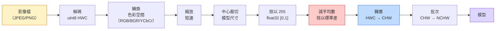
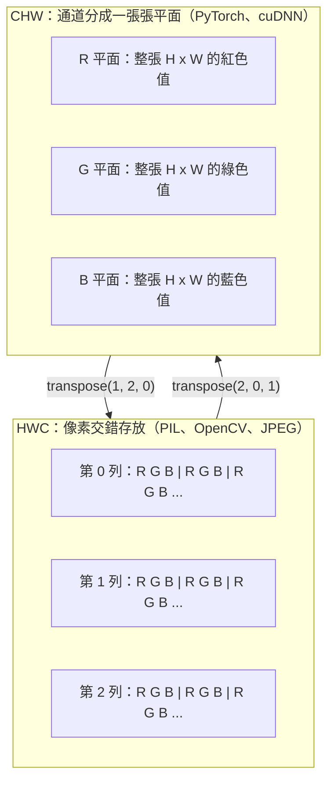

# 影像基礎：像素（pixel）、通道（channel）、色彩空間（color space）

> 一張影像是光線取樣（sampling）而成的張量（tensor）。你以後會用到的每一個視覺模型（model），都從這一件事實開始。

**Type:** Build
**Languages:** Python
**Prerequisites:** Phase 1 Lesson 12 (Tensor Operations), Phase 3 Lesson 11 (Intro to PyTorch)
**Time:** ~45 minutes

## Learning Objectives｜學習目標

- 說明連續場景怎麼被離散成像素，以及取樣和量化（quantization）的決定，怎麼為後面每一個模型設下天花板
- 把影像當成 NumPy 陣列來讀、切片、檢查，並在 HWC 和 CHW 兩種排列之間流利切換
- 在 RGB、灰階（grayscale）、HSV 和 YCbCr 之間轉換，並說明每種色彩空間為什麼存在
- 做像素層級的前處理：正規化（normalization）、標準化（standardization）、縮放、通道在前，而且要和預訓練（pretrained）的 PyTorch 視覺模型預期的完全一樣

## The Problem｜問題

你會讀的每一篇論文、會下載的每一組預訓練權重（weight）、會呼叫的每一個視覺 API，都假設輸入有一種特定的編碼。模型要的是 `float32`，你卻送進 `uint8` 影像，它還是會跑，而且靜靜地吐出垃圾。把 BGR 餵給在 RGB 上訓練的網路（network），準確率會掉十個百分點。模型要通道在前，你卻給通道在後，第一層卷積（convolution）會把高度當成一個特徵（feature）通道。這些都不會丟出錯誤。它們只是毀了你的指標（metric），然後你花一週去找一個其實藏在讀檔方式裡的 bug。

一旦你知道卷積在什麼東西上面滑，它就不複雜。難的是「一張影像」對相機、JPEG 解碼器、PIL、OpenCV、torchvision 和 CUDA 核心來說，意思都不一樣。每一套堆疊都有自己的軸順序、位元組範圍和通道慣例。視覺工程師如果分不清這些，送出去的就是壞掉的管線（pipeline）。

這一課把地基補上，後面這一階段才能往上蓋。上完你會知道像素是什麼、為什麼一個像素是三個數字不是一個、「用 ImageNet 統計做 normalize」實際在做什麼，以及怎麼在這一階段其他課都會假設的那兩三種排列之間移動。

## The Concept｜核心概念

### 一眼看完前處理管線

每一個正式環境的視覺系統，都是同一串可逆的變換。錯一步，模型看到的輸入就和它訓練時不一樣。



紅色和藍色那兩格，是 80% 沉默失敗的所在：少了標準化，或排列錯了。

### 像素是一個樣本（sample），不是一個方塊

相機感測器在數落在一小格一小格偵測器上的光子。每個偵測器累積零點幾秒的光，再發出和打到的光子數成正比的電壓。感測器接著把那個電壓離散成一個整數。一個偵測器變成一個像素。

```
Continuous scene                 Sensor grid                     Digital image
(infinite detail)                (H x W detectors)               (H x W integers)

    ~~~~~                        +--+--+--+--+--+                 210 198 180 155 120
   ~   ~   ~                     |  |  |  |  |  |                 205 195 178 152 118
  ~ light ~      ---->           +--+--+--+--+--+     ---->       200 190 175 150 115
   ~~~~~                         |  |  |  |  |  |                 195 185 170 148 112
                                 +--+--+--+--+--+                 188 180 165 145 108
```

這一步有兩個選擇，它們決定後面一切的天花板：

- **空間取樣** 決定場景每一度有幾個偵測器。太少，邊緣就變成鋸齒，也就是混疊（aliasing）。太多，儲存和算力就爆掉。
- **強度量化** 決定電壓被分成多細。8 位元有 256 階，是顯示器的標準。10、12、16 位元給出更平滑的漸層，對醫學影像、HDR 和原始感測器管線很重要。

像素不是一塊有面積的彩色方塊。它是一次測量。你縮放或旋轉時，是在對那張測量網格重新取樣。

### 為什麼是三個通道

一個偵測器數的是整個可見光譜的光子，那就是灰階。要得到色彩，感測器在網格上蓋一層紅、綠、藍濾鏡的馬賽克。去馬賽克（demosaicing）之後，每個空間位置有三個整數：附近紅濾鏡、綠濾鏡、藍濾鏡偵測器的反應。這三個整數就是一個像素的 RGB 三元組。

```
One pixel in memory:

    (R, G, B) = (210, 140, 30)   <- reddish-orange

An H x W RGB image:

    shape (H, W, 3)     stored as   H rows of W pixels of 3 values
                                    each in [0, 255] for uint8
```

三不是魔法。深度相機多一個 Z 通道。衛星多紅外和紫外波段。醫學掃描常常是一個通道，例如 X 光、CT，或很多個通道，例如高光譜。通道數是最後一軸。卷積層學會跨這一軸混合。

### 兩種排列慣例：HWC 和 CHW

同一個張量，兩種順序。每個函式庫（library）選一種。

```
HWC (height, width, channels)           CHW (channels, height, width)

   W ->                                    H ->
  +-----+-----+-----+                     +-----+-----+
H |R G B|R G B|R G B|                   C |R R R R R R|
| +-----+-----+-----+                   | +-----+-----+
v |R G B|R G B|R G B|                   v |G G G G G G|
  +-----+-----+-----+                     +-----+-----+
                                          |B B B B B B|
                                          +-----+-----+

   PIL, OpenCV, matplotlib,              PyTorch, most deep learning
   almost every image file on disk       frameworks, cuDNN kernels
```

CHW 存在，是因為卷積核在 H 和 W 上滑動。通道軸放在前面，每個核看到的是每個通道一塊連續的二維平面，向量化才乾淨。磁碟格式維持 HWC，因為那和感測器掃出來的掃描線一致。

你會打上千次的那一行轉換：

```
img_chw = img_hwc.transpose(2, 0, 1)      # NumPy
img_chw = img_hwc.permute(2, 0, 1)        # PyTorch tensor
```

記憶體排列，畫出來：



### 位元組範圍和 dtype

有三種慣例最常見：

| 慣例 | dtype | 範圍 | 你在哪裡看到 |
|------------|-------|-------|------------------|
| 原始 | `uint8` | [0, 255] | 磁碟上的檔案、PIL、OpenCV 的輸出 |
| 正規化後 | `float32` | [0.0, 1.0] | 在 `img.astype('float32') / 255` 之後 |
| 標準化後 | `float32` | 大約 [-2, +2] | 減掉平均數（mean）、除以標準差（standard deviation）之後 |

卷積網路是在標準化過的輸入上訓練的。ImageNet 統計 `mean=[0.485, 0.456, 0.406]`、`std=[0.229, 0.224, 0.225]`，是整個 ImageNet 訓練集三個通道的算術平均數和標準差，算在已經正規化到 [0, 1] 的像素上。把原始 `uint8` 送進一個預期標準化浮點數的模型，是應用視覺裡最常見的沉默失敗。

### 色彩空間，以及它們為什麼存在

RGB 是擷取格式，但對模型來說不一定是最有用的表示。

```
 RGB               HSV                       YCbCr / YUV

 R red             H hue (angle 0-360)       Y luminance (brightness)
 G green           S saturation (0-1)        Cb chroma blue-yellow
 B blue            V value/brightness (0-1)  Cr chroma red-green

 Linear to         Separates color from      Separates brightness from
 sensor output     brightness. Useful for    color. JPEG and most video
                   color thresholding, UI    codecs compress the chroma
                   sliders, simple filters   channels harder because the
                                             human eye is less sensitive
                                             to chroma detail than to Y.
```

多數現代 CNN 你餵的是 RGB。你會碰到其他空間的時候：

- **HSV**：傳統電腦視覺程式、依顏色分割、白平衡。
- **YCbCr**：讀 JPEG 內部、視訊管線、只在 Y 上運作的超解析度模型。
- **灰階**：OCR、文件模型，以及顏色是干擾變數、不是訊號的任何情況。

從 RGB 得到灰階是加權總和（weighted sum），不是平均，因為人眼對綠色比對紅或藍更敏感：

```
Y = 0.299 R + 0.587 G + 0.114 B       (ITU-R BT.601, the classic weights)
```

### 長寬比（aspect ratio）、縮放和內插（interpolation）

每個模型都有固定的輸入尺寸。多數 ImageNet 分類器是 224x224，較新的偵測器是 384x384 或 512x512。你的影像很少剛好符合。重要的三種縮放：

- **先縮短邊，再中心裁切**：標準的 ImageNet 作法。保留長寬比，丟掉邊緣的一條像素。
- **縮放再補邊**：保留長寬比和每一個像素，加上黑邊。偵測和 OCR 的標準作法。
- **直接縮到目標尺寸**：把影像拉長。便宜，幾何會變形，很多分類任務可以接受。

新網格和舊網格對不齊時，內插方法決定中間像素怎麼算：

```
Nearest neighbour     fastest, blocky, only choice for masks/labels
Bilinear              fast, smooth, default for most image resizing
Bicubic               slower, sharper on upscaling
Lanczos               slowest, best quality, used for final display
```

經驗法則：訓練用雙線性，你要看的素材用雙三次或 Lanczos，任何含有整數類別 ID 的東西用最近鄰。

```figure
conv-output-size
```

## Build It｜動手實作

### 步驟 1：做出影像張量，並檢查形狀

先用一張可重現的合成影像，這樣第一個實驗只靠 NumPy 就能離線跑。檔案解碼是另一道邊界：一旦 JPEG 或 PNG 解碼器回傳 RGB 位元組，下面每個張量運算都一樣。

```python
import numpy as np

def synthetic_rgb(h=128, w=192, seed=0):
    rng = np.random.default_rng(seed)
    yy, xx = np.meshgrid(np.linspace(0, 1, h), np.linspace(0, 1, w), indexing="ij")
    r = (np.sin(xx * 6) * 0.5 + 0.5) * 255
    g = yy * 255
    b = (1 - yy) * xx * 255
    rgb = np.stack([r, g, b], axis=-1) + rng.normal(0, 6, (h, w, 3))
    return np.clip(rgb, 0, 255).astype(np.uint8)

arr = synthetic_rgb()

print(f"type:   {type(arr).__name__}")
print(f"dtype:  {arr.dtype}")
print(f"shape:  {arr.shape}     # (H, W, C)")
print(f"min:    {arr.min()}")
print(f"max:    {arr.max()}")
print(f"pixel at (0, 0): {arr[0, 0]}")
```

預期輸出：`shape: (H, W, 3)`、`dtype: uint8`、範圍 `[0, 255]`。不管位元組來自相機、影像解碼器，還是這個合成產生器，這都是標準的解碼後表示。

### 步驟 2：拆開通道，並重排排列

分別取出 R、G、B，再從 HWC 轉成 PyTorch 用的 CHW。

```python
R = arr[:, :, 0]
G = arr[:, :, 1]
B = arr[:, :, 2]
print(f"R shape: {R.shape}, mean: {R.mean():.1f}")
print(f"G shape: {G.shape}, mean: {G.mean():.1f}")
print(f"B shape: {B.shape}, mean: {B.mean():.1f}")

arr_chw = arr.transpose(2, 0, 1)
print(f"\nHWC shape: {arr.shape}")
print(f"CHW shape: {arr_chw.shape}")
```

三張灰階平面，一個通道一張。CHW 只是重排軸。記憶體排列允許時，並不嚴格需要複製資料。

### 步驟 3：灰階和 HSV 轉換

加權總和的灰階，然後手動做 RGB 轉 HSV。

```python
def rgb_to_grayscale(rgb):
    weights = np.array([0.299, 0.587, 0.114], dtype=np.float32)
    return (rgb.astype(np.float32) @ weights).astype(np.uint8)

def rgb_to_hsv(rgb):
    rgb_f = rgb.astype(np.float32) / 255.0
    r, g, b = rgb_f[..., 0], rgb_f[..., 1], rgb_f[..., 2]
    cmax = np.max(rgb_f, axis=-1)
    cmin = np.min(rgb_f, axis=-1)
    delta = cmax - cmin

    h = np.zeros_like(cmax)
    mask = delta > 0
    argmax = np.argmax(rgb_f, axis=-1)
    rmax = mask & (argmax == 0)
    gmax = mask & (argmax == 1)
    bmax = mask & (argmax == 2)
    h[rmax] = ((g[rmax] - b[rmax]) / delta[rmax]) % 6
    h[gmax] = ((b[gmax] - r[gmax]) / delta[gmax]) + 2
    h[bmax] = ((r[bmax] - g[bmax]) / delta[bmax]) + 4
    h = h * 60.0

    s = np.divide(delta, cmax, out=np.zeros_like(delta), where=cmax > 0)
    v = cmax
    return np.stack([h, s, v], axis=-1)

gray = rgb_to_grayscale(arr)
hsv = rgb_to_hsv(arr)
print(f"gray shape: {gray.shape}, range: [{gray.min()}, {gray.max()}]")
print(f"hsv   shape: {hsv.shape}")
print(f"hue range: [{hsv[..., 0].min():.1f}, {hsv[..., 0].max():.1f}] degrees")
print(f"sat range: [{hsv[..., 1].min():.2f}, {hsv[..., 1].max():.2f}]")
print(f"val range: [{hsv[..., 2].min():.2f}, {hsv[..., 2].max():.2f}]")
```

色相以度數出來，飽和度和明度在 [0, 1]。這和 OpenCV 的 `hsv_full` 慣例一致。

### 步驟 4：正規化、標準化，再走回去

從原始位元組走到預訓練 ImageNet 模型預期的那一個張量，再走回來。

```python
mean = np.array([0.485, 0.456, 0.406], dtype=np.float32)
std = np.array([0.229, 0.224, 0.225], dtype=np.float32)

def preprocess_imagenet(rgb_uint8):
    x = rgb_uint8.astype(np.float32) / 255.0
    x = (x - mean) / std
    x = x.transpose(2, 0, 1)
    return x

def deprocess_imagenet(chw_float32):
    x = chw_float32.transpose(1, 2, 0)
    x = x * std + mean
    x = np.clip(x * 255.0, 0, 255).astype(np.uint8)
    return x

x = preprocess_imagenet(arr)
print(f"preprocessed shape: {x.shape}     # (C, H, W)")
print(f"preprocessed dtype: {x.dtype}")
print(f"preprocessed mean per channel:  {x.mean(axis=(1, 2)).round(3)}")
print(f"preprocessed std  per channel:  {x.std(axis=(1, 2)).round(3)}")

roundtrip = deprocess_imagenet(x)
max_diff = np.abs(roundtrip.astype(int) - arr.astype(int)).max()
print(f"roundtrip max pixel diff: {max_diff}    # should be 0 or 1")
```

每個通道的平均數應該接近 0，標準差接近 1。這一對前處理和還原，就是每個 torchvision `transforms.Normalize` 呼叫在底層做的事。

### 步驟 5：從頭做縮放

最近鄰把每個輸出座標捨入到一個來源像素。雙線性內插找出周圍四個像素，依距離混合。下面兩個實作都用端點對齊的座標，所以第一個和最後一個來源像素保持不動。

```python
def resize_coordinates(source_length, target_length):
    if target_length == 1:
        return np.zeros(1, dtype=np.float32)
    return np.linspace(0, source_length - 1, target_length, dtype=np.float32)

def nearest_resize(image, target_height, target_width):
    y = np.rint(resize_coordinates(image.shape[0], target_height)).astype(int)
    x = np.rint(resize_coordinates(image.shape[1], target_width)).astype(int)
    return image[y[:, None], x[None, :]]

def bilinear_resize(image, target_height, target_width):
    y = resize_coordinates(image.shape[0], target_height)
    x = resize_coordinates(image.shape[1], target_width)
    y0 = np.floor(y).astype(int)
    x0 = np.floor(x).astype(int)
    y1 = np.minimum(y0 + 1, image.shape[0] - 1)
    x1 = np.minimum(x0 + 1, image.shape[1] - 1)
    wy = (y - y0)[:, None, None]
    wx = (x - x0)[None, :, None]

    source = image.astype(np.float32)
    top = source[y0[:, None], x0[None, :]] * (1 - wx)
    top += source[y0[:, None], x1[None, :]] * wx
    bottom = source[y1[:, None], x0[None, :]] * (1 - wx)
    bottom += source[y1[:, None], x1[None, :]] * wx
    result = top * (1 - wy) + bottom * wy
    return np.clip(np.rint(result), 0, 255).astype(image.dtype)

target_height = arr.shape[0] * 3
target_width = arr.shape[1] * 3
nearest = nearest_resize(arr, target_height, target_width)
bilinear = bilinear_resize(arr, target_height, target_width)

def local_roughness(x):
    gy = np.diff(x.astype(float), axis=0)
    gx = np.diff(x.astype(float), axis=1)
    return float(np.abs(gy).mean() + np.abs(gx).mean())

for name, out in [("nearest", nearest), ("bilinear", bilinear)]:
    print(f"{name:>8}  shape={out.shape}  roughness={local_roughness(out):6.2f}")
```

最近鄰的粗糙度最高，因為它保留硬邊。雙線性比較平滑，因為每個新像素在每個軸上混合兩個位置。可執行的配套程式把同一個可分離的想法延伸到每個軸四個鄰居，用 Catmull-Rom 三次核，再把三種結果都印出來，不靠影像函式庫。

## Use It｜實際應用

PyTorch 在帶批次、知道裝置（device）的張量上做同樣的運算。下面的程式把短邊縮放、取中心裁切、逐通道標準化，並產出預訓練模型預期的 NCHW 張量。

```python
import torch
import torch.nn.functional as F

image_hwc = torch.from_numpy(synthetic_rgb(256, 320))
batch = image_hwc.permute(2, 0, 1).unsqueeze(0).float() / 255.0

height, width = batch.shape[-2:]
scale = 256 / min(height, width)
resized_height = round(height * scale)
resized_width = round(width * scale)
batch = F.interpolate(
    batch,
    size=(resized_height, resized_width),
    mode="bilinear",
    align_corners=False,
    antialias=True,
)

top = (resized_height - 224) // 2
left = (resized_width - 224) // 2
batch = batch[:, :, top:top + 224, left:left + 224]

mean = torch.tensor([0.485, 0.456, 0.406]).view(1, 3, 1, 1)
std = torch.tensor([0.229, 0.224, 0.225]).view(1, 3, 1, 1)
batch = (batch - mean) / std

print(f"tensor dtype: {batch.dtype}")
print(f"batched shape: {tuple(batch.shape)}")
print(f"per-channel mean: {batch.mean(dim=(0, 2, 3)).tolist()}")
print(f"per-channel std:  {batch.std(dim=(0, 2, 3)).tolist()}")
```

四步，順序就是這樣：把位元組轉成浮點數並把 HWC 換成 NCHW，把短邊縮到 256，取 224x224 的中心裁切，再減掉 ImageNet 平均數、除以它的標準差。把這個順序倒過來，送到模型的東西會靜靜地變掉。

## Ship It｜交付成果

本課會產出：

- `outputs/prompt-vision-preprocessing-audit.md`：一份 prompt，把任何模型卡或資料集（dataset）卡變成一份清單，列出團隊必須遵守的前處理不變量
- `outputs/skill-image-tensor-inspector.md`：一項技能，給它任何影像形狀的張量或陣列，回報 dtype、排列、範圍，以及它看起來是原始、正規化後，還是標準化後

## Exercises｜練習

1. **（簡單）** 做一個 2x2 的 RGB `uint8` 陣列，四個顏色都不一樣。把 HWC 轉成 CHW 再轉回來，印出兩種形狀，並證明來回之後每個值都還在。
2. **（中等）** 寫 `standardize(img, mean, std)` 和它的反函式，兩者一起要在任何 uint8 影像上讓 `roundtrip_max_diff <= 1` 成立。你的函式必須用同一次呼叫，就能處理 HWC 的單張影像，以及 NCHW 的一個批次（batch）。
3. **（困難）** 拿一個 3 通道、已經用 ImageNet 標準化的張量，送進一個 1x1 卷積，讓它把 RGB 學成加權混合後的單一灰階通道。權重初始化成 `[0.299, 0.587, 0.114]`，凍結它們，並驗證輸出和你手動的 `rgb_to_grayscale` 在浮點誤差之內吻合。還有哪些傳統的色彩空間變換，可以寫成 1x1 卷積？

## Key Terms｜關鍵術語

| 術語 | 常見說法 | 實際意義 |
|------|----------------|----------------------|
| 像素 | 「一塊彩色方塊」 | 網格上一個位置的一次光強度樣本。彩色是三個數字，灰階是一個 |
| 通道 | 「那個顏色」 | 疊進影像張量的平行空間網格之一。HWC 裡是最後一軸，CHW 裡是第一軸 |
| HWC / CHW | 「那個形狀」 | 影像張量的軸順序。磁碟和 PIL 用 HWC，PyTorch 和 cuDNN 用 CHW |
| 正規化 | 「把影像縮放」 | 除以 255，讓像素落在 [0, 1]。必要，但還不夠 |
| 標準化 | 「把中心放到 0」 | 逐通道減平均數、除以標準差，讓輸入分布和模型訓練時一致 |
| 灰階轉換 | 「把通道平均」 | 係數 0.299/0.587/0.114 的加權總和，對應人眼對亮度的感受 |
| 內插 | 「縮放怎麼挑像素」 | 新網格和舊網格對不齊時，決定輸出值的規則。標籤用最近鄰，訓練用雙線性，顯示用雙三次 |
| 長寬比 | 「寬除以高」 | 這個比值分開「縮放再補邊」和「縮放再拉長」 |

## Further Reading｜延伸閱讀

- [Charles Poynton — A Guided Tour of Color Space](https://web.archive.org/web/20251220000525/https://poynton.ca/PDFs/Guided_tour.pdf) ——為什麼有這麼多色彩空間、各自什麼時候要緊，寫得最清楚的技術說明
- [PyTorch Vision Transforms Docs](https://pytorch.org/vision/stable/transforms.html) ——你在正式環境真正會組合起來的那整條變換管線
- [How JPEG Works (Colt McAnlis)](https://www.youtube.com/watch?v=F1kYBnY6mwg) ——色度次取樣、DCT，以及 JPEG 為什麼編成 YCbCr 而不是 RGB，一趟看得很清楚的視覺導覽
- [ImageNet Preprocessing Conventions (torchvision models)](https://pytorch.org/vision/stable/models.html) ——`mean=[0.485, 0.456, 0.406]` 的依據，以及為什麼模型庫裡每個模型都預期它
